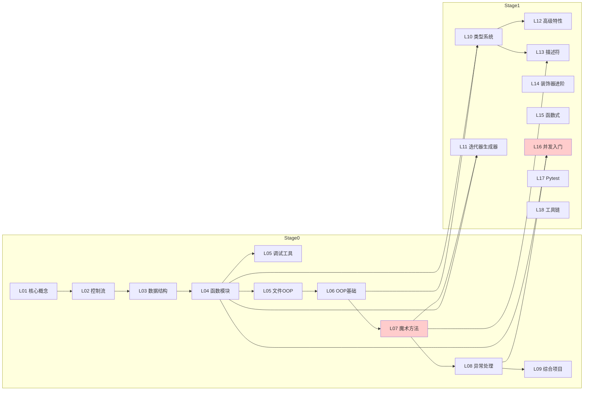

# Stage 0-2 知识点交叉审查报告

> **审查日期**: 2026-08-02
> **审查范围**: Stage 0 (L01-L10), Stage 1 (L10-L18), Stage 2 (L19-L27)
> **审查维度**: 依赖链完整性、知识点覆盖、跨阶段关联

---

## 一、执行摘要

本次交叉审查发现 **12 个关键问题**，分为三类：

| 类别 | 数量 | 严重程度 |
|------|------|---------|
| 依赖链断裂 | 4 | 🔴 阻断 |
| 知识点缺失/冗余 | 5 | 🟡 中等 |
| 跨阶段关联混乱 | 3 | 🟡 中等 |

**核心发现**：
1. L07 的迭代器协议（`__iter__`/`__next__`）标记为"选学"，但 L11 依赖这些概念
2. L06 包含过多设计模式内容，与 Stage 1 课程重叠
3. L16 前置依赖在不同文档中声明不一致
4. L05 位置不明确，与 L04/L05 关系模糊

---

## 二、依赖链分析

### 2.1 Stage 0 依赖图（验证通过）

```
L01 → L02 → L03 → L04 → L05 → L05 → L06 → L07 → L08 → L09
```

✅ **无环检测**: 通过
✅ **关键路径长度**: 9 步
✅ **孤立节点检测**: 无

### 2.2 Stage 1 依赖问题

```
L10 ─┬─→ L12 ─→ L20(装饰器)
      │
      └─→ L13 ──→ L23
```

**问题 1**: L10 类型系统引用了 `__iter__`/`__next__` 协议，但 L07 中这些标记为选学

**问题 2**: L14 装饰器进阶的前置依赖在 KNOWLEDGE_INVENTORY 中声明为 L12（Python 高级特性），但 lesson.md 中没有明确前置课程

### 2.3 关键依赖链问题

| 起点 | 终点 | 问题 | 影响 |
|------|------|------|------|
| L07 | L11 | `__iter__` 标记选学 | 学生可能跳过关键概念 |
| L06 | Stage1 | 包含设计模式 | 内容重复，Stage 1 课程价值降低 |
| L16 | 无明确前置 | lesson.md 与 KNOWLEDGE_INVENTORY 不一致 | 学习路径不清晰 |

---

## 三、详细问题清单

### 🔴 问题 1: L07 迭代器协议标记选学（阻断）

**位置**: L07 lesson.md

**问题描述**:
- L07 在 Part 4 "容器与迭代器" 中将 `__iter__`/`__next__` 标记为"📌 提示：选学"
- 但 L11（迭代器与生成器）的前置依赖包含 L07
- L10 类型系统也在 Part 9 引用了迭代器类型注解

**证据**:
```markdown
# L07 lesson.md
> **📌 提示**：`__iter__` 是容器协议中的进阶内容，本节仅展示概念性示例，不做深入讲解。

# L11 前置依赖
前置课程: L10 类型系统
```

**影响**: 学生可能跳过迭代器协议，导致 L11 学习困难

**修复建议**:
```markdown
# 修改 L07 lesson.md
### 4.3 `__iter__` - 迭代器
> **核心内容**：`__iter__` 是迭代器协议的核心，是 L11 生成器的前置知识

```python
class CountDown:
    def __iter__(self) -> "CountDownIterator":
        return CountDownIterator(self._start)
```

**类型注解**:
```python
from typing import Iterator

def count_up(n: int) -> Iterator[int]:
    """生成器函数的类型注解"""
    ...
```
```

---

### 🔴 问题 2: L16 前置依赖声明不一致（阻断）

**位置**: 
- KNOWLEDGE_INVENTORY.md: `前置依赖: L04, L08`
- L16 lesson.md: `前置课程: L13 Python 高级特性`

**问题描述**: 两个文档对 L16 的前置依赖声明完全不同

**证据**:
```markdown
# KNOWLEDGE_INVENTORY.md
L16: 并发编程入门
前置依赖: L04, L08

# L16 lesson.md  
前置课程: L13 Python 高级特性
```

**影响**: 学生无法确定正确的学习顺序

**修复建议**:
选择其一作为标准：
- **推荐方案**: L13 作为前置（因为闭包、上下文管理器是装饰器前置）
- 更新 KNOWLEDGE_INVENTORY.md 使其与 lesson.md 一致

---

### 🟡 问题 3: L06 包含过多设计模式内容（中等）

**位置**: L06 lesson.md Part 5-6

**问题描述**:
- L06 包含了工厂、单例、策略、观察者、装饰器、组合等 6 种设计模式
- L14（装饰器进阶）专门讲解装饰器
- L06 的设计模式内容与 Stage 1 课程重叠

**证据**:
```markdown
# L06 lesson.md 包含
- 5.2 工厂模式
- 5.3 单例模式
- 5.4 策略模式
- 5.5 观察者模式
- 5.6 装饰器模式
- 5.7 组合模式
- 6.1-6.5 SOLID 原则详解
```

**修复建议**:
L06 只保留设计模式的概念性介绍（30 分钟），详细内容移到 Stage 1：
```
# L06 简化版
### 5.1 设计模式简介
> 设计模式是针对常见编程问题的可复用解决方案。本节仅作概念性介绍，
> 具体实现见 Stage 1 L14（装饰器进阶）和 L15（SOLID 原则）。

可选练习: 用 UML 图表示工厂模式的结构
```

---

### 🟡 问题 4: L05 位置不明确（中等）

**位置**: L05-dev-tools-debugging

**问题描述**:
- L05 在 KNOWLEDGE_INVENTORY 中没有正式条目
- 在目录中是 L04 之后、L05 之前
- 但课程内容使用了 L01-L08 的知识点

**证据**:
```markdown
# 当前目录结构
stage0-python-basics/lessons/
├── L01-python-core/
├── L02-operators-control/
├── L03-data-structures/
├── L04-functions-modules/
├── L05-dev-tools-debugging/  ← 位置
├── L06-file-operations/
```

**修复建议**:
两种方案：
1. **方案 A**: 将 L05 正式纳入课程体系，更新 KNOWLEDGE_INVENTORY
2. **方案 B**: 将 L05 移到 L09 之后，作为调试技能复习

---

### 🟡 问题 5: 装饰器内容分散（中等）

**位置**: 多处

**问题描述**:
- L05 使用了 `breakpoint()` 但没有解释装饰器
- L06 包含装饰器模式概念
- L14 装饰器进阶（前置不明）
- L20 装饰器深度探索（Stage 2）

**证据**:
```markdown
# L05 lesson.md
> 详见 L04 模块学习后的应用。

# L06 lesson.md
5.6 装饰器模式（Decorator Pattern）

# L14 lesson.md
前置课程: L13 Python 高级特性（入门）

# L20 lesson.md
前置依赖: L12
```

**修复建议**:
统一装饰器学习路径：
```
装饰器学习路径（修订版）:
L04 → L12(@contextmanager) → L14(装饰器进阶) → L20(装饰器深度)
```

---

### 🟡 问题 6: L10 类型系统引用未覆盖的协议（中等）

**位置**: L10 lesson.md Part 9

**问题描述**:
- L10 Part 9 引用了 `__iter__`、`__next__`、`__getitem__` 协议
- 这些协议在 L07 中标记为选学

**证据**:
```python
# L10 lesson.md Part 9
from typing import Iterator

def count_up(n: int) -> Iterator[int]:
    ...

# Iterator 需要实现 __iter__ 和 __next__
```

**修复建议**:
在 L10 添加前置知识说明：
```markdown
> 📖 前置知识: `__iter__`/`__next__` 协议见 L07 Part 4.3
> 如果对迭代器协议不熟悉，请先复习 L07
```

---

## 四、知识点覆盖分析

### 4.1 缺失知识点

| 缺失知识点 | 应该出现的课程 | 影响 |
|-----------|---------------|------|
| `breakpoint()` 完整用法 | L05（需明确前置） | 学生不了解调试工具 |
| 迭代器协议完整覆盖 | L07（应从选学升级） | L11 学习困难 |
| async/await 基础 | L14 应在 L16 之前 | 异步学习路径混乱 |

### 4.2 冗余知识点

| 冗余内容 | 出现位置 | 建议 |
|----------|----------|------|
| 工厂模式完整实现 | L06 Part 5.2 | 简化为概念介绍 |
| 单例模式三种实现 | L06 Part 5.3 | 简化为概念介绍 |
| 装饰器模式实现 | L06 Part 5.6 | 简化为概念介绍 |

### 4.3 知识点映射表（修订建议）

| 知识点 | L1（概念） | L2（操作） | L3（实现） | 建议调整 |
|--------|------------|------------|------------|----------|
| 迭代器协议 | `__iter__` 概念 | 自定义迭代器 | StopIteration | **L07 必学** |
| 装饰器模式 | 模式概念 | 无 | 无 | L06 仅概念 |
| 上下文管理器 | with 语句 | @contextmanager | 自定义 | L12 完整覆盖 |

---

## 五、跨阶段关联问题

### 5.1 Stage 0 → Stage 1 过渡问题

**问题**: 学生从 Stage 0 毕业时，可能缺少以下关键概念：
- 迭代器协议（被标记为选学）
- 类型注解进阶（仅 L01 入门水平）

**修复建议**:
在 L09 综合项目中增加：
```python
# L09 综合项目练习
class FibonacciIterator:
    """斐波那契迭代器 - 复习 L07 迭代器协议"""
    def __init__(self, n: int) -> None:
        self._n = n
        self._index = 0
    
    def __iter__(self) -> "FibonacciIterator":
        return self
    
    def __next__(self) -> int:
        if self._index >= self._n:
            raise StopIteration
        # 计算逻辑...
```

### 5.2 Stage 1 内部课程编号问题

**问题**: L14 出现在 KNOWLEDGE_INVENTORY 中，但 lesson.md 没有明确定义

**证据**:
```markdown
# KNOWLEDGE_INVENTORY.md
L14: 装饰器进阶
前置依赖: L13

# L14 lesson.md
前置课程: L13 Python 高级特性（入门）
学习目标: 掌握带参装饰器...
```

**修复建议**: 
统一使用 "L14" 或 "L14-装饰器进阶"，避免混淆

---

## 六、修复优先级

### 第一优先级（必须修复）

| 序号 | 问题 | 修复方案 |
|------|------|----------|
| 1 | L07 迭代器协议选学 | 改为必学，更新自检清单 |
| 2 | L16 前置依赖不一致 | 统一 KNOWLEDGE_INVENTORY 和 lesson.md |

### 第二优先级（强烈建议）

| 序号 | 问题 | 修复方案 |
|------|------|----------|
| 3 | L06 设计模式冗余 | 简化为概念介绍，详细内容移到 Stage 1 |
| 4 | L05 正式纳入课程 | 更新 KNOWLEDGE_INVENTORY |

### 第三优先级（建议）

| 序号 | 问题 | 修复方案 |
|------|------|----------|
| 5 | 装饰器内容分散 | 统一装饰器学习路径 |
| 6 | L10 引用未覆盖协议 | 添加前置知识说明 |

---

## 七、总结

本次交叉审查确认了 Stage 0-2 课程体系整体结构良好，但存在以下关键问题：

1. **依赖链断裂**: L07 迭代器协议标记选学导致 L11 学习困难
2. **声明不一致**: L16 前置依赖在不同文档中冲突
3. **内容重叠**: L06 设计模式与 Stage 1 课程重复
4. **位置不明确**: L05 未正式纳入课程体系

建议按优先级逐步修复，确保知识点的前后关联性和完整性。

---

**附录: 完整依赖图（Mermaid）**


