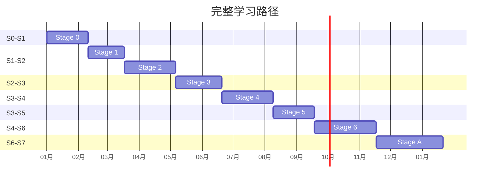

# Python 3.13 全栈课程 — 学习路径规划

> **文档版本**: v2.0
> **创建日期**: 2026-07-21
> **更新日期**: 2026-07-24（v2.1:
> **范围**: Stage 0-6 + Stage A/P/K/M/R（L01-L65, A01-A20, S01-S09, K01-K05, M01-M08, R01-R10）
> **维护者**: Python 3.13 全栈课程组

---

## 一、路径概览

### 1.1 三种学习路径

| 路径 | 适合人群 | 学时 | 课程数 |
|------|----------|------|--------|
| **完整通道** | 零基础，系统学习 | ~455h | 85 课 |
| **快速通道** | 有编程基础，快速上手 | ~180h | 35 课 |
| **专项通道** | 目标明确，深耕方向 | ~150h | 30 课 |

---

## 二、完整通道（零基础 → 专家）

### 2.1 阶段划分



### 2.2 里程碑节点

| 里程碑 | 完成课程 | 能力等级 | 可完成项目 |
|--------|----------|----------|------------|
| **入门** | L01-L10 | S1 | 简单脚本、自动化办公 |
| **进阶** | L10-L25 | S2 | CLI 工具、代码规范 |
| **全栈** | L26-L35 | S3 | 博客、Todo 应用 |
| **企业** | L36-L46 | S4 | 电商后端、实时聊天 |
| **数据** | L47-L53 | S5 | 日志分析、报表生成 |
| **AI** | L54-L65 | S6 | RAG 问答、Agent 助手 |
| **专家** | A01-A20 | S7 | 企业级 Agent 系统 |

### 2.3 周学习建议

| 周次 | 内容 | 建议投入 |
|------|------|----------|
| 第 1-4 周 | Stage 0 | 每天 2h |
| 第 5-7 周 | Stage 1 | 每天 2h |
| 第 8-14 周 | Stage 2 | 每天 3h |
| 第 15-19 周 | Stage 3 | 每天 3h |
| 第 20-25 周 | Stage 4 | 每天 3h |
| 第 26-29 周 | Stage 5 | 每天 2h |
| 第 30-39 周 | Stage 6 | 每天 2h |
| 第 40-49 周 | Stage A | 每天 2h |

---

## 三、快速通道（有 Python 基础）

### 3.1 适用条件

- 有其他语言编程经验
- 了解基本的数据结构和算法
- 时间有限，希望快速上手

### 3.2 学习路径

```
Stage 2 (L17-L25) → Stage 3 (L26-L35) → Stage 4 (L36-L46) → Stage 5 (L47-L52) → Stage 6 (L54-L65)
```

| 阶段 | 课程 | 核心技能 | 建议时间 |
|------|------|----------|----------|
| **工程化** | L17-L25 | 测试、类型、异步 | 2 周 |
| **Web 基础** | L26-L35 | FastAPI、数据库 | 2 周 |
| **Web 进阶** | L36-L46 | 安全、性能、微服务 | 3 周 |
| **数据** | L47-L52 | Pandas、向量检索 | 1 周 |
| **AI Agent** | L54-L65 | LangChain、RAG | 2 周 |

### 3.3 速查知识点

| 课程 | 必须掌握的知识点 |
|------|------------------|
| L17 Pytest | fixture, Mock, parametrize |
| L18 工具链 | uv, ruff, mypy |
| L19 异步 | async/await, asyncio.run() |
| L26 HTTP | GET/POST, 状态码, Headers |
| L27 FastAPI | @app.get, Pydantic, Depends |
| L28 SQL | SELECT, JOIN, GROUP BY |
| L29 ORM | SQLAlchemy, AsyncSession |
| L36 背压 | Semaphore, 限流, 熔断 |
| L42 缓存 | Redis, TTL, 分布式锁 |
| L47 NumPy | 数组, 广播, 向量化 |
| L50 Pandas | DataFrame, groupby, merge |
| L54 LangGraph | StateGraph, 条件边 |
| L55 LangChain | LCEL, PromptTemplate |
| L65 RAG | 向量嵌入, 相似度检索 |

---

## 四、专项通道

### 4.1 AI Agent 专项

```
推荐路径: L36-L46 → L47-L52 → L54-L65 → A01-A20
```

| 阶段 | 课程 | 核心技能 |
|------|------|----------|
| **Web 基础** | L36-L46 | 构建 API 服务 |
| **数据基础** | L47-L52 | 数据处理、向量化 |
| **Agent 基础** | L54-L65 | LangChain、工具调用、RAG |
| **Agent 进阶** | A01-A20 | 架构模式、安全、成本控制 |

**典型项目**：
- RAG 知识库问答系统
- 多 Agent 协作助手
- 企业内部知识助手

**预计学时**：~150h

---

### 4.2 数据工程专项

```
推荐路径: L28-L30 → L47-L50 → L51-L53
```

| 阶段 | 课程 | 核心技能 |
|------|------|----------|
| **SQL 基础** | L28-L30 | 数据查询、优化 |
| **NumPy/Pandas** | L47-L50 | 数据处理、分析 |
| **数据管道** | L51-L53 | ETL、OLAP |

**典型项目**：
- 日志分析平台
- 数据报表生成器
- 实时数据大屏

**预计学时**：~120h

---

### 4.3 DevOps 专项

```
推荐路径: L31 → L36-L46 → Stage K (K01-K05)
```

| 阶段 | 课程 | 核心技能 |
|------|------|----------|
| **Docker** | L31 | 容器化基础 |
| **Web 进阶** | L36-L46 | 微服务架构 |
| **K8s** | K01-K05 | 容器编排 |

**典型项目**：
- 微服务部署平台
- CI/CD 流水线
- 监控告警系统

**预计学时**：~130h

---

### 4.4 Web 全栈专项

```
推荐路径: L17-L25 → L26-L46 → L31 → L39
```

| 阶段 | 课程 | 核心技能 |
|------|------|----------|
| **工程化** | L17-L25 | 规范代码 |
| **Web 基础** | L26-L35 | CRUD 应用 |
| **Web 进阶** | L36-L46 | 高并发、安全 |
| **测试** | L39 | E2E 测试 |

**典型项目**：
- 博客系统
- 电商后端 API
- 实时聊天应用

**预计学时**：~180h

---

## 五、常见学习误区

### 5.1 跳过基础

```
❌ 直接学 FastAPI
❌ 直接学 LangChain
❌ 直接学微服务

✅ 先学 Python 基础 → 再学异步 → 再学 Web
```

**原因**：跳过基础会导致后续学习困难，调试能力弱。

---

### 5.2 理论脱离实践

```
❌ 只看不练
❌ 只做课后习题
❌ 不写项目

✅ 每个阶段完成一个小项目
✅ 积极参与开源
✅ 代码 Code Review
```

**建议**：学完每个 Stage 后，动手实现一个完整项目。

---

### 5.3 追求速度忽视深度

```
❌ 一天看 10 课
❌ 跳着看、不做笔记
❌ 囫囵吞枣

✅ 每天 1-2 课
✅ 做好笔记和总结
✅ 深度理解核心概念
```

**建议**：宁可慢一点，也要理解透。

---

### 5.4 忽视测试和工程化

```
❌ 不写测试
❌ 不做类型检查
❌ 不遵守代码规范

✅ TDD 开发
✅ mypy 严格模式
✅ ruff linting
```

**原因**：测试和工程化是区分"会写代码"和"工程化代码"的关键。

---

### 5.5 孤立学习

```
❌ 一个人闷头学
❌ 不交流、不讨论

✅ 加入学习社区
✅ 结对学习
✅ 参与代码审查
```

**建议**：找到学习伙伴，互相监督和讨论。

---

## 六、学习效率优化

### 6.1 费曼学习法

1. 学习一个概念
2. 尝试用自己的话向他人解释
3. 发现理解不清的地方，回头复习
4. 简化语言，确保完全理解

### 6.2 间隔重复

- 第 1 天：学习新内容
- 第 3 天：复习并做练习
- 第 7 天：综合应用
- 第 30 天：项目实战

### 6.3 主动回忆

- 看完一课后，合上电脑回忆核心内容
- 尝试手写代码，不依赖 IDE 自动补全
- 定期自测，检查知识掌握程度

---

## 七、配套资源

### 7.1 官方资源

| 资源 | 链接 | 说明 |
|------|------|------|
| 课程代码 | `examples/` 目录 | 可运行的示例 |
| 练习题 | `exercises/` 目录 | 巩固练习 |
| 测试用例 | `tests/` 目录 | 验证理解 |
| 文档 | `docs/` 目录 | 深入参考 |

### 7.2 外部资源

| 资源 | 用途 |
|------|------|
| Python 官方文档 | 语法参考 |
| FastAPI 文档 | Web 开发 |
| LangChain 文档 | AI 开发 |
| Hugging Face | 模型托管 |

---

## 版本历史

| 版本 | 日期 | 变更 |
|------|------|------|
| v1.0 | 2026-07-21 | 初始版本 |
