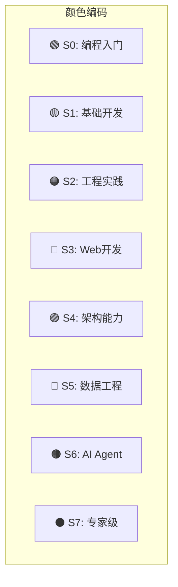
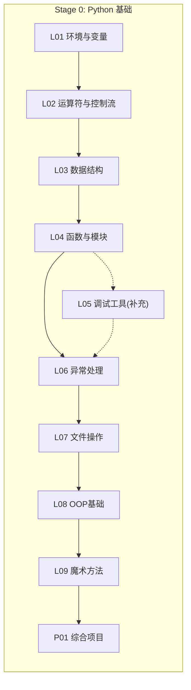
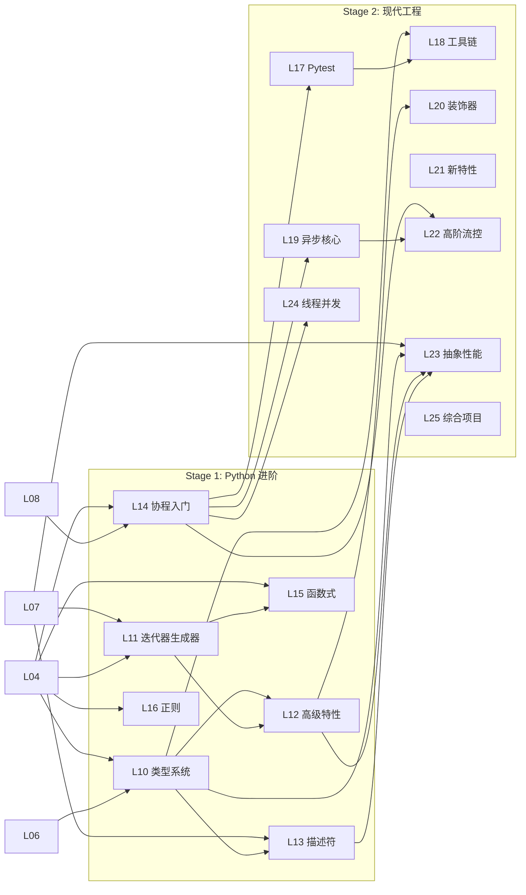
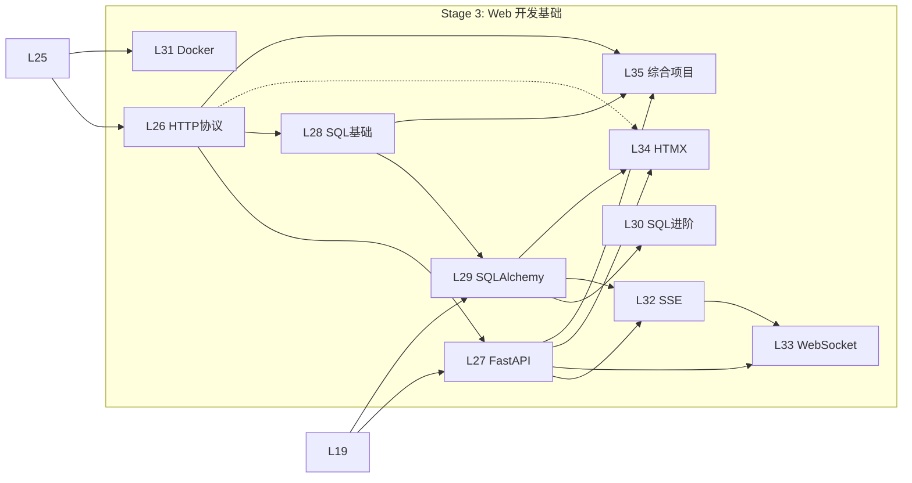
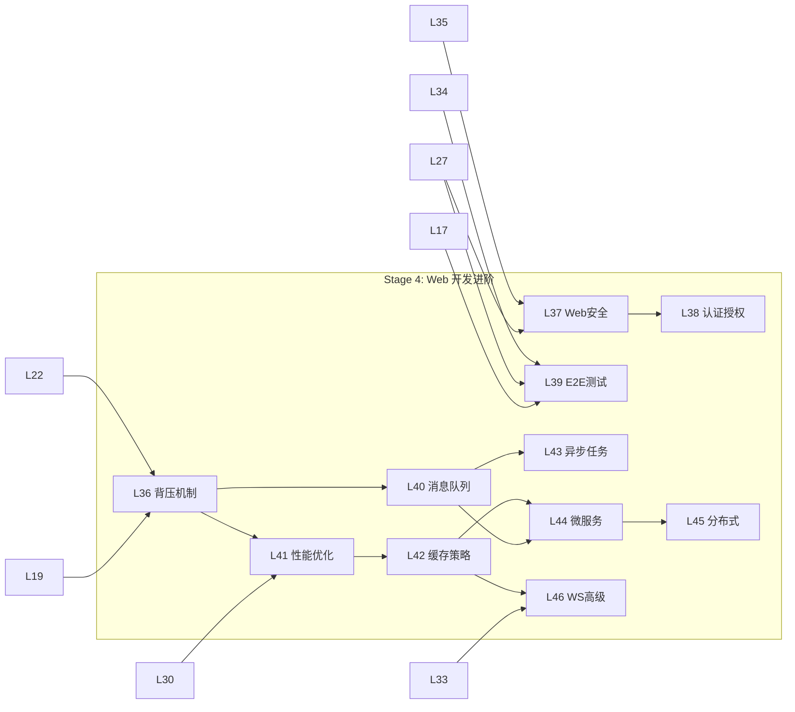
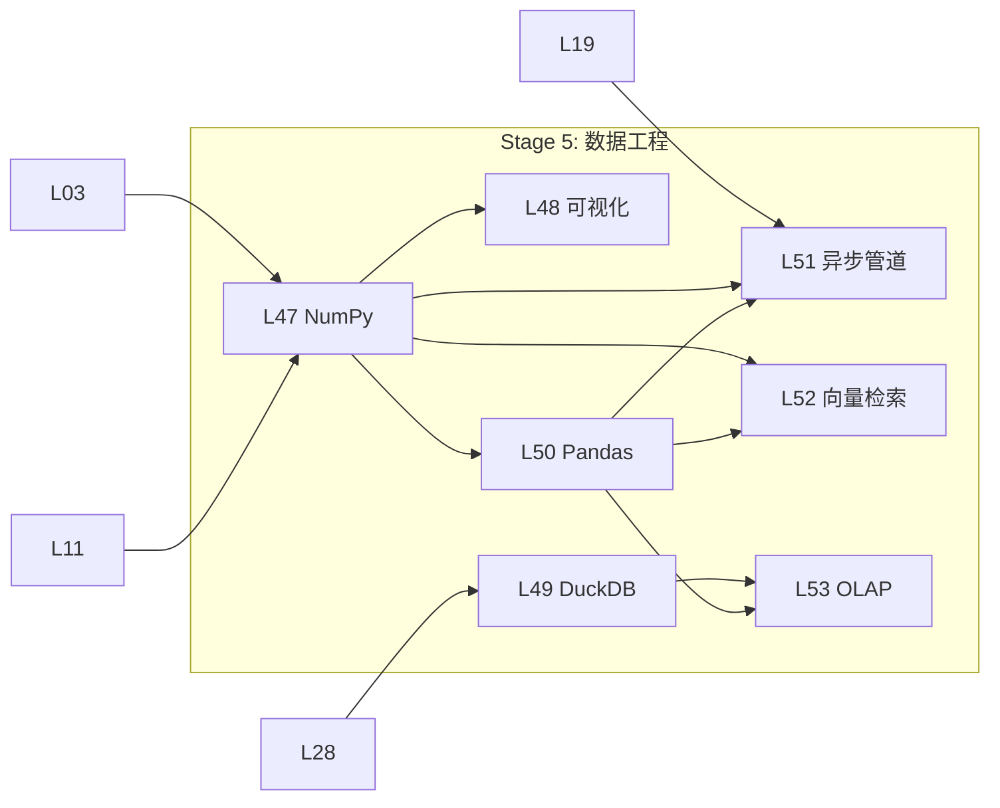
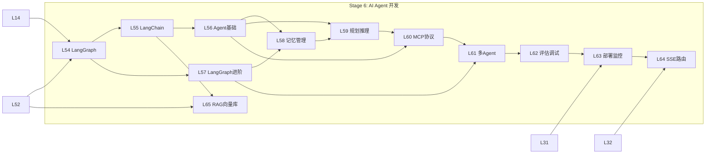
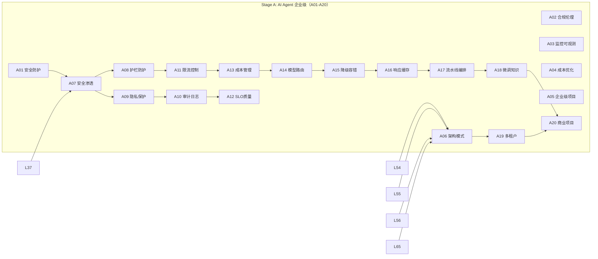
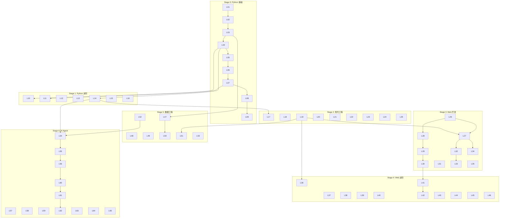

# Python 3.13 全栈课程 — 知识点依赖图（DAG）

> **文档版本**: v2.0
> **创建日期**: 2026-07-21
> **更新日期**: 2026-07-24（v2.1:
> **范围**: Stage 0-6 + Stage A（L01-L65, A01-A20）
> **工具**: Mermaid

---

## 一、依赖图说明

### 1.1 图例



### 1.2 依赖类型

| 类型 | 符号 | 说明 |
|------|------|------|
| **硬依赖** | `A --> B` | 必须先学 A 才能学 B |
| **软依赖** | `A -.-> B` | 建议先学 A，不强制 |
| **跨阶段** | `A -.->|S3→S4| B` | 跨能力阶段依赖 |

---

## 二、能力阶段关键路径

### 2.1 S0 → S1 关键路径（Stage 0）



**S0 → S1 关键路径长度**: 9 步（不含 L05 补充课）

> **说明**: L05 是补充课程，标记为软依赖（虚线），不影响主线学习进度。

---

### 2.2 S1 → S2 关键路径（Stage 1-2）



**S1 → S2 关键路径长度**: 18 步

---

### 2.3 S2 → S3 关键路径（Stage 3）



**S2 → S3 关键路径长度**: 14 步（含 Stage 2 基础）

---

### 2.4 S3 → S4 关键路径（Stage 4）



**S3 → S4 关键路径长度**: 22 步

---

### 2.5 S3 → S5 关键路径（Stage 5）



**S3 → S5 关键路径长度**: 16 步

---

### 2.6 S4 → S6 关键路径（Stage 6）



**S4 → S6 关键路径长度**: 30 步

---

### 2.7 S6 → S7 关键路径（Stage A）



**S6 → S7 关键路径长度**: 40 步

---

## 三、跨 Stage 依赖总图



---

## 四、关键路径分析

### 4.1 最长依赖链

```
L01 → L02 → L03 → L04 → L14 → L19 → L27 → L36 → L40 → L43 → L54 → L55 → L56 → L60 → L61 → L62 → A01 → A06 → A20
```

**最长链长度**: 18 步

### 4.2 并行分支

| 分支 | 路径 | 说明 |
|------|------|------|
| **Web 方向** | L01→...→L35→L46 | CRUD → 高并发 |
| **数据方向** | L01→...→L52→L65 | 数据 → RAG |
| **并发方向** | L01→...→L19→L22→L36 | 异步 → 背压 |
| **AI Agent** | L54→...→A01→A06→A20 | Agent → 企业级 |

### 4.3 软依赖节点

| 课程 | 软依赖 | 说明 |
|------|--------|------|
| L27 FastAPI | L14 协程 | 建议但非必须 |
| L52 向量检索 | L50 Pandas | 建议但非必须 |
| L61 多Agent | L57 LangGraph进阶 | 建议但非必须 |

---

## 五、DAG 验证结果

| 检查项 | 结果 | 说明 |
|--------|------|------|
| **环检测** | ✅ 通过 | 无循环依赖 |
| **深度检测** | ✅ 通过 | 最长链 20 步 ≤ 25 |
| **孤立检测** | ✅ 通过 | 所有节点都有连接 |
| **并行分支** | ✅ 3 条 | Web/数据/并发 |

---

## 六、学习路径建议

### 6.1 完整路径（按能力阶段）

```
S0 → S1: Stage 0 (9 课, ~40h)
S1 → S2: Stage 1-2 (16 课, ~85h)
S2 → S3: Stage 3 (10 课, ~45h)
S3 → S4: Stage 4 (11 课, ~50h)
S3 → S5: Stage 5 (7 课, ~40h)
S4 → S6: Stage 6 (17 课, ~60h)
S6 → S7: Stage A (15 课, ~65h)
```

### 6.2 快速路径（有基础）

```
推荐: Stage 2 → Stage 3 → Stage 4 → Stage 5 → Stage 6
时间: ~240h
```

### 6.3 AI Agent 专项路径

```
推荐: Stage 4 → Stage 5(L47-L52) → Stage 6 → Stage A
时间: ~185h
```

---

## 版本历史

| 版本 | 日期 | 变更 |
|------|------|------|
| v1.0 | 2026-07-21 | 初始版本 |
