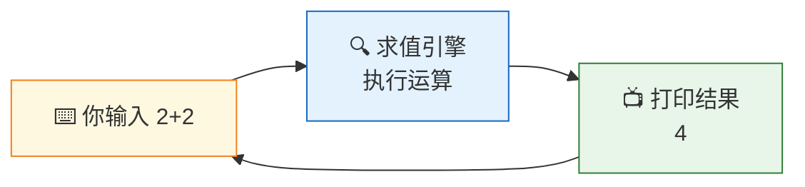
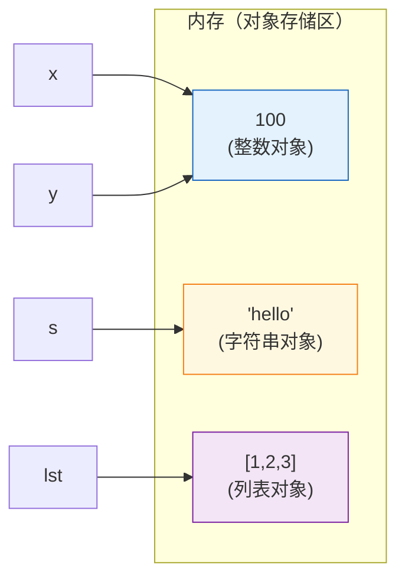
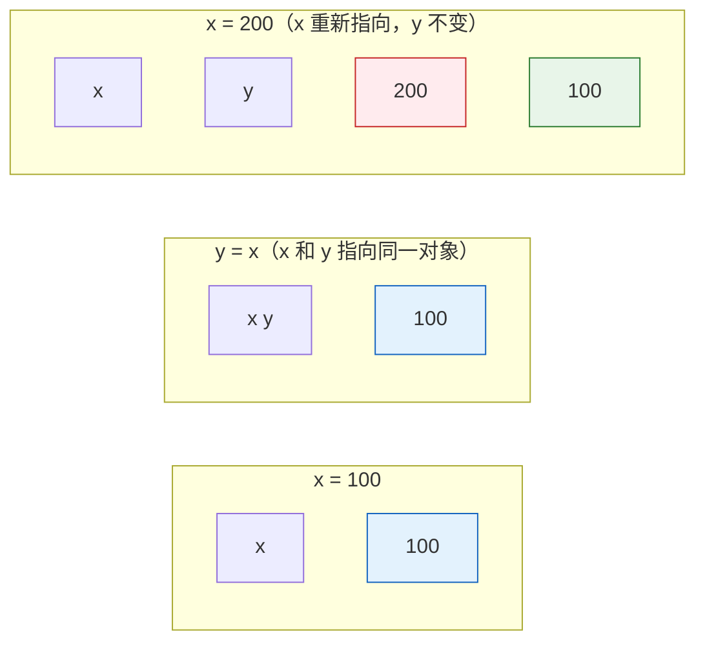
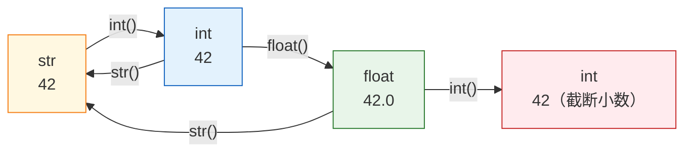

# L01: Python 核心语法 — 详细教学

> **课程编号**: L01
> **所属阶段**: Stage 0 - Python 编程基础
> **预计时长**: 4 小时
> **难度**: ⭐☆☆☆☆ (入门)
> **前置课程**: 无
> **版本**: v2.2
> **最后更新**: 2026-07-12
> **核心版本**: Python 3.13

---

## 🎯 学习目标

完成本课程后，你将能够：

1. **环境操作**：在终端运行 Python 程序，使用 REPL 进行快速实验
2. **数据建模**：理解变量引用模型（标签 vs 盒子），区分 4 种基本数据类型
3. **类型安全**：理解 None 的含义，为变量添加类型注解
4. **字符串处理**：熟练使用 f-string 格式化，了解整数和字符串的不可变性
5. **错误预防**：避免浮点数比较陷阱、`input()` 返回字符串陷阱

---

## 📖 课程导读

本课程是 Python 全栈学习的起点，也可能是你编程生涯的第一行代码。

**为什么选择 Python？**

在 GitHub 2024 年的统计数据中，Python 超越 JavaScript 成为最活跃的编程语言。这不是因为它最古老，而是因为它在三个维度上做到了极致平衡：

| 维度 | Python 的表现 | 对你的意义 |
|------|--------------|-----------|
| **入门门槛** | 英语语法 + 缩进 = 代码 | 3 小时写出第一个程序 |
| **工程深度** | FastAPI / LangGraph / PyTorch | 能支撑亿级用户的产品 |
| **认知负担** | 只有一个正确写法 | 减少选择焦虑，专注思考 |

**Python 3.13 的现代体验：**

Python 3.13（2024 年 10 月）让交互式编程体验大幅提升。你在本课程中将首次接触的现代 REPL 特性：

```bash
$ python
>>> # ✅ 多行编辑：自动缩进支持
>>> if True:
...     print("自动缩进")
...
✅ 自动彩色输出：错误信息红色高亮
>>> 1/0
  File "<stdin>", line 1
    1/0
    ~~^
ZeroDivisionError: division by zero   # ← 彩色箭头指向错误位置

>>> help(print)   # 内嵌彩色帮助
>>> import this   # Python 之禅（Tim Peters 的设计哲学）
```

> 🔑 **本课的核心转变**：传统课程把"Hello World"和"变量类型"分开讲，导致你前两小时只能机械打印。本课程从第一个程序起就引入变量引用模型——你将同时理解"代码怎么跑"和"数据怎么存"，少走一半弯路。

---

## Part 0: 如何学习 Python（先读这一节）

> 💡 **元认知提示**：在任何新语言的第一堂课里，比"学什么"更重要的是"怎么学"。本节介绍三个你在整个课程中都会反复使用的自学工具。

### 0.1 三大自学工具

Python 自带两个"活的文档"，在任何时候都能用：

```python
>>> type(42)         # 查看对象类型：<class 'int'>
>>> type("hello")    # 查看对象类型：<class 'str'>
>>> help(print)      # 查看函数签名和参数说明
```

**什么时候用哪个？**

```python
# 1. type() —— 当你不确定"这是什么东西"时
#    场景：input() 返回什么？
>>> type(input("输入: "))
<class 'str'>   # ← 原来 input() 返回的是字符串！

# 2. help() —— 当你想知道"这个函数怎么用"时
#    场景：print() 的 sep 参数是什么意思？
>>> help(print)
print(value, ..., sep=' ', end='\n', ...)
#   sep:  多值之间的分隔符
#   end:  结束时的字符
```

### 0.2 报错信息阅读策略

Python 的报错信息是**世界上最好的教程**。养成先读最后一行的习惯：

```python
# 一个错误的程序
age = int(input("年龄: "))
next_year = age + 1

# 运行它：
#   File "script.py", line 1, in <module>
#     age = int(input("年龄: "))
# ValueError: invalid literal for int() with base 10: 'twenty-five'
#                                                         ^^^^^^^^^^^

# ✅ 先读最后一行：ValueError → 值有问题
# ✅ 再看具体位置：箭头指向 'twenty-five' → 输入的不是数字
# ✅ 解决方案：先用 str.isdigit() 验证，或用 int() 捕获错误
```

> 🔑 **工程师习惯**：遇到报错不要慌，先把报错信息完整读一遍。通常答案就在最后一行。

### 0.3 用 REPL 验证假设

当你对某个语法不确定时，**不要猜，用 REPL 验证**：

```python
# ❌ 错误习惯：猜想了半天才动手
# 我觉得 f-string 应该这样写...
# 好像不对...
# 试试加引号...

# ✅ 正确习惯：3 秒内验证
>>> f"2 + 2 = {2 + 2}"
'2 + 2 = 4'
>>> f"2 + 2 = " + str(2 + 2)
'2 + 2 = 4'   # ← 两种写法结果一样，但 f-string 更简洁
```

> 🔑 **工程纪律**：写代码前先想清楚，但想不清楚的地方就开 REPL 验证。整个课程都遵循这个原则。

---

## Part 1: Python 入门

### 1.1 Python 简介与哲学

#### Python 是什么？

Python 是一种**高级编程语言**，由 Guido van Rossum 于 1991 年首次发布。它的设计哲学强调代码的可读性和简洁性。

**Python 之禅（The Zen of Python）**：

在 Python 解释器中输入 `import this`，你会看到：

```python
>>> import this
The Zen of Python, by Tim Peters

Beautiful is better than ugly.
Explicit is better than implicit.
Simple is better than complex.
...
```

核心理念：
- **优美胜于丑陋**：代码应该像诗一样优雅
- **明确胜于隐晦**：不要让读者猜测代码意图
- **简单胜于复杂**：能用简单方式解决就不要复杂化

#### Python 的应用场景

1. **Web 开发**
   - Django: 大型 Web 应用（Instagram, Spotify）
   - FastAPI: 现代高性能 API（本课程主线）
   - Flask: 轻量级 Web 框架

2. **数据科学与机器学习**
   - Pandas: 数据分析
   - NumPy: 科学计算
   - TensorFlow/PyTorch: 深度学习

3. **自动化脚本**
   - 文件处理
   - 系统管理
   - 网络爬虫

4. **其他领域**
   - 游戏开发（Pygame）
   - 图形界面（Tkinter, PyQt）
   - 嵌入式系统（MicroPython）

---

### 1.2 Python 环境配置

#### 版本选择

本课程使用 **Python 3.13**（2024 年 10 月发布），这是当前课程体系的基准版本。

**为什么选择 3.13？**
- ✅ 改进的错误消息（更友好的提示）
- ✅ 更快的执行速度（JIT 编译器优化）
- ✅ 现代类型系统（PEP 695，由 Python 3.12 引入）

> 📖 **版本说明**：本课程以 Python 3.13 为基线。Free-threading（无 GIL）等试验性特性将在后续高级课程中介绍。

#### 检查 Python 版本

```bash
python --version
# 或
python3 --version
```

**预期输出**：`Python 3.13.x`

#### Python 解释器

Python 是一种**解释型语言**，这意味着：
- 代码逐行执行（不需要编译）
- 开发周期快（写完立即运行）
- 跨平台（同一份代码可在多个操作系统运行）

---

### 1.3 第一个 Python 程序

#### Hello World

创建文件 `hello.py`：

```python
print("Hello, World!")
```

运行：

```bash
python hello.py
```

**输出**：
```
Hello, World!
```

#### 代码解析

```python
print("Hello, World!")
#  │        │
#  │        └─ 字符串参数（要打印的内容）
#  └─ 内置函数（built-in function）
```

**print() 函数的特点**：
- 内置函数（无需导入）
- 自动换行（默认在末尾添加 `\n`）
- 可接受多个参数

#### 进阶示例

```python
# 多个参数
print("Python", 3.13, "is", "awesome!")
# 输出：Python 3.13 is awesome!

# 自定义分隔符
print("A", "B", "C", sep="-")
# 输出：A-B-C

# 不换行
print("Hello", end=" ")
print("World")
# 输出：Hello World
```

---

> 🔑 **本节学习提示**：REPL 不是"备用工具"，而是 Python 工程师日常工作中使用频率最高的工具之一。在本课程中，每当你遇到不确定的语法，先打开 REPL 验证，而不是去搜索引擎。

### 1.4 Python REPL（交互式解释器）

#### 什么是 REPL？

REPL = **R**ead（读取你的输入）→ **E**val（求值）→ **P**rint（打印结果）→ **L**oop（回到第一步）



启动 REPL：

```bash
# 方法 1：直接启动（推荐）
python

# 方法 2：指定版本（多版本共存时）
python3.13
```

**预期输出：**

```text
Python 3.13.0
Type "help" for more information.
>>>
```

#### REPL 的核心优势

| 优势 | 场景 | 举例 |
|------|------|------|
| **即时反馈** | 验证语法是否正确 | 不知道 f-string 怎么写？输进去试试 |
| **探索 API** | 了解陌生函数 | `help(len)` → 看函数签名 |
| **快速原型** | 测试一个小想法 | 验证 `0.1 + 0.2` 的运算结果 |
| **调试辅助** | 运行程序观察输出 | 在关键步骤加 print() 检查变量值 |

#### 实战 1：验证假设（推荐习惯）

```python
# 💡 每次遇到不确定的语法，都先在 REPL 里验证
>>> import this   # 先看看 Python 的设计哲学
>>> type(42)     # 42 是什么类型？
<class 'int'>
>>> type("hi")   # "hi" 是什么类型？
<class 'str'>
>>> len("hello") # 字符串长度怎么算？
5
```

#### 实战 2：用 help() 探索函数用法

```python
# 当你想知道"这个函数怎么用"时，用 help()
>>> help(len)
len(obj)
    Return the length (the number of items) of an object.

>>> len("hello")   # 求字符串长度
5
>>> help(input)
input([prompt])
    Read a string from standard input.
```

#### REPL 快捷键

| 快捷键 | 功能 | 重要程度 |
|--------|------|---------|
| `↑` / `↓` | 浏览历史命令 | ⭐⭐⭐ 必须 |
| `Tab` | 自动补全变量/函数名 | ⭐⭐⭐ 必须 |
| `Ctrl+D` | 退出 REPL | ⭐⭐ 必须 |
| `Ctrl+L` | 清屏 | ⭐ 常用 |
| `Ctrl+C` | 取消当前输入 | ⭐ 常用 |
| `Ctrl+Z` (Windows) | 退出 REPL | ⭐ 备用 |
| `Ctrl+A` / `Ctrl+E` | 行首/行尾跳转 | ⭐ 省力 |

#### Python 3.13 REPL 现代特性（必须知道）

Python 3.13 的交互式解释器（REPL）相比旧版有质的飞跃。输入 `python` 启动后，你会体验到：

**① 彩色错误追踪** — 错误信息用红色高亮，箭头精确指向出错位置：

```text
>>> 1 / 0
  File "<stdin>", line 1
    1 / 0
    ~~^
ZeroDivisionError: division by zero   # ← 红色高亮
```

**② 多行编辑** — 自动缩进支持，无需手动处理缩进：

```text
>>> if True:
...     print("自动对齐")
...     if 1 < 2:
...         print("嵌套也支持")
...
自动对齐
嵌套也支持
```

> 📖 **预习提示**：`if` 条件语句将在 L02 中详细学习。这里的示例仅演示 REPL 的多行编辑能力——当你输入以冒号 `:` 结尾的语句时，REPL 会自动进入多行模式。

**③ 内嵌彩色帮助** — 输入函数名即可查看签名与说明：

```text
>>> help(print)
print(value, ..., sep=' ', end='\n', file=sys.stdout, flush=False)
    Prints the values to a stream or to sys.stdout by default.
```

**④ Python 之禅** — 一行命令，领略 Python 的设计哲学：

```text
>>> import this
The Zen of Python, by Tim Peters
Beautiful is better than ugly.
Explicit is better than implicit.
...
```

> 💡 **养成习惯**：每当你对某个语法有疑问，第一反应不是去搜索，而是打开 REPL 输入一行代码验证。Python 的报错信息本身就是最好的教程。

---

### 1.5 基本输入输出

#### 输出：print()

```python
# 基本输出
print("Hello, Python!")

# 多行输出
print("第一行")
print("第二行")
print("第三行")

# 特殊字符
print("制表符：\t分隔")
print("换行符：\n新的一行")
print("反斜杠：\\")
print("引号：\"双引号\" 和 \'单引号\'")
```

#### 输入：input()

```python
# 获取用户输入
name = input("请输入你的名字：")
print("你好，" + name + "！")
```

> 🔑 **原理解释**：`input()` 统一返回字符串，是 Python"文本优先"设计哲学的体现——所有用户输入都是文本，转换是程序员的责任。这个设计让程序更安全，但也容易让初学者在数值计算时踩坑。

```python
# 💡 记住：input() = 获取用户输入 = 文本 = str
# 用 type() 验证：
name = input("名字: ")     # 用户输入 "Alice"
age  = input("年龄: ")     # 用户输入 "25"

print(type(name))  # <class 'str'>
print(type(age))   # <class 'str'> — 注意：这是字符串 "25"，不是数字 25

# 计算年龄差会报错：
# age + 1  →  TypeError: can only concatenate str (not "int") to str
```

**常见报错：**

```python
age = input("年龄: ")
print(age + 1)  # ❌ TypeError: str + int
#             ^ 报错原因：字符串 "25" 不能直接和整数相加
#             → 解决方案：age = int(input("年龄: "))
```

**标准写法：**

```python
# ✅ 推荐：input() 后立即转类型
age: int = int(input("年龄: "))  # 一行完成：获取 → 转类型
print(age + 1)  # 正常工作
```

```python
age = input("请输入年龄：")
print(type(age))  # <class 'str'>

# 需要转换为数字
age_int = int(age)
print(type(age_int))  # <class 'int'>
```

#### 实战：加减法计算器

> ⚠️ **范围说明**：本实战仅演示 L01 已学的 `+ - /` 运算符。乘法和更复杂的运算见 L02。

```python
num1 = int(input("请输入第一个数字："))
num2 = int(input("请输入第二个数字："))

print(f"{num1} + {num2} = {num1 + num2}")
print(f"{num1} - {num2} = {num1 - num2}")
print(f"{num1} / {num2} = {num1 / num2}")

# 📖 预告：L02 将学习乘法(*)、整除(//)、取模(%)、幂(**)运算符
```

---

## Part 2: 变量与数据类型

### 2.1 变量引用模型（核心概念）

#### 传统"盒子"模型 ❌

很多语言将变量比喻成"盒子"，但这在 Python 里会导致理解偏差：

```
❌ 错误理解（盒子模型）：
变量 = 存储值的容器
x = 100  →  [盒子 x：装着 100]

后果：误以为"修改 x 会影响 y"
x = 200  →  [盒子 x：装着 200]
y = x    →  [盒子 y：也装着 200？]
```

#### Python 的"标签"模型 ✅

Python 中，变量是**对象的引用（标签）**，不是容器：



**代码演示：**

```python
x = 100          # ① 创建整数对象 100
y = x            # ② y 成为同一个对象的另一个标签
x = 200          # ③ x 重新指向新对象 200（y 不受影响）
```

**状态变化图：**



> 当你修改 x 的值时，y 不会受影响——因为它们是两个独立的标签，各自指向不同的对象。

---

### 2.2 基本数据类型

Python 有 4 种基本数据类型：

- **整数（int）**：任意精度整数（如 `42`, `-10`, `1_000_000`）
- **浮点数（float）**：IEEE 754 双精度浮点（如 `3.14`, `1e-10`）
- **字符串（str）**：不可变 Unicode 序列（如 `"hello"`, `'world'`）
- **布尔值（bool）**：逻辑值（`True` / `False`）

> 📖 **Python 3.13 不可变性说明**：整数、浮点数、字符串、布尔值都是不可变类型，
> 修改操作会返回新对象，而非就地修改。

#### 2.2.1 整数（int）

```python
# 基本整数
age = 25
count = -10

# 大整数（无限精度）
big_num = 12345678901234567890
print(big_num * 2)  # 不会溢出

# 下划线分隔（提高可读性）
million = 1_000_000
print(million)  # 1000000

# 不同进制
binary = 0b1010  # 二进制
octal = 0o12     # 八进制
hex_num = 0xFF   # 十六进制
print(binary, octal, hex_num)  # 10 10 255
```

**特性**：
- ✅ 任意精度（不会溢出）
- ✅ 不可变（immutable）

#### 2.2.2 浮点数（float）

```python
# 小数
pi = 3.14159
price = 99.99

# 科学计数法
speed_of_light = 3e8  # 3 * 10^8
small_num = 1.5e-10   # 1.5 * 10^-10

# 精度问题（重要）
result = 0.1 + 0.2
print(result)  # 0.30000000000000004（不是 0.3）
```

**浮点数陷阱**：

```python
# ❌ 浮点数精度问题：直接比较会失败
# 📖 预告：L02 将学习比较运算符（==, !=, <, >, <=, >=）
#   以下演示仅展示运算结果，不做比较
result = 0.1 + 0.2
print(result)  # 输出：0.30000000000000004（不是 0.3！）

# ✅ 正确做法：使用容差比较（详见 L02）
#   正确代码：import math; math.isclose(0.1 + 0.2, 0.3)
#   原因：0.1 和 0.2 在二进制中无法精确表示
```

#### 2.2.3 复数（complex）— 工程数学基础

复数由实部 + 虚部组成，Python 原生支持，在信号处理、物理仿真、控制系统中有广泛应用：

```python
# 创建复数
c1 = 3 + 4j        # 常用写法
c2 = complex(3, 4) # 等价
print(c1)          # (3+4j)

# 虚部单位是 j（不是 i）
c3 = 2j            # 纯虚数
print(2j * 2j)     # (-4+0j)：j² = -1

# 实部和虚部
print(c1.real)     # 3.0（浮点数）
print(c1.imag)     # 4.0（浮点数）

# 复数运算（自动满足代数定律）
c_sum = c1 + (1 - 2j)   # (4+2j)
c_prod = c1 * (1 - 2j)  # (11-2j)
c_div = c1 / (1 + 1j)   # (3.5+0.5j)

# 共轭复数
print(c1.conjugate())   # (3-4j)

# 模（绝对值）
print(abs(c1))          # 5.0（√(3²+4²)=5）

# 📖 进阶学习：cmath 模块提供复数的三角函数、对数、平方根等运算，
#   以及极坐标转换（phase, polar, rect）。这属于 L04 模块学习后的应用。
```

> 📖 **cmath 模块**：提供 `sqrt`、`sin`、`cos`、`log` 等数学函数的复数版本，
> 处理负数平方根时不会报错。**L04 模块学习后再使用此模块。**

#### 2.2.4 字符串（str）

```python
# 单引号和双引号等价
name1 = 'Alice'
name2 = "Bob"

# 三引号（多行字符串）
text = """这是
多行
字符串"""

# 转义字符
escaped = "He said: \"Hello!\""
path = "C:\\Users\\Alice"

# 原始字符串（忽略转义）
raw_path = r"C:\Users\Alice"
```

**字符串是不可变的**：

```python
s = "hello"
s_upper = s.upper()  # 返回新字符串

print(s)        # "hello"（原字符串不变）
print(s_upper)  # "HELLO"
```

**常用方法**：

```python
text = "  Python Programming  "

text.strip()      # 去除首尾空格
text.lower()      # 转小写
text.upper()      # 转大写
text.replace("Python", "Java")  # 替换
text.split()      # 分割成列表
```

> 📖 **字符串方法速查表**（更多方法见官方文档）：
>
> | 方法 | 示例 | 说明 |
> |------|------|------|
> | `.split()` | `"a,b,c".split(",")` | 按分隔符分割，返回列表 |
> | `.join()` | `",".join(["a","b","c"])` | 用分隔符连接列表元素 |
> | `.strip()` | `"  hi  ".strip()` | 去除首尾空白（或指定字符） |
> | `.find()` | `"hello".find("ll")` | 返回子串首次出现的索引，未找到返回 `-1` |
> | `.count()` | `"hello".count("l")` | 返回子串出现次数 |
> | `.replace()` | `"hello".replace("l","x")` | 替换所有匹配项 |
> | `.startswith()` | `"hello".startswith("he")` | 判断是否以某前缀开头 |
> | `.endswith()` | `"hello".endswith("lo")` | 判断是否以某后缀结尾 |
> | `.title()` | `"hello world".title()` | 每个单词首字母大写 |
> | `.capitalize()` | `"hello".capitalize()` | 首字母大写，其余小写 |
> | `.center(w)` | `"hi".center(10)` | 居中填充至宽度 w |
> | `.ljust(w)` | `"hi".ljust(10)` | 左对齐，右侧填充空格 |
> | `.rjust(w)` | `"hi".rjust(10)` | 右对齐，左侧填充空格 |

#### 2.2.4.1 字节串（bytes）— 网络与文件底层数据

字符串处理文本，**字节串处理原始二进制数据**，两者不可直接混用：

```python
# 创建字节串
b1 = b"hello"                    # 字面量（ASCII）
b2 = bytes([72, 101, 108, 108, 111])  # 从整数列表
b3 = "你好".encode("utf-8")       # 文本编码为字节

print(b1)               # b'hello'
print(b3)               # b'\xe4\xbd\xa0\xe5\xa5\xbd'（UTF-8 编码）

# 字节串 → 字符串（解码）
text = b3.decode("utf-8")
print(text)             # 你好

# bytes 与 str 的根本区别
s = "hello"
b = b"hello"
print(type(s), type(b))  # <class 'str'> <class 'bytes'>
print(s == b)             # 📖 预告：L02 将学习比较运算符，这里先记住类型不同就永不相等

# 索引返回整数（不是字符）
print(b[0])               # 104（ASCII 码，不是 'h'）
print(b[:3])              # b'hel'（切片仍然返回 bytes）

# 字节串方法子集（与 str 共享部分方法）
print(b"HELLO".lower())    # b'hello'
print(b"hello".replace(b"l", b"r"))  # b'herro'
print(b"hello world".split(b" "))    # [b'hello', b'world']

# 字节串不支持直接与字符串拼接
# b"hello" + "world"  → TypeError
# 必须先统一类型
b"hello" + "world".encode()  # b'helloworld'
```

**常见使用场景**：

| 场景 | 编码 | 说明 |
|------|------|------|
| 文件读写二进制 | `rb`/`wb` | 图片、音频、压缩文件 |
| 网络协议 | bytes | HTTP body、TCP 流 |
| 哈希值 | `hashlib.sha256(b"data")` | SHA256/MD5 输入必须是 bytes |
| 硬件/串口通信 | `bytes` | 传感器数据、嵌入式 |

> ⚠️ **Python 3 核心区别**：Python 2 中 `str` 和 `unicode` 的混乱在 Python 3 中被彻底分离——`str` 是 Unicode 文本，`bytes` 是原始字节。处理网络数据或文件 I/O 时，**先明确编码格式再转换**。

**可变版本：bytearray**：

```python
ba = bytearray(b"hello")
ba[0] = 72          # 修改为 'H'
print(ba)           # bytearray(b'Hello')
ba.extend(b" world")
print(ba)           # bytearray(b'Hello world')
# 与 bytes 的接口相同，但支持原地修改（适合缓冲区）
```

#### 2.2.5 布尔值（bool）

```python
is_active = True
is_valid = False

# 布尔运算
print(True and False)  # False
print(True or False)   # True
print(not True)        # False
```

**"真值"与"假值"**：

Python 中，以下值被视为 `False`：
- `False`
- `None`
- `0`, `0.0`
- 空字符串 `""`
- 空容器 `[]`, `()`, `{}`

其他所有值都是 `True`！

```python
print(bool(0))      # False
print(bool(""))     # False
print(bool(None))   # False
print(bool(100))    # True
print(bool("hello")) # True
```

#### 2.2.6 None 类型

`None` 表示"无值"或"空"，是 Python 里的"空"标记：

```python
result = None
print(result)  # None
```

> 📖 **L02 将学到**：判断 None 要用身份比较运算符。这是 Python 的习惯用法。

**None 的应用场景**：
- 函数默认返回值
- 表示"尚未初始化"
- 表示"可选参数"

---

### 2.3 类型注解（入门）

Python 可以为变量和函数添加"类型注解"作为文档：

```python
# 变量类型注解
name: str = "Alice"
age: int = 25
height: float = 1.75

# 函数类型注解（参数和返回值）
#   greet: (str, int) -> str
#   调用示例：greet("Alice", 25) → "Hello, Alice! You are 25 years old."
```

> 📖 **Python 3.13 提示**：类型注解只是"文档"，运行时不强制检查！
> ```python
> x: int = "hello"  # 不会报错！类型注解不是强制约束
> ```

> 💡 **进阶学习**：完整的类型系统（Union、Protocol、PEP 695 泛型、mypy）见 [L10 类型系统](../../../stage1-python-intermediate/lessons/L10-type-system/lesson.md)。

---

> 🔑 **本节目标**：掌握 Python 3.6+ 的推荐字符串格式化方法。f-string 不是"语法糖"，而是让字符串拼接意图更清晰、更难出错的工程工具。

### 2.4 f-string 格式化（现代化）

#### 为什么是 f-string？

Python 有四种字符串格式化方法：

```python
name = "Alice"
age = 25

# ❌ 方法 1：字符串拼接（繁琐、易错）
"我叫" + name + "，今年" + str(age) + "岁"

# ❌ 方法 2：% 格式化（Python 2 遗留）
"我叫%s，今年%d岁" % (name, age)

# ❌ 方法 3：.format()（冗长）
"我叫{}，今年{}岁".format(name, age)

# ✅ 方法 4：f-string（清晰、高效，Python 3.6+）
f"我叫{name}，今年{age}岁"
```

```mermaid
flowchart LR
    A["f-string 模板<br/>f"我叫{name}，{age}岁""] -->|"① 解析花括号<br/>② 求值表达式<br/>③ 替换结果"| B["最终字符串<br/>"我叫Alice，25岁""]
    style A fill:#e3f2fd,stroke:#1565c0
    style B fill:#e8f5e9,stroke:#2e7d32
```

**f-string 的三大优势：**

1. **意图清晰**：变量直接嵌入字符串，所见即所得
2. **易于维护**：变量在花括号里，不会在拼接处迷失
3. **可读性高**：格式说明符紧邻变量，例如 `{pi:.2f}`

#### 基本语法

```python
name = "Alice"
age = 25

# f-string（推荐）
message = f"我是 {name}，今年 {age} 岁"
print(message)  # 我是 Alice，今年 25 岁
```

#### 表达式

```python
x = 10
y = 20

print(f"{x} + {y} = {x + y}")  # 10 + 20 = 30
print(f"明年我 {age + 1} 岁")   # 明年我 26 岁
```

#### 格式化数字

```python
pi = 3.14159265359

print(f"π ≈ {pi:.2f}")   # π ≈ 3.14（2 位小数）
print(f"π ≈ {pi:.4f}")   # π ≈ 3.1416（4 位小数）
```

#### 对齐与填充

```python
text = "Python"

print(f"|{text:>10}|")  # |    Python|（右对齐）
print(f"|{text:<10}|")  # |Python    |（左对齐）
print(f"|{text:^10}|")  # |  Python  |（居中）
print(f"|{text:*^10}|") # |**Python**|（用 * 填充）
```

#### 千位分隔符

```python
big_num = 1234567

print(f"{big_num:,}")   # 1,234,567
print(f"{big_num:_}")   # 1_234_567
```

#### 百分比

```python
ratio = 0.856

print(f"{ratio:.1%}")   # 85.6%
print(f"{ratio:.2%}")   # 85.60%
```

#### 调试模式（Python 3.8+）

```python
x = 100
y = 200

print(f"{x=}")      # x=100
print(f"{y=}")      # y=200
print(f"{x + y=}")  # x + y=300
```

#### breakpoint() — 内置断点调试（Python 3.7+）

`breakpoint()` 是 Python 3.7+ 引入的内置调试函数，会自动启动调试器：

```python
price = 100.0
discount = 0.15
result = price * (1 - discount)
breakpoint()  # ← 程序在这里暂停，进入调试器
print(f"最终价格: {result}")
```

> ⚠️ **预习提示**：`breakpoint()` 示例中的代码仅使用 L01 学过的变量和算术运算。
> `def` 函数定义将在 L04 中学习。

**运行效果**：

```bash
$ python debug_demo.py
> /Users/demo/debug_demo.py(4)<module>()
-> result = price * (1 - discount)
(Pdb) price
100.0
(Pdb) discount
0.15
(Pdb) result
85.0
(Pdb) c  # 继续执行
最终价格: 85.0
```

**常用 pdb 命令**：

| 命令 | 缩写 | 说明 | 示例 |
|------|------|------|------|
| `next` | `n` | 执行下一行 | `n` |
| `step` | `s` | 进入函数内部 | `s` |
| `continue` | `c` | 继续执行到下一个断点 | `c` |
| `list` | `l` | 显示当前代码上下文 | `l` |
| `print` | `p` | 打印变量值 | `p price` |
| `quit` | `q` | 退出调试器 | `q` |

**配置默认调试器**：

```python
# 使用 pdb 的衍生调试器
import pdb
pdb.set_trace()  # 等价于 breakpoint()，但更显式

# 💡 提示：更现代的调试器可用 uv add ipdb 安装
# import ipdb; ipdb.set_trace()
```

#### sys.last_traceback — 异常回溯

程序崩溃后，可通过 `sys.last_traceback` 查看最后的错误信息：

```python
import sys
import traceback

try:
    result = 1 / 0
except ZeroDivisionError:
    traceback.print_exc()  # 打印详细错误信息

    # 获取最后异常
    tb = sys.last_traceback
    if tb:
        print(f"最后异常位置: {tb.tb_lineno}")
```

> ⚠️ **预习提示**：`try/except` 异常处理语法将在 L08 中详细学习。
> 这里仅演示 `sys.last_traceback` 的用法。

---

> 🔑 **本节关键**：类型转换不是"变魔术"，而是显式告诉 Python"按这种规则重新解释这个值"。错误的转换会报错——这是好事，因为 Python 在帮你提前发现问题。

### 2.5 类型转换

#### 类型转换的本质



**类型转换三原则：**

| 源类型 | 目标类型 | 规则 | 危险场景 |
|--------|---------|------|---------|
| `str` | `int` / `float` | 解析字符串内容 | `"hello"` → 报错 |
| `float` | `int` | 截断小数（非四舍五入） | `3.99` → `3` |
| `int` / `float` | `str` | 转文本表示 | 无危险 |

#### 显式转换

```python
# 字符串 → 整数
age = int("25")

# 字符串 → 浮点数
price = float("99.99")

# 整数 → 字符串
text = str(100)

# 浮点数 → 整数（截断）
result = int(3.99)  # 3（不是 4）
```

#### 转换为布尔值

```python
print(bool(0))       # False
print(bool(1))       # True
print(bool(""))      # False
print(bool("hello")) # True
print(bool(None))    # False
```

#### 错误处理

```python
# ❌ 这会报错
num = int("hello")  # ValueError: invalid literal

# 后续课程会学习异常处理
```

---

### 2.6 不可变性（重要概念）

#### 整数和字符串是不可变的

```python
# 整数
x = 100
y = x
x = 200

print(x)  # 200
print(y)  # 100（不受影响）

# 字符串
s = "hello"
s_upper = s.upper()

print(s)        # "hello"（原字符串不变）
print(s_upper)  # "HELLO"
```

#### 为什么要不可变？

> 📖 **深入学习**：可变与不可变类型的完整对比（包括 list、dict、set）见 L03《数据结构》。

1. **安全性**：避免意外修改
2. **性能**：可以缓存和优化
3. **哈希性**：可以作为字典的键（见 L03）

---

## 🎓 核心知识点总结

### Part 1: Python 入门

1. **Python 哲学**：优美、明确、简单
2. **REPL**：快速实验的利器
3. **print()**：内置输出函数
4. **input()**：获取用户输入（返回字符串）

### Part 2: 变量与类型

1. **引用模型**：变量是对象的标签，不是盒子
2. **5 种基本类型**：int、float、str、bool、None
3. **None**：表示"无值"
4. **类型注解**：提高可读性（不强制检查）
5. **f-string**：现代化的字符串格式化
6. **不可变性**：int、float、str 都是不可变的

### 实用技巧

**1. f-string 千位分隔符（Python 3.8+）**：
```python
big_num = 1234567
print(f"{big_num:,}")  # 1,234,567
```

**2. 下划线分隔大数字**：
```python
million = 1_000_000  # 比 1000000 更易读
```

### 典型应用场景

- 📊 **数据展示**：格式化数字、货币、百分比
- 📝 **用户交互**：input() 获取并转换用户输入
- 🔧 **配置管理**：使用类型注解定义配置结构
- 🧮 **计算器**：类型转换 + f-string 格式化输出

### 类型对比速查（5 种基本类型）

| 类型 | 可变 | 可哈希 | 示例 | 典型用途 |
|------|------|--------|------|---------|
| int  | ❌ | ✅ | `42`, `-10` | 计数、索引 |
| float| ❌ | ✅ | `3.14`, `1e-10` | 科学计算 |
| str  | ❌ | ✅ | `"hello"` | 文本处理 |
| bool | ❌ | ✅ | `True`, `False` | 逻辑判断 |
| None | ❌ | ✅ | `None` | 空值表示 |

---

## 💡 常见陷阱与最佳实践

### 陷阱 1：浮点数精度

```python
# ❌ 浮点数精度问题：直接比较会失败
# 📖 预告：L02 将学习比较运算符（==, !=, <, >, <=, >=）
#   以下演示仅展示运算结果，不做比较
result = 0.1 + 0.2
print(result)  # 输出：0.30000000000000004（不是 0.3！）

# ✅ 正确做法：使用容差比较（详见 L02）
#   正确代码：import math; math.isclose(0.1 + 0.2, 0.3)
#   原因：0.1 和 0.2 在二进制中无法精确表示
```

### 陷阱 2：input() 返回字符串

```python
# ❌ 错误
age = input("年龄：")
next_year = age + 1  # TypeError

# ✅ 正确
age = int(input("年龄："))
next_year = age + 1
```

> 📖 **L02 将学到**：比较两个对象是否"同一个东西"用 `is`，是否"值相等"用 `==`。

### 最佳实践 1：使用类型注解

```python
# ✅ 推荐写法：带完整类型注解
#   calculate_total: (float, int) -> float
#   调用示例：calculate_total(19.9, 3) → 59.7

# ❌ 不推荐写法：缺少类型注解（IDE 无法推断参数类型）
#   calculate_total(price, quantity)
```

### 最佳实践 2：优先使用 f-string

```python
name = "Alice"
age = 25

# ✅ 推荐（清晰、高效）
message = f"我是 {name}，今年 {age} 岁"

# ❌ 不推荐（老旧、冗长）
message = "我是 " + name + "，今年 " + str(age) + " 岁"
message = "我是 %s，今年 %d 岁" % (name, age)
message = "我是 {}，今年 {} 岁".format(name, age)
```

### 最佳实践 3：使用有意义的变量名

```python
# ✅ 推荐
student_age = 25
total_price = 99.99
is_active = True

# ❌ 不推荐
a = 25
x = 99.99
flag = True
```

---

## 🚀 实战案例

### 案例 1：个人信息卡片

```python
# 获取用户输入
name = input("请输入姓名：")
age = int(input("请输入年龄："))
city = input("请输入城市：")

# 格式化输出
card = f"""
{'=' * 30}
姓名：{name}
年龄：{age} 岁
城市：{city}
{'=' * 30}
"""

print(card)
```

### 案例 2：简单货币转换器

```python
# 汇率
USD_TO_CNY = 7.25

# 获取美元金额
usd = float(input("请输入美元金额："))

# 转换为人民币
cny = usd * USD_TO_CNY

# 格式化输出
print(f"${usd:.2f} USD = ¥{cny:.2f} CNY")
```

---

## 📚 延伸阅读

### 官方文档
- [Python 官方教程](https://docs.python.org/zh-cn/3/tutorial/)
- [Python 内置类型](https://docs.python.org/zh-cn/3/library/stdtypes.html)
- [PEP 8 代码风格指南](https://pep8.org/)

### 推荐书籍
- 《Python编程：从入门到实践》
- 《流畅的Python》
- 《Effective Python》

### 在线资源
- [Python Tutor](http://pythontutor.com/)：可视化代码执行
- [Real Python](https://realpython.com/)：优质教程网站

---

## ✅ 自检清单

完成本课程后，你应该能够：

- [ ] 在终端运行 Python 程序
- [ ] 使用 REPL 进行快速实验
- [ ] 理解变量是对象的引用（非盒子模型）
- [ ] 区分 4 种基本数据类型（int/float/str/bool）
- [ ] 理解 None 的含义（后续 L02 学习如何判断）
- [ ] 为变量和函数添加类型注解
- [ ] 熟练使用 f-string 格式化字符串
- [ ] 进行类型转换（int/float/str 互转）
- [ ] 理解整数和字符串的不可变性

---

## 💭 课堂思考

### 思考 1: 为什么 Python 用标签而不是盒子？

**问题**：Python 的变量是"标签"，而不是"盒子"。这种设计有什么好处？

**引导思考**：
- 如果变量是盒子，`y = x` 会发生什么？
- 标签模型如何影响多线程编程？
- 其他语言（如 C++、Java）用的是什么模型？

**对比**：
```python
# Python: 标签模型
x = 100
y = x      # y 成为同一个对象的标签
x = 200    # x 重新指向新对象，y 不受影响

# 其他语言: 盒子模型（概念上）
# x = 100   # 盒子 x 装着 100
# y = x     # 复制盒子内容？还是共享盒子？
```

---

### 思考 2: f-string vs 传统格式化 — 何时用哪个？

**问题**：Python 有四种字符串格式化方法，什么时候应该用 f-string？

**引导思考**：
- f-string 有什么优势？
- 在什么场景下其他方法可能更合适？
- 为什么不应该使用 `%` 格式化？

---

## 📝 进阶预告

完成本课程后，你已经掌握了 Python 的基础语法。在下一课 [L02: 运算符与控制流](../L02-operators-control/lesson.md) 中，我们将学习：

- 🔢 **算术运算符**：加减乘除、整除、取模、幂运算
- ⚖️ **比较运算符**：等于、大于、小于及链式比较
- 🔗 **逻辑运算符**：and、or、not 及短路特性
- 🔄 **控制流**：if/elif/else 条件语句、while 和 for 循环
- 🔀 **match-case**：Python 3.10+ 的模式匹配语法

> 💡 **学习路径**：L01 → L02 → L03（数据结构）→ L04（函数与模块）→ L05（调试）→ L06（异常）→ L07（面向对象）→ L08（魔术方法）→ L09（文件操作）→ P01（综合项目）


---


---

## 📝 本章总结

### 核心知识点

| 概念 | 说明 |
|------|------|
| 本课程 | Python 核心概念 |

### 关键要点

1. 理解本课程的核心概念
2. 掌握主要语法和使用方法
3. 能够独立完成课程练习

### 学习收获

完成本课程后，你已经：
- ✅ 掌握了本课程的核心概念
- ✅ 能够编写基础的 Python 代码
- ✅ 为后续学习打下坚实基础


## 🔗 下一步

完成本课程后，继续学习：

- [L02: 运算符与控制流](../L02-operators-control/lesson.md)

在下一课中，我们将学习：
- 算术、比较、逻辑运算符
- if/elif/else 条件语句
- while 和 for 循环
- break 和 continue 控制流
