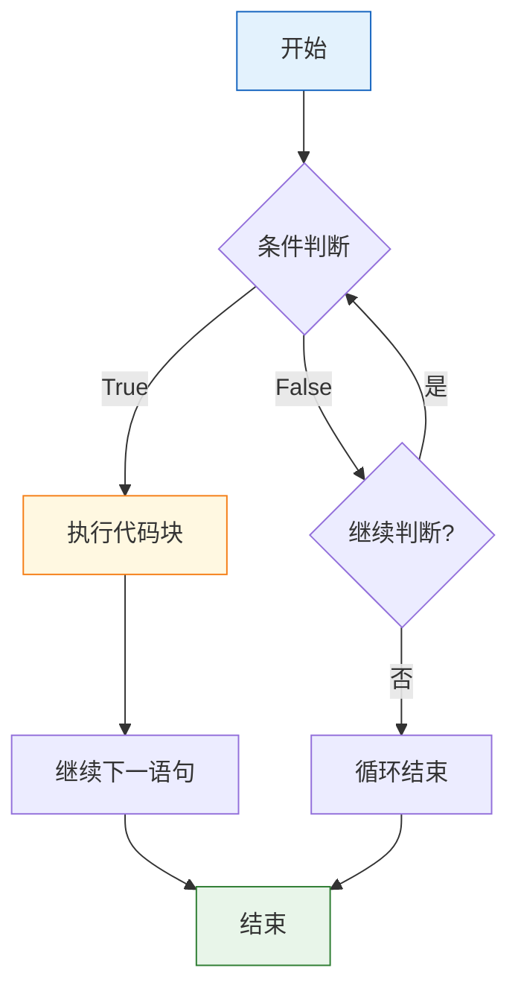

# L02: 运算符与控制流 — 详细教学

> **课程编号**: L02  
> **所属阶段**: Stage 0 - Python 编程基础  
> **预计时长**: 6 小时  
> **难度**: ⭐⭐☆☆☆ (入门进阶)  
> **前置课程**: L01-python-core<br>
> **版本**: v2.1<br>
> **最后更新**: 2026-06-30  
> **核心版本**: Python 3.13

---

## 🎯 学习目标

完成本课程后，你将能够：

1. **运算符运算**：熟练使用算术、比较、逻辑、位运算
2. **控制流构建**：编写 if/elif/else 条件语句和循环结构
3. **短路特性**：理解逻辑运算符的短路求值机制
4. **循环控制**：使用 break/continue 控制循环流程
5. **循环else子句**：使用 for-else/while-else 处理"未找到"场景
6. **模式匹配**：使用 match-case 处理复杂模式匹配（Python 3.10+）
7. **进阶遍历**：使用 enumerate() 和 zip() 高效遍历和组合数据
8. **代码质量**：避免常见陷阱，编写高效的运算符和控制流代码

---

## 📖 课程导读

本课程将带你掌握 Python 编程的两大核心要素：**运算符**和**控制流**。

运算符是程序中最基本的计算单元，从简单的加减乘除到复杂的位运算，它们构成了所有表达式的基础。控制流则是程序的"灵魂"，决定了代码的执行路径和逻辑结构。

**为什么要合并这两个主题？**

在实际编程中，运算符和控制流是密不可分的：
- 条件语句需要比较运算符和逻辑运算符
- 循环控制需要算术运算符和赋值运算符
- 程序逻辑由运算符的结果决定控制流的走向

本课程通过整合这两个主题，让你在学习运算符时就能立即用控制流实践，在编写控制流时就能灵活运用各种运算符。

---

## Part 1: 运算符

### 1.1 算术运算符

#### 基本算术运算

Python 提供了 7 种算术运算符：

```python
# 加法
print(10 + 5)   # 15

# 减法
print(10 - 5)   # 5

# 乘法
print(10 * 5)   # 50

# 除法（返回浮点数）
print(10 / 5)   # 2.0
print(10 / 3)   # 3.3333333333333335

# 整除（向下取整）
print(10 // 3)  # 3
print(10 // 4)  # 2

# 取模（余数）
print(10 % 3)   # 1
print(10 % 4)   # 2

# 幂运算
print(2 ** 3)   # 8（2³）
print(10 ** 2)  # 100（10²）
```

#### 除法的两种形式

**普通除法 (`/`)**：总是返回浮点数

```python
print(10 / 2)   # 5.0（浮点数）
print(9 / 3)    # 3.0（浮点数）
print(10 / 3)   # 3.3333...
```

**整除 (`//`)**：向下取整，返回整数

```python
print(10 // 3)   # 3
print(9 // 2)    # 4
print(-10 // 3)  # -4（向下取整，不是截断）
```

⚠️ **注意**：整除是向下取整，不是简单截断小数部分！

```python
# 正数
print(7 // 2)    # 3（7/2=3.5，向下取整得3）

# 负数
print(-7 // 2)   # -4（-7/2=-3.5，向下取整得-4）
print(-7 // -2)  # 3（-7/-2=3.5，向下取整得3）
```

#### 取模运算的应用

取模运算在实际编程中非常有用：

```python
# 判断奇偶
num = 17
if num % 2 == 0:
    print("偶数")
else:
    print("奇数")

# 循环数组索引（用字符串代替）
# 取模运算确保索引不会越界
text = "ABC"
index = 5
print(text[index % len(text)])  # 'C'（5 % 3 = 2）

# 时间计算
hours = 25
print(f"{hours % 24} 点")  # 1 点（25 % 24 = 1）
```

#### 幂运算的特殊用法

```python
# 平方
print(5 ** 2)    # 25

# 立方
print(2 ** 3)    # 8

# 平方根
print(4 ** 0.5)  # 2.0（4的平方根）
print(9 ** 0.5)  # 3.0

# 倒数
print(2 ** -1)   # 0.5（2⁻¹）
```

---

### 1.2 比较运算符

比较运算符用于比较两个值，返回布尔值（`True` 或 `False`）。

#### 六种比较运算符

```python
x = 10
y = 5

# 等于
print(x == y)   # False
print(10 == 10) # True

# 不等于
print(x != y)   # True
print(10 != 10) # False

# 大于
print(x > y)    # True
print(5 > 10)   # False

# 小于
print(x < y)    # False
print(5 < 10)   # True

# 大于等于
print(x >= y)   # True
print(10 >= 10) # True

# 小于等于
print(x <= y)   # False
print(10 <= 10) # True
```

#### 链式比较

Python 支持链式比较，这是其他语言没有的特性：

```python
# 数学中的区间表示
x = 5
print(1 < x < 10)     # True（等价于 1 < x and x < 10）
print(0 < x < 3)      # False

# 多个比较
a, b, c = 1, 2, 3
print(a < b < c)      # True
print(a < b > c)      # False
```

#### 比较不同类型

```python
# 数字可以跨类型比较
print(10 == 10.0)     # True（整数和浮点数）
print(5 < 10.5)       # True

# 字符串按字典序比较
print("apple" < "banana")  # True
print("Python" < "python") # True（大写字母 < 小写字母）

# ⚠️ 不同类型通常不能比较
# print(10 < "20")    # TypeError
```

---

### 1.3 逻辑运算符

逻辑运算符用于组合布尔表达式。

#### 三种逻辑运算符

**`and`（逻辑与）**：全真才真

```python
print(True and True)    # True
print(True and False)   # False
print(False and False)  # False

# 实际应用
age = 25
has_license = True
if age >= 18 and has_license:
    print("可以开车")
```

**`or`（逻辑或）**：有真即真

```python
print(True or True)     # True
print(True or False)    # True
print(False or False)   # False

# 实际应用
is_weekend = True
is_holiday = False
if is_weekend or is_holiday:
    print("可以休息")
```

**`not`（逻辑非）**：取反

```python
print(not True)         # False
print(not False)        # True

# 实际应用
is_raining = False
if not is_raining:
    print("可以出门")
```

#### 短路特性（重要）

逻辑运算符具有**短路特性**：

**`and` 短路**：第一个为假，不计算第二个

```python
# 第一个为假，第二个不会执行
result = False and (1 / 0)  # 不会报错
print(result)  # False

# 第一个为真，第二个会执行
# result = True and (1 / 0)  # 会报错：ZeroDivisionError
```

**`or` 短路**：第一个为真，不计算第二个

```python
# 第一个为真，第二个不会执行
result = True or (1 / 0)   # 不会报错
print(result)  # True

# 第一个为假，第二个会执行
# result = False or (1 / 0)  # 会报错：ZeroDivisionError
```

**短路特性的应用**：

```python
# 安全访问（避免 None 错误）
user = None
# 如果 user 是 None，不会尝试访问 .name
name = user and user.name
print(name)  # None

# 默认值
username = input_name or "Guest"  # 如果 input_name 为空，使用 "Guest"
```

#### any() / all() — 批量逻辑判断

`any()` 和 `all()` 是对一组布尔值进行"或"和"与"判断的简洁方式：

```python
# any()：任意一个为 True 就返回 True（全假才返回 False）
# 使用字符串的真值特性（空字符串为假）
chars = "Ab0"
print(any(c.isdigit() for c in chars))  # True（包含数字）

# 使用 range 生成数字序列
print(any(x > 100 for x in range(95, 105)))  # True

# all()：全部为 True 才返回 True（全真才返回 True）
words = "hello"
print(all(c.islower() for c in words))  # True（全小写）

# 使用 range 检查
print(all(x >= 0 for x in range(1, 5)))  # True
```

> 📖 **性能提示**：`any()` 和 `all()` 都支持短路求值，在生成器表达式上使用效率最高。

#### 逻辑运算的优先级

```python
# not > and > or
result = not False or True and False
# 等价于：(not False) or (True and False)
# 结果：True or False = True
print(result)  # True
```

---

### 1.4 位运算符

位运算符对整数的二进制位进行操作。

#### 六种位运算符

```python
# 按位与（&）：两位都为1时结果为1
#     5 = 0101（二进制）
#     3 = 0011（二进制）
# 结果 = 0001 = 1
print(5 & 3)    # 1

# 按位或（|）：有1即为1
#     5 = 0101（二进制）
#     3 = 0011（二进制）
# 结果 = 0111 = 7
print(5 | 3)    # 7

# 按位异或（^）：不同为1，相同为0
#     5 = 0101（二进制）
#     3 = 0011（二进制）
# 结果 = 0110 = 6
print(5 ^ 3)    # 6

# 按位取反（~）：0变1，1变0（补码表示）
#     ~5 = -6（补码：...11111010）
print(~5)       # -6

# 左移（<<）：左移n位，相当于乘以2^n
#     5 << 1: 0101 → 10100 = 20（5 × 2¹）
#     5 << 2: 0101 → 101000 = 40（5 × 2²）
print(5 << 1)   # 10
print(5 << 2)   # 20

# 右移（>>）：右移n位，相当于除以2^n（向下取整）
#     5 >> 1: 0101 → 0010 = 2（5 ÷ 2¹，向下取整）
#     5 >> 2: 0101 → 0001 = 1（5 ÷ 2²，向下取整）
print(5 >> 1)   # 2
print(5 >> 2)   # 1
```

#### 位运算的应用

```python
# 快速乘除2的幂
x = 10
print(x << 1)   # 20（乘以2）
print(x << 2)   # 40（乘以4）
print(x >> 1)   # 5（除以2）

# 判断奇偶（比 % 2 更快）
num = 17
if num & 1:
    print("奇数")
else:
    print("偶数")

# 交换两个数（不用临时变量）
a, b = 5, 3
a = a ^ b
b = a ^ b
a = a ^ b
print(a, b)  # 3 5
```

---

### 1.5 赋值运算符

#### 基本赋值

```python
x = 10  # 赋值
```

#### 增强赋值运算符

```python
x = 10

x += 5   # x = x + 5  → 15
x -= 3   # x = x - 3  → 12
x *= 2   # x = x * 2  → 24
x /= 4   # x = x / 4  → 6.0
x //= 2  # x = x // 2 → 3.0
x %= 2   # x = x % 2  → 1.0
x **= 3  # x = x ** 3 → 1.0
```

**位运算的增强赋值**：

```python
x = 5
x &= 3   # x = x & 3
x |= 2   # x = x | 2
x ^= 1   # x = x ^ 1
x <<= 1  # x = x << 1
x >>= 1  # x = x >> 1
```

---

### 1.6 运算符优先级

从高到低：

1. `**`（幂）
2. `~`, `+x`, `-x`（一元运算符）
3. `*`, `/`, `//`, `%`（乘除）
4. `+`, `-`（加减）
5. `<<`, `>>`（位移）
6. `&`（按位与）
7. `^`（按位异或）
8. `|`（按位或）
9. `==`, `!=`, `>`, `<`, `>=`, `<=`（比较）
10. `not`（逻辑非）
11. `and`（逻辑与）
12. `or`（逻辑或）

**最佳实践**：使用括号明确运算顺序！

```python
# ❌ 难以理解
result = 2 + 3 * 4 ** 2 / 8

# ✅ 清晰明确
result = 2 + ((3 * (4 ** 2)) / 8)
```

---

## Part 2: 控制流

#
### 2.0 控制流概述

**控制流**决定了程序执行的顺序和路径：



**三种控制流结构**：

| 结构 | 说明 | 关键词 |
|------|------|--------|
| **顺序执行** | 按代码顺序逐行执行 | 默认 |
| **选择执行** | 根据条件选择执行路径 | `if`/`elif`/`else` |
| **循环执行** | 重复执行代码块 | `for`/`while` |

## 2.1 if/elif/else 条件语句

#### 基本语法

```python
if 条件:
    # 条件为真时执行
    pass
```

#### 单分支

```python
age = 20

if age >= 18:
    print("成年人")
```

#### 双分支

```python
age = 15

if age >= 18:
    print("成年人")
else:
    print("未成年人")
```

#### 多分支

```python
score = 85

if score >= 90:
    grade = "A"
elif score >= 80:
    grade = "B"
elif score >= 70:
    grade = "C"
elif score >= 60:
    grade = "D"
else:
    grade = "F"

print(f"成绩等级：{grade}")
```

#### 嵌套条件

```python
age = 25
has_license = True

if age >= 18:
    if has_license:
        print("可以开车")
    else:
        print("需要驾照")
else:
    print("年龄不够")
```

#### 三元表达式

Python 的简洁写法：

```python
# 传统写法
if x > 0:
    result = "正数"
else:
    result = "非正数"

# 三元表达式
result = "正数" if x > 0 else "非正数"

# 实际应用
age = 20
status = "成年" if age >= 18 else "未成年"
```

---

### 2.2 while 循环

#### 基本语法

```python
while 条件:
    # 循环体
    pass
```

#### 基本示例

```python
count = 0
while count < 5:
    print(f"计数：{count}")
    count += 1

# 输出：
# 计数：0
# 计数：1
# 计数：2
# 计数：3
# 计数：4
```

#### 无限循环（需要 break 退出）

```python
while True:
    user_input = input("输入 'quit' 退出：")
    if user_input == "quit":
        break
    print(f"你输入了：{user_input}")
```

#### 条件累加

```python
total = 0
num = 1

while num <= 100:
    total += num
    num += 1

print(f"1到100的和：{total}")  # 5050
```

---

### 2.3 for 循环

#### 基本语法

```python
for 变量 in 序列:
    # 循环体
    pass
```

#### 遍历 range()

```python
# range(stop)
for i in range(5):
    print(i)  # 0, 1, 2, 3, 4

# range(start, stop)
for i in range(2, 5):
    print(i)  # 2, 3, 4

# range(start, stop, step)
for i in range(0, 10, 2):
    print(i)  # 0, 2, 4, 6, 8

# 倒序
for i in range(5, 0, -1):
    print(i)  # 5, 4, 3, 2, 1
```

#### 遍历字符串

```python
for char in "Python":
    print(char)
# P
# y
# t
# h
# o
# n
```

---

### 2.4 break 和 continue

#### break：跳出循环

```python
# 在 for 循环中
for i in range(10):
    if i == 5:
        break
    print(i)  # 0, 1, 2, 3, 4

# 在 while 循环中
count = 0
while True:
    if count >= 5:
        break
    print(count)
    count += 1
```

#### continue：跳过当前迭代

```python
# 跳过偶数
for i in range(10):
    if i % 2 == 0:
        continue
    print(i)  # 1, 3, 5, 7, 9

# 跳过特定值
for i in range(5):
    if i == 2:
        continue
    print(i)  # 0, 1, 3, 4
```

#### break vs continue

```python
# break：完全跳出循环
for i in range(5):
    if i == 2:
        break
    print(i)
# 输出：0, 1

# continue：跳过当前，继续下一次
for i in range(5):
    if i == 2:
        continue
    print(i)
# 输出：0, 1, 3, 4
```

---

### 2.5 pass 占位符

`pass` 是空操作，用于占位：

```python
# 未实现的条件分支
if condition:
    pass  # TODO: 稍后实现
else:
    print("else 分支")

# 空循环
for i in range(10):
    pass  # 什么都不做
```

> 💡 **L04 将学到**：函数定义（`def`）也需要 `pass` 作为空函数体的占位符。
```

---

### 2.6 循环的 else 子句

`for` 和 `while` 循环都可以有一个 `else` 分支，在循环**正常结束**（未执行 `break`）时执行。

#### 为什么需要 for-else？

常见的编程场景：遍历序列寻找某个元素，如果找到了就处理，如果没找到就执行"未找到"的逻辑。

```python
# ❌ 传统写法：需要标志变量
# 使用 range 生成待检测序列
target = 4
found = False

for num in range(2, 10):  # 检测 2-9 是否为质数
    if num == target:
        found = True
        print(f"Found {target}")
        break

if not found:
    print(f"{target} not in range")
```

```python
# ✅ for-else：更优雅
# 使用 range 代替 list
target = 4

for num in range(2, 10):
    if num == target:
        print(f"Found {target}")
        break
else:
    # 只有循环正常结束（未 break）时才执行
    print(f"{target} not in range")
```

#### for-else 实际应用

**场景 1: 质数判断**

```python
# 质数判断逻辑（for-else 语法演示）
# 用 for 遍历可能的因子，else 分支处理"未找到因子"的情况
n = 17
found_factor = False
for i in range(2, int(n ** 0.5) + 1):
    if n % i == 0:
        found_factor = True
        break
else:
    # 只有循环正常结束（未 break）时才执行
    print(f"{n} 是质数")  # 输出：17 是质数
```

> 💡 **L04 将学到**：可以将上述逻辑封装为函数 `def is_prime(n):`，提高复用性。

**场景 2: 验证所有元素**

```python
# 验证字符串中所有字符是否满足条件
password = "SecurePass1"
has_upper = False
has_digit = False

for char in password:
    if char.isupper():
        has_upper = True
    if char.isdigit():
        has_digit = True
    if has_upper and has_digit:
        break

if has_upper and has_digit:
    print("密码符合要求！")
else:
    print("密码需要包含大写字母和数字")
```

#### while-else 示例

```python
# 尝试登录系统
attempts = 3
password = "secret"

while attempts > 0:
    guess = input("输入密码: ")
    if guess == password:
        print("登录成功！")
        break
    attempts -= 1
    print(f"密码错误，剩余 {attempts} 次尝试")
else:
    # 循环正常结束（attempts 变为 0）
    print("账户已被锁定")
```

#### for-else 执行流程图

```
┌─────────────────┐
│   for item in   │
│     iterable     │
└────────┬────────┘
         │
         ▼
    ┌─────────┐
    │  找到?  │────Yes────┌──────────┐
    └────┬────┘           │ 执行 break │
         │No              └────┬─────┘
         ▼                     │
    ┌─────────┐                 │
    │  执行循环体│                │
    └────┬────┘                 │
         │                      │
         └───────────┬───────────┘
                     │
                     ▼
              ┌──────────────┐
              │   循环结束？  │
              └──────┬───────┘
                     │
          ┌──────────┴──────────┐
          │                     │
          ▼                     ▼
    ┌───────────┐        ┌───────────┐
    │ 执行 else  │        │   结束    │
    │  (未break) │        │           │
    └───────────┘        └───────────┘
```

#### 常见错误

```python
# ❌ 错误：忘记 else 会在未 break 时执行
for i in range(5):
    if i == 10:  # 永远不会找到
        break
else:
    print("Loop finished")  # 这行会执行！
```

---

### 2.7 嵌套控制流

#### 嵌套循环

```python
# 打印乘法表
for i in range(1, 10):
    for j in range(1, i + 1):
        print(f"{j}×{i}={i*j}", end="\t")
    print()  # 换行
```

#### 循环中的条件

```python
# 打印 1-20 之间的质数
for num in range(2, 21):
    is_prime = True
    for i in range(2, num):
        if num % i == 0:
            is_prime = False
            break
    if is_prime:
        print(num, end=" ")
```

---

### 2.8 match-case 模式匹配（Python 3.10+）

#### 为什么需要 match-case？

传统的 if-elif-else 链在处理多个固定值时不够简洁。match-case 提供了更清晰的结构化模式匹配，类似于其他语言的 switch 语句，但更强大。

```python
# ❌ if-elif-else 写法
status_code = 404
if status_code == 200:
    print("OK")
elif status_code == 404:
    print("Not Found")
elif status_code == 500:
    print("Server Error")
else:
    print("Unknown")

# ✅ match-case 写法
match status_code:
    case 200:
        print("OK")
    case 404:
        print("Not Found")
    case 500:
        print("Server Error")
    case _:
        print("Unknown")
```

#### 基本语法

```python
match subject:
    case pattern1:
        # 处理 pattern1
    case pattern2:
        # 处理 pattern2
    case _:
        # 默认处理（类似 else）
```

#### 简单值匹配

```python
status_code = 404

match status_code:
    case 200:
        print("OK - 请求成功")
    case 201:
        print("Created - 资源创建成功")
    case 404:
        print("Not Found - 资源不存在")
    case 500:
        print("Server Error - 服务器错误")
    case _:
        print(f"Unknown status: {status_code}")
```

#### 匹配多个值（OR 模式）

```python
day = "Saturday"

match day:
    case "Monday" | "Tuesday" | "Wednesday" | "Thursday" | "Friday":
        print("工作日")
    case "Saturday" | "Sunday":
        print("周末")
    case _:
        print("无效的日期")
```

#### 结构化模式匹配（元组）

```python
point = (0, 5)

match point:
    case (0, 0):
        print("原点")
    case (0, y):
        print(f"Y轴上，y = {y}")
    case (x, 0):
        print(f"X轴上，x = {x}")
    case (x, y):
        print(f"平面点 ({x}, {y})")
```

**执行顺序**：Python 会从上到下匹配第一个满足的模式。一旦匹配成功，就执行对应的代码块，不再继续匹配其他模式。

#### 带守卫的条件模式（Guards）

在模式后使用 `if` 关键字添加额外条件：

```python
age = 25

match age:
    case x if x < 0:
        print("无效年龄")
    case x if x < 18:
        print("未成年")
    case x if x < 65:
        print("成年人")
    case _:
        print("老年人")
```

#### 实际应用：HTTP 响应处理

```python
# HTTP 状态码处理（match-case 语法演示）
# L04 将学到如何将这段逻辑封装成函数 def handle_response(status_code, data)
status_code = 200
data = {"user": "Alice"}

match status_code:
    case 200 | 201:
        print(f"成功: {data}")
    case 400:
        print("请求错误")
    case 401 | 403:
        print("未授权")
    case 404:
        print("资源不存在")
    case _:
        print(f"未知错误: {status_code}")
```

#### match-case vs if-elif vs 函数模式（推荐做法）

> ⚠️ **预习提示**：`def` 函数定义将在 L04 中学习。当前 match-case 示例仅演示语法。

| 场景 | 推荐 | 原因 |
|------|------|------|
| 固定值匹配 | match-case | 更清晰、结构化 |
| 范围条件 | if-elif | 更灵活 |
| 复杂逻辑 | 函数封装 | 可复用、易测试 |
| 多值 OR 匹配 | match-case | `case A \| B \| C` 更简洁 |

**推荐模式（函数封装）**：

> 📖 **L04 将学到**：如何将 match-case 封装为独立函数
>
> ```python
> # L04 示例：
> def handle_response(status_code: int, data: dict) -> dict:
>     match status_code:
>         case 200 | 201:
>             return {"success": True, "data": data}
>         case 404:
>             return {"success": False, "error": "Not Found"}
>         case _:
>             return {"success": False, "error": f"Unknown: {status_code}"}
> ```

#### match-case 高级用法

```python
# 匹配字符串前缀
action = "start:server"

match action:
    case "start:" + name:
        print(f"启动服务: {name}")
    case "stop:" + name:
        print(f"停止服务: {name}")
    case _:
        print("未知命令")

# 匹配数字范围（用守卫）
score = 85

match score:
    case s if s >= 90:
        print("优秀")
    case s if s >= 80:
        print("良好")
    case s if s >= 60:
        print("及格")
    case _:
        print("不及格")
```

#### match-case vs if-elif-else

| 场景 | 推荐 | 原因 |
|------|------|------|
| 固定值匹配 | match-case | 更清晰、结构化 |
| 范围条件 | if-elif | 更灵活 |
| 复杂逻辑 | if-elif | 支持任意表达式 |
| 多值 OR 匹配 | match-case | `case A \| B \| C` 更简洁 |

---

### 2.9 enumerate() 和 zip() — L03 预习

> 📖 **L03 将学到**：`enumerate()` 和 `zip()` 常与 list（列表）和 dict（字典）配合使用，用于高效遍历和组合数据。当前 L02 仅介绍其基本语法。

```python
# enumerate() 为可迭代对象添加索引编号
# 当前 L02 可与字符串配合使用
text = "Python"
for index, char in enumerate(text, start=1):
    print(f"{index}: {char}")
# 输出：1: P, 2: y, 3: t, 4: h, 5: o, 6: n

# zip() 并行遍历多个序列
# 当前 L02 可与字符串配合使用
name = "AB"
nums = "12"
for c1, c2 in zip(name, nums):
    print(f"{c1} -> {c2}")
# 输出：A -> 1, B -> 2
```

> 💡 **L03 实践**：在 L03 学习列表和字典后，再结合 enumerate/zip 进行综合练习。

---

## 💭 课堂思考

### 思考 1: match-case vs if-elif — 何时使用哪个？

**问题**：在什么场景下你会选择 match-case 而不是 if-elif？反之亦然？

**引导思考**：
- match-case 的模式匹配能力有哪些独特优势？
- 什么情况下 if-elif 更灵活？
- 在 HTTP 状态码处理、命令解析中，哪种更合适？

**提示**：考虑代码可读性、维护性、是否需要复杂条件表达式。

---

### 思考 2: 运算符优先级实验

**问题**：不看文档，你能预测下面表达式的结果吗？

```python
result1 = 2 + 3 * 4      # ?
result2 = 2 ** 3 ** 2    # ?
result3 = 10 > 5 == True # ?
result4 = not 0 and 1 or 2  # ?
```

**引导思考**：
- 为什么需要优先级规则？
- 如何通过括号提高代码可读性？
- 在实际项目中，你会如何写这些表达式？

**实验建议**：在 Python REPL 中运行并观察结果，然后用括号改写。

---

### 思考 3: for-else 的实际应用

**问题**：你能想到 3 个实际场景，在这些场景中 for-else 比传统方法更优雅吗？

**引导思考**：
- 查找元素是否存在
- 验证所有条件是否满足
- 检查数据合法性

**对比**：
```python
# 传统方法
found = False
for item in items:
    if condition(item):
        found = True
        break
if not found:
    print("未找到")

# for-else 方法
for item in items:
    if condition(item):
        break
else:
    print("未找到")
```

哪种更清晰？

---


## 💭 课堂思考

### 思考 1: 为什么整除是向下取整而非截断？

**问题**：`10 // 3 = 3`，但 `-10 // 3 = -4`（不是 -3）？

**引导思考**：
- 数学上，-3.33... 向下取整（向负无穷）应该是 -4
- 截断（向零取整）才是 -3
- 为什么 Python 选择向下取整？

**延伸**：了解不同编程语言的选择：
- Python、Ruby：向下取整
- C、JavaScript：向零截断

---

### 思考 2: 短路求值的工程价值

**问题**：短路求值只是"优化"吗？

**引导思考**：
- 安全性场景：`user and user.is_admin`
- 性能场景：避免不必要的计算
- 防御性编程：避免 NullPointerException

**代码示例**：
```python
# 短路求值避免 IndexError
data = get_data()  # 可能返回 None
if data and data[0]:
    process(data[0])
```

---

### 思考 3: for-else 的语义理解

**问题**：for-else 中的 else 什么时候执行？

**引导思考**：
- 循环被 break 跳过 else
- 循环正常完成（未 break）执行 else
- 循环体一次都没执行（空序列），else 仍然执行

**实验验证**：
```python
for i in []:  # 空序列
    print(i)
else:
    print("else 执行")  # 这里会执行吗？
```

---

### 思考 4: match-case vs if-elif 的选择

**问题**：match-case 相比 if-elif 有什么优势？

**引导思考**：
- 结构清晰度：固定值匹配
- 模式能力：结构化模式匹配
- 性能：编译器优化

**适用场景**：
- HTTP 状态码 → match-case
- 复杂条件 → if-elif
- 范围判断 → if-elif

## 🎓 核心知识点总结

### Part 1: 运算符

1. **算术运算符**：注意 `/` vs `//`，负数取模和整除
2. **比较运算符**：支持链式比较
3. **逻辑运算符**：短路特性（and/or）
4. **位运算符**：高效的底层操作
5. **赋值运算符**：增强赋值（+=, -=, 等）
6. **优先级**：使用括号明确顺序

### Part 2: 控制流

1. **if/elif/else**：多分支条件，三元表达式
2. **while**：条件循环，注意无限循环
3. **for**：遍历序列，range() 的灵活用法
4. **break**：跳出循环
5. **continue**：跳过当前迭代
6. **嵌套**：循环嵌套、条件嵌套

### 实用技巧

**1. 整除向下取整**：
```python
# ❌ 误解：以为是截断
print(-7 // 2)  # -4（不是 -3）

# ✅ 正确理解：向下取整
print(-7 // 2)  # -4
```

**2. 快速判断奇偶**：
```python
# 用位运算（更快）
num = 17
if num & 1:
    print("奇数")
else:
    print("偶数")
```

**3. 安全访问避免 None 错误**：
```python
user = None
name = user and user.name  # 短路：返回 None
```

**4. 默认值设置**：
```python
username = input_name or "Guest"  # 空值时使用默认值
```

### 运算符速查表

| 类别 | 运算符 | 说明 | 示例 |
|------|--------|------|------|
| 算术 | `+`, `-`, `*`, `/` | 加减乘除 | `10 / 3 = 3.33...` |
| 算术 | `//`, `%` | 整除、取模 | `10 // 3 = 3`, `10 % 3 = 1` |
| 算术 | `**` | 幂运算 | `2 ** 3 = 8` |
| 比较 | `==`, `!=`, `>`, `<`, `>=`, `<=` | 比较运算 | `5 > 3 → True` |
| 逻辑 | `and`, `or`, `not` | 逻辑运算 | `True and False → False` |
| 位运算 | `&`, `|`, `^`, `~` | 位运算 | `5 & 3 = 1` |
| 位运算 | `<<`, `>>` | 移位 | `5 << 1 = 10` |
| 赋值 | `+=`, `-=`, `*=`, `/=` | 增强赋值 | `x += 5` |

### 控制流速查表

```python
# 条件分支
if condition:
    pass
elif another_condition:
    pass
else:
    pass

# 三元运算符
result = value_if_true if condition else value_if_false

# for 循环
for item in iterable:
    pass

# while 循环
while condition:
    pass

# break 和 continue
for i in range(10):
    if i == 5:
        break      # 退出循环
    if i % 2 == 0:
        continue   # 跳过偶数
```

### 典型应用场景

- 🧮 **计算器**：输入转换 + 算术运算 + 格式化输出
- ✅ **条件判断**：用户认证、年龄验证、成绩评级
- 🔄 **循环遍历**：列表处理、数据聚合、计数器
- 🔢 **位运算**：权限控制、标志位管理、算法优化

---

## 💡 常见陷阱与最佳实践

### 陷阱 1：整除的向下取整

```python
# ❌ 误解：以为是截断
print(-7 // 2)  # -4（不是 -3）

# ✅ 正确理解：向下取整
# -7 / 2 = -3.5 → 向下取整 → -4
```

### 陷阱 2：浮点数比较

> 📖 **相关阅读**：此陷阱的详细原理请参见 [L01 浮点数陷阱](../L01-python-core/lesson.md#陷阱1-浮点数精度)。

```python
# ❌ 错误
if 0.1 + 0.2 == 0.3:
    print("相等")  # 不会执行

# ✅ 正确
# 使用 abs() 和精度比较（不依赖 math 模块）
if abs((0.1 + 0.2) - 0.3) < 1e-9:
    print("相等")
```

### 陷阱 3：while 无限循环

```python
# ❌ 错误：忘记更新条件
count = 0
while count < 5:
    print(count)
    # 忘记 count += 1，无限循环

# ✅ 正确
count = 0
while count < 5:
    print(count)
    count += 1
```

### 最佳实践 1：使用括号明确优先级

```python
# ❌ 不推荐
result = 2 + 3 * 4

# ✅ 推荐
result = 2 + (3 * 4)
```

### 最佳实践 2：避免深层嵌套

```python
# ❌ 不推荐：深层嵌套
if condition1:
    if condition2:
        if condition3:
            # 代码

# ✅ 推荐：提前返回
if not condition1:
    return
if not condition2:
    return
if not condition3:
    return
# 代码
```

### 最佳实践 3：for 优于 while

```python
# ❌ 不推荐
i = 0
while i < 5:
    print(i)
    i += 1

# ✅ 推荐
for i in range(5):
    print(i)
```

---

## ❌ 学生常见错误

### 错误 1: 赋值 vs 比较

```python
# ❌ 错误写法
if x = 5:  # SyntaxError: 不能在 if 中使用赋值
    print(x)

# ✅ 正确写法
if x == 5:  # 使用 == 比较
    print(x)

# 📝 说明
# = 是赋值运算符，== 是比较运算符
# 这是新手最常见的错误之一！
```

---

### 错误 2: 浮点数直接比较

```python
# ❌ 错误写法
if 0.1 + 0.2 == 0.3:
    print("相等")  # 不会执行！

# ✅ 正确写法
# 使用 abs() 和精度比较（不依赖 math 模块）
if abs((0.1 + 0.2) - 0.3) < 1e-9:
    print("相等")

# 或者设置精度
if abs((0.1 + 0.2) - 0.3) < 1e-9:
    print("相等")

# 📝 说明
# 浮点数有精度问题，不能直接用 == 比较
# 0.1 + 0.2 = 0.30000000000000004
```

---

### 错误 3: 布尔值比较

```python
# ❌ 错误写法
if is_valid == True:  # 冗余的比较
    pass

if is_empty == False:  # 冗余的比较
    pass

# ✅ 正确写法
if is_valid:  # 直接使用布尔值
    pass

if not is_empty:  # 使用 not 取反
    pass

# 📝 说明
# 布尔值本身就是 True/False，不需要再比较
# if is_valid: 已经是布尔表达式
```

---

## 🚀 实战案例

### 案例 1：猜数字游戏

```python
# 猜数字游戏（1-100）
# 秘密数字固定为 42（方便演示）
secret = 42
attempts = 0

print("猜数字游戏（1-100）")

while True:
    guess = int(input("请输入你的猜测："))
    attempts += 1

    if guess < secret:
        print("太小了！")
    elif guess > secret:
        print("太大了！")
    else:
        print(f"恭喜！你用了 {attempts} 次猜中了！")
        break
```

### 案例 2：质数判断

```python
# 质数判断（L04 后可封装为函数 def is_prime(n)）
# 遍历 2 到 sqrt(n)，检查是否有因子
for num in range(2, 20):
    found_factor = False
    for i in range(2, int(num ** 0.5) + 1):
        if num % i == 0:
            found_factor = True
            break
    if not found_factor:
        print(num, end=" ")
# 输出：2 3 5 7 11 13 17 19
```

### 案例 3：打印图案

```python
# 直角三角形
n = 5
for i in range(1, n + 1):
    print("* " * i)

# 输出：
# *
# * *
# * * *
# * * * *
# * * * * *

# 等腰三角形
for i in range(1, n + 1):
    spaces = " " * (n - i)
    stars = "* " * i
    print(spaces + stars)

# 输出：
#     *
#    * *
#   * * *
#  * * * *
# * * * * *
```

---

## 📚 延伸阅读

### 官方文档
- [Python 控制流](https://docs.python.org/zh-cn/3/tutorial/controlflow.html)
- [Python 运算符优先级](https://docs.python.org/zh-cn/3/reference/expressions.html#operator-precedence)

### 推荐练习
- [LeetCode 基础题](https://leetcode.cn/)：使用控制流解决算法题
- [Python Tutor](http://pythontutor.com/)：可视化代码执行

---

## ✅ 自检清单

完成本课程后，你应该能够：

- [ ] 使用所有算术运算符（+, -, *, /, //, %, **）
- [ ] 理解 `/` 和 `//` 的区别
- [ ] 使用比较运算符和链式比较
- [ ] 理解逻辑运算符的短路特性
- [ ] 使用位运算符进行底层操作
- [ ] 使用增强赋值运算符
- [ ] 理解运算符优先级
- [ ] 编写 if/elif/else 条件语句
- [ ] 使用三元表达式
- [ ] 编写 while 循环
- [ ] 使用 for 循环遍历序列
- [ ] 灵活使用 range()
- [ ] 使用 break 和 continue 控制循环
- [ ] 编写嵌套循环和条件

---

## 📝 进阶预告

完成本课程后，你已经掌握了运算符和控制流。在下一课 [L03: 数据结构](../L03-data-structures/lesson.md) 中，我们将学习：

- 📋 **列表（List）**：有序可变容器、切片、列表推导式
- 📦 **元组（Tuple）**：不可变序列、元组解包
- 🔑 **字典（Dict）**：键值对映射、.get() 安全访问
- 🔮 **集合（Set）**：无序不重复、交集/并集/差集
- 🛠️ **collections 模块**：defaultdict、Counter、deque

> 💡 **学习路径**：L02 → L03（数据结构）→ L04（函数与模块）→ ...


---


---

## 📝 本章总结

### 核心知识点

| 概念 | 说明 |
|------|------|
| 本课程 | 运算符与控制流 |

### 关键要点

1. 理解本课程的核心概念
2. 掌握主要语法和使用方法
3. 能够独立完成课程练习

### 学习收获

完成本课程后，你已经：
- ✅ 掌握了本课程的核心概念
- ✅ 能够编写基础的 Python 代码
- ✅ 为后续学习打下坚实基础


## 🔗 下一步

完成本课程后，继续学习：

- [L03: 数据结构](../L03-data-structures/lesson.md)

在下一课中，我们将学习：
- 列表（list）：动态数组
- 元组（tuple）：不可变序列
- 字典（dict）：键值对映射
- 集合（set）：无序不重复集合
