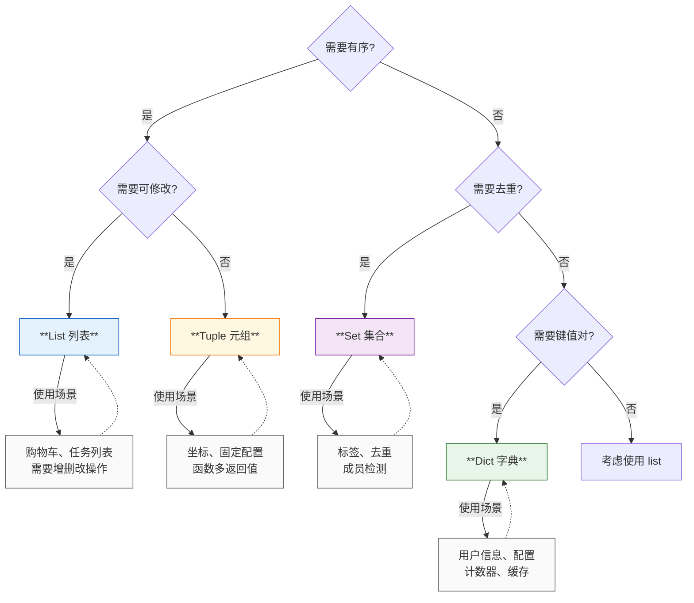
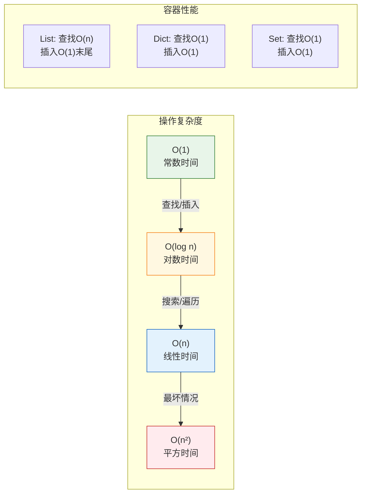

# L03: 数据结构 — 详细教学

> **课程编号**: L03
> **所属阶段**: Stage 0 - Python 编程基础
> **预计时长**: 8 小时
> **难度**: ⭐⭐☆☆☆ (入门进阶)
> **前置课程**: L01-python-core, L02-operators-control
> **版本**: v2.1
> **最后更新**: 2026-06-30
> **核心版本**: Python 3.13

---

## 🎯 学习目标

完成本课程后，你将能够：

1. **数据结构选择**：根据需求选择合适的列表、元组、字典、集合
2. **列表操作**：创建、索引、切片、增删改查、列表推导式
3. **字典操作**：键值对访问、安全访问 `.get()`、遍历、合并运算符
4. **集合运算**：去重、成员检测、交集/并集/差集
5. **元组特性**：不可变性、解包、作为字典键
6. **性能感知**：理解各数据结构的时间复杂度差异
7. **collections 扩展**：`defaultdict`、`Counter`、`deque` 的实战应用

---

## 📖 课程导读

本课程将带你掌握 Python 的四大核心数据结构：**list（列表）**、**dict（字典）**、**set（集合）**、**tuple（元组）**。

数据结构是程序的骨架，选对数据结构能让代码效率提升 10 倍甚至 100 倍。本课程不仅教你**如何使用**，更重要的是教你**何时使用**、**为何使用**。

**为什么要整合四大容器？**

传统课程往往将容器分散讲解，导致学习者无法建立全局视角。本课程通过**对比讲解**，让你能够：
- 理解每种容器的设计哲学
- 掌握容器选择的判断标准
- 建立性能感知的编程习惯
- 理解可变 vs 不可变的深层含义

**核心亮点**：
- ✅ 推导式 vs 生成器表达式（内存差异 1000 倍）
- ✅ Python 3.9+ 字典合并运算符 `|`
- ✅ 防御性数据解析（`.get()` + `match/case`）
- ✅ 类型注解现代化（`list[T]`, `dict[K,V]`）

---

## Part 1: 序列类型（列表 + 元组）

### 数据结构概述

单个变量只能存储一个值，但实际应用中我们需要处理**批量数据**：

```python
# ❌ 不使用数据结构：重复且难以维护
user1_name = "Alice"
user2_name = "Bob"
user3_name = "Charlie"
# ... 100 个用户怎么办？

# ✅ 使用列表：简洁且可扩展
users = ["Alice", "Bob", "Charlie"]
for user in users:
    print(user)
```

#### Python 的四大内置数据结构

| 数据结构 | 有序 | 可变 | 允许重复 | 典型用途 |
|---------|------|------|---------|---------|
| **列表 (List)** | ✅ | ✅ | ✅ | 通用容器、购物车、任务列表 |
| **元组 (Tuple)** | ✅ | ❌ | ✅ | 固定数据、函数返回多值、字典键 |
| **字典 (Dict)** | ✅ (Python 3.7+) | ✅ | ❌ (键) | 配置、用户信息、计数器 |
| **集合 (Set)** | ❌ | ✅ | ❌ | 去重、成员检测、集合运算 |


### 数据结构选择指南（可视化）

选择正确的数据结构能让代码效率提升 10 倍甚至 100 倍：



**时间复杂度对比**：




## 📋 列表（List）

### 什么是列表？

列表是 Python 中最常用的**有序可变容器**，可以存储任意类型的元素。

### 创建列表

```python
# 空列表
empty_list = []
empty_list = list()

# 包含元素的列表
numbers = [1, 2, 3, 4, 5]
mixed = [1, "hello", 3.14, True, [1, 2]]  # 可以混合类型

# 列表推导式（高效创建）
squares = [x**2 for x in range(10)]  # [0, 1, 4, 9, 16, ...]
evens = [x for x in range(20) if x % 2 == 0]  # [0, 2, 4, 6, ...]
```

### 访问元素

```python
fruits = ["apple", "banana", "cherry", "date"]

# 索引访问（从 0 开始）
print(fruits[0])   # "apple"
print(fruits[1])   # "banana"

# 负索引（从末尾开始）
print(fruits[-1])  # "date" (最后一个)
print(fruits[-2])  # "cherry"

# 切片 [start:stop:step]
print(fruits[1:3])    # ["banana", "cherry"]
print(fruits[:2])     # ["apple", "banana"] (前2个)
print(fruits[2:])     # ["cherry", "date"] (从索引2到末尾)
print(fruits[::2])    # ["apple", "cherry"] (每隔2个取1个)
print(fruits[::-1])   # ["date", "cherry", "banana", "apple"] (反转)
```

### 修改列表

```python
numbers = [1, 2, 3, 4, 5]

# 修改单个元素
numbers[0] = 10  # [10, 2, 3, 4, 5]

# 修改切片
numbers[1:3] = [20, 30]  # [10, 20, 30, 4, 5]

# 追加元素
numbers.append(6)  # [10, 20, 30, 4, 5, 6]

# 插入元素
numbers.insert(1, 15)  # [10, 15, 20, 30, 4, 5, 6]

# 扩展列表
numbers.extend([7, 8, 9])  # [10, 15, 20, 30, 4, 5, 6, 7, 8, 9]

# 删除元素
numbers.remove(20)  # 删除第一个值为 20 的元素
del numbers[0]      # 删除索引 0 的元素
popped = numbers.pop()  # 删除并返回最后一个元素
```

### 列表常用方法

```python
numbers = [3, 1, 4, 1, 5, 9, 2, 6]

# 排序
numbers.sort()             # 原地排序：[1, 1, 2, 3, 4, 5, 6, 9]
sorted_numbers = sorted(numbers)  # 返回新列表（不修改原列表）

# 反转
numbers.reverse()          # 原地反转

# 计数
count = numbers.count(1)   # 统计 1 出现的次数

# 查找索引
index = numbers.index(5)   # 返回 5 的第一个索引

# 清空
numbers.clear()            # []
```
### 列表推导式（进阶）

```python
# 基础：生成平方数
squares = [x**2 for x in range(10)]

# 带条件：过滤偶数
evens = [x for x in range(20) if x % 2 == 0]

# 嵌套：二维列表
matrix = [[i*j for j in range(3)] for i in range(3)]
# [[0, 0, 0], [0, 1, 2], [0, 2, 4]]

# 转换：大写转换
words = ["hello", "world"]
upper_words = [word.upper() for word in words]  # ["HELLO", "WORLD"]

# 展平嵌套列表
nested = [[1, 2], [3, 4], [5, 6]]
flat = [num for sublist in nested for num in sublist]  # [1, 2, 3, 4, 5, 6]
```
---

## 📦 元组（Tuple）

### 什么是元组？

元组是**不可变的有序容器**，一旦创建就不能修改。

### 为什么需要元组？

1. **数据安全**：防止意外修改
2. **性能优势**：比列表更快，占用内存更小
3. **可作为字典键**：不可变类型才能做键
4. **函数返回多值**：自然的多返回值语法

### 创建元组

```python
# 空元组
empty = ()
empty = tuple()

# 包含元素的元组
coordinates = (3, 5)
person = ("Alice", 25, "Beijing")

# 单元素元组（注意逗号）
single = (42,)  # ✅ 正确
not_tuple = (42)  # ❌ 这是整数，不是元组

# 不使用括号（元组打包）
point = 1, 2, 3  # (1, 2, 3)
```
### 访问元组

```python
person = ("Alice", 25, "Beijing")

# 索引访问
print(person[0])   # "Alice"
print(person[-1])  # "Beijing"

# 切片
print(person[1:])  # (25, "Beijing")

# 元组解包
name, age, city = person
print(f"{name} is {age} years old")

# 部分解包（Python 3.x）
first, *rest = (1, 2, 3, 4, 5)  # first=1, rest=[2,3,4,5]
```
### 元组的不可变性

```python
point = (3, 5)

# ❌ 错误：不能修改元组
# point[0] = 10  # TypeError: 'tuple' object does not support item assignment

# ✅ 可以创建新元组
new_point = (10,) + point[1:]  # (10, 5)

# ⚠️ 注意：如果元组包含可变对象，该对象可以修改
nested = ([1, 2], [3, 4])
nested[0].append(3)  # 合法！nested 变为 ([1, 2, 3], [3, 4])
```
---

## Part 2: 映射与集合（字典 + 集合）

### 📖 字典（Dict）

字典是**键值对（key-value）的无序集合**，通过键快速访问值。

### 创建字典

```python
# 空字典
empty = {}
empty = dict()

# 包含数据的字典
user = {
    "name": "Alice",
    "age": 25,
    "city": "Beijing"
}

# 使用 dict() 构造
user = dict(name="Alice", age=25, city="Beijing")

# 从键值对列表创建
pairs = [("name", "Alice"), ("age", 25)]
user = dict(pairs)

# 字典推导式
squares = {x: x**2 for x in range(5)}  # {0: 0, 1: 1, 2: 4, 3: 9, 4: 16}
```
### 访问字典

```python
user = {"name": "Alice", "age": 25, "city": "Beijing"}

# 通过键访问
print(user["name"])  # "Alice"

# 安全访问（推荐）
print(user.get("name"))        # "Alice"
print(user.get("email"))       # None（不抛异常）
print(user.get("email", "N/A"))  # "N/A"（提供默认值）

# 检查键是否存在
if "age" in user:
    print(user["age"])
```
### 修改字典

```python
user = {"name": "Alice", "age": 25}

# 添加/修改键值对
user["city"] = "Beijing"       # 添加新键
user["age"] = 26               # 修改现有键

# 更新多个键值对
user.update({"email": "alice@example.com", "phone": "123456"})

# 删除键值对
del user["city"]               # 删除键
age = user.pop("age")          # 删除并返回值
user.clear()                   # 清空字典
```
### 遍历字典

```python
user = {"name": "Alice", "age": 25, "city": "Beijing"}

# 遍历键
for key in user:
    print(key)

# 遍历键（显式）
for key in user.keys():
    print(key)

# 遍历值
for value in user.values():
    print(value)

# 遍历键值对（推荐）
for key, value in user.items():
    print(f"{key}: {value}")
```
### 字典常用方法

```python
user = {"name": "Alice", "age": 25}

# setdefault：如果键不存在则设置默认值
email = user.setdefault("email", "default@example.com")

# fromkeys：从键列表创建字典
keys = ["a", "b", "c"]
new_dict = dict.fromkeys(keys, 0)  # {"a": 0, "b": 0, "c": 0}
```

### 🎲 集合（Set）

集合是**无序且不重复元素**的容器，主要用于去重和集合运算。

### 创建集合

```python
# 空集合（注意不是 {}，那是字典）
empty = set()

# 包含元素的集合
numbers = {1, 2, 3, 4, 5}
mixed = {1, "hello", 3.14}  # 可以混合类型

# 从列表创建（自动去重）
numbers_list = [1, 2, 2, 3, 3, 4]
unique_numbers = set(numbers_list)  # {1, 2, 3, 4}
```
### 集合操作

```python
fruits = {"apple", "banana", "cherry"}

# 添加元素
fruits.add("date")

# 删除元素
fruits.remove("banana")    # 不存在会报错
fruits.discard("grape")    # 不存在不报错

# 清空
fruits.clear()
```
### 集合运算

```python
a = {1, 2, 3, 4, 5}
b = {4, 5, 6, 7, 8}

# 并集（所有元素）
print(a | b)         # {1, 2, 3, 4, 5, 6, 7, 8}
print(a.union(b))    # 同上

# 交集（共同元素）
print(a & b)             # {4, 5}
print(a.intersection(b)) # 同上

# 差集（a 有而 b 没有）
print(a - b)           # {1, 2, 3}
print(a.difference(b)) # 同上

# 对称差集（不同时在 a 和 b 中）
print(a ^ b)                      # {1, 2, 3, 6, 7, 8}
print(a.symmetric_difference(b))  # 同上

# 子集和超集
print({1, 2}.issubset({1, 2, 3}))      # True
print({1, 2, 3}.issuperset({1, 2}))    # True
```

### 冻结集合（frozenset）— 不可变集合

`frozenset` 是 `set` 的**不可变孪生**，创建后不能增删改，可作为字典键或放入另一个 `set`：

```python
# 创建冻结集合
colors = frozenset({"red", "green", "blue"})
numbers = frozenset([1, 2, 3, 3, 2])  # {1, 2, 3}（自动去重）

# ❌ 不可变：不能 add/remove/pop
# colors.add("yellow")  → AttributeError

# ✅ 只读操作全部可用
print("red" in colors)      # True（成员检测）
print(len(colors))          # 3（元素数量）
print(colors | {"cyan"})   # frozenset({'red','green','blue','cyan'})（返回新集合）

# ✅ 可作为字典键（set 不行）
valid_status = frozenset(["active", "pending", "approved"])
transition = {
    valid_status: "pending"  # frozenset 可哈希
}
print(transition[frozenset(["active", "pending"])])  # pending

# ✅ 可放入 set（set 不能放入 set，因为可变）
mutable_set = {1, 2, 3}
immutable_set = frozenset({4, 5, 6})
collection = {mutable_set, immutable_set}  # ❌ TypeError
collection = {immutable_set, frozenset({7, 8})}  # ✅ 合法

# 冻结集合的典型用途
# 1. 表示不可变的选项集合
PRIORITY_LEVELS = frozenset(["low", "medium", "high", "critical"])

# 2. 作为字典键（表达复合概念）
weekday = frozenset(["Mon", "Tue", "Wed", "Thu", "Fri"])
weekend = frozenset(["Sat", "Sun"])
days = {weekday: "work", weekend: "rest"}
```

> 📖 **何时用 `frozenset` vs `set`**：
> - 需要**作为字典键**或放入 `set` → `frozenset`（必须可哈希）
> - 需要**频繁增删改** → `set`
> - 需要**表示固定选项集合**（枚举语义）→ `frozenset`（表达意图更清晰）

---

## 📦 collections 扩展容器

Python 标准库 `collections` 模块提供了更专业的容器类型，解决常见场景的性能和便利性问题。

### defaultdict — 带默认值的字典

普通字典访问不存在的键会报错，`defaultdict` 可以为不存在的键提供默认值：

```python
from collections import defaultdict

# 示例：统计单词出现次数
text = "apple banana apple cherry banana apple"
word_counts = defaultdict(int)

for word in text.split():
    word_counts[word] += 1  # 不存在的键自动初始化为 0

print(dict(word_counts))  # {'apple': 3, 'banana': 2, 'cherry': 1}
```

**与普通字典的对比**：

```python
# ❌ 普通字典需要手动检查
counts = {}
for word in ["apple", "banana", "apple"]:
    if word not in counts:
        counts[word] = 0
    counts[word] += 1

# ✅ defaultdict 自动处理默认值
counts = defaultdict(int)
for word in ["apple", "banana", "apple"]:
    counts[word] += 1
```

**常见用途**：

```python
# 按分类分组
people = defaultdict(list)
people["engineer"].append("Alice")
people["designer"].append("Bob")
# {'engineer': ['Alice'], 'designer': ['Bob']}

# 设置默认工厂
from collections import defaultdict

# 默认值为空列表
grouped = defaultdict(list)

# 默认值为空字典
config = defaultdict(dict)

# 默认值为 0
scores = defaultdict(int)
```

### Counter — 计数器专家

`Counter` 是专门用于计数的工具，比 `defaultdict(int)` 更强大：

```python
from collections import Counter

# 基本计数
colors = ["red", "blue", "red", "green", "blue", "blue"]
counter = Counter(colors)
print(counter)  # Counter({'blue': 3, 'red': 2, 'green': 1})

# 最常见的元素
print(counter.most_common(2))  # [('blue', 3), ('red', 2)]

# 运算
a = Counter(["apple", "banana", "apple"])
b = Counter(["apple", "orange"])
print(a + b)        # Counter({'apple': 3, 'banana': 1, 'orange': 1})
print(a - b)        # Counter({'banana': 1})  # 只保留正数
```

**实战场景**：

```python
# 统计字符出现频率
text = "hello world"
char_counts = Counter(text)
print(char_counts)  # Counter({'l': 3, 'o': 2, 'h': 1, ...})

# 找出 top-k 最常见的元素
words = ["the", "a", "the", "is", "the", "a", "an"]
print(Counter(words).most_common(3))  # [('the', 3), ('a', 2), ('is', 1)]
```

### deque — 双端队列

`list` 在头部插入/删除是 O(n) 操作，`deque` 是 O(1)：

```python
from collections import deque

# 创建
dq = deque()

# 右侧操作（与 list 相同）
dq.append(1)
dq.append(2)
dq.append(3)

# 左侧操作（deque 优势）
dq.appendleft(0)  # O(1) 头部插入

print(dq)  # deque([0, 1, 2, 3])

# 右侧弹出
dq.pop()   # 返回 3

# 左侧弹出
dq.popleft()  # 返回 0

# 限制最大长度（自动丢弃旧元素）
dq = deque(maxlen=3)
dq.append(1)
dq.append(2)
dq.append(3)
dq.append(4)  # 自动移除最旧的 1
print(dq)  # deque([2, 3, 4], maxlen=3)
```

**典型用途**：

```python
# 1. 滑动窗口（计算最近 N 个值的平均数）
# L04 将学到如何用函数封装这段逻辑
# 当前仅演示数据结构使用，不涉及函数定义
data = [1.0, 2.0, 3.0, 4.0, 5.0]
window = 3
# 使用切片模拟窗口
for i in range(len(data)):
    start = max(0, i - window + 1)
    window_data = data[start:i+1]
    print(f"窗口 {start}:{i+1} 平均值: {sum(window_data)/len(window_data)}")

# 2. 广度优先搜索（BFS）
# L04 将学到如何用函数封装这段逻辑
# 当前仅演示数据结构使用，不涉及函数定义
graph = {"A": ["B", "C"], "B": ["A", "D"], "C": ["A"], "D": ["B"]}
# 使用队列遍历
visited = {"A"}
queue = ["A"]
traversal = []
while queue:
    node = queue.pop(0)  # 模拟队列出队
    traversal.append(node)
    for neighbor in graph.get(node, []):
        if neighbor not in visited:
            visited.add(neighbor)
            queue.append(neighbor)
print(f"BFS 遍历结果: {traversal}")
```

> 💡 **何时选哪个**：
> - 需要**默认值** → `defaultdict`
> - 需要**计数统计** → `Counter`
> - 需要**高频头尾操作** → `deque`
> - 需要**通用容器** → `list`/`dict`/`set`

---

## 💡 常见陷阱与最佳实践

### 错误 1: 索引越界

**错误代码**：

```python
numbers = [1, 2, 3]
print(numbers[5])  # ❌ IndexError: list index out of range
```
**正确写法**：

```python
numbers = [1, 2, 3]

# 方法 1：检查索引范围
if 5 < len(numbers):
    print(numbers[5])
else:
    print("Index out of range")
```

> 💡 **L08 将学到**：异常处理（`try`/`except`）是另一种处理越界访问的方式。
### 错误 2: 修改正在遍历的列表

**错误代码**：

```python
numbers = [1, 2, 3, 4, 5]
for num in numbers:
    if num % 2 == 0:
        numbers.remove(num)  # ❌ 可能跳过元素
print(numbers)  # [1, 3, 5]？还是 [1, 3, 4, 5]？
```
**正确写法**：

```python
# 方法 1：使用列表推导式
numbers = [1, 2, 3, 4, 5]
numbers = [num for num in numbers if num % 2 != 0]

# 方法 2：反向遍历
numbers = [1, 2, 3, 4, 5]
for i in range(len(numbers) - 1, -1, -1):
    if numbers[i] % 2 == 0:
        del numbers[i]
```
### 错误 3: 索引越界访问

列表索引超出范围会触发 `IndexError`。注意：列表越界访问的防御是列表自身的特性演示，在本节完全合法。

**错误代码**：

```python
numbers = [1, 2, 3]   # list 是 L03 首次合法引入的四大数据结构之一
print(numbers[5])      # ❌ IndexError: list index out of range
```

**正确写法**：

```python
numbers = [1, 2, 3]

# 方法 1：先检查长度再访问
if 5 < len(numbers):
    print(numbers[5])
else:
    print("Index out of range")

# 方法 2：用切片安全获取（越界返回空列表，不报错）
print(numbers[1:5])   # [2, 3] — 超出部分自动截断
```

> 📖 **提示**：字典的键访问错误（`KeyError`）与列表的索引越界（`IndexError`）是两种不同的异常类型，将在 Part 3 字典章节详细对比。
### 错误 4: 深浅拷贝问题

**错误代码**：

```python
original = [[1, 2], [3, 4]]
copy = original.copy()  # 浅拷贝
copy[0][0] = 99
print(original)  # [[99, 2], [3, 4]]  ← 原列表被修改了！
```

**理解问题**：

- `.copy()` 只复制**第一层**，嵌套的列表仍然是共享引用
- 修改嵌套层会影响原列表

**解决方案**（L03 范围外的进阶知识）：

```python
# 方法 1：列表推导式（仅适用于简单结构）
original = [[1, 2], [3, 4]]
deep_copy = [row[:] for row in original]  # 复制每一行
deep_copy[0][0] = 99
print(original)  # [[1, 2], [3, 4]]  ← 原列表未变

# 方法 2：使用 copy 模块的 deepcopy（详见 L08 之后）
# import copy
# deep_copy = copy.deepcopy(original)

### 深拷贝 vs 浅拷贝（进阶）

> **📌 补充**：L08 会详细讲解 `copy` 模块，这里先预览关键区别。

| 类型 | 适用场景 | 示例 |
|------|----------|------|
| 引用赋值 | 共享对象，无修改需求 | `b = a` |
| 浅拷贝 | 一层嵌套，无嵌套列表 | `b = a.copy()` 或 `b = a[:]` |
| 深拷贝 | 多层嵌套，独立副本 | `b = copy.deepcopy(a)` |

```python
import copy

# 三种拷贝方式对比
nested = [[1, 2], [3, [4, 5]]]

ref = nested              # 引用：共享对象
shallow = nested.copy()  # 浅拷贝：外层独立，内层共享
deep = copy.deepcopy(nested)  # 深拷贝：完全独立副本

nested[1][1][0] = 99
print(nested[1][1][0])      # 99
print(shallow[1][1][0])     # 99 ← 浅拷贝受影响
print(deep[1][1][0])       # 4 ← 深拷贝独立
```

> ⚠️ **注意**：深拷贝会递归复制所有嵌套对象，对大型数据结构有性能开销。
```
---

### 最佳实践 1: 选择合适的数据结构

```python
# ✅ 列表：需要保持顺序且会修改
shopping_cart = ["apple", "banana"]
shopping_cart.append("cherry")

# ✅ 元组：数据固定不变
coordinates = (x, y, z)

# ✅ 字典：键值对映射
user_ages = {"Alice": 25, "Bob": 30}

# ✅ 集合：去重或成员检测
unique_ids = {1, 2, 3, 4}
if user_id in unique_ids:
    print("Valid user")
```
### 最佳实践 2: 使用推导式而非循环

```python
# ❌ 不推荐：手动循环
squares = []
for x in range(10):
    squares.append(x**2)

# ✅ 推荐：列表推导式
squares = [x**2 for x in range(10)]
```
### 最佳实践 3: 不要使用可变对象作为默认参数

> ⚠️ **预习提示**：`def` 函数定义将在 L04 中学习。
> 本节仅演示数据结构使用，不涉及函数定义。

```python
# ❌ 错误：可变默认参数 — target=[] 在函数定义时创建，调用间共享
# ❌ 正确：使用 None — 在函数体内部初始化 target=[]
# （L04 将学到如何用 def 封装这段逻辑）
```

> 💡 **L04 将学到**：`def` 函数定义，以及如何正确使用可变默认参数。
### 最佳实践 4: 使用 enumerate() 获取索引

```python
# ❌ 不推荐
fruits = ["apple", "banana", "cherry"]
for i in range(len(fruits)):
    print(f"{i}: {fruits[i]}")

# ✅ 推荐
for i, fruit in enumerate(fruits):
    print(f"{i}: {fruit}")
```
---


---

## 🚀 实战案例

### 案例 1: 单词计数器

```python
# 统计文本中单词出现频率
text = "apple banana apple cherry banana apple"
words = text.split()

# 方法 1：使用字典
word_count = {}
for word in words:
    if word not in word_count:
        word_count[word] = 0
    word_count[word] += 1

print(word_count)  # {'apple': 3, 'banana': 2, 'cherry': 1}

# 方法 2：使用 setdefault（无需 import）
word_count = {}
for word in ["apple", "banana", "apple"]:
    word_count.setdefault(word, 0)
    word_count[word] += 1

print(dict(word_count))  # {'apple': 3, 'banana': 2, 'cherry': 1}

# 方法 3：使用 defaultdict（需 from collections import defaultdict，在 L04 后学习）
# from collections import defaultdict
# word_count = defaultdict(int)
# for word in words:
#     word_count[word] += 1
```

### 案例 2: 去重与排序

```python
# 从列表中提取唯一元素并排序
numbers = [3, 1, 4, 1, 5, 9, 2, 6, 5, 3, 5]

# 方法 1：使用集合
unique = sorted(set(numbers))
print(unique)  # [1, 2, 3, 4, 5, 6, 9]

# 方法 2：保持原顺序去重
seen = set()
unique_ordered = []
for num in numbers:
    if num not in seen:
        unique_ordered.append(num)
        seen.add(num)

print(unique_ordered)  # [3, 1, 4, 5, 9, 2, 6]
```

### 案例 3: 数据分组

```python
# 按条件将数据分组
students = [
    {"name": "Alice", "score": 85},
    {"name": "Bob", "score": 72},
    {"name": "Charlie", "score": 92},
    {"name": "Diana", "score": 68},
]

# 按成绩分组
groups = {"A": [], "B": [], "C": [], "D": []}
for student in students:
    score = student["score"]
    if score >= 90:
        groups["A"].append(student)
    elif score >= 80:
        groups["B"].append(student)
    elif score >= 70:
        groups["C"].append(student)
    else:
        groups["D"].append(student)

print(groups)
# {'A': [{'name': 'Charlie', 'score': 92}],
#  'B': [{'name': 'Alice', 'score': 85}],
#  'C': [{'name': 'Bob', 'score': 72}],
#  'D': [{'name': 'Diana', 'score': 68}]}
```

### 案例 4: 队列与栈的实现

```python
# 使用列表实现队列（FIFO）和栈（LIFO）

# 栈：后进先出
stack = []
stack.append(1)  # 入栈
stack.append(2)
stack.append(3)
print(stack.pop())  # 3（出栈）
print(stack.pop())  # 2
print(stack)        # [1]

# 队列：先进先出
# 方法 1：使用列表（简单但效率低，左端删除 O(n)）
queue = []
queue.append(1)  # 入队
queue.append(2)
queue.append(3)
print(queue.pop(0))  # 1（出队，左端删除）
print(queue.pop(0))  # 2
print(queue)           # [3]

# 方法 2：使用 deque（高效，需 from collections import deque，在 L04 后学习）
# from collections import deque
# queue = deque()
# queue.append(1)
# queue.append(2)
# queue.append(3)
# print(queue.popleft())  # 1（高效）
```

## 🚀 高级技巧

### 1. 列表切片技巧

```python
numbers = [1, 2, 3, 4, 5]

# 复制列表
copy = numbers[:]

# 反转列表
reversed_list = numbers[::-1]

# 每隔 n 个取一个
every_other = numbers[::2]  # [1, 3, 5]
```
### 2. 扩展解包（Extended Unpacking，PEP 3132）

`*` 在解包时可以将剩余元素收集为列表：

```python
# 基本解包
first, second = [1, 2]

# 扩展解包：首尾分离
head, *body, tail = [1, 2, 3, 4, 5]
print(head)   # 1
print(body)   # [2, 3, 4]  （中间部分）
print(tail)   # 5

# 忽略中间部分
first, *_, last = ["Alice", "Bob", "Carol", "Dave", "Eve"]
print(first)  # Alice
print(last)    # Eve

# 交换变量（无需临时变量）
a, b = 10, 20
a, b = b, a
print(a, b)  # 20 10

# 函数返回值的解包 — 元组可以直接解包
# L04 将学到如何用函数返回元组，当前仅演示元组解包用法
stats = (100, 200, 300)  # 模拟函数返回值
min_val, *rest, max_val = stats
print(min_val, max_val)  # 100 300

# zip 配对解包
pairs = [("Alice", 25), ("Bob", 30), ("Carol", 22)]
for name, age in pairs:
    print(f"{name}: {age}")
```

### 3. 字典合并（Python 3.9+）

```python
dict1 = {"a": 1, "b": 2}
dict2 = {"b": 3, "c": 4}

# Python 3.9+ 合并运算符
merged = dict1 | dict2  # {"a": 1, "b": 3, "c": 4}

# 传统方法
merged = {**dict1, **dict2}
```

### 4. defaultdict 和 Counter

```python
# defaultdict 和 Counter 在 collections 模块中，需 import
# 本课程不展开，详见 L04 函数与模块章节
# from collections import defaultdict, Counter
#
# defaultdict：自动初始化默认值
# word_count = defaultdict(int)
# for word in ["apple", "banana", "apple"]:
#     word_count[word] += 1  # 不会 KeyError
#
# Counter：计数器
# words = ["apple", "banana", "apple", "cherry", "banana"]
# counter = Counter(words)
# print(counter.most_common(2))  # [('apple', 2), ('banana', 2)]
```
---

## 📚 延伸阅读

### 官方文档

- [Python Data Structures Tutorial](https://docs.python.org/3/tutorial/datastructures.html)
- [List Comprehensions](https://docs.python.org/3/tutorial/datastructures.html#list-comprehensions)
- [Dictionaries](https://docs.python.org/3/tutorial/datastructures.html#dictionaries)

### 进阶主题预告

- **Stage 1 L11**: 迭代器与生成器 - 惰性列表、itertools 高效操作
- **Stage 1 L12**: 高级特性 - 装饰器、上下文管理器深入

---

---

## 🚀 附录：快速参考

### 数据结构速查表

```python
# 列表
list_example = [1, 2, 3]
list_example.append(4)
list_example.insert(0, 0)
list_example.remove(2)
sorted_list = sorted(list_example)

# 元组
tuple_example = (1, 2, 3)
a, b, c = tuple_example  # 解包

# 字典
dict_example = {"key": "value"}
value = dict_example.get("key", "default")
for k, v in dict_example.items():
    print(k, v)

# 集合
set_example = {1, 2, 3}
set_example.add(4)
union = set_example | {3, 4, 5}
```
---


## 💭 课堂思考

### 思考 1: 可变 vs 不可变的选择

**问题**：什么时候应该用列表（可变），什么时候应该用元组（不可变）？

**引导思考**：
- 数据的性质：本质上是固定的吗？
- 性能考量：元组更轻量
- 安全性：不可变数据更安全
- 函数返回：为什么返回元组更安全？

**决策树**：
- 数据会变化吗？→ 是 → 列表
- 需要作为字典键吗？→ 是 → 元组
- 数据本质是固定的吗？→ 是 → 元组
- 其他情况 → 列表

---

### 思考 2: 集合为什么无序？

**问题**：集合 `set` 为什么不像列表一样保持顺序？

**引导思考**：
- 内部实现：哈希表
- 查找性能：O(1) vs O(n)
- 空间换时间的设计哲学

**实验**：
```python
s = {3, 1, 4, 1, 5, 9}
print(s)  # 输出顺序是？
# 多次运行，结果一致吗？
```

---

### 思考 3: 深拷贝 vs 浅拷贝的实际影响

**问题**：什么时候浅拷贝会出问题？

**引导思考**：
- 嵌套结构：列表中的列表
- 引用共享：修改一处影响多处
- 防御策略：什么时候需要深拷贝？

**场景分析**：
```python
# 浅拷贝的问题
original = [[1, 2], [3, 4]]
copy = original.copy()
copy[0][0] = 99
print(original)  # original[0][0] 也变成 99？
```

---

### 思考 4: 数据结构选择的工程直觉

**问题**：如何快速选择正确的数据结构？

**引导思考**：
- 需要顺序 + 可修改 → 列表
- 需要快速查找 → 字典或集合
- 需要去重 → 集合
- 数据本身固定 → 元组

**性能直觉**：
- 查找：dict/set O(1) > list O(n)
- 插入：list 尾部 O(1)，中间 O(n)
- 内存：tuple < list < dict

## 🎓 核心知识点总结

### 核心知识点

1. **列表（List）**
   - **有序可变容器**：可存储任意类型元素
   - 常用操作：`append()`、`insert()`、`extend()`、`remove()`、`pop()`
   - **列表推导式**：`[x**2 for x in range(10) if x % 2 == 0]`
   - 切片：`list[start:stop:step]`、`list[::-1]`（反转）

2. **元组（Tuple）**
   - **不可变有序容器**：创建后不能修改
   - 优势：更快、更安全、可作为字典键
   - **元组解包**：`name, age, city = person`
   - 单元素元组：`(42,)`（注意逗号）

3. **字典（Dict）**
   - **键值对集合**：通过键快速访问值（O(1)）
   - 常用操作：`get()`、`keys()`、`values()`、`items()`
   - **字典推导式**：`{k: v**2 for k, v in pairs}`
   - Python 3.7+ 保持插入顺序

4. **集合（Set）**
   - **无序不重复集合**：自动去重
   - **集合运算**：并集 `|`、交集 `&`、差集 `-`、对称差 `^`
   - 成员检测：`item in set`（O(1)，比列表快）
   - 常用操作：`add()`、`remove()`、`discard()`

### 数据结构选择指南

| 需求 | 推荐结构 | 原因 |
|------|---------|------|
| 有序且需修改 | List | 通用容器 |
| 有序但不可变 | Tuple | 安全、高效 |
| 键值对映射 | Dict | O(1) 查找 |
| 去重 + 成员检测 | Set | O(1) 查找 + 自动去重 |
| 多值返回 | Tuple | 自然语法 |
| 队列（FIFO） | collections.deque | 双端队列 |
| 栈（LIFO） | List | append/pop 高效 |

### 关键要点

- ✅ 列表用 `[]`，元组用 `()`，字典用 `{key: value}`，集合用 `{item}`
- ✅ 列表和字典可变，元组和字符串不可变
- ✅ 字典键必须是不可变类型（str、int、tuple）
- ✅ 集合元素必须是可哈希类型（不可变）
- ✅ 使用推导式比循环更简洁高效
- ✅ 字典 `get()` 方法可避免 `KeyError`

### 常见陷阱

- ❌ 修改正在遍历的列表导致跳过元素或死循环
- ❌ 混淆 `append()` 和 `extend()`：前者添加单个元素，后者合并列表
- ❌ 单元素元组忘记逗号：`(42)` 是整数，`(42,)` 才是元组
- ❌ 字典访问不存在的键导致 `KeyError`（应用 `get()`）
- ❌ 集合是无序的，不能通过索引访问
- ❌ 列表复制用 `=` 只是引用：应用 `copy()` 或 `[:]`

### 性能对比

| 操作 | List | Tuple | Dict | Set |
|------|------|-------|------|-----|
| 索引访问 | O(1) | O(1) | O(1) | N/A |
| 搜索 | O(n) | O(n) | O(1) | O(1) |
| 插入 | O(n) | N/A | O(1) | O(1) |
| 删除 | O(n) | N/A | O(1) | O(1) |
| 内存 | 中 | 小 | 大 | 中 |

#### 复杂度速查

| 符号 | 名称 | 含义 | 实际体验 |
|------|------|------|---------|
| **O(1)** | 常数时间 | 操作时间与数据量无关 | 无论查1条还是100万条，都一样快 |
| **O(n)** | 线性时间 | 操作时间与数据量成正比 | 数据量翻倍，时间也翻倍 |
| **O(log n)** | 对数时间 | 数据量翻倍，时间只增加固定量 | 查找效率极高 |
| **O(n²)** | 平方时间 | 数据量翻倍，时间翻4倍 | 大数据时要避免 |

```python
# O(1) 示例：字典的键查找（无论字典有多大）
user = {"id": 1, "name": "Alice"}
name = user["name"]  # 瞬间完成

# O(n) 示例：列表的线性搜索
names = ["Alice", "Bob", "Charlie"]
found = "Bob" in names  # 最坏情况要检查所有元素

# 为什么 dict 比 list 快？
# dict 内部使用哈希表：通过键计算存储位置，一步到位
# list 只能从前往后逐个比较
```

### 实用技巧

**1. 列表去重保持顺序**：

```python
seen = set()
unique = [x for x in items if not (x in seen or seen.add(x))]
```

**2. 字典默认值**：

```python
count = {}
for item in items:
    count[item] = count.get(item, 0) + 1
```

**3. 集合快速成员检测**：

```python
# ❌ 慢（O(n)）
if item in my_list:
    pass

# ✅ 快（O(1)）
my_set = set(my_list)
if item in my_set:
    pass
```

**4. 字典合并（Python 3.9+）**：

```python
merged = dict1 | dict2  # 后者覆盖前者
```


---

## ✅ 自检清单

完成本课程后，你应该能够：

- [ ] 选择合适的数据结构（列表/元组/字典/集合）
- [ ] 创建和操作列表（增删改查、切片、推导式）
- [ ] 理解元组的不可变性及其优势
- [ ] 使用字典的键值对操作和安全访问方法
- [ ] 执行集合运算（并集、交集、差集）
- [ ] 区分可变和不可变类型
- [ ] 避免常见的数据结构陷阱
- [ ] 使用列表推导式和字典推导式
- [ ] 理解各数据结构的时间复杂度

---

## 📝 进阶预告

完成本课程后，你已经掌握了 Python 的四大核心数据结构。在下一课 [L04: 函数与模块](../L04-functions-modules/lesson.md) 中，我们将学习：

- 📝 **函数定义**：def、参数传递、返回值
- 🔄 **参数类型**：位置参数、默认参数、*args、**kwargs
- 🌍 **作用域**：局部、全局、nonlocal
- 📦 **模块系统**：import、from...import、__name__
- 🏗️ **包管理**：__init__.py、相对导入

> 💡 **学习路径**：L03 → L04（函数与模块）→ L05（调试）→ ...


---

