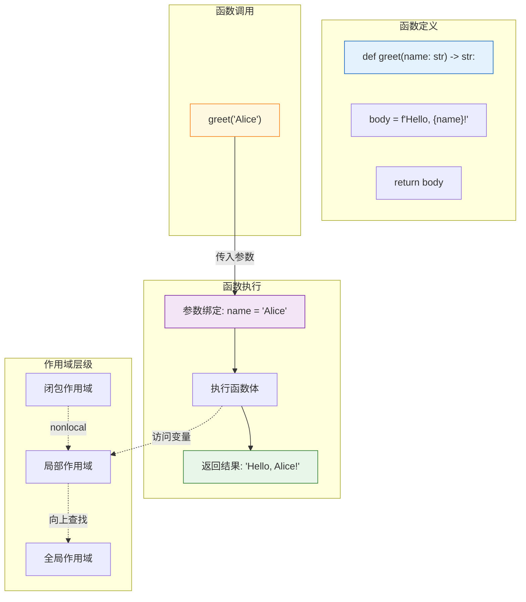

# L04: 函数与模块 — 详细教学

> **课程编号**: L04
> **所属阶段**: Stage 0 - Python 编程基础
> **预计时长**: 8 小时
> **难度**: ⭐⭐☆☆☆ (入门进阶)
> **前置课程**: L03-data-structures
> **版本**: v2.2
> **最后更新**: 2026-08-05
> **核心版本**: Python 3.13

---

## 🎯 学习目标

完成本课程后，你将能够：

1. **函数定义**：掌握函数定义语法、参数传递方式和返回值处理
2. **参数类型**：理解位置参数、关键字参数、默认参数、`*args`、`**kwargs`
3. **作用域规则**：掌握 LEGB 作用域查找顺序，理解 `global` 和 `nonlocal`
4. **模块概念**：理解模块（.py 文件）和包（目录）的区别
5. **import 语句**：熟练使用各种 import 语法导入模块和包
6. **最佳实践**：编写可测试、可维护的函数和模块化代码

---

## 📖 课程导读

本课程将带你掌握 Python 编程的两大核心组织单元：**函数**和**模块**。

函数是代码复用的基本单位，模块是代码组织的顶层容器。掌握这两者后，你的代码将从"单文件脚本"进化为"可维护的系统"。

**为什么要整合函数与模块？**

函数和模块是程序组织的两个层次：函数是"砖块"，模块是"房间"。只学函数不懂模块，代码会堆在一个文件里难以维护；只学模块不懂函数，模块内部会重复代码。本课程将两者整合，帮助你建立完整的代码组织认知。

**核心亮点**：
- ✅ 参数传递全解析（位置/关键字/默认/*args/**kwargs）
- ✅ LEGB 作用域规则与 `global`/`nonlocal`
- ✅ 模块 vs 包：一次性讲清楚
- ✅ `if __name__ == "__main__"` 入口点模式
- ✅ 常见陷阱：可变默认参数、循环导入

---


### 函数调用流程（可视化）

理解函数的调用过程是掌握函数的关键：



## Part 1: 函数基础

### 1.1 为什么需要函数？

#### 代码复用的核心价值

**DRY 原则（Don't Repeat Yourself）**：相同的代码只写一次。

```python
# ❌ 没有函数：重复代码，难以维护
user1_total = user1_price * (1 - user1_discount)
user2_total = user2_price * (1 - user2_discount)
user3_total = user3_price * (1 - user3_discount)

# ✅ 使用函数：复用逻辑，易于维护
def calculate_total(price: float, discount: float) -> float:
    """计算折后价格"""
    return price * (1 - discount)

user1_total = calculate_total(user1_price, user1_discount)
user2_total = calculate_total(user2_price, user2_discount)
user3_total = calculate_total(user3_price, user3_discount)
```

#### 抽象与封装

隐藏实现细节，只暴露接口：

```python
# 用户不需要知道哈希算法的细节
def hash_password(password: str) -> str:
    """对密码进行哈希处理（内部实现被封装）"""
    import hashlib
    return hashlib.sha256(password.encode()).hexdigest()

# 调用者只需知道接口，无需了解实现
hashed = hash_password("my_secret_password")
```

#### 可测试性

```python
# 独立函数易于单元测试
def validate_email(email: str) -> bool:
    """验证邮箱格式"""
    import re
    pattern = r'^[a-zA-Z0-9._%+-]+@[a-zA-Z0-9.-]+\.[a-zA-Z]{2,}$'
    return bool(re.match(pattern, email))

# 测试简单直接
assert validate_email("user@example.com") == True
assert validate_email("invalid-email") == False
```

---

### 1.2 函数定义与调用

#### 基本语法

```python
def function_name(parameter1: type1, parameter2: type2) -> return_type:
    """
    函数文档字符串（docstring）

    Args:
        parameter1: 参数1的说明
        parameter2: 参数2的说明

    Returns:
        返回值的说明
    """
    # 函数体
    result = parameter1 + parameter2
    return result
```

#### 完整示例

```python
def greet(name: str, greeting: str = "Hello") -> str:
    """生成个性化问候语

    Args:
        name: 要问候的人的名字
        greeting: 问候语前缀，默认为 "Hello"

    Returns:
        完整的问候语字符串
    """
    return f"{greeting}, {name}!"

# 调用示例
print(greet("Alice"))                    # 输出: Hello, Alice!
print(greet("Bob", "Hi"))                # 输出: Hi, Bob!
print(greet(name="Charlie"))             # 输出: Hello, Charlie!
print(greet(greeting="Hey", name="David"))  # 输出: Hey, David!
```

---

### 1.3 参数类型详解

#### 1.3.1 位置参数（Positional Arguments）

```python
def add(a: int, b: int) -> int:
    """两数相加"""
    return a + b

result = add(3, 5)  # a=3, b=5
print(result)       # 输出: 8
```

#### 1.3.2 关键字参数（Keyword Arguments）

```python
def create_user(name: str, age: int, city: str) -> dict:
    """创建用户字典"""
    return {"name": name, "age": age, "city": city}

# 可以打乱顺序
user = create_user(age=25, city="Beijing", name="Alice")
print(user)  # {'name': 'Alice', 'age': 25, 'city': 'Beijing'}
```

#### 1.3.3 默认参数（Default Arguments）

```python
def power(base: float, exponent: float = 2) -> float:
    """计算幂次方

    Args:
        base: 底数
        exponent: 指数，默认为 2（平方）
    """
    return base ** exponent

print(power(3))      # 输出: 9 (3^2)
print(power(3, 3))   # 输出: 27 (3^3)
```

#### 1.3.4 可变位置参数（*args）

```python
def sum_all(*numbers: int) -> int:
    """求和任意数量的数字

    Args:
        *numbers: 可变数量的整数

    Returns:
        所有数字的和
    """
    return sum(numbers)

print(sum_all(1, 2, 3))       # 输出: 6
print(sum_all(1, 2, 3, 4, 5)) # 输出: 15
print(sum_all())              # 输出: 0
```

#### 1.3.5 可变关键字参数（**kwargs）

```python
def build_profile(name: str, **info: str) -> dict:
    """构建用户档案

    Args:
        name: 用户名
        **info: 额外的用户信息（键值对）

    Returns:
        完整的用户档案字典
    """
    profile = {"name": name}
    profile.update(info)
    return profile

user = build_profile(
    "Alice",
    age="25",
    city="Beijing",
    occupation="Engineer"
)
print(user)
# {'name': 'Alice', 'age': '25', 'city': 'Beijing', 'occupation': 'Engineer'}
```

#### 1.3.6 强制关键字参数（Keyword-Only Arguments）

```python
def create_connection(host: str, port: int, *, timeout: int, ssl: bool) -> str:
    """创建连接（timeout 和 ssl 必须使用关键字传递）

    Args:
        host: 主机地址
        port: 端口号
        timeout: 超时时间（仅关键字参数）
        ssl: 是否使用 SSL（仅关键字参数）
    """
    return f"Connecting to {host}:{port} (timeout={timeout}, ssl={ssl})"

# ✅ 正确
conn = create_connection("localhost", 8080, timeout=30, ssl=True)

# ❌ 错误：timeout 和 ssl 不能用位置参数
# conn = create_connection("localhost", 8080, 30, True)  # TypeError
```

---

### 1.4 返回值详解

#### 单个返回值

```python
def square(x: int) -> int:
    return x * x

result = square(5)
print(result)  # 输出: 25
```

#### 多个返回值（元组解包）

```python
def get_user_info(user_id: int) -> tuple[str, int, str]:
    """获取用户信息

    Returns:
        (name, age, city) 元组
    """
    # 模拟数据库查询
    return ("Alice", 25, "Beijing")

# 元组解包
name, age, city = get_user_info(1)
print(f"{name} is {age} years old and lives in {city}")
# 输出: Alice is 25 years old and lives in Beijing
```

#### 提前返回（Early Return）

```python
def divide(a: float, b: float) -> float | None:
    """安全除法

    Returns:
        商，如果除数为 0 则返回 None
    """
    if b == 0:
        return None  # 提前返回，避免除以零
    return a / b

result = divide(10, 2)
if result is not None:
    print(f"Result: {result}")
else:
    print("Error: Division by zero")
```

#### 无返回值（None）

```python
def log_message(message: str) -> None:
    """记录日志消息"""
    print(f"[LOG] {message}")
    # 没有显式 return，默认返回 None

result = log_message("System started")
print(result)  # 输出: None
```

---

### 1.5 作用域与命名空间

#### LEGB 规则

Python 变量查找顺序：**L**ocal → **E**nclosing → **G**lobal → **B**uilt-in

```python
x = "global"  # 全局作用域

def outer():
    x = "enclosing"  # 闭包作用域

    def inner():
        x = "local"  # 局部作用域
        print(x)  # 输出: local

    inner()
    print(x)  # 输出: enclosing

outer()
print(x)  # 输出: global
```

#### global 关键字

```python
count = 0  # 全局变量

def increment():
    global count  # 声明使用全局变量
    count += 1

increment()
print(count)  # 输出: 1
```

**⚠️ 避免滥用 global**：过度使用全局变量会导致代码难以测试和维护。

```python
# ❌ 不推荐：过度使用全局变量
total = 0
def add_to_total(value):
    global total
    total += value

# ✅ 推荐：使用参数和返回值
def add_to_total(current_total, value):
    return current_total + value

total = 0
total = add_to_total(total, 10)
```

#### nonlocal 关键字

```python
def outer():
    count = 0

    def inner():
        nonlocal count  # 引用外层函数的变量
        count += 1
        return count

    return inner

counter = outer()
print(counter())  # 输出: 1
print(counter())  # 输出: 2
print(counter())  # 输出: 3
```

### 1.6 lambda 表达式（匿名函数）

`lambda` 是创建小型匿名函数的简洁方式，适合需要简短函数的场景：

```python
# 完整函数定义
def square(x: int) -> int:
    return x * x

# 等价的 lambda 表达式
square = lambda x: x * x

print(square(5))  # 输出: 25
```

#### lambda 的典型用途

```python
# 配合内置函数使用
numbers = [3, 1, 4, 1, 5, 9, 2, 6]

# 排序（指定 key）
sorted_nums = sorted(numbers)
print(sorted_nums)  # [1, 1, 2, 3, 4, 5, 6, 9]

# 按绝对值排序
mixed = [-5, 3, -1, 2, -4]
sorted_mixed = sorted(mixed, key=lambda x: abs(x))
print(sorted_mixed)  # [1, 2, 3, -4, -5]
```

> 📖 **函数式编程入门**：`map()` 和 `filter()` 是函数式编程的经典高阶函数，将在 **Stage 1 L11 迭代器与生成器** 中详细学习。当前仅作为 lambda 的典型应用场景展示：
>
> ```python
> # map：转换每个元素（返回迭代器，需要 list() 转为列表）
> doubled = list(map(lambda x: x * 2, numbers))
> print(doubled)  # [6, 2, 8, 2, 10, 18, 4, 12]
>
> # filter：筛选元素（返回迭代器，需要 list() 转为列表）
> evens = list(filter(lambda x: x % 2 == 0, numbers))
> print(evens)  # [4, 2, 6]
> ```

#### lambda 限制

```python
# ❌ lambda 不能包含复杂语句
# lambda x: if x > 0: return x  # 语法错误

# ✅ lambda 只能是单个表达式
lambda x: x if x > 0 else -x  # 正确：条件表达式
```

> **何时使用 lambda**：当需要一个简短函数且不想单独定义时使用。对于复杂逻辑，还是用 `def` 更清晰。

---

## Part 2: 模块与包

### 2.1 什么是模块？

**模块**就是一个 `.py` 文件，包含 Python 代码（函数、类、变量）。

```python
# math_utils.py  ← 这就是一个模块
"""数学工具模块"""

PI = 3.14159

def add(a: int, b: int) -> int:
    """加法"""
    return a + b

def multiply(a: int, b: int) -> int:
    """乘法"""
    return a * b
```

---

### 2.2 导入模块（import）

```python
# 方法 1：导入整个模块
import math_utils
result = math_utils.add(5, 3)
print(math_utils.PI)

# 方法 2：导入特定函数/常量
from math_utils import add, multiply
result = add(5, 3)

# 方法 3：导入所有内容（不推荐）
from math_utils import *
result = add(5, 3)

# 方法 4：使用别名
import math_utils as mu
result = mu.add(5, 3)

# 方法 5：导入并重命名
from math_utils import add as plus
result = plus(5, 3)
```

---

### 2.3 什么是包（Package）？

**包**是包含多个模块的目录，必须有 `__init__.py` 文件（Python 3.3+ 可选）。

#### 包的结构

```text
my_package/
├── __init__.py      # 包初始化文件
├── module1.py       # 模块 1
├── module2.py       # 模块 2
└── subpackage/      # 子包
    ├── __init__.py
    └── module3.py
```

#### 创建包

```python
# my_package/__init__.py
"""我的工具包"""
__version__ = "1.0.0"

# my_package/module1.py
def func1():
    return "Function 1"

# my_package/module2.py
def func2():
    return "Function 2"
```

#### 导入包

```python
# 导入包中的模块
import my_package.module1
result = my_package.module1.func1()

# 导入子包
from my_package.subpackage import module3
result = module3.func3()

# 导入特定函数
from my_package.module1 import func1
result = func1()
```

---

### 2.4 `__init__.py` 的作用

```python
# my_package/__init__.py

# 1. 定义包级别的变量
__version__ = "1.0.0"
__author__ = "Alice"

# 2. 导入子模块（方便使用）
from .module1 import func1
from .module2 import func2

# 3. 定义 __all__（控制 from package import * 的行为）
__all__ = ['func1', 'func2']

# 现在可以直接使用：
# from my_package import func1
```

---

### 2.5 `__name__` 和入口点

#### `__name__` 变量

```python
# module.py
print(f"Module name: {__name__}")

# 当直接运行 module.py 时：
# Module name: __main__

# 当 import module 时：
# Module name: module
```

#### `if __name__ == "__main__"` 模式

```python
# calculator.py
def add(a, b):
    return a + b

def multiply(a, b):
    return a * b

# 测试代码：只在直接运行时执行
if __name__ == "__main__":
    print("Running tests...")
    assert add(2, 3) == 5
    assert multiply(2, 3) == 6
    print("All tests passed!")
```

---

### 2.6 相对导入与绝对导入

#### 绝对导入（推荐）

```python
# 从项目根目录开始
from my_package.module1 import func1
from my_package.subpackage.module3 import func3
```

#### 相对导入（包内使用）

```python
# my_package/module2.py

# . 表示当前目录
from .module1 import func1

# .. 表示上级目录
from ..other_package import something

# 相对导入只能在包内使用，不能在顶层脚本使用
```

---

### pathlib.Path — 跨平台路径处理

> 💡 **提示**：L05 将详细学习 pathlib 的文件操作，这里先掌握路径对象基础。

`pathlib.Path` 是 Python 3.4+ 引入的**面向对象路径处理模块**，比 `os.path` 更直观：

```python
from pathlib import Path

# ❌ 不推荐：字符串拼接（跨平台问题）
import os
path = os.path.join('data', 'users', 'user.txt')

# ✅ 推荐：pathlib（面向对象，跨平台）
path = Path('data') / 'users' / 'user.txt'
```

#### Path 对象创建

```python
from pathlib import Path

# 当前目录
p1 = Path('.')                    # 相对路径
p2 = Path.cwd()                  # 当前工作目录（绝对路径）
p3 = Path.home()                  # 用户主目录
p4 = Path('/Users/nexo/data')     # 绝对路径

# 从字符串创建
p5 = Path('data/file.txt')
```

#### 路径拼接（/ 操作符）

```python
from pathlib import Path

# 使用 / 拼接路径（推荐）
base = Path('data')
p1 = base / 'users'           # Path('data/users')
p2 = base / 'users' / 'id.txt'  # Path('data/users/id.txt')

# ⚠️ 不要用 + 拼接（容易出错）
# ❌ p = 'data' + '/' + 'file.txt'  # 跨平台问题
```

#### 路径信息

```python
from pathlib import Path

p = Path('data/users/file.txt')

p.name      # 'file.txt'        → 文件名（含后缀）
p.stem      # 'file'            → 文件名（不含后缀）
p.suffix    # '.txt'            → 后缀
p.parent    # Path('data/users') → 父目录
p.parents   # [Path('data/users'), Path('data'), Path('.')]
p.suffixes # ['.tar', '.gz']   → 多后缀（tar.gz）
```

#### 路径解析与转换

```python
from pathlib import Path

p = Path('data/file.txt')

# 转换为绝对路径
p.resolve()              # Path('/Users/.../data/file.txt')

# 转换为字符串
str(p)                   # 'data/file.txt'

# 转换为 URL（用于 file://）
p.as_uri()               # 'file:///.../data/file.txt'

# 判断路径类型
p.is_file()              # True（是文件）
p.is_dir()               # False（不是目录）
p.is_absolute()          # False（相对路径）
Path('/abs').is_absolute()  # True
```

#### 路径验证

```python
from pathlib import Path

p = Path('data/file.txt')

p.exists()               # 检查路径是否存在
p.is_file()              # 检查是否为文件
p.is_dir()               # 检查是否为目录
p.is_symlink()           # 检查是否为符号链接
p.is_mount()             # 检查是否为挂载点（根目录等）
```

#### 路径组成部分

```python
from pathlib import Path

p = Path('/Users/nexo/projects/main.py')

p.anchor               # '/'                    → 路径锚点（根）
p.drive                # '/'                    → 驱动器（Unix 为 '/'）
p.root                # '/'                    → 根目录
p.parts               # ('/', 'Users', '...')  → 路径各部分

# Windows 示例
# p = Path('C:/Users/Admin/file.txt')
# p.anchor → 'C:\\'
# p.drive  → 'C:'
```

---

### 2.7 常用标准库

#### math - 数学函数

```python
import math

# 常用函数
print(math.sqrt(16))        # 4.0（平方根）
print(math.pi)              # 3.141592653589793
print(math.ceil(3.2))       # 4（向上取整）
print(math.floor(3.8))      # 3（向下取整）
print(math.factorial(5))    # 120（阶乘）
```

#### random - 随机数

```python
import random

# 随机整数
print(random.randint(1, 10))  # 1-10 之间的随机整数

# 随机选择
choices = ['apple', 'banana', 'cherry']
print(random.choice(choices))  # 随机选一个

# 随机采样
print(random.sample(choices, 2))  # 随机选 2 个
```

#### datetime - 日期时间

```python
from datetime import datetime, timedelta

# 当前时间
now = datetime.now()
print(now)  # 2024-01-01 12:00:00.000000

# 格式化
print(now.strftime("%Y-%m-%d"))  # "2024-01-01"

# 时间运算
tomorrow = now + timedelta(days=1)
```

#### json - JSON 数据

```python
import json

# Python 对象 → JSON 字符串
data = {"name": "Alice", "age": 25}
json_str = json.dumps(data)
print(json_str)  # '{"name": "Alice", "age": 25}'

# JSON 字符串 → Python 对象
parsed = json.loads(json_str)
print(parsed["name"])  # "Alice"
```

---


## 💭 课堂思考

### 思考 1: 函数为什么需要参数？

**问题**：为什么不能直接用全局变量，而要传参数？

**引导思考**：
- 可测试性：函数不依赖外部状态
- 可复用性：同一函数处理不同数据
- 可读性：参数即接口契约

**对比**：
```python
# 不好：依赖全局变量
total = 0
def add_to_total(x):
    global total
    total += x

# 好：参数传递
def add(a, b):
    return a + b
```

---

### 思考 2: 返回值 vs 修改全局状态

**问题**：函数应该返回值还是修改外部状态？

**引导思考**：
- 函数式风格：避免副作用
- 命令式风格：直接修改
- Python 习惯：优先返回值

**设计原则**：
- "命令式"函数（改变状态）：动词命名，如 `append()`
- "查询式"函数（返回值）：名词或形容词，如 `find()`

---

### 思考 3: 模块化设计的价值

**问题**：为什么要把代码拆成多个模块/函数？

**引导思考**：
- 单一职责：每个模块只做一件事
- 可测试性：小函数容易测试
- 可维护性：修改一处不影响其他
- 可复用性：模块可被其他项目使用

**什么时候拆**：
- 超过 20 行 → 考虑拆分
- 多个功能混合 → 拆分成多个函数
- 重复代码 → 抽取为函数

---

### 思考 4: 递归 vs 循环的选择

**问题**：能用循环解决的问题，为什么要学递归？

**引导思考**：
- 自然递归的问题：树结构、文件系统
- 代码简洁：递归往往更直观
- 性能权衡：递归调用栈开销

**经典案例**：
```python
# 循环版本
def fibonacci_loop(n):
    a, b = 0, 1
    for _ in range(n):
        a, b = b, a + b
    return a

# 递归版本
def fibonacci_rec(n):
    if n <= 1:
        return n
    return fibonacci_rec(n-1) + fibonacci_rec(n-2)
```

**思考**：哪个更好？为什么？

## 🎓 核心知识点总结

#
### 函数调用流程（可视化）

理解函数的调用过程是掌握函数的关键：


## Part 1: 函数基础

1. **函数定义**：使用 `def` 关键字，参数和返回值可加类型注解
2. **位置参数**：按顺序传递，`def add(a, b):`
3. **关键字参数**：按名称传递，`func(name="Alice")`
4. **默认参数**：`def power(base, exp=2):`，避免使用可变对象
5. **可变参数**：`*args` 接收任意位置参数，`**kwargs` 接收任意关键字参数
6. **仅关键字参数**：`*` 后面的参数必须用关键字传递
7. **返回值**：`return` 语句，无返回值默认返回 `None`
8. **LEGB 作用域**：Local → Enclosing → Global → Built-in
9. **lambda 表达式**：`lambda x: x * x`，用于简短匿名函数

### Part 2: 模块与包

1. **模块**：`.py` 文件，包含函数、类、变量
2. **包**：包含 `__init__.py` 的目录，用于组织多个模块
3. **import 语句**：`import module`、`from module import func`
4. **别名导入**：`import numpy as np`
5. **`__name__`**：脚本运行时为 `"__main__"`，导入时为模块名
6. **相对导入**：`from .module import func`（仅限包内使用）
7. **绝对导入**：从项目根目录开始的导入路径

---

## 💡 常见陷阱与最佳实践

### 陷阱 1：可变默认参数

```python
# ❌ 错误：使用可变对象作为默认值
def append_to_list(item, target_list=[]):
    target_list.append(item)
    return target_list

print(append_to_list(1))  # [1]
print(append_to_list(2))  # [1, 2]  ← 意外！列表被共享
print(append_to_list(3))  # [1, 2, 3]  ← 列表被共享

# ✅ 正确：使用 None 作为哨兵值
def append_to_list(item, target_list=None):
    if target_list is None:
        target_list = []
    target_list.append(item)
    return target_list

print(append_to_list(1))  # [1]
print(append_to_list(2))  # [2]  ← 正确！
```

### 陷阱 2：忘记 return

```python
# ❌ 错误：忘记 return
def add(a, b):
    result = a + b
    # 忘记 return

total = add(3, 5)
print(total)  # 输出: None

# ✅ 正确：显式返回
def add(a, b):
    return a + b
```

### 陷阱 3：循环导入

```python
# ❌ module_a.py
import module_b

def func_a():
    return module_b.func_b()

# ❌ module_b.py
import module_a  # 循环导入！

def func_b():
    return module_a.func_a()

# ✅ 解决方案：延迟导入
# module_b.py
def func_b():
    import module_a  # 在函数内导入
    return module_a.func_a()
```

### 陷阱 4：相对导入在脚本中失败

```python
# ❌ 直接运行脚本时失败
# python mypackage/module.py
from . import sibling  # ValueError: attempted relative import beyond top-level package

# ✅ 作为包运行
# python -m mypackage.module
```

### 最佳实践 1：单一职责原则（SRP）

```python
# ❌ 不推荐：函数做了多件事
def process_user(user_data):
    if not user_data.get("email"):
        print("错误: Email 是必填项")
        return False
    db.save(user_data)
    send_email(user_data["email"])
    return True

# ✅ 推荐：拆分为多个函数
def validate_user_data(user_data: dict) -> bool:
    if not user_data.get("email"):
        print("错误: Email 是必填项")
        return False
    return True

def save_user(user_data: dict) -> None:
    db.save(user_data)

def notify_user(email: str) -> None:
    send_email(email)

def process_user(user_data: dict) -> None:
    validate_user_data(user_data)
    save_user(user_data)
    notify_user(user_data["email"])
```

### 最佳实践 2：PEP 8 导入顺序

```python
# ✅ 推荐：按顺序导入
# 1. 标准库
import os
import sys
from datetime import datetime

# 2. 第三方库
import numpy as np
import pandas as pd

# 3. 本地模块
from my_package import module1

# ❌ 不推荐
import os, sys  # 不要在一行导入多个
from math import *  # 不要用 *
```

---

## 🚀 实战案例

### 案例 1：计算器模块

```python
# calculator.py

def add(a: float, b: float) -> float:
    """加法"""
    return a + b

def subtract(a: float, b: float) -> float:
    """减法"""
    return a - b

def multiply(a: float, b: float) -> float:
    """乘法"""
    return a * b

def divide(a: float, b: float) -> float | None:
    """除法（除数为0时返回None）"""
    if b == 0:
        return None
    return a / b

if __name__ == "__main__":
    # 测试代码
    print(f"2 + 3 = {add(2, 3)}")
    print(f"10 - 4 = {subtract(10, 4)}")
    print(f"6 * 7 = {multiply(6, 7)}")
    print(f"20 / 4 = {divide(20, 4)}")
    print(f"10 / 0 = {divide(10, 0)}")
```

### 案例 2：用户验证模块

```python
# validators.py
"""数据验证工具模块"""

import re

def validate_email(email: str) -> bool:
    """验证邮箱格式"""
    pattern = r'^[a-zA-Z0-9._%+-]+@[a-zA-Z0-9.-]+\.[a-zA-Z]{2,}$'
    return bool(re.match(pattern, email))

def validate_phone(phone: str) -> bool:
    """验证手机号（中国大陆）"""
    pattern = r'^1[3-9]\d{9}$'
    return bool(re.match(pattern, phone))

def validate_username(username: str) -> bool:
    """验证用户名（3-20位字母数字下划线）"""
    pattern = r'^[a-zA-Z0-9_]{3,20}$'
    return bool(re.match(pattern, username))

# 导出所有公开函数
__all__ = ['validate_email', 'validate_phone', 'validate_username']
```

### 案例 3：日志工具包

```python
# utils/
# ├── __init__.py
# └── logger.py

# utils/__init__.py
"""工具包"""
from .logger import log_info, log_warning, log_error

__all__ = ['log_info', 'log_warning', 'log_error']

# utils/logger.py
"""日志工具（纯函数实现）"""

import datetime


def _format_message(level: str, message: str) -> str:
    """格式化日志消息"""
    timestamp = datetime.datetime.now().strftime("%Y-%m-%d %H:%M:%S")
    return f"[{timestamp}] [{level}] {message}"


def log_info(message: str) -> None:
    """记录 info 级别日志"""
    print(_format_message("INFO", message))


def log_warning(message: str) -> None:
    """记录 warning 级别日志"""
    print(_format_message("WARNING", message))


def log_error(message: str) -> None:
    """记录 error 级别日志"""
    print(_format_message("ERROR", message))
```

---

## 📚 延伸阅读

### 官方文档

- [Python Functions Tutorial](https://docs.python.org/3/tutorial/controlflow.html#defining-functions)
- [Python Modules Tutorial](https://docs.python.org/3/tutorial/modules.html)
- [PEP 257 -- Docstring Conventions](https://peps.python.org/pep-0257/)
- [PEP 8 -- Import Conventions](https://peps.python.org/pep-0008/#imports)

### 推荐资源

- [Real Python - Defining and Calling Python Functions](https://realpython.com/defining-your-own-python-function/)
- [Real Python - Python Modules and Packages](https://realpython.com/python-modules-packages/)

### 进阶主题预告

- **L05**: 调试工具 - pdb、breakpoint、traceback
- **L06**: 异常处理 - try/except、自定义异常
- **L11**: 迭代器与生成器 - 惰性求值、yield 表达式（后续课程）
- **L12**: 装饰器 - 函数的元编程（后续课程）

> **说明**: L11 和 L12 是 L04 的后续课程，现在只需了解它们的存在即可。

---

## 🚀 附录：快速参考

### 函数定义模板

```python
def function_name(
    positional_arg: type,
    default_arg: type = default_value,
    *args: type,
    keyword_only_arg: type,
    **kwargs: type
) -> return_type:
    """
    简短描述

    Args:
        positional_arg: 位置参数说明
        default_arg: 默认参数说明
        *args: 可变位置参数说明
        keyword_only_arg: 仅关键字参数说明
        **kwargs: 可变关键字参数说明

    Returns:
        返回值说明

    Raises:
        ValueError: 何时抛出此异常
    """
    # 函数体
    return result
```

### 参数传递完整示例

```python
def example(
    pos_arg,              # 位置参数（必需）
    default_arg=10,       # 默认参数
    *args,                # 可变位置参数
    keyword_only,         # 仅关键字参数（必需）
    kw_default="text",    # 仅关键字默认参数
    **kwargs              # 可变关键字参数
):
    pass

# 调用示例
example(1, 2, 3, 4, keyword_only=5, extra=6)
# pos_arg=1, default_arg=2, args=(3,4), keyword_only=5, kw_default="text", kwargs={"extra": 6}
```

### 导入速查表

```python
# 基本导入
import module
from module import function
from module import Class
from package.module import function

# 别名
import module as alias
from module import function as func

# 多项导入
from module import func1, func2, Class1

# 相对导入（包内）
from . import sibling_module
from .sibling_module import function
from .. import parent_module

# __name__ 检查
if __name__ == "__main__":
    main()
```

---

## ✅ 自检清单

完成本课程后，你应该能够：

- [ ] 定义带类型注解的函数
- [ ] 使用位置参数和关键字参数调用函数
- [ ] 理解默认参数的使用场景
- [ ] 使用 `*args` 和 `**kwargs` 处理可变参数
- [ ] 使用 `*` 创建强制关键字参数
- [ ] 理解函数返回值的多种情况（单个、多个、None）
- [ ] 解释 LEGB 作用域查找顺序
- [ ] 使用 `global` 和 `nonlocal` 修改外层变量
- [ ] 理解 lambda 表达式的用途和限制
- [ ] 创建自己的模块（.py 文件）
- [ ] 创建包含 `__init__.py` 的包
- [ ] 使用各种 import 语句导入模块
- [ ] 理解 `__name__` 和入口点模式
- [ ] 区分相对导入和绝对导入
- [ ] 避免可变默认参数陷阱
- [ ] 避免循环导入问题

---

## 📝 进阶预告

完成本课程后，你已经掌握了函数和模块的精髓。在下一课 [L05: 调试工具与开发环境](../L05-debugging-tools/lesson.md) 中，我们将学习：

- 🐛 **pdb 调试**：断点设置、变量检查、堆栈追踪
- 💻 **REPL 进阶**：快速实验、API 探索
- 🛠️ **IDE 使用**：VS Code / PyCharm 调试技巧
- 📊 **日志记录**：logging 模块、调试级别
- ⚡ **性能分析**：timeit、cProfile 基础

> 💡 **学习路径**：L04 → L05（调试）→ L06（异常）→ ...


---


---

## 📝 本章总结

### 核心知识点

| 概念 | 说明 |
|------|------|
| 本课程 | 函数与模块 |

### 关键要点

1. 理解本课程的核心概念
2. 掌握主要语法和使用方法
3. 能够独立完成课程练习

### 学习收获

完成本课程后，你已经：
- ✅ 掌握了本课程的核心概念
- ✅ 能够编写基础的 Python 代码
- ✅ 为后续学习打下坚实基础


## 🔗 下一步

完成本课程后，继续学习：

- [L05: 调试工具](../L05-debugging-tools/lesson.md)

在下一课中，我们将学习：
- 使用 pdb 进行断点调试
- 使用 breakpoint() 内置函数
- 分析 traceback 追踪错误
