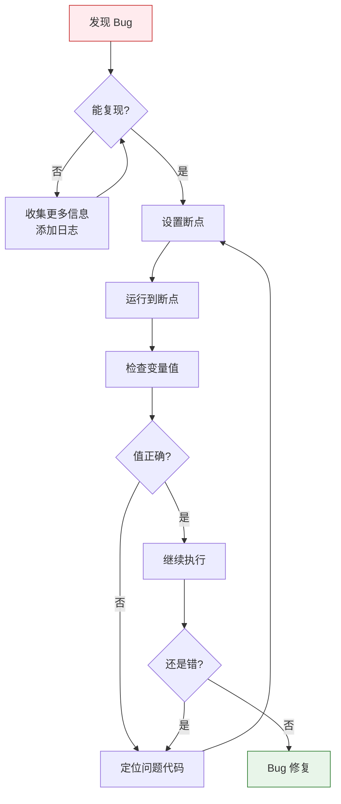

# L05: 调试工具与开发环境

> **课程编号**: L05
> **所属阶段**: Stage 0 - Python 编程基础
> **预计时长**: 4 小时
> **难度**: ⭐⭐☆☆☆ (入门进阶)
> **前置课程**: L04 函数与模块
> **版本**: v1.3
> **最后更新**: 2026-08-06
> **核心版本**: Python 3.13

---

## 🎯 学习目标

完成本课程后，你将能够：

1. **pdb 调试器**：使用 pdb.set_trace() 在代码中插入断点
2. **breakpoint()**：使用 Python 3.7+ 内置断点函数
3. **traceback 模块**：读取和分析异常追踪信息
4. **IDE 调试**：配置 VS Code/PyCharm 进行可视化调试
5. **uv 工具链**：使用 uv 创建和管理 Python 项目

---

## 📖 课程导读

本课程将带你掌握 Python 的调试工具，让你能快速定位和修复代码中的错误。

**为什么要学习调试？**

代码出现 bug 是不可避免的，关键在于如何高效地找到问题所在。调试工具能让你：
- 暂停程序执行，观察变量状态
- 单步执行，理解代码执行流程
- 追踪异常，理解错误传播路径

**调试 vs print()：**

很多初学者习惯用 `print()` 调试，但这种方法效率低下：
- 需要反复添加/删除 print 语句
- 无法观察复杂数据结构的全貌
- 无法在特定条件下暂停

学会使用调试器，能让你效率提升 10 倍！

---

## Part 1: pdb 调试器

### 1.1 调试流程（可视化）



### 1.2 pdb 基础

## Part 2: breakpoint() 内置函数

### 2.1 Python 3.7+ 的 breakpoint()

`breakpoint()` 是 Python 3.7 引入的内置函数，比 `pdb.set_trace()` 更灵活：

```python
def process_data(data):
    breakpoint()  # 等同于 pdb.set_trace()，但更简洁
    # 处理逻辑...
    return processed
```

### 2.2 配置默认调试器

`breakpoint()` 会调用 `sys.breakpointhook()`，可以通过环境变量配置：

```bash
# 使用 pdb（默认）
export PYTHONBREAKPOINT=pdb.set_trace

# 使用 ipdb（需要 pip install ipdb）
export PYTHONBREAKPOINT=ipdb.set_trace

# 禁用断点（调试代码留在代码中时使用）
export PYTHONBREAKPOINT=
```

### 2.3 检查断点状态

```python
import sys

def debug_print(*args):
    """仅在调试模式启用时打印"""
    if sys.flags.debug or hasattr(sys, 'gettrace') and sys.gettrace():
        print(*args)
```

---

## Part 3: traceback 分析

### 3.1 理解异常追踪信息

当程序崩溃时，Python 会输出 traceback 信息：

```python
def level_3():
    raise ValueError("测试错误")

def level_2():
    level_3()

def level_1():
    level_2()

level_1()
```

输出：

```
Traceback (most recent call last):
  File "example.py", line 12, in <module>
    level_1()
  File "example.py", line 10, in level_1
    level_2()
  File "example.py", line 7, in level_2
    level_3()
  File "example.py", line 2, in level_3
    raise ValueError("测试错误")
ValueError: 测试错误
```

### 3.2 使用 traceback 模块

```python
import traceback
import sys

def show_traceback():
    """打印当前异常追踪信息"""
    traceback.print_exc()

try:
    # 可能抛出异常的代码
    1 / 0
except Exception:
    show_traceback()
```

### 3.3 使用 sys.last_traceback

程序崩溃后，可以通过 `sys.last_traceback` 访问最后的异常信息：

```python
import sys

def analyze_crash():
    """在 except 块中使用 sys.last_traceback"""
    if hasattr(sys, 'last_traceback') and sys.last_traceback:
        tb = sys.last_traceback
        print(f"崩溃位置: {tb.tb_frame.f_code.co_filename}:{tb.tb_lineno}")
        print(f"函数名: {tb.tb_frame.f_code.co_name}")
        traceback.print_tb(tb)

try:
    data = {"key": "value"}
    print(data["nonexistent"])  # KeyError
except Exception:
    analyze_crash()
```

### 3.4 使用 traceback.format_exc()

将异常信息格式化为字符串，用于日志记录：

```python
import traceback
import logging

logging.basicConfig(level=logging.ERROR)


def log_and_raise(func_name: str, error: Exception) -> None:
    """记录异常并重新抛出"""
    logging.error(f"异常在 {func_name}:\n{traceback.format_exc()}")
    raise error


def risky_operation():
    """可能失败的操作"""
    try:
        # 模拟可能失败的操作
        data = {"key": "value"}
        _ = data["nonexistent"]
    except KeyError as e:
        # 记录异常并重新抛出
        log_and_raise("risky_operation", e)


# 使用 traceback.format_exc() 获取调用栈
def get_traceback_string() -> str:
    """获取当前异常的调用栈字符串"""
    try:
        int("not_a_number")
    except ValueError:
        return traceback.format_exc()
    return ""
```

---

## Part 4: IDE 调试器

### 4.1 VS Code 调试配置

创建 `.vscode/launch.json`：

```json
{
    "version": "0.2.0",
    "configurations": [
        {
            "name": "Python: Current File",
            "type": "python",
            "request": "launch",
            "program": "${file}",
            "console": "integratedTerminal"
        },
        {
            "name": "Python: Module",
            "type": "python",
            "request": "launch",
            "module": "mymodule",
            "console": "integratedTerminal"
        }
    ]
}
```

调试步骤：
1. 在代码行号左侧点击，设置断点（红点）
2. 按 F5 启动调试
3. 使用调试工具栏：继续、跳过、单步进入、停止

### 4.2 PyCharm 调试

PyCharm 提供了更强大的调试功能：
- 条件断点：在断点处设置条件表达式
- 日志断点：断点触发时打印信息但不暂停
- 监视点：监控特定变量的值变化
- 远程调试：连接到远程 Python 进程

---

## Part 5: uv 工具链

### 5.1 uv 简介

`uv` 是一个用 Rust 编写的超快速 Python 包管理器，兼容 pip、pip-tools、pipx、poetry、pyenv 等工具。

### 5.2 创建项目

```bash
# 创建新项目
uv init my-project
cd my-project

# 添加依赖
uv add requests
uv add --dev pytest

# 运行脚本
uv run python main.py

# 运行测试
uv run pytest
```

### 5.3 管理虚拟环境

```bash
# 创建虚拟环境
uv venv

# 激活虚拟环境
source .venv/bin/activate

# 安装依赖
uv sync
```

### 5.4 uv 的优势

| 特性 | pip | uv |
|------|-----|-----|
| 安装速度 | 慢 | 快 10-100 倍 |
| 依赖解析 | 慢 | 快 |
| 锁文件 | 无 | uv.lock |
| Python 版本管理 | pyenv | 内置 |

---

## Part 6: 调试最佳实践

### 6.1 何时使用调试器 vs print()

| 场景 | 推荐方式 |
|------|----------|
| 快速查看变量值 | `print()` |
| 理解程序执行流程 | 调试器 |
| 排查复杂逻辑错误 | 调试器 |
| 生产环境问题定位 | 日志 + traceback |
| 循环中的问题 | 条件断点 |

### 6.2 调试技巧

**1. 二分查找法**
```python
# 在函数中间添加断点，逐步缩小问题范围
def buggy_function(data):
    # 前半部分正确？
    part1 = process_first_half(data)
    
    breakpoint()  # 检查 part1
    
    # 后半部分有问题？
    result = process_second_half(part1)
    return result
```

**2. 条件断点**
```python
# 在循环中找到特定值
for item in large_list:
    if item.id == target_id:
        print(f"Found: {item}")  # 改用条件断点更高效
    process(item)
```

**3. 事后调试**
```python
import pdb
import traceback

def excepthook(type, value, tb):
    """全局异常钩子，异常时自动进入 pdb"""
    traceback.print_exception(type, value, tb)
    pdb.post_mortem(tb)

sys.excepthook = excepthook
```

### 6.3 调试与测试的关系

- **单元测试**：定义正确行为，用测试验证
- **调试器**：理解错误原因，定位问题位置
- **两者结合**：测试驱动开发（TDD）先用测试定义行为，调试器解决偶发问题

---

## Part 7: 常见调试场景

### 7.1 变量值不符合预期

```python
import pdb

def calculate(items):
    total = 0
    for item in items:
        pdb.set_trace()  # 逐个检查 item
        total += item.price * item.quantity
    return total
```

### 7.2 函数返回值错误

```python
def find_user(users, user_id):
    pdb.set_trace()  # 检查输入参数
    for user in users:
        if user.id == user_id:
            return user
    return None  # 可能是这里的问题
```

### 7.3 异常信息不明确

```python
try:
    complex_operation()
except Exception as e:
    import traceback
    print(f"异常类型: {type(e).__name__}")
    print(f"异常信息: {e}")
    traceback.print_exc()
    pdb.post_mortem()
```

---

## Part 8: 课后练习

#### 练习 1: pdb 基础

编写一个函数计算斐波那契数列，使用 pdb 单步调试观察变量变化。

#### 练习 2: breakpoint() 配置

创建一个脚本，使用 `breakpoint()`，尝试配置不同的调试器（pdb/ipdb）。

#### 练习 3: traceback 分析

编写代码捕获异常，使用 `traceback` 模块将异常信息保存到日志文件。

#### 练习 4: IDE 调试

使用 VS Code 或 PyCharm 调试一个包含多个函数的 Python 文件，练习设置断点、单步执行、查看变量。

#### 练习 5: uv 项目

使用 `uv` 创建一个新项目，添加依赖，运行测试。

---


## 💭 课堂思考

### 思考 1: print() 调试 vs 调试器

**问题**：什么时候应该使用 `print()`，什么时候应该用调试器？

**引导思考**：
- 简单变量查看 vs 复杂执行流程分析
- 一次性脚本 vs 长期维护项目
- 生产环境调试的特殊考虑

**建议原则**：
- `print()`：快速验证、一次性调试
- 调试器：复杂逻辑、长期项目

---

### 思考 2: 为什么需要 traceback？

**问题**：看到异常信息时，你的第一个动作是什么？

**引导思考**：
- traceback 中的"最 recent call last"是什么意思？
- 如何从 traceback 中定位问题根源？
- 什么时候 traceback 不够用？

---

### 思考 3: uv vs pip 的选择

**问题**：既然 pip 也能完成任务，为什么学习 uv？

**引导思考**：
- 开发效率：等待时间对学习体验的影响
- 一致性：lock 文件的作用
- 未来趋势：uv 是否会成为主流？

---


## 💡 常见调试陷阱

### 陷阱 1: print() 调试的滥用

```python
# ❌ 错误：过度依赖 print() 调试
def calculate(x):
    print(f"输入: {x}")      # 大量 print
    result = x * 2
    print(f"中间结果: {result}")  # 难以追踪
    return result

# ✅ 正确：使用断点调试器
def calculate(x):
    result = x * 2  # 在这里设置断点
    return result

# 或使用条件断点
for i in range(100):
    if i == 42:  # 在 i == 42 时自动触发
        breakpoint()
```

### 陷阱 2: 忽略堆栈追踪信息

```python
# ❌ 错误：看到错误就慌
# Traceback (most recent call last):
#   File "app.py", line 5, in <module>
#     result = 1 / 0
# ZeroDivisionError: division by zero

# ✅ 正确：按顺序读懂堆栈
# 1. 先看最后一行 → 什么错误：ZeroDivisionError
# 2. 再看位置 → 第 5 行
# 3. 最后看调用链 → 从下往上理解执行路径
```

### 陷阱 3: pdb 中忘记 continue

```python
# ❌ 错误：在 pdb 中单步执行太久
(Pdb) n   # 一次
(Pdb) n   # 两次
(Pdb) n   # 三次
# ... 手动执行了 100 步

# ✅ 正确：使用合适的断点间距
(Pdb) b 50   # 在第 50 行设置断点
(Pdb) c      # 继续执行到断点
```

### 陷阱 4: 调试时修改代码不重启

```python
# ❌ 错误：修改代码后继续调试
# 在 pdb 中修改了代码，但没有重新运行
(Pdb) p variable
# 结果：还是旧值

# ✅ 正确：重启程序
# 修改代码 → 退出 pdb (q) → 重新运行程序
```

### 陷阱 5: 不理解局部变量 vs 全局变量

```python
# ❌ 调试时发现变量值不对
(Pdb) p my_var
# 'my_var' is not defined

# ✅ 正确：理解作用域
(Pdb) p globals()['my_var']  # 查看全局变量
(Pdb) p locals()              # 查看局部变量
```

---

## 🚀 实战案例

### 案例：调试一个计算平均值的函数

假设有以下代码：

```python
def calculate_average(numbers):
    """计算平均值"""
    total = 0
    for i in range(len(numbers)):
        total += numbers[i]
    return total / len(numbers)

# 测试
print(calculate_average([1, 2, 3, 4, 5]))  # 预期: 3.0
print(calculate_average([]))                 # 预期: ??? (空列表会怎样？)
```

**问题发现**：
```python
print(calculate_average([]))
# ZeroDivisionError: division by zero
```

**调试步骤**：

1. **添加断点**：
```python
def calculate_average(numbers):
    total = 0
    breakpoint()  # ← 添加断点
    for i in range(len(numbers)):
        total += numbers[i]
    return total / len(numbers)
```

2. **运行并调试**：
```bash
$ python debug_average.py
> /Users/demo/debug_average.py(5)<module>()
-> print(calculate_average([]))
(Pdb) s  # 进入函数
(Pdb) n  # 单步执行到循环
(Pdb) p len(numbers)  # 检查列表长度
0
```

3. **修复代码**：
```python
def calculate_average(numbers):
    if not numbers:  # ← 添加空列表检查
        return 0
    total = 0
    for i in range(len(numbers)):
        total += numbers[i]
    return total / len(numbers)
```

---

## 🎓 核心知识点总结

| 知识点 | 级别 | 说明 |
|--------|------|------|
| pdb.set_trace() | L1 | 在代码中插入断点 |
| breakpoint() | L1 | Python 3.7+ 内置断点函数 |
| traceback 模块 | L1 | 异常追踪信息处理 |
| sys.last_traceback | L2 | 访问最后异常信息 |
| 条件断点 | L2 | 在特定条件下触发断点 |
| post_mortem 调试 | L3 | 异常发生后调试 |
| IDE 调试器 | L2 | VS Code/PyCharm 可视化调试 |
| uv 工具链 | L2 | 现代化 Python 包管理 |

---

## ✅ 自检清单

完成本课程后，你应该能够：

- [ ] 使用 `pdb.set_trace()` 在代码中插入断点
- [ ] 使用 `breakpoint()` 调用内置调试器
- [ ] 理解 pdb 常用命令（n/s/c/p/l）
- [ ] 读取和分析 traceback 追踪信息
- [ ] 使用 `traceback.print_exc()` 和 `traceback.format_exc()`
- [ ] 配置 VS Code 或 PyCharm 进行断点调试
- [ ] 理解 `PYTHONBREAKPOINT` 环境变量的作用
- [ ] 使用 `uv init` 创建新项目
- [ ] 使用 `uv add` 管理项目依赖
- [ ] 在调试器和 print() 之间做出合理选择

---


## 📝 进阶预告

完成本课程后，你已经掌握了调试技能。在下一课 [L06: 异常处理](../L06-exceptions/lesson.md) 中，我们将学习：

- ⚠️ **异常概念**：什么是异常、为什么要处理
- 🛡️ **try-except**：捕获和处理异常
- 🔊 **raise 语句**：抛出异常、自定义异常
- 🔗 **异常链**：异常传播、上下文保留
- 🧹 **资源清理**：finally、with 语句

> 💡 **学习路径**：L05 → L06（异常）→ L07（面向对象）→ ...


---


---

## 📝 本章总结

### 核心知识点

| 概念 | 说明 |
|------|------|
| 本课程 | 调试工具 |

### 关键要点

1. 理解本课程的核心概念
2. 掌握主要语法和使用方法
3. 能够独立完成课程练习

### 学习收获

完成本课程后，你已经：
- ✅ 掌握了本课程的核心概念
- ✅ 能够编写基础的 Python 代码
- ✅ 为后续学习打下坚实基础


## 🔗 下一步

完成本课程后，继续学习：

- [L06: 异常处理](../L06-exceptions/lesson.md)

在下一课中，我们将学习：
- try-except 捕获异常
- raise 抛出异常
- 自定义异常类


---

## 📚 延伸阅读

- [Python pdb 文档](https://docs.python.org/3/library/pdb.html)
- [Python traceback 文档](https://docs.python.org/3/library/traceback.html)
- [uv 官方文档](https://github.com/astral-sh/uv)
- [VS Code Python 调试](https://code.visualstudio.com/docs/python/debugging)
