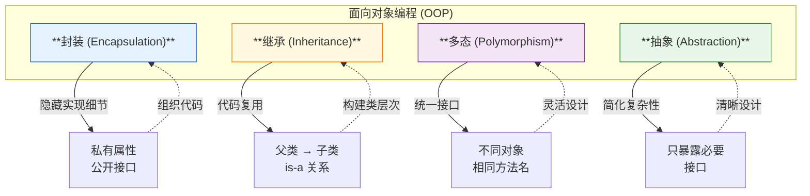

# L07: 面向对象基础

> **课程编号**: L07
> **所属阶段**: Stage 0 - Python 编程基础
> **预计时长**: 6 小时
> **难度**: ⭐⭐⭐☆☆
> **前置课程**: L06（异常处理）
> **版本**: v2.3
> **最后更新**: 2026-08-05
> **核心版本**: Python 3.13

---

## 🎯 学习目标

完成本课程后，你将能够：

1. ✅ 理解面向对象编程（OOP）的核心概念：类与对象
2. ✅ 掌握类的定义、`__init__` 构造方法和 `self` 参数
3. ✅ 理解封装：私有属性、公开接口、`@property` 装饰器
4. ✅ 掌握继承：单继承、方法重写、`super()` 调用父类
5. ✅ 理解多态：接口统一、鸭子类型

> 📝 **进阶预告**：`__str__`、`__repr__`、`__eq__` 等**魔术方法**将在 **L08** 专门学习。
> `@classmethod`/`@staticmethod` 装饰器将在 **Stage 1 L12** 深入学习。

---

## 📖 课程导读

本课程将带你掌握 **Python 面向对象编程（OOP）**。

### 为什么要学习面向对象？

在实际编程中，**数据**和**操作数据的函数**是密不可分的：

| 编程范式 | 数据与行为 | 示例 |
|---------|-----------|------|
| **面向过程** | 分离 | `data` + `process(data)` |
| **面向对象** | 封装在一起 | `obj.method()` |

**面向对象**让代码更易维护、更符合人类对现实世界的建模方式。

---

### OOP 四大支柱（可视化）

面向对象编程的四大核心概念：



## Part 1: 类与对象基础

### 1.1 类的定义

```python
class Dog:
    """狗类（类文档字符串）"""

    # 类属性（所有实例共享）
    species = "Canis familiaris"

    # 构造方法
    def __init__(self, name: str, age: int) -> None:
        # 实例属性（每个实例独有）
        self.name = name
        self.age = age

    # 实例方法
    def bark(self) -> str:
        return f"{self.name} says Woof!"

    def get_info(self) -> str:
        return f"{self.name} is {self.age} years old"
```

### 1.2 创建对象

```python
# 创建实例
dog1 = Dog("Buddy", 3)
dog2 = Dog("Max", 5)

# 访问属性
print(dog1.name)      # "Buddy"
print(dog1.age)      # 3
print(dog1.species)   # "Canis familiaris"（类属性）

# 调用方法
print(dog1.bark())       # "Buddy says Woof!"
print(dog1.get_info())   # "Buddy is 3 years old"
```

### 1.3 self 参数

`self` 指向当前实例，用于访问实例属性和类属性：

```python
class Counter:
    def __init__(self) -> None:
        self.count = 0  # self 指向当前实例

    def increment(self) -> int:
        self.count += 1  # 修改实例属性
        return self.count

counter1 = Counter()
counter2 = Counter()

counter1.increment()  # counter1.count = 1
counter2.increment()  # counter2.count = 1（独立）
```

---

## Part 2: 封装

### 2.1 私有属性和方法

```python
class BankAccount:
    def __init__(self, owner: str, balance: float = 0) -> None:
        self.owner = owner
        self.__balance = balance  # 私有属性（双下划线）

    def deposit(self, amount: float) -> None:
        if amount > 0:
            self.__balance += amount

    def get_balance(self) -> float:
        """公开方法访问私有属性"""
        return self.__balance

    def __validate(self, amount: float) -> bool:
        """私有方法"""
        return amount > 0

account = BankAccount("Alice", 1000)
print(account.get_balance())  # ✅ 1000
# print(account.__balance)   # ❌ AttributeError
```

### 2.2 @property 装饰器

`@property` 让方法可以像属性一样访问：

```python
class Temperature:
    def __init__(self, celsius: float) -> None:
        self._celsius = celsius  # 下划线：约定私有

    @property
    def celsius(self) -> float:
        """获取温度"""
        return self._celsius

    @celsius.setter
    def celsius(self, value: float) -> None:
        """设置温度（带验证）"""
        if value < -273.15:
            # ❌ ValueError: 温度不能低于绝对零度
        self._celsius = value

temp = Temperature(25)
print(temp.celsius)   # 25（像属性一样访问）
temp.celsius = 30    # 使用 setter
# temp.celsius = -300  # ❌ ValueError
```

> 💡 **进阶学习**：@property 的底层原理见 [L13 描述符](../../../stage1-python-intermediate/lessons/L13-descriptors/lesson.md)。

---

### 继承层次结构（可视化）

```mermaid
classDiagram
    class Animal {
        +String name
        +speak() String
        +move() String
    }
    
    class Dog {
        +speak() String
    }
    
    class Cat {
        +speak() String
    }
    
    class Bird {
        +fly() String
    }
    
    Animal <|-- Dog : 继承
    Animal <|-- Cat : 继承
    Animal <|-- Bird : 继承
    
    Dog : "汪汪叫"
    Cat : "喵喵叫"
    
    class Animal: +name
    class Animal: +speak()

## Part 3: 继承

### 3.1 基本继承

```python
class Animal:
    """动物基类"""
    def __init__(self, name: str) -> None:
        self.name = name

    def speak(self) -> str:
        return "Some sound"

    def move(self) -> str:
        return f"{self.name} is moving"

class Dog(Animal):
    """狗类继承自动物类"""
    def speak(self) -> str:
        """重写父类方法"""
        return f"{self.name} says Woof!"

class Cat(Animal):
    def speak(self) -> str:
        return f"{self.name} says Meow!"

dog = Dog("Buddy")
cat = Cat("Whiskers")

print(dog.speak())   # "Buddy says Woof!"
print(dog.move())    # "Buddy is moving"（继承的方法）
print(cat.speak())   # "Whiskers says Meow!"
```

### 3.2 调用父类方法（super()）

```python
class Employee:
    def __init__(self, name: str, salary: float) -> None:
        self.name = name
        self.salary = salary

    def get_info(self) -> str:
        return f"{self.name}: ${self.salary}"

class Manager(Employee):
    def __init__(self, name: str, salary: float, department: str) -> None:
        super().__init__(name, salary)  # 调用父类构造方法
        self.department = department

    def get_info(self) -> str:
        base_info = super().get_info()
        return f"{base_info}, Dept: {self.department}"

manager = Manager("Alice", 80000, "Engineering")
print(manager.get_info())  # "Alice: $80000, Dept: Engineering"
```

### 3.3 多重继承

```python
class Flyable:
    def fly(self) -> str:
        return "Flying in the sky"

class Swimmable:
    def swim(self) -> str:
        return "Swimming in water"

class Duck(Flyable, Swimmable):
    """鸭子既能飞又能游"""
    def quack(self) -> str:
        return "Quack!"

duck = Duck()
print(duck.fly())    # "Flying in the sky"
print(duck.swim())   # "Swimming in water"
print(duck.quack())  # "Quack!"
```

---

## Part 4: 多态

### 4.1 多态示例

```python
class Shape:
    def area(self) -> float:
        # ❌ NotImplementedError: 子类必须实现此方法

class Rectangle(Shape):
    def __init__(self, width: float, height: float) -> None:
        self.width = width
        self.height = height

    def area(self) -> float:
        return self.width * self.height

class Circle(Shape):
    def __init__(self, radius: float) -> None:
        self.radius = radius

    def area(self) -> float:
        return 3.14 * self.radius ** 2

# 多态：不同对象调用相同方法，表现不同
shapes: list[Shape] = [Rectangle(5, 10), Circle(7)]

for shape in shapes:
    print(f"面积: {shape.area()}")
# 输出:
# 面积: 50
# 面积: 153.86
```

---

## 💭 课堂思考

### 思考 1: 为什么需要 self？

**问题**：为什么 Python 的实例方法必须有 `self` 参数？不能像其他语言一样隐式处理吗？

**引导思考**：
- 如果忘记 `self`，会发生什么？
- `self` 到底是什么？（提示：它是实例对象本身）
- 试试在方法内 `print(self)` 看看输出什么

**对比其他语言**：
```python
# Python: 显式 self
class Dog:
    def bark(self):
        print(f"{self.name} barks!")

# Java: 隐式 this
// class Dog {
//     void bark() {
//         System.out.println(this.name + " barks!");
//     }
// }
```

Python 的这种设计有什么好处？

---

### 思考 2: 继承 vs 组合 — 何时使用哪个？

**问题**：下面两种设计哪种更好？

```python
# 方案 1: 继承
class Car(Engine):
    pass

# 方案 2: 组合
class Car:
    def __init__(self):
        self.engine = Engine()
```

**引导思考**：
- Car "is-a" Engine 还是 "has-a" Engine？
- 继承表示什么关系？组合表示什么关系？
- 在什么情况下你会选择继承？在什么情况下选择组合？

**原则**：“组合优于继承”— 为什么？

---

## 🎓 核心知识点总结

### 类与对象

| 概念 | 说明 |
|------|------|
| **类（Class）** | 对象的蓝图/模板 |
| **对象（Object）** | 类的实例 |
| **`__init__`** | 构造方法，初始化实例属性 |
| **self** | 指向当前实例的参数 |

### 封装

| 概念 | 说明 |
|------|------|
| **私有属性** | `__attribute`（双下划线开头） |
| **受保护属性** | `_attribute`（单下划线开头，约定） |
| **@property** | 属性的 getter/setter |

### 继承

| 概念 | 说明 |
|------|------|
| **单继承** | `class Child(Parent):` |
| **方法重写** | 子类覆盖父类方法 |
| **super()** | 调用父类方法 |
| **多重继承** | `class Child(Parent1, Parent2):` |

> 📝 **进阶预告**：`__str__`、`__repr__`、`__eq__`、`__add__` 等**魔术方法**将在 **L08** 专门学习。

---

## 💡 常见陷阱与最佳实践

### 陷阱 1：忘记 self 参数

```python
# ❌ 错误
class Counter:
    def increment():  # 缺少 self
        count += 1

# ✅ 正确
class Counter:
    def __init__(self) -> None:
        self.count = 0

    def increment(self) -> int:  # 添加 self
        self.count += 1
        return self.count
```

### 陷阱 2：类属性使用可变对象

```python
# ❌ 错误：所有实例共享同一个列表
class Dog:
    tricks = []  # 类属性

    def add_trick(self, trick: str) -> None:
        self.tricks.append(trick)

dog1 = Dog()
dog2 = Dog()
dog1.add_trick("sit")
print(dog2.tricks)  # ['sit'] ← dog2 也有了！

# ✅ 正确：每个实例独立的列表
class Dog:
    def __init__(self) -> None:
        self.tricks: list[str] = []  # 实例属性

    def add_trick(self, trick: str) -> None:
        self.tricks.append(trick)
```

### 陷阱 3：直接修改私有属性

```python
# ❌ 错误：创建了新属性，没有修改原属性
class Account:
    def __init__(self) -> None:
        self.__balance = 0

    def get_balance(self) -> float:
        return self.__balance

account = Account()
account.__balance = 1000  # ⚠️ 创建了新属性
print(account.get_balance())  # 0（原属性未变）

# ✅ 正确：通过方法修改
class Account:
    def __init__(self) -> None:
        self.__balance = 0.0

    def deposit(self, amount: float) -> None:
        self.__balance += amount
```

### 最佳实践 1：优先使用 @property

```python
# 推荐：使用 @property
class Circle:
    def __init__(self, radius: float) -> None:
        self._radius = radius

    @property
    def radius(self) -> float:
        return self._radius

    @radius.setter
    def radius(self, value: float) -> None:
        if value < 0:
            # ❌ ValueError: 半径不能为负
        self._radius = value
```

### 最佳实践 2：组合优于继承

```python
# ❌ 不推荐：深度继承
class Animal:
    pass
class Mammal(Animal):
    pass
class Dog(Mammal):
    pass

# ✅ 推荐：组合
class WalkingBehavior:
    def walk(self) -> str:
        return "Walking"

class Dog:
    def __init__(self) -> None:
        self.movement = WalkingBehavior()
```

### 最佳实践 3：SOLID 原则入门

> 💡 **提示**：SOLID 是面向对象设计的五大原则，帮助你写出更易维护的代码。

| 原则 | 全称 | 核心理念 | L07 关联 |
|------|------|----------|----------|
| **S** | 单一职责原则 | 一个类只做一件事 | ✅ `Dog` 只管理狗的数据 |
| **O** | 开闭原则 | 对扩展开放，对修改关闭 | ✅ 用继承/组合扩展行为 |
| **L** | 里氏替换原则 | 子类可以替换父类 | ✅ 子类保持父类接口 |
| **I** | 接口隔离原则 | 多个小接口 > 一个大接口 | ⚠️ L07 暂不涉及 |
| **D** | 依赖倒置原则 | 依赖抽象而非具体 | ⚠️ L12 装饰器中涉及 |

**示例：单一职责原则（S）**

```python
# ❌ 违反 SRP：一个类做了多件事
class User:
    def __init__(self, name: str):
        self.name = name
    def save_to_database(self): pass
    pass  # TODO: 实现函数体
    def send_email(self): pass
    pass  # TODO: 实现函数体
    def generate_report(self): pass

# ✅ 符合 SRP：每个类只做一件事
class User:
    def __init__(self, name: str):
        self.name = name

class UserRepository:
    def save(self, user: User): pass

class EmailService:
    def send(self, user: User): pass
```

**示例：开闭原则（O）**

```python
# ❌ 违反 OCP：添加新形状需要修改函数
def calculate_area(shape: str, *args):
    if shape == "circle":
        return 3.14 * args[0] ** 2
    elif shape == "square":
        return args[0] ** 2

# ✅ 符合 OCP：扩展无需修改现有代码
from abc import ABC, abstractmethod
from math import pi

class Shape(ABC):
    @abstractmethod
    def area(self) -> float: pass

class Circle(Shape):
    def __init__(self, radius: float):
        self.radius = radius
    def area(self) -> float:
        return pi * self.radius ** 2

class Square(Shape):
    def __init__(self, side: float):
        self.side = side
    def area(self) -> float:
        return self.side ** 2

def total_area(shapes: list[Shape]) -> float:
    return sum(shape.area() for shape in shapes)
```

---

## Part 5: 设计模式与SOLID原则（预览）

> ⚠️ **进阶预告**：设计模式是 Stage 2 的核心内容。这里先建立概念认知，详细实现留待后续课程。

设计模式是针对常见编程问题的**可复用解决方案**。Python 的 OOP 特性和动态特性使某些模式比其他语言更简洁。

**三大类设计模式**：

| 类别 | 描述 | 示例 | 深入学习 |
|------|------|------|----------|
| **创建型** | 对象创建机制 | 工厂、单例 | L21 |
| **结构型** | 对象组合 | 装饰器、适配器 | L20 |
| **行为型** | 对象交互 | 策略、观察者 | L20 |

**工厂模式概念**：
```python
# 工厂模式：根据条件创建不同对象
class Dog:
    def speak(self) -> str:
        return "Woof!"

class Cat:
    def speak(self) -> str:
        return "Meow!"

def create_pet(pet_type: str) -> Dog | Cat:
    """工厂函数：根据类型创建宠物"""
    if pet_type == "dog":
        return Dog()
    elif pet_type == "cat":
        return Cat()
    raise ValueError(f"未知宠物类型: {pet_type}")

# 使用
pet = create_pet("dog")
print(pet.speak())  # Woof!
```

**策略模式概念**：
```python
# 策略模式：可互换的算法
class NormalDiscount:
    def apply(self, price: float) -> float:
        return price

class TenPercentDiscount:
    def apply(self, price: float) -> float:
        return price * 0.9

class ShoppingCart:
    def __init__(self, discount) -> None:
        self.discount = discount  # 可以传入不同策略

    def total(self, subtotal: float) -> float:
        return self.discount.apply(subtotal)

# 使用
cart1 = ShoppingCart(NormalDiscount())
cart2 = ShoppingCart(TenPercentDiscount())
print(cart1.total(100))  # 100
print(cart2.total(100))  # 90
```

---

## Part 6: 常见面试题与解答

### 6.1 类属性 vs 实例属性

```python
class Test:
    class_attr = "类属性"  # 类属性：所有实例共享

    def __init__(self, value: str):
        self.instance_attr = value  # 实例属性：每个实例独有

t1 = Test("实例1")
t2 = Test("实例2")

print(Test.class_attr)      # 类属性
print(t1.class_attr)        # 通过实例访问类属性
print(t1.instance_attr)     # 实例1
print(t2.instance_attr)     # 实例2

# 修改类属性影响所有实例
Test.class_attr = "新类属性"
print(t1.class_attr)  # 新类属性

# 修改实例属性不影响类或其他实例
t1.instance_attr = "新实例1"
print(t2.instance_attr)  # 实例2（不变）
```

#### 7.2 super() 的执行顺序

```python
class A:
    def method(self):
        print("A.method")

class B(A):
    def method(self):
        print("B.method start")
        super().method()
        print("B.method end")

class C(A):
    def method(self):
        print("C.method start")
        super().method()
        print("C.method end")

class D(B, C):  # MRO: D -> B -> C -> A
    def method(self):
        print("D.method start")
        super().method()
        print("D.method end")

D().method()
# 输出:
# D.method start
# B.method start
# C.method start
# A.method
# C.method end
# B.method end
# D.method end
```

#### 7.3 什么是 MRO？

```python
class A:
    pass

class B(A):
    pass

class C(A):
    pass

class D(B, C):
    pass

# 查看方法解析顺序
print(D.__mro__)
# (<class 'D'>, <class 'B'>, <class 'C'>, <class 'A'>, <class 'object'>)

# 或者
print(D.mro())
# [<class 'D'>, <class 'B'>, <class 'C'>, <class 'A'>, <class 'object'>]
```

#### 7.4 @property 的用途

```python
class Temperature:
    def __init__(self, celsius: float = 0):
        self._celsius = celsius

    @property
    def celsius(self) -> float:
        """获取温度（摄氏度）"""
        return self._celsius

    @celsius.setter
    def celsius(self, value: float) -> None:
        if value < -273.15:
            raise ValueError("温度不能低于绝对零度")
        self._celsius = value

    @property
    def fahrenheit(self) -> float:
        """获取温度（华氏度）- 只读属性"""
        return self._celsius * 9/5 + 32

temp = Temperature(25)
print(temp.celsius)     # 25
print(temp.fahrenheit)  # 77.0

temp.celsius = 30
print(temp.fahrenheit)  # 86.0

temp.celsius = -300     # ValueError!
```

---

## ❌ 学生常见错误

### 错误 1: 忘记 self

```python
# ❌ 错误写法
class Dog:
    def bark():  # 缺少 self 参数！
        print("Woof!")

dog = Dog()
dog.bark()  # TypeError: bark() takes 0 positional arguments but 1 was given

# ✅ 正确写法
class Dog:
    def bark(self):  # 必须有 self
        print("Woof!")

dog = Dog()
dog.bark()  # 正常运行

# 📝 说明
# 实例方法的第一个参数必须是 self
# 调用时 Python 会自动传递实例对象
```

---

### 错误 2: 可变默认参数

```python
# ❌ 错误写法
class Student:
    def __init__(self, name, courses=[]):  # 危险！
        self.name = name
        self.courses = courses

student1 = Student("Alice")
student1.courses.append("Math")

student2 = Student("Bob")
print(student2.courses)  # ['Math'] ← Bob 也有 Math！

# ✅ 正确写法
class Student:
    def __init__(self, name, courses=None):  # 使用 None
        self.name = name
        self.courses = courses if courses is not None else []

student1 = Student("Alice")
student1.courses.append("Math")

student2 = Student("Bob")
print(student2.courses)  # [] ← 正确！

# 📝 说明
# 默认参数只创建一次，所有调用共享同一对象
# 可变对象（list, dict, set）不能作为默认参数
```

---

### 错误 3: __init__ vs __new__

```python
# ❌ 错误理解
class Person:
    def __init__(self, name):
        return Person  # ❌ 错误！__init__ 不能有返回值

# ✅ 正确理解
class Person:
    def __init__(self, name):
        self.name = name  # 初始化属性，不返回任何值

# 📝 说明
# __new__ 创建对象，__init__ 初始化对象
# __init__ 不应该有 return 语句（默认返回 None）
# 大多数情况只需要使用 __init__
```

---

## 🚀 实战案例

### 案例 1：银行账户系统

```python
class BankAccount:
    """银行账户类"""

    def __init__(self, owner: str, balance: float = 0) -> None:
        self.owner = owner
        self.__balance = balance
        self.__transaction_count = 0

    @property
    def balance(self) -> float:
        """获取余额（只读）"""
        return self.__balance

    def deposit(self, amount: float) -> bool:
        """存款"""
        if amount <= 0:
            return False
        self.__balance += amount
        self.__transaction_count += 1
        return True

    def withdraw(self, amount: float) -> bool:
        """取款"""
        if amount <= 0 or amount > self.__balance:
            return False
        self.__balance -= amount
        self.__transaction_count += 1
        return True

# 使用
account = BankAccount("Alice", 1000)
account.deposit(500)
account.withdraw(200)
print(account.balance)  # 1300
```

---

## 📚 延伸阅读

### 官方文档
- [Python Classes](https://docs.python.org/3/tutorial/classes.html)
- [Data Model](https://docs.python.org/3/reference/datamodel.html)
- [Python 3.13 Classes Documentation](https://docs.python.org/zh-cn/3.13/tutorial/classes.html)

### 推荐练习
- [LeetCode 基础题](https://leetcode.cn/) - 尝试用 OOP 思想解决问题
- [Python Tutor](http://pythontutor.com/) - 可视化对象创建过程

---

## ✅ 自检清单

完成本课程后，你应该能够：

- [ ] 创建类和对象
- [ ] 定义 `__init__` 方法初始化实例属性
- [ ] 使用 `self` 访问实例属性
- [ ] 实现私有属性（`__attribute`）
- [ ] 使用 `@property` 定义 getter/setter
- [ ] 继承一个类并重写方法
- [ ] 使用 `super()` 调用父类方法

---

