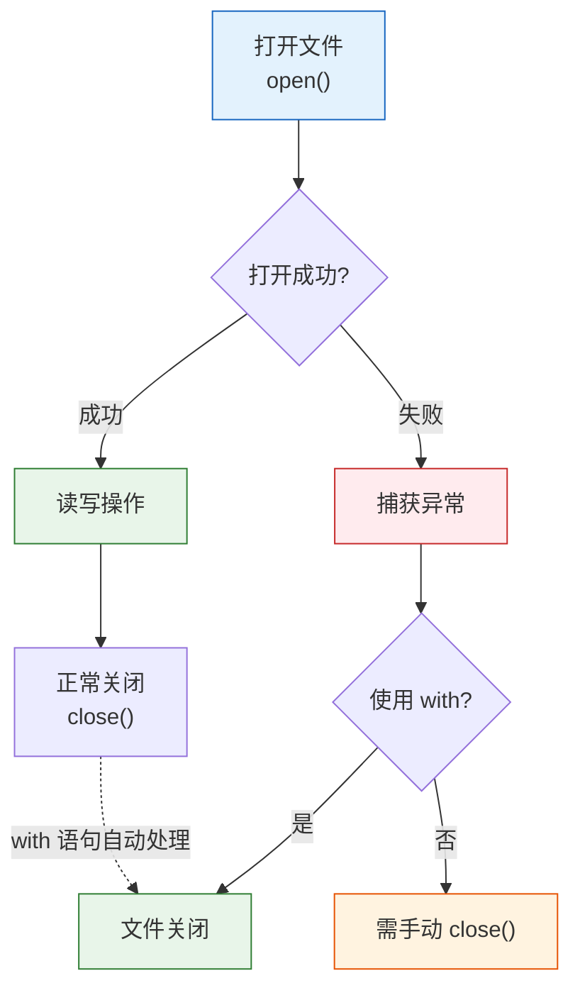

# L09: 文件操作

> **课程编号**: L09
> **所属阶段**: Stage 0 - Python 编程基础
> **预计时长**: 8 小时
> **难度**: ⭐⭐☆☆☆ (入门进阶)
> **前置课程**: L01-python-core, L02-operators-control, L03-data-structures, L04-functions-modules
> **版本**: v2.2
> **最后更新**: 2026-08-05
> **核心版本**: Python 3.13

---

## 🎯 学习目标

完成本课程后，你将能够：

1. ✅ 掌握 `open()` 与文件模式（r/w/a/x/b/+）
2. ✅ **始终使用 `with` 上下文管理器**（避免资源泄漏）
3. ✅ 使用 `pathlib.Path` 替代传统 `os.path`
4. ✅ 处理 JSON 数据（读/写 + 类型化）
5. ✅ 处理 CSV 数据（DictReader/DictWriter）
6. ✅ 理解编码（UTF-8 必填，避免中文乱码）
7. ✅ 理解路径穿越攻击原理（学习 Level 1 防御）
8. ✅ 使用上下文管理器管理资源

---

## 📖 课程导读

本课程将带你学习 Python 文件操作，实现数据的持久化存储。

**为什么要学习文件操作？**

数据持久化是程序的基本需求：
- **配置管理**：读取配置文件
- **日志记录**：记录程序运行日志
- **数据导入导出**：CSV、Excel、PDF 文件处理
- **缓存**：临时存储计算结果
- **用户数据**：保存用户设置和状态

---


### 文件操作流程（可视化）



## Part 1: 文件基础

### 1.1 什么是文件操作

文件操作是程序与外部存储介质交互的方式。

### 数据持久化的核心

程序运行时的数据存储在内存中，程序关闭后数据会丢失。文件操作是实现**数据持久化**的基本手段：

- **配置管理**：读取配置文件（JSON、YAML、INI）
- **日志记录**：记录程序运行日志
- **数据导入导出**：CSV、Excel、PDF 文件处理
- **缓存**：临时存储计算结果
- **用户数据**：保存用户设置和状态

---


## 💭 课堂思考

### 思考 1: 为什么需要 `with` 语句？

**问题**：如果不使用 `with` 语句，文件操作可能有什么风险？

**引导思考**：
- 如果程序在 `open()` 和 `close()` 之间崩溃会怎样？
- 异常发生时，`close()` 还能执行吗？
- `with` 语句如何解决这个问题？

**代码对比**：
```python
# 不用 with
f = open('data.txt', 'w')
f.write("data")
# 如果这里发生异常，文件永远不会关闭

# 使用 with
with open('data.txt', 'w') as f:
    f.write("data")
# 无论是否异常，文件都会正确关闭
```

---

### 思考 2: pathlib vs os.path

**问题**：既然 `os.path` 也能完成任务，为什么推荐 pathlib？

**引导思考**：
- 面向对象 vs 面向过程
- 路径拼接的语法：`os.path.join(a, b)` vs `Path(a) / b`
- 链式调用：pathlib 的优势

**代码对比**：
```python
# os.path 方式
import os
path = os.path.join('data', 'users', 'alice.txt')

# pathlib 方式
from pathlib import Path
path = Path('data') / 'users' / 'alice.txt'
```

---

### 思考 3: 编码问题的根源

**问题**：为什么中文文本经常出现乱码？

**引导思考**：
- Unicode 和字节的区别
- 为什么 `encoding='utf-8'` 是必须的？
- 什么情况下会用到其他编码？

---

## 📝 基础文件操作

### 打开文件：open() 函数

```python
# 基本语法
file = open(filename, mode, encoding='utf-8')
# ... 文件操作 ...
file.close()  # 必须关闭文件！
```
**文件模式**：

| 模式   | 说明         | 文件不存在 | 文件已存在 |
| ------ | ------------ | ---------- | ---------- |
| `'r'`  | 只读（默认） | 报错       | 读取       |
| `'w'`  | 写入         | 创建       | **清空**   |
| `'a'`  | 追加         | 创建       | 追加到末尾 |
| `'x'`  | 独占创建     | 创建       | 报错       |
| `'r+'` | 读写         | 报错       | 读写       |
| `'b'`  | 二进制模式   | -          | -          |

### ✅ 推荐：使用上下文管理器

```python
# ✅ 正确：自动关闭文件
with open('data.txt', 'r', encoding='utf-8') as f:
    content = f.read()
# 离开 with 块后，文件自动关闭

# ❌ 不推荐：手动管理
f = open('data.txt', 'r')
content = f.read()
f.close()  # 容易忘记或异常时未执行
```
---

## 📖 读取文件

### 方法 1: read() - 读取全部内容

```python
with open('data/example.txt', 'r', encoding='utf-8') as f:
    content = f.read()  # 返回整个文件内容（字符串）
    print(content)
```
**适用场景**：小文件（< 10MB）

### 方法 2: readline() - 逐行读取

```python
with open('data/example.txt', 'r', encoding='utf-8') as f:
    line1 = f.readline()  # 读取第一行
    line2 = f.readline()  # 读取第二行
    print(line1, line2)
```
### 方法 3: readlines() - 读取所有行（列表）

```python
with open('data/example.txt', 'r', encoding='utf-8') as f:
    lines = f.readlines()  # 返回列表，每个元素是一行
    for line in lines:
        print(line.strip())  # strip() 移除换行符
```
### ✅ 方法 4: 迭代文件对象（推荐）

```python
# ✅ 最高效：逐行迭代，内存友好
with open('large_file.txt', 'r', encoding='utf-8') as f:
    for line in f:
        print(line.strip())
```
**优势**：

- 不会一次性加载整个文件到内存
- 适合处理大文件（GB 级别）

---

## ✍️ 写入文件

### 方法 1: write() - 写入字符串

```python
with open('output.txt', 'w', encoding='utf-8') as f:
    f.write('Hello, World!\n')
    f.write('Second line\n')
```
**注意**：`write()` 不会自动添加换行符！

### 方法 2: writelines() - 写入列表

```python
lines = ['First line\n', 'Second line\n', 'Third line\n']
with open('output.txt', 'w', encoding='utf-8') as f:
    f.writelines(lines)
```
### 追加模式

```python
# 追加到文件末尾
with open('log.txt', 'a', encoding='utf-8') as f:
    f.write('New log entry\n')
```
---

## 🗂️ 路径操作（pathlib）

### 为什么使用 pathlib？

```python
# ❌ 不推荐：字符串拼接（跨平台问题）
import os
path = os.path.join('data', 'users', 'user.txt')

# ✅ 推荐：pathlib（面向对象，跨平台）
from pathlib import Path
path = Path('data') / 'users' / 'user.txt'
```
### pathlib 常用操作

```python
from pathlib import Path

# 创建路径对象
file_path = Path('data') / 'example.txt'

# 检查文件是否存在
if file_path.exists():
    print("File exists")

# 检查是否为文件/目录
print(file_path.is_file())
print(file_path.is_dir())

# 获取文件信息
print(file_path.name)        # example.txt
print(file_path.stem)        # example
print(file_path.suffix)      # .txt
print(file_path.parent)      # data/

# 获取绝对路径
print(file_path.resolve())

# 读写文件（简化版）
content = file_path.read_text(encoding='utf-8')
file_path.write_text('Hello', encoding='utf-8')

# 创建目录
data_dir = Path('data')
data_dir.mkdir(parents=True, exist_ok=True)
```
### pathlib 进阶操作

> 💡 **提示**：L04 已经学习了 pathlib 基础（Path 创建、/ 拼接、路径信息）。本节继续学习**遍历、目录操作、跨平台处理**。

#### 路径遍历（glob/rglob）

```python
from pathlib import Path

# 遍历当前目录下的所有 .py 文件
for py_file in Path('.').glob('*.py'):
    print(py_file)

# 递归遍历（包含子目录）
for py_file in Path('.').rglob('*.py'):
    print(py_file)

# 过滤文件
for f in Path('.').rglob('*'):
    if f.is_file() and f.suffix in ('.py', '.md'):
        print(f)

# 只遍历目录
for d in Path('.').rglob('*'):
    if d.is_dir() and not d.name.startswith('.'):
        print(d)
```

#### 目录操作

```python
from pathlib import Path

# 创建目录
data_dir = Path('data')
data_dir.mkdir(parents=True, exist_ok=True)

# 创建多级目录
Path('data/users/admins').mkdir(parents=True, exist_ok=True)

# 删除空目录
data_dir.rmdir()  # 仅当目录为空时有效

# 删除文件
file_path = Path('temp.txt')
file_path.unlink()  # 删除文件（不存在则报错）
file_path.unlink(missing_ok=True)  # 不存在也不报错

# 重命名/移动
old_path = Path('old_name.txt')
new_path = old_path.rename('new_name.txt')

# 复制（需要 shutil）
import shutil
shutil.copy2('source.txt', 'dest.txt')
```

#### 路径安全验证

```python
from pathlib import Path

# resolve() 获取绝对路径
path = Path('data/../etc/passwd').resolve()
print(path)  # /etc/passwd（危险！）

# is_relative_to() 检查是否在安全目录内（Python 3.9+）
base = Path('/safe/uploads').resolve()
target = (base / '../../../etc/passwd').resolve()

if target.is_relative_to(base):
    print("路径安全")
else:
    print("路径越界，拒绝访问")
```

#### 跨平台路径处理

```python
from pathlib import Path
import os

# pathlib 自动处理跨平台分隔符
p = Path('data') / 'users' / 'file.txt'
print(p)  # Windows: data\users\file.txt | Unix: data/users/file.txt

# 平台检测
if os.name == 'nt':  # Windows
    config_path = Path('C:/ProgramData/app')
else:  # Unix/Linux/Mac
    config_path = Path('/etc/app')

# 获取平台特定路径
Path.home()                    # 用户主目录
Path.cwd()                     # 当前目录
tempfile.gettempdir()          # 临时目录

# Windows vs Unix 路径差异
"""
Windows: C:\Users\...\file.txt
Unix:   /home/.../file.txt

pathlib.Path 自动处理这些差异
"""
```

---

### 遍历目录

```python
from pathlib import Path

# 遍历当前目录下的所有 .py 文件
for py_file in Path('.').glob('*.py'):
    print(py_file)

# 递归遍历（包含子目录）
for py_file in Path('.').rglob('*.py'):
    print(py_file)
```
---

## 🔒 路径安全问题（基础版）

> 📌 本课程仅介绍**基础路径穿越防御**（Level 1），适合学习阶段使用。完整的多层防御方案将在后续进阶课程中讲解。

### 路径穿越攻击（Path Traversal）

用户输入如果直接拼接到文件路径，可能导致越权访问：

```python
# ❌ 危险：用户输入直接拼接到路径
filename = input("请输入文件名: ")   # 攻击者输入: "../../../etc/passwd"
with open(filename, 'r') as f:
    content = f.read()               # 泄露系统文件！
```

### ✅ Level 1 防御：基础路径验证

使用 `pathlib.Path` 配合 `resolve()` 和 `startswith()` 验证路径在安全目录内：

```python
from pathlib import Path

base_dir = Path("/safe/uploads").resolve()

def safe_read(user_input: str) -> str:
    """Level 1 路径安全读取（学习用，生产需扩展）"""
    # Step 1: 构造完整路径
    file_path = (base_dir / user_input).resolve()

    # Step 2: 验证路径在安全目录内
    if not str(file_path).startswith(str(base_dir)):
        raise ValueError("路径在安全目录外，拒绝访问")

    # Step 3: 验证是文件且存在
    if not file_path.is_file():
        raise FileNotFoundError(f"文件不存在: {file_path.name}")

    # Step 4: 安全读取
    return file_path.read_text(encoding="utf-8")

# 测试
print(safe_read("data.txt"))         # ✅ 正常文件
print(safe_read("../../../etc/passwd"))  # ❌ ValueError: 路径在安全目录外
```

**Level 1 的局限性**：

| 防御层级 | 防御能力 | 说明 |
|---------|---------|------|
| **Level 1** | 基础路径验证 | `resolve()` + `startswith()` 检查 |
| **Level 2** | 符号链接拒绝 | `O_NOFOLLOW` 拒绝跟随符号链接 |
| **Level 3** | inode 比较 | 防止 TOCTOU 竞态条件 |

> 📖 **进阶防御简介**：
>
> **Level 2 - 符号链接拒绝**：
> 攻击者可创建符号链接绕过 Level 1 检查。解决方案：使用 `os.open()` 配合 `O_NOFOLLOW` 标志打开文件，拒绝跟随符号链接。
>
> **Level 3 - inode 比较**：
> 即使通过 `resolve()` 和符号链接检查，仍存在检查和使用之间的竞态条件（TOCTOU）。解决方案：获取文件的 inode 号并验证。
>
> 完整的多层防御方案将在后续安全课程中详细讲解。
---

## 🌐 编码问题处理

### 常见编码

- **UTF-8**：推荐，支持所有语言（包括中文、emoji）
- **GBK**：中文编码（Windows 中文系统默认）
- **ASCII**：仅支持英文字符
- **Latin-1 (ISO-8859-1)**：西欧语言

### 编码错误示例

```python
# ❌ 错误：使用默认编码读取中文文件
with open('chinese.txt', 'r') as f:  # 默认可能是 ASCII
    content = f.read()
# UnicodeDecodeError: 'ascii' codec can't decode byte ...

# ✅ 正确：显式指定 UTF-8
with open('chinese.txt', 'r', encoding='utf-8') as f:
    content = f.read()
```
### 处理未知编码

**多编码回退逻辑**（用文字描述执行步骤）：
1. **尝试 UTF-8**：`file_path.read_text(encoding='utf-8')` — 大多数现代文件
2. **回退 GBK**：`file_path.read_text(encoding='gbk')` — 中文 Windows 文件
3. **最后 latin-1**：`file_path.read_text(encoding='latin-1')` — 兼容所有字节
4. **全部失败**：抛出 `UnicodeDecodeError`

> 💡 **L08 将学到**：如何用 `try/except` 捕获 `UnicodeDecodeError` 并实现自动回退。

> 💡 **L08 将学到**：如何用 `try/except` 捕获 `UnicodeDecodeError` 并回退。

### 编码转换

```python
# 读取 GBK 文件，转换为 UTF-8
with open('gbk_file.txt', 'r', encoding='gbk') as f:
    content = f.read()

with open('utf8_file.txt', 'w', encoding='utf-8') as f:
    f.write(content)
```
---

## 📊 JSON 文件操作

### 什么是 JSON？

JSON (JavaScript Object Notation) 是一种轻量级的数据交换格式，常用于配置文件和 API 数据。

### 读取 JSON

```python
import json
from pathlib import Path

# 方法 1：使用 json.load()
with open('config.json', 'r', encoding='utf-8') as f:
    config = json.load(f)

# 方法 2：使用 Path（Python 3.9+）
config = json.loads(Path('config.json').read_text(encoding='utf-8'))

print(config['database']['host'])
```
**示例 JSON 文件**：

```json
{
  "database": {
    "host": "localhost",
    "port": 5432,
    "name": "mydb"
  },
  "debug": true,
  "max_connections": 100
}
### 写入 JSON

```python
import json

data = {
    "name": "Alice",
    "age": 25,
    "skills": ["Python", "SQL", "Docker"]
}

# 写入 JSON（缩进美化）
with open('data/user.json', 'w', encoding='utf-8') as f:
    json.dump(data, f, indent=2, ensure_ascii=False)
```
**参数说明**：

- `indent=2`：缩进 2 空格（美化输出）
- `ensure_ascii=False`：允许中文直接输出（不转义为 `\uXXXX`）

---

## 📈 CSV 文件操作

### 什么是 CSV？

CSV (Comma-Separated Values) 是一种常见的表格数据格式，常用于数据导入导出。

### 读取 CSV

```python
import csv
from pathlib import Path

# 方法 1：使用 csv.reader（列表）
with open('users.csv', 'r', encoding='utf-8') as f:
    reader = csv.reader(f)
    header = next(reader)  # 第一行是表头
    for row in reader:
        print(row)  # ['Alice', '25', 'Beijing']

# 方法 2：使用 csv.DictReader（字典，推荐）
with open('users.csv', 'r', encoding='utf-8') as f:
    reader = csv.DictReader(f)
    for row in reader:
        print(row['name'], row['age'], row['city'])
```
**示例 CSV 文件** (`users.csv`):

```text
name,age,city
Alice,25,Beijing
Bob,30,Shanghai
Charlie,28,Guangzhou
### 写入 CSV

```python
import csv

users = [
    {'name': 'Alice', 'age': 25, 'city': 'Beijing'},
    {'name': 'Bob', 'age': 30, 'city': 'Shanghai'}
]

# 方法 1：使用 csv.writer
with open('output.csv', 'w', encoding='utf-8', newline='') as f:
    writer = csv.writer(f)
    writer.writerow(['name', 'age', 'city'])  # 表头
    writer.writerow(['Alice', 25, 'Beijing'])

# 方法 2：使用 csv.DictWriter（推荐）
with open('output.csv', 'w', encoding='utf-8', newline='') as f:
    fieldnames = ['name', 'age', 'city']
    writer = csv.DictWriter(f, fieldnames=fieldnames)
    writer.writeheader()  # 写入表头
    writer.writerows(users)  # 写入多行
```
**注意**：`newline=''` 防止 Windows 下出现空行。

---

## 📦 大文件处理策略

### 问题：内存溢出

```python
# ❌ 危险：一次性读取 10GB 文件
with open('huge_file.txt', 'r') as f:
    content = f.read()  # MemoryError!
```
### ✅ 解决方案：流式处理

> 💡 **已学习**：以下逻辑在 L02 中已学过——`for` 循环的用法。

**流式处理逻辑**（用文字描述执行步骤）：
1. **初始化计数器**：`line_count = 0`
2. **逐行读取**：`with open(...) as f: for line in f:` — 逐行迭代，内存恒定
3. **处理每行**：`process_line(line.strip())`
4. **计数返回**：返回总行数

### 分块读取

**分块读取逻辑**（用文字描述执行步骤）：
1. **二进制模式打开**：`with open(file_path, 'rb') as f:`
2. **循环读取块**：`while True: chunk = f.read(chunk_size)`
3. **判断结束**：`if not chunk: break`
4. **处理块**：`process_chunk(chunk)`

> 💡 **已学习**：`while True` 无限循环 + `break` 退出已在 L02 中学习。

---

## ⚠️ 常见错误与解决方案

### 错误 1: 忘记关闭文件

**错误代码**：

```python
# ❌ 文件未关闭，可能导致数据丢失
f = open('output.txt', 'w')
f.write('Hello')
# 忘记 f.close()
```
**正确写法**：

```python
# ✅ 使用 with 自动关闭
with open('output.txt', 'w') as f:
    f.write('Hello')
```
### 错误 2: 编码问题

**错误代码**：

```python
# ❌ 未指定编码，中文可能乱码
with open('chinese.txt', 'r') as f:
    content = f.read()
```
**正确写法**：

```python
# ✅ 显式指定 UTF-8
with open('chinese.txt', 'r', encoding='utf-8') as f:
    content = f.read()
```
### 错误 3: 文件不存在

**错误代码**：

```python
# ❌ 文件不存在时崩溃
with open('nonexistent.txt', 'r') as f:
    content = f.read()
# FileNotFoundError
```
**正确写法**：

```python
# ✅ 先检查文件是否存在
from pathlib import Path

file_path = Path('data.txt')
if file_path.exists():
    content = file_path.read_text(encoding='utf-8')
else:
    print("File not found")

# 或使用异常处理（详见 L08 异常处理）
# ```python
# try:
#     with open('data.txt', 'r') as f:
#         content = f.read()
# except FileNotFoundError:
#     print("File not found")
# ```
```
---

## 💡 最佳实践

### 1. 始终指定编码

```python
# ✅ 推荐
with open('file.txt', 'r', encoding='utf-8') as f:
    content = f.read()

# ❌ 不推荐
with open('file.txt', 'r') as f:  # 编码由系统决定，不可靠
    content = f.read()
```
### 2. 使用 pathlib 而非 os.path

```python
# ✅ 推荐：pathlib
from pathlib import Path
file_path = Path('data') / 'users' / 'user.txt'

# ❌ 不推荐：os.path
import os
file_path = os.path.join('data', 'users', 'user.txt')
```
### 3. 临时文件使用 tempfile

```python
import tempfile

# ✅ 自动清理临时文件
with tempfile.NamedTemporaryFile(mode='w', delete=True) as tmp:
    tmp.write('Temporary data')
    tmp.flush()
    # 使用 tmp.name 访问文件路径
# 文件自动删除
```
### 4. 原子写入（避免数据损坏）

> 💡 **L04 将学到**：以下逻辑封装为 `def atomic_write(file_path, content)` 函数。

**原子写入逻辑**（用文字描述执行步骤）：
1. **生成临时文件**：`tmp_path = file_path.with_suffix('.tmp')`
2. **写入临时文件**：`tmp_path.write_text(content)` — 先写临时文件
3. **原子替换**：`shutil.move(tmp_path, file_path)` — 用临时文件替换原文件
4. **效果**：即使写入中途崩溃，原文件也不会损坏（要么完整，要么不变）

> 💡 **L04 将学到**：`import shutil` 模块的用法。

---

## 📚 扩展阅读

### 官方文档

- [Python File I/O](https://docs.python.org/3/tutorial/inputoutput.html#reading-and-writing-files)
- [pathlib Module](https://docs.python.org/3/library/pathlib.html)
- [json Module](https://docs.python.org/3/library/json.html)
- [csv Module](https://docs.python.org/3/library/csv.html)

### 进阶主题预告

- **Stage 1 L08**: 异常处理进阶 - 用 `try/except` 捕获文件操作异常
- **Stage 1 L12**: 高级特性 - 上下文管理器协议、自定义 `with` 语句

---

## 🎯 课后练习

完成 `exercises/` 目录下的练习，运行测试验证：

```bash
# 运行 L09 测试
uv run pytest stage0-python-basics/lessons/L09-file-operations/tests/ -v
---

## 📝 快速参考

### 文件操作速查表

```python
from pathlib import Path

# 读取文本文件
content = Path('file.txt').read_text(encoding='utf-8')

# 写入文本文件
Path('file.txt').write_text('Hello', encoding='utf-8')

# 读取二进制文件
data = Path('image.png').read_bytes()

# 写入二进制文件
Path('image.png').write_bytes(data)

# 追加文本
with open('log.txt', 'a', encoding='utf-8') as f:
    f.write('New entry\n')

# JSON 操作
import json
data = json.loads(Path('config.json').read_text())
Path('output.json').write_text(json.dumps(data, indent=2))

# CSV 操作
import csv
with open('data.csv', 'r') as f:
    reader = csv.DictReader(f)
    for row in reader:
        print(row)
```
---

## 💭 课堂思考

### 思考 1: 为什么需要编码参数？

**问题**：为什么 Python 3 的文件操作要明确指定 `encoding='utf-8'`？不指定会有什么问题？

**引导思考**：
- 不同操作系统的默认编码是什么？
- Windows 上不指定编码会导致什么问题？
- 如果你的代码需要在多个平台运行，应该如何处理编码？

**实验建议**：
```python
# 尝试在 Windows 上不指定编码读取中文文件
with open('chinese.txt') as f:  # 不指定 encoding
    content = f.read()
```

---

### 思考 2: with 语句 vs try-finally — 哪个更好？

**问题**：下面两种方式有什么区别？哪种更推荐？

```python
# 方式 1: with 语句（推荐）
with open('file.txt') as f:
    content = f.read()

# 方式 2: try-finally（手动管理资源）
# ```python
# f = open('file.txt')
# try:
#     content = f.read()
# finally:
#     f.close()
# ```
```

**引导思考**：
- 两种方式都能保证文件关闭，但哪种更简洁？
- with 语句的原理是什么？（提示：上下文管理器）
- 在什么情况下你会选择 try-finally？

---

### 思考 3: 路径操作的跨平台问题

**问题**：为什么下面的代码在 Windows 和 Linux 上表现不同？

```python
# 方式 1: 字符串拼接
path = "data" + "/" + "file.txt"

# 方式 2: pathlib
from pathlib import Path
path = Path("data") / "file.txt"
```

**引导思考**：
- Windows 使用 `\` 而 Linux/Mac 使用 `/`，如何处理？
- `os.path.join()` vs `pathlib.Path` 哪个更现代？
- 在实际项目中，你会如何组织路径代码？

**实验建议**：在不同操作系统上运行 `Path.cwd()` 和 `os.path.sep` 观察差异。

---


## 🚀 实战案例

### 案例 1: 学生数据管理器

```python
import json
from pathlib import Path

class StudentManager:
    def __init__(self, data_file: str) -> None:
        self.data_file = Path(data_file)
        self.students: dict[str, dict] = {}
        self._load()
    
    def _load(self) -> None:
        """从文件加载数据"""
        if self.data_file.exists():
            try:
                with open(self.data_file, 'r', encoding='utf-8') as f:
                    self.students = json.load(f)
            except json.JSONDecodeError:
                print("数据文件损坏，使用空数据")
                self.students = {}
    
    def save(self) -> None:
        """保存数据到文件"""
        with open(self.data_file, 'w', encoding='utf-8') as f:
            json.dump(self.students, f, ensure_ascii=False, indent=2)
    
    def add(self, student_id: str, name: str, age: int) -> None:
        if student_id in self.students:
            raise ValueError(f"学号 {student_id} 已存在")
        self.students[student_id] = {"name": name, "age": age}
        self.save()
    
    def get(self, student_id: str) -> dict | None:
        return self.students.get(student_id)


# 使用
manager = StudentManager("students.json")
manager.add("001", "Alice", 20)
print(manager.get("001"))  # {'name': 'Alice', 'age': 20}
```

### 案例 2: 日志文件处理器

```python
from pathlib import Path
from datetime import datetime

def process_log_file(log_path: str) -> dict[str, int]:
    """统计日志文件中各错误类型的数量"""
    error_counts: dict[str, int] = {}
    
    with open(log_path, 'r', encoding='utf-8') as f:
        for line in f:
            if 'ERROR' in line:
                # 提取错误类型
                if 'Timeout' in line:
                    error_counts['Timeout'] = error_counts.get('Timeout', 0) + 1
                elif 'Connection' in line:
                    error_counts['Connection'] = error_counts.get('Connection', 0) + 1
                else:
                    error_counts['Other'] = error_counts.get('Other', 0) + 1
    
    return error_counts


# 使用
stats = process_log_file("app.log")
for error_type, count in stats.items():
    print(f"{error_type}: {count}")
```

### 案例 3: 批量文件重命名

```python
from pathlib import Path

def batch_rename(directory: str, prefix: str) -> int:
    """批量重命名目录下的文件，添加前缀"""
    dir_path = Path(directory)
    renamed = 0
    
    for file_path in dir_path.iterdir():
        if file_path.is_file():
            new_name = f"{prefix}_{file_path.name}"
            new_path = file_path.parent / new_name
            file_path.rename(new_path)
            renamed += 1
    
    return renamed


# 使用
count = batch_rename("data", "backup")
print(f"重命名了 {count} 个文件")
```

---


## 💡 常见文件操作陷阱

### 陷阱 1: 忘记关闭文件

```python
# ❌ 错误：忘记关闭文件
f = open('data.txt', 'r')
content = f.read()
# 如果这行出错，文件永远不会关闭

# ✅ 正确：使用 with 语句
with open('data.txt', 'r') as f:
    content = f.read()
# with 块结束后自动关闭
```

### 陷阱 2: 编码问题

```python
# ❌ 错误：假设默认编码
with open('data.txt', 'r') as f:
    content = f.read()  # 在 Windows 上可能出错

# ✅ 正确：显式指定编码
with open('data.txt', 'r', encoding='utf-8') as f:
    content = f.read()
```

### 陷阱 3: 路径穿越

```python
# ❌ 错误：用户可能输入恶意路径
filename = input("文件名: ")
with open(filename, 'r') as f:  # 用户可能输入 "../../../etc/passwd"
    content = f.read()

# ✅ 正确：使用 pathlib 验证路径
from pathlib import Path
user_input = input("文件名: ")
base = Path.cwd()
target = (base / user_input).resolve()

# 确保路径在安全范围内
if not target.is_relative_to(base):
    raise ValueError("非法路径")
    
with open(target, 'r', encoding='utf-8') as f:
    content = f.read()
```

### 陷阱 4: 写入时不使用 'b' 模式

```python
# ❌ 错误：在文本模式写入 bytes
with open('data.bin', 'w') as f:
    f.write(b'hello')  # TypeError

# ✅ 正确：使用二进制模式
with open('data.bin', 'wb') as f:
    f.write(b'hello')
```

### 陷阱 5: 不检查文件是否存在就删除

```python
# ❌ 错误：文件不存在时删除会报错
import os
os.remove('nonexistent.txt')  # FileNotFoundError

# ✅ 正确：先检查
from pathlib import Path
path = Path('file.txt')
if path.exists():
    path.unlink()
```

---

## 🎓 核心知识点总结

恭喜你掌握了 Python 文件操作的核心技能！本章我们学习了：

### 核心知识点

1. **文件读写基础**
   - **打开文件**：`open(file, mode, encoding='utf-8')`
   - **文件模式**：`r`（读）、`w`（写/清空）、`a`（追加）、`x`（独占创建）
   - **上下文管理器**：`with open(...) as f:` 自动关闭文件
   - **读取方法**：`read()`、`readline()`、`readlines()`、`for line in f:`

2. **pathlib 模块**
   - **Path 对象**：面向对象的路径操作
   - **常用操作**：`exists()`、`mkdir()`、`read_text()`、`write_text()`
   - **路径拼接**：`Path('dir') / 'file.txt'`（跨平台安全）
   - **glob 匹配**：`Path('.').glob('*.txt')`

3. **结构化文件处理**
   - **JSON**：`json.loads()`、`json.dumps()`
   - **CSV**：`csv.reader()`、`csv.DictReader()`
   - **编码处理**：始终指定 `encoding='utf-8'`

4. **安全与最佳实践**
   - **路径穿越防护**：验证路径在根目录内
   - **临时文件**：使用 `tempfile` 模块
   - **原子写入**：先写临时文件，再重命名
   - **大文件处理**：逐行迭代，避免内存溢出

### 文件模式速查

| 模式 | 读 | 写 | 创建 | 清空 | 指针位置 |
|------|----|----|------|------|---------|
| `r` | ✅ | ❌ | ❌ | ❌ | 开头 |
| `w` | ❌ | ✅ | ✅ | ✅ | 开头 |
| `a` | ❌ | ✅ | ✅ | ❌ | 末尾 |
| `x` | ❌ | ✅ | ✅（独占）| ❌ | 开头 |
| `r+` | ✅ | ✅ | ❌ | ❌ | 开头 |
| `w+` | ✅ | ✅ | ✅ | ✅ | 开头 |
| `a+` | ✅ | ✅ | ✅ | ❌ | 末尾 |

### 关键要点

- ✅ 始终使用 `with` 语句自动关闭文件
- ✅ 明确指定 `encoding='utf-8'` 避免编码问题
- ✅ 使用 `pathlib.Path` 代替字符串拼接路径
- ✅ 大文件逐行处理，避免 `read()` 加载全部内容
- ✅ JSON 使用 `indent=2` 参数提高可读性
- ✅ CSV 使用 `DictReader` 比 `reader` 更易用

### 常见陷阱

- ❌ 忘记关闭文件（应使用 `with` 语句）
  ```python
  # ❌ 错误
  f = open('file.txt')
  content = f.read()
  # 忘记 f.close()

  # ✅ 正确
  with open('file.txt') as f:
      content = f.read()
  ```

- ❌ 不指定编码导致跨平台问题
  ```python
  # ❌ 平台依赖（Windows 可能是 GBK）
  with open('file.txt', 'r') as f:
      content = f.read()

  # ✅ 明确指定
  with open('file.txt', 'r', encoding='utf-8') as f:
      content = f.read()
  ```

- ❌ 大文件使用 `read()` 导致内存溢出
  ```
  # ❌ 一次性加载 10GB 文件
  with open('huge.txt') as f:
      content = f.read()

  # ✅ 逐行处理
  with open('huge.txt') as f:
      for line in f:
          process(line)
  ```

- ❌ 路径拼接用字符串导致跨平台问题
  ```python
  # ❌ Windows 用 \，Linux/Mac 用 /
  path = 'data/' + 'file.txt'

  # ✅ pathlib 自动处理
  path = Path('data') / 'file.txt'
  ```

- ❌ JSON 中文乱码（`ensure_ascii=True` 默认）
  ```python
  # ❌ 中文变成 \uXXXX
  json.dumps({"name": "张三"})
  # '{"name": "\\u5f20\\u4e09"}'

  # ✅ 禁用 ASCII 转义
  json.dumps({"name": "张三"}, ensure_ascii=False)
  # '{"name": "张三"}'
  ```

### 读取方法对比

| 方法 | 返回值 | 适用场景 | 内存占用 |
|------|--------|---------|---------|
| `read()` | 字符串 | 小文件 | 高（一次性加载） |
| `readline()` | 字符串 | 逐行手动处理 | 低（按需加载） |
| `readlines()` | 列表 | 需要全部行 | 高（全部加载） |
| `for line in f:` | 迭代器 | **推荐**大文件 | 低（逐行加载） |

---

## ❌ 学生常见错误

### 错误 1: 忘记指定编码

```python
# ❌ 错误写法
with open('chinese.txt') as f:  # Windows 上可能乱码！
    content = f.read()

# ✅ 正确写法
with open('chinese.txt', encoding='utf-8') as f:
    content = f.read()

# 📝 说明
# Windows 默认编码是 GBK，Linux/Mac 是 UTF-8
# 不指定编码会导致跨平台问题！
# 始终显式指定 encoding='utf-8'
```

---

### 错误 2: 路径拼接错误

```python
# ❌ 错误写法
path = "data" + "/" + "file.txt"  # 字符串拼接

# ❌ 错误写法
path = "data\\file.txt"  # Windows 风格，Linux 不工作

# ✅ 正确写法
from pathlib import Path
path = Path("data") / "file.txt"  # 跨平台

# 或者使用 os.path.join
import os
path = os.path.join("data", "file.txt")

# 📝 说明
# Windows 使用 \ 而 Linux/Mac 使用 /
# pathlib 自动处理跨平台差异
```

---

### 错误 3: 文件未关闭

```python
# ❌ 错误写法
f = open('file.txt')
content = f.read()
# 忘记关闭文件！

# ✅ 正确写法
with open('file.txt') as f:
    content = f.read()
# with 语句自动关闭

# 📝 说明
# 不关闭文件会导致：
# 1. 资源泄漏（文件句柄没有释放）
# 2. 写入的数据可能没有刷新到磁盘
# 3. 其他程序无法访问该文件
```

---

### 实用技巧

> 💡 **L04 将学到**：以下逻辑封装为实用函数。

**1. 安全读取 JSON**：
> 💡 **L08 将学到**：如何用 `try/except` 捕获 `FileNotFoundError` 和 `JSONDecodeError`。
**执行步骤**：
1. 读取文件文本：`path.read_text(encoding='utf-8')`
2. 解析 JSON：`json.loads(text)`
3. 异常回退：捕获 `FileNotFoundError` 或 `JSONDecodeError` 时返回默认值

**2. 原子写入（防止数据损坏）**：
> 💡 **L04 将学到**：`import shutil` 模块。
**执行步骤**：
1. 生成临时文件：`path.with_suffix('.tmp')`
2. 写入临时文件：`tmp.write_text(content)`
3. 原子替换：`shutil.move(tmp, path)`

**3. 安全路径验证（防止路径穿越）**：
> 💡 **L06 将学到**：`class` 类和 `__init__` 方法。
**执行步骤**：
1. 解析绝对路径：`target.resolve()`
2. 计算相对路径：`target.relative_to(base)`
3. 异常检测：路径越界时 `ValueError` 被捕获

****4. 批量处理文件**：
```python
from pathlib import Path

# 递归查找所有 .txt 文件
for txt_file in Path('.').rglob('*.txt'):
    print(txt_file)

# 批量重命名
for file in Path('data').glob('*.log'):
    file.rename(file.with_suffix('.txt'))
```
### pathlib 常用操作

```python
from pathlib import Path

p = Path('data/file.txt')

# 路径信息
p.name          # 'file.txt'
p.stem          # 'file'
p.suffix        # '.txt'
p.parent        # Path('data')
p.absolute()    # 绝对路径

# 文件操作
p.exists()      # 是否存在
p.is_file()     # 是否为文件
p.is_dir()      # 是否为目录
p.stat()        # 文件信息（大小、时间）

# 读写（Python 3.5+）
p.read_text(encoding='utf-8')
p.write_text('content', encoding='utf-8')
p.read_bytes()
p.write_bytes(b'data')

# 目录操作
p.mkdir(parents=True, exist_ok=True)
p.rmdir()
p.unlink()      # 删除文件
```


### 🚀 典型应用场景

- 📝 配置管理：读取 JSON/YAML 配置
- 📊 数据处理：读写 CSV 文件
- 🔐 日志记录：持久化程序日志
- 🗂️ 数据备份：保存和恢复数据

#

## ✅ 自检清单

完成本课程后，你应该能够：

- [ ] 理解核心概念
- [ ] 能够编写相关代码
- [ ] 解决常见问题


---

## 📝 进阶预告

完成本课程后，你已经掌握了文件操作的精髓。现在进入 [P01: Python 基础综合项目](../P01-student-manager/lesson.md)，我们将综合运用 Stage 0 的所有知识：

- 👨‍🎓 **学员管理系统**：CRUD 操作
- 💾 **数据持久化**：JSON 文件读写
- 🛡️ **异常处理**：健壮的错误处理
- 🎨 **OOP 设计**：类与对象的应用
- 🧪 **测试编写**：单元测试基础

> 💡 **学习路径**：L09 → P01（综合项目）→ Stage 1 L10（类型系统进阶）


---

## 🔗 下一步

- 完成 `exercises/` 目录下的练习题巩固知识
- 运行 `uv run pytest tests/ -v` 验证掌握程度
- 继续学习 [L07 - 面向对象基础](../L07-oop-basics/lesson.md)

---

## 🔮 在下一课中，我们将学习：

### L07: 面向对象基础

在下一课中，我们将进入 Python 面向对象编程（OOP）的世界：

1. **类与对象**
   - 如何定义类和创建对象
   - `__init__` 构造方法
   - `self` 参数的含义

2. **封装**
   - 属性和方法
   - 私有属性（`_` 和 `__` 前缀）
   - property 装饰器

3. **继承与多态**
   - 类的继承关系
   - 方法重写（Override）
   - `super()` 调用父类方法

4. **实战案例**
   - 设计一个学员管理系统的数据模型
   - 使用类来组织和管理数据
   - 为 L09 综合项目打下基础

**为什么要学习面向对象？**

- 文件操作让我们掌握了**数据持久化**
- 面向对象让我们学会**数据建模**和**代码组织**
- 两者结合，你就能构建完整的应用程序！

**准备好了吗？** 让我们一起探索面向对象编程的强大之处！

👉 [开始学习 L06 - 面向对象基础](../L07-oop-basics/lesson.md)


## 💡 常见文件操作陷阱

### 陷阱 1: 忘记关闭文件

```python
# ❌ 错误：忘记关闭文件
f = open('data.txt', 'r')
content = f.read()
# 如果这行出错，文件永远不会关闭

# ✅ 正确：使用 with 语句
with open('data.txt', 'r') as f:
    content = f.read()
# with 块结束后自动关闭
```

### 陷阱 2: 编码问题

```python
# ❌ 错误：假设默认编码
with open('data.txt', 'r') as f:
    content = f.read()  # 在 Windows 上可能出错

# ✅ 正确：显式指定编码
with open('data.txt', 'r', encoding='utf-8') as f:
    content = f.read()
```

### 陷阱 3: 路径穿越

```python
# ❌ 错误：用户可能输入恶意路径
filename = input("文件名: ")
with open(filename, 'r') as f:  # 用户可能输入 "../../../etc/passwd"
    content = f.read()

# ✅ 正确：使用 pathlib 验证路径
from pathlib import Path
user_input = input("文件名: ")
base = Path.cwd()
target = (base / user_input).resolve()

# 确保路径在安全范围内
if not target.is_relative_to(base):
    raise ValueError("非法路径")
    
with open(target, 'r', encoding='utf-8') as f:
    content = f.read()
```

### 陷阱 4: 写入时不使用 'b' 模式

```python
# ❌ 错误：在文本模式写入 bytes
with open('data.bin', 'w') as f:
    f.write(b'hello')  # TypeError

# ✅ 正确：使用二进制模式
with open('data.bin', 'wb') as f:
    f.write(b'hello')
```

### 陷阱 5: 不检查文件是否存在就删除

```python
# ❌ 错误：文件不存在时删除会报错
import os
os.remove('nonexistent.txt')  # FileNotFoundError

# ✅ 正确：先检查
from pathlib import Path
path = Path('file.txt')
if path.exists():
    path.unlink()
```

---

## 🎓 核心知识点总结

### 文件操作核心概念

| 概念 | 说明 |
|------|------|
| **open()** | 打开文件，返回文件对象 |
| **with 语句** | 上下文管理器，自动关闭文件 |
| **pathlib** | 面向对象的路径处理 |
| **JSON** | 轻量级数据交换格式 |

### 文件模式速查

| 模式 | 说明 |
|------|------|
| `r` | 只读（默认） |
| `w` | 只写（覆盖） |
| `a` | 追加 |
| `x` | 新建（存在则报错） |
| `b` | 二进制模式 |
| `+` | 读写模式 |

### pathlib 常用方法

```python
from pathlib import Path

p = Path("data/file.txt")
p.read_text()           # 读取文本
p.write_text("hello")   # 写入文本
p.exists()              # 检查存在
p.parent / "other.txt" # 路径拼接
```

---

