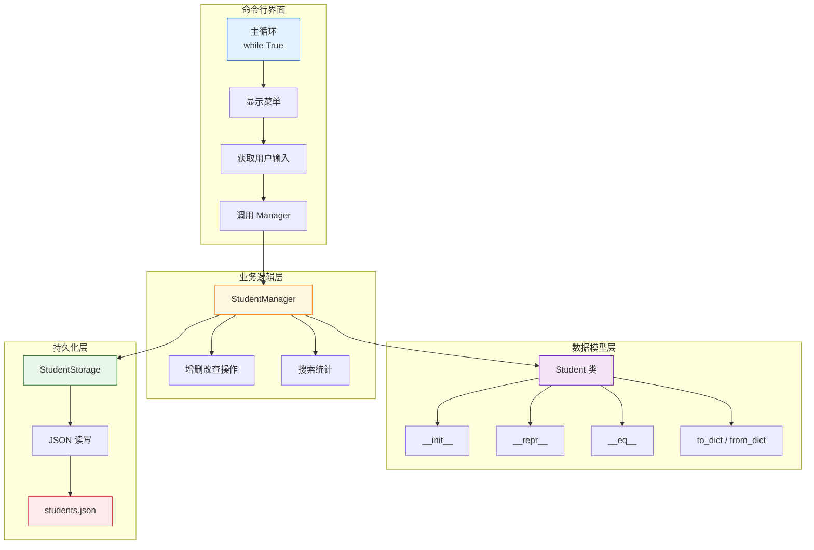

# P01: Python 基础实战

> **课程编号**: P01
> **所属阶段**: Stage 0 - Python 编程基础
> **预计时长**: 6-8 小时
> **难度**: ⭐⭐⭐☆☆
> **前置课程**: L01-L09 (Stage 0 全部课程)
> **版本**: v3.1
> **最后更新**: 2026-08-05
> **核心版本**: Python 3.13

---

## 🎯 学习目标

完成本项目后，你将能够：

1. **综合应用**：将 L01-L09 的知识综合应用于实际项目
2. **面向对象设计**：使用类建模实际业务场景
3. **数据持久化**：实现 JSON 文件的数据读写
4. **异常处理**：优雅处理各种错误情况
5. **代码组织**：模块化设计和清晰的文件结构

---

## 📖 项目导读

本项目是一个**综合实战项目**，将帮助你把 Stage 0 学到的所有知识串联起来。

**为什么做这个项目？**
- 纸上得来终觉浅，绝知此事要躬行
- 只有真正写代码，才能检验学习成果
- 完整的项目经验，为 Stage 1 打下基础

**项目特点**：
- 真实的应用场景（学员管理系统）
- 完整的 CRUD 操作
- 文件持久化存储
- 面向对象的代码设计
- 完整的错误处理

## 📚 项目概述

### 项目：学员管理系统（Student Management System）

一个完整的命令行学员管理工具，综合运用 Stage 0 基础内容：

- **变量与数据类型**：存储学员信息
- **控制流**：用户交互循环
- **数据结构**：列表、字典管理数据
- **函数**：功能模块化
- **文件操作**：持久化存储
- **模块化**：多文件组织
- **异常处理**：容错处理
- **面向对象**：使用类简化数据模型

### 功能需求

1. **添加学员**：创建新学员记录
2. **查看学员**：列出所有学员
3. **查询学员**：按 ID 获取单个学员
4. **更新学员**：修改学员信息
5. **删除学员**：移除学员记录
6. **搜索学员**：按姓名模糊搜索
7. **统计信息**：学员数量和年龄统计

---

## 🏗️ 项目结构

### 目录组织

```text
P01-student-manager/
├── examples/                  # 示例代码
│   ├── 01_student_basics.py # 基础结构
│   ├── 02_class_student.py  # 类的定义
│   ├── 03_persistence.py     # 数据持久化
│   └── 04_cli_demo.py        # CLI 交互演示
├── exercises/                # 练习题
│   └── 01_student_manager.py # 学员管理器练习
├── solutions/                # 参考答案
│   ├── __init__.py
│   └── student_manager.py
├── tests/                    # 测试用例
│   ├── conftest.py
│   └── test_student_manager.py
├── README.md
└── lesson.md
```

---

## 📝 实现步骤

### 项目架构（可视化）



**分层架构优点**：
- **CLI 层**：用户交互，职责单一
- **Manager 层**：业务逻辑，不关心存储
- **Model 层**：数据表示，与业务无关
- **Storage 层**：持久化，与业务无关

### 步骤 1: 数据模型（类定义）

使用类和 `__init__` 定义数据模型：

```python
class Student:
    """学员数据模型"""

    def __init__(self, student_id: str, name: str, age: int) -> None:
        self.student_id = student_id
        self.name = name
        self.age = age

    def __repr__(self) -> str:
        """用于调试和显示"""
        return f"Student({self.student_id!r}, {self.name!r}, {self.age})"

    def __eq__(self, other: object) -> bool:
        """按学号比较"""
        if not isinstance(other, Student):
            return NotImplemented
        return self.student_id == other.student_id

    def to_dict(self) -> dict:
        """转换为字典（用于序列化）"""
        return {
            "student_id": self.student_id,
            "name": self.name,
            "age": self.age,
        }

    @classmethod
    def from_dict(cls, data: dict) -> "Student":
        """从字典创建实例"""
        return cls(
            data["student_id"],
            data["name"],
            data["age"],
        )
```

**为什么要用类？**

| 特性 | 字典 | 类实例 |
|------|------|--------|
| 代码量 | 多处重复字段名 | 字段集中定义 |
| 提示 | 无 IDE 补全 | 有类型补全 |
| 扩展 | 需改多处 | 改一处即可 |
| 方法 | 无 | 可内嵌行为 |

### 步骤 2: 数据管理器

```python
class StudentManager:
    """学员管理器"""

    def __init__(self) -> None:
        self.students: dict[str, Student] = {}

    def add_student(self, student: Student) -> bool:
        """添加学员"""
        if student.student_id in self.students:
            return False
        self.students[student.student_id] = student
        return True

    def get_student(self, student_id: str) -> Student | None:
        """获取学员"""
        return self.students.get(student_id)

    def remove_student(self, student_id: str) -> bool:
        """删除学员"""
        if student_id in self.students:
            del self.students[student_id]
            return True
        return False

    def update_student(
        self,
        student_id: str,
        name: str | None = None,
        age: int | None = None,
    ) -> bool:
        """更新学员信息"""
        student = self.students.get(student_id)
        if student is None:
            return False
        if name is not None:
            student.name = name
        if age is not None:
            student.age = age
        return True

    def list_students(self) -> list[Student]:
        """列出所有学员（返回副本）"""
        return list(self.students.values())

    def search_by_name(self, name: str) -> list[Student]:
        """按姓名搜索（不区分大小写）"""
        name_lower = name.lower()
        return [
            s for s in self.students.values()
            if name_lower in s.name.lower()
        ]
```

### 步骤 3: 数据持久化

```python
import json
from pathlib import Path

class StudentStorage:
    """学员数据持久化"""

    def __init__(self, filepath: str = "students.json"):
        self.filepath = Path(filepath)

    def save(self, students: list[Student]) -> None:
        """保存到文件"""
        data = [s.to_dict() for s in students]
        self.filepath.write_text(
            json.dumps(data, indent=2, ensure_ascii=False),
            encoding="utf-8",
        )

    def load(self) -> list[Student]:
        """从文件加载"""
        if not self.filepath.exists():
            return []
        try:
            content = self.filepath.read_text(encoding="utf-8")
            data = json.loads(content)
            return [Student.from_dict(item) for item in data]
        except (json.JSONDecodeError, KeyError):
            return []
```

---

## 🚀 实战案例：两种设计模式对比

### 案例背景

同一个学员管理系统，可以用两种不同的方式实现：

**方案 A**: 面向过程（函数式）
- 使用全局函数
- 数据存储在全局变量中
- 函数之间通过全局变量通信

**方案 B**: 面向对象（OOP）
- 使用类封装数据和方法
- 数据存储在实例属性中
- 方法之间通过 self 通信

---

### 方案 A：面向过程实现

```python
# student_manager_v1.py

# 全局数据存储
students = {}  # type: dict[str, dict]

def add_student(name: str, age: int, score: float) -> None:
    """添加学员"""
    students[name] = {"name": name, "age": age, "score": score}

def list_students() -> list[dict]:
    """列出所有学员"""
    return list(students.values())

def find_student(name: str) -> dict | None:
    """查找学员"""
    return students.get(name)

def update_student(name: str, age: int | None = None, score: float | None = None) -> bool:
    """更新学员"""
    if name not in students:
        return False
    if age is not None:
        students[name]["age"] = age
    if score is not None:
        students[name]["score"] = score
    return True

def delete_student(name: str) -> bool:
    """删除学员"""
    if name in students:
        del students[name]
        return True
    return False
```

**优点**：
- 代码简单直观
- 容易理解执行流程

**缺点**：
- 全局变量容易被意外修改
- 数据和行为分离
- 难以扩展新功能

---

### 方案 B：面向对象实现

```python
# student_manager_v2.py

class Student:
    """学员类"""
    
    def __init__(self, name: str, age: int, score: float) -> None:
        self.name = name
        self.age = age
        self.score = score
    
    def to_dict(self) -> dict:
        return {"name": self.name, "age": self.age, "score": self.score}
    
    @classmethod
    def from_dict(cls, data: dict) -> "Student":
        return cls(data["name"], data["age"], data["score"])

class StudentManager:
    """学员管理器"""
    
    def __init__(self) -> None:
        self._students: dict[str, Student] = {}
    
    def add_student(self, name: str, age: int, score: float) -> None:
        """添加学员"""
        self._students[name] = Student(name, age, score)
    
    def list_students(self) -> list[Student]:
        """列出所有学员"""
        return list(self._students.values())
    
    def find_student(self, name: str) -> Student | None:
        """查找学员"""
        return self._students.get(name)
    
    def update_student(self, name: str, age: int | None = None, score: float | None = None) -> bool:
        """更新学员"""
        student = self._students.get(name)
        if not student:
            return False
        if age is not None:
            student.age = age
        if score is not None:
            student.score = score
        return True
    
    def delete_student(self, name: str) -> bool:
        """删除学员"""
        if name in self._students:
            del self._students[name]
            return True
        return False
```

**优点**：
- 数据和行为封装在一起
- 私有属性保护内部状态
- 易于扩展和维护

**缺点**：
- 代码量稍多
- 需要理解类和方法

---

### 方案对比

| 维度 | 面向过程 (方案 A) | 面向对象 (方案 B) |
|------|-------------------|-------------------|
| 代码量 | 较少 | 较多 |
| 学习曲线 | 陡峭 | 平缓 |
| 可维护性 | 困难 | 容易 |
| 可扩展性 | 差 | 好 |
| 数据安全 | 差 | 好 |
| 适用场景 | 小脚本、一次性任务 | 中大型项目 |

---

### 何时用哪个？

**选择面向过程**：
- 简单的脚本任务
- 一次性数据处理
- 学习 Python 基础语法

**选择面向对象**：
- 中大型项目
- 需要长期维护的代码
- 需要复用和扩展的场景

**本项目选择**：方案 B（面向对象）

> 💡 **学习提示**：理解两种方案的优缺点，有助于你在实际开发中做出正确的架构选择。

---

## 🔑 关键概念

### 1. 返回副本而非原对象

```python
def list_students(self) -> list[Student]:
    """返回副本，避免外部修改影响内部状态"""
    return list(self.students.values())
```

**为什么重要？**

```python
# ❌ 危险：返回原始列表
def bad_list(self):
    return list(self.students.values())

# ✅ 安全：返回副本
def good_list(self):
    return list(self.students.values())

# 测试
mgr.list_students().append(hacker_student)
assert len(mgr.list_students()) == 1  # 内部状态未受影响
```

### 2. 返回值表示成功/失败

```python
def add_student(self, student: Student) -> bool:
    """返回 True 表示成功，False 表示失败"""
    if student.student_id in self.students:
        return False  # 已存在
    self.students[student.student_id] = student
    return True
```

### 3. 可选参数的更新模式

```python
def update_student(
    self,
    student_id: str,
    name: str | None = None,
    age: int | None = None,
) -> bool:
    """只更新提供的字段"""
    student = self.students.get(student_id)
    if student is None:
        return False
    if name is not None:
        student.name = name
    if age is not None:
        student.age = age
    return True
```

---

## 💭 课堂思考

### 思考 1: 为什么要返回副本而非原对象？

**问题**：在 `list_students()` 方法中，为什么返回 `list(self.students.values())` 而不是直接返回 `self.students.values()`？

**引导思考**：
- 返回原始引用可能导致什么问题？
- 什么是防御性编程？
- 在什么情况下需要返回副本，什么情况下不需要？

**对比**：
```python
# 返回原始值 - 外部可以修改内部状态
def bad_list():
    return self.students.values()

# 返回副本 - 保护内部状态
def good_list():
    return list(self.students.values())
```

---

### 思考 2: 类 vs 字典 — 何时使用哪个？

**问题**：可以用字典 `{"id": "001", "name": "张三"}` 代替 `Student` 类吗？什么时候应该用类？

**引导思考**：
- 字段少的时候用字典更简单？
- 字段多的时候类的优势是什么？
- 行为（方法）应该放在哪里？

---

### 思考 3: 错误处理的设计哲学

**问题**：`add_student()` 返回 `bool` 表示成功/失败，这是好的设计吗？

**引导思考**：
- 返回值 vs 抛出异常，各有什么优劣？
- 什么情况下应该返回 None，什么情况下应该抛异常？
- API 设计中的一致性如何保证？

## 💡 最佳实践

### 1. 类型注解

```python
# ✅ 好：完整的类型注解
def search_by_name(self, name: str) -> list[Student]:
    ...

# ❌ 差：缺少类型注解
def search_by_name(self, name):
    ...
```

### 2. 文档字符串

```python
def add_student(self, student: Student) -> bool:
    """添加学员

    Args:
        student: 学员对象

    Returns:
        bool: 添加是否成功（学号已存在时返回 False）
    """
    ...
```

### 3. 一致性返回

```python
# ✅ 一致：都返回 bool
def add_student(...) -> bool: ...
pass  # TODO: 实现函数体
def remove_student(...) -> bool: ...
pass  # TODO: 实现函数体
def update_student(...) -> bool: ...

# ❌ 不一致：有时返回对象，有时返回 None
def get_student(...) -> Student | None: ...  # 这是可以的
pass  # TODO: 实现函数体
```

---

## 💡 常见项目错误

### 错误 1: 返回原始字典而非副本

```python
# ❌ 错误：返回 dict_values 对象
def list_students(self):
    return self.students.values()  # 返回 dict_values

# ✅ 正确：返回真正的列表
def list_students(self):
    return list(self.students.values())
```

### 错误 2: 更新时未检查存在性

```python
# ❌ 错误：直接访问可能不存在的键
def update_student(self, student_id, name):
    self.students[student_id].name = name  # KeyError 如果不存在

# ✅ 正确：先检查
def update_student(self, student_id, name):
    if student_id not in self.students:
        return False
    self.students[student_id].name = name
    return True
```

### 错误 3: 硬编码文件路径

```python
# ❌ 错误：使用字符串路径
self.filepath = "students.json"

# ✅ 正确：使用 pathlib
from pathlib import Path
self.filepath = Path(filepath)
```

### 错误 4: 忽略 JSON 解析错误

```python
# ❌ 错误：JSON 解析失败时不处理
def load(self):
    content = self.filepath.read_text()
    return [Student.from_dict(item) for item in json.loads(content)]

# ✅ 正确：捕获解析错误
def load(self):
    if not self.filepath.exists():
        return []
    try:
        content = self.filepath.read_text()
        data = json.loads(content)
        return [Student.from_dict(item) for item in data]
    except (json.JSONDecodeError, KeyError):
        return []
```

## 🧪 测试要点

### 单元测试覆盖

```python
# 测试基本功能
def test_add_student():
    manager = StudentManager()
    result = manager.add_student(Student("001", "张三", 20))
    assert result is True

# 测试边界情况
def test_add_duplicate():
    manager = StudentManager()
    manager.add_student(Student("001", "张三", 20))
    result = manager.add_student(Student("001", "李四", 21))
    assert result is False  # 重复添加应失败

# 测试返回副本
def test_list_returns_copy():
    manager = StudentManager()
    manager.add_student(Student("001", "张三", 20))
    snapshot = manager.list_students()
    snapshot.append(Student("999", "黑客", 99))
    assert len(manager.list_students()) == 1
```

---

## ⚠️ 常见错误

### 1. 返回原始字典而非副本

```python
# ❌ 错误
def list_students(self):
    return self.students.values()  # 返回 dict_values，可迭代但非列表

# ✅ 正确
def list_students(self):
    return list(self.students.values())  # 返回真正的列表
```

### 2. 更新时未检查存在性

```python
# ❌ 错误
def update_student(self, student_id, name):
    self.students[student_id].name = name  # KeyError 如果不存在

# ✅ 正确
def update_student(self, student_id, name):
    if student_id not in self.students:
        return False
    self.students[student_id].name = name
    return True
```

### 3. 硬编码文件路径

```python
# ❌ 错误
self.filepath = "students.json"  # 相对路径，可能在不同目录出问题

# ✅ 正确
self.filepath = Path(filepath)  # 使用 pathlib，支持绝对/相对路径
```

---

## 📊 Stage 0 知识图谱

本项目综合运用了 Stage 0 的以下知识点：

```
Stage 0 知识图谱
├── L01-L02: 变量、类型、运算符与控制流
│   └── 字段赋值、条件判断、循环交互
├── L03: 数据结构
│   └── dict / list 存储和检索学员
├── L04: 函数与模块
│   └── 方法封装、参数设计、模块组织
├── L05: 文件操作
│   └── JSON 持久化和 pathlib 路径处理
├── L06: 面向对象基础
│   └── Student / StudentManager 职责划分
├── L07: 魔术方法
│   └── 自定义 __repr__ / __eq__ 实现表示与比较
├── L08: 异常处理
│   └── 输入转换、文件读写异常捕获
└── P01: 综合实战 ⭐
    └── 完整项目管理
```

---

## 🎯 学习检查清单

完成项目后，检查是否掌握：

- [ ] 类的定义和使用
- [ ] 字典的增删改查操作
- [ ] 返回值表示成功/失败的设计模式
- [ ] 返回副本而非原对象
- [ ] 可选参数的处理
- [ ] 文件的读写操作
- [ ] 类型注解的编写
- [ ] 单元测试的编写

---

## 🚀 扩展挑战

### 1. 添加持久化

```python
class StudentManager:
    def __init__(self, storage: StudentStorage | None = None):
        self.storage = storage or StudentStorage()
        self.students = {}
        self._load()

    def _load(self) -> None:
        """从文件加载"""
        for student in self.storage.load():
            self.students[student.student_id] = student

    def _save(self) -> None:
        """保存到文件"""
        self.storage.save(list(self.students.values()))
```

### 2. 添加排序功能

```python
def list_students_sorted(self, key: str = "name") -> list[Student]:
    """返回排序后的学员列表"""
    valid_keys = {"name", "age", "student_id"}
    if key not in valid_keys:
        raise ValueError(f"无效的排序键: {key}")
    return sorted(self.students.values(), key=lambda s: getattr(s, key))
```

### 3. 添加数据验证

```python
class Student:
    """带数据验证的学员模型"""

    def __init__(self, student_id: str, name: str, age: int) -> None:
        # L08 将在后面学到：这里的数据验证
        # 目前阶段可以在 __init__ 中做基础检查
        if not student_id:
            student_id = "UNKNOWN"
        if not name:
            name = "未命名"
        if age < 0:
            age = 0
        elif age > 150:
            age = 150
        self.student_id = student_id
        self.name = name
        self.age = age
```

---

## ✅ 自检清单

完成本课程后，你应该能够：

- [ ] 定义学生类和学员管理类
- [ ] 实现增删改查 CRUD 操作
- [ ] 使用字典存储和检索学员数据
- [ ] 返回副本而非原对象以保护内部状态
- [ ] 使用可选参数实现部分更新
- [ ] 读写 JSON 文件实现数据持久化
- [ ] 编写单元测试验证功能正确性
- [ ] 理解 OOP 设计模式（单一职责、封装）

---

## 📝 进阶预告

完成本项目后，你已经掌握了 Python 基础的全部核心技能。接下来进入 [Stage 1: Python 中级](../stage1-python-intermediate/lessons/L10-type-system/lesson.md)，我们将学习：

- 🎯 **L10 类型系统**：TypeGuard、Literal、类型收窄
- 🔧 **L11 迭代器与生成器**：惰性求值、itertools
- ✨ **L12 高级特性**：装饰器、上下文管理器
- 🧩 **L13 描述符**：@property 底层原理
- 🔮 **L14 异步编程**：asyncio 入门

> 💡 **学习路径**：P01 → Stage 1 L10（类型系统）→ L11（迭代器）→ ...

---

## 🔗 下一步学习

- **Stage 1 L10**: Python 类型系统 - 类型注解与类型守卫
- **Stage 1 L11**: 迭代器与生成器 - 内存高效的数据处理
- **Stage 1 L12**: Python 高级特性 - 装饰器与上下文管理器

> **📌 深入学习**: 完整的正则表达式语法参见 L18（第 18 课）。

### 推荐练习

1. **扩展功能**：添加学员的入学日期、班级信息
2. **改进存储**：支持 CSV 格式导入导出
3. **单元测试**：为每个方法编写测试
4. **GUI 界面**：使用 tkinter 制作图形界面

---

## 🎉 总结

### 已掌握的核心技能

✅ **基础语法**：变量、数据类型、运算符
✅ **控制流**：条件分支、循环、异常处理
✅ **数据结构**：列表、字典、集合、元组
✅ **函数编程**：函数定义、参数、返回值
✅ **文件操作**：读写文件、路径处理
✅ **模块化**：导入模块、创建包
✅ **面向对象**：类实例封装数据与行为
✅ **项目实战**：完整项目的组织与实现

### 下一阶段预告

**Stage 1: Python 进阶**
- 列表推导式与生成器表达式
- 上下文管理器
- 装饰器
- 迭代器与生成器
- 正则表达式

**恭喜你完成 Stage 0！** 🎊

## 🎓 核心知识点总结

### 项目涉及的技术点

| 技术点 | 应用场景 |
|--------|----------|
| **类定义** | Student、StudentManager |
| **魔术方法** | `__init__`、`__repr__`、`__eq__` |
| **类型注解** | 函数参数和返回值 |
| **异常处理** | FileNotFoundError、数据验证 |
| **文件操作** | JSON 读写、pathlib |
| **数据结构** | 列表、字典存储学员数据 |

### 面向对象设计原则

1. **单一职责**：每个类只做一件事
2. **封装**：内部实现对外部隐藏
3. **接口清晰**：公开方法命名语义化

---

