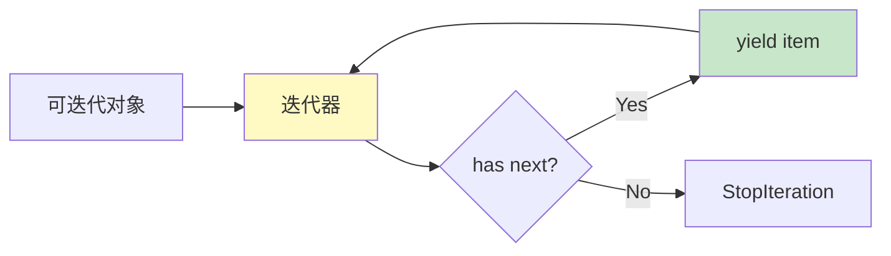

# L11: 迭代器与生成器

> **课程编号**: L11  
> **所属阶段**: Stage 1 - Python 进阶  
> **预计时长**: 6 小时  
> **难度**: ⭐⭐⭐☆☆（中级）  
> **前置课程**: L10 类型系统  
> **版本**: v1.0
> **最后更新**: 2026-08-07
> **学习目标**: 掌握 yield、惰性求值、迭代器协议、itertools 高效操作

---

## 🎯 学习目标

完成本课程后，你将能够：

1. ✅ 理解生成器的惰性求值特性
2. ✅ 掌握生成器函数与生成器表达式
3. ✅ 实现自定义迭代器
4. ✅ 使用 itertools 模块处理复杂迭代场景
5. ✅ 构建数据处理管道
6. ✅ 比较生成器与列表的内存效率差异

> 📖 **L12 预告**：`yield from` 委托和 `send()` 双向通信将在 L12 详细学习。

---

## 📚 核心内容

### Part 1: 为什么需要生成器？

#### 1.1 内存效率问题

```python
# ❌ 列表：一次性加载所有数据到内存
def get_all_numbers(n: int) -> list[int]:
    """生成 0 到 n-1 的所有数字"""
    return [i for i in range(n)]

numbers = get_all_numbers(10_000_000)  # 占用大量内存！
for num in numbers:
    print(num)

# ✅ 生成器：按需生成，内存占用极小
def get_numbers(n: int):
    """生成 0 到 n-1 的数字（惰性）"""
    for i in range(n):
        yield i

numbers = get_numbers(10_000_000)  # 几乎不占内存
for num in numbers:
    print(num)
```

**内存对比**:
- 列表方式：~400MB
- 生成器方式：~100 bytes

---

### Part 2: 生成器基础

#### 2.1 生成器函数

```python
def count_up_to(n: int):
    """从 1 数到 n"""
    i = 1
    while i <= n:
        yield i  # 暂停并返回值
        i += 1

# 调用生成器函数返回生成器对象
counter = count_up_to(5)

# 使用 next() 手动迭代
print(next(counter))  # 1
print(next(counter))  # 2
print(next(counter))  # 3

# 或使用 for 循环自动迭代
for num in count_up_to(5):
    print(num)  # 1, 2, 3, 4, 5
```

#### 2.2 yield 的工作原理

```python
def simple_generator():
    print("开始")
    yield 1
    print("继续")
    yield 2
    print("结束")
    yield 3

gen = simple_generator()

print(next(gen))  # 输出: 开始 \n 1
print(next(gen))  # 输出: 继续 \n 2
print(next(gen))  # 输出: 结束 \n 3
print(next(gen))  # 抛出 StopIteration
```

**关键点**:
- `yield` 暂停函数执行并返回值
- 下次调用 `next()` 从暂停处继续
- 函数结束时自动抛出 `StopIteration`

---

### Part 3: 生成器表达式

#### 3.1 语法对比

```python
# 列表推导式
numbers_list = [x * 2 for x in range(10)]  # 立即计算，占内存

# 生成器表达式
numbers_gen = (x * 2 for x in range(10))  # 惰性计算，不占内存

# 使用方式相同
for num in numbers_gen:
    print(num)
```

#### 3.2 何时使用生成器表达式

```python
# ✅ 适合：只遍历一次，数据量大
total = sum(x * x for x in range(1_000_000))

# ✅ 适合：链式操作
result = sum(
    x * 2
    for x in range(1000)
    if x % 3 == 0
)

# ❌ 不适合：需要多次遍历或随机访问
gen = (x for x in range(10))
print(len(gen))  # TypeError: object has no len()
print(gen[5])    # TypeError: not subscriptable
```

---

### Part 4: 迭代器协议

#### 4.1 什么是迭代器？

迭代器是实现了以下两个方法的对象：
1. `__iter__()`: 返回迭代器对象自身
2. `__next__()`: 返回下一个值，结束时抛出 `StopIteration`

#### 4.2 自定义迭代器

```python
class CountDown:
    """倒计时迭代器"""

    def __init__(self, start: int) -> None:
        self.current = start

    def __iter__(self):
        """返回迭代器对象（自己）"""
        return self

    def __next__(self) -> int:
        """返回下一个值"""
        if self.current <= 0:
            raise StopIteration

        value = self.current
        self.current -= 1
        return value

# 使用自定义迭代器
for num in CountDown(5):
    print(num)  # 5, 4, 3, 2, 1
```

#### 4.3 生成器是迭代器

```python
def countdown(start: int):
    """倒计时生成器（更简洁）"""
    while start > 0:
        yield start
        start -= 1

# 生成器自动实现迭代器协议
gen = countdown(5)
print(iter(gen) is gen)  # True - 迭代器就是自己
print(next(gen))  # 5
```

---

### Part 5: 实战案例：文件处理

#### 5.1 读取大文件

```python
# ❌ 错误：一次性加载整个文件到内存
def read_large_file_wrong(filename: str) -> list[str]:
    with open(filename) as f:
        return f.readlines()  # 可能导致内存溢出

lines = read_large_file_wrong("huge.log")  # 危险！
for line in lines:
    process(line)

# ✅ 正确：使用生成器逐行读取
def read_large_file(filename: str):
    """逐行读取文件（惰性）"""
    with open(filename) as f:
        for line in f:
            yield line.strip()

for line in read_large_file("huge.log"):
    process(line)  # 内存占用恒定
```

#### 5.2 数据处理管道

```python
def read_lines(filename: str):
    """读取文件行"""
    with open(filename) as f:
        for line in f:
            yield line.strip()

def filter_comments(lines):
    """过滤注释行"""
    for line in lines:
        if not line.startswith('#'):
            yield line

def parse_data(lines):
    """解析数据"""
    for line in lines:
        parts = line.split(',')
        yield {
            'name': parts[0],
            'score': int(parts[1])
        }

# 组合管道（惰性执行）
pipeline = parse_data(
    filter_comments(
        read_lines("data.csv")
    )
)

# 只有在迭代时才真正执行
for record in pipeline:
    print(record)
```

---

### Part 6: itertools 模块

#### 6.1 无限迭代器

```python
import itertools

# count: 无限计数
for i in itertools.count(10, step=2):
    print(i)  # 10, 12, 14, 16, ...
    if i > 20:
        break

# cycle: 无限循环
colors = itertools.cycle(['red', 'green', 'blue'])
for _ in range(5):
    print(next(colors))  # red, green, blue, red, green

# repeat: 重复元素
for x in itertools.repeat('hello', 3):
    print(x)  # hello, hello, hello
```

#### 6.2 组合迭代器

```python
# chain: 连接多个迭代器
list1 = [1, 2, 3]
list2 = [4, 5, 6]
for x in itertools.chain(list1, list2):
    print(x)  # 1, 2, 3, 4, 5, 6

# zip_longest: 长度不等时填充
for x, y in itertools.zip_longest([1, 2], ['a', 'b', 'c'], fillvalue=0):
    print(x, y)  # (1, 'a'), (2, 'b'), (0, 'c')

# islice: 切片迭代器
for x in itertools.islice(range(100), 5, 10):
    print(x)  # 5, 6, 7, 8, 9
```

#### 6.3 排列组合

```python
# product: 笛卡尔积
for a, b in itertools.product([1, 2], ['a', 'b']):
    print(a, b)  # (1, 'a'), (1, 'b'), (2, 'a'), (2, 'b')

# permutations: 排列
for perm in itertools.permutations([1, 2, 3], 2):
    print(perm)  # (1, 2), (1, 3), (2, 1), (2, 3), (3, 1), (3, 2)

# combinations: 组合
for comb in itertools.combinations([1, 2, 3], 2):
    print(comb)  # (1, 2), (1, 3), (2, 3)
```

---

### Part 7: 生成器 vs 协程（预习）

> 📖 **L12 将学到**：`yield from` 和 `send()` 是协程的基础，将在 L12 详细学习。

```python
# L12 预习：yield from 委托
# def read_multiple_files(filenames):
#     for filename in filenames:
#         yield from read_lines(filename)  # L12 才学

# L12 预习：send() 双向通信
# def echo_generator():
#     while True:
#         value = yield
#         print(f"Received: {value}")
```

---

### Part 8: 性能对比

#### 8.1 内存使用对比

```python
import sys

# 列表
numbers_list = [x for x in range(1_000_000)]
print(f"列表大小: {sys.getsizeof(numbers_list)} bytes")
# 输出: 列表大小: 8000056 bytes (~8MB)

# 生成器
numbers_gen = (x for x in range(1_000_000))
print(f"生成器大小: {sys.getsizeof(numbers_gen)} bytes")
# 输出: 生成器大小: 112 bytes
```

#### 8.2 执行速度对比

```python
import time

# 列表推导式
start = time.time()
numbers = [x * 2 for x in range(10_000_000)]
sum(numbers)
print(f"列表时间: {time.time() - start:.2f}s")

# 生成器表达式
start = time.time()
numbers = (x * 2 for x in range(10_000_000))
sum(numbers)
print(f"生成器时间: {time.time() - start:.2f}s")

# 结果：生成器通常更快且内存占用小
```

---


### Part 9: 生产级应用与框架集成

#### 9.1 在 FastAPI 中使用生成器

生成器在 Web 框架中用于流式响应和内存高效处理：

```python
import asyncio
from fastapi import FastAPI
from fastapi.responses import StreamingResponse

app = FastAPI()

async def generate_large_report():
    """生成大型报告（流式响应）"""
    for i in range(1, 10001):
        # 模拟数据库查询或 API 调用
        await asyncio.sleep(0.001)
        yield f"第 {i} 行数据\n"


@app.get("/report")
async def get_report():
    """流式下载大文件"""
    return StreamingResponse(
        generate_large_report(),
        media_type="text/plain",
        headers={"Content-Disposition": "attachment; filename=report.txt"}
    )
```

**流式响应的优势**：
- 无需等待整个文件生成完成
- 内存占用恒定（不随数据量增长）
- 用户可以立即开始接收数据

#### 9.2 数据库分页查询

```python
import asyncio

# 模拟数据库查询
async def fetch_batch(page: int, page_size: int) -> list[dict]:
    """分页获取数据"""
    await asyncio.sleep(0.1)  # 模拟数据库延迟
    start = page * page_size
    return [{"id": i, "name": f"用户{i}"} for i in range(start, start + page_size)]


async def paginate_query(total: int, page_size: int = 100):
    """分页生成器：高效处理大量数据
    
    L12 预习：yield from batch 等价于:
    for item in batch:
        yield item
    """
    page = 0
    while True:
        batch = await fetch_batch(page, page_size)
        if not batch:
            break
        # L12 将学到: yield from batch  # 逐个产出记录
        for item in batch:
            yield item
        page += 1


async def main():
    # 使用生成器逐个处理所有记录
    total_processed = 0
    async for record in paginate_query(total=1000, page_size=100):
        # 处理每条记录
        total_processed += 1
        if total_processed % 100 == 0:
            print(f"已处理 {total_processed} 条记录")

    print(f"总计处理: {total_processed} 条记录")

asyncio.run(main())
```

#### 9.3 数据验证管道

```python
from dataclasses import dataclass
from typing import Iterator

@dataclass
class User:
    id: int
    name: str
    email: str
    age: int


def validate_email(email: str) -> bool:
    """验证邮箱格式"""
    return "@" in email and "." in email.split("@")[1]


def validate_age(age: int) -> bool:
    """验证年龄范围"""
    return 0 < age < 150


def filter_users(users: Iterator[dict]) -> Iterator[User]:
    """数据验证与转换管道"""
    for user_dict in users:
        try:
            # 验证
            if not validate_email(user_dict["email"]):
                continue
            if not validate_age(user_dict["age"]):
                continue

            # 转换
            yield User(
                id=user_dict["id"],
                name=user_dict["name"],
                email=user_dict["email"],
                age=user_dict["age"]
            )
        except KeyError:
            continue  # 跳过缺失字段的记录


def read_jsonl(filename: str) -> Iterator[dict]:
    """读取 JSON Lines 文件（流式）"""
    with open(filename, "r") as f:
        for line in f:
            if line.strip():
                import json
                yield json.loads(line)


# 使用示例
def process_user_file(filename: str):
    """处理用户文件"""
    # 惰性读取 → 验证过滤 → 对象转换
    users = filter_users(read_jsonl(filename))

    # 仍然不执行任何操作（惰性）
    valid_users = list(users)  # 现在开始执行

    return valid_users
```

#### 9.4 生成器与缓存

```python
from functools import lru_cache
from typing import Iterator

# 注意：生成器不能直接缓存，但可以缓存其产出
@lru_cache(maxsize=1000)
def expensive_computation(n: int) -> int:
    """昂贵的计算（结果可缓存）"""
    return n * n * n


def cached_generator(items: list[int]) -> Iterator[int]:
    """使用缓存的生成器"""
    for item in items:
        yield expensive_computation(item)


# 另一种模式：记忆化生成器
class MemoizedGenerator:
    """记忆化生成器：缓存已产生的值"""

    def __init__(self, source: Iterator):
        self.source = source
        self.cache = []
        self.index = 0

    def __iter__(self):
        return self

    def __next__(self):
        if self.index < len(self.cache):
            # 返回缓存的值
            value = self.cache[self.index]
            self.index += 1
            return value
        else:
            # 获取新值并缓存
            value = next(self.source)
            self.cache.append(value)
            self.index += 1
            return value


def fibonacci():
    """斐波那契数列生成器"""
    a, b = 0, 1
    while True:
        yield a
        a, b = b, a + b


# 使用记忆化
memo_fib = MemoizedGenerator(fibonacci())
print(next(memo_fib))  # 0
print(next(memo_fib))  # 1
print(next(memo_fib))  # 1
print(next(memo_fib))  # 2
print(next(memo_fib))  # 3
# 可以多次遍历同一生成器
memo_fib.index = 0  # 重置索引
print(next(memo_fib))  # 0（从缓存获取）
```

#### 9.5 生成器与上下文管理器

```python
from contextlib import contextmanager
from typing import Iterator

@contextmanager
def open_logged(filename: str) -> Iterator[list[str]]:
    """带日志的上下文管理器"""
    lines: list[str] = []
    print(f"打开文件: {filename}")
    try:
        with open(filename, "r") as f:
            for line in f:
                lines.append(line.strip())
                yield lines
    finally:
        print(f"关闭文件: {filename}")
        print(f"共读取 {len(lines)} 行")


# 使用生成器式上下文管理器
with open_logged("example.txt") as lines:
    for line in lines:
        print(line)
    # 在 with 块内，可以继续向 lines 添加内容
    # 这对于实时日志监控很有用
```

#### 9.6 生成器调试技巧

```python
import logging
from typing import TypeVar, Generator

T = TypeVar("T")

def debug_generator(
    source: Generator[T, None, None],
    name: str = "Generator"
) -> Generator[T, None, None]:
    """调试生成器：记录每次 yield 的值"""
    for value in source:
        logging.debug(f"[{name}] yielding: {value}")
        yield value


def traced_generator(
    source: Generator[T, None, None],
    name: str = "Generator"
) -> Generator[T, None, None]:
    """跟踪生成器：记录执行状态"""
    count = 0
    try:
        for value in source:
            count += 1
            print(f"[{name}] #{count}: {value}")
            yield value
    except Exception as e:
        print(f"[{name}] 在第 {count} 个值时异常: {e}")
        raise


# 使用示例
def numbers():
    for i in range(5):
        if i == 2:
            raise ValueError("测试异常")
        yield i

# 普通使用：异常信息不清晰
# for n in numbers():
#     print(n)

# 调试使用：清晰定位问题
for n in traced_generator(numbers(), "数字生成器"):
    print(f"处理数字: {n}")
# 输出:
# [数字生成器] #1: 0
# 处理数字: 0
# [数字生成器] #2: 1
# 处理数字: 1
# [数字生成器] 在第 2 个值时异常: 测试异常
```

#### 9.7 生成器与异步编程

```python
import asyncio

async def async_range(start: int, stop: int, step: int = 1):
    """异步生成器：异步迭代"""
    current = start
    while current < stop:
        await asyncio.sleep(0.01)  # 模拟异步操作
        yield current
        current += step


async def main():
    # 使用 async for 迭代异步生成器
    async for i in async_range(0, 10):
        print(f"异步值: {i}")

    # 或者用 gather 并发执行多个异步生成器
    results = await asyncio.gather(
        *[i async for i in async_range(n, n+3)]
        for n in [0, 10, 20]
    )
    print(f"聚合结果: {results}")


asyncio.run(main())
```

#### 9.8 生成器模式总结

| 模式 | 说明 | 适用场景 |
|------|------|----------|
| **惰性求值** | 按需生成值 | 大数据集、无限序列 |
| **管道模式** | 组合多个生成器 | 数据处理 ETL |
| **生产者-消费者** | 异步协作 | 并发处理 |
| **记忆化** | 缓存已生成的值 | 重复遍历 |
| **调试包装** | 添加日志和追踪 | 开发调试 |
| **异步生成器** | 支持 async/await | 异步 I/O |

### Part 10: 常见问题与解决方案

#### 10.1 生成器耗尽问题

```python
# ❌ 常见错误：遍历后再次使用
def count_to_3():
    for i in range(1, 4):
        yield i

counter = count_to_3()
print(list(counter))  # [1, 2, 3]
print(list(counter))  # [] ← 空！因为生成器已耗尽

# ✅ 正确做法：每次需要时创建新生成器
def count_to_3():
    for i in range(1, 4):
        yield i

def process_three_times():
    for _ in range(3):
        # L12 预习：yield from 等价于展平嵌套循环
        # yield from count_to_3()
        for i in count_to_3():
            yield i

print(list(process_three_times()))  # [1, 2, 3, 1, 2, 3, 1, 2, 3]

# ✅ 或者使用记忆化生成器
class ReusableGenerator:
    def __init__(self, generator_func, *args, **kwargs):
        self.generator_func = generator_func
        self.args = args
        self.kwargs = kwargs

    def __iter__(self):
        return self.generator_func(*self.args, **self.kwargs)
```

#### 10.2 生成器中的异常处理

```python
def safe_generator():
    """安全生成器：正确处理异常"""
    data = [1, 2, "invalid", 4, 5]

    for item in data:
        try:
            yield item * 2
        except TypeError:
            # 跳过无效数据，记录日志
            print(f"跳过无效数据: {item}")
            continue

    # 或者在生成结束时执行清理
    try:
        yield "处理完成"
    finally:
        print("生成器结束，清理资源")


def generator_with_cleanup():
    """带清理的生成器"""
    resources = []

    try:
        for i in range(10):
            resources.append(f"resource_{i}")
            yield i
    finally:
        # 生成器结束时自动执行清理
        print(f"清理 {len(resources)} 个资源")
        resources.clear()
```

#### 10.3 生成器与类型注解

```python
from typing import Generator, Iterator, TypeVar, Callable

T = TypeVar("T")
U = TypeVar("U")


# 正确的类型注解
def square_numbers(n: int) -> Generator[int, None, None]:
    """生成平方数"""
    for i in range(n):
        yield i * i


def transform(
    items: Iterator[T],
    func: Callable[[T], U]
) -> Generator[U, None, None]:
    """转换生成器"""
    for item in items:
        yield func(item)


# 带发送值的生成器类型
def echo_with_counter() -> Generator[int, int, str]:
    """
    类型注解详解:
    - int: yield 的值类型
    - int: send() 接收的值类型
    - str: return 的值类型
    """
    count = 0
    while True:
        value = yield count
        count += 1
        if value is None:
            break
    return f"共处理了 {count} 个值"


gen = echo_with_counter()
next(gen)  # 启动
for i in range(5):
    print(gen.send(i))
try:
    gen.send(None)  # 触发 return
except StopIteration as e:
    print(e.value)  # 共处理了 5 个值
```


## 🚀 快速开始

从仓库根目录进入本课：

```bash
cd stage1-python-intermediate/lessons/L11-generators
```

### 1. 运行示例代码

```bash
# 生成器基础与 itertools
python examples/01_generator_basics.py
python examples/02_itertools.py
```

### 2. 完成练习题

```bash
python exercises/01_iterator_protocol.py
python exercises/02_generator_exercises.py
python exercises/03_itertools_exercises.py
```

---

## 📝 练习题

### 练习 1: 手写迭代器协议

在 `exercises/01_iterator_protocol.py` 中实现：

1. `Counter(max_val)`：从 1 计数到 `max_val`。
2. `Fibonacci(count)`：生成指定数量的斐波那契数。
3. `Range(start, stop, step)`：模拟内置 `range()` 的正向迭代。

重点检查：`__iter__()` 应返回自身，`__next__()` 应在结束时抛出 `StopIteration`。

### 练习 2: 生成器函数

在 `exercises/02_generator_exercises.py` 中使用 `yield` 实现：

1. `count_up(n)`：从 1 数到 n。
2. `squares(n)`：生成前 n 个非负整数平方。
3. `chain(*iterables)`：串联多个可迭代对象。
4. `chunked(iterable, size)`：按大小分块。
5. `flatten(nested)`：展平嵌套列表。

### 练习 3: itertools 实战

在 `exercises/03_itertools_exercises.py` 中练习：

1. `first_n()` / `take_while()`：截断迭代器。
2. `group_by_key()`：先排序再分组。
3. `sliding_window()`：生成固定宽度窗口。
4. `powerset()`：生成所有子集。

---

## 📝 本章总结

### 核心知识点

1. **生成器函数（Generator Function）**
   - 使用 `yield` 关键字代替 `return`
   - 惰性计算：需要时才生成值
   - 自动实现迭代器协议
   - 函数状态在 yield 处暂停和恢复

2. **生成器表达式（Generator Expression）**
   - 语法：`(x * 2 for x in range(10))`
   - 类似列表推导式但使用 `()` 而非 `[]`
   - 内存高效：不会一次性生成所有元素
   - 适合链式操作和管道处理

3. **迭代器协议（Iterator Protocol）**
   - `__iter__()`: 返回迭代器对象自身
   - `__next__()`: 返回下一个值，结束时抛出 `StopIteration`
   - 所有生成器都是迭代器
   - 迭代器只能遍历一次

4. **itertools 模块**
   - 无限迭代器：`count()`, `cycle()`, `repeat()`
   - 终止迭代器：`chain()`, `compress()`, `islice()`
   - 组合迭代器：`product()`, `permutations()`, `combinations()`

### 关键要点

- ✅ 生成器比列表内存效率高，适合处理大数据
- ✅ `yield` 保存函数状态，下次调用从断点继续
- ✅ 生成器是"一次性的"，遍历后需要重新创建
- ✅ 使用 `next()` 手动迭代，或用 `for` 循环自动迭代
- ✅ 生成器适合数据流处理和管道操作

### 常见陷阱

- ❌ 尝试对生成器使用 `len()` 或索引访问
- ❌ 多次遍历同一个生成器（需要重新创建）
- ❌ 在生成器中使用 `return` 返回值（应使用 `yield`）
- ❌ 忘记生成器是惰性的，不会立即执行
- ❌ 在需要多次访问数据时使用生成器（应转为列表）

### 实用技巧

- 💡 组合多个小生成器构建数据管道
- 💡 使用 `itertools.islice()` 限制生成器输出
- 💡 使用 `itertools.tee()` 创建生成器的多个副本
- 💡 用生成器替代列表推导式处理大文件
- 💡 L12 将学到：`yield from` 委托简化嵌套循环

### 典型应用场景

- 📂 读取大文件（逐行处理，不加载全部到内存）
- 🔢 无限序列（斐波那契数列、质数生成）
- 🔄 数据管道（过滤 → 转换 → 聚合）
- 📊 分批处理（数据库分页查询）

---

## 💭 课堂思考

1. **惰性求值的权衡**：生成器的惰性求值可以处理无限序列，但为什么 `list(fibonacci())` 会导致内存耗尽？思考一下，在什么场景下应该用生成器，在什么场景下应该用列表。

2. **生成器 vs 迭代器**：Python 中"生成器"和"迭代器"是同一个东西吗？它们的区别和联系是什么？

3. **itertools 的设计哲学**：`itertools` 遵循什么原则使它能够高效处理大数据？`islice` 和普通切片 `list[:5]` 的本质区别是什么？

---

## 📚 参考资料

- [Python 迭代器文档](https://docs.python.org/zh-cn/3/library/stdtypes.html#iterator-types)
- [itertools 模块文档](https://docs.python.org/zh-cn/3/library/itertools.html)
- [生成器详解](https://docs.python.org/zh-cn/3/howto/functional.html#generators)

---

## 📁 文件导航

| 目录       | 说明         |
| ---------- | ------------ |
| examples/  | 示例代码     |
| exercises/ | 练习题       |
| solutions/ | 参考答案     |
| tests/     | 单元测试     |
| lesson.md  | 详细教学内容 |

---

## ✅ 完成标准

- [ ] 完成所有练习题（3 个）
- [ ] 理解生成器的惰性求值机制
- [ ] 掌握迭代器协议
- [ ] 熟练使用 itertools 模块
- [ ] 能够构建数据处理管道
- [ ] 本课测试通过：`uv run pytest stage1-python-intermediate/lessons/L11-generators/tests -q`

---


## 💡 常见陷阱

### 陷阱 1: 生成器只能遍历一次

```python
# ❌ 误解：生成器可以重复使用
gen = (x**2 for x in range(5))
print(list(gen))  # [0, 1, 4, 9, 16]
print(list(gen))  # [] 再次遍历得到空结果

# ✅ 正确做法：每次需要时创建新生成器
```

### 陷阱 2: 在生成器中修改外部状态

```python
# ❌ 副作用导致难以调试
counter = 0
def bad_gen():
    global counter
    while counter < 5:
        counter += 1
        yield counter

# ✅ 正确做法：使用参数传递状态
```



## 🔗 下一步

完成本课程后，继续学习：

- [L12: Python 高级特性](../L12-advanced-features/lesson.md)
- [L13: 描述符与属性](../L13-descriptors/lesson.md)

---

**课程整合说明**: 本课程合并了原 L13（生成器）和 L13（迭代器），提供了完整的惰性求值和迭代器协议指南。学习时长约 6 小时，涵盖从基础生成器到高级 itertools 的完整知识体系。
