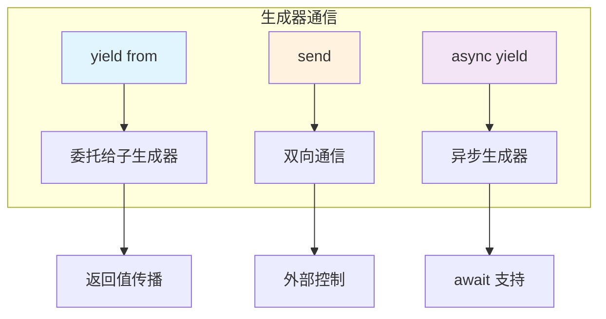

# L12: 生成器进阶

> **课程编号**: L12  
> **所属阶段**: Stage 1 - Python 进阶  
> **预计时长**: 4 小时  
> **难度**: ⭐⭐⭐☆☆（中级进阶）  
> **前置课程**: L11 迭代器与生成器  
> **学习目标**: 掌握 yield from、send() 双向通信、异步生成器

---

## 🎯 学习目标

完成本课程后，你将能够：

1. ✅ 理解 `yield from` 委托机制
2. ✅ 掌握生成器的双向通信（`send()` 方法）
3. ✅ 实现异步生成器
4. ✅ 构建复杂的数据处理管道
5. ✅ 使用生成器模式解决实际问题

---

## 📚 核心内容

### Part 1: yield from 委托

#### 1.1 为什么需要 yield from？

`yield from` 允许一个生成器委托给另一个生成器，简化嵌套循环：

```python
# ❌ 传统方式：嵌套循环
def chain_without_yield_from(*iterables):
    """串联多个可迭代对象"""
    result = []
    for iterable in iterables:
        for item in iterable:
            result.append(item)
    return result

# ✅ 使用 yield from：更简洁
def chain_with_yield_from(*iterables):
    """串联多个可迭代对象"""
    for iterable in iterables:
        yield from iterable

# 测试
print(list(chain_with_yield_from([1, 2], [3, 4], [5, 6])))
# [1, 2, 3, 4, 5, 6]
```

#### 1.2 yield from 的工作原理

```python
def gen_a():
    yield 1
    yield 2

def gen_b():
    yield 3
    yield 4

def delegated_generator():
    """委托给其他生成器"""
    yield from gen_a()  # 委托给 gen_a
    yield from gen_b()  # 委托给 gen_b

# 等价于：
def equivalent_generator():
    for item in gen_a():
        yield item
    for item in gen_b():
        yield item

# 测试
print(list(delegated_generator()))
# [1, 2, 3, 4]
```

#### 1.3 yield from 与异常传播

`yield from` 会自动传播 `StopIteration` 异常和 `return` 值：

```python
def inner():
    yield 1
    yield 2
    return "done"

def outer():
    result = yield from inner()
    print(f"inner 返回: {result}")
    yield result

# 使用
gen = outer()
print(next(gen))  # 1
print(next(gen))  # 2
print(next(gen))  # 打印 "inner 返回: done"，yield 3
print(next(gen))  # StopIteration
```

#### 1.4 yield from 实战：递归生成器

```python
def flatten(nested):
    """展平嵌套列表"""
    for item in nested:
        if isinstance(item, list):
            yield from flatten(item)  # 递归展平
        else:
            yield item

# 测试
nested = [1, [2, 3], [4, [5, [6]]]]
print(list(flatten(nested)))
# [1, 2, 3, 4, 5, 6]
```

---

### Part 2: send() 双向通信

#### 2.1 初识 send()

`send()` 允许向生成器发送值，同时恢复生成器执行：

```python
def echo():
    """回显生成器"""
    while True:
        value = yield  # 接收 send() 发送的值
        print(f"Received: {value}")

gen = echo()
next(gen)  # 启动生成器（必须先调用一次 next）

gen.send("Hello")  # 发送值
gen.send("World")  # 继续发送

# 输出:
# Received: Hello
# Received: World
```

#### 2.2 send() 的初始化

生成器必须先调用 `next()` 或 `send(None)` 启动：

```python
def counter():
    count = 0
    while True:
        value = yield count
        if value is not None:
            count = value
        else:
            count += 1

gen = counter()

# ❌ 错误：直接 send
# gen.send(10)  # TypeError: can't send non-None values to just started generator

# ✅ 正确：先启动
next(gen)  # 或 gen.send(None)
gen.send(10)  # 设置计数器为 10
print(next(gen))  # 11
print(next(gen))  # 12
```

#### 2.3 send() 实战：协程

```python
def average():
    """计算移动平均值的协程"""
    total = 0
    count = 0
    average = None

    while True:
        value = yield average
        total += value
        count += 1
        average = total / count

# 使用
gen = average()
next(gen)  # 启动

print(gen.send(10))  # 10.0
print(gen.send(20))  # 15.0
print(gen.send(30))  # 20.0
```

#### 2.4 send() 实战：有限状态机

```python
def state_machine():
    """简单状态机"""
    state = "initial"
    while True:
        event = yield state

        if state == "initial":
            if event == "start":
                state = "running"
        elif state == "running":
            if event == "pause":
                state = "paused"
            elif event == "stop":
                state = "stopped"
        elif state == "paused":
            if event == "resume":
                state = "running"
            elif event == "stop":
                state = "stopped"

# 使用
sm = state_machine()
print(next(sm))    # initial

print(sm.send("start"))    # running
print(sm.send("pause"))   # paused
print(sm.send("resume"))  # running
print(sm.send("stop"))    # stopped
```

---

### Part 3: 异步生成器

#### 3.1 什么是异步生成器？

异步生成器是使用 `async def` 定义的生成器，使用 `yield` 产出值：

```python
import asyncio

async def async_count(n: int):
    """异步计数器"""
    for i in range(n):
        await asyncio.sleep(0.1)  # 模拟异步操作
        yield i

async def main():
    async for i in async_count(5):
        print(f"Count: {i}")

asyncio.run(main())
# 输出:
# Count: 0
# Count: 1
# Count: 2
# Count: 3
# Count: 4
```

#### 3.2 异步生成器 vs 普通生成器

```python
import asyncio

# 普通生成器
def sync_range(n):
    for i in range(n):
        yield i

# 异步生成器
async def async_range(n):
    for i in range(n):
        await asyncio.sleep(0.01)
        yield i

async def main():
    # 普通生成器：不能使用 await
    for i in sync_range(3):
        print(f"Sync: {i}")

    # 异步生成器：可以使用 await
    async for i in async_range(3):
        print(f"Async: {i}")

asyncio.run(main())
```

#### 3.3 异步生成器与 asyncio.gather

```python
import asyncio

async def fetch_page(url: str):
    """模拟获取页面"""
    await asyncio.sleep(0.1)
    return f"Content from {url}"

async def async_url_generator():
    """异步 URL 生成器"""
    urls = ["a.com", "b.com", "c.com"]
    for url in urls:
        yield url

async def main():
    # 并发获取所有页面
    async for url in async_url_generator():
        result = await fetch_page(url)
        print(result)

    # 或使用 gather
    async def collect_results():
        results = []
        async for url in async_url_generator():
            result = await fetch_page(url)
            results.append(result)
        return results

    all_results = await collect_results()
    print(f"All: {all_results}")
```

---

### Part 4: 生成器管道模式

#### 4.1 构建数据处理管道

```python
def source(n: int):
    """数据源"""
    for i in range(n):
        yield i

def filter_even(numbers):
    """过滤偶数"""
    for n in numbers:
        if n % 2 == 1:
            yield n

def square(numbers):
    """平方"""
    for n in numbers:
        yield n * n

def take(n: int, numbers):
    """取前 n 个"""
    for i, n in enumerate(numbers):
        if i >= n:
            break
        yield n

# 构建管道
pipeline = take(
    5,
    square(
        filter_even(
            source(20)
        )
    )
)

print(list(pipeline))
# [1, 9, 25, 49, 81]
```

#### 4.2 生成器管道最佳实践

```python
from typing import Iterator, TypeVar

T = TypeVar("T")
U = TypeVar("U")

def pipe(
    *functions
) -> Iterator[T]:
    """函数组合"""
    def chained(input_iter: Iterator[T]) -> Iterator[U]:
        result = input_iter
        for func in functions:
            result = func(result)
        return result
    return chained

# 使用
result = pipe(
    lambda x: filter_even(x),
    lambda x: square(x),
    lambda x: take(5, x)
)(source(20))

print(list(result))
```

---

## 🚀 快速开始

```bash
cd stage1-python-intermediate/lessons/L12-generator-advanced
python examples/01_yield_from.py
python examples/02_send.py
python examples/03_async_generator.py
```

---

## 📝 练习题

### 练习 1: yield from 实现

使用 `yield from` 实现：
1. `flatten()` - 展平任意嵌套列表
2. `traverse_tree()` - 遍历二叉树
3. `merge_sorted()` - 合并多个有序列表

### 练习 2: send() 实现协程

使用 `send()` 实现：
1. `bank_account()` - 银行账户（存款/取款）
2. `rate_limiter()` - 速率限制器
3. `pipeline_stage()` - 管道处理阶段

### 练习 3: 异步生成器

实现：
1. `async_file_reader()` - 异步读取大文件
2. `async_batch_processor()` - 批量异步处理

---

## 📝 总结

| 主题 | 关键点 |
|------|--------|
| **yield from** | 委托给子生成器，自动传播异常和返回值 |
| **send()** | 向生成器发送值，实现双向通信 |
| **异步生成器** | `async def` + `yield`，支持 `await` |
| **管道模式** | 组合多个生成器，构建数据处理流 |

---

## 💭 课堂思考

### 思考 1: 生成器 vs 列表

**问题**：为什么在处理大数据时，生成器比列表更高效？

**引导思考**：
- 内存占用差异
- 惰性求值 vs 即时求值
- 适用场景对比

**对比示例**：

```python
# 列表：一次性加载全部到内存
def squares_list(n):
    return [x**2 for x in range(n)]

# 生成器：按需产生值
def squares_gen(n):
    for x in range(n):
        yield x**2
```

---

### 思考 2: yield from 的应用场景

**问题**：在什么情况下应该使用 `yield from` 而不是简单的 `for` 循环？

**引导思考**：
- 委托的语义
- 异常传播
- 返回值的处理

---

## ✅ 完成标准

完成本课程后，你应该能够：

- [ ] 理解 `yield from` 的委托机制
- [ ] 使用 `send()` 实现生成器的双向通信
- [ ] 编写异步生成器函数
- [ ] 构建复杂的数据处理管道
- [ ] 选择合适的生成器模式解决实际问题

---


## 💡 常见陷阱

### 陷阱 1: yield from 忘记返回值传播

```python
# ❌ 误解：yield from 不传播返回值
def outer():
    result = yield from inner()
    return result  # 这里 result 是 inner 的返回值

# ✅ 正确：yield from 会把子生成器的 return 值传递给外层
```

### 陷阱 2: send() 首次调用必须传 None

```python
# ❌ 错误：首次调用 send() 不能传非 None 值
# gen = count_generator()
# gen.send(10)  # TypeError: can't send non-None value

# ✅ 正确：首次必须 send(None)
gen = count_generator()
gen.send(None)  # 启动生成器
gen.send(5)     # 现在可以发送值了
```



## 🔗 下一步

完成本课程后，继续学习：

- [L12: Python 高级特性（入门）](../L12-advanced-features/lesson.md)
- [L14: 并发编程入门](../L14-concurrency-intro/lesson.md)

**课程说明**: 本课程是 L11 的进阶补充，为学习 L14 异步编程和 L22 高阶流控打下基础。
