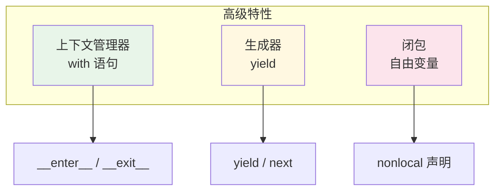

# L13: Python 高级特性

> **课程编号**: L13  
> **所属阶段**: Stage 1 - Python 进阶  
> **预计时长**: 9 小时  
> **难度**: ⭐⭐⭐⭐☆（中高级）  
> **前置课程**: L10 类型系统、L11 迭代器与生成器  
> **学习目标**: 掌握闭包、上下文管理器协议、异常进阶

---

## 🎯 学习目标

完成本课程后，你将能够：

1. ✅ 理解闭包的作用域规则和实际应用
2. ✅ 理解上下文管理器协议
3. ✅ 使用 `@contextmanager` 简化实现
4. ✅ 掌握异常链和自定义异常
5. ✅ 组合闭包与上下文管理器构建复杂功能

> 💡 **装饰器学习路径**: 装饰器基于闭包知识，将在 L14 装饰器进阶课程中系统学习。

---

## 📚 核心内容

### Part 1: 闭包（Closure）

#### 1.1 什么是闭包？

闭包是指**内层函数引用了外层函数的变量，并且外层函数返回了内层函数**。

```python
def outer(x):
    """外层函数"""
    def inner(y):
        """内层函数 - 引用了外层变量 x"""
        return x + y
    return inner  # 返回内层函数

# 创建闭包
add_5 = outer(5)  # x=5 被"捕获"
print(add_5(3))   # 输出: 8
print(add_5(10))  # 输出: 15
```

**关键点：**
- `inner` 函数访问了 `outer` 的变量 `x`
- `outer` 返回 `inner` 后，`x` 仍然存活
- 每次调用 `outer` 创建独立的闭包

---

#### 1.2 闭包的作用域规则

```python
def make_counter():
    count = 0  # 外层变量

    def increment():
        nonlocal count  # ✅ 声明修改外层变量
        count += 1
        return count

    return increment

counter1 = make_counter()
print(counter1())  # 1
print(counter1())  # 2

counter2 = make_counter()  # 独立的闭包
print(counter2())  # 1
```

**⚠️ 常见错误：忘记 `nonlocal`**

```python
def broken_counter():
    count = 0

    def increment():
        count += 1  # ❌ UnboundLocalError
        return count

    return increment
```

**原因：** Python 将 `count += 1` 视为局部变量赋值，但 `count` 未定义。

**解决：** 使用 `nonlocal count` 声明修改外层变量。

---

#### 1.3 闭包的实际应用

##### 应用1：函数工厂

```python
def make_multiplier(n):
    """创建乘法函数"""
    def multiply(x):
        return x * n
    return multiply

double = make_multiplier(2)
triple = make_multiplier(3)

print(double(5))  # 10
print(triple(5))  # 15
```

##### 应用2：延迟计算

```python
def make_averager():
    """计算平均值（累积）"""
    numbers = []

    def add(value):
        numbers.append(value)
        return sum(numbers) / len(numbers)

    return add

avg = make_averager()
print(avg(10))  # 10.0
print(avg(20))  # 15.0
print(avg(30))  # 20.0
```

##### 应用3：配置闭包

```python
def make_logger(prefix):
    """创建带前缀的日志函数"""
    def log(message):
        print(f"[{prefix}] {message}")
    return log

debug_log = make_logger("DEBUG")
info_log = make_logger("INFO")

debug_log("This is debug")  # [DEBUG] This is debug
info_log("This is info")    # [INFO] This is info
```

---

### Part 2: 上下文管理器基础

#### 2.1 什么是上下文管理器？

上下文管理器是一种**在进入代码块前执行 setup，在退出时执行 cleanup** 的协议。

```python
# 使用 with 语句
with open("file.txt", "r") as f:
    content = f.read()
# 文件自动关闭

# 等价于（但更安全）
f = open("file.txt", "r")
try:
    content = f.read()
finally:
    f.close()
```

---

#### 2.2 自定义上下文管理器

```python
class FileManager:
    """文件管理器（上下文管理器）"""

    def __init__(self, filename: str, mode: str):
        self.filename = filename
        self.mode = mode
        self.file = None

    def __enter__(self):
        """进入上下文时调用"""
        self.file = open(self.filename, self.mode)
        return self.file

    def __exit__(self, exc_type, exc_val, exc_tb):
        """退出上下文时调用"""
        if self.file:
            self.file.close()
        # 返回 True 可以抑制异常
        return False

# 使用
with FileManager("test.txt", "w") as f:
    f.write("Hello, World!")
# 文件自动关闭
```

---

#### 2.3 上下文管理器的异常处理

```python
class Transaction:
    """数据库事务上下文管理器"""

    def __init__(self, db):
        self.db = db
        self.success = False

    def __enter__(self):
        print("开始事务")
        return self

    def __exit__(self, exc_type, exc_val, exc_tb):
        if exc_type is None:
            # 没有异常，提交事务
            self.db.commit()
            print("事务已提交")
            self.success = True
        else:
            # 有异常，回滚事务
            self.db.rollback()
            print(f"事务已回滚: {exc_val}")
        return False  # 不抑制异常

# 使用
with Transaction(db) as tx:
    tx.db.execute("INSERT INTO ...")
    # 如果这里抛出异常，事务会自动回滚
```

---

### Part 3: contextmanager 装饰器

#### 3.1 使用 @contextmanager

```python
from contextlib import contextmanager

@contextmanager
def managed_resource(name: str):
    """资源管理器"""
    print(f"获取资源: {name}")
    resource = {"name": name, "data": []}
    try:
        yield resource  # 返回给 with 语句
    finally:
        print(f"释放资源: {name}")

# 使用
with managed_resource("database") as res:
    res["data"].append("item")
    print(f"使用中: {res}")

# 输出:
# 获取资源: database
# 使用中: {'name': 'database', 'data': ['item']}
# 释放资源: database
```

---

#### 3.2 组合装饰器与上下文管理器

```python
from contextlib import contextmanager
from functools import wraps

def logged(func):
    """日志装饰器"""
    @wraps(func)
    def wrapper(*args, **kwargs):
        print(f"调用 {func.__name__}")
        return func(*args, **kwargs)
    return wrapper

@contextmanager
def timer():
    """计时上下文管理器"""
    import time
    start = time.time()
    try:
        yield
    finally:
        print(f"耗时: {time.time() - start:.4f}s")

@logged
def process_data():
    with timer():
        # 模拟处理
        import time
        time.sleep(0.1)
    return "完成"

print(process_data())
```

---

### Part 4: 上下文管理器高级用法

#### 4.1 @contextmanager 异常处理

```python
from contextlib import contextmanager

@contextmanager
def transaction(db):
    """带异常处理的事务"""
    print("开始事务")
    try:
        yield db
        print("提交事务")
    except Exception as e:
        print(f"回滚事务: {e}")
        raise

# 使用
try:
    with transaction(db) as conn:
        conn.execute("INSERT ...")
        raise RuntimeError("模拟错误")
except RuntimeError as e:
    print(f"捕获异常: {e}")
```

#### 4.2 嵌套上下文管理器

```python
from contextlib import contextmanager

@contextmanager
def tag(name: str):
    print(f"<{name}>")
    yield
    print(f"</{name}>")

# 嵌套使用
with tag("html"):
    print("内容")
    with tag("body"):
        print("更多内容")

# 输出:
# <html>
# 内容
# <body>
# 更多内容
# </body>
# </html>
```

#### 4.3 资源限制模式

```python
from contextlib import contextmanager

@contextmanager
def rate_limit(calls: int, period: float):
    """速率限制上下文管理器（单线程版）"""
    import time
    calls_made: list[float] = []

    def is_allowed() -> bool:
        now = time.time()
        # 清理过期记录
        calls_made[:] = [t for t in calls_made if now - t < period]
        if len(calls_made) < calls:
            calls_made.append(now)
            return True
        return False

    yield is_allowed

# 使用
with rate_limit(calls=5, period=60) as allow:
    if allow():
        print("请求通过")
    else:
        print("请求被限流")
```

> 💡 **L11**：在多线程环境下，上述代码需要在 `is_allowed()` 中加锁保护 `calls_made` 列表。使用 `threading.Lock()` 可以确保线程安全。

---

## Part 5: 异常进阶

### 9.1 suppress 选择性忽略异常

```python
from contextlib import suppress

# 等价于 try/except-pass，但更简洁
with suppress(FileNotFoundError):
    os.remove("file.txt")

# 等价于:
try:
    os.remove("file.txt")
except FileNotFoundError:
    pass

# suppress 可以忽略多种异常
with suppress(FileNotFoundError, PermissionError):
    os.remove("file.txt")
```

### 9.2 ExitStack 组合多个上下文管理器

```python
from contextlib import ExitStack

# 需要打开多个文件，但数量不确定时
with ExitStack() as stack:
    files = []
    for filename in filenames:
        f = stack.enter_context(open(filename))
        files.append(f)
    # 所有文件在 with 块结束时自动关闭
    process_all(files)
```

### 9.3 redirect_stdout/stderr 重定向输出

```python
from contextlib import redirect_stdout, redirect_stderr
from io import StringIO

# 重定向 stdout 到 StringIO
buffer = StringIO()
with redirect_stdout(buffer):
    print("这条消息会写入 buffer")

print(buffer.getvalue())  # "这条消息会写入 buffer\n"

# 忽略错误输出
with redirect_stderr(null_device):
    dangerous_operation()
```

### 9.4 异常作为控制流（慎用）

```python
# 反模式：使用异常代替 if/else
class Registry:
    def get(self, key):
        try:
            return self._data[key]
        except KeyError:
            return self._default

# 推荐做法：显式检查
class Registry:
    def get(self, key, default=None):
        return self._data.get(key, default)
```

### 9.5 异常层次设计

```python
# 自定义异常层次结构
class AppError(Exception):
    """应用基础异常"""
    pass

class ValidationError(AppError):
    """验证错误"""
    pass

class AuthError(AppError):
    """认证错误"""
    pass

class TokenExpiredError(AuthError):
    """Token 过期"""
    pass

# 捕获时可以从具体到通用
try:
    authenticate(token)
except TokenExpiredError:
    refresh_and_retry()
except AuthError:
    redirect_to_login()
except AppError:
    show_generic_error()
```

### 9.6 traceback 完整处理

```python
import traceback
import sys

def log_exception(exc_type, exc_value, exc_tb):
    """格式化输出异常信息"""
    lines = traceback.format_exception(exc_type, exc_value, exc_tb)
    print("".join(lines), file=sys.stderr)

    # 或写入日志文件
    with open("error.log", "a") as f:
        f.writelines(lines)

sys.excepthook = log_exception
```

> 📖 **前置知识**: 本节内容基于 [L09 异常处理](../../../stage0-python-basics/lessons/L09-exceptions/lesson.md) 的基础异常处理知识。

---

## 🚀 快速开始

从仓库根目录进入本课：

```bash
cd stage1-python-intermediate/lessons/L13-advanced-features
```

### 1. 运行示例代码

```bash
# 闭包、装饰器和上下文管理器
python examples/01_closures_decorators.py
python examples/02_context_managers.py
```

### 2. 完成练习题

```bash
python exercises/01_decorators.py
python exercises/02_context_managers.py
```

---

## 📝 练习题

### 练习 1: 装饰器实战

在 `exercises/01_decorators.py` 中实现：

1. `log_calls`：打印函数调用与返回值。
2. `retry(times=3)`：失败时自动重试。
3. `memoize`：缓存相同参数的计算结果。
4. `validate_args(**validators)`：按参数名校验入参。

重点检查：装饰器应返回可调用的 wrapper，并使用 `functools.wraps` 保留原函数元数据。

### 练习 2: 上下文管理器实战

在 `exercises/02_context_managers.py` 中实现：

1. `Transaction`：正常退出提交，异常退出回滚。
2. `timer()`：使用 `@contextmanager` 记录耗时。
3. `redirect_stdout()`：临时捕获标准输出。
4. `LazyResource`：进入上下文时才初始化资源，退出时释放资源。

重点检查：`__exit__()` 返回 `False` 表示不抑制异常；`finally` 是资源清理的关键。

---

## 📝 本章总结

### 核心知识点

1. **闭包（Closure）**
   - 内层函数引用外层函数的变量
   - 外层函数返回内层函数
   - 变量在外层函数结束后仍然存活
   - 使用 `nonlocal` 修改外层变量

2. **装饰器基础**
   - 装饰器是接受函数并返回新函数的可调用对象
   - `@decorator` 语法等价于 `func = decorator(func)`
   - 装饰器在函数定义时执行（不是调用时）
   - 使用 `functools.wraps` 保留原函数元数据

3. **装饰器模式**
   - 无参装饰器：`@decorator`
   - 带参装饰器：`@decorator(arg)` （返回装饰器的函数）
   - 装饰器链：`@dec1 @dec2 func` 从下往上执行


4. **上下文管理器协议**
   - `__enter__()`: 进入时执行，返回对象给 `as` 子句
   - `__exit__()`: 退出时执行，异常处理
   - `@contextmanager`: 使用生成器简化实现
   - 资源清理、事务管理、限流等场景

### 关键要点

- ✅ 闭包捕获的是变量引用，不是值的拷贝
- ✅ 装饰器可以叠加使用，执行顺序从下往上
- ✅ 必须使用 `@functools.wraps` 保留原函数的 `__name__` 和 `__doc__`
- ✅ 装饰器可以修改参数、返回值或函数行为
- ✅ 类也可以作为装饰器（实现 `__call__` 方法）
- ✅ 上下文管理器确保资源正确释放（即使发生异常）

### 常见陷阱

- ❌ 忘记在装饰器内层函数中调用原函数
- ❌ 忘记使用 `@functools.wraps` 导致元数据丢失
- ❌ 在闭包中修改外层变量时忘记使用 `nonlocal`
- ❌ 混淆装饰器定义时和调用时的执行时机
- ❌ 带参装饰器忘记返回真正的装饰器函数
- ❌ 在 `@contextmanager` 中忘记 try-finally

### 实用技巧

- 💡 使用 `*args, **kwargs` 让装饰器适用于任意函数
- 💡 装饰器可以有副作用（如注册、验证）
- 💡 使用闭包实现简单的状态管理（如计数器）
- 💡 组合多个小装饰器而非创建复杂的单一装饰器
- 💡 使用 `@contextmanager` 简化上下文管理器实现
- 💡 上下文管理器可以嵌套使用

### 典型应用场景

- ⏱️ 性能监控和计时
- 📝 日志记录和调试
- 🔒 权限验证和访问控制
- 💾 结果缓存和记忆化
- 🔄 自动重试和错误处理
- 📊 函数调用统计
- 🗄️ 数据库事务管理
- 📁 文件资源管理
- 🚦 速率限制

---

## 💭 课堂思考

1. **闭包与面向对象**：Python 的闭包可以实现类似面向对象的状态封装。思考一下，闭包和类在实现"带状态的功能"时各有什么优缺点？

2. **装饰器的执行时机**：装饰器 `@my_decorator` 是在函数定义时执行还是函数调用时执行？为什么这个设计选择很重要？

3. **上下文管理器的异常语义**：`__exit__` 方法接收 `exc_type, exc_val, exc_tb` 三个参数。如果 `__exit__` 返回 `True`，会发生什么？返回 `False` 呢？

---

## 📚 参考资料

- [PEP 318 - Decorators](https://peps.python.org/pep-0318/)
- [PEP 343 - The 'with' Statement](https://peps.python.org/pep-0343/)
- [functools 模块文档](https://docs.python.org/zh-cn/3/library/functools.html)
- [contextlib 模块文档](https://docs.python.org/zh-cn/3/library/contextlib.html)

---

## 📁 文件导航

| 目录       | 说明         |
| ---------- | ------------ |
| examples/  | 示例代码     |
| exercises/ | 练习题       |
| solutions/ | 参考答案     |
| tests/     | 单元测试     |
| lesson.md  | 详细教学内容 |

---

## ✅ 完成标准

- [ ] 完成所有练习题（2 个）
- [ ] 理解闭包的作用域规则
- [ ] 掌握装饰器的实现和应用
- [ ] 理解上下文管理器协议
- [ ] 能够组合装饰器与上下文管理器
- [ ] 本课测试通过：`uv run pytest stage1-python-intermediate/lessons/L13-advanced-features/tests -q`

---


## 💡 常见陷阱

### 陷阱 1: 可变默认参数

```python
# ❌ 危险：默认参数在函数定义时创建
def bad_append(item, items=[]):
    items.append(item)
    return items

print(bad_append(1))  # [1]
print(bad_append(2))  # [1, 2] 累积了！

# ✅ 正确：使用 None
def good_append(item, items=None):
    if items is None:
        items = []
    items.append(item)
    return items
```

### 陷阱 2: 闭包变量捕获

```python
# ❌ 闭包晚期绑定
funcs = [lambda x: x*i for i in range(3)]
print(funcs[0](1))  # 2 而非 0

# ✅ 正确：使用默认参数捕获
funcs = [lambda x, i=i: x*i for i in range(3)]
print(funcs[0](1))  # 0
```



## 🔗 下一步

完成本课程后，继续学习：

- [L13: 描述符与属性](../L13-descriptors/lesson.md)
---

**课程整合说明**: 本课程合并了原 L14（闭包与装饰器）和 L15（上下文管理器深入），提供了完整的高级特性指南。学习时长约 9 小时，涵盖闭包、装饰器、上下文管理器的完整知识体系。
