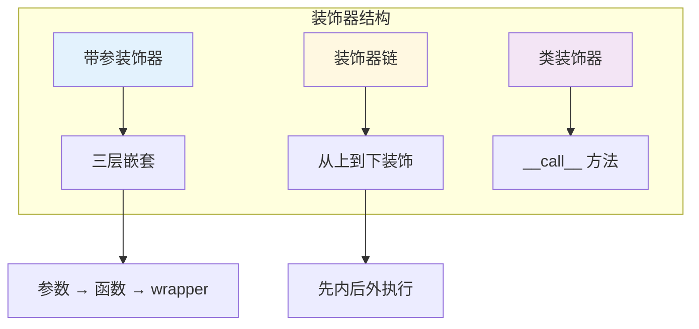

# L14: 装饰器进阶

> **课程编号**: L14  
> **所属阶段**: Stage 1 - Python 进阶  
> **预计时长**: 6 小时  
> **难度**: ⭐⭐⭐⭐☆（中高级）  
> **前置课程**: L13 Python 高级特性（入门）  
> **版本**: v1.0
> **最后更新**: 2026-08-07
> **学习目标**: 掌握带参装饰器、装饰器链、类装饰器初步

---

## 🎯 学习目标

完成本课程后，你将能够：

1. ✅ 实现带参数的装饰器（装饰器工厂）
2. ✅ 组合多个装饰器并理解执行顺序
3. ✅ 使用类实现装饰器
4. ✅ 装饰类（而非函数）
5. ✅ 编写可选参数的装饰器

---

## 📚 核心内容

### Part 1: 带参数的装饰器

#### 1.1 为什么需要带参装饰器？

```python
# ❌ 无参装饰器：功能固定
def simple_timer(func):
    @wraps(func)
    def wrapper(*args, **kwargs):
        start = time.time()
        result = func(*args, **kwargs)
        print(f"耗时: {time.time() - start:.4f}s")
        return result
    return wrapper

# ✅ 带参装饰器：可以配置行为
def timer(unit="s"):  # 可以指定时间单位
    def decorator(func):
        @wraps(func)
        def wrapper(*args, **kwargs):
            start = time.time()
            result = func(*args, **kwargs)
            elapsed = time.time() - start
            if unit == "ms":
                print(f"耗时: {elapsed * 1000:.4f}ms")
            else:
                print(f"耗时: {elapsed:.4f}s")
            return result
        return wrapper
    return decorator
```

#### 1.2 装饰器工厂模式

带参数的装饰器本质上是**返回装饰器的函数**：

```python
from functools import wraps

def retry(max_attempts=3, delay=1):
    """重试装饰器工厂"""
    def decorator(func):
        @wraps(func)
        def wrapper(*args, **kwargs):
            last_exception = None
            for attempt in range(1, max_attempts + 1):
                try:
                    return func(*args, **kwargs)
                except Exception as e:
                    last_exception = e
                    if attempt < max_attempts:
                        import time
                        print(f"第 {attempt} 次失败，重试中...")
                        time.sleep(delay)
            raise last_exception
        return wrapper
    return decorator

# 使用
@retry(max_attempts=3, delay=0.5)
def unreliable_api():
    import random
    if random.random() < 0.7:
        raise ConnectionError("Network error")
    return "Success"
```

#### 1.3 三层嵌套结构

带参装饰器需要三层嵌套：

```python
def decorator_with_params(param1, param2):
    """第1层：接收装饰器参数"""
    def decorator(func):
        """第2层：接收被装饰的函数"""
        @wraps(func)
        def wrapper(*args, **kwargs):
            """第3层：接收函数调用的参数"""
            # 使用 param1, param2
            # 调用 func
            return func(*args, **kwargs)
        return wrapper
    return decorator

@decorator_with_params("value1", "value2")
def my_function():
    pass

# 等价于
my_function = decorator_with_params("value1", "value2")(my_function)
```

#### 1.4 实战：缓存装饰器

```python
from functools import wraps
from typing import Any, Callable

def cache(max_size: int = 128, ttl: int = 3600):
    """缓存装饰器工厂

    Args:
        max_size: 缓存最大条目数
        ttl: 缓存有效期（秒）
    """
    def decorator(func: Callable) -> Callable:
        cache_store: dict[tuple, tuple[Any, float]] = {}
        # 注：简化实现，实际应处理过期

        @wraps(func)
        def wrapper(*args, **kwargs):
            # 创建缓存键
            key = (args, tuple(sorted(kwargs.items())))

            # 检查缓存
            if key in cache_store:
                result, _ = cache_store[key]
                return result

            # 执行函数
            result = func(*args, **kwargs)

            # 存入缓存
            if len(cache_store) >= max_size:
                # 简单的 FIFO 策略
                cache_store.pop(next(iter(cache_store)))
            cache_store[key] = (result, 0)  # 简化：忽略 ttl

            return result

        # 暴露缓存管理接口
        wrapper.cache_clear = lambda: cache_store.clear()
        wrapper.cache_info = lambda: {"size": len(cache_store), "max_size": max_size}

        return wrapper
    return decorator

# 使用
@cache(max_size=100)
def expensive_computation(n: int) -> int:
    return n * n * n

print(expensive_computation(10))
print(expensive_computation.cache_info())
```

---

### Part 2: 装饰器链与顺序

#### 2.1 多装饰器叠加

```python
def bold(func):
    @wraps(func)
    def wrapper(*args, **kwargs):
        return f"<b>{func(*args, **kwargs)}</b>"
    return wrapper

def italic(func):
    @wraps(func)
    def wrapper(*args, **kwargs):
        return f"<i>{func(*args, **kwargs)}</i>"
    return wrapper

@bold
@italic
def greet(name):
    return f"Hello, {name}!"

# 等价于:
# greet = bold(italic(greet))
```

#### 2.2 执行顺序

```
@g1
@g2
@g3
def func():
    pass

# 等价于: greet = g1(g2(g3(func)))
# 执行顺序: g3 -> g2 -> g1
# 返回顺序: g1 -> g2 -> g3
```

**图示**:
```
调用 greet()
    │
    ▼
┌─────────┐
│ wrapper1 (bold)  │  ← 最外层，先执行
│ ┌─────────────┐    │
│ │ wrapper2   │    │
│ │ ┌─────────┐ │    │
│ │ │wrapper3│ │    │
│ │ │┌───────┐│ │    │
│ │ ││ func()││ │    │  ← 最内层，最后执行
│ │ │└───────┘│ │    │
│ │ └─────────┘ │    │
│ └─────────────┘    │
└─────────┘
```

#### 2.3 常见陷阱

```python
# ❌ 装饰器顺序错误导致的问题
def add_header(func):
    @wraps(func)
    def wrapper(*args, **kwargs):
        return "<header>" + func(*args, **kwargs)
    return wrapper

def add_footer(func):
    @wraps(func)
    def wrapper(*args, **kwargs):
        return func(*args, **kwargs) + "<footer>"
    return wrapper

# @add_header 负责开头，@add_footer 负责结尾
@add_header
@add_footer
def page():
    return "Content"

print(page())  # <header>Content<footer>

# 如果顺序错误：
# @add_footer
# @add_header
# print(page())  # <header><footer>Content
```

#### 2.4 装饰器参数顺序

```python
def log(level):
    """日志装饰器"""
    def decorator(func):
        @wraps(func)
        def wrapper(*args, **kwargs):
            print(f"[{level}] 调用 {func.__name__}")
            return func(*args, **kwargs)
        return wrapper
    return decorator

def timer(unit="s"):
    """计时装饰器"""
    def decorator(func):
        @wraps(func)
        def wrapper(*args, **kwargs):
            import time
            start = time.time()
            result = func(*args, **kwargs)
            elapsed = time.time() - start
            unit_factor = 1000 if unit == "ms" else 1
            print(f"耗时: {elapsed * unit_factor:.4f}{unit}")
            return result
        return wrapper
    return decorator

# 参数顺序：先应用的装饰器参数写在后面
@log("INFO")
@timer(unit="ms")
def process():
    pass

# 等价于:
# process = log("INFO")(timer(unit="ms")(process))
```

---

### Part 3: 类装饰器初步

#### 3.1 使用类实现装饰器

类通过 `__call__` 方法变为可调用对象：

```python
from functools import wraps

class CallCounter:
    """统计函数调用次数"""
    def __init__(self, func):
        wraps(func)(self)
        self.func = func
        self.count = 0

    def __call__(self, *args, **kwargs):
        self.count += 1
        print(f"调用次数: {self.count}")
        return self.func(*args, **kwargs)

@CallCounter
def greet(name):
    return f"Hello, {name}!"

print(greet("Alice"))  # 调用次数: 1, Hello, Alice!
print(greet("Bob"))    # 调用次数: 2, Hello, Bob!
print(greet.count)    # 2
```

#### 3.2 带参数的类装饰器

```python
class Repeat:
    """重复执行装饰器"""
    def __init__(self, times=1):
        self.times = times

    def __call__(self, func):
        @wraps(func)
        def wrapper(*args, **kwargs):
            results = []
            for _ in range(self.times):
                result = func(*args, **kwargs)
                results.append(result)
            return results
        return wrapper

@Repeat(times=3)
def fetch_data():
    return {"data": "value"}

print(fetch_data())
# [{'data': 'value'}, {'data': 'value'}, {'data': 'value'}]
```

#### 3.3 装饰类而非函数

装饰器不仅能装饰函数，还能装饰类：

```python
def singleton(cls):
    """单例模式装饰器"""
    instances = {}

    @wraps(cls)
    def get_instance(*args, **kwargs):
        if cls not in instances:
            instances[cls] = cls(*args, **kwargs)
        return instances[cls]
    return get_instance

@singleton
class Database:
    def __init__(self, host):
        self.host = host
        print(f"连接数据库: {host}")

db1 = Database("localhost")
db2 = Database("localhost")
print(db1 is db2)  # True

# 只会打印一次 "连接数据库: localhost"
```

#### 3.4 为类添加方法

```python
def add_repr(cls):
    """为类自动添加 __repr__"""
    def repr_func(self):
        attrs = ", ".join(
            f"{k}={v!r}" for k, v in self.__dict__.items()
        )
        return f"{cls.__name__}({attrs})"

    cls.__repr__ = repr_func
    return cls

@add_repr
class Point:
    def __init__(self, x, y):
        self.x = x
        self.y = y

p = Point(10, 20)
print(p)  # Point(x=10, y=20)
```

---

### Part 4: 可选参数的装饰器

#### 4.1 同时支持有参和无参调用

```python
from functools import wraps
from typing import Callable, Optional

def debug(func: Optional[Callable] = None, *, prefix="DEBUG"):
    """可选参数的装饰器

    使用方式:
        @debug                    # 无参
        @debug()                 # 无参（显式）
        @debug(prefix="INFO")    # 有参
    """
    def decorator(f: Callable) -> Callable:
        @wraps(f)
        def wrapper(*args, **kwargs):
            print(f"[{prefix}] 调用 {f.__name__}")
            return f(*args, **kwargs)
        return wrapper

    if func is None:
        # @debug() 或 @debug(prefix="INFO")
        return decorator
    else:
        # @debug（无括号）
        return decorator(func)

# 使用示例
@debug
def func1():
    pass

@debug()
def func2():
    pass

@debug(prefix="INFO")
def func3():
    pass
```

#### 4.2 状态装饰器

```python
class State:
    """状态管理装饰器"""
    def __init__(self, initial="idle"):
        self.state = initial
        self.transitions = {}

    def __call__(self, func):
        @wraps(func)
        def wrapper(*args, **kwargs):
            old_state = self.state
            result = func(*args, **kwargs)
            new_state = getattr(result, 'state', self.state)
            if old_state != new_state:
                print(f"状态变化: {old_state} -> {new_state}")
                self.state = new_state
            return result
        return wrapper

    def add_transition(self, from_state, to_state, event):
        """添加状态转换"""
        key = (from_state, event)
        self.transitions[key] = to_state

    def trigger(self, event):
        """触发状态转换"""
        next_state = self.transitions.get((self.state, event))
        if next_state:
            self.state = next_state
            return self.state
        return None

# 使用
@State(initial="idle")
def process():
    return type('obj', (), {'state': 'running'})()

p = process()
print(p.state)
```

---

## 🚀 快速开始

```bash
cd stage1-python-intermediate/lessons/L14-decorator-advanced
python examples/01_parameterized_decorators.py
python examples/02_decorator_chaining.py
python examples/03_class_decorators.py
```

---

## 📝 练习题

### 练习 1: 带参装饰器

实现：
1. `@rate_limit(calls=10, period=60)` - 速率限制
2. `@deprecated(reason="Use new_func instead")` - 标记废弃
3. `@memoize(ttl=300)` - 带过期时间的记忆化

### 练习 2: 装饰器组合

实现：
1. `@log + @timer` 组合
2. `@retry + @cache` 组合
3. 理解执行顺序

### 练习 3: 类装饰器

实现：
1. `@singleton` - 单例模式
2. `@memoized` - 类方法缓存
3. `@validatable` - 参数验证

---

## 📝 总结

| 主题 | 关键点 |
|------|--------|
| **带参装饰器** | 三层嵌套：参数 → 函数 → 调用 |
| **装饰器链** | 从下往上装饰，从外到内执行 |
| **类装饰器** | `__call__` 方法使实例可调用 |
| **可选参数** | 检查 `func is None` 区分调用方式 |
| **装饰类** | 返回替换原类的函数 |

---

## 💭 课堂思考

### 思考 1: 装饰器的应用场景

**问题**：装饰器在实际项目中有哪些典型应用？

**引导思考**：
- 性能测量
- 日志记录
- 缓存
- 权限验证

---

### 思考 2: 装饰器 vs 高阶函数

**问题**：装饰器本质上是什么？为什么它比直接修改函数更优雅？

**引导思考**：
- 装饰器模式的核心思想
- 开闭原则
- 组合优于继承

---

## ✅ 完成标准

完成本课程后，你应该能够：

- [ ] 理解带参装饰器的三层嵌套结构
- [ ] 使用 `functools.wraps` 保留元信息
- [ ] 编写装饰器链
- [ ] 使用类装饰器
- [ ] 避免常见装饰器错误

---

## 💡 常见陷阱

### 陷阱 1: 忘记 functools.wraps

```python
# ❌ 丢失函数元信息
def bad_decorator(func):
    def wrapper(*args, **kwargs):
        return func(*args, **kwargs)
    return wrapper

@bad_decorator
def greet(): pass

print(greet.__name__)  # "wrapper" 而非 "greet"

# ✅ 正确：使用 functools.wraps
from functools import wraps

def good_decorator(func):
    @wraps(func)
    def wrapper(*args, **kwargs):
        return func(*args, **kwargs)
    return wrapper
```

### 陷阱 2: 装饰器顺序错误

```python
@decorator_a  # 先执行 A
@decorator_b  # 后执行 B
def my_func(): pass

# 执行顺序：my_func → decorator_b → decorator_a
# 牢记：离函数定义近的装饰器先执行
```



## 🔗 下一步

完成本课程后，继续学习：

- [L15: 描述符与属性](../L15-descriptors/lesson.md)

> 📖 **学习路径提示**：L15 将学习描述符协议和高级属性管理。
