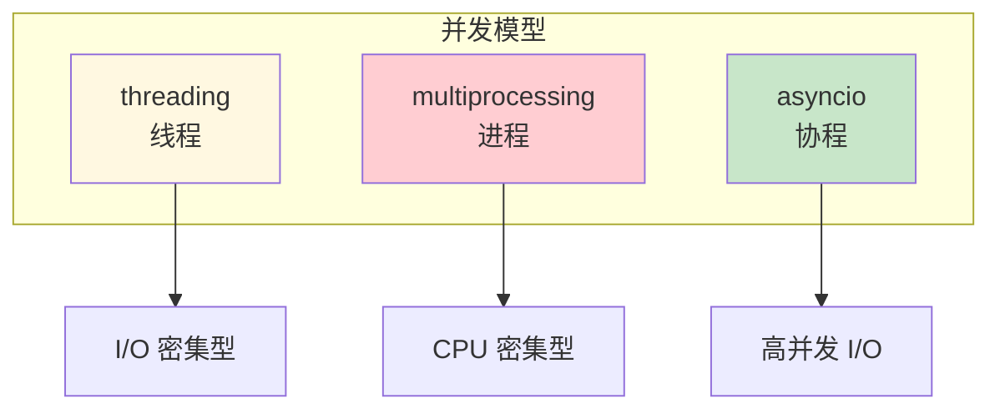

# L16: 并发编程入门

> **课程编号**: L16  
> **所属阶段**: Stage 1 - Python 进阶  
> **预计时长**: 6 小时  
> **难度**: ⭐⭐⭐⭐☆（中高级）  
> **前置课程**: L13 Python 高级特性（入门）  
> **版本**: v1.0
> **最后更新**: 2026-08-07
> **学习目标**: 掌握 asyncio 异步编程、协程、并发与并行概念

---

## 🎯 学习目标

完成本课程后，你将能够：

1. ✅ 理解并发与并行的区别
2. ✅ 掌握 asyncio 协程基础（async/await）
3. ✅ 使用 asyncio 创建异步任务
4. ✅ 理解协程调度机制和事件循环
5. ✅ 掌握异步上下文管理器（async with）
6. ✅ 避免常见的异步编程陷阱

---

## 📚 核心内容

### Part 1: 并发与并行概念

#### 1.1 什么是并发和并行？

**并发（Concurrency）**：多个任务交替执行，在某个时刻只有一个任务在运行
**并行（Parallelism）**：多个任务同时执行，需要多个 CPU 核心

```python
# 并发模型：单核 CPU 上交替执行
# 时间线: |---A---A---A---|---B---B---B---|
#         |<---  时间  --->|

# 并行模型：多核 CPU 同时执行
# 时间线: |---A---A---A---|
#         |---B---B---B---|  （两个核心同时运行）
```

**Python 中的选择**：
| 模型 | 适用场景 | 库/模块 |
|------|----------|---------|
| 线程 | I/O 密集型（需要等待） | `threading` |
| 进程 | CPU 密集型（计算密集） | `multiprocessing` |
| 协程 | I/O 密集型（高并发） | `asyncio` |

#### 1.2 为什么需要异步编程？

```python
# ❌ 同步方式：串行执行，总耗时 = t1 + t2 + t3
import time

def fetch_user():
    time.sleep(1)  # 模拟网络请求
    return {"id": 1}

def fetch_orders():
    time.sleep(1)  # 模拟网络请求
    return [1, 2, 3]

def fetch_products():
    time.sleep(1)  # 模拟网络请求
    return ["A", "B", "C"]

start = time.time()
user = fetch_user()
orders = fetch_orders()
products = fetch_products()
print(f"总耗时: {time.time() - start:.2f}s")  # ~3秒

# ✅ 异步方式：并发执行，总耗时 ≈ max(t1, t2, t3)
import asyncio

async def fetch_user_async():
    await asyncio.sleep(1)  # 模拟异步 I/O
    return {"id": 1}

async def fetch_orders_async():
    await asyncio.sleep(1)
    return [1, 2, 3]

async def fetch_products_async():
    await asyncio.sleep(1)
    return ["A", "B", "C"]

async def main():
    start = time.time()
    # 并发执行三个任务
    user, orders, products = await asyncio.gather(
        fetch_user_async(),
        fetch_orders_async(),
        fetch_products_async()
    )
    print(f"总耗时: {time.time() - start:.2f}s")  # ~1秒

asyncio.run(main())
```

---

### Part 2: asyncio 协程基础

#### 2.1 async/await 语法

```python
import asyncio

# 定义协程函数
async def greet(name: str) -> str:
    await asyncio.sleep(1)  # 模拟异步操作
    return f"Hello, {name}!"

# 运行协程
result = asyncio.run(greet("Alice"))
print(result)  # Hello, Alice!
```

**关键概念**：
- `async def` 定义协程函数
- `await` 暂停协程，等待另一个协程完成
- `asyncio.run()` 启动事件循环

#### 2.2 协程的执行机制

```python
import asyncio

async def task1():
    print("任务 1 开始")
    await asyncio.sleep(1)
    print("任务 1 完成")
    return 1

async def task2():
    print("任务 2 开始")
    await asyncio.sleep(0.5)
    print("任务 2 完成")
    return 2

async def main():
    # 顺序执行
    result1 = await task1()
    result2 = await task2()
    print(f"结果: {result1}, {result2}")

# 输出:
# 任务 1 开始
# 任务 1 完成
# 任务 2 开始
# 任务 2 完成
# 结果: 1, 2
```

#### 2.3 并发执行 with asyncio.gather

```python
import asyncio
import time

async def task(name: str, duration: float) -> str:
    print(f"{name} 开始")
    await asyncio.sleep(duration)
    print(f"{name} 完成")
    return f"{name} 结果"

async def main():
    start = time.time()

    # 并发执行多个协程
    results = await asyncio.gather(
        task("任务 A", 1.0),
        task("任务 B", 0.5),
        task("任务 C", 0.8)
    )

    elapsed = time.time() - start
    print(f"总耗时: {elapsed:.2f}s")  # ~1.0s（最长任务决定总时间）
    print(f"结果: {results}")

asyncio.run(main())

# 输出:
# 任务 A 开始
# 任务 B 开始
# 任务 C 开始
# 任务 B 完成
# 任务 C 完成
# 任务 A 完成
# 总耗时: 1.00s
# 结果: ['任务 A 结果', '任务 B 结果', '任务 C 结果']
```

---

### Part 3: asyncio 任务管理

#### 3.1 创建任务

```python
import asyncio

async def fetch_data(n: int) -> int:
    await asyncio.sleep(1)
    return n * 2

async def main():
    # 创建任务（立即调度执行）
    task1 = asyncio.create_task(fetch_data(10))
    task2 = asyncio.create_task(fetch_data(20))

    # 等待任务完成
    results = await asyncio.gather(task1, task2)
    print(f"结果: {results}")  # [20, 40]

asyncio.run(main())
```

#### 3.2 任务等待策略

```python
import asyncio

async def task(name: str, duration: float):
    await asyncio.sleep(duration)
    return f"{name} 完成"

async def main():
    task1 = asyncio.create_task(task("快速", 0.5))
    task2 = asyncio.create_task(task("慢速", 2.0))

    # 等待所有任务完成
    # 方法 1: gather
    # results = await asyncio.gather(task1, task2)

    # 方法 2: wait（可设置超时）
    done, pending = await asyncio.wait(
        [task1, task2],
        timeout=1.0  # 1 秒后返回
    )

    print(f"已完成: {len(done)}")
    print(f"等待中: {len(pending)}")

    # 取消未完成的任务
    for p in pending:
        p.cancel()

asyncio.run(main())
```

#### 3.3 asyncio.wait_for 超时控制

```python
import asyncio

async def slow_operation():
    await asyncio.sleep(5)
    return "完成"

async def main():
    try:
        # 设置 1 秒超时
        result = await asyncio.wait_for(slow_operation(), timeout=1.0)
        print(result)
    except asyncio.TimeoutError:
        print("操作超时！")

asyncio.run(main())
# 输出: 操作超时！
```

---

### Part 4: 异步上下文管理器

#### 4.1 async with 语法

```python
import asyncio

class AsyncResource:
    """异步资源管理器"""

    async def __aenter__(self):
        print("获取资源")
        await asyncio.sleep(0.1)
        return self

    async def __aexit__(self, exc_type, exc_val, exc_tb):
        print("释放资源")
        await asyncio.sleep(0.1)
        return False  # 不抑制异常

async def main():
    async with AsyncResource() as resource:
        print("使用资源中...")

    # 等价于:
    # resource = await AsyncResource().__aenter__()
    # try:
    #     print("使用资源中...")
    # finally:
    #     await AsyncResource().__aexit__(None, None, None)

asyncio.run(main())
```

#### 4.2 @asynccontextmanager

```python
import asyncio
from contextlib import asynccontextmanager

@asynccontextmanager
async def managed_resource(name: str):
    print(f"获取资源: {name}")
    resource = {"name": name, "data": []}
    try:
        yield resource
    finally:
        print(f"释放资源: {name}")

async def main():
    async with managed_resource("database") as res:
        res["data"].append("item")
        print(f"使用中: {res}")

    # 输出:
    # 获取资源: database
    # 使用中: {'name': 'database', 'data': ['item']}
    # 释放资源: database

asyncio.run(main())
```


---

### Part 5: 常见陷阱与最佳实践

#### 5.1 避免阻塞事件循环

```python
import asyncio
import time

# ❌ 错误：在协程中执行阻塞操作
async def bad_example():
    time.sleep(5)  # 阻塞整个事件循环！
    return "完成"

# ✅ 正确：使用 asyncio.sleep
async def good_example():
    await asyncio.sleep(5)  # 不会阻塞事件循环
    return "完成"

# ✅ 正确：使用 run_in_executor 执行阻塞操作
async def proper_blocking():
    loop = asyncio.get_event_loop()
    result = await loop.run_in_executor(None, time.sleep, 5)
    return "完成"
```

#### 5.2 正确处理异常

```python
import asyncio

async def failing_task():
    raise ValueError("任务失败！")

async def main():
    try:
        await failing_task()
    except ValueError as e:
        print(f"捕获异常: {e}")

asyncio.run(main())

---


### Part 6: 异步 I/O 实战

#### 6.1 异步文件操作

```python
import asyncio
import aiofiles
from pathlib import Path

async def read_file_async(filepath: str) -> str:
    """异步读取文件"""
    async with aiofiles.open(filepath, mode='r') as f:
        return await f.read()


async def write_file_async(filepath: str, content: str) -> None:
    """异步写入文件"""
    async with aiofiles.open(filepath, mode='w') as f:
        await f.write(content)


async def copy_file_async(src: str, dst: str) -> None:
    """异步复制文件"""
    content = await read_file_async(src)
    await write_file_async(dst, content)


async def process_multiple_files(filepaths: list[str]) -> dict[str, str]:
    """并发处理多个文件"""
    tasks = [read_file_async(fp) for fp in filepaths]
    contents = await asyncio.gather(*tasks)
    return {fp: content for fp, content in zip(filepaths, contents)}
```

#### 6.2 异步 HTTP 请求

```python
import asyncio
import httpx

async def fetch_all_sequential(urls: list[str]) -> list[dict]:
    """顺序请求（低效）"""
    results = []
    async with httpx.AsyncClient() as client:
        for url in urls:
            response = await client.get(url)
            results.append({"url": url, "status": response.status_code})
    return results


async def fetch_all_concurrent(urls: list[str]) -> list[dict]:
    """并发请求（高效）"""
    async with httpx.AsyncClient(timeout=30.0) as client:
        tasks = [client.get(url) for url in urls]
        responses = await asyncio.gather(*tasks, return_exceptions=True)

        results = []
        for url, response in zip(urls, responses):
            if isinstance(response, Exception):
                results.append({"url": url, "error": str(response)})
            else:
                results.append({
                    "url": url,
                    "status": response.status_code,
                    "content_length": len(response.content)
                })
        return results


async def fetch_with_retry(
    url: str,
    max_retries: int = 3,
    backoff: float = 1.0
) -> dict:
    """带重试的请求"""
    async with httpx.AsyncClient() as client:
        for attempt in range(max_retries):
            try:
                response = await client.get(url)
                response.raise_for_status()
                return {"success": True, "data": response.json()}
            except (httpx.HTTPError, httpx.TimeoutException) as e:
                if attempt == max_retries - 1:
                    return {"success": False, "error": str(e)}
                await asyncio.sleep(backoff * (2 ** attempt))
    return {"success": False, "error": "Max retries exceeded"}
```

#### 6.3 异步数据库操作

```python
import asyncio
from dataclasses import dataclass
from typing import Optional

@dataclass
class User:
    id: int
    name: str
    email: str


class AsyncDatabase:
    """模拟异步数据库"""

    def __init__(self) -> None:
        self.users: dict[int, User] = {}
        self._next_id = 1

    async def create_user(self, name: str, email: str) -> User:
        """创建用户"""
        await asyncio.sleep(0.1)  # 模拟数据库延迟
        user = User(id=self._next_id, name=name, email=email)
        self.users[self._next_id] = user
        self._next_id += 1
        return user

    async def get_user(self, user_id: int) -> Optional[User]:
        """获取用户"""
        await asyncio.sleep(0.05)
        return self.users.get(user_id)

    async def get_all_users(self) -> list[User]:
        """获取所有用户"""
        await asyncio.sleep(0.1)
        return list(self.users.values())

    async def update_user(self, user_id: int, **kwargs) -> Optional[User]:
        """更新用户"""
        await asyncio.sleep(0.1)
        user = self.users.get(user_id)
        if user:
            for key, value in kwargs.items():
                if hasattr(user, key):
                    setattr(user, key, value)
        return user

    async def delete_user(self, user_id: int) -> bool:
        """删除用户"""
        await asyncio.sleep(0.1)
        if user_id in self.users:
            del self.users[user_id]
            return True
        return False


async def main():
    db = AsyncDatabase()

    # 并发创建用户
    users = await asyncio.gather(
        db.create_user("Alice", "alice@example.com"),
        db.create_user("Bob", "bob@example.com"),
        db.create_user("Charlie", "charlie@example.com"),
    )
    print(f"创建了 {len(users)} 个用户")

    # 批量查询
    all_users = await db.get_all_users()
    print(f"当前用户: {[u.name for u in all_users]}")


asyncio.run(main())
```

#### 6.4 异步队列与生产者-消费者

```python
import asyncio
from dataclasses import dataclass
from typing import Optional
import random

@dataclass
class Task:
    id: int
    data: str
    priority: int = 0


class AsyncTaskQueue:
    """异步任务队列"""

    def __init__(self, maxsize: int = 0) -> None:
        self._queue: asyncio.Queue[Task] = asyncio.Queue(maxsize=maxsize)

    async def put(self, task: Task) -> None:
        """添加任务"""
        await self._queue.put(task)

    async def get(self) -> Task:
        """获取任务（阻塞直到有任务）"""
        return await self._queue.get()

    async def get_with_timeout(self, timeout: float) -> Optional[Task]:
        """带超时的获取"""
        try:
            return await asyncio.wait_for(self._queue.get(), timeout=timeout)
        except asyncio.TimeoutError:
            return None

    def task_done(self) -> None:
        """标记任务完成"""
        self._queue.task_done()

    async def join(self) -> None:
        """等待所有任务完成"""
        await self._queue.join()


async def producer(queue: AsyncTaskQueue, num_tasks: int):
    """生产者：生成任务"""
    for i in range(num_tasks):
        task = Task(
            id=i,
            data=f"任务数据 {i}",
            priority=random.randint(1, 3)
        )
        await queue.put(task)
        print(f"[生产者] 添加任务 #{task.id}")
        await asyncio.sleep(0.1)


async def consumer(queue: AsyncTaskQueue, consumer_id: int):
    """消费者：处理任务"""
    while True:
        task = await queue.get_with_timeout(timeout=1.0)
        if task is None:
            print(f"[消费者 #{consumer_id}] 无任务，退出")
            break

        print(f"[消费者 #{consumer_id}] 处理任务 #{task.id}")
        await asyncio.sleep(random.uniform(0.1, 0.5))  # 模拟处理
        queue.task_done()
        print(f"[消费者 #{consumer_id}] 完成任务 #{task.id}")


async def main():
    queue = AsyncTaskQueue()

    # 启动生产者和消费者
    await asyncio.gather(
        producer(queue, 10),
        consumer(queue, 1),
        consumer(queue, 2),
    )


asyncio.run(main())
```

#### 6.5 异步信号量与连接池

```python
import asyncio

class AsyncConnectionPool:
    """异步连接池"""

    def __init__(self, max_connections: int = 10) -> None:
        self.max_connections = max_connections
        self._semaphore = asyncio.Semaphore(max_connections)
        self._connections: list[str] = []
        self._created = 0

    async def acquire(self) -> str:
        """获取连接"""
        await self._semaphore.acquire()

        # 创建或复用连接
        if self._connections:
            conn = self._connections.pop()
        else:
            self._created += 1
            conn = f"conn-{self._created}"
            await asyncio.sleep(0.1)  # 模拟连接建立

        return conn

    async def release(self, conn: str) -> None:
        """释放连接"""
        if len(self._connections) < self.max_connections:
            self._connections.append(conn)
        self._semaphore.release()

    async def __aenter__(self) -> "AsyncConnectionPool":
        return self

    async def __aexit__(self, *args) -> None:
        pass  # 保持连接池


async def use_connection(pool: AsyncConnectionPool, task_id: int):
    """使用连接池"""
    conn = await pool.acquire()
    try:
        print(f"[任务 {task_id}] 使用 {conn}")
        await asyncio.sleep(0.5)  # 模拟使用连接
    finally:
        await pool.release(conn)
        print(f"[任务 {task_id}] 释放 {conn}")


async def main():
    async with AsyncConnectionPool(max_connections=3) as pool:
        # 模拟 10 个并发请求，但只有 3 个连接
        tasks = [use_connection(pool, i) for i in range(10)]
        await asyncio.gather(*tasks)


asyncio.run(main())
```

#### 6.6 异步锁与线程安全

```python
import asyncio

class AsyncCounter:
    """异步计数器"""

    def __init__(self) -> None:
        self._count = 0
        self._lock = asyncio.Lock()

    async def increment(self) -> int:
        """递增计数器（线程安全）"""
        async with self._lock:
            self._count += 1
            return self._count

    async def get_count(self) -> int:
        """获取计数"""
        async with self._lock:
            return self._count


async def concurrent_increment(counter: AsyncCounter, num_times: int):
    """并发递增"""
    for _ in range(num_times):
        await counter.increment()


async def main():
    counter = AsyncCounter()

    # 10 个协程各递增 100 次
    tasks = [concurrent_increment(counter, 100) for _ in range(10)]
    await asyncio.gather(*tasks)

    print(f"最终计数: {await counter.get_count()}")  # 应该是 1000


asyncio.run(main())
```

### Part 7: 事件循环深入理解

#### 7.1 事件循环机制

```python
import asyncio

async def event_loop_explanation():
    """事件循环工作原理"""

    async def task(name: str, duration: float):
        print(f"[{name}] 开始")
        await asyncio.sleep(duration)
        print(f"[{name}] 完成")

    print("=== 事件循环执行顺序 ===")

    # 1. 创建任务（不执行）
    t1 = asyncio.create_task(task("任务A", 0.5))
    t2 = asyncio.create_task(task("任务B", 0.3))

    print(f"任务状态: t1={t1.get_name()}, t2={t2.get_name()}")

    # 2. 等待所有任务
    await asyncio.gather(t1, t2)

    print("=== 所有任务完成 ===")


# 事件循环的三个阶段
async def three_phases():
    """事件循环的三个阶段"""

    # 阶段 1: 准备 - 设置回调
    async def on_ready():
        print("阶段 1: 准备完成")

    # 阶段 2: 运行 - 执行协程
    async def on_run():
        print("阶段 2: 运行中")
        await asyncio.sleep(0.1)
        print("阶段 2: 运行完成")

    # 阶段 3: 清理 - 释放资源
    def on_cleanup():
        print("阶段 3: 清理完成")

    # 注册清理回调
    loop = asyncio.get_running_loop()
    loop.add_done_callback(lambda _: on_cleanup())

    await on_ready()
    await on_run()


asyncio.run(event_loop_explanation())
```

#### 7.2 自定义事件循环

```python
import asyncio

class CustomEventLoop(asyncio.AbstractEventLoop):
    """自定义事件循环（高级用法）"""

    def __init__(self) -> None:
        super().__init__()
        self._tasks: set[asyncio.Task] = set()
        self._running = False

    def run_until_complete(self, future):
        """运行直到完成"""
        self._running = True
        return super().run_until_complete(future)

    def _make_task(self, coro):
        """创建带追踪的任务"""
        task = asyncio.Task(coro, loop=self)
        self._tasks.add(task)
        task.add_done_callback(self._tasks.discard)
        return task


# 使用默认事件循环
async def default_loop_example():
    """使用默认事件循环"""
    loop = asyncio.get_running_loop()
    print(f"当前事件循环: {loop}")
    print(f"是否为默认循环: {loop.is_running()}")


asyncio.run(default_loop_example())
```

### Part 8: asyncio 与其他并发模型的对比

#### 8.1 asyncio vs threading

```python
import asyncio
import threading
import time

# asyncio 版本
async def async_worker(name: str, duration: float):
    print(f"[Async {name}] 开始")
    await asyncio.sleep(duration)
    print(f"[Async {name}] 完成")
    return f"{name} 结果"


async def async_demo():
    start = time.time()
    results = await asyncio.gather(
        async_worker("A", 1.0),
        async_worker("B", 1.0),
        async_worker("C", 1.0),
    )
    elapsed = time.time() - start
    print(f"Async 总耗时: {elapsed:.2f}s")
    return results


# threading 版本
def thread_worker(name: str, duration: float, results: list):
    print(f"[Thread {name}] 开始")
    time.sleep(duration)  # 阻塞式
    print(f"[Thread {name}] 完成")
    results.append(f"{name} 结果")


def threading_demo():
    results = []
    threads = []
    start = time.time()

    for name in ["A", "B", "C"]:
        t = threading.Thread(target=thread_worker, args=(name, 1.0, results))
        threads.append(t)
        t.start()

    for t in threads:
        t.join()

    elapsed = time.time() - start
    print(f"Thread 总耗时: {elapsed:.2f}s")
    return results


async def main():
    print("=== asyncio 并发 ===")
    await async_demo()

    print("\n=== threading 并发 ===")
    threading_demo()


asyncio.run(main())

# 输出对比:
# asyncio: ~1.0s（单线程，协作式）
# threading: ~1.0s（多线程，真正并行）
```

#### 8.2 asyncio vs multiprocessing

```python
import asyncio
import multiprocessing
import time
import os

def cpu_bound_task(n: int) -> int:
    """CPU 密集型任务"""
    # 模拟计算
    result = sum(i * i for i in range(n))
    return result


async def async_cpu_bound(n: int) -> int:
    """异步包装的 CPU 密集型任务"""
    loop = asyncio.get_running_loop()
    # 将 CPU 密集型任务放到线程池
    return await loop.run_in_executor(None, cpu_bound_task, n)


async def main():
    n = 5_000_000

    print("=== asyncio（单线程）===")
    start = time.time()
    result = await async_cpu_bound(n)
    print(f"耗时: {time.time() - start:.2f}s, PID: {os.getpid()}")

    print("\n=== multiprocessing ===")
    start = time.time()
    with multiprocessing.Pool(4) as pool:
        results = pool.map(cpu_bound_task, [n] * 4)
    print(f"耗时: {time.time() - start:.2f}s, PID: {os.getpid()}")

    # asyncio 单线程无法并行执行 CPU 密集任务
    # multiprocessing 可以利用多核


asyncio.run(main())
```

### Part 9: 性能调优与监控

#### 9.1 异步性能监控

```python
import asyncio
import time
from functools import wraps

def async_timer(func):
    """异步函数计时装饰器"""
    @wraps(func)
    async def wrapper(*args, **kwargs):
        start = time.perf_counter()
        result = await func(*args, **kwargs)
        elapsed = time.perf_counter() - start
        print(f"[{func.__name__}] 耗时: {elapsed*1000:.2f}ms")
        return result
    return wrapper


@async_timer
async def slow_operation():
    await asyncio.sleep(0.5)
    return "完成"


async def performance_monitor():
    """异步性能监控"""
    tasks = [slow_operation() for _ in range(5)]
    start = time.perf_counter()
    results = await asyncio.gather(*tasks)
    total = time.perf_counter() - start
    print(f"\n总耗时: {total*1000:.2f}ms")
    print(f"并发数: {len(tasks)}")


asyncio.run(performance_monitor())
```

#### 9.2 调试异步代码

```python
import asyncio

# 启用调试模式
asyncio.set_debug(True)

async def debug_async():
    """调试异步代码"""
    async def task(name: str):
        print(f"[{name}] 1. 开始")
        await asyncio.sleep(0.1)
        print(f"[{name}] 2. 继续")
        await asyncio.sleep(0.1)
        print(f"[{name}] 3. 完成")

    # 查看任务状态
    task1 = asyncio.create_task(task("A"))
    task2 = asyncio.create_task(task("B"))

    print(f"任务状态: pending={task1.pending()}, done={task1.done()}")

    await asyncio.gather(task1, task2)

    print(f"最终状态: done={task1.done()}, result={task1.result()}")


asyncio.run(debug_async())
```

### Part 10: 最佳实践总结

#### 10.1 asyncio 编码规范

```python
# ✅ 推荐做法

# 1. 使用 async/await 语法
async def fetch_data(url: str) -> dict:
    async with httpx.AsyncClient() as client:
        response = await client.get(url)
        return response.json()

# 2. 使用 TaskGroup 管理任务（Python 3.11+）
async def task_group_example():
    async with asyncio.TaskGroup() as tg:
        task1 = tg.create_task(fetch_data("url1"))
        task2 = tg.create_task(fetch_data("url2"))

# 3. 使用超时防止无限等待
async def with_timeout():
    try:
        result = await asyncio.wait_for(slow_op(), timeout=5.0)
    except asyncio.TimeoutError:
        print("操作超时")

# 4. 使用 Semaphore 控制并发
async def rate_limited():
    semaphore = asyncio.Semaphore(10)
    async with semaphore:
        await fetch_data("url")


# ❌ 避免做法

# 1. 不要混用阻塞和非阻塞代码
# time.sleep(1) → asyncio.sleep(1)
# requests.get() → httpx.AsyncClient

# 2. 不要忘记 await
# fetch_data("url") → await fetch_data("url")

# 3. 不要创建太多任务
# [create_task() for _ in range(10000)] → 使用 Semaphore 限制
```

#### 10.2 迁移指南

```python
# 从同步代码迁移到异步

# 同步版本
import requests

def get_user(user_id: int) -> dict:
    response = requests.get(f"https://api.example.com/users/{user_id}")
    return response.json()


# 异步版本
import httpx
import asyncio

async def get_user_async(user_id: int) -> dict:
    async with httpx.AsyncClient() as client:
        response = await client.get(f"https://api.example.com/users/{user_id}")
        return response.json()


# 批量迁移
async def get_users_async(user_ids: list[int]) -> list[dict]:
    # 使用 gather 并发请求
    tasks = [get_user_async(uid) for uid in user_ids]
    return await asyncio.gather(*tasks)
```


## 🚀 快速开始

从仓库根目录进入本课：

```bash
cd stage1-python-intermediate/lessons/L16-concurrency-intro
```

### 1. 运行示例代码

```bash
# 协程基础
python examples/01_async_basics.py

# async/await 练习
python exercises/01_async_basics.py
```

### 2. 完成练习题

```bash
python exercises/01_async_website_checker.py
python exercises/02_concurrent_file_processor.py
python exercises/03_async_rate_limiter.py
```

---

## 📝 练习题

### 练习 1: 异步网站检查器

实现一个异步网站检查器，并发检查多个 URL：

```python
async def check_websites(urls: list[str]) -> dict[str, bool]:
    """并发检查网站是否可访问"""
    ...

# 使用 asyncio.Semaphore 限制并发数
```

### 练习 2: 并发文件处理器

使用异步 I/O 处理多个文件：

```python
async def process_files(filenames: list[str]) -> list[str]:
    """异步读取并处理多个文件"""
    ...
```

---

## 📝 本章总结

### 核心知识点

1. **并发 vs 并行**
   - 并发：交替执行，共享时间片
   - 并行：同时执行，需要多核
   - Python 协程适用于 I/O 密集型任务

2. **asyncio 协程**
   - `async def` 定义协程函数
   - `await` 暂停协程等待结果
   - `asyncio.run()` 启动事件循环

3. **任务管理**
   - `asyncio.create_task()` 创建任务
   - `asyncio.gather()` 并发等待
   - `asyncio.wait()` 支持超时

4. **异步上下文管理器**
   - `async with` 语法
   - `__aenter__` / `__aexit__`
   - `@asynccontextmanager` 装饰器

### 关键要点

- ✅ 协程是单线程内的并发，不是并行
- ✅ `await` 会释放控制权，让其他协程运行
- ✅ 使用 `asyncio.gather` 并发执行多个协程
- ✅ 避免在协程中调用阻塞操作
- ✅ 使用 `Semaphore` 控制并发数

### 常见陷阱

- ❌ 在协程中使用 `time.sleep()`（应使用 `asyncio.sleep()`）
- ❌ 忘记 `await` 关键字
- ❌ 并发数过高导致资源耗尽
- ❌ 没有正确处理异常

### 实用技巧

- 💡 使用 `asyncio.run()` 运行顶层协程
- 💡 使用 `wait_for` 设置超时
- 💡 使用 `run_in_executor` 执行阻塞代码

---

## 💭 课堂思考

1. **async/await vs 多线程**：Python 的 `async/await` 是协程，不是线程。为什么在 I/O 密集型场景中协程比线程更高效？什么时候应该选择真正的多线程？

2. **事件循环的本质**：事件循环是一个"单线程"的调度器。它如何做到"同时"处理多个任务？协程的 `await` 点是如何让出控制权的？

---

## 📚 参考资料

- [asyncio 官方文档](https://docs.python.org/zh-cn/3/library/asyncio.html)
- [Python 异步编程指南](https://docs.python.org/zh-cn/3/library/asyncio-extended.html)
- [PEP 492 - async/await 语法](https://peps.python.org/pep-0492/)

---

## 📁 文件导航

| 目录       | 说明         |
| ---------- | ------------ |
| examples/  | 示例代码     |
| exercises/ | 练习题       |
| solutions/ | 参考答案     |
| tests/     | 单元测试     |
| lesson.md  | 详细教学内容 |

---

## ✅ 完成标准

- [x] 完成 3 个练习文件（01_async_basics, 02_concurrent_file_processor, 03_async_rate_limiter）
- [ ] 理解协程和事件循环的工作原理
- [ ] 掌握 asyncio 的核心 API
- [ ] 能够实现异步上下文管理器
- [ ] 理解异步编程的常见陷阱

---


## 💡 常见陷阱

### 陷阱 1: GIL 导致多线程无效

```python
# ❌ CPU 密集型任务用多线程无效
import threading

def cpu_task(n):
    return sum(i*i for i in range(n))

threads = [threading.Thread(target=cpu_task, args=(10**6,)) for _ in range(4)]
# 多线程不会加速，因为 GIL

# ✅ CPU 密集型：使用 multiprocessing
# ✅ I/O 密集型：使用 threading 或 asyncio
```

### 陷阱 2: 死锁

```python
# ❌ 多个锁的不当获取顺序导致死锁
import threading

lock_a = threading.Lock()
lock_b = threading.Lock()

def task1():
    lock_a.acquire()
    lock_b.acquire()  # 可能永远等待
    # ...

# ✅ 使用锁排序或 Lock.timeout
```



## 🔗 下一步

完成本课程后，继续学习：

- [L15: 函数式编程](../L15-functional/lesson.md)
- [L16: 正则表达式](../L16-regex/lesson.md)

---

**课程说明**: 本课程是异步编程入门，为后续深入学习 `asyncio` 高级特性和实际应用打下基础。
