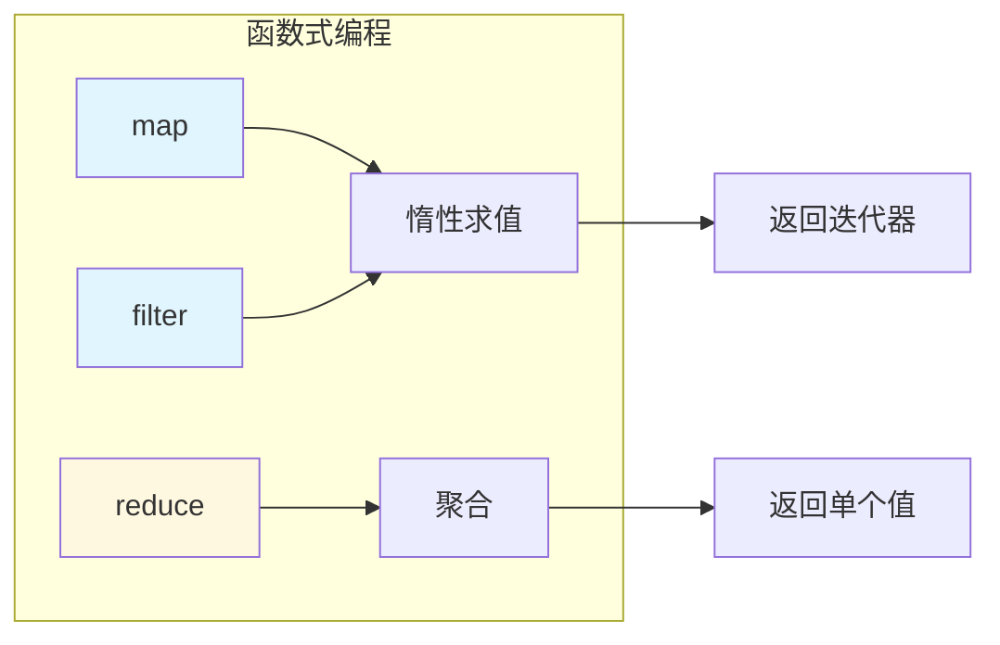

# L17: 函数式编程

> **课程编号**: L17  
> **所属阶段**: Stage 1 - Python 进阶  
> **预计时长**: 5 小时  
> **难度**: ⭐⭐⭐⭐☆（中高级）  
> **前置课程**: L11 迭代器与生成器  
> **学习目标**: 掌握 lambda、高阶函数、map/filter/reduce、函数组合、偏函数

---

## 🎯 学习目标

完成本课程后，你将能够：

1. ✅ 理解函数式编程的核心概念
2. ✅ 掌握 lambda 表达式和一等公民函数
3. ✅ 熟练使用 map、filter、reduce 函数
4. ✅ 实现函数组合和柯里化
5. ✅ 使用偏函数创建新函数
6. ✅ 理解生成器与函数式编程的结合

---

## 📚 核心内容

### Part 1: 函数式编程基础

#### 1.1 什么是函数式编程？

函数式编程是一种**以函数为核心**的编程范式，强调：

- **一等公民函数**：函数可以像变量一样传递、返回、赋值
- **纯函数**：相同的输入总是产生相同的输出，没有副作用
- **不可变性**：不修改现有数据，创建新的数据
- **声明式**：描述"做什么"，而非"怎么做"

```python
# ❌ 命令式：描述"怎么做"
numbers = [1, 2, 3, 4, 5]
squared = []
for n in numbers:
    squared.append(n ** 2)
print(sum(squared))  # 55

# ✅ 函数式：描述"做什么"
from functools import reduce

result = reduce(
    lambda acc, x: acc + x ** 2,
    [1, 2, 3, 4, 5],
    0
)
print(result)  # 55
```

#### 1.2 Python 中的函数式特性

```python
# 函数是一等公民
def apply_twice(func, x):
    return func(func(x))

def add_five(x):
    return x + 5

print(apply_twice(add_five, 10))  # 20

# 函数可以赋值给变量
square = lambda x: x ** 2
print(square(5))  # 25

# 函数可以作为返回值
def make_multiplier(n):
    return lambda x: x * n

double = make_multiplier(2)
triple = make_multiplier(3)
print(double(10))  # 20
print(triple(10))  # 30
```

---

### Part 2: lambda 表达式

#### 2.1 lambda 基础

```python
# 语法: lambda 参数: 表达式
square = lambda x: x ** 2
add = lambda x, y: x + y
greet = lambda name: f"Hello, {name}!"

# lambda 只能包含单个表达式，不能包含语句
# ❌ 错误: lambda x: if x > 0: return x
# ✅ 正确: lambda x: x if x > 0 else -x
```

#### 2.2 lambda 与高阶函数

```python
# 使用 lambda 作为参数
numbers = [3, 1, 4, 1, 5, 9, 2, 6]

# sorted 默认升序
print(sorted(numbers))  # [1, 1, 2, 3, 4, 5, 6, 9]

# 使用 lambda 自定义排序
print(sorted(numbers, key=lambda x: -x))  # 降序: [9, 6, 5, 4, 3, 2, 1, 1]

# 按字符串长度排序
words = ["apple", "pie", "banana", "cat"]
print(sorted(words, key=lambda w: len(w)))  # ['pie', 'cat', 'apple', 'banana']

# max 使用 key
people = [
    {"name": "Alice", "age": 30},
    {"name": "Bob", "age": 25},
    {"name": "Charlie", "age": 35}
]
oldest = max(people, key=lambda p: p["age"])
print(oldest)  # {'name': 'Charlie', 'age': 35}
```

---

### Part 3: map、filter、reduce

#### 3.1 map - 转换

```python
# map(function, iterable) - 对每个元素应用函数
numbers = [1, 2, 3, 4, 5]

# 使用 map + lambda
squared = list(map(lambda x: x ** 2, numbers))
print(squared)  # [1, 4, 9, 16, 25]

# 使用 map + 普通函数
def to_upper(s):
    return s.upper()

names = ["alice", "bob", "charlie"]
upper_names = list(map(to_upper, names))
print(upper_names)  # ['ALICE', 'BOB', 'CHARLIE']

# 多个可迭代对象
a = [1, 2, 3]
b = [4, 5, 6]
sums = list(map(lambda x, y: x + y, a, b))
print(sums)  # [5, 7, 9]
```

#### 3.2 filter - 过滤

```python
# filter(predicate, iterable) - 保留满足条件的元素
numbers = [1, 2, 3, 4, 5, 6, 7, 8, 9, 10]

# 保留偶数
evens = list(filter(lambda x: x % 2 == 0, numbers))
print(evens)  # [2, 4, 6, 8, 10]

# 保留长度大于 3 的字符串
words = ["cat", "elephant", "dog", "hippopotamus"]
long_words = list(filter(lambda w: len(w) > 3, words))
print(long_words)  # ['elephant', 'hippopotamus']

# 保留正数
mixed = [-2, -1, 0, 1, 2, 3]
positives = list(filter(lambda x: x > 0, mixed))
print(positives)  # [1, 2, 3]
```

#### 3.3 reduce - 聚合

```python
# reduce(function, iterable, initial) - 将序列聚合成单个值
from functools import reduce

numbers = [1, 2, 3, 4, 5]

# 求和
total = reduce(lambda acc, x: acc + x, numbers, 0)
print(total)  # 15

# 求积
product = reduce(lambda acc, x: acc * x, numbers, 1)
print(product)  # 120

# 找最大值
max_val = reduce(lambda acc, x: acc if acc > x else x, numbers)
print(max_val)  # 5

# 连接字符串
words = ["Hello", " ", "World", "!"]
sentence = reduce(lambda acc, w: acc + w, words, "")
print(sentence)  # Hello World!

# 使用 operator 模块（更高效）
from operator import add, mul, concat
total = reduce(add, numbers, 0)
product = reduce(mul, numbers, 1)
```

---

### Part 4: 组合使用

#### 4.1 链式调用

```python
from functools import reduce

numbers = [1, 2, 3, 4, 5, 6, 7, 8, 9, 10]

# 找出偶数的平方和
result = reduce(
    lambda acc, x: acc + x ** 2,
    filter(lambda x: x % 2 == 0, numbers),
    0
)
print(result)  # 220 (2² + 4² + 6² + 8² + 10²)

# 等价的命令式写法
total = 0
for n in numbers:
    if n % 2 == 0:
        total += n ** 2
print(total)  # 220
```

#### 4.2 列表推导式 vs map/filter

```python
numbers = [1, 2, 3, 4, 5]

# 列表推导式
squares = [x ** 2 for x in numbers]
evens = [x for x in numbers if x % 2 == 0]
even_squares = [x ** 2 for x in numbers if x % 2 == 0]

# map/filter
squares = list(map(lambda x: x ** 2, numbers))
evens = list(filter(lambda x: x % 2 == 0, numbers))
even_squares = list(map(lambda x: x ** 2, filter(lambda x: x % 2 == 0, numbers)))

# 何时使用哪个？
# - 简单转换用列表推导式更清晰
# - 复杂逻辑或需要链式调用时 map/filter 更灵活
# - 生成器表达式适合大数据处理
```

---

### Part 5: 函数组合

#### 5.1 手动组合

```python
# f(g(x)) - 先 g 再 f
def compose(f, g):
    """返回组合函数 f ∘ g"""
    return lambda x: f(g(x))

# 示例
add_one = lambda x: x + 1
double = lambda x: x * 2
square = lambda x: x ** 2

# double(add_one(5)) = 12
# compose(double, add_one)(5) = 12
add_then_double = compose(double, add_one)
print(add_then_double(5))  # 12

# square(double(5)) = 100
# compose(square, double)(5) = 100
double_then_square = compose(square, double)
print(double_then_square(5))  # 100
```

#### 5.2 多函数组合

```python
from functools import reduce

def compose(*functions):
    """组合多个函数"""
    return reduce(lambda f, g: lambda x: f(g(x)), functions, lambda x: x)

# 示例：字符串处理 pipeline
strip = lambda s: s.strip()
lower = lambda s: s.lower()
remove_special = lambda s: ''.join(c for c in s if c.isalnum() or c == ' ')

sanitize = compose(remove_special, lower, strip)

text = "  Hello, World!  "
print(sanitize(text))  # hello world
```

#### 5.3 使用 functools.partial

```python
from functools import partial

# partial(func, *args, **kwargs) - 固定部分参数
def power(base, exponent):
    return base ** exponent

# 平方：固定 exponent=2
square = partial(power, exponent=2)
print(square(5))  # 25

# 立方：固定 exponent=3
cube = partial(power, exponent=3)
print(cube(5))  # 125

# 示例：格式化字符串
from functools import partial

format_price = partial(
    "{name}: ¥{price:.2f}".format,
    price=0.0
)

print(format_price(name="Apple"))      # Apple: ¥0.00
print(format_price(name="Banana", price=3.5))  # Banana: ¥3.50
```

---

### Part 6: 柯里化

#### 6.1 什么是柯里化？

柯里化是将**多参数函数**转换为**一系列单参数函数**的过程：

```python
# 普通函数
def add(x, y, z):
    return x + y + z

print(add(1, 2, 3))  # 6

# 柯里化版本
def curried_add(x):
    def inner(y):
        def innermost(z):
            return x + y + z
        return innermost
    return inner

add_one = curried_add(1)      # 返回接收 y 的函数
add_one_and_two = add_one(2) # 返回接收 z 的函数
print(add_one_and_two(3))     # 6

# 链式调用
print(curried_add(1)(2)(3))   # 6
```

#### 6.2 使用 lambda 实现柯里化

```python
# 简洁版本
curried_add = lambda x: lambda y: lambda z: x + y + z

# 使用
print(curried_add(1)(2)(3))  # 6

# 多参数乘法
curried_mul = lambda x: lambda y: lambda z: x * y * z
double = curried_mul(2)
triple = curried_mul(3)
print(triple(double(5)))  # 30 (3 * 2 * 5)
```

#### 6.3 自动柯里化

```python
from functools import wraps

def curry(func):
    """自动柯里化装饰器"""
    arity = func.__code__.co_argcount

    @wraps(func)
    def wrapper(*args, **kwargs):
        if len(args) + len(kwargs) >= arity:
            return func(*args, **kwargs)
        return lambda *more_args, **more_kwargs: func(
            *(args + more_args),
            **{**kwargs, **more_kwargs}
        )

    return wrapper

@curry
def add(x, y, z):
    return x + y + z

# 使用
print(add(1)(2)(3))    # 6
print(add(1, 2)(3))    # 6
print(add(1)(2, 3))    # 6
print(add(1, 2, 3))    # 6
```

---

### Part 7: 生成器与函数式编程

#### 7.1 生成器表达式

```python
# 生成器表达式是惰性的
numbers = [1, 2, 3, 4, 5]

# 列表推导式：立即计算
squares = [x ** 2 for x in numbers]
print(squares)  # [1, 4, 9, 16, 25]

# 生成器表达式：惰性计算
squares_gen = (x ** 2 for x in numbers)
print(squares_gen)  # <generator object>

# 惰性求值：适合大数据
import sys
big_range = range(10_000_000)
list_size = sys.getsizeof([x for x in big_range])  # ~80MB
gen_size = sys.getsizeof((x for x in big_range))     # ~112 bytes
```

#### 7.2 生成器管道

```python
# 函数式风格的数据处理管道
def read_numbers():
    """模拟数据源"""
    yield from [3, 1, 4, 1, 5, 9, 2, 6, 5, 3, 5]

def filter_odds(numbers):
    """过滤奇数"""
    yield from (n for n in numbers if n % 2 == 0)

def square(numbers):
    """平方"""
    yield from (n ** 2 for n in numbers)

def running_sum(numbers):
    """累加"""
    total = 0
    for n in numbers:
        total += n
        yield total

# 链式处理
result = list(running_sum(square(filter_odds(read_numbers()))))
print(result)  # [4, 20, 56, 100]
# 过滤奇数: [4, 4, 2, 6, 6]
# 平方: [16, 16, 4, 36, 36]
# 累加: [16, 32, 36, 72, 108]
```

---

### Part 8: 高级技巧

#### 8.1 使用 itertools

```python
import itertools

# accumulate - 累加器
from itertools import accumulate
import operator

numbers = [1, 2, 3, 4, 5]
print(list(accumulate(numbers)))           # [1, 3, 6, 10, 15]
print(list(accumulate(numbers, operator.mul)))  # [1, 2, 6, 24, 120]

# takewhile / dropwhile
from itertools import takewhile, dropwhile

print(list(takewhile(lambda x: x < 5, numbers)))  # [1, 2, 3, 4]
print(list(dropwhile(lambda x: x < 3, numbers)))  # [3, 4, 5]

# compress - 按条件选择
from itertools import compress
selector = [1, 0, 1, 0, 1]
print(list(compress(numbers, selector)))  # [1, 3, 5]

# groupby - 分组
from itertools import groupby
data = [("a", 1), ("a", 2), ("b", 1), ("b", 3)]
for key, group in groupby(data, lambda x: x[0]):
    print(f"{key}: {list(group)}")
# a: [('a', 1), ('a', 2)]
# b: [('b', 1), ('b', 3)]
```

#### 8.2 使用 operator 模块

```python
from operator import add, sub, mul, truediv
from operator import eq, lt, le, gt, ge
from operator import itemgetter, attrgetter, methodcaller

# 算术运算符
print(add(10, 5))   # 15
print(mul(10, 5))   # 50

# 比较运算符
print(gt(10, 5))    # True

# itemgetter - 获取字典/列表项
data = [
    {"name": "Alice", "age": 30},
    {"name": "Bob", "age": 25}
]
by_name = sorted(data, key=itemgetter("name"))
by_age = sorted(data, key=itemgetter("age"))
print(by_age)  # [{'name': 'Bob', 'age': 25}, {'name': 'Alice', 'age': 30}]

# attrgetter - 获取对象属性
class Person:
    def __init__(self, name, age):
        self.name = name
        self.age = age

people = [Person("Alice", 30), Person("Bob", 25)]
by_name = sorted(people, key=attrgetter("name"))
print(by_name[0].name)  # Alice

# methodcaller - 调用方法
words = ["hello", "world", "python"]
upper_words = list(map(methodcaller("upper"), words))
print(upper_words)  # ['HELLO', 'WORLD', 'PYTHON']
```

---

## 🚀 快速开始

从仓库根目录进入本课：

```bash
cd stage1-python-intermediate/lessons/L17-functional
```

### 1. 运行示例代码

```bash
# 基础
python examples/01_lambda_basics.py
python examples/02_map_filter_reduce.py

# 组合
python examples/03_composition.py
python examples/04_partial_functions.py
python examples/05_currying.py

# 生成器
python examples/06_generator_functional.py
python examples/07_itertools_functional.py
```

### 2. 完成练习题

```bash
python exercises/01_functional_pipeline.py
python exercises/02_data_transformation.py
python exercises/03_compose_decorator.py
```

### 3. 运行自动化测试

```bash
uv run pytest tests -q
```

---

## 📝 练习题

### 练习 1: 函数式数据管道

使用 map/filter/reduce 实现数据处理管道：

```python
def process_data(data: list[int]) -> int:
    """过滤偶数 -> 平方 -> 求和"""
    ...

# 验证
assert process_data([1, 2, 3, 4, 5, 6]) == 56  # 2² + 4² + 6²
```

同一文件还包含字符串转换、`compose()` 和 `pipe()` 练习。

### 练习 2: 数据转换与偏函数

使用 `functools.partial()` 固定折扣和税率参数，组合价格处理流程：

```python
def calculate_final_price(price: float, discount: float, tax: float) -> float:
    """先应用折扣，再计算税费，最后保留两位小数"""
    ...

assert calculate_final_price(100, 0.10, 0.08) == 97.2
```

### 练习 3: 装饰器组合

实现 `compose_decorators` 和 `pipe_decorators`：

```python
def compose(*fns):
    """右到左组合: f ∘ g"""
    ...

def pipe(*fns):
    """左到右组合: f | g"""
    ...

# 验证
result = pipe(
    lambda x: x + 1,
    lambda x: x * 2,
    lambda x: x - 3
)(5)  # (5 + 1) * 2 - 3 = 9

assert result == 9
```

```python
@compose_decorators(add_logging, add_retry(max_attempts=2))
def composed_function():
    return "composed"

assert composed_function() == "composed"
```

---

## 📝 本章总结

### 核心知识点

1. **函数式编程基础**
   - 函数是一等公民（可传递、返回、赋值）
   - 纯函数：无副作用，相同输入→相同输出
   - 声明式：描述"做什么"而非"怎么做"

2. **高阶函数**
   - `map`：转换（每个元素）
   - `filter`：过滤（保留满足条件的）
   - `reduce`：聚合（合并为单个值）

3. **函数组合**
   - `compose(f, g)` = `f(g(x))`
   - `partial`：固定部分参数
   - 柯里化：多参数 → 单参数链

4. **生成器与函数式**
   - 惰性求值，内存高效
   - 管道式处理
   - `itertools` 函数式工具

### 关键要点

- ✅ lambda 适合简单的一次性函数
- ✅ `map/filter/reduce` 是函数式编程的核心
- ✅ 函数组合使代码更可读、可测试
- ✅ 生成器适合大数据处理（惰性求值）
- ✅ `operator` 模块提供高效的操作符函数

### 常见陷阱

- ❌ 过度使用 lambda（复杂逻辑用普通函数）
- ❌ 链式过长（难以调试）
- ❌ 忘记 `reduce` 需要初始值
- ❌ 生成器只能遍历一次

### 实用技巧

- 💡 使用 `operator` 模块代替 lambda
- 💡 `itemgetter`/`attrgetter` 简化 key 函数
- 💡 生成器表达式用 `()` 而非 `[]`
- 💡 `itertools.takewhile/dropwhile` 条件切片

---

## 💭 课堂思考

1. **函数式 vs 命令式**：Python 支持多范式编程。思考一下，为什么在大数据处理场景中函数式风格（map/filter/reduce）更受青睐？在什么情况下命令式风格更合适？

2. **偏函数的应用**：`functools.partial` 创建一个"参数已固定"的新函数。思考一下，在 GUI 编程或事件处理中，偏函数如何帮助简化代码？

3. **不可变性的价值**：函数式编程强调不可变性。Python 的 `namedtuple` 和 `dataclass(frozen=True)` 如何支持不可变数据结构？为什么不可变性在并发场景中特别重要？

---

## 📚 参考资料

- [functools 模块文档](https://docs.python.org/zh-cn/3/library/functools.html)
- [itertools 模块文档](https://docs.python.org/zh-cn/3/library/itertools.html)
- [operator 模块文档](https://docs.python.org/zh-cn/3/library/operator.html)
- [函数式编程 HOWTO](https://docs.python.org/zh-cn/3/howto/functional.html)

---

## 📁 文件导航

| 目录       | 说明         |
| ---------- | ------------ |
| examples/  | 示例代码     |
| exercises/ | 练习题       |
| solutions/ | 参考答案     |
| tests/     | 单元测试     |
| lesson.md  | 详细教学内容 |

---

## ✅ 完成标准

- [ ] 完成所有练习题（3 个）
- [ ] 理解函数式编程的核心概念
- [ ] 熟练使用 map/filter/reduce
- [ ] 能够实现函数组合和柯里化
- [ ] 结合生成器进行函数式数据处理

---


## 💡 常见陷阱

### 陷阱 1: map/filter 返回迭代器

```python
# ❌ 误解：map 结果可以多次使用
result = map(str, [1, 2, 3])
print(list(result))  # ['1', '2', '3']
print(list(result))  # [] 已耗尽

# ✅ 需要时转换为列表
result = list(map(str, [1, 2, 3]))
```

### 陷阱 2: 过度使用 lambda

```python
# ❌ lambda 过于复杂难以维护
func = lambda x: (lambda a, b: a+b)(x, (lambda c, d: c*d)(x, 2))

# ✅ 复杂逻辑使用 def
def func(x):
    y = x * 2
    return x + y
```



## 🔗 下一步

完成本课程后，继续学习：

- [L14: 并发编程入门](../L14-concurrency-intro/lesson.md)
- [L16: 正则表达式](../L16-regex/lesson.md)

---

**课程说明**: 本课程介绍函数式编程范式，帮助你掌握 Python 中实用的高阶函数和组合技巧。
