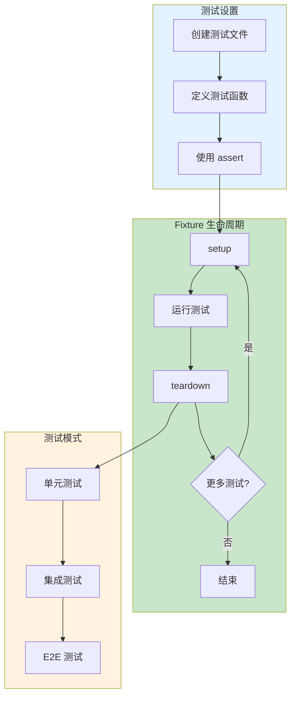

# L19: Pytest 完整实战 — 从单元测试到 CI/CD

> **课程编号**: L19
> **所属阶段**: Stage 2 - 现代工程
> **预计时长**: 5-6 小时
> **难度**: ⭐⭐⭐⭐☆（中高级）
> **前置课程**: L01, L16
> **版本**: v1.0
> **最后更新**: 2026-07-23
> **核心版本**: Python 3.13


## 📚 前置知识



**学习本课程前，你应该掌握：**

- **L06**: 函数
- **L07**: 模块与包
- **L09**: 异常处理
- **L10**: 面向对象基础
- **L12**: 类型注解
- **L15**: 上下文管理器

**如果你还没有学习以上课程，建议先完成前置课程。**

---

## 课程概览

本课程将测试与自动化完整融合，分为两大部分：

**第一部分（3-4h）**：Pytest 测试工程基础  
**第二部分（2-3h）**：CI/CD 自动化集成  
**连接章节**：Pytest 与 CI/CD 的完整工作流

测试不是"写完代码后的事"。它是工程质量的基石。而 CI/CD 则让测试真正发挥作用——确保每次代码变更都经过自动验证。

---

# 第一部分：Pytest 测试工程基础

## 第一章：为什么需要测试

#

### 测试模式对比

#### 方式 1: 传统 assert

```python
def test_add():
    result = add(2, 3)
    assert result == 5
```

#### 方式 2: pytest assert 改进

```python
def test_add():
    # pytest 自动显示表达式
    assert add(2, 3) == 5
    # 失败时显示: AssertionError: assert 6 == 5
```

#### 方式 3: 参数化测试

```python
@pytest.mark.parametrize("a,b,expected", [
    (1, 2, 3),
    (0, 0, 0),
    (-1, 1, 0),
])
def test_add_parametrized(a, b, expected):
    assert add(a, b) == expected
```

## 1.1 没有测试的后果

```python
# 改了一个函数，不知道会影响哪里
def calculate_discount(price: float, level: str) -> float:
    if level == "vip":
        return price * 0.8
    elif level == "member":
        return price * 0.9
    return price
```

改 `0.8` 到 `0.75`，怎么知道不会影响其他调用方？——**测试告诉你**。

### 1.2 AAA 模式

```python
# AAA: Arrange-Act-Assert
def test_discount_vip():
    # Arrange: 准备数据
    price = 100.0
    level = "vip"

    # Act: 执行被测函数
    result = calculate_discount(price, level)

    # Assert: 验证结果
    assert result == 80.0
```

这是最基础的测试模式。**每个测试只测一个行为**。

## 第二章：pytest 基础

### 2.1 第一个测试

```python
# test_app.py

def test_answer():
    assert 42 == 42

def test_string():
    assert "hello".upper() == "HELLO"
```

```bash
pytest test_app.py -v
# test_answer PASSED
# test_string PASSED
```

### 2.2 异常测试

```python
import pytest

def test_divide_by_zero():
    with pytest.raises(ZeroDivisionError):
        1 / 0

def test_invalid_input():
    with pytest.raises(ValueError, match="invalid"):
        int("not_a_number")
```

`pytest.raises` 断言特定异常被抛出。`match` 参数验证异常消息。

### 2.3 浮点数比较

```python
def test_float():
    assert 0.1 + 0.2 == pytest.approx(0.3, rel=1e-9)
```

`pytest.approx` 处理浮点精度问题。

## 第三章：fixture — 测试依赖管理

### 3.1 基本 fixture

```python
import pytest

@pytest.fixture
def sample_data():
    """提供测试用的数据。"""
    return {"name": "Alice", "age": 30, "scores": [85, 90, 78]}

def test_average_score(sample_data):
    scores = sample_data["scores"]
    assert sum(scores) / len(scores) == pytest.approx(84.33, rel=1e-2)
```

fixture 是 pytest 最强大的功能。它解决了测试数据重复创建的痛点。

### 3.2 带清理的 fixture

```python
@pytest.fixture
def temp_file():
    import tempfile
    import os
    f = tempfile.NamedTemporaryFile(suffix=".txt", mode="w", delete=False)
    f.write("test data")
    f.close()
    yield f.name  # 测试函数在这里执行
    os.unlink(f.name)  # 测试结束后清理
```

`yield` 之前的代码是 setup，之后的代码是 teardown。

### 3.3 fixture 作用域

```python
@pytest.fixture(scope="session")  # 整个测试会话只创建一次
def db_connection():
    return create_connection()

@pytest.fixture(scope="module")   # 每个模块创建一次
def module_data():
    return load_data()

@pytest.fixture(scope="function") # 默认作用域，每个测试函数都创建
def fresh_user():
    return User(name="test")
```

作用域越大，性能越好，但测试间耦合也越大。

## 第四章：parametrize — 数据驱动测试

### 4.1 基础参数化

```python
import pytest

@pytest.mark.parametrize("input_val,expected", [
    ("hello", 5),
    ("", 0),
    ("python", 6),
])
def test_string_length(input_val, expected):
    assert len(input_val) == expected
```

一个参数化测试 = 多个测试用例。再也不用写 10 个几乎一样的测试函数。

### 4.2 多参数组合

```python
@pytest.mark.parametrize("a,b,expected", [
    (1, 2, 3),
    (-1, 1, 0),
    (0, 0, 0),
    (100, -50, 50),
])
def test_add(a, b, expected):
    assert a + b == expected
```

### 4.3 fixture + parametrize

```python
@pytest.fixture
def calculator():
    return Calculator()

@pytest.mark.parametrize("a,b,expected", [
    (2, 3, 5),
    (0, 0, 0),
])
def test_calculator_add(calculator, a, b, expected):
    assert calculator.add(a, b) == expected
```

fixture 和 parametrize 可以叠加使用。

## 第五章：mock — 隔离外部依赖

### 5.1 Mock HTTP 请求

```python
from unittest.mock import patch, Mock
import pytest
import requests

def fetch_data(url: str) -> dict:
    resp = requests.get(url, timeout=5)
    return resp.json()

@patch("requests.get")
def test_fetch_data(mock_get):
    # 配置 mock 返回值
    mock_response = Mock()
    mock_response.json.return_value = {"status": "ok"}
    mock_get.return_value = mock_response

    result = fetch_data("https://api.example.com/data")
    assert result["status"] == "ok"
    mock_get.assert_called_once()
```

mock 让你在不依赖真实网络的情况下测试网络代码。

### 5.2 Mock 数据库

```python
from unittest.mock import AsyncMock, patch

async def get_user(db, user_id: int) -> dict:
    return await db.fetch_one("SELECT * FROM users WHERE id = ?", user_id)

@pytest.mark.asyncio
async def test_get_user():
    mock_db = AsyncMock()
    mock_db.fetch_one.return_value = {"id": 1, "name": "Alice"}

    result = await get_user(mock_db, 1)
    assert result["name"] == "Alice"
```

`AsyncMock` 用于异步函数的 mock。

### 5.3 monkeypatch 内置行为

```python
def test_monkeypatch_env(monkeypatch):
    monkeypatch.setenv("DATABASE_URL", "sqlite:///test.db")
    assert os.getenv("DATABASE_URL") == "sqlite:///test.db"
```

`monkeypatch` 是 pytest 内置的，无需 import。

## 第六章：conftest.py 与测试组织

### 6.1 目录结构

```
project/
├── src/
│   ├── __init__.py
│   ├── models.py
│   └── services.py
├── tests/
│   ├── __init__.py
│   ├── conftest.py        # 全局共享 fixture
│   ├── test_models.py
│   └── test_services.py
```

### 6.2 conftest.py

```python
# tests/conftest.py
import pytest

@pytest.fixture
def sample_user():
    return {"id": 1, "name": "Alice", "email": "alice@example.com"}
```

conftest.py 中的 fixture 自动对该目录下所有测试可见。

### 6.3 测试分层

```text
单元测试:      测试单个函数/方法，mock 外部依赖
集成测试:      测试多个模块协作，需要真实或模拟外部服务
E2E 测试:      从用户视角测试完整流程
```

**黄金比例**：70% 单元 + 20% 集成 + 10% E2E。

## 第七章：覆盖率

```bash
pytest --cov=src tests/ --cov-report=term-missing
```

覆盖率是工具，不是目标。80% 覆盖率比 100% 但只有 `assert True` 好得多。

```python
# ❌ 为了覆盖率而写的假测试
def test_foo():
    assert True  # 无意义

# ✅ 有意义的边界测试
def test_foo_empty_input():
    result = foo("")
    assert result is None
```

---

# 第二部分：CI/CD 自动化集成

## 第八章：为什么需要 CI/CD？

你写好了代码、通过了本地测试、提交了 PR。然后呢？

在没有 CI/CD 的项目中，代码合入后可能：

- 在队友电脑上报错（依赖版本不同、Python 版本不同）
- 忘记格式化，PR Review 被追着改风格
- 有人漏跑测试，bug 流入生产
- 部署靠手 SSH + scp，出错了也不知道

**CI/CD 就是把这些"然后"自动化**。

## 第九章：CI/CD 基础概念

### 9.1 什么是 CI？

CI（Continuous Integration，持续集成）：每次代码推送时，自动拉取代码、安装依赖、运行测试。

```
开发者推送 → GitHub 触发 → 拉取代码 → 安装依赖 → 运行测试 → 报告结果
```

### 9.2 什么是 CD？

CD（Continuous Delivery/Deployment，持续交付/部署）：CI 通过后，自动部署到目标环境。

```
CI 通过 → 构建产物 → 部署到测试环境 → 验收 → 部署到生产
```

### 9.3 GitHub Actions 工作流结构

一个 GitHub Actions 工作流由以下部分组成：

```
.github/workflows/
├── ci.yml        # 测试工作流
├── deploy.yml    # 部署工作流
└── docs.yml      # 文档发布
```

每个工作流文件的结构：

```yaml
name: Python CI # 工作流名称
on: # 触发条件
  push:
    branches: [main]
  pull_request:
    branches: [main]

jobs: # 任务列表
  test: # 任务名称
    runs-on: ubuntu-latest
    steps: # 步骤序列
      - uses: actions/checkout@v4
      - name: Run tests
        run: pytest
```

## 第十章：Python 项目 CI 流水线

### 10.1 触发条件

```yaml
on:
  push:
    branches: [main] # 推送到 main 时触发
  pull_request:
    branches: [main] # 向 main 提 PR 时触发
```

这意味着每次 PR 都会自动运行 CI。

### 10.2 多版本矩阵

```yaml
strategy:
  matrix:
    python-version: ["3.12", "3.13"]
```

矩阵测试会并发运行两次，一次 Python 3.12，一次 Python 3.13。

**为什么需要多版本？**

- 课程代码必须同时在 3.12（企业主流）和 3.13（课程基线）上工作
- 某些依赖在不同 Python 版本上有不同行为
- CI 矩阵是用最小成本覆盖版本兼容性的方案

### 10.3 步骤详解

**步骤 1: 安装 uv**

```yaml
- name: Install uv
  uses: astral-sh/setup-uv@v3
```

GitHub Actions 的 `uses` 关键字加载预构建的 Action。`setup-uv` 在运行器上安装 uv。

**步骤 2: 设置 Python**

```yaml
- name: Set up Python
  run: uv python install ${{ matrix.python-version }}
```

`${{ matrix.python-version }}` 会被替换为当前矩阵行（3.12 或 3.13）。

**步骤 3: 安装依赖**

```yaml
- name: Install dependencies
  run: uv sync --frozen
```

`--frozen` 表示使用已有的 `uv.lock`，不更新。确保 CI 和开发环境使用一模一样的版本。

**步骤 4-7: 质量门**

```yaml
- name: Lint with ruff
  run: uv run ruff check .

- name: Check formatting
  run: uv run ruff format --check .

- name: Type check with mypy
  run: uv run mypy .

- name: Test with pytest
  run: uv run pytest tests/ -v --tb=short
```

这四步构成**质量门**——任何一步失败，CI 标记为 FAILED，阻止不合规代码合入。

### 10.4 观看 CI 运行

1. 推送代码到 GitHub
2. 在仓库页面点击 **Actions** 标签
3. 看到正在运行的工作流
4. 点击查看详细日志

每个步骤的日志会显示：

- ✅ 绿色 — 通过
- ❌ 红色 — 失败（点击查看错误详情）

## 第十一章：CI 最佳实践

### 11.1 速度优化

```yaml
- name: Cache uv cache
  uses: actions/cache@v4
  with:
    path: ~/.cache/uv
    key: uv-${{ runner.os }}-${{ hashFiles('uv.lock') }}
```

缓存 uv 的全局缓存目录，将依赖安装时间从 30 秒降到 3 秒。

### 11.2 分支保护

在 GitHub 仓库设置中（Settings → Branches → Add rule）：

- 勾选 **Require status checks to pass before merging**
- 选择 `test (3.12)` 和 `test (3.13)` 为必需检查
- 这样 PR 在 CI 通过之前无法合入

### 11.3 测试失败的通知

```yaml
- name: Notify on failure
  if: failure() && github.event_name == 'push'
  run: |
    echo "CI failed on ${{ github.ref }}"
    # 可添加 Slack/邮件/钉钉通知
```

`if: failure()` 表示只有在前序步骤失败时才执行。

## 第十二章：扩展 — 文档自动发布

除了测试流水线，还可以自动化文档发布：

```yaml
name: Docs
on:
  push:
    branches: [main]

jobs:
  deploy:
    runs-on: ubuntu-latest
    steps:
      - uses: actions/checkout@v4
      - name: Build docs
        run: |
          uv sync
          uv run mkdocs build
      - name: Deploy to GitHub Pages
        uses: peaceiris/actions-gh-pages@v3
        with:
          github_token: ${{ secrets.GITHUB_TOKEN }}
          publish_dir: ./site
```

## 第十三章：GitHub Actions YAML 语法速览

### 13.1 核心字段

| 字段      | 含义        | 必填 |
| --------- | ----------- | ---- |
| `name`    | 工作流名称  | 否   |
| `on`      | 触发事件    | 是   |
| `jobs`    | 任务集合    | 是   |
| `runs-on` | 运行环境    | 是   |
| `steps`   | 步骤序列    | 是   |
| `uses`    | 复用 Action | 常用 |
| `run`     | 执行命令    | 常用 |

### 13.2 常用触发事件

```yaml
on:
  push:
    branches: [main]
  pull_request:
    branches: [main]
  schedule:
    - cron: "0 8 * * 1"
  workflow_dispatch:
```

### 13.3 环境变量与 Secrets

```yaml
steps:
  - name: Deploy
    env:
      API_KEY: ${{ secrets.API_KEY }}
    run: deploy-script.sh
```

---

# 连接章节：Pytest 与 CI/CD 的完整工作流

## 第十四章：从本地到云端的测试流程

### 14.1 开发者视角

```bash
# 1. 本地开发与测试
pytest tests/ -v                    # 运行所有测试
pytest tests/test_models.py -k user # 只测试特定模块

# 2. 代码质量检查
ruff check .                        # Lint 检查
ruff format --check .               # 格式检查
mypy .                              # 类型检查

# 3. 提交代码
git add .
git commit -m "feat: add user model"
git push origin feature/user-model

# 4. 创建 PR
gh pr create --title "Add user model" --body "..."

# 5. CI 自动运行
# 在 PR 页面看到 CI 状态：✅ All checks passed
```

### 14.2 CI 视角

```yaml
# .github/workflows/ci.yml
name: Python CI

on:
  pull_request:
    branches: [main]

jobs:
  test:
    runs-on: ubuntu-latest
    strategy:
      matrix:
        python-version: ["3.12", "3.13"]

    steps:
      - uses: actions/checkout@v4

      - name: Install uv
        uses: astral-sh/setup-uv@v3

      - name: Set up Python ${{ matrix.python-version }}
        run: uv python install ${{ matrix.python-version }}

      - name: Install dependencies
        run: uv sync --frozen

      - name: Lint with ruff
        run: uv run ruff check .

      - name: Check formatting
        run: uv run ruff format --check .

      - name: Type check with mypy
        run: uv run mypy .

      - name: Test with pytest
        run: uv run pytest tests/ -v --cov=src --cov-report=term-missing

      - name: Upload coverage
        if: matrix.python-version == '3.13'
        uses: codecov/codecov-action@v3
```

### 14.3 完整工作流图

```
┌─────────────────┐
│  开发者本地开发  │
│  编写代码 + 测试 │
└────────┬────────┘
         │
         ▼
┌─────────────────┐
│  git push       │
└────────┬────────┘
         │
         ▼
┌─────────────────┐
│  GitHub 触发 CI │
└────────┬────────┘
         │
         ▼
┌─────────────────────────┐
│  并发运行多版本测试      │
│  Python 3.12 | 3.13     │
└────────┬────────────────┘
         │
         ▼
┌─────────────────────────┐
│  质量门检查             │
│  Lint → Format → Type   │
│  → Test → Coverage      │
└────────┬────────────────┘
         │
    ✅ 通过 │ ❌ 失败
         │
         ▼
┌─────────────────┐      ┌─────────────────┐
│  PR 可以合并     │      │  PR 阻止合并     │
│  触发部署流程    │      │  通知开发者修复  │
└─────────────────┘      └─────────────────┘
```

## 第十五章：实战案例 — 完整项目配置

### 15.1 项目结构

```
my-project/
├── .github/
│   └── workflows/
│       ├── ci.yml           # CI 流水线
│       └── deploy.yml       # 部署流水线
├── src/
│   ├── __init__.py
│   ├── models.py
│   └── services.py
├── tests/
│   ├── __init__.py
│   ├── conftest.py
│   ├── test_models.py
│   └── test_services.py
├── pyproject.toml
├── uv.lock
└── README.md
```

### 15.2 pyproject.toml 配置

```toml
[project]
name = "my-project"
version = "0.1.0"
requires-python = ">=3.12"
dependencies = [
    "fastapi>=0.104.0",
    "sqlalchemy>=2.0.0",
]

[project.optional-dependencies]
dev = [
    "pytest>=7.4.0",
    "pytest-cov>=4.1.0",
    "pytest-asyncio>=0.21.0",
    "ruff>=0.1.0",
    "mypy>=1.7.0",
]

[tool.pytest.ini_options]
testpaths = ["tests"]
python_files = "test_*.py"
python_functions = "test_*"
addopts = "-v --tb=short --strict-markers"

[tool.coverage.run]
source = ["src"]
omit = ["tests/*", "*/migrations/*"]

[tool.coverage.report]
exclude_lines = [
    "pragma: no cover",
    "def __repr__",
    "raise NotImplementedError",
]

[tool.ruff]
line-length = 100
target-version = "py312"

[tool.mypy]
python_version = "3.12"
strict = true
```

### 15.3 完整 CI 配置

```yaml
# .github/workflows/ci.yml
name: Python CI

on:
  push:
    branches: [main]
  pull_request:
    branches: [main]

jobs:
  test:
    runs-on: ubuntu-latest
    strategy:
      fail-fast: false
      matrix:
        python-version: ["3.12", "3.13"]

    steps:
      - name: Checkout code
        uses: actions/checkout@v4

      - name: Install uv
        uses: astral-sh/setup-uv@v3

      - name: Set up Python ${{ matrix.python-version }}
        run: uv python install ${{ matrix.python-version }}

      - name: Cache dependencies
        uses: actions/cache@v4
        with:
          path: ~/.cache/uv
          key: uv-${{ runner.os }}-${{ hashFiles('uv.lock') }}
          restore-keys: |
            uv-${{ runner.os }}-

      - name: Install dependencies
        run: uv sync --frozen --all-extras

      - name: Lint with ruff
        run: uv run ruff check .

      - name: Check formatting
        run: uv run ruff format --check .

      - name: Type check with mypy
        run: uv run mypy src/

      - name: Test with pytest
        run: |
          uv run pytest tests/ -v \
            --cov=src \
            --cov-report=term-missing \
            --cov-report=xml

      - name: Upload coverage to Codecov
        if: matrix.python-version == '3.13'
        uses: codecov/codecov-action@v3
        with:
          file: ./coverage.xml
          fail_ci_if_error: false
```

## 第十六章：小结

### 核心知识点回顾

**Pytest 测试基础：**
- **AAA 模式**: Arrange-Act-Assert，统一测试结构
- **fixture**: `@pytest.fixture` 管理测试依赖，`yield` 做清理
- **parametrize**: `@pytest.mark.parametrize` 数据驱动
- **mock**: `@patch` + `Mock` 隔离外部依赖
- **conftest.py**: 共享 fixture 的层级组织
- **覆盖率**: `pytest --cov=src` 测量，关注有意义断言

**CI/CD 自动化：**
- **CI/CD** = 自动化测试 + 自动化部署
- **GitHub Actions** = YAML 定义工作流
- **矩阵测试** = 多版本并发验证
- **质量门** = lint + format + typecheck + test
- **uv 在 CI 中** = `uv sync --frozen` + `uv run`

### 完整工作流最佳实践

1. **本地开发**：编写代码 → 编写测试 → 运行测试
2. **代码质量**：运行 lint/format/typecheck
3. **提交代码**：git commit → git push
4. **自动化验证**：CI 自动运行所有检查
5. **合并代码**：CI 通过 → Code Review → 合并
6. **持续部署**：main 分支自动部署

### 下一步

- **实战练习**：完成 exercises/ 目录下的练习
- **进阶学习**：探索 pytest 插件生态（pytest-xdist, pytest-timeout）
- **项目应用**：在实际项目中配置完整的测试与 CI/CD 流程

---


### 学习检查清单

完成本课程后，确认你已经：

- [ ] 理解了本课程的核心概念
- [ ] 掌握了主要工具和API的使用
- [ ] 能够独立完成课程练习
- [ ] 可选：通过本课测试 `uv run pytest tests -q`

## 🔗 下一步

[L18: 现代化工具链](../L18-toolchain/README.md)
