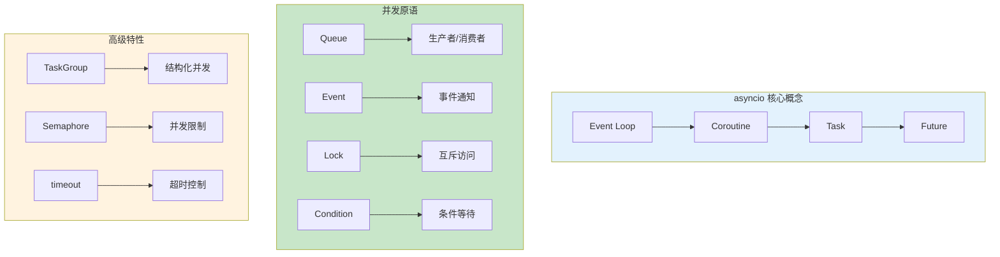

# L21: 异步核心进阶

> **课程编号**: L21
> **所属阶段**: Stage 2 - 现代工程
> **预计时长**: 4 小时
> **难度**: ⭐⭐⭐☆☆（高级）
> **前置课程**: L16 并发编程入门
> **版本**: v1.0
> **最后更新**: 2026-07-23
> **核心版本**: Python 3.13


---

## 前置说明

**本课程不重复 L16 已讲内容**（async/await、asyncio.run、gather、create_task、async with）。如果你对以上概念不熟悉，请先完成 L16：

```python
# L16 已覆盖，不再赘述
async def main():
    result = await asyncio.gather(task1(), task2())  # ✅ 并发执行
    task = asyncio.create_task(task3())               # ✅ 后台任务
    await task
asyncio.run(main())
```

本课程聚焦 L16 之后的内容：**同步原语进阶、Queue 模式、as_completed、TaskGroup、优雅关闭**。

---





### 1.4 为什么需要 asyncio.Lock

**问题场景**: 在多协程环境中，多个协程可能同时访问共享资源。

**为什么需要锁**: 如果没有锁，两个协程可能同时修改同一个变量，导致数据竞争。

```python
# 没有锁的问题
counter = 0
async def increment():
    global counter
    temp = counter  # 读取
    await asyncio.sleep(0)  # 让出控制
    counter = temp + 1  # 写入
    # 可能两个协程都读到 0，都写入 1

# 使用锁的解决方案
lock = asyncio.Lock()
async def safe_increment():
    global counter
    async with lock:
        temp = counter
        await asyncio.sleep(0)
        counter = temp + 1
    # 锁保证同时只有一个协程在修改
```

**什么时候用锁**:
- 修改共享变量时
- 访问外部资源时（如文件、网络）
- 需要保证原子性的操作时

## 模块 1: 同步原语进阶 (1.5h)

### 1.1 asyncio.Queue — 生产者/消费者模式

`asyncio.Queue` 是异步编程中最常用的通信原语，用于协程间的解耦。

#### 基本用法

```python
import asyncio

async def producer(queue: asyncio.Queue, n: int) -> None:
    """生产者：将数据放入队列"""
    for i in range(n):
        await asyncio.sleep(0.1)           # 模拟生产耗时
        await queue.put(i)                  # 放入队列（阻塞直到有空间）
        print(f"生产: {i}")

    # 发送结束信号
    await queue.put(None)

async def consumer(queue: asyncio.Queue, name: str) -> None:
    """消费者：从队列取出数据"""
    while True:
        item = await queue.get()            # 取出数据（阻塞直到有数据）
        if item is None:                    # 收到结束信号
            queue.task_done()
            break
        await asyncio.sleep(0.2)            # 模拟处理耗时
        print(f"消费者 {name} 处理: {item}")
        queue.task_done()

async def main():
    queue: asyncio.Queue[int | None] = asyncio.Queue(maxsize=5)

    # 启动 1 个生产者 + 3 个消费者
    await asyncio.gather(
        producer(queue, 10),
        consumer(queue, "A"),
        consumer(queue, "B"),
        consumer(queue, "C"),
    )

asyncio.run(main())
```

#### Queue 的关键方法

| 方法 | 作用 |
|------|------|
| `await queue.put(item)` | 放入数据，满时阻塞 |
| `item = await queue.get()` | 取出数据，空时阻塞 |
| `queue.task_done()` | 通知一个任务完成（用于 join） |
| `await queue.join()` | 阻塞，直到所有 task_done 被调用 |
| `queue.qsize()` | 当前元素数量 |
| `queue.full()` / `queue.empty()` | 状态检查 |

#### 优先队列

```python
import asyncio
import heapq
from dataclasses import dataclass
from typing import Any

@dataclass(order=True)
class PriorityItem:
    """支持优先级的队列元素"""
    priority: int
    sequence: int                           # 同优先级时按顺序
    data: Any

class PriorityQueue:
    """优先队列实现"""
    def __init__(self):
        self._queue: list[PriorityItem] = []
        self._lock = asyncio.Lock()
        self._not_empty = asyncio.Condition(self._lock)

    async def put(self, item: Any, priority: int = 0) -> None:
        async with self._lock:
            heapq.heappush(
                self._queue,
                PriorityItem(priority, len(self._queue), item)
            )
            self._not_empty.notify()

    async def get(self) -> Any:
        async with self._lock:
            while not self._queue:
                await self._not_empty.wait()
            return heapq.heappop(self._queue).data

async def main():
    queue = PriorityQueue()

    # 高优先级先处理
    await queue.put("普通任务", priority=1)
    await queue.put("紧急任务", priority=0)
    await queue.put("后台任务", priority=2)

    # 取出的顺序：紧急 > 普通 > 后台
    print(await queue.get())  # 紧急任务
    print(await queue.get())  # 普通任务
    print(await queue.get())  # 后台任务

asyncio.run(main())
```

### 1.2 asyncio.Event — 事件通知

`asyncio.Event` 用于协程间的一次性信号通知（"某事已发生"）。

```python
import asyncio

async def waiter(event: asyncio.Event, name: str) -> None:
    """等待事件触发"""
    print(f"{name}: 等待事件...")
    await event.wait()                     # 阻塞，直到 event.set() 被调用
    print(f"{name}: 事件已触发！")

async def setter(event: asyncio.Event) -> None:
    """触发事件"""
    await asyncio.sleep(2)                 # 模拟初始化
    print("触发事件！")
    event.set()                            # 通知所有等待者

async def main():
    event = asyncio.Event()

    # 启动多个等待者
    await asyncio.gather(
        waiter(event, "Waiter-A"),
        waiter(event, "Waiter-B"),
        waiter(event, "Waiter-C"),
        setter(event),
    )

asyncio.run(main())
# 输出：
# Waiter-A: 等待事件...
# Waiter-B: 等待事件...
# Waiter-C: 等待事件...
# 触发事件！
# Waiter-A: 事件已触发！
# Waiter-B: 事件已触发！
# Waiter-C: 事件已触发！
```

**实际场景：优雅关闭信号**

```python
import asyncio

class ShutdownManager:
    """关闭信号管理器"""
    def __init__(self) -> None:
        self.shutdown = asyncio.Event()

    async def wait_for_shutdown(self) -> None:
        """工作协程：等待关闭信号"""
        print("服务运行中，等待关闭信号...")
        await self.shutdown.wait()
        print("收到关闭信号，开始清理...")

    def trigger(self) -> None:
        """触发关闭（从信号处理器调用）"""
        self.shutdown.set()

async def background_worker(manager: ShutdownManager, worker_id: int) -> None:
    """后台工作协程"""
    while not manager.shutdown.is_set():
        print(f"Worker {worker_id} 处理中...")
        await asyncio.sleep(0.5)
    print(f"Worker {worker_id} 已停止")

async def main():
    manager = ShutdownManager()

    # 模拟 2 秒后收到关闭信号
    async def trigger_after_delay():
        await asyncio.sleep(2)
        manager.trigger()

    await asyncio.gather(
        manager.wait_for_shutdown(),
        background_worker(manager, 1),
        background_worker(manager, 2),
        trigger_after_delay(),
    )

asyncio.run(main())
```

### 1.3 asyncio.Condition — 条件变量

`asyncio.Condition` 用于等待某个条件满足后再继续，比 Event 更灵活（可等待条件变化）。

```python
import asyncio

class AsyncBuffer:
    """带条件通知的缓冲区"""
    def __init__(self, maxsize: int = 10) -> None:
        self._queue: list[int] = []
        self._maxsize = maxsize
        self._condition = asyncio.Condition()

    async def push(self, item: int) -> None:
        async with self._condition:
            # 等待队列未满
            while len(self._queue) >= self._maxsize:
                await self._condition.wait()           # 等待 not_full 条件

            self._queue.append(item)
            print(f"push({item}), queue size: {len(self._queue)}")

            if len(self._queue) >= self._maxsize // 2:
                self._condition.notify()               # 通知非空

    async def pop(self) -> int:
        async with self._condition:
            # 等待队列非空
            while not self._queue:
                await self._condition.wait()           # 等待 not_empty 条件

            item = self._queue.pop(0)
            print(f"pop() -> {item}, queue size: {len(self._queue)}")

            if len(self._queue) <= self._maxsize // 2:
                self._condition.notify()               # 通知非满

            return item

async def producer(buffer: AsyncBuffer) -> None:
    for i in range(15):
        await buffer.push(i)
        await asyncio.sleep(0.1)

async def consumer(buffer: AsyncBuffer) -> None:
    for _ in range(15):
        item = await buffer.pop()
        await asyncio.sleep(0.2)

asyncio.run(asyncio.gather(producer(AsyncBuffer()), consumer(AsyncBuffer())))
```

### 1.4 asyncio.Lock — 互斥锁

L16 已有基础用法，这里补充**超时获取锁**和**死锁避免**：

```python
import asyncio

async def try_acquire_with_timeout(lock: asyncio.Lock, timeout: float) -> bool:
    """尝试在超时内获取锁"""
    try:
        async with asyncio.timeout(timeout):
            async with lock:
                await asyncio.sleep(1)
                return True
    except asyncio.TimeoutError:
        return False

async def demonstrate_timeout():
    lock = asyncio.Lock()

    # 获取锁后不释放，模拟长时间占用
    async def hold_lock():
        async with lock:
            await asyncio.sleep(5)  # 占用 5 秒

    async def try_acquire():
        result = await try_acquire_with_timeout(lock, timeout=2.0)
        print(f"获取锁 {'成功' if result else '超时'}")

    await asyncio.gather(
        hold_lock(),                          # 先占用锁
        try_acquire(),                        # 2 秒后尝试获取（超时）
    )
    # 输出：获取锁 超时

asyncio.run(demonstrate_timeout())
```

---

## 模块 2: asyncio.wait / as_completed (0.5h)

### 2.1 asyncio.as_completed — 结果按完成顺序返回

`as_completed` 在任务完成时立即 yield，而非等待所有任务完成：

```python
import asyncio

async def task(name: str, delay: float) -> str:
    print(f"{name} 开始（耗时 {delay}s）")
    await asyncio.sleep(delay)
    print(f"{name} 完成")
    return f"{name}-result"

async def main():
    tasks = [
        asyncio.create_task(task("快速", 0.5)),
        asyncio.create_task(task("中速", 1.5)),
        asyncio.create_task(task("慢速", 3.0)),
    ]

    # ✅ 按完成顺序处理结果（而非提交顺序）
    for coro in asyncio.as_completed(tasks):
        result = await coro
        print(f"收到结果: {result}")

asyncio.run(main())
# 输出顺序：快速完成 -> 中速完成 -> 慢速完成（而非提交顺序）
```

**对比 asyncio.gather vs as_completed**:

```python
async def compare():
    tasks = [task(f"Task-{i}", i * 0.5) for i in range(1, 4)]

    # gather：等待所有完成，返回按提交顺序的结果
    results_gather = await asyncio.gather(*tasks)
    print(f"gather 顺序: {results_gather}")  # [Task-1, Task-2, Task-3]（按提交顺序）

    # as_completed：按实际完成顺序
    results_completed = []
    for coro in asyncio.as_completed(tasks):
        result = await coro
        results_completed.append(result)
    print(f"as_completed 顺序: {results_completed}")  # [Task-1, Task-2, Task-3]（按完成顺序）

asyncio.run(compare())
```

### 2.2 asyncio.wait — 更细粒度的等待控制

`wait` 返回 (done, pending) 元组，比 gather 更灵活：

```python
import asyncio

async def main():
    async def long_task():
        await asyncio.sleep(10)
        return "完成"

    task = asyncio.create_task(long_task())

    # 等待 1 秒后检查状态
    done, pending = await asyncio.wait(
        [task],
        timeout=1.0
    )

    if task in pending:
        print("任务仍在进行中（超时）")
        task.cancel()
        await asyncio.gather(task, return_exceptions=True)
    elif task in done:
        print(f"任务已完成: {task.result()}")

asyncio.run(main())
# 输出：任务仍在进行中（超时）
```

---

## 模块 3: 结构化并发 — TaskGroup (1h)

### 3.1 为什么需要 TaskGroup

L16 的 `create_task + gather` 存在任务泄漏风险：中间抛出异常时，未等待的任务可能丢失。

```python
import asyncio

# ❌ 传统方式：任务泄漏风险
async def risky_approach():
    tasks = [
        asyncio.create_task(worker(1)),
        asyncio.create_task(worker(2)),
        asyncio.create_task(worker(3)),
    ]
    # 如果在 gather 之前抛出异常，任务可能不会被正确清理
    await asyncio.gather(*tasks)

# ✅ TaskGroup：结构化并发，自动管理生命周期
async def safe_approach():
    async with asyncio.TaskGroup() as tg:
        tg.create_task(worker(1))
        tg.create_task(worker(2))
        tg.create_task(worker(3))
    # 退出 with 块时：
    # 1. 等待所有任务完成
    # 2. 如果任何任务失败，自动取消其他任务
    # 3. 抛出 ExceptionGroup
```

### 3.2 TaskGroup 错误处理

```python
import asyncio

async def failing_task():
    await asyncio.sleep(0.5)
    raise ValueError("任务失败")

async def worker(n: int):
    try:
        await asyncio.sleep(n * 0.5)
        return f"Worker-{n} 完成"
    except asyncio.CancelledError:
        print(f"Worker-{n} 被取消")
        raise

async def main():
    try:
        async with asyncio.TaskGroup() as tg:
            tg.create_task(failing_task())  # 会抛出异常
            tg.create_task(worker(1))        # 会被自动取消
            tg.create_task(worker(2))        # 会被自动取消
    except* ValueError as eg:
        # Python 3.11+ 使用 ExceptionGroup
        print(f"捕获到 {len(eg.exceptions)} 个异常:")
        for exc in eg.exceptions:
            print(f"  - {type(exc).__name__}: {exc}")

asyncio.run(main())
```

### 3.3 嵌套 TaskGroup

```python
import asyncio

async def inner_task(n: int) -> str:
    await asyncio.sleep(n * 0.5)
    return f"inner-{n}"

async def outer_task() -> list[str]:
    """外层 TaskGroup"""
    results: list[str] = []

    async with asyncio.TaskGroup() as outer:
        async def process_batch(batch_id: int) -> None:
            # 嵌套 TaskGroup
            async with asyncio.TaskGroup() as inner:
                t1 = inner.create_task(inner_task(batch_id * 2))
                t2 = inner.create_task(inner_task(batch_id * 2 + 1))

            results.append(t1.result())
            results.append(t2.result())

        outer.create_task(process_batch(1))
        outer.create_task(process_batch(2))

    return results

async def main():
    results = await outer_task()
    print(f"所有结果: {results}")

asyncio.run(main())
```

### 3.4 asyncio.timeout / timeout_at — 超时上下文管理器

Python 3.11+ 引入 `asyncio.timeout`，比 `asyncio.wait_for` 更简洁：

```python
import asyncio

async def slow_operation() -> str:
    await asyncio.sleep(5)
    return "完成"

async def main():
    # 方式 1: asyncio.timeout（相对超时）
    try:
        async with asyncio.timeout(2.0):
            result = await slow_operation()
            print(result)
    except asyncio.TimeoutError:
        print("操作超时（2秒）")

    # 方式 2: asyncio.timeout_at（绝对超时）
    try:
        async with asyncio.timeout_at(
            asyncio.get_event_loop().time() + 2.0
        ):
            await slow_operation()
    except asyncio.TimeoutError:
        print("绝对超时")

asyncio.run(main())
```

---

## 模块 4: 生产级模式 (1h)

### 4.1 优雅关闭

```python
import asyncio
import signal
from typing import Set

class GracefulShutdown:
    """优雅关闭管理器"""

    def __init__(self, max_wait: float = 30.0) -> None:
        self.shutdown_event = asyncio.Event()
        self.tasks: Set[asyncio.Task] = set()
        self.max_wait = max_wait

    def setup_signal_handlers(self) -> None:
        """设置信号处理器（SIGTERM/SIGINT）"""
        loop = asyncio.get_event_loop()
        for sig in (signal.SIGTERM, signal.SIGINT):
            loop.add_signal_handler(sig, self.trigger)

    def trigger(self) -> None:
        """触发关闭"""
        if not self.shutdown_event.is_set():
            print("\n收到关闭信号，开始优雅关闭...")
            self.shutdown_event.set()

    async def register(self, coro) -> asyncio.Task:
        """注册需要管理的协程"""
        task = asyncio.create_task(coro)
        self.tasks.add(task)
        task.add_done_callback(self.tasks.discard)
        return task

    async def wait(self) -> None:
        """等待关闭完成"""
        await self.shutdown_event.wait()

    async def shutdown(self) -> None:
        """执行关闭流程"""
        self.trigger()

        # 等待所有任务完成（有超时）
        if self.tasks:
            print(f"等待 {len(self.tasks)} 个任务完成（最多 {self.max_wait}s）...")
            try:
                async with asyncio.timeout(self.max_wait):
                    await asyncio.gather(*self.tasks, return_exceptions=True)
                print("所有任务已完成")
            except asyncio.TimeoutError:
                print(f"超时，强制关闭（剩余 {len(self.tasks)} 个任务）")
                for task in self.tasks:
                    task.cancel()
                await asyncio.gather(*self.tasks, return_exceptions=True)

# 使用示例
async def worker(worker_id: int, shutdown: GracefulShutdown) -> None:
    try:
        while not shutdown.shutdown_event.is_set():
            print(f"Worker {worker_id} 处理任务...")
            await asyncio.sleep(1)
    except asyncio.CancelledError:
        print(f"Worker {worker_id} 被取消")

async def main():
    shutdown = GracefulShutdown(max_wait=10.0)
    shutdown.setup_signal_handlers()

    # 注册工作协程
    for i in range(3):
        await shutdown.register(worker(i, shutdown))

    # 等待关闭信号
    await shutdown.wait()
    await shutdown.shutdown()

asyncio.run(main())
```

### 4.2 Circuit Breaker 熔断器

```python
import asyncio
import time
from enum import Enum
from typing import Callable, TypeVar

T = TypeVar("T")

class CircuitState(Enum):
    CLOSED = "closed"         # 正常
    OPEN = "open"             # 熔断
    HALF_OPEN = "half_open"   # 半开

class CircuitBreaker:
    """熔断器"""

    def __init__(
        self,
        failure_threshold: int = 5,
        recovery_timeout: float = 30.0,
    ) -> None:
        self.failure_threshold = failure_threshold
        self.recovery_timeout = recovery_timeout
        self.state = CircuitState.CLOSED
        self.failure_count = 0
        self.last_failure_time: float | None = None
        self.lock = asyncio.Lock()

    async def call(self, func: Callable[..., T]) -> T:
        async with self.lock:
            # 检查是否应从 OPEN 转为 HALF_OPEN
            if self.state == CircuitState.OPEN:
                if (
                    self.last_failure_time is not None
                    and time.time() - self.last_failure_time
                    > self.recovery_timeout
                ):
                    self.state = CircuitState.HALF_OPEN
                else:
                    raise RuntimeError("Circuit breaker OPEN")

        # 执行调用
        try:
            result = await func()
            await self._on_success()
            return result
        except Exception as e:
            await self._on_failure()
            raise e

    async def _on_success(self) -> None:
        async with self.lock:
            if self.state == CircuitState.HALF_OPEN:
                self.state = CircuitState.CLOSED
            self.failure_count = 0

    async def _on_failure(self) -> None:
        async with self.lock:
            self.failure_count += 1
            self.last_failure_time = time.time()
            if self.failure_count >= self.failure_threshold:
                self.state = CircuitState.OPEN

# 使用示例
async def unreliable_service(fail_rate: float = 0.5) -> str:
    import random
    await asyncio.sleep(0.1)
    if random.random() < fail_rate:
        raise Exception("服务失败")
    return "成功"

async def main():
    breaker = CircuitBreaker(failure_threshold=3, recovery_timeout=5.0)

    for i in range(15):
        try:
            result = await breaker.call(
                lambda: unreliable_service(fail_rate=0.7)
            )
            print(f"请求 {i}: {result}")
        except RuntimeError as e:
            print(f"请求 {i}: 熔断器开启（拒绝请求）")
        except Exception as e:
            print(f"请求 {i}: {e}")

        if i % 5 == 4:
            await asyncio.sleep(1)

asyncio.run(main())
```

### 4.3 指数退避重试

```python
import asyncio
import random
from typing import Callable, TypeVar

T = TypeVar("T")

async def retry_with_backoff(
    func: Callable[[], T],
    max_retries: int = 5,
    initial_delay: float = 0.5,
    backoff_factor: float = 2.0,
    jitter: bool = True,
) -> T:
    """指数退避重试"""
    delay = initial_delay

    for attempt in range(max_retries):
        try:
            return await func()
        except Exception:
            if attempt == max_retries - 1:
                raise
            actual_delay = delay * (0.5 + random.random()) if jitter else delay
            print(f"重试 {attempt + 1}/{max_retries}，等待 {actual_delay:.2f}s")
            await asyncio.sleep(actual_delay)
            delay = min(delay * backoff_factor, 30.0)

async def main():
    call_count = 0

    async def flaky_operation() -> str:
        nonlocal call_count
        call_count += 1
        if call_count < 4:
            raise ValueError(f"失败（第 {call_count} 次）")
        return "成功"

    try:
        result = await retry_with_backoff(
            flaky_operation,
            max_retries=5,
            initial_delay=0.5,
            backoff_factor=2.0,
        )
        print(f"最终结果: {result}（共调用 {call_count} 次）")
    except Exception as e:
        print(f"最终失败: {e}")

asyncio.run(main())
```

---

## 关键要点

| 主题 | 关键 API |
|------|----------|
| 生产者/消费者 | `asyncio.Queue.put/get/task_done/join` |
| 事件通知 | `asyncio.Event.wait/set` |
| 条件变量 | `asyncio.Condition.wait/notify` |
| 互斥锁（超时） | `asyncio.Lock` + `asyncio.timeout` |
| 完成顺序 | `asyncio.as_completed` |
| 等待子集 | `asyncio.wait(timeout=...)` |
| 结构化并发 | `asyncio.TaskGroup` |
| 超时管理 | `asyncio.timeout` / `timeout_at` |

---


### 学习检查清单

完成本课程后，确认你已经：

- [ ] 理解了本课程的核心概念
- [ ] 掌握了主要工具和API的使用
- [ ] 能够独立完成课程练习
- [ ] 可选：通过本课测试 `uv run pytest tests -q`


### ⚠️ 常见陷阱

#### 陷阱 1: 在锁外执行异步操作

```python
# ❌ 错误：在锁内执行耗时操作，导致其他协程长时间等待
async with lock:
    await fetch_data()  # 阻塞整个锁
    await process_data()  # 继续阻塞

# ✅ 正确：只锁住关键区域
data = await fetch_data()  # 在锁外获取数据
await process_data()
async with lock:
    shared_result = data  # 只在锁内更新共享状态
```

#### 陷阱 2: 忘记释放锁

```python
# ❌ 错误：异常导致锁永远不释放
lock = asyncio.Lock()
await lock.acquire()
try:
    await risky_operation()  # 如果这里抛异常，锁永远不会释放
finally:
    pass  # 忘记释放！

# ✅ 正确：使用 async with 自动管理
async with lock:
    await risky_operation()  # 自动释放锁
```


---

## 📖 课程总结

### 核心知识点

本课程深入学习了 asyncio 的高级同步原语：

| 原语 | 用途 | 关键方法 |
|------|------|----------|
| `asyncio.Queue` | 生产者/消费者模式 | `put()`, `get()`, `task_done()`, `join()` |
| `asyncio.Event` | 一次性事件通知 | `set()`, `wait()`, `is_set()` |
| `asyncio.Condition` | 条件等待 | `wait()`, `notify()`, `notify_all()` |
| `asyncio.Lock` | 互斥访问 | `acquire()`, `release()`, `async with` |
| `asyncio.Semaphore` | 并发数量限制 | `acquire()`, `release()` |

### 关键要点

1. **Queue 是最常用的** - 适合大多数协程间通信场景
2. **Event 用于一次性信号** - 一旦 set，不能 reset
3. **Condition 适合复杂等待** - 等待特定条件满足
4. **Lock 要简短持有** - 只锁关键区域，避免长时间阻塞
5. **Semaphore 限制并发** - 控制资源访问数量

### 学习收获

完成本课程后，你已经：

- ✅ 掌握了 asyncio 的高级同步原语
- ✅ 能够构建复杂的异步通信模式
- ✅ 理解了常见陷阱并能避免
- ✅ 为构建生产级异步应用打下基础


---

## 📝 本章总结

### 核心知识点

| 模块 | 核心内容 | 关键工具 |
|------|----------|----------|
| **本课程** | 异步核心进阶 | pytest |

### 关键要点

1. 理解本课程的核心概念
2. 掌握主要工具和 API 的使用
3. 能够独立完成课程练习

### 学习收获

完成本课程后，你已经：
- ✅ 掌握了本课程的核心概念
- ✅ 能够运用所学知识解决实际问题
- ✅ 为后续学习打下坚实基础


## 下一步

[//]: # (L20 装饰器)
[L20: 装饰器深度探索](../L20-decorators/README.md)
