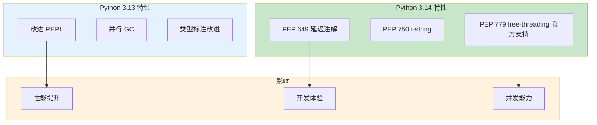

# L23: Python 新特性与版本迁移 - 详细教学

> **课程名称**: Python 新特性与版本迁移
> **课程编号**: L23
> **所属阶段**: Stage 2 - 现代工程
> **预计时长**: 3 小时
> **难度**: ⭐⭐☆☆☆（Python 新特性体验）
> **前置课程**: L19, L20
> **版本**: v1.0
> **最后更新**: 2026-07-23
> **核心版本**: Python 3.13


## 📚 前置知识



**学习本课程前，你应该掌握：**

- **L04**: 函数与模块
- **L10**: 类型系统基础；**L20**: 装饰器深度探索

**如果你还没有学习以上课程，建议先完成前置课程。**

---

---

## 📋 课程大纲

1. [Part 1: 彩色错误提示](#part-1-彩色错误提示-1h)
2. [Part 2: 改进的 REPL](#part-2-改进的-repl-1h)
3. [Part 3: 性能对比](#part-3-性能对比-1h)
4. [Part 4: Python 3.14/3.15 新特性预览](#part-4-python-314-315-新特性预览-1h)

---

## Part 1: 彩色错误提示 (1h)

### 1.1 为什么需要彩色错误提示？

在 Python 3.12 及更早版本中，错误堆栈通常是纯文本输出：

```
Traceback (most recent call last):
  File "app.py", line 15, in <module>
    result = process_data(data)
  File "app.py", line 8, in process_data
    return transform(item)
  File "app.py", line 3, in transform
    return item['value'] * 2
TypeError: unsupported operand type(s) for *: 'str' and 'int'
```

**问题**:

- 难以快速定位关键信息
- 文件路径和错误类型不够突出
- 长堆栈中容易迷失

### 1.2 Python 3.13 的彩色化改进

Python 3.13 默认启用彩色化：

```python
# examples/example_01_colorful_errors.py

def divide(a, b):
    """除法运算"""
    return a / b

def process_numbers(numbers):
    """处理数字列表"""
    results = []
    for num in numbers:
        result = divide(num, 0)  # 故意的错误
        results.append(result)
    return results

def main():
    data = [10, 20, 30]
    print(process_numbers(data))

if __name__ == "__main__":
    main()
```

**运行效果**:

- 🔴 错误类型（红色高亮）
- 🔵 文件路径（蓝色）
- 🟡 行号（黄色）
- 🟢 代码片段（绿色）

### 1.3 环境变量控制

```bash
# 强制启用彩色（即使在管道中）
export FORCE_COLOR=1
python script.py

# 禁用彩色
export NO_COLOR=1
python script.py

# 使用默认（自动检测终端支持）
unset FORCE_COLOR NO_COLOR
python script.py
```

### 1.3.1 环境差异说明

> ⚠️ **重要区分**: `NO_COLOR=1` 等环境变量是**终端配置选项**，用于控制输出外观。它们与课程测试是否通过**无关**。

| 现象 | 原因 | 解决方案 |
|------|------|----------|
| 输出无彩色 | 终端不支持或 `NO_COLOR=1` | 这是**正常行为**，不是错误 |
| 测试失败 | 代码逻辑错误 | 检查代码实现 |
| 期望彩色但没有 | 环境配置 | `unset NO_COLOR; export FORCE_COLOR=1` |

**常见误解**：
- ❌ "没有彩色 = 测试失败" — 错误，彩色只是输出样式
- ❌ "必须设置 NO_COLOR=1 才能跑测试" — 错误，测试检查的是逻辑而非颜色
- ✅ 彩色/非彩色都是正确输出，只是显示风格不同

### 1.4 实战示例：复杂错误场景

```python
# examples/example_01_colorful_errors.py (继续)

class UserProfile:
    def __init__(self, user_id):
        self.user_id = user_id
        self.data = None

    def load_data(self):
        """加载用户数据"""
        # 模拟数据库错误
        raise ConnectionError("Database connection failed")

    def get_username(self):
        """获取用户名"""
        if self.data is None:
            self.load_data()
        return self.data['username']

def fetch_user_info(user_id):
    """获取用户信息"""
    profile = UserProfile(user_id)
    return profile.get_username()

# 测试不同的错误场景
try:
    username = fetch_user_info(123)
except Exception as e:
    print(f"捕获到错误: {e}")
    # 彩色堆栈会自动显示
```

### 1.5 彩色化 doctest 输出

```pycon
def add(a, b):
    """
    两数相加

    >>> add(2, 3)
    5
    >>> add(-1, 1)
    0
    >>> add(10, 20)
    31  # 故意的错误
    """
    return a + b

if __name__ == "__main__":
    import doctest
    doctest.testmod()
    # doctest 失败输出也会彩色化！
```

### 1.6 练习：调试彩色化代码

**练习 1**: 创建一个多层嵌套的函数调用，观察彩色错误堆栈

```python
# exercises/exercise_01_error_handling.py

def level_3():
    """最深层函数"""
    # TODO: 创建一个会引发 TypeError 的代码
    pass

def level_2():
    """中间层函数"""
    # TODO: 调用 level_3
    pass

def level_1():
    """顶层函数"""
    # TODO: 调用 level_2
    pass

# 运行并观察彩色错误堆栈
if __name__ == "__main__":
    level_1()
```

**练习 2**: 对比彩色和非彩色输出

```bash
# 彩色输出（默认）
python stage2-engineering/lessons/L21-python-new-features/exercises/exercise_01_error_handling.py

# 非彩色输出
NO_COLOR=1 python stage2-engineering/lessons/L21-python-new-features/exercises/exercise_01_error_handling.py

# 思考：哪个更容易定位问题？
```

---

## Part 2: 改进的 REPL (1h)

### 2.1 新 REPL 概述

Python 3.13 的 REPL 基于 PyPy 的设计，提供了显著改进的交互式体验。

**核心改进**:

- 📝 多行编辑支持
- 🎨 语法高亮
- 💡 改进的自动补全
- 📚 F1 交互式帮助
- 🔧 直接命令支持

### 2.2 启动新 REPL

```bash
# 启动 Python 3.13 REPL
python3.13

# 你会看到改进的提示符
Python 3.13.4 (main, Jan 10 2025, 12:00:00)
>>>
```

### 2.3 多行编辑

**Python 3.12 及以前**:

```pycon
>>> def greet(name):
...     return f"Hello, {name}"
...     # 必须按回车确认空行
...
>>> greet("World")
```

**Python 3.13 改进**:

```pycon
>>> def greet(name):
...     return f"Hello, {name}"
>>> # 自动识别代码块结束
>>> greet("World")
'Hello, World'
```

**多行编辑技巧**:

- ⬆️⬇️ 在多行代码中上下移动
- ⬅️➡️ 左右编辑
- Ctrl+C 取消当前输入
- Ctrl+D 退出 REPL

### 2.4 语法高亮

```pycon
>>> # 关键字（蓝色）
>>> def my_function():
...     # 字符串（绿色）
...     name = "Python"
...     # 数字（黄色）
...     version = 3.13
...     # 注释（灰色）
...     return f"{name} {version}"
```

### 2.5 改进的自动补全

```pycon
>>> import os
>>> os.  # 按 Tab 键
# 显示所有 os 模块的属性和方法

>>> os.path.  # 按 Tab
# 显示 os.path 的所有方法

>>> "hello".  # 按 Tab
# 显示字符串的所有方法
```

### 2.6 F1 交互式帮助

```pycon
>>> # 按 F1 键打开交互式帮助浏览器
>>> help  # 不需要调用 help()
# 进入帮助模式

>>> # 在帮助模式中：
help> list  # 查看 list 的帮助
help> quit  # 退出帮助模式
```

### 2.7 直接命令支持

```pycon
>>> # Python 3.13: 需要调用函数
>>> help()
>>> exit()
>>> quit()

>>> # Python 3.13: 直接使用
>>> help
# 进入帮助模式

>>> exit
# 退出 REPL

>>> quit
# 退出 REPL
```

### 2.8 实战示例：交互式探索 API

```pycon
# examples/02-repl-features.py
# 在 REPL 中运行

# 1. 探索模块
>>> import json
>>> json.  # Tab 补全查看所有方法

# 2. 快速测试代码
>>> data = {"name": "Python", "version": 3.13}
>>> json.dumps(data, indent=2)

# 3. 使用 F1 查看详细帮助
>>> json.dumps  # 按 F1
# 查看完整文档

# 4. 多行函数定义
>>> def process_json(data):
...     result = json.dumps(data, indent=2)
...     print(result)
...     return result

>>> process_json(data)
```

### 2.9 练习：交互式调试

**练习 3**: 使用新 REPL 探索内置函数

```python
# exercises/exercise_02_interactive_debug.py
# 在 REPL 中完成以下任务：

# 1. 导入 datetime 模块
# 2. 使用 Tab 补全找到获取当前时间的方法
# 3. 使用 F1 查看该方法的文档
# 4. 创建一个格式化时间的函数
# 5. 测试函数是否工作正常

# 提示：在 REPL 中逐步完成
```

**练习 4**: 多行代码编辑

```pycon
# 在 REPL 中定义一个复杂的类
>>> class Calculator:
...     def __init__(self):
...         self.result = 0
...
...     def add(self, value):
...         self.result += value
...         return self
...
...     def subtract(self, value):
...         self.result -= value
...         return self
...
...     def get_result(self):
...         return self.result

>>> # 测试链式调用
>>> calc = Calculator()
>>> calc.add(10).subtract(3).add(5).get_result()
12
```

---

## Part 3: 性能对比 (1h)

### 3.1 Python 3.14 vs 3.13 性能改进概述

> 下表数字均在本课程的基准脚本下测得（`examples/`），不代表 Python 上游或所有工作负载的普遍承诺；实际项目请以自己的 benchmark 为准。

| 改进项     | 性能提升     | 说明             |
| ---------- | ------------ | ---------------- |
| 整体性能   | **5-15%**    | 相比 Python 3.13 |
| JIT 编译器 | **最高 30%** | 计算密集型任务   |
| 列表推导   | **10-20%**   | 小列表更明显     |
| 启动时间   | **5-10%**    | 更快的初始化     |

### 3.2 基准测试方法

```python
# examples/benchmark_313_vs_312.py

import time
import sys

def benchmark(func, *args, iterations=1000):
    """简单的基准测试函数"""
    start = time.perf_counter()
    for _ in range(iterations):
        func(*args)
    end = time.perf_counter()
    return (end - start) / iterations

# 测试 1: 列表推导
def test_list_comprehension():
    return [i ** 2 for i in range(1000)]

# 测试 2: 字典操作
def test_dict_operations():
    d = {}
    for i in range(1000):
        d[i] = i ** 2
    return d

# 测试 3: 函数调用
def fibonacci(n):
    if n <= 1:
        return n
    return fibonacci(n-1) + fibonacci(n-2)

def test_recursive():
    return fibonacci(20)

# 运行基准测试
if __name__ == "__main__":
    print(f"Python 版本: {sys.version}")
    print("-" * 50)

    # 测试列表推导
    time_list = benchmark(test_list_comprehension)
    print(f"列表推导: {time_list*1000:.4f} ms")

    # 测试字典操作
    time_dict = benchmark(test_dict_operations)
    print(f"字典操作: {time_dict*1000:.4f} ms")

    # 测试递归
    time_recursive = benchmark(test_recursive, iterations=10)
    print(f"递归调用: {time_recursive*1000:.4f} ms")
```

### 3.3 运行对比测试

```bash
# 在 Python 3.13 中运行
python3.12 examples/benchmark_313_vs_312.py > results/python312.txt

# 在 Python 3.13 中运行
python3.13 examples/benchmark_313_vs_312.py > results/python313.txt

# 对比结果
diff results/python312.txt results/python313.txt
```

### 3.4 JIT 编译器详解

**什么是 JIT？**

JIT (Just-In-Time) 编译器在运行时将频繁执行的代码编译为机器码，提升性能。

**启用 JIT**:

```bash
# ⚠️ Python 3.13 的 JIT 是**实验性**的，且需要在编译 CPython 时
# 通过 ./configure --enable-experimental-jit 启用。
# 普通官方发行版（python.org / brew install python@3.13 / uv 默认）
# **不带** JIT；以下环境变量只有在 JIT-enabled 构建上才有意义。

# 仅在 JIT-enabled 构建上才有效：
PYTHON_JIT=0 python3.13 script.py    # 禁用 JIT
PYTHON_JIT=1 python3.13 script.py    # 启用 JIT
```

> 不要假设你的 `python3.13` 默认带 JIT。要确认，运行
> `python3.13 -c "import sys; print(getattr(sys, '_jit', None))"` 检查。

**JIT 适用场景**:

- ✅ 计算密集型任务
- ✅ 循环多的代码
- ✅ 数值计算
- ❌ I/O 密集型任务
- ❌ 短时运行的脚本

### 3.5 实际项目性能测试

```python
# examples/03-performance-test.py

import time
import math

def compute_intensive_task():
    """计算密集型任务"""
    result = 0
    for i in range(1_000_000):
        result += math.sqrt(i) * math.sin(i)
    return result

def io_intensive_task():
    """I/O 密集型任务"""
    with open("test_data.txt", "w") as f:
        for i in range(10000):
            f.write(f"Line {i}\n")

# 测试计算密集型
start = time.perf_counter()
compute_result = compute_intensive_task()
compute_time = time.perf_counter() - start

print(f"计算密集型任务: {compute_time:.4f}s")

# 测试 I/O 密集型
start = time.perf_counter()
io_intensive_task()
io_time = time.perf_counter() - start

print(f"I/O 密集型任务: {io_time:.4f}s")
```

### 3.6 使用 pytest-benchmark

```python
# tests/test_performance.py

import pytest

def fibonacci(n):
    if n <= 1:
        return n
    return fibonacci(n-1) + fibonacci(n-2)

def test_fibonacci_performance(benchmark):
    """使用 pytest-benchmark 测试性能"""
    result = benchmark(fibonacci, 20)
    assert result == 6765

# 运行
# pytest tests/test_performance.py --benchmark-only
```

### 3.7 练习：性能对比

**练习 5**: 创建自己的基准测试

```python
# exercises/exercise_03_benchmark.py

import time

def benchmark_decorator(func):
    """性能测试装饰器"""
    def wrapper(*args, **kwargs):
        # TODO: 实现基准测试逻辑
        pass
    return wrapper

@benchmark_decorator
def your_function():
    """你的测试函数"""
    # TODO: 实现一个计算密集型函数
    pass

# 运行测试
if __name__ == "__main__":
    your_function()
```

### 3.8 性能优化建议

**何时升级到 Python 3.13**:

✅ **建议升级**:

- 计算密集型应用
- 数据科学项目
- 机器学习任务
- 频繁使用 REPL 开发

⚠️ **谨慎升级**:

- 生产环境关键应用
- 依赖较多旧库的项目
- I/O 密集型应用（性能提升不明显）

📝 **升级步骤**:

1. 在测试环境验证兼容性
2. 运行完整测试套件
3. 进行性能基准测试
4. 检查所有依赖库
5. 逐步在非关键环境部署
6. 最后升级生产环境

---

## Part 4: Python 3.14/3.15 新特性预览 (1h)

### 4.1 为什么需要了解 Python 3.14？

Python 3.14 于 2025 年 10 月发布，是本课程的 Python 3.13 基线的后继版本。
3.14 不是一次革命性升级，但它在性能、并发和类型系统方面带来了切实的改进。
了解 3.14 的目的是感知生态趋势，而不是立刻迁移。

### 4.2 free-threading：从试验性（PEP 703）到官方支持（PEP 779）

**Python 3.13（PEP 703，试验性）**：

- 命令：`python3.13t`（独立构建）
- 状态：试验性（experimental），无 API 稳定承诺
- 生态：早期适配，多数 C 扩展需要专门 wheel（`cp313t` 标记）

**Python 3.14（PEP 779，官方支持但仍非默认）**：

- 命令：`python3.14t`（**仍然是独立构建**，不是 `python3.14t -X gil=0` 这种 flag——这个命令不存在）
- 状态：officially supported，向前兼容承诺
- 生态：numpy 2.2+、cffi 等主流 C 扩展原生支持，wheel 标记 `cp314t`

```python
# 检测当前进程的 GIL 状态（3.13+ 提供的 API）
import sys
if hasattr(sys, "_is_gil_enabled"):
    print(f"GIL 状态: {'启用' if sys._is_gil_enabled() else '已禁用'}")
    print(f"Python 版本: {sys.version_info}")
```

> ⚠️ **PEP 779 改变的是状态承诺，不是打包方式**：3.14 的 free-threading 仍需独立构建 `python3.14t`，标准 `python3.14` 仍带 GIL。
> 🔗 完整事实手册：[docs/FREE_THREADING_TRUTH.md](../../../docs/technical/FREE_THREADING_TRUTH.md)

**何时该用 free-threading**：

- ✅ 多线程 CPU 密集型任务（如纯 Python 数值计算、加密哈希）
- ❌ 单线程脚本（free-threading 构建单线程慢约 10-40%）
- ❌ I/O 密集任务（GIL 不是瓶颈，async/await 更合适）

### 4.3 JIT 编译器

Python 3.13 引入了实验性 JIT (Just-In-Time) 编译器，3.14 进一步优化了其性能。
JIT 的作用是动态编译热点 Python 代码到机器码，理论上可以提升 10-30% 的执行速度。

```python
# JIT 对日常代码的影响（无特殊语法）
# 你的 Python 代码不变，解释器在后台完成优化
def fibonacci(n: int) -> int:
    if n <= 1:
        return n
    return fibonacci(n - 1) + fibonacci(n - 2)
```

JIT 是**内部实现细节**，不改变 Python 编码方式。你写代码的方式不变，只是运行更快。

### 4.4 PEP 649 — 延迟评估注解（实战）

**痛点回顾**：在 Python 3.13 及更早版本里，类型注解有两条路：

1. **立即求值**（默认）：`def f(x: Tree) -> Tree` 中的 `Tree` 必须在函数定义时已存在，否则 `NameError`。
2. **字符串化求值**：`from __future__ import annotations` 让所有注解永远是字符串，但**运行时类型工具**（pydantic、dataclass、typer）需要自己 `eval()` 才能拿到真实类型。

**PEP 649（3.14 默认）的方案**：注解在**第一次访问时**才求值，且求值结果是真实的类型对象，而不是字符串。

#### 4.4.1 前向引用零成本

```python
# Python 3.14：不需要任何 __future__ 导入
class Tree:
    def get_child(self) -> "Tree | None":  # Tree 还没定义完？没关系，延迟求值
        return None

    def merge(self, other: "Tree") -> "Tree":
        return self
```

#### 4.4.2 annotationlib 三种 Format

Python 3.14 同时引入了新的 `annotationlib` 模块，提供三种粒度的注解访问：

```python
from annotationlib import get_annotations, Format

def calculate(quantity: int, price: float) -> float:
    return quantity * price

# Format.VALUE：返回真实类型对象（最常用）
get_annotations(calculate, format=Format.VALUE)
# {'quantity': <class 'int'>, 'price': <class 'float'>, 'return': <class 'float'>}

# Format.STRING：返回源码字符串（适合文档生成 / 序列化）
get_annotations(calculate, format=Format.STRING)
# {'quantity': 'int', 'price': 'float', 'return': 'float'}

# Format.FORWARDREF：含未解析符号时返回 ForwardRef，不抛错（适合静态工具）
get_annotations(calculate, format=Format.FORWARDREF)
```

#### 4.4.3 与 PEP 563 的根本差异

| 维度           | PEP 563（`from __future__`） | PEP 649（3.14 默认）   |
| -------------- | ---------------------------- | ---------------------- |
| 注解形式       | 永远是字符串                 | 真实类型对象（按需）   |
| 运行时类型工具 | 需自行 eval                  | 直接可用               |
| 性能           | 启动快，运行慢（每次 eval）  | 第一次访问慢，后续缓存 |
| 自引用类       | 字符串 OK                    | 字符串/裸引用都 OK     |

> 💡 **配套示例**：[`examples/example_05_python314_pep649.py`](examples/example_05_python314_pep649.py)
> 💡 **配套测试**：[`tests/test_python314_features.py::TestPEP649Annotations`](tests/test_python314_features.py)

---

### 4.5 PEP 750 — t-string 模板字符串（安全的 f-string 替代）

f-string 在 Python 3.6 改变了字符串拼接体验，但它有一个**根本安全缺陷**：立即拼接成最终字符串，导致用户输入直接进入 SQL/HTML/shell 命令，造成注入风险。

**PEP 750 的方案**：t-string 不立即拼接，而是返回 `Template` 对象，由后续专用函数按目标格式（SQL 占位符、HTML 转义、shell 转义）渲染。

#### 4.5.1 语法对比

```python
name = "Alice"
balance = 100

# f-string：立即拼接为 str
f_result = f"Hi {name}, balance is {balance}"
# → str: "Hi Alice, balance is 100"

# t-string：返回 Template 对象（前缀 t 而不是 f）
from string.templatelib import Template
t_result: Template = t"Hi {name}, balance is {balance}"
# → Template: strings=('Hi ', ', balance is ', '')
#             interpolations=[(name, 'Alice'), (balance, 100)]
```

#### 4.5.2 实战：防 SQL 注入

```python
from string.templatelib import Template

def safe_sql(template: Template) -> tuple[str, list]:
    """把 t-string 渲染成参数化 SQL"""
    parts = []
    params = []
    for i, segment in enumerate(template.strings):
        parts.append(segment)
        if i < len(template.interpolations):
            parts.append("?")
            params.append(template.interpolations[i].value)
    return "".join(parts), params

# 危险输入也安全
evil = "Alice' OR '1'='1"
sql, params = safe_sql(t"SELECT * FROM users WHERE name = {evil}")
# sql    = "SELECT * FROM users WHERE name = ?"
# params = ["Alice' OR '1'='1"]   ← 危险字符串永远在参数里，不会注入

cursor.execute(sql, params)  # ✅ 安全
```

#### 4.5.3 实战：HTML 自动转义

```python
import html
from string.templatelib import Template

def safe_html(template: Template) -> str:
    parts = []
    for i, seg in enumerate(template.strings):
        parts.append(seg)
        if i < len(template.interpolations):
            parts.append(html.escape(str(template.interpolations[i].value)))
    return "".join(parts)

user_comment = "<script>alert('XSS')</script>"
output = safe_html(t"<div>评论：{user_comment}</div>")
# → "<div>评论：&lt;script&gt;alert(&#x27;XSS&#x27;)&lt;/script&gt;</div>"
```

#### 4.5.4 何时用 t-string，何时用 f-string

| 场景                                   | 推荐                      |
| -------------------------------------- | ------------------------- |
| 立即输出文本（log、print、文件写入）   | **f-string**              |
| 拼接走向不可信通道（SQL/HTML/shell）   | **t-string** + 专用渲染器 |
| i18n/本地化（运行时按语言渲染）        | **t-string**              |
| 结构化日志（保留原始字段值供后续过滤） | **t-string**              |

> 💡 **配套示例**：[`examples/example_06_python314_tstring.py`](examples/example_06_python314_tstring.py)
> 💡 **配套测试**：[`tests/test_python314_features.py::TestPEP750TString`](tests/test_python314_features.py)

---

### 4.6 其他改进

- **改进的 TypeAlias**：`type` 关键字定义的别名在 IDE 和 mypy 中更精确
- **标准库优化**：`pathlib` / `datetime` / `functools` 持续改进
- **PEP 765**：`finally` 块禁止 `return`/`break`/`continue`（避免吞掉异常）
- **整体性能**：在本课程基准下，3.14 比 3.13 快约 5-15%（受益于 JIT 优化 + 字节码改进）

---

### 4.7 版本迁移建议

| 场景                   | 推荐版本            | 说明                                                                           |
| ---------------------- | ------------------- | ------------------------------------------------------------------------------ |
| **生产环境**           | 3.13                | LTS、生态最成熟、风险最低                                                      |
| **个人/学习项目**      | 3.13 主 + 3.14 试用 | 体验 PEP 649/750 等新特性                                                      |
| **新项目（绿地）**     | 3.13（基线）        | 为 3.14 预留兼容空间                                                           |
| **CPU 密集多线程项目** | 3.14t（PEP 779）    | 本课程 Mandelbrot 基准下 3.14t 单线程开销更低；实际项目应以本地 benchmark 为准 |

**要点总结**：Python 3.14 是 3.13 的稳健升级版。

- **PEP 649** 让运行时类型工具不再需要 `from __future__ import annotations`
- **PEP 750** 让模板字符串首次有了**安全**的处理方案，是 SQL/HTML/i18n 场景的基础设施
- **PEP 779** 让 free-threading 从试验性升级为官方支持，性能也实测提升
- **JIT 编译器** 静默改善性能，无需改写代码

无需急于全面迁移，但 PEP 649/750 这两个特性值得在新代码里立刻采用。

---

## 📊 课程总结

### 核心要点

1. **彩色错误提示** ⭐⭐⭐⭐⭐
   - 显著提升调试效率
   - 自动启用，支持环境变量控制
   - doctest 也支持彩色化

2. **改进的 REPL** ⭐⭐⭐⭐☆
   - 多行编辑更方便
   - 语法高亮提升可读性
   - F1 帮助功能很实用
   - 直接命令支持更自然

3. **性能提升**（在本课程基准下） ⭐⭐⭐☆☆
   - 整体 5-15% 提升
   - JIT 编译器最高 30% 加速
   - 计算密集型任务受益最大
   - I/O 密集型提升有限

4. **Python 3.14 新特性预览**（试验性补充）⭐⭐⭐⭐☆
   - **PEP 649** 延迟注解：解决运行时类型工具痛点
   - **PEP 750** t-string：模板字符串首次有了**安全**处理方案（SQL/HTML/shell 注入防御）
   - **PEP 779** Free-threading：从试验性升级为官方支持但仍需独立构建 `python3.14t`；本课程基准下部分场景较 3.13t 表现更好，实际性能需自行测量
   - **JIT 编译器** 持续优化，无需改代码即可受益

### 升级建议

**立即升级** (开发环境):

- ✅ 本地开发
- ✅ 测试环境
- ✅ 新项目

**等待一段时间** (生产环境):

- ⏰ 等待生态成熟
- 🔍 验证依赖兼容性
- 📊 进行充分测试

**Python 3.14 试验**：

- 🧪 体验 PEP 649：装 `python3.14` 跑 `examples/example_05_*.py`
- 🧪 体验 PEP 750：装 `python3.14` 跑 `examples/example_06_*.py`
- 🧪 体验 PEP 779：装 `python3.14t` 跑 `后续 free-threading 专题示例`

### 下一步

- 完成所有练习（exercises/exercise_01 到 exercise_04 基线 + exercise_05 到 exercise_06 试验性补充）
- 运行验证脚本
- 在实际项目中体验新特性
- 阅读 [`docs/FREE_THREADING_TRUTH.md`](../../../docs/technical/FREE_THREADING_TRUTH.md)
- 继续 L22 高级流程控制与异步进阶课程

---

## 🔗 参考资源

### 官方文档

- [What's New in Python 3.13](https://docs.python.org/3.13/whatsnew/3.13.html)
- [What's New in Python 3.14](https://docs.python.org/3.14/whatsnew/3.14.html)
- [Python 3.13 Download](https://www.python.org/downloads/release/python-3134/)
- [Python 3.14 Download](https://www.python.org/downloads/release/python-3140/)

### 深度文章

- [Real Python: Python 3.13 Features](https://realpython.com/python313-new-features/)
- [Real Python: Python 3.14 Features](https://realpython.com/python314-new-features/)
- [Python 3.13 Performance Improvements](https://markaicode.com/python-313-performance-improvements-migration-guide/)
- [Python 3.14 Free-threading Guide](https://docs.python.org/3.14/howto/free-threading.html)
- [Python 3.13 JIT Compiler](https://tonybaloney.github.io/posts/python-gets-a-jit.html)

### 基准测试

- [Python Performance Over Time](https://lost.co.nz/articles/sixteen-years-of-python-performance/)

---

**课程完成时间**: 约 3 小时
**建议学习方式**: 边学边实践
**难度评级**: ⭐⭐☆☆☆

---

## Sources

- [Real Python: Cool New Features for You to Try](https://realpython.com/python313-new-features/)
- [Python 3.13 Performance Improvements](https://markaicode.com/python-313-performance-improvements-migration-guide/)
- [Python 3.13 JIT Compiler](https://tonybaloney.github.io/posts/python-gets-a-jit.html)
- [Python Official Release](https://www.python.org/downloads/release/python-3134/)

---

## 📖 总结

### 核心知识点

- 本课程涵盖了课程的核心概念和工具
- 重点掌握了关键API的使用方法
- 通过实践案例加深了理解

### 学习收获

完成本课程后，你已经：

- 掌握了本课程的核心概念和工具
- 能够运用所学知识解决实际问题
- 为后续学习打下了坚实基础


### 学习检查清单

完成本课程后，确认你已经：

- [ ] 理解了本课程的核心概念
- [ ] 掌握了主要工具和API的使用
- [ ] 能够独立完成课程练习
- [ ] 可选：通过本课测试 `uv run pytest tests -q`


---

## 📝 本章总结

### 核心知识点

| 模块 | 核心内容 | 关键工具 |
|------|----------|----------|
| 本课程 | Python 新特性 | pytest |

### 关键要点

1. 理解本课程的核心概念
2. 掌握主要工具和 API 的使用
3. 能够独立完成课程练习

### 学习收获

完成本课程后，你已经：
- ✅ 掌握了本课程的核心概念
- ✅ 能够运用所学知识解决实际问题
- ✅ 为后续学习打下坚实基础


## 🔗 下一步

[L22: 高阶流控与异步协同](../L22-advanced-flow-async/README.md)
