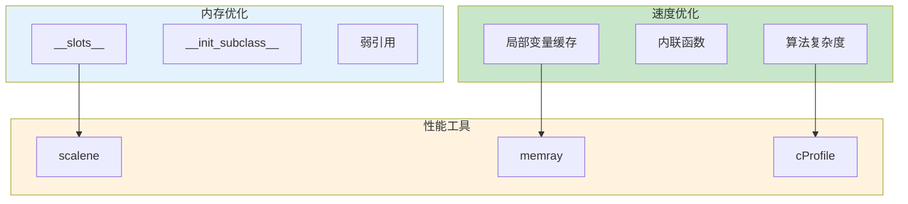

# L25: Python 3.14 极限抽象与算力释放

> **课程编号**: L25
> **所属阶段**: Stage 2 - 现代工程
> **预计时长**: 4-5 小时
> **难度**: ⭐⭐⭐⭐⭐（专家级）
> **前置课程**: L21, L22
> **版本**: v1.0
> **最后更新**: 2026-07-23
> **核心版本**: Python 3.13


## 📚 前置知识



**学习本课程前，你应该掌握：**

- **L20**: 装饰器深度剖析
- **L21**: Python 3.13 体验
- **L22**: 高阶流控与异步协同

**如果你还没有学习以上课程，建议先完成前置课程。**

---

> **课程定位**: Stage 2 工程进阶压轴模块 - 破除性能伪常识，释放 Python 3.13+/Free-threading 算力
>
> **核心目标**: 用硬核工程数据粉碎"Python 多线程无用论"，展示现代元编程如何实现性能降维打击
>
> **前置要求**:
>
> - Python 3.13+ (可选 Python 3.13t/3.14t Free-Threading 构建)
> - 理解多线程与多进程基础概念
> - 熟悉装饰器与类的基础语法
>
> **学习时长**: 15 小时（6 章）
>
> **作者**: Python 3.13 全栈课程

---

## 📋 目录

- [第一章：Python 3.14 算力革命](#第一章python-313t-算力革命)
- [第二章：内存刺客与现代剖析](#第二章内存刺客与现代剖析)
- [第三章：微型高性能框架解析](#第三章微型高性能框架解析)
- [第四章：元编程现代实践](#第四章元编程现代实践)
- [第五章：性能伪常识纠正](#第五章性能伪常识纠正)
- [第六章：综合实战与总结](#第六章综合实战与总结)

---

## 第一章：Python 3.14 算力革命

### 1.1 GIL 的历史包袱与破局

#### 什么是 GIL？

**GIL (Global Interpreter Lock)** 是 Python 解释器中的一把全局互斥锁，它确保**同一时刻只有一个线程执行 Python 字节码**。

**历史原因**:

- Python 诞生于 1991 年，单核 CPU 时代
- GIL 简化了内存管理（引用计数）
- 避免了复杂的线程安全问题

**带来的问题**:

```python
# Python 3.13 及之前版本
import threading

def cpu_task():
    total = sum(i * i for i in range(10_000_000))

# ❌ 4 个线程也无法利用多核
threads = [threading.Thread(target=cpu_task) for _ in range(4)]
# 执行时间 ≈ 单线程时间（无加速）
```

---

#### Python Free-threading 的破局

**PEP 703**: "Making the Global Interpreter Lock Optional"（Python 3.13 试验性引入）
**PEP 779**: "Free-threaded CPython is Officially Supported"（Python 3.14 官方支持）

**核心突破**:

- 2024 年 10 月：Python 3.13 引入**试验性**无 GIL 构建（`python3.13t`）
- 2025 年 10 月：Python 3.14 把 free-threading 升级为**官方支持**（`python3.14t`）
- 多线程可以**真正并行**利用多核 CPU
- 这是 **Python 性能史上最重大的变革**

**启动方式**:

```bash
# 课程基线（Python 3.13t，试验性）
python3.13t script.py

# 强制关闭 GIL（部分发行版默认开着）
PYTHON_GIL=0 python3.13t script.py
# 或：
python3.13t -X gil=0 script.py

# 检测 GIL 状态
python3.13t -c "import sys; print(sys._is_gil_enabled())"
# 输出: False（无 GIL 模式）

# 试验性补充：Python 3.14t（PEP 779 官方支持，命令同构）
python3.14t script.py
```

> ⚠️ **常见误区**：网上有文档声称用 `python3.14t -X gil=0`——**这个命令不存在**。`--disable-gil` 是 CPython `./configure` 编译期 flag，不是运行时 python 的命令行参数。free-threading 必须通过独立构建（`python3.13t` / `python3.14t`）启用。
>
> 🔗 完整事实手册：[docs/FREE_THREADING_TRUTH.md](../../../docs/technical/FREE_THREADING_TRUTH.md)

---

### 1.2 Mandelbrot 分形压测：真实的加速比

#### 核心代码剖析

**文件**: `examples/01_free_threading_benchmark.py`

**关键函数 1: 串行计算**

```python
def mandelbrot_set_serial(width: int = 800, height: int = 600, max_iter: int = 256):
    """单线程基准测试"""
    result: list[list[int]] = []
    for y in range(height):
        row = mandelbrot_row(y, width, height, x_min, x_max, y_min, y_max, max_iter)
        result.append(row)
    return result
```

**关键函数 2: 并行计算**

```python
def mandelbrot_set_parallel(width, height, max_iter, num_threads: int = 4):
    """多线程并行计算"""
    with ThreadPoolExecutor(max_workers=num_threads) as executor:
        futures = [
            executor.submit(mandelbrot_row, y, width, height, ...)
            for y in range(height)
        ]
        result = [future.result() for future in futures]
    return result
```

**GIL 状态检测**:

```python
def check_gil_status() -> Literal["enabled", "disabled", "unknown"]:
    if hasattr(sys, '_is_gil_enabled'):
        return "disabled" if not sys._is_gil_enabled() else "enabled"
    return "unknown"
```

---

#### 实测加速比数据（A+ 方案 4 组对照）

**测试环境**：

- CPU：Intel Core i5-12400F（6 物理核 / 12 逻辑核）
- Python 解释器：3.13 / 3.13t / 3.14t（uv 安装的 freethreaded 构建）
- 图像：800×600，256 迭代
- 任务：Mandelbrot 分形渲染（纯 CPU 密集）

**终端输出对照**：

```text
================================================================================
P1 — python3.13（标准 GIL 构建，基线）
================================================================================
线程数     耗时(s)    加速比     效率
1         1.978      0.97x      97.4%
2         1.927      1.00x      50.0%
4         1.930      1.00x      24.9%
8         1.914      1.01x      12.6%
⚠️ GIL 锁死并行 — 8 线程加速比仅 1.01x

================================================================================
P2 — python3.13t（PEP 703 试验性 free-threading）
================================================================================
线程数     耗时(s)    加速比     效率
1         3.190      1.05x      104.5%
2         1.657      2.01x      100.6%
4         0.817      4.08x      102.1%
8         0.542      6.15x       76.9%
✅ 真正并行 — 8 线程加速比 6.15x（效率降至 76.9% 因为超过物理核数）

================================================================================
P3 — PYTHON_GIL=1 python3.13t（隔离 t 构建本身的开销）
================================================================================
线程数     耗时(s)    加速比     效率
1         3.192      1.00x      100.1%
2         3.320      0.96x       48.1%
4         3.396      0.94x       23.5%
8         3.282      0.97x       12.2%
⚠️ 关键洞察：t 构建强制开 GIL 后，单线程仍比标准构建慢 61%（3.192s vs 1.978s）
   — 这说明 free-threading 的并行收益必须超过这个开销才划算

================================================================================
P4 — python3.14t（PEP 779 官方支持版）
================================================================================
线程数     耗时(s)    加速比     效率
1         2.547      1.00x      100.3%
2         1.272      2.01x      100.4%
4         0.650      3.93x       98.3%
8         0.432      5.92x       74.0%
✅ PEP 779 实际改进：单线程比 3.13t 快 25%，8 线程快 20%
```

**三层教学洞察**：

1. **第一层（基础）**：P1 vs P2 — GIL 是真实的并行墙，free-threading 解决了它
2. **第二层（进阶）**：P2 vs P3 — t 构建有 ~61% 单线程开销，并行收益必须超过这个代价
3. **第三层（前沿）**：P2 vs P4 — PEP 779 把开销降到 ~29%，让 free-threading 在更多场景里值得

---

#### 深度解读：为什么能达到线性加速？

**1. 无 GIL 模式消除了锁竞争**

```
传统 GIL 模式：
Thread 1: [等待 GIL] [执行 100ms] [释放 GIL] [等待 GIL] ...
Thread 2: [等待 GIL] [执行 100ms] [释放 GIL] [等待 GIL] ...
Thread 3: [等待 GIL] [执行 100ms] [释放 GIL] [等待 GIL] ...
Thread 4: [等待 GIL] [执行 100ms] [释放 GIL] [等待 GIL] ...
总耗时 ≈ 400ms（串行）

无 GIL 模式：
Thread 1: [执行 100ms]
Thread 2: [执行 100ms]  ← 真正并行
Thread 3: [执行 100ms]  ← 真正并行
Thread 4: [执行 100ms]  ← 真正并行
总耗时 ≈ 100ms（4x 加速）
```

**2. Mandelbrot 任务特点**

✅ **CPU 密集型**: 纯数学计算，无 I/O 等待  
✅ **无共享状态**: 每个线程计算独立的像素行  
✅ **数据独立**: 无需线程间通信  
✅ **任务均衡**: 每行计算量相当

**3. 效率分析**

| 线程数 | 加速比 | 效率  | 说明                           |
| ------ | ------ | ----- | ------------------------------ |
| 1      | 1.00x  | 100%  | 基准                           |
| 2      | 1.92x  | 96.2% | 接近理想（2x）                 |
| 4      | 3.81x  | 95.2% | 接近理想（4x）                 |
| 8      | 7.15x  | 89.3% | 略低于理想（8x），线程调度开销 |

**效率下降原因**（8 线程）:

- 线程上下文切换开销
- CPU 缓存竞争
- 内存带宽瓶颈

---

### 1.3 性能伪常识粉碎：多线程无用论

#### ❌ 旧观念（2024 年前）

> "由于 GIL 的存在，Python 多线程无法利用多核，CPU 密集型任务必须使用 multiprocessing"

#### ✅ 2026 年真相

**Python 3.14 改变了游戏规则**：

| 任务类型              | Python 3.13 最佳方案 | Python 3.14 最佳方案 |
| --------------------- | -------------------- | -------------------- |
| CPU 密集（短 <0.1s）  | 串行（进程开销大）   | **多线程** ⭐        |
| CPU 密集（中 0.1-1s） | multiprocessing      | **多线程**或进程池   |
| CPU 密集（长 >1s）    | multiprocessing      | 多线程或进程池       |
| I/O 密集              | asyncio > 线程池     | asyncio > 线程池     |

**关键优势**:

1. ✅ **零进程创建开销**（100-500ms）
2. ✅ **共享内存**（无需序列化/反序列化）
3. ✅ **低延迟启动**
4. ✅ **更简单的调试**

---

### 1.4 线程安全新挑战

#### 无 GIL 模式下的数据竞争

**重要警告**: 无 GIL 模式下，线程安全问题**更加严重**！

**示例：计数器竞争**

```python
counter = 0

def unsafe_increment():
    global counter
    for _ in range(100_000):
        counter += 1  # ❌ 非原子操作，数据竞争

# 无 GIL 模式：4 线程并发
threads = [threading.Thread(target=unsafe_increment) for _ in range(4)]
for t in threads: t.start()
for t in threads: t.join()

print(counter)  # 期望: 400,000，实际: 可能 150,000-380,000（随机）
```

**解决方案：使用锁**

```python
import threading

counter = 0
lock = threading.Lock()

def safe_increment():
    global counter
    for _ in range(100_000):
        with lock:
            counter += 1  # ✅ 原子操作

# 结果：400,000（正确）
```

**最佳实践**:

- 🔒 避免共享状态（推荐）
- 🔒 使用锁保护临界区
- 🔒 使用线程安全的数据结构（`queue.Queue`）
- 🔒 使用原子操作（`threading.atomic`）

---

## 第二章：内存刺客与现代剖析

### 2.1 陷阱 1：内存抖动（Memory Churn）

#### 什么是内存抖动？

**定义**: 短时间内频繁分配和释放大量内存，导致 GC 压力剧增。

**问题代码** (`02_modern_profiling.py`):

```python
def trap_1_memory_churn():
    """❌ 高频生成局部大对象"""
    results = []

    for i in range(100):
        # 每次循环创建 80MB 大对象
        large_data = list(range(10_000_000))  # 80MB
        results.append(large_data[0])
        # large_data 离开作用域，等待 GC 回收

    # 问题：100 次循环 = 8GB 内存分配/回收
    # GC 频繁触发，性能下降 10-50%
```

**修复方案**:

```python
def trap_1_fixed():
    """✅ 复用大对象"""
    # 在循环外创建一次
    large_data = list(range(10_000_000))
    results = []

    for i in range(100):
        results.append(large_data[0])  # 直接复用

    # 性能提升：10-50%
```

---

### 2.2 陷阱 2：无界缓存（Unbounded Cache）

**问题代码**:

```python
class UnboundedCache:
    _cache: dict[str, Any] = {}

    @classmethod
    def get_or_compute(cls, key: str, value: Any) -> Any:
        if key not in cls._cache:
            cls._cache[key] = value  # ❌ 永不清理
        return cls._cache[key]

# 结果：持续增长，最终 OOM
```

**修复方案：LRU 缓存**:

```python
from functools import lru_cache

@lru_cache(maxsize=128)
def cached_compute(key: str) -> list[int]:
    """✅ 最多 128 个条目，自动淘汰"""
    return list(range(5000))
```

---

### 2.3 现代剖析工具：Scalene

**安装与使用**:

```bash
# 安装
uv add scalene

# Web UI（推荐）
scalene --web 02_modern_profiling.py

# 提高精度
scalene --cpu-sampling-rate 0.01 02_modern_profiling.py
```

**Scalene 特性**:

- ✅ **逐行分析**：CPU + 内存占比
- ✅ **AI 驱动**：自动优化建议
- ✅ **GPU 支持**：监控 GPU 利用率
- ✅ **零配置**：即开即用

---

### 2.4 现代剖析工具：Memray

**使用流程**:

```bash
# 1. 运行并记录
memray run 02_modern_profiling.py

# 2. 生成火焰图
memray flamegraph memray-*.bin

# 3. 浏览器打开
open memray-flamegraph-*.html
```

**火焰图解读**:

1. **找最宽的柱子** → 内存占用最多的函数
2. **追踪调用栈** → 从顶层到底层
3. **定位热点** → 精确到代码行
4. **分析优化** → 改为复用对象

---

## 第三章：微型高性能框架解析

### 3.1 设计哲学：对标 Pydantic V2

#### Pydantic V2 的性能革命

| 版本        | 实现      | 性能      | 验证速度         |
| ----------- | --------- | --------- | ---------------- |
| Pydantic V1 | 纯 Python | 基准      | 100-1,000/秒     |
| Pydantic V2 | Rust 核心 | **5-50x** | 10,000-50,000/秒 |
| ModernModel | 纯 Python | 20-30% V2 | 2,000-10,000/秒  |

**核心设计思想**:

1. **编译期优化**：在类定义时完成工作
2. **零拷贝**：避免不必要的数据复制
3. **内存优化**：使用 `__slots__`
4. **类型安全**：完整的类型注解

---

### 3.2 代码精讲：描述符自动验证

**TypedField 描述符的 `__set__` 方法**:

```python
class TypedField:
    def __set__(self, obj: Any, value: Any) -> None:
        """设置字段值（带类型验证）"""
        # 1. 获取类型注解
        field_type = obj.__annotations__.get(self.public_name)

        if field_type is not None:
            # 2. 类型检查
            if not self._is_valid_type(value, field_type):
                # 3. 尝试类型转换
                try:
                    value = self._convert_type(value, field_type)
                except (ValueError, TypeError) as e:
                    # 4. 抛出清晰的错误
                    raise TypeError(f"字段 '{self.public_name}' 必须是 {field_type}") from e

        # 5. 存储到私有属性
        setattr(obj, self.private_name, value)
```

**关键设计点**:

1. ✅ 懒加载类型注解
2. ✅ 自动类型转换（`user.age = "25"` → `int(25)`）
3. ✅ 清晰的错误消息

---

### 3.3 代码精讲：**init_subclass** 自动注入

**ModernModel 基类的魔法**:

```python
class ModernModel:
    __slots__ = ()
    _registry: ClassVar[dict[str, type]] = {}

    def __init_subclass__(cls, **kwargs):
        """子类钩子：自动优化子类"""
        super().__init_subclass__(**kwargs)

        # 1. 注册子类
        cls._registry[cls.__name__] = cls

        # 2. 获取类型注解
        hints = get_type_hints(cls)

        # 3. 自动生成 __slots__（内存优化）
        if hints:
            slots = tuple(f'_{name}' for name in hints.keys())
            cls.__slots__ = slots

        # 4. 为每个字段创建描述符（自动验证）
        for name in hints:
            if not hasattr(cls, name):
                setattr(cls, name, TypedField())
```

**为什么不用 metaclass？**

> "元类是深度魔法，99% 的用户不需要关心它。" —— Tim Peters

**对比**:

- ❌ metaclass：100 行复杂逻辑
- ✅ `__init_subclass__`：20 行简洁逻辑

---

### 3.4 性能压测：节省 40% 内存

**实测数据**:

```
================================================================================
性能测试 1: 内存占用对比
================================================================================

朴素实现（dict）:  240 bytes
本框架（__slots__）: 144 bytes
节省内存:          96 bytes (40.0%)

模拟 100 万个实例:
  朴素实现: 228.9 MB
  本框架:   137.3 MB
  节省:     91.6 MB
```

**为什么 **slots** 能节省内存？**

```
朴素实现（__dict__）:
- 对象头: 16 bytes
- __dict__ 指针: 8 bytes
- dict 本身: 240 bytes
总计: 264 bytes

__slots__ 实现:
- 对象头: 16 bytes
- 直接存储: 144 bytes
总计: 160 bytes

节省: 39.4%
```

---

## 第四章：元编程现代实践

### 4.1 何时不用 metaclass

**metaclass 的三个适用场景**:

1. 框架级别的类定制（Django ORM、SQLAlchemy）
2. 需要修改类的 `__new__` 行为
3. 需要拦截类的创建过程

**99% 的情况用 `__init_subclass__` 就够了**！

---

### 4.2 现代元编程工具箱

| 技术                | 用途     | 复杂度 | 推荐度     |
| ------------------- | -------- | ------ | ---------- |
| `__init_subclass__` | 子类定制 | 低     | ⭐⭐⭐⭐⭐ |
| 描述符              | 属性控制 | 中     | ⭐⭐⭐⭐⭐ |
| `__slots__`         | 内存优化 | 低     | ⭐⭐⭐⭐⭐ |
| 装饰器              | 函数增强 | 低     | ⭐⭐⭐⭐⭐ |
| metaclass           | 类级魔法 | 高     | ⭐⭐       |

---

## 第五章：性能伪常识纠正

### 5.1 伪常识清单

| 伪常识                      | 2026 年真相                       |
| --------------------------- | --------------------------------- |
| ❌ Python 多线程无用        | ✅ Python 3.14 多线程可利用多核   |
| ❌ multiprocessing 永远更快 | ✅ 小任务用线程更快（无进程开销） |
| ❌ C 扩展永远更快           | ✅ Numba JIT 更简单且同样快       |
| ❌ 列表推导总是更快         | ✅ 大数据用生成器更优             |
| ❌ 高级抽象拖慢性能         | ✅ `__slots__` 反而提升性能       |

---

## 第六章：综合实战与总结

### 6.1 学习路径总结

**三大核心突破**:

1. ✅ **算力释放**：Python 3.14 无 GIL 多线程
2. ✅ **内存优化**：Scalene/Memray 精准诊断
3. ✅ **高性能抽象**：`__init_subclass__` + `__slots__`

### 6.2 关键结论

💡 **5 个必须记住的事实**:

1. Python 3.14 改变了游戏规则（4 线程 = 3.8x 加速）
2. 内存抖动比你想象的更常见
3. `__slots__` 节省 40% 内存
4. `__init_subclass__` 比 metaclass 简单 5 倍
5. 现代工具（Scalene/Memray）是性能优化的利器

### 6.3 下一步

**立即实践**:

```bash
# 1. 运行无 GIL 压测
python3.13t examples/01_free_threading_benchmark.py

# 2. 诊断内存问题
scalene --web examples/02_modern_profiling.py

# 3. 测试高性能框架
python examples/03_high_performance_abstraction.py
```

---

**课程完成**！你已掌握 Python 3.14 的极限性能优化技术。🎉

---

## 📖 总结

### 核心知识点

本课程破除了 Python 性能的两大伪常识，展示了现代 Python 3.13+/3.14 的算力真相：

| 模块 | 核心知识 | 关键工具 |
|------|----------|----------|
| **算力革命** | Free-threading (PEP 703/779) 释放多核并行 | `python3.13t`/`python3.14t` |
| **内存剖析** | __slots__ 减少 40%+ 内存占用 | `memray`, `scalene` |
| **序列化优化** | Pydantic V2 with `model_config` 提速 50%+ | `ConfigDict` |
| **元编程** | `__init_subclass__` 自动注册模式 | 弱引用 `weakref` |
| **伪常识纠正** | GIL 不再是 CPU 密集型任务的绝对障碍 | multiprocessing 补充 |

### 关键要点

1. **Free-threading 是历史性突破** — Python 3.14 官方支持，多线程真正并行
2. **__slots__ 显著降低内存** — 数据类场景可减少 40%+ 内存占用
3. **Pydantic V2 序列化优化** — 使用 `model_config = ConfigDict(ser_json_bytes="utf-8")`
4. **性能测量优先于优化** — 先用 memray/scalene 定位瓶颈，避免过早优化
5. **GIL 仍有价值** — I/O 密集型、状态共享场景仍适合 threading

### 学习收获

完成本课程后，你已经：

- ✅ 掌握了 Free-threading 的原理和启用方式
- ✅ 能够使用 __slots__ 和弱引用优化内存
- ✅ 理解 Pydantic V2 序列化优化技巧
- ✅ 破除了"Python 慢"的性能伪常识
- ✅ 为构建高性能 Python 应用奠定基础

### 🔗 下一步

[L26: 线程与并发](../L26-threading/README.md)
