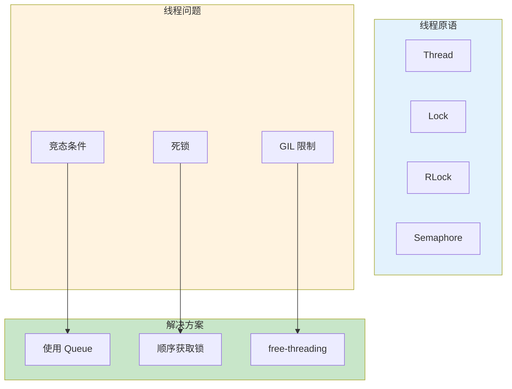

# L26: 线程与并发

> **课程编号**: L26
> **所属阶段**: Stage 2 - 现代工程
> **预计时长**: 4-5 小时
> **难度**: ⭐⭐⭐⭐☆（中高级）
> **前置课程**: L19, L21, L23
> **版本**: v1.0
> **最后更新**: 2026-07-23
> **核心版本**: Python 3.13


## 📚 前置知识



**学习本课程前，你应该掌握：**

- L19-L23: 异步编程、装饰器、Python 3.13、性能优化

**如果你还没有学习以上课程，建议先完成前置课程。**

---

> **课程定位**: Stage 2 Foundation 的并发编程入门课。
>
> **核心目标**: 用 `threading`、`queue` 和 `ThreadPoolExecutor` 写出可测试、可解释、可避免常见竞态的 I/O 并发程序。
>
> **学习时长**: 4-5 小时
>
> **前置要求**: 函数、类、异常、上下文管理器、pytest 基础。

---


### 为什么需要线程

**CPU 密集型 vs IO 密集型**:

- **CPU 密集型**: 大量计算（加密、压缩、图像处理）
  - 多进程更合适（绕过 GIL）
  
- **IO 密集型**: 等待网络、文件、数据库
  - 多线程/异步更合适（IO 时让出 GIL）

## 第三章：线程基础

Python 的线程由 `threading.Thread` 表示。创建线程时通常传入 `target` 函数、`args` 参数和可选的 `name`。
线程对象创建后不会自动运行，必须调用 `start()`。
`start()` 会请求操作系统调度新线程，并在新线程中调用目标函数。
不要直接调用 `thread.run()`，那只是普通函数调用，不会创建新线程。
主线程如果需要等待子线程完成，应调用 `join()`。
`join()` 可以带 timeout，避免主线程无限等待。
线程命名非常重要，尤其在日志中定位并发问题时，`worker-3` 比默认名字更有意义。
每个线程都可以通过 `threading.current_thread()` 获取当前线程对象。
`threading.active_count()` 可以查看当前活动线程数量，但它更适合调试，不适合作为业务逻辑条件。
线程的目标函数返回值不会自动回到主线程。
如果需要收集返回值，可以使用共享容器加锁、`queue.Queue`，或更推荐的 `ThreadPoolExecutor`。
线程中抛出的异常不会直接让主线程失败，它会打印 traceback。
这也是线程池更推荐的原因之一：`Future.result()` 会重新抛出任务异常。
线程适合 I/O 密集型任务，例如等待 HTTP 响应、读写文件、调用慢服务。
线程不适合纯 Python CPU 密集型循环，因为 GIL 会限制同一时刻执行 Python 字节码的线程数。
daemon 线程是后台线程，当只剩 daemon 线程时，解释器可以直接退出。
这意味着 daemon 线程可能没有机会释放资源、写完文件或发送最后一条消息。
因此 daemon 线程适合心跳、监控、缓存刷新等可丢弃任务，不适合关键业务写入。
启动线程前要设置 daemon 属性，线程启动后再修改会抛出异常。
很多初学者会创建线程列表却忘记 join，导致主程序提前退出或测试不稳定。
手动管理线程数量时，要避免一次性为上万个任务创建上万个线程。
线程也有栈空间、调度开销和上下文切换成本。
大量短任务更适合线程池。
下面是最小线程示例。

```python
import threading
import time

def worker(name: str) -> None:
    print(f"{name} start")
    time.sleep(0.2)
    print(f"{name} done")

thread = threading.Thread(target=worker, args=("A",), name="worker-A")
thread.start()
thread.join()
```

运行后，主线程会等待 `worker-A` 完成。
如果注释掉 `join()`，主线程可能先执行后续逻辑。
下面是多个线程的常见写法。

```python
import threading

threads = [threading.Thread(target=worker, args=(f"job-{i}",)) for i in range(3)]
for thread in threads:
    thread.start()
for thread in threads:
    thread.join()
```

注意两个循环不要合并成“start 后立即 join”。
如果在第一个循环中 start 之后马上 join，就会变成一个任务完成后才启动下一个任务，失去并发效果。
正确顺序是先启动所有线程，再统一等待。
线程函数应该尽量短小，最好只做一类任务。
如果线程函数需要多个配置参数，可以使用 dataclass 或闭包组织参数。
不要把大量全局变量塞进线程函数。
全局变量一旦被多个线程读写，就必须考虑锁。
线程的生命周期包括创建、就绪、运行、阻塞、结束。
在 Python 层面，你通常只控制 start、join 和是否 daemon。
线程结束后不能再次 start 同一个 Thread 对象。
如果要重新运行任务，应创建新的 Thread 对象。
测试线程代码时，不要依赖打印顺序。
线程调度顺序由操作系统决定，同一段代码在不同机器上顺序可能不同。
因此测试应断言最终状态，而不是断言中间日志完全按顺序出现。
示例文件 `examples/01_threading_basics.py` 展示了普通线程和 daemon 线程。
你可以运行它观察线程名和执行顺序。
本章的核心检查点是：是否能正确启动、等待、命名线程，并知道 daemon 的边界。

### 本章复盘

- 本章概念应能用自己的话解释。
- 本章示例应能在本地运行或改写。
- 本章边界应能通过测试或断言验证。

---

## 第四章：同步原语

同步原语用于协调多个线程访问共享资源。
只要多个线程可能同时读写同一个可变对象，就要考虑同步。
最常见的同步原语是 `Lock`。
`Lock` 有两种状态：未锁定和已锁定。
一个线程进入临界区前调用 acquire，离开时 release。
实际代码中应优先使用 `with lock:`，它可以在异常时自动释放锁。
临界区应该尽量短，只包住真正需要保护的共享状态。
不要在持锁期间执行慢网络请求。
持锁时间越长，其他线程等待越久，死锁和性能问题越容易出现。
竞态条件不是语法错误，而是执行顺序不同导致结果不同。
例如 `counter += 1` 看起来是一行，但包含读取、加一、写回多个步骤。
多个线程同时执行时，更新可能丢失。
下面是 Lock 保护计数器的写法。

```python
import threading

counter = 0
lock = threading.Lock()

def increment() -> None:
    global counter
    with lock:
        counter += 1
```

`RLock` 是可重入锁。
同一个线程可以多次获得同一个 RLock，但必须释放相同次数。
当一个公开方法持锁后调用另一个也需要同一把锁的方法时，RLock 很有用。
如果使用普通 Lock，这种嵌套调用会把自己锁死。
RLock 不是万能解法。
如果不需要重入，普通 Lock 更简单、更容易推理。
下面是 RLock 的典型场景。

```python
import threading

class Account:
    def __init__(self) -> None:
        self._balance = 0
        self._lock = threading.RLock()

    def deposit(self, amount: int) -> None:
        with self._lock:
            self._balance += amount

    def bonus(self) -> None:
        with self._lock:
            self.deposit(10)
```

`Condition` 用于“等待某个条件变为真”。
它通常和锁一起使用。
消费者在队列为空时等待，生产者放入数据后通知消费者。
等待条件必须放在 while 循环里，而不是 if。
原因是线程被唤醒时条件未必仍然成立，也可能发生虚假唤醒。
下面是 Condition 的骨架。

```python
condition = threading.Condition()
items: list[int] = []

def consume() -> int:
    with condition:
        while not items:
            condition.wait()
        return items.pop(0)

def produce(item: int) -> None:
    with condition:
        items.append(item)
        condition.notify()
```

`Event` 表达一次性信号。
一个线程调用 `event.set()`，其他线程的 `event.wait()` 就会返回。
Event 常用于启动信号、停止信号和配置加载完成信号。
如果希望恢复未设置状态，可以调用 `event.clear()`。
下面是停止后台线程的常见写法。

```python
stop_event = threading.Event()

def loop() -> None:
    while not stop_event.is_set():
        do_work_once()
        stop_event.wait(0.5)
```

这里使用 `wait(0.5)` 比 `time.sleep(0.5)` 更好，因为 set 后可以更快停止。
`Semaphore` 用于限制同时进入某段代码的线程数量。
例如最多同时发起 3 个外部 API 请求。
它内部维护一个计数器，acquire 时减一，release 时加一。
计数器为 0 时，新的线程会等待。
下面是 Semaphore 的基本用法。

```python
semaphore = threading.Semaphore(3)

def limited_call() -> None:
    with semaphore:
        call_remote_service()
```

`BoundedSemaphore` 会在 release 次数超过 acquire 时抛错，更适合捕捉释放次数错误。
选择同步原语时，可以按问题来判断。
保护共享变量：Lock。
同一线程需要重入：RLock。
等待条件变化：Condition。
广播一次状态变化：Event。
限制并发额度：Semaphore。
同步原语应当封装在类内部，不要让业务代码到处直接操作同一把锁。
示例文件 `examples/02_lock_synchronization.py` 展示了 Lock、RLock 和 Condition。
本章的核心检查点是：能否说清每把锁保护了什么，以及何时释放。

### 本章复盘

- 本章概念应能用自己的话解释。
- 本章示例应能在本地运行或改写。
- 本章边界应能通过测试或断言验证。

---

## 第五章：队列与生产者消费者

生产者消费者是并发编程中最常见的模型之一。
生产者负责生成任务或数据，消费者负责处理任务或数据。
如果直接用列表作为缓冲区，就必须自己处理锁、等待、通知和边界。
标准库 `queue.Queue` 已经内置线程安全机制，通常是更好的选择。
`Queue(maxsize=n)` 可以限制缓冲区大小。
当队列满时，`put()` 默认会阻塞。
当队列空时，`get()` 默认会阻塞。
这比手写 `while not items: sleep()` 更稳定。
下面是 Queue 的基本用法。

```python
from queue import Queue

queue: Queue[int] = Queue(maxsize=10)
queue.put(1)
item = queue.get()
queue.task_done()
```

`task_done()` 表示某个取出的任务已经处理完。
`queue.join()` 会等待所有已入队任务都调用 task_done。
如果 get 之后忘记 task_done，join 会一直等待。
如果 task_done 调用次数超过 get 次数，会抛出 ValueError。
生产者消费者通常需要一个停止信号。
常见做法是放入哨兵值，例如 None。
消费者取到 None 后退出循环。
有几个消费者，就通常需要放几个哨兵。
下面是单生产者、双消费者骨架。

```python
from queue import Queue
import threading

STOP = object()
jobs: Queue[int | object] = Queue()

def producer() -> None:
    for item in range(10):
        jobs.put(item)
    for _ in range(2):
        jobs.put(STOP)

def consumer() -> None:
    while True:
        item = jobs.get()
        try:
            if item is STOP:
                return
            handle(item)
        finally:
            jobs.task_done()
```

这里把 task_done 放在 finally 中，可以确保异常时也不会让 join 永远等待。
真实项目中还要记录处理失败的任务。
`Queue` 是先进先出。
如果你需要后进先出，可以使用 `queue.LifoQueue`。
LifoQueue 类似栈，最后放入的任务会先被取出。
它适合深度优先类任务，例如某些爬虫或回溯任务。
如果你需要优先级调度，可以使用 `queue.PriorityQueue`。
PriorityQueue 中的元素通常是 `(priority, data)` 元组。
数值越小，优先级越高。
下面是优先级队列示例。

```python
from queue import PriorityQueue

jobs: PriorityQueue[tuple[int, str]] = PriorityQueue()
jobs.put((10, "low"))
jobs.put((1, "high"))
priority, name = jobs.get()
```

如果两个任务优先级相同，Python 会继续比较元组后续字段。
当后续字段不可比较时会报错。
工程中常用 `(priority, sequence, data)`，用递增序号打破平局。
队列并不让任务自动并发。
它只是线程之间安全传递数据的通道。
并发来自多个消费者线程同时 get 和处理。
队列大小需要根据吞吐和内存设置。
无界队列在生产速度远快于消费速度时可能导致内存增长。
有界队列可以把压力反馈给生产者。
本课练习 `01_producer_consumer.py` 为了测试共享状态，故意要求你用 Lock 写一个小容器。
但在真实任务队列中，优先考虑 `queue.Queue`。
测试生产者消费者时，不要断言线程执行顺序。
应断言最终消费数量、是否丢失、是否重复，以及是否能正常退出。
如果测试偶尔失败，说明并发边界还不清晰。
本章的核心检查点是：能否用 Queue 替代裸列表，并正确使用 task_done 和 join。

### 本章复盘

- 本章概念应能用自己的话解释。
- 本章示例应能在本地运行或改写。
- 本章边界应能通过测试或断言验证。

---

## 第六章：线程池

手动创建线程适合学习生命周期，但真实项目中更常使用线程池。
`concurrent.futures.ThreadPoolExecutor` 提供固定数量工作线程和统一的 Future 接口。
线程池可以避免为每个任务创建一个新线程。
它还能把任务异常保存在 Future 中，主线程调用 result 时重新抛出。
创建线程池时应使用 with 语句，确保退出时自动 shutdown。
`max_workers` 决定最多同时运行多少个任务。
I/O 密集型任务的 max_workers 可以高于 CPU 核数，但不应无限增大。
外部 API、数据库连接池和文件句柄都可能成为真正瓶颈。
`submit(fn, *args)` 会提交一个任务并返回 Future。
Future 表示未来某个时刻可用的结果。
`future.result()` 会阻塞直到任务完成。
如果任务抛出异常，result 会重新抛出同一个异常。
下面是 submit 示例。

```python
from concurrent.futures import ThreadPoolExecutor

def square(n: int) -> int:
    return n * n

with ThreadPoolExecutor(max_workers=2) as executor:
    future = executor.submit(square, 4)
    print(future.result())
```

`executor.map()` 类似内置 map，但会在线程池中并发执行。
它返回结果的顺序与输入顺序一致。
如果某个任务失败，迭代到对应结果时会抛出异常。
map 适合“所有任务同样处理，并且希望保留输入顺序”的场景。
下面是 map 示例。

```python
with ThreadPoolExecutor(max_workers=4) as executor:
    results = list(executor.map(square, range(10)))
```

`as_completed()` 按任务完成顺序产生 Future。
它适合下载器、爬虫、批处理等希望谁先完成就先处理谁的场景。
使用 as_completed 时，常见写法是维护 `future_to_item` 字典。
这样异常发生时也知道是哪一个输入失败。
下面是 as_completed 示例。

```python
from concurrent.futures import as_completed

with ThreadPoolExecutor(max_workers=4) as executor:
    future_to_url = {executor.submit(fetch, url): url for url in urls}
    for future in as_completed(future_to_url):
        url = future_to_url[future]
        try:
            data = future.result()
        except Exception as exc:
            print(url, exc)
```

教学示例可以打印异常，生产代码应使用 logging 并带上上下文。
不要在任务函数内部静默吞掉所有异常。
如果任务失败对业务重要，应把失败结果返回给调用者，或集中记录后重试。
线程池任务应避免修改共享全局状态。
如果必须共享状态，要么加锁，要么让每个任务返回结果，由主线程汇总。
后者通常更简单。
本课下载器练习采用“任务返回内容，主线程汇总字典”的模式。
这样只有主线程写 results，减少锁的需求。
如果使用线程池处理无限任务流，要注意 shutdown 和取消策略。
Future 支持 `cancel()`，但只能取消尚未开始执行的任务。
已经运行的线程任务不能被安全强杀。
因此长任务应自己检查停止信号。
线程池不是越大越快。
如果远程服务限流，过大的 max_workers 会制造更多失败。
如果本机网络或磁盘成为瓶颈，更多线程只会增加上下文切换。
示例文件 `examples/03_threadpool.py` 展示了 submit、map 和 as_completed。
本章核心检查点是：能否用 Future 正确处理结果和异常。

### 本章复盘

- 本章概念应能用自己的话解释。
- 本章示例应能在本地运行或改写。
- 本章边界应能通过测试或断言验证。

---

## 第七章：GIL 与 Python 3.13 Free-threading

GIL 是 Global Interpreter Lock，全局解释器锁。
在传统 CPython 中，同一进程内通常只有一个线程能执行 Python 字节码。
这让解释器内部对象管理更简单，也让许多 C 扩展长期依赖这一假设。
GIL 并不意味着线程完全没用。
当线程执行 I/O 操作时，解释器可以释放 GIL，让其他线程继续运行。
所以多线程对网络请求、文件 I/O、数据库调用仍然有效。
GIL 主要影响纯 Python CPU 密集型代码。
例如多个线程同时执行大量 Python 循环，通常不会得到线性加速。
这类任务可以考虑 multiprocessing、NumPy 等释放 GIL 的扩展、Rust/C 扩展或任务队列。
判断一个任务是否受 GIL 影响，要看它的大部分时间花在哪里。
如果大部分时间在等待外部系统，线程可能有帮助。
如果大部分时间在 Python 层计算，线程通常帮助有限。
不要用“有 GIL”作为拒绝所有线程的理由。
也不要用"线程能并发"作为忽略数据竞争的理由。
Python 3.13 引入了 free-threading 构建选项（PEP 703），这是让 CPython 可以在无 GIL 模式下运行、允许多个线程真正并行执行 Python 代码的重要成果。
Python 3.14（2025 年 10 月发布）通过 PEP 779 把 free-threading 从"试验性"升级为"官方支持但仍非默认"，C 扩展兼容性显著改善。
两个版本都通过独立的构建发行（`python3.13t` / `python3.14t`），标准 `python3.13` / `python3.14` 仍使用带 GIL 构建。
即使在 Python 3.14 中，启用 free-threading 也需要 freethreaded 构建、合适的运行环境和兼容的扩展库。
（详见 [docs/FREE_THREADING_TRUTH.md](../../../docs/technical/FREE_THREADING_TRUTH.md)）
生态迁移不会一夜完成。
很多 C 扩展需要审查线程安全假设。
即使没有 GIL，竞态条件仍然存在，而且可能更容易暴露。
过去某些“看起来没出问题”的代码，可能只是被 GIL 的调度限制掩盖了。
面向 free-threading 的正确姿势不是删除所有锁，而是更认真地标明共享状态边界。
不可变数据、消息传递和局部变量会变得更有价值。
如果对象只在一个线程中创建和使用，风险最低。
如果对象跨线程共享，就要明确谁能读、谁能写、用什么锁保护。
free-threading 也不保证所有程序自动变快。
锁竞争、内存分配、缓存局部性和扩展库实现都会影响性能。
性能优化仍然要测量，而不是猜测。
对于本课程，你可以把 GIL 作为选择并发模型的一个因素。
线程：I/O 密集、共享内存方便、任务粒度较小。
进程：CPU 密集、隔离性更强、跨核并行更明确。
异步：大量网络连接、单线程事件循环、需要 async 生态配合。
在后续 FastAPI 和 Agent 工程中，你会同时看到这三种模型。
FastAPI 常用 async 处理请求生命周期。
阻塞型 SDK 可以放入线程池。
CPU 密集型推理或批处理可以放入进程池或外部服务。
理解 GIL 的价值在于做取舍，而不是背术语。
本章核心检查点是：能否解释线程何时有效、何时受限，以及 Python 3.13/3.14 free-threading 的现实边界。

#### 实测数据：到底快多少？

下面是本课程在 Intel i5-12400F（6 核 / 12 线程）上跑 Mandelbrot 800×600×256 迭代的 4 组对照数据。完整脚本和复现指令见 [`L23 examples/01_free_threading_benchmark.py`](../L23-extreme-abstraction-performance/examples/01_free_threading_benchmark.py)。

| 配置                       | 1 线程 | 8 线程 | 8 线程加速比                        |
| -------------------------- | ------ | ------ | ----------------------------------- |
| `python3.13`（标准 GIL）   | 1.978s | 1.914s | **1.01x** ❌                        |
| `python3.13t`（PEP 703）   | 3.190s | 0.542s | **6.15x** ✅                        |
| `PYTHON_GIL=1 python3.13t` | 3.192s | 3.282s | 0.97x（隔离实验：t 构建本身的开销） |
| `python3.14t`（PEP 779）   | 2.547s | 0.432s | **5.92x** ✅                        |

三个关键结论：

- GIL 是真实的并行墙：同样代码、同样硬件，仅 GIL 开关让 8 线程从 1.01x 跃升到 6.15x。
- t 构建本身有约 60% 单线程开销（3.13t），并行收益必须超过这个代价才值得切换。
- PEP 779 把开销降到约 29%（3.14t 比 3.13t 单线程快 25%、8 线程快 20%），让 free-threading 在更多场景里值得。

### 本章复盘

- 本章概念应能用自己的话解释。
- 本章示例应能在本地运行或改写。
- 本章边界应能通过测试或断言验证。

---

## 第八章：实战与陷阱

本章把前面的知识合在一起：实现一个可测试的并发下载器，并识别常见并发陷阱。
下载器的核心设计是把真实网络函数独立成 `fetch_url(url)`。
测试时用 monkeypatch 替换它，就不会访问真实网络。
这也是并发代码可测试性的关键：把慢 I/O 和调度逻辑分开。
下载器使用 ThreadPoolExecutor 提交每个 URL。
主线程用 as_completed 逐个收集结果。
单个 URL 失败不应让整个批次失败，除非业务明确要求。
参考答案中失败 URL 会被跳过。
真实项目中应记录失败 URL、异常类型和重试次数。
下面是下载器核心结构。

```python
def parallel_download(urls: list[str], max_workers: int = 5) -> dict[str, str]:
    results: dict[str, str] = {}
    with ThreadPoolExecutor(max_workers=max_workers) as executor:
        future_to_url = {executor.submit(fetch_url, url): url for url in urls}
        for future in as_completed(future_to_url):
            url = future_to_url[future]
            try:
                results[url] = future.result()
            except Exception:
                continue
    return results
```

第一个常见陷阱是竞态条件。
多个线程同时修改共享列表、字典或计数器时，结果可能丢失或损坏。
解决方案是减少共享写入，让任务返回值由主线程汇总，或使用 Lock。
第二个陷阱是死锁。
死锁常见于两个线程以不同顺序获得多把锁。
例如线程 A 持有 lock_a 等 lock_b，线程 B 持有 lock_b 等 lock_a。
避免死锁的策略包括固定锁顺序、缩短持锁时间、使用 timeout、减少锁数量。
第三个陷阱是忘记处理 Future 异常。
如果你 submit 任务后从不调用 result，任务失败可能只停留在 Future 中。
测试也可能误以为任务成功。
第四个陷阱是把 sleep 当同步机制。
`time.sleep(1)` 不能证明另一个线程一定完成，只是希望它完成。
应使用 join、Event、Condition、Queue.join 等明确同步。
第五个陷阱是无界并发。
线程池 max_workers、队列 maxsize、Semaphore 都是背压工具。
没有背压的系统在上游变快或下游变慢时会堆积内存和连接。
第六个陷阱是日志缺少上下文。
并发日志必须带线程名、任务 ID、URL 或用户 ID，否则排查困难。
调试并发问题时，先把任务数量缩小到 2 或 3。
小规模更容易复现交错顺序。
给 join 和 wait 加 timeout，可以避免测试永远挂住。
对共享状态添加断言，例如总数、唯一性、边界值。
用 `threading.enumerate()` 查看未退出线程。
必要时启用 faulthandler 或在线程 dump 中查看阻塞位置。
写测试时，优先测试最终可观察行为。
例如本课测试并不检查每个线程的执行顺序，而是检查生产数量和下载结果数量。
异常路径同样重要。
下载器测试中，一个 URL 失败不影响另外两个 URL。
这证明实现没有让单个 Future 异常中断整批任务。
生产者消费者测试中，五个线程同时生产，每个生产 20 个，最终数量应为 100。
这证明共享容器没有明显丢失数据。
并发测试不可能证明所有调度都安全，但可以覆盖高价值边界。
工程中还应配合代码审查，逐行说明锁保护范围。
本课完成后，请运行 ruff 和 pytest。
如果测试偶发失败，不要简单重跑到通过，要找到不确定性的来源。
并发程序最怕“偶尔可以”。
可靠的并发代码应能稳定通过测试，也能在失败时给出足够上下文。
本章核心检查点是：能否实现下载器，并能解释每个并发陷阱的规避方式。

### 本章复盘

- 本章概念应能用自己的话解释。
- 本章示例应能在本地运行或改写。
- 本章边界应能通过测试或断言验证。

---

## 课后练习

1. 完成 `exercises/exercise_01_producer_consumer.py`，保证多线程 produce 不会超过 max_items。
2. 完成 `exercises/exercise_02_parallel_download.py`，使用 `ThreadPoolExecutor` 与 `as_completed`。
3. 为下载器增加失败 URL 记录，并思考结果结构如何表达成功与失败。
4. 把 Queue 版本生产者消费者写成一个独立脚本，练习 `task_done()` 与 `join()`。
5. 修改示例中的 max_workers，观察总耗时和输出顺序变化。
6. 尝试制造一个死锁，再用固定锁顺序修复它。
7. 在日志中加入 `threading.current_thread().name`，观察调试体验变化。

## 验证命令

```bash
ruff check stage2-engineering/lessons/L24-threading/
python -m pytest stage2-engineering/lessons/L24-threading/tests/ -o addopts="" -v
```

如果 `.venv/bin/python` 不存在，可以使用系统 `python`。

## 并发代码审查清单

在把线程代码交给团队使用前，建议逐项检查下面的问题。

### 设计层面

- 这个任务是否真的适合线程，而不是异步、进程或普通串行执行？
- 任务主要时间是否花在 I/O 等待上？
- 线程数量是否有上限？
- 队列长度是否有上限？
- 外部服务是否有速率限制？
- 失败任务是否需要重试？
- 重试是否会放大流量或造成雪崩？
- 结果是否需要保持输入顺序？
- 调用方是否需要知道哪些任务失败？
- 是否需要取消或停止长时间运行的任务？

### 状态层面

- 哪些对象会跨线程共享？
- 哪些共享对象可变？
- 每个可变对象由哪一把锁保护？
- 是否存在不受保护的读写路径？
- 锁是否只包住必要临界区？
- 持锁期间是否执行了网络、磁盘或慢函数？
- 多把锁是否有固定获取顺序？
- 是否可以改成消息传递而不是共享写入？
- 是否可以让任务返回值，由主线程统一汇总？
- 是否存在全局变量被多个线程修改？

### 测试层面

- 测试是否不访问真实网络？
- 测试是否避免依赖打印顺序？
- 测试是否覆盖空输入？
- 测试是否覆盖单任务失败？
- 测试是否覆盖多个线程同时写入？
- 测试是否有超时，避免永久挂住？
- 是否能重复运行十次仍然稳定？
- 是否能在不同 max_workers 下通过？
- 是否检查结果数量和内容唯一性？
- 是否验证异常不会被静默吞掉？

### 运维层面

- 日志是否包含线程名或任务 ID？
- 失败日志是否包含输入上下文？
- 是否能观察当前队列长度或任务数量？
- 是否能安全关闭线程池？
- 是否有指标显示成功数、失败数和耗时？
- 是否能在下游变慢时施加背压？
- 是否避免在解释器退出时依赖 daemon 完成关键工作？
- 是否为未来 free-threading 环境保留清晰同步边界？
- 是否在代码注释中解释了不明显的锁策略？
- 是否有对应的单元测试或集成测试守住这些约束？

这份清单并不要求每个教学示例都做到生产级，但它能帮助你把课堂代码迁移到真实项目时少踩坑。

---

## 📖 总结

### 核心知识点

- 本课程涵盖了课程的核心概念和工具
- 重点掌握了关键API的使用方法
- 通过实践案例加深了理解

### 学习收获

完成本课程后，你已经：

- 掌握了本课程的核心概念和工具
- 能够运用所学知识解决实际问题
- 为后续学习打下了坚实基础


### 学习检查清单

完成本课程后，确认你已经：

- [ ] 理解了本课程的核心概念
- [ ] 掌握了主要工具和API的使用
- [ ] 能够独立完成课程练习
- [ ] 可选：通过本课测试 `uv run pytest tests -q`


---

## 📝 本章总结

### 核心知识点

| 模块 | 核心内容 | 关键工具 |
|------|----------|----------|
| 本课程 | 线程与并发 | pytest |

### 关键要点

1. 理解本课程的核心概念
2. 掌握主要工具和 API 的使用
3. 能够独立完成课程练习

### 学习收获

完成本课程后，你已经：
- ✅ 掌握了本课程的核心概念
- ✅ 能够运用所学知识解决实际问题
- ✅ 为后续学习打下坚实基础


## 🔗 下一步

[L25: 工程化综合项目](../L25-engineering-project/README.md)

---
