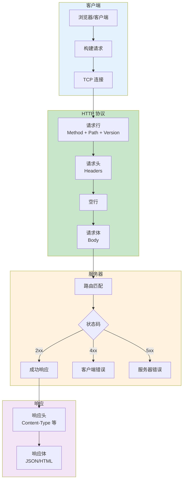

# L27: HTTP 协议与抓包基础

> **课程编号**: L27
> **所属阶段**: Stage 3 - Web 开发基础
> **预计时长**: 3-4 小时
> **难度**: ⭐⭐⭐☆☆（中级）
> **前置课程**: L01, L04, L25
> **版本**: v1.0
> **最后更新**: 2026-07-23
> **核心版本**: Python 3.13

## 📚 前置知识

**学习本课程前，你应该掌握：**

- **L25**: 工程化综合项目（理解项目结构与测试）
- 命令行基础（能使用终端）

**推荐掌握**：

- **L19**: 异步编程（理解 Web 服务器原理）
- **L24**: 线程与并发（理解并发请求）

**如果你还没有学习以上课程，建议先完成前置课程。**

---



---

FastAPI、SSE、WebSocket、认证、缓存、追踪，全部建立在 HTTP 协议之上。不需要成为网络工程师，但必须能读懂一次请求发生了什么。

## 第一章：HTTP 协议基础

### 1.1 为什么需要理解 HTTP？

**场景问题**：

- API 返回 422，但不知道是哪个字段校验失败？
- 跨域请求失败，CORS 到底怎么配置？
- 为什么添加了 `Authorization` Header 还是 401？
- 缓存不生效，`Cache-Control` 该怎么设置？

**解决方案**：理解 HTTP 协议，学会抓包调试。

---

### 1.2 HTTP 请求报文结构

**完整请求示例**：

```http
GET /users/42 HTTP/1.1
Host: api.example.com
User-Agent: curl/8.0
Accept: application/json
Authorization: Bearer abc123

```

**结构解析**：

1. **请求行**（Request Line）：
   - 方法：`GET`
   - 路径：`/users/42`
   - 版本：`HTTP/1.1`

2. **请求头**（Request Headers）：
   - `Host: api.example.com`（目标主机）
   - `User-Agent: curl/8.0`（客户端标识）
   - `Accept: application/json`（期望响应格式）
   - `Authorization: Bearer abc123`（认证信息）

3. **空行**：`\r\n`（分隔符）

4. **请求体**（Request Body）：可选（GET 通常没有）

---

### 1.3 HTTP 响应报文结构

**完整响应示例**：

```http
HTTP/1.1 200 OK
Content-Type: application/json
Content-Length: 45
Cache-Control: max-age=3600
Set-Cookie: session_id=xyz789

{"id":42,"name":"Alice","email":"alice@example.com"}
```

**结构解析**：

1. **状态行**（Status Line）：
   - 版本：`HTTP/1.1`
   - 状态码：`200`
   - 原因短语：`OK`

2. **响应头**（Response Headers）：
   - `Content-Type: application/json`（响应格式）
   - `Content-Length: 45`（响应体长度）
   - `Cache-Control: max-age=3600`（缓存 1 小时）
   - `Set-Cookie: session_id=xyz789`（设置 Cookie）

3. **空行**：`\r\n`（分隔符）

4. **响应体**（Response Body）：JSON 数据

---

### 1.4 FastAPI 中的 HTTP 流程

**请求处理流程**：

```python
from fastapi import FastAPI, Header

app = FastAPI()

@app.get("/users/{user_id}")
async def get_user(
    user_id: int,
    host: str = Header(...),
    user_agent: str = Header(..., alias="User-Agent")
):
    """
    1. FastAPI 解析请求行：GET /users/42 HTTP/1.1
    2. 验证路径参数：user_id = 42
    3. 提取 Headers：Host, User-Agent
    4. 返回响应
    """
    return {
        "user_id": user_id,
        "request_from": host,
        "client": user_agent
    }
```

**测试请求**：

```bash
curl -v http://localhost:8000/users/42
```

---

## 第二章：HTTP 方法与状态码

### 2.1 HTTP 方法详解

**RESTful API 常用方法**：

| 方法   | 语义      | 幂等性 | 安全性 | 使用场景              |
|--------|-----------|--------|--------|-----------------------|
| GET    | 读取资源  | ✅     | ✅     | 获取用户列表          |
| POST   | 创建资源  | ❌     | ❌     | 创建新用户            |
| PUT    | 整体替换  | ✅     | ❌     | 更新用户全部信息      |
| PATCH  | 局部修改  | ❌     | ❌     | 只更新用户邮箱        |
| DELETE | 删除资源  | ✅     | ❌     | 删除用户              |
| HEAD   | 获取元信息| ✅     | ✅     | 检查资源是否存在      |
| OPTIONS| 获取选项  | ✅     | ✅     | CORS 预检请求         |

**幂等性**：多次执行结果相同（不会产生副作用）。

**安全性**：不修改资源状态。

---

### 2.2 HTTP 状态码完整指南

**1xx 信息性状态码**（较少使用）：

- `100 Continue`：客户端可以继续发送请求体
- `101 Switching Protocols`：切换协议（WebSocket）

**2xx 成功状态码**：

- `200 OK`：请求成功（GET、PUT、PATCH）
- `201 Created`：资源创建成功（POST）
- `204 No Content`：成功但无响应体（DELETE）

**3xx 重定向状态码**：

- `301 Moved Permanently`：永久重定向
- `302 Found`：临时重定向
- `304 Not Modified`：资源未修改（缓存有效）

**4xx 客户端错误**：

- `400 Bad Request`：请求格式错误
- `401 Unauthorized`：未认证（缺 token）
- `403 Forbidden`：无权限（有 token 但权限不足）
- `404 Not Found`：资源不存在
- `405 Method Not Allowed`：方法不支持
- `409 Conflict`：资源冲突（重复创建）
- `422 Unprocessable Entity`：Pydantic 校验失败
- `429 Too Many Requests`：请求过于频繁

**5xx 服务器错误**：

- `500 Internal Server Error`：服务端异常
- `502 Bad Gateway`：网关错误
- `503 Service Unavailable`：服务不可用
- `504 Gateway Timeout`：网关超时

---

### 2.3 FastAPI 状态码实践

**自定义状态码**：

```python
from fastapi import FastAPI, HTTPException, status

app = FastAPI()

@app.post("/users", status_code=status.HTTP_201_CREATED)
async def create_user(user: User):
    """创建成功返回 201"""
    return {"id": 1, "name": user.name}

@app.delete("/users/{user_id}", status_code=status.HTTP_204_NO_CONTENT)
async def delete_user(user_id: int):
    """删除成功返回 204（无响应体）"""
    pass

@app.get("/users/{user_id}")
async def get_user(user_id: int):
    """找不到返回 404"""
    user = find_user(user_id)
    if not user:
        raise HTTPException(
            status_code=status.HTTP_404_NOT_FOUND,
            detail=f"用户 {user_id} 不存在"
        )
    return user
```

---

### 2.4 关键 HTTP Header 详解

**请求头（Request Headers）**：

| Header           | 作用                       | 示例                          |
|------------------|----------------------------|-------------------------------|
| Host             | 目标主机（必需）           | `api.example.com`             |
| User-Agent       | 客户端标识                 | `curl/8.0`                    |
| Accept           | 期望响应格式               | `application/json`            |
| Content-Type     | 请求体格式                 | `application/json`            |
| Content-Length   | 请求体字节长度             | `123`                         |
| Authorization    | 认证信息                   | `Bearer <token>`              |
| Cookie           | 会话信息                   | `session_id=abc123`           |
| Origin           | 请求来源（CORS）           | `http://localhost:5173`       |
| Referer          | 来源页面                   | `http://example.com/page1`    |

**响应头（Response Headers）**：

| Header                      | 作用                       | 示例                          |
|-----------------------------|----------------------------|-------------------------------|
| Content-Type                | 响应体格式                 | `application/json`            |
| Content-Length              | 响应体字节长度             | `456`                         |
| Cache-Control               | 缓存策略                   | `max-age=3600`                |
| Set-Cookie                  | 设置 Cookie                | `session_id=xyz; HttpOnly`    |
| Access-Control-Allow-Origin | CORS 允许的源              | `http://localhost:5173`       |
| Location                    | 重定向地址                 | `/new-url`                    |
| ETag                        | 资源版本标识               | `"abc123"`                    |
| traceparent                 | OpenTelemetry Trace 上下文 | `00-0af7651916ae43c...-01`    |

> 💡 **traceparent Header**：OpenTelemetry 分布式追踪标准格式 `00-{trace-id}-{span-id}-{flags}`，用于在微服务间传递请求链路上下文。

---

## 第三章：HTTP 调试工具

### 3.1 curl - 命令行 HTTP 客户端

**基础请求**：

```bash
# GET 请求
curl http://localhost:8000/health

# 显示详细信息（请求头 + 响应头）
curl -v http://localhost:8000/health

# 只显示响应头
curl -I http://localhost:8000/health

# POST 请求（发送 JSON）
curl -X POST http://localhost:8000/users \
  -H "Content-Type: application/json" \
  -d '{"name": "Alice", "age": 30}'

# 从文件读取请求体
curl -X POST http://localhost:8000/users \
  -H "Content-Type: application/json" \
  -d @user.json

# 带认证
curl -H "Authorization: Bearer <token>" \
  http://localhost:8000/profile

# 下载文件
curl -O http://example.com/file.pdf

# 保存响应到文件
curl http://localhost:8000/report -o report.json
```

**常用选项**：

- `-v, --verbose`：显示详细信息
- `-X, --request`：指定 HTTP 方法
- `-H, --header`：添加 Header
- `-d, --data`：发送请求体
- `-i, --include`：显示响应头
- `-I, --head`：只请求 Header
- `-o, --output`：保存到文件
- `-O, --remote-name`：使用远程文件名保存

---

### 3.2 httpie - 更友好的 HTTP 客户端

**安装**：

```bash
uv add --dev httpie
```

**基础用法**：

```bash
# GET 请求
http GET localhost:8000/health

# POST 请求（自动 JSON）
http POST localhost:8000/users name=Alice age:=30

# 带 Header
http GET localhost:8000/profile \
  Authorization:"Bearer <token>"

# 上传文件
http --form POST localhost:8000/upload \
  file@photo.jpg

# 下载文件
http --download http://example.com/file.pdf
```

**优势**：

- ✅ 自动 JSON 格式化
- ✅ 彩色输出（易读）
- ✅ 语法简洁（`name=value` vs `{"name": "value"}`）
- ✅ 自动推断 Content-Type

---

### 3.3 浏览器 DevTools

**Chrome DevTools → Network 面板**：

**打开方式**：

1. 按 `F12` 或 `Ctrl+Shift+I`（Windows/Linux）
2. 按 `Cmd+Option+I`（macOS）
3. 右键 → 检查 → Network 标签

**查看请求详情**：

1. **General**：
   - Request URL：完整请求 URL
   - Request Method：HTTP 方法
   - Status Code：状态码
   - Remote Address：服务器地址

2. **Request Headers**：
   - 所有请求头（可复制为 curl）

3. **Response Headers**：
   - 所有响应头

4. **Payload**：
   - 请求体（JSON、表单数据）

5. **Preview/Response**：
   - 响应体（格式化显示）

6. **Timing**：
   - DNS Lookup：DNS 解析时间
   - Initial Connection：TCP 连接时间
   - SSL：TLS 握手时间
   - Waiting (TTFB)：等待第一字节时间
   - Content Download：下载时间

**实用功能**：

- **复制为 curl**：右键 → Copy → Copy as cURL
- **重放请求**：右键 → Replay XHR
- **清空日志**：点击 🚫 图标
- **过滤请求**：输入框输入 URL/方法/状态码

---

## 第四章：抓包工具

### 4.1 tcpdump - 命令行抓包

**基础用法**：

```bash
# macOS 本地抓包
sudo tcpdump -i lo0 -A 'tcp port 8000'

# Linux 本地抓包
sudo tcpdump -i lo -A 'tcp port 8000'

# 保存到文件
sudo tcpdump -i lo0 -w capture.pcap 'tcp port 8000'

# 读取文件
tcpdump -r capture.pcap -A

# 抓取 HTTP 请求
sudo tcpdump -i lo0 -A 'tcp port 8000 and (((ip[2:2] - ((ip[0]&0xf)<<2)) - ((tcp[12]&0xf0)>>2)) != 0)'
```

**常用选项**：

- `-i`：指定网络接口（`lo0`/`lo` 为本地）
- `-A`：ASCII 格式显示（可读）
- `-X`：十六进制 + ASCII 显示
- `-w`：保存到文件
- `-r`：读取文件
- `-n`：不解析主机名（更快）
- `-v`：详细模式

**过滤表达式**：

```bash
# 端口过滤
tcp port 8000

# IP 过滤
host 127.0.0.1

# 组合过滤
tcp port 8000 and host 127.0.0.1

# HTTP 方法过滤（POST）
'tcp port 8000 and tcp[((tcp[12:1] & 0xf0) >> 2):4] = 0x504F5354'
```

---

### 4.2 Wireshark - 图形化抓包

**安装**：

- macOS：`brew install --cask wireshark`
- Linux：`sudo apt install wireshark`
- Windows：下载安装包

**使用流程**：

1. 启动 Wireshark
2. 选择网络接口：
   - macOS：`Loopback: lo0`
   - Linux：`Loopback: lo`
3. 点击 🦈 图标开始捕获
4. 使用过滤表达式筛选
5. 停止捕获（红色方块）
6. 分析请求

**过滤表达式**：

```
# 所有 HTTP 流量
http

# HTTP 请求
http.request

# HTTP 响应
http.response

# 特定状态码
http.response.code == 500

# 特定方法
http.request.method == "POST"

# 端口过滤
tcp.port == 8000

# IP 过滤
ip.addr == 127.0.0.1

# 组合过滤
http and tcp.port == 8000
```

**查看 HTTP 流**：

1. 右键请求 → Follow → HTTP Stream
2. 查看完整的请求和响应
3. 使用 `Ctrl+F` 搜索内容

---

### 4.3 抓包最佳实践

**合法使用**：

- ✅ 抓取本地开发环境流量
- ✅ 调试自己系统的请求链路
- ✅ 分析网络性能瓶颈
- ❌ 抓取不属于你的网络流量
- ❌ 抓取生产环境用户流量（隐私）
- ❌ 抓取加密流量并尝试解密（非法）

**生产环境调试优先级**：

1. **应用日志**：FastAPI 日志、Uvicorn 日志
2. **结构化日志**：使用 structlog 记录请求上下文
3. **OpenTelemetry Trace**：分布式追踪
4. **Metrics 监控**：Prometheus + Grafana
5. **抓包**：最后手段（需要权限）

---

## 第五章：常见问题诊断

### 5.1 422 Unprocessable Entity

**问题场景**：Pydantic 校验失败。

**请求示例**：

```http
POST /users HTTP/1.1
Content-Type: application/json

{"name": "Alice", "age": "not-an-integer"}
```

**响应**：

```json
{
  "detail": [
    {
      "type": "int_parsing",
      "loc": ["body", "age"],
      "msg": "Input should be a valid integer, unable to parse string as an integer",
      "input": "not-an-integer"
    }
  ]
}
```

**诊断方法**：

1. 查看 `loc` 字段：定位错误字段
2. 查看 `msg` 字段：理解错误原因
3. 查看 `type` 字段：识别错误类型

**解决方案**：

```http
POST /users HTTP/1.1
Content-Type: application/json

{"name": "Alice", "age": 30}
```

---

### 5.2 401 vs 403 vs 404

**401 Unauthorized（未认证）**：

```http
GET /profile HTTP/1.1

HTTP/1.1 401 Unauthorized
WWW-Authenticate: Bearer

{"detail": "Not authenticated"}
```

**原因**：

- 缺少 `Authorization` Header
- Token 无效或过期

**解决**：

```http
GET /profile HTTP/1.1
Authorization: Bearer <valid-token>
```

---

**403 Forbidden（无权限）**：

```http
GET /admin HTTP/1.1
Authorization: Bearer <user-token>

HTTP/1.1 403 Forbidden

{"detail": "Insufficient permissions"}
```

**原因**：

- Token 有效，但权限不足
- 需要管理员权限

**解决**：

- 联系管理员授权
- 使用管理员 token

---

**404 Not Found（资源不存在）**：

```http
GET /users/99999 HTTP/1.1

HTTP/1.1 404 Not Found

{"detail": "User not found"}
```

**原因**：

- 资源 ID 不存在
- URL 路径错误

**解决**：

- 检查 ID 是否正确
- 检查 URL 拼写

---

### 5.3 Content-Length 不匹配

**问题**：`Content-Length` 与实际 Body 长度不一致。

**错误示例**：

```http
POST /users HTTP/1.1
Content-Type: application/json
Content-Length: 100

{"name": "Alice"}
```

**问题**：

- `Content-Length: 100`
- 实际 Body：`{"name": "Alice"}`（17 字节）
- 服务器等待剩余 83 字节，请求挂起

**解决方案**：

- 使用工具自动计算（curl、httpie）
- FastAPI 自动处理（无需手动设置）

**正确示例**：

```http
POST /users HTTP/1.1
Content-Type: application/json
Content-Length: 17

{"name": "Alice"}
```

---

### 5.4 CORS 跨域问题

**问题场景**：浏览器阻止跨域请求。

**错误信息**：

```
Access to fetch at 'http://localhost:8000/api/users' from origin 'http://localhost:5173'
has been blocked by CORS policy: No 'Access-Control-Allow-Origin' header is present
on the requested resource.
```

**预检请求**（OPTIONS）：

```http
OPTIONS /api/users HTTP/1.1
Origin: http://localhost:5173
Access-Control-Request-Method: POST
Access-Control-Request-Headers: content-type

HTTP/1.1 200 OK
Access-Control-Allow-Origin: http://localhost:5173
Access-Control-Allow-Methods: POST, GET, OPTIONS
Access-Control-Allow-Headers: content-type
```

**FastAPI 解决方案**：

```python
from fastapi import FastAPI
from fastapi.middleware.cors import CORSMiddleware

app = FastAPI()

app.add_middleware(
    CORSMiddleware,
    allow_origins=[
        "http://localhost:5173",  # 开发环境
        "https://example.com",    # 生产环境
    ],
    allow_credentials=True,
    allow_methods=["*"],
    allow_headers=["*"],
)
```

---

## 第六章：Socket 基础与 HTTP 协议栈

### 6.1 为什么需要理解 Socket？

**问题场景**：

- 为什么 HTTP 是"基于 TCP"的应用层协议？
- TCP 和 UDP socket 的区别是什么？
- FastAPI 如何"监听"网络端口？
- 什么是"粘包"问题？

**理解 Socket 的价值**：

```
┌─────────────────────────────────────────────────────┐
│  应用层    HTTP  ← 本课程重点                        │
│            FastAPI / Requests / curl                 │
├─────────────────────────────────────────────────────┤
│  传输层    TCP     ← Socket 编程                    │
│            UDP     ← 本章介绍                        │
│            asyncio.start_server                      │
├─────────────────────────────────────────────────────┤
│  网络层    IP      ← 网络层                          │
│            路由转发                                  │
└─────────────────────────────────────────────────────┘
```

---

### 6.2 TCP Socket 基础

#### TCP vs UDP 对比

| 特性 | TCP | UDP |
|------|-----|-----|
| **连接** | 面向连接（三次握手） | 无连接 |
| **可靠性** | 可靠（重传机制） | 不可靠（丢包不重传） |
| **顺序** | 保证顺序 | 不保证顺序 |
| **速度** | 较慢（确认机制） | 较快（无确认） |
| **使用场景** | HTTP、SMTP、FTP | DNS、视频流、游戏 |

#### TCP Socket 通信流程

```python
# TCP 服务端
import socket

server = socket.socket(socket.AF_INET, socket.SOCK_STREAM)
server.bind(('localhost', 8080))
server.listen(5)

print("服务器监听中...")
conn, addr = server.accept()
print(f"客户端连接: {addr}")

data = conn.recv(1024)
print(f"收到数据: {data.decode()}")

conn.send(b"Hello from server")
conn.close()
server.close()
```

```python
# TCP 客户端
import socket

client = socket.socket(socket.AF_INET, socket.SOCK_STREAM)
client.connect(('localhost', 8080))

client.send(b"Hello from client")
response = client.recv(1024)
print(f"收到响应: {response.decode()}")

client.close()
```

#### Socket 关键概念

| 概念 | 说明 | 示例 |
|------|------|------|
| `AF_INET` | IPv4 地址族 | 127.0.0.1 |
| `SOCK_STREAM` | TCP 流式 socket | 面向连接 |
| `SOCK_DGRAM` | UDP 数据报 socket | 无连接 |
| `bind()` | 绑定地址和端口 | `('0.0.0.0', 8080)` |
| `listen()` | 监听连接 | 队列长度 5 |
| `accept()` | 接受连接 | 返回新 socket |
| `connect()` | 连接服务器 | 客户端调用 |
| `recv()` | 接收数据 | 缓冲区大小 |
| `send()` | 发送数据 | 数据字节串 |

---

### 6.3 粘包问题与解决

#### 什么是粘包？

TCP 是流式协议，**不保留消息边界**。多次 send 可能被合并为一次 recv：

```python
# 服务端连续发送两条消息
conn.send(b"Hello")      # 消息1
conn.send(b"World")      # 消息2

# 客户端可能一次性收到
data = conn.recv(1024)
print(data)  # b"HelloWorld" ← 两条消息粘在一起！
```

#### 解决方案：自定义协议

**方案 1：固定长度**

```python
# 发送固定 100 字节消息，不足补空格
MESSAGE_SIZE = 100

def send_message(sock, message: str):
    """固定长度协议"""
    data = message.encode().ljust(MESSAGE_SIZE, b' ')
    sock.send(data)

def recv_message(sock) -> str:
    """接收固定长度消息"""
    data = sock.recv(MESSAGE_SIZE)
    return data.decode().strip()
```

**方案 2：Length Prefix（推荐）**

```python
import struct

def send_message(sock, message: str):
    """长度前缀协议"""
    data = message.encode()
    length = struct.pack('!I', len(data))  # 4 字节长度
    sock.sendall(length + data)             # 发送长度 + 数据

def recv_message(sock) -> str:
    """接收长度前缀消息"""
    # 先接收 4 字节长度
    length_data = b''
    while len(length_data) < 4:
        chunk = sock.recv(4 - len(length_data))
        if not chunk:
            return ""
        length_data += chunk
    length = struct.unpack('!I', length_data)[0]

    # 再接收数据
    data = b''
    while len(data) < length:
        chunk = sock.recv(length - len(data))
        if not chunk:
            return ""
        data += chunk
    return data.decode()
```

---

### 6.4 asyncio Server 入门

#### asyncio.start_server

现代 Python 使用 `asyncio` 简化 socket 编程：

```python
import asyncio

async def handle_client(reader: asyncio.StreamReader, writer: asyncio.StreamWriter):
    """处理客户端连接"""
    addr = writer.get_extra_info('peername')
    print(f"客户端连接: {addr}")

    # 读取数据
    data = await reader.read(1024)
    message = data.decode()
    print(f"收到: {message}")

    # 发送响应
    response = f"Echo: {message}"
    writer.write(response.encode())
    await writer.drain()

    # 关闭连接
    writer.close()
    await writer.wait_closed()

async def main():
    """启动服务器"""
    server = await asyncio.start_server(
        handle_client,
        'localhost',
        8080
    )
    print("服务器监听中...")

    async with server:
        await server.serve_forever()

asyncio.run(main())
```

#### HTTP 是基于 TCP 的

```python
"""
HTTP 请求本质上是 TCP socket 上的文本协议：

1. TCP 连接建立（三次握手）
2. 发送 HTTP 文本请求
3. 接收 HTTP 文本响应
4. TCP 连接关闭（四次挥手）
"""

# HTTP 请求示例（通过 TCP socket 发送）
request = (
    "GET /users/42 HTTP/1.1\r\n"
    "Host: api.example.com\r\n"
    "\r\n"
)
conn.send(request.encode())

# 响应示例
response = conn.recv(4096).decode()
print(response)
# HTTP/1.1 200 OK\r\n
# Content-Type: application/json\r\n
# \r\n
# {"id": 42, "name": "Alice"}
```

---

### 6.5 UDP Socket 基础

```python
# UDP 服务端
import socket

server = socket.socket(socket.AF_INET, socket.SOCK_DGRAM)
server.bind(('localhost', 8080))

print("UDP 服务器监听中...")
while True:
    data, addr = server.recvfrom(1024)
    print(f"收到 {addr}: {data.decode()}")

    server.sendto(b"ACK", addr)
```

```python
# UDP 客户端
import socket

client = socket.socket(socket.AF_INET, socket.SOCK_DGRAM)
client.sendto(b"Hello", ('localhost', 8080))

response, server = client.recvfrom(1024)
print(f"收到响应: {response.decode()}")
```

**UDP 适用场景**：
- DNS 查询（快速、重试简单）
- 视频/音频流（允许少量丢包）
- 实时游戏（低延迟优先）
- IoT 传感器数据

---

## 📝 Socket 核心知识点

### 关键要点

- ✅ TCP 是**面向连接**的可靠协议，UDP 是**无连接**的不可靠协议
- ✅ HTTP 协议基于 TCP socket，但保留了消息边界（通过 `\r\n\r\n` 和 Content-Length）
- ✅ TCP 粘包问题可以通过**固定长度**或**长度前缀**协议解决
- ✅ `asyncio.start_server` 是现代 Python 异步服务器的推荐方式
- ✅ 理解 socket 层次有助于排查网络问题和优化性能

### 常见陷阱

- ❌ TCP socket 粘包问题：多次 send 可能合并为一次 recv
- ❌ 忘记 `listen()` backlog 参数过小导致高并发拒绝
- ❌ UDP 不保证顺序和可靠性，丢包时不重传
- ❌ 忘记 `close()` socket 导致资源泄漏

### 实用技巧

- 💡 使用 `nc -l 8080` 测试 TCP 连接（netcat）
- 💡 使用 `timeout 1 bash -c 'echo "" | nc -u localhost 8080'` 测试 UDP
- 💡 `asyncio.StreamReader/Writer` 自动处理粘包问题
- 💡 HTTP/1.1 通过 `\r\n` 分隔符和 Content-Length 解决粘包

### 下一步

继续学习 [L28: FastAPI 可观测性与契约驱动](../L28-fastapi-basics/README.md)，理解 Web 框架如何封装 socket 细节。

---

## 第七章：缓存与性能优化

### 7.1 HTTP 缓存机制

**缓存流程**：

```
1. 首次请求：
   客户端 → 服务器
   ← 200 OK + 响应体 + Cache-Control: max-age=3600

2. 缓存有效期内（< 1 小时）：
   客户端直接使用缓存（无网络请求）

3. 缓存过期后：
   客户端 → 服务器（If-None-Match: "abc123"）
   ← 304 Not Modified（无响应体，使用本地缓存）
```

---

### 6.2 Cache-Control 指令

| 指令                | 含义                       | 使用场景           |
|--------------------|----------------------------|--------------------|
| `max-age=3600`     | 缓存 1 小时                | 静态资源           |
| `no-cache`         | 每次请求前验证             | 动态内容           |
| `no-store`         | 不缓存（敏感数据）         | 用户个人信息       |
| `public`           | 任何缓存都可以存储         | CDN 资源           |
| `private`          | 仅浏览器缓存               | 用户专属数据       |
| `must-revalidate`  | 过期后必须验证             | 确保数据新鲜度     |

---

### 6.3 ETag 与 Last-Modified

**ETag（实体标签）**：

```http
# 首次请求
GET /report HTTP/1.1

HTTP/1.1 200 OK
ETag: "abc123"
Cache-Control: max-age=60

{"data": "..."}
```

```http
# 缓存过期后
GET /report HTTP/1.1
If-None-Match: "abc123"

HTTP/1.1 304 Not Modified
ETag: "abc123"
```

---

**Last-Modified（最后修改时间）**：

```http
# 首次请求
GET /report HTTP/1.1

HTTP/1.1 200 OK
Last-Modified: Wed, 21 Oct 2024 07:28:00 GMT
Cache-Control: max-age=60

{"data": "..."}
```

```http
# 缓存过期后
GET /report HTTP/1.1
If-Modified-Since: Wed, 21 Oct 2024 07:28:00 GMT

HTTP/1.1 304 Not Modified
```

---

### 6.4 FastAPI 缓存实践

**静态资源缓存**：

```python
from fastapi import FastAPI, Response

app = FastAPI()

@app.get("/static/logo.png")
async def get_logo(response: Response):
    """静态资源缓存 1 年"""
    response.headers["Cache-Control"] = "public, max-age=31536000, immutable"
    return FileResponse("logo.png")

@app.get("/api/report")
async def get_report(response: Response):
    """动态内容缓存 1 分钟"""
    response.headers["Cache-Control"] = "private, max-age=60"
    return {"data": generate_report()}

@app.get("/api/user/profile")
async def get_profile(response: Response):
    """敏感数据不缓存"""
    response.headers["Cache-Control"] = "no-store"
    return {"email": "user@example.com"}
```

---

## 📝 本章总结

### 核心知识点

1. **HTTP 报文**：请求行/状态行 + Headers + 空行 + Body
2. **HTTP 方法**：GET、POST、PUT、PATCH、DELETE、OPTIONS
3. **状态码**：2xx 成功、3xx 重定向、4xx 客户端错误、5xx 服务器错误
4. **调试工具**：curl、httpie、DevTools、tcpdump、Wireshark
5. **常见问题**：422 校验失败、401/403/404、Content-Length、CORS
6. **缓存机制**：Cache-Control、ETag、Last-Modified、304 Not Modified

### 关键要点

- ✅ HTTP 是无状态协议（需要 Cookie/Token 保持会话）
- ✅ Content-Length 必须与 Body 长度完全一致
- ✅ 422 是 FastAPI/Pydantic 校验失败
- ✅ 401 是未认证，403 是无权限，404 是不存在
- ✅ CORS 是浏览器安全策略，不是服务器限制
- ✅ 缓存可以大幅减少服务器负载

### 常见陷阱

- ❌ 忘记设置 Content-Type（默认 text/plain）
- ❌ 混淆 401（未认证）和 403（无权限）
- ❌ Content-Length 计算错误（请求挂起）
- ❌ CORS 配置错误（跨域失败）
- ❌ 缓存敏感数据（隐私泄露）
- ❌ 生产环境随意抓包（安全风险）

### 实用技巧

- 💡 使用 `curl -v` 查看完整 HTTP 流程
- 💡 使用 httpie 快速调试 JSON API
- 💡 使用 DevTools Network 面板调试 CORS
- 💡 使用 Wireshark Follow HTTP Stream 查看完整会话
- 💡 使用 `Cache-Control: private, max-age=60` 缓存动态内容
- 💡 生产环境优先用日志和 OpenTelemetry Trace

### 典型应用场景

- 🐛 调试 API 请求失败（状态码、Header、Body）
- 🔍 分析性能瓶颈（Timing 面板、TTFB）
- 🔒 排查认证问题（401/403、Authorization Header）
- 🌐 解决 CORS 跨域（预检请求、CORS 中间件）
- 📊 优化缓存策略（Cache-Control、ETag）
- 🔧 定位网络问题（tcpdump、Wireshark）

### 下一步

继续学习 [L27: FastAPI 可观测性与契约驱动](../L28-fastapi-basics/README.md)，把 HTTP 协议知识落到 Web API 框架实践中。

---

## 附录 E: JSON-RPC 协议入门

> ⚠️ **本节为框架铺垫**：为后续 L55 MCP 协议做准备。JSON-RPC 是 HTTP 之上的远程过程调用协议。

### E.1 REST API vs JSON-RPC

**REST API**（L27 HTTP 协议所讲）：基于 HTTP 动词（GET/POST/PUT/DELETE），资源导向：

```http
GET  /api/users/42      → 获取用户
POST /api/users         → 创建用户
PUT  /api/users/42      → 更新用户
DELETE /api/users/42    → 删除用户
```

**JSON-RPC**：基于"方法调用"概念，远程过程调用（RPC）风格：

```json
// 请求
{
  "jsonrpc": "2.0",
  "method": "users.get",
  "params": {"id": 42},
  "id": 1
}

// 响应
{
  "jsonrpc": "2.0",
  "result": {"id": 42, "name": "Alice"},
  "id": 1
}
```

### E.2 核心概念

| 概念 | 说明 |
|------|------|
| `jsonrpc: "2.0"` | 协议版本标识（必须） |
| `method` | 要调用的远程方法名（字符串） |
| `params` | 方法参数（数组或对象） |
| `id` | 请求 ID（用于关联请求和响应） |
| `result` | 成功响应时返回的结果 |
| `error` | 错误响应时返回的错误信息 |

### E.3 Python 实现示例

```python
import httpx

def json_rpc_call(url: str, method: str, params: dict) -> dict:
    """发送 JSON-RPC 请求"""
    payload = {
        "jsonrpc": "2.0",
        "method": method,
        "params": params,
        "id": 1,
    }
    response = httpx.post(url, json=payload)
    data = response.json()

    if "error" in data:
        raise Exception(f"JSON-RPC Error: {data['error']}")
    return data["result"]

# 调用远程方法
result = json_rpc_call(
    "https://api.example.com/jsonrpc",
    method="users.get",
    params={"id": 42}
)
print(result)
```

### E.4 MCP 协议中的 JSON-RPC

MCP（Model Context Protocol，L55 会深入讲）使用 JSON-RPC 2.0 作为通信协议：

```json
// MCP 初始化请求
{
  "jsonrpc": "2.0",
  "method": "initialize",
  "params": {
    "protocolVersion": "2024-11-05",
    "capabilities": {},
    "clientInfo": {"name": "agent", "version": "1.0.0"}
  },
  "id": 0
}
```

**关键理解**：JSON-RPC 是**HTTP 之上的协议层**。HTTP 提供传输通道，JSON-RPC 定义了"如何封装方法调用"。

---
