```mermaid
flowchart TB
    subgraph Contract["契约优先开发"]
        A[Pydantic V2<br/>BaseModel] --> B[类型安全验证]
        B --> C[自动 OpenAPI 文档]
        C --> D[自动生成请求/响应模型]
    end
    
    subgraph Async["异步全链路"]
        E[FastAPI 异步路由] --> F[TaskGroup]
        F --> G[并发聚合<br/>max 而非 sum]
        G --> H[2-3x 性能提升]
    end
    
    subgraph Observability["可观测性"]
        I[OpenTelemetry] --> J[分布式追踪]
        J --> K[Trace ID 传播]
        K --> L[Jaeger UI 可视化]
    end
    
    subgraph Compare["旧 vs 新"]
        M[❌ Django 同步] --> N[60% 同步阻塞]
        O[✅ FastAPI 异步] --> P[100% 类型注解]
    end
    
    style Contract fill:#e3f2fd
    style Async fill:#c8e6c9
    style Observability fill:#fff3e0
    style Compare fill:#ffcdd2
```

# L28: FastAPI 可观测性与契约驱动

> **课程编号**: L28
> **所属阶段**: Stage 3 - Web 开发基础
> **预计时长**: 4-5 小时
> **难度**: ⭐⭐⭐⭐☆（高级应用）
> **前置课程**: L19, L26
> **版本**: v1.0
> **最后更新**: 2026-07-23
> **核心版本**: Python 3.13


## 📚 前置知识

**学习本课程前，你应该掌握：**

- **L14**: 协程与异步编程
- **L26**: HTTP 协议基础

**如果你还没有学习以上课程，建议先完成前置课程。**

---

> **课程定位**: Stage 3 Web 基础开局模块 - 将 Stage 1 底层内功转化为 Web 战斗力
>
> **核心目标**: 用契约优先、异步全链路、可观测性三大支柱，粉碎旧 Web 时代技术债
>
> **前置要求**:
>
> - 完成 L19 异步编程（TaskGroup + ExceptionGroup）
> - 完成 L10 类型系统（掌握 Pydantic BaseModel + Field 验证）
> - 理解 HTTP 协议与 RESTful API 基础
>
> **学习时长**: 8-10 小时（3 章）
>
> **作者**: Python 3.13 全栈课程

---



---

## 📋 目录

- [第一章：契约优先开发](#第一章契约优先开发)
- [第二章：异步全链路与 TaskGroup](#第二章异步全链路与-taskgroup)
- [第三章：无侵入式可观测性](#第三章无侵入式可观测性)
- [第四章：综合实战与总结](#第四章综合实战与总结)

---

## 第一章：契约优先开发

### 1.1 旧 Web 时代的技术债

#### 技术债盘点

**旧课程模块统计**（已归档）:

- **总代码量**: 16,116 行
- **同步框架占比**: 60% (Django 同步视图)
- **print() 调试次数**: 488 次
- **可观测性覆盖**: 0%
- **类型注解覆盖**: 30%

**核心问题**:

1. ❌ Django 视图函数缺少类型注解
2. ❌ DRF Serializer 手工定义，无类型安全
3. ❌ 缺少 API 契约规范
4. ❌ 依赖 print() 调试，无结构化日志

**对比示例**:

```python
# ❌ 旧代码（Django 同步 + 无类型注解）
def create_user(request):
    username = request.POST.get('username')
    email = request.POST.get('email')
    # ... 手动验证逻辑
    print(f"Creating user: {username}")  # 第 127 次 print()
    user = User.objects.create(username=username, email=email)
    return JsonResponse({'id': user.id})

# ✅ 现代代码（FastAPI + Pydantic + 类型安全）
@app.post("/users", response_model=UserResponse)
async def create_user(user: UserCreate) -> UserResponse:
    # 自动验证 + 类型安全 + 自动文档
    ...
```

---

### 1.2 Pydantic V2 契约设计

#### 核心代码位置

> 💡 **核心设计参考**: `examples/01_contract_first_api.py` 第 24-127 行
>
> 本节将深度解读 Pydantic V2 契约的设计哲学与实现细节。

#### 契约分层架构

**设计模式**: 基础模型 + 专用模型

```python
# 基础模型（共享字段）
class UserBase(BaseModel):
    username: Annotated[str, Field(min_length=3, max_length=50)]
    email: Annotated[str, Field(pattern=r'^[\w\.-]+@[\w\.-]+\.\w+$')]
    full_name: Annotated[str | None, Field(default=None)]

# 创建请求（继承 + 扩展）
class UserCreate(UserBase):
    password: Annotated[str, Field(min_length=8)]

# 响应模型（继承 + 扩展）
class UserResponse(UserBase):
    id: Annotated[int, Field(gt=0)]
    created_at: datetime
```

**设计优势**:

1. ✅ **DRY 原则**: 共享字段定义一次
2. ✅ **类型安全**: 编译期捕获错误
3. ✅ **自动文档**: OpenAPI Schema 自动生成
4. ✅ **性能优化**: Pydantic V2 Rust 核心验证

---

#### Annotated 类型增强

**关键语法**: `Annotated[类型, Field(...)]`

> 💡 **代码示例**: `examples/01_contract_first_api.py` 第 38-50 行

**完整契约定义**:

```python
username: Annotated[
    str,  # 基础类型
    Field(
        min_length=3,  # 最小长度
        max_length=50,  # 最大长度
        pattern=r'^[a-zA-Z0-9_-]+$',  # 正则验证
        description="用户名（3-50 字符）",  # 文档说明
        examples=["alice", "bob_123"],  # 示例值
    )
]
```

**Field 参数对照表**:

| 参数          | 用途     | 示例                   | OpenAPI 映射            |
| ------------- | -------- | ---------------------- | ----------------------- |
| `min_length`  | 最小长度 | `min_length=3`         | `minLength: 3`          |
| `max_length`  | 最大长度 | `max_length=50`        | `maxLength: 50`         |
| `pattern`     | 正则验证 | `pattern=r'^\w+$'`     | `pattern: "^\w+$"`      |
| `gt`          | 大于     | `gt=0`                 | `exclusiveMinimum: 0`   |
| `ge`          | 大于等于 | `ge=0`                 | `minimum: 0`            |
| `default`     | 默认值   | `default=None`         | `default: null`         |
| `description` | 文档说明 | `description="用户名"` | `description: "用户名"` |
| `examples`    | 示例值   | `examples=["alice"]`   | `examples: ["alice"]`   |

---

#### Pydantic V2 性能革命

**核心突破**: Rust 实现验证核心

> 💡 **呼应 L23**: 高性能抽象微型框架（`__slots__` + 描述符）
>
> Pydantic V2 采用相同的设计哲学：编译期优化 + 零拷贝

**性能对比**:

| 版本        | 实现      | 验证速度         | 内存占用 |
| ----------- | --------- | ---------------- | -------- |
| Pydantic V1 | 纯 Python | 100-1,000/秒     | 基准     |
| Pydantic V2 | Rust 核心 | 10,000-50,000/秒 | -30%     |
| 提升倍数    | -         | **5-50x**        | **1.3x** |

**验证流程**:

```
请求 JSON
    ↓
Rust 核心验证（编译期优化）
    ↓
Python 对象（零拷贝）
    ↓
业务逻辑处理
```

**关键特性**:

1. ✅ **编译期优化**: 验证逻辑在 Rust 中预编译
2. ✅ **零拷贝**: 直接从 JSON 构造对象
3. ✅ **类型推断**: 自动处理类型转换
4. ✅ **错误聚合**: 一次返回所有验证错误

---

### 1.3 FastAPI 自动文档生成

#### OpenAPI 规范

**文档端点**:

- Swagger UI: `http://localhost:8000/docs`
- ReDoc: `http://localhost:8000/redoc`
- OpenAPI JSON: `http://localhost:8000/openapi.json`

> 💡 **代码位置**: `examples/01_contract_first_api.py` 第 145-160 行
>
> FastAPI 自动从 Pydantic 模型生成 OpenAPI Schema

**路由装饰器配置**:

```python
@app.post(
    "/users",
    response_model=UserResponse,  # 响应模型（自动序列化）
    status_code=201,              # HTTP 状态码
    summary="创建用户",            # 简短说明
    description="创建新用户...",   # 详细说明
    responses={                   # 错误响应文档
        201: {"description": "创建成功"},
        400: {"model": ErrorResponse, "description": "验证失败"},
        409: {"model": ErrorResponse, "description": "用户名已存在"},
    },
)
async def create_user(user: UserCreate) -> UserResponse:
    """
    创建新用户

    **契约验证**:
    - username: 3-50 字符
    - email: 有效邮箱格式
    - password: 至少 8 位
    """
    ...
```

**自动生成的 OpenAPI Schema**:

```json
{
  "openapi": "3.1.0",
  "paths": {
    "/users": {
      "post": {
        "summary": "创建用户",
        "requestBody": {
          "content": {
            "application/json": {
              "schema": { "$ref": "#/components/schemas/UserCreate" }
            }
          }
        },
        "responses": {
          "201": {
            "content": {
              "application/json": {
                "schema": { "$ref": "#/components/schemas/UserResponse" }
              }
            }
          }
        }
      }
    }
  }
}
```

---

### 1.4 错误处理与响应

#### HTTPException 标准化

> 💡 **代码位置**: `examples/01_contract_first_api.py` 第 179-189 行

**错误响应契约**:

```python
class ErrorResponse(BaseModel):
    error: str  # 错误类型
    message: str  # 错误消息
    details: dict[str, str] | None  # 详细信息

# 使用示例
raise HTTPException(
    status_code=409,
    detail={
        "error": "ConflictError",
        "message": f"用户名 '{username}' 已存在",
        "details": {"field": "username", "issue": "already_exists"},
    },
)
```

**HTTP 状态码规范**:

| 状态码 | 含义                  | 使用场景                   |
| ------ | --------------------- | -------------------------- |
| 200    | OK                    | GET 成功                   |
| 201    | Created               | POST 创建成功              |
| 204    | No Content            | DELETE 成功                |
| 400    | Bad Request           | 验证失败                   |
| 401    | Unauthorized          | 未认证                     |
| 403    | Forbidden             | 无权限                     |
| 404    | Not Found             | 资源不存在                 |
| 409    | Conflict              | 资源冲突（如用户名已存在） |
| 422    | Unprocessable Entity  | Pydantic 验证失败          |
| 500    | Internal Server Error | 服务器内部错误             |

---

## 第二章：异步全链路与 TaskGroup

### 2.1 旧 Web 模块的同步陷阱

#### 同步代码的性能瓶颈

**旧课程问题**:

- Django 视图 100% 同步（lesson-001 ~ lesson-005）
- Django ORM 查询 100% 同步
- 缺少异步示例

**性能对比**:

```python
# ❌ 同步代码（阻塞）
def get_product_detail(product_id):
    product = Product.objects.get(id=product_id)  # 50ms 阻塞
    reviews = fetch_reviews(product_id)           # 100ms 阻塞
    related = fetch_related(product_id)           # 80ms 阻塞
    # 总耗时: 50 + 100 + 80 = 230ms

# ✅ 异步代码（并发）
async def get_product_detail(product_id):
    product, reviews, related = await asyncio.gather(
        get_product_from_db(product_id),  # 50ms
        fetch_reviews(product_id),         # 100ms
        fetch_related(product_id),         # 80ms
    )
    # 总耗时: max(50, 100, 80) = 100ms（2.3x 加速）
```

---

### 2.2 TaskGroup vs gather()

#### gather() 的致命缺陷

**问题**: 异常被静默吞没

> 💡 **呼应 L23**: 异步编程深度实战 - TaskGroup 结构化并发

**gather() 的问题**:

```python
# ❌ gather() 错误处理（错误被吞没）
results = await asyncio.gather(
    fetch_data_a(),  # 成功
    fetch_data_b(),  # 失败（抛出异常）
    fetch_data_c(),  # 成功
    return_exceptions=True,  # 返回异常而非抛出
)

# results = [data_a, Exception(...), data_c]
# 问题：需要手动检查每个结果是否为异常
for result in results:
    if isinstance(result, Exception):
        # 手动处理...
```

**TaskGroup 的优势**:

```python
# ✅ TaskGroup 自动错误传播
try:
    async with asyncio.TaskGroup() as tg:
        task_a = tg.create_task(fetch_data_a())
        task_b = tg.create_task(fetch_data_b())  # 失败
        task_c = tg.create_task(fetch_data_c())

except* Exception as eg:
    # 自动捕获所有异常
    print(f"失败任务数: {len(eg.exceptions)}")
```

**核心区别对照表**:

| 特性              | gather()  | TaskGroup |
| ----------------- | --------- | --------- |
| **错误处理**      | 手动检查  | 自动传播  |
| **取消传播**      | 手动取消  | 自动取消  |
| **资源清理**      | 手动清理  | 自动清理  |
| **except\* 支持** | ❌ 不支持 | ✅ 支持   |
| **结构化并发**    | ❌ 无保证 | ✅ 保证   |

---

### 2.3 并发 I/O 聚合实战

#### 核心代码解析

> 💡 **核心实现**: `examples/02_async_taskgroup.py` 第 150-210 行
>
> 展示完整的异步全链路：数据库 + 外部服务 + TaskGroup

**聚合架构**:

```
客户端请求 /products/1
    ↓
FastAPI 路由（自动并发）
    ↓
TaskGroup 创建 4 个任务
    ├── 任务 1: 数据库查询（50ms）
    ├── 任务 2: 评论服务 API（100ms）
    ├── 任务 3: 推荐服务 API（80ms）
    └── 任务 4: 日志服务（30ms，fire-and-forget）
    ↓
等待所有任务完成（100ms = max）
    ↓
聚合响应返回客户端
```

**关键代码片段**:

```python
async with asyncio.TaskGroup() as tg:
    # 创建任务（立即开始执行）
    task_db = tg.create_task(
        get_product_from_db(product_id),
        name="db_query"  # 任务命名（便于调试）
    )

    task_reviews = tg.create_task(
        get_product_reviews(product_id),
        name="reviews_service"
    )

    task_related = tg.create_task(
        get_related_products(product_id),
        name="recommendation_service"
    )

# TaskGroup 退出时确保所有任务完成
# 获取结果
product = task_db.result()
reviews = task_reviews.result()
related = task_related.result()
```

---

#### 性能实测对比

> 💡 **性能测试**: `examples/02_async_taskgroup.py` 第 313-370 行
>
> 提供串行 vs 并发的真实性能对比

**实测数据**:

```bash
# 串行查询
GET /products/1/serial
响应: {"processing_time_ms": 285.3, "method": "串行查询"}

# 并发查询（TaskGroup）
GET /products/1/concurrent
响应: {"processing_time_ms": 105.7, "method": "并发查询", "speedup": "2.7x"}
```

**性能分析**:

- **串行耗时**: 50ms + 100ms + 80ms = 230ms
- **并发耗时**: max(50ms, 100ms, 80ms) = 100ms
- **加速比**: 230ms / 100ms = **2.3x**

---

### 2.4 流式响应（AsyncGenerator）

#### 降低首字节时间（TTFB）

> 💡 **呼应 L26**: 高阶流控 - AsyncGenerator + 流式处理
>
> **代码位置**: `examples/02_async_taskgroup.py` 第 242-280 行

**流式响应优势**:

```
传统响应: 客户端 → 等待所有数据 → 一次性返回
TTFB = 最慢数据源耗时

流式响应: 客户端 → 数据库完成 → 返回第 1 块
                 → 评论完成 → 返回第 2 块
                 → 推荐完成 → 返回第 3 块
TTFB = 最快数据源耗时
```

---

## 第三章：无侵入式可观测性

### 3.1 粉碎 print() 调试时代

**旧模块统计**:

- `print()` 使用: **488 次**
- 结构化日志: **0 次**
- OpenTelemetry: **0 次**

**print() 的致命缺陷**:

1. ❌ 无法追踪请求链路
2. ❌ 无法按严重性过滤
3. ❌ 无法聚合分析
4. ❌ 生产环境不可用

---

### 3.2 OpenTelemetry 三支柱

**可观测性 = Metrics + Logs + Traces**

本课重点：**Traces（分布式追踪）**

---

### 3.3 两行代码注入全局追踪

> 💡 **核心实现**: `examples/opentelemetry_demo.py` L28-64 行

**第 1 步：配置 TracerProvider**

```python
from opentelemetry import trace
from opentelemetry.sdk.trace import TracerProvider

def setup_telemetry(service_name: str):
    provider = TracerProvider()
    trace.set_tracer_provider(provider)
```

**第 2 步：注入 FastAPI**

```python
from opentelemetry.instrumentation.fastapi import FastAPIInstrumentor

FastAPIInstrumentor.instrument_app(app)  # ✅ 一行代码
```

**自动追踪**:

- ✅ 所有 HTTP 请求
- ✅ 请求方法、路径、状态码
- ✅ 响应时间
- ✅ 错误堆栈

---

### 3.4 手动 Span 追踪业务逻辑

> 💡 **完整示例**: `examples/opentelemetry_demo.py` 第 106-230 行

**Span 层级**:

```
POST /orders [auto span]
├── validate_product [manual span]
├── check_user_credit [manual span]
├── create_order_record [manual span]
└── send_confirmation_email [manual span]
```

**手动创建 Span**:

```python
tracer = trace.get_tracer(__name__)

async def validate_product(product_id: int):
    with tracer.start_as_current_span("validate_product") as span:
        span.set_attribute("product.id", product_id)
        product = await db.get_product(product_id)
        span.add_event("product_validated")
        return product
```

---

### 3.5 Trace ID 自动传播

**分布式追踪原理**:

```
客户端 → API Gateway → Order Service → Product Service
```

**HTTP Header 传播**:

```http
traceparent: 00-4bf92f3577b34da6-00f067aa0ba902b7-01
```

**所有 Span 共享同一个 Trace ID**

---

### 3.6 告警与 Runbook（Alertmanager 集成）

可观测性的最后一公里：**指标采集只是看见，告警才是知道**。

**完整链路**：

```
FastAPI /metrics → Prometheus（评估规则）→ Alertmanager（路由分发）→ Webhook/Slack/邮件
```

#### 三层职责分工

| 组件             | 职责                                               |
| ---------------- | -------------------------------------------------- |
| **Prometheus**   | 抓 metrics + 评估告警规则（PromQL）                |
| **Alertmanager** | 接收 alert + 分组/抑制 + 路由到通知渠道            |
| **通知渠道**     | 触达值班人员（webhook / Slack / 邮件 / PagerDuty） |

#### 一个完整的告警规则示例

```yaml
# config/alerts/http_alerts.yml
groups:
  - name: http_alerts
    rules:
      - alert: HighHTTPErrorRate
        expr: |
          (
            sum(rate(http_requests_total{status=~"5.."}[5m]))
            /
            sum(rate(http_requests_total[5m]))
          ) > 0.01
        for: 5m
        labels:
          severity: critical
        annotations:
          summary: "HTTP 5xx 错误率过高"
          description: "5xx 占比达到 {{ $value | humanizePercentage }}"
          runbook_url: "..."
```

**关键字段**：

- `expr`：PromQL 表达式
- `for`：持续多久才真正告警（避免抖动）
- `labels.severity`：分级（critical / warning），驱动 Alertmanager 路由
- `annotations.runbook_url`：故障应对手册链接（让告警接收者知道该做什么）

#### Alertmanager 路由设计

```yaml
# config/alertmanager.yml
route:
  group_by: ["alertname", "instance"] # 同 alert+实例合并为一条
  group_wait: 30s # 攒一波再发，避免风暴
  receiver: "webhook-default"
  routes:
    - match: { severity: critical }
      receiver: "webhook-critical"
      group_wait: 10s
```

#### 抑制规则（避免重复告警）

```yaml
inhibit_rules:
  - source_matchers: [severity = "critical"]
    target_matchers: [severity = "warning"]
    equal: ["alertname", "instance"]
```

**含义**：当 critical 告警触发时，自动抑制同实例的 warning 告警，避免吵闹。

#### 实操路径

完整指南见 [`docs/ALERTING_GUIDE.md`](#)，包含：

1. 一键启动监控告警栈
2. 4 条预置告警规则
3. 4 个故障 Runbook
4. 本地 webhook 接收器实测
5. 生产化升级路径（Slack / 高可用 / GitOps）

---

## 第四章：综合实战与总结

### 4.1 三大支柱对比

| 特性         | 旧 Web 模块     | L31 现代化    | 提升  |
| ------------ | --------------- | ------------- | ----- |
| **框架**     | Django 同步     | FastAPI 异步  | ∞     |
| **契约**     | 手工 Serializer | Pydantic V2   | 5-50x |
| **并发**     | 同步阻塞        | TaskGroup     | 2-3x  |
| **调试**     | print() × 488   | OpenTelemetry | 🔴→✅ |
| **类型注解** | 30%             | 100%          | 3.3x  |

---

### 4.2 关键结论

💡 **5 个必须记住的事实**:

1. **Pydantic V2 = 5-50x 性能提升**（Rust 核心）
2. **TaskGroup > gather()**（结构化并发）
3. **并发聚合 = 2-3x 加速**（max 而非 sum）
4. **两行代码注入追踪**（FastAPIInstrumentor）
5. **Trace ID 自动传播**（分布式追踪）

---

### 4.3 学习路径总结

**Stage 1 → Stage 2 能力转化**:

| Stage 1 底层内功 | Stage 2 Web 应用 |
| ---------------- | ---------------- |
| L23 异步编程     | 并发 I/O 聚合    |
| L10 类型系统     | Pydantic V2 设计 |
| L26 高阶流控     | 流式响应         |

---

### 4.4 下一步

**立即实践**:

```bash
# 1. 契约优先 API
python examples/contract_first_api.py
# http://localhost:8000/docs

# 2. 并发聚合
python examples/async_taskgroup.py

# 3. 分布式追踪
docker run -p 16686:16686 -p 4317:4317 jaegertracing/all-in-one
python examples/opentelemetry_demo.py
# http://localhost:16686
```

---

## 📝 本章总结

### 核心知识点

| 支柱 | 核心内容 | 关键工具 |
|------|----------|----------|
| **契约优先** | Pydantic V2 数据验证 + 自动 OpenAPI 文档 | `BaseModel`, `Field`, `validator` |
| **异步全链路** | TaskGroup 结构化并发 + 并发聚合 2-3x 加速 | `TaskGroup`, `asyncio.gather` |
| **可观测性** | OpenTelemetry 分布式追踪 + 零侵入注入 | `opentelemetry-instrumentation-fastapi` |

### 关键要点

1. **FastAPI = 异步框架 + Pydantic + OpenAPI 自动生成**
2. **Pydantic V2 性能提升 5-50x**（Rust 核心）
3. **TaskGroup > gather()**（结构化并发，异常自动聚合）
4. **并发聚合用 max 而非 sum**（2-3x 加速）
5. **两行代码注入追踪**（OpenTelemetryInstrumentor）
6. **GraphQL 是 REST 的补充**（复杂查询场景）

### 常见陷阱

- ❌ 用同步函数处理 I/O（阻塞事件循环）
- ❌ 忘记 await（协程不会自动执行）
- ❌ 并发聚合用 sum（应该是 max）
- ❌ 生产环境缺少追踪（无法定位问题）

### 学习收获

完成本课程后，你已经：
- ✅ 掌握 FastAPI 异步 API 开发
- ✅ 理解 Pydantic V2 契约优先设计
- ✅ 学会使用 TaskGroup 进行结构化并发
- ✅ 能够注入 OpenTelemetry 可观测性
- ✅ 为构建生产级 Web 应用奠定基础

---

## 附录 A：GraphQL API 扩展（选修）

### A.1 GraphQL vs REST 对比

| 对比维度 | REST | GraphQL |
|----------|------|---------|
| 数据获取 | 多个端点 | 单个端点 |
| 返回数据 | 固定结构 | 按需获取 |
| 请求次数 | N+1 问题 | 一次请求 |
| 适用场景 | 简单 CRUD | 复杂查询 |

### A.2 Strawberry GraphQL

**Strawberry** 是现代 Python GraphQL 库，支持类型注解和自动生成 Schema。

```python
# examples/05_graphql_api.py
import strawberry
from typing import Optional
from datetime import datetime


@strawberry.type
class Book:
    title: str
    author: str
    published_year: int
    isbn: Optional[str] = None


@strawberry.type
class Author:
    name: str
    books: list[Book]


@strawberry.type
class Query:
    @strawberry.field
    def books(self, limit: int = 10) -> list[Book]:
        """获取书籍列表"""
        return [
            Book(title="Python Web 开发", author="张三", published_year=2024),
            Book(title="FastAPI 实战", author="李四", published_year=2023),
        ]

    @strawberry.field
    def book(self, title: str) -> Optional[Book]:
        """按标题查找书籍"""
        if "Python" in title:
            return Book(title=title, author="王五", published_year=2024)
        return None


@strawberry.type
class Mutation:
    @strawberry.mutation
    def create_book(self, title: str, author: str, year: int) -> Book:
        """创建新书籍"""
        return Book(title=title, author=author, published_year=year)


schema = strawberry.Schema(query=Query, mutation=Mutation)
```

### A.3 集成到 FastAPI

```python
# examples/05_graphql_api.py (续)
from strawberry.fastapi import GraphQLRouter
from fastapi import FastAPI

app = FastAPI()

# 创建 GraphQL 路由
graphql_app = GraphQLRouter(schema)

# 挂载到 /graphql 路径
app.include_router(graphql_app, prefix="/graphql")

# 访问 http://localhost:8000/graphql 获取 GraphQL Playground
```

### A.4 GraphQL 查询示例

```graphql
# 查询所有书籍
query {
  books(limit: 5) {
    title
    author
    publishedYear
  }
}

# 查询结果
{
  "data": {
    "books": [
      {"title": "Python Web 开发", "author": "张三", "publishedYear": 2024},
      {"title": "FastAPI 实战", "author": "李四", "publishedYear": 2023}
    ]
  }
}

# 变异操作
mutation {
  createBook(title: "新书", author: "作者", year: 2024) {
    title
    author
  }
}
```

### A.5 与 REST 对比

| 场景 | REST | GraphQL |
|------|------|---------|
| 获取用户及其订单 | 2 个请求 | 1 个请求 |
| 移动端 API | 多端点 | 单一端点 |
| 简单 CRUD | 清晰 | 过度设计 |
| BFF 架构 | 适合 | 非常适合 |

### A.6 练习

1. 使用 Strawberry 实现一个书籍查询 API
2. 实现分页查询 `books(page: int, pageSize: int)`
3. 实现带过滤条件的查询 `books(genre: String)`

---

**课程完成**！你已掌握 FastAPI 可观测性与契约驱动开发。🎉


## 🔗 下一步


[L28: 数据库基础与 SQL](../L28-sql-basics/)
