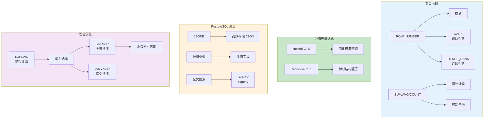

# L31: SQL 进阶 - 高级特性与性能优化

> **课程编号**: L31
> **所属阶段**: Stage 3 - Web 开发基础
> **预计时长**: 4-5 小时
> **难度**: ⭐⭐⭐⭐☆（高级）
> **前置课程**: L28
> **版本**: v1.0
> **最后更新**: 2026-07-23
> **核心版本**: Python 3.13


---

## 🎯 学习目标

完成本课程后，你将能够：

1. ✅ **窗口函数**：掌握 SQL 窗口函数进行复杂数据分析
2. ✅ **CTE 表达式**：使用公用表表达式简化复杂查询
3. ✅ **PostgreSQL 高级特性**：JSON、数组、全文搜索
4. ✅ **SQL 性能优化**：索引、执行计划、查询调优
5. ✅ **事务控制**：理解隔离级别和并发控制

---



---

## Part 1: 窗口函数

### 1.1 窗口函数概述

窗口函数在不使用 GROUP BY 的情况下进行聚合计算：

```sql
-- 普通聚合 vs 窗口函数
-- 普通聚合：每个分组只返回一行
SELECT author_id, COUNT(*) as count
FROM posts
GROUP BY author_id;

-- 窗口函数：保持原表结构，增加聚合列
SELECT
    id,
    title,
    author_id,
    COUNT(*) OVER (PARTITION BY author_id) as count_per_author,
    created_at,
    ROW_NUMBER() OVER (ORDER BY created_at DESC) as row_num
FROM posts;
```

### 1.2 窗口函数分类

| 类型 | 函数 | 说明 |
|------|------|------|
| **聚合窗口** | SUM, AVG, COUNT, MIN, MAX | 聚合计算 |
| **排名窗口** | ROW_NUMBER, RANK, DENSE_RANK | 排名 |
| **偏移窗口** | LAG, LEAD, FIRST_VALUE, LAST_VALUE | 前后值 |
| **分布窗口** | PERCENT_RANK, CUME_DIST, NTILE | 分布统计 |

### 1.3 PARTITION BY 分区

```sql
-- 按作者分区计算文章数
SELECT
    p.id,
    p.title,
    u.username,
    COUNT(*) OVER (PARTITION BY p.author_id) as posts_by_author,
    AVG(LENGTH(p.content)) OVER (PARTITION BY p.author_id) as avg_content_length
FROM posts p
JOIN users u ON p.author_id = u.id;

-- 按月份分区统计
SELECT
    DATE_TRUNC('month', created_at) as month,
    COUNT(*) as total_posts,
    COUNT(*) OVER (ORDER BY DATE_TRUNC('month', created_at)) as cumulative_posts
FROM posts
GROUP BY DATE_TRUNC('month', created_at);
```

### 1.4 ORDER BY 排序

```sql
-- 计算排名
SELECT
    username,
    post_count,
    RANK() OVER (ORDER BY post_count DESC) as rank,
    DENSE_RANK() OVER (ORDER BY post_count DESC) as dense_rank,
    PERCENT_RANK() OVER (ORDER BY post_count DESC) as percentile
FROM (
    SELECT u.username, COUNT(p.id) as post_count
    FROM users u
    LEFT JOIN posts p ON u.id = p.author_id
    GROUP BY u.id, u.username
) author_stats;
```

### 1.5 排名函数详解

```sql
-- ROW_NUMBER：连续排名（无并列）
SELECT
    username,
    post_count,
    ROW_NUMBER() OVER (ORDER BY post_count DESC) as row_num
FROM author_stats;
-- 结果: 1, 2, 3, 4, 5...

-- RANK：有并列，跳过排名
SELECT
    username,
    post_count,
    RANK() OVER (ORDER BY post_count DESC) as rank
FROM author_stats;
-- 结果: 1, 1, 3, 4, 5...（两个第一，下一个是第三）

-- DENSE_RANK：密集排名（无跳过）
SELECT
    username,
    post_count,
    DENSE_RANK() OVER (ORDER BY post_count DESC) as dense_rank
FROM author_stats;
-- 结果: 1, 1, 2, 3, 4...（两个第一，下一个是第二）
```

### 1.6 偏移函数

```sql
-- LAG：获取前一行的值
SELECT
    created_at,
    title,
    author_id,
    LAG(title) OVER (PARTITION BY author_id ORDER BY created_at) as prev_title,
    LAG(created_at) OVER (PARTITION BY author_id ORDER BY created_at) as days_since_last_post
FROM posts
ORDER BY created_at;

-- LEAD：获取后一行的值
SELECT
    username,
    created_at,
    LEAD(created_at) OVER (ORDER BY created_at) as next_signup
FROM users
ORDER BY created_at;

-- FIRST_VALUE / LAST_VALUE
SELECT
    username,
    created_at,
    FIRST_VALUE(created_at) OVER (ORDER BY created_at) as first_signup,
    LAST_VALUE(created_at) OVER (
        ORDER BY created_at
        ROWS BETWEEN UNBOUNDED PRECEDING AND UNBOUNDED FOLLOWING
    ) as last_signup
FROM users;
```

### 1.7 NTILE 分桶

```sql
-- 将用户分成三组（高/中/低活跃度）
SELECT
    username,
    post_count,
    CASE
        NTILE(3) OVER (ORDER BY post_count DESC)
        WHEN 1 THEN '高活跃'
        WHEN 2 THEN '中活跃'
        WHEN 3 THEN '低活跃'
    END as activity_level
FROM (
    SELECT u.username, COUNT(p.id) as post_count
    FROM users u
    LEFT JOIN posts p ON u.id = p.author_id
    GROUP BY u.id, u.username
) author_stats;
```

### 1.8 窗口框架

```sql
-- 滑动窗口：最近7天的累计
SELECT
    created_at::date as day,
    COUNT(*) as daily_posts,
    SUM(COUNT(*)) OVER (
        ORDER BY created_at::date
        ROWS BETWEEN 6 PRECEDING AND CURRENT ROW
    ) as weekly_cumulative
FROM posts
GROUP BY created_at::date;

-- ROWS vs RANGE
-- ROWS：按物理行数
-- RANGE：按值范围
```

---

## Part 2: 公用表表达式（CTE）

### 2.1 CTE 基础

```sql
-- 普通子查询
SELECT *
FROM (
    SELECT author_id, COUNT(*) as post_count
    FROM posts
    GROUP BY author_id
) stats
WHERE post_count > 10;

-- CTE 重写
WITH author_stats AS (
    SELECT author_id, COUNT(*) as post_count
    FROM posts
    GROUP BY author_id
)
SELECT *
FROM author_stats
WHERE post_count > 10;
```

### 2.2 递归 CTE

```sql
-- 递归 CTE：查找组织架构
WITH RECURSIVE org_tree AS (
    -- 基础查询（根节点）
    SELECT id, name, manager_id, 1 as level
    FROM employees
    WHERE manager_id IS NULL

    UNION ALL

    -- 递归查询
    SELECT e.id, e.name, e.manager_id, ot.level + 1
    FROM employees e
    JOIN org_tree ot ON e.manager_id = ot.id
)
SELECT * FROM org_tree;

-- 递归 CTE：生成数字序列
WITH RECURSIVE numbers AS (
    SELECT 1 as n
    UNION ALL
    SELECT n + 1 FROM numbers WHERE n < 100
)
SELECT * FROM numbers;

-- 递归 CTE：遍历树形分类
WITH RECURSIVE category_tree AS (
    SELECT id, name, parent_id, 0 as depth, ARRAY[name] as path
    FROM categories
    WHERE parent_id IS NULL

    UNION ALL

    SELECT c.id, c.name, c.parent_id, ct.depth + 1, ct.path || c.name
    FROM categories c
    JOIN category_tree ct ON c.parent_id = ct.id
)
SELECT
    id,
    REPEAT('  ', depth) || name as indented_name,
    depth,
    array_to_string(path, ' > ') as breadcrumb
FROM category_tree;
```

### 2.3 链式 CTE

```sql
-- 多步骤分析
WITH
-- Step 1: 计算每个作者的文章统计
author_stats AS (
    SELECT
        author_id,
        COUNT(*) as total_posts,
        COUNT(*) FILTER (WHERE published = TRUE) as published_posts
    FROM posts
    GROUP BY author_id
),
-- Step 2: 计算每个作者的评论统计
comment_stats AS (
    SELECT
        p.author_id,
        COUNT(c.id) as total_comments
    FROM posts p
    LEFT JOIN comments c ON p.id = c.post_id
    GROUP BY p.author_id
),
-- Step 3: 合并统计
combined AS (
    SELECT
        u.username,
        COALESCE(as.total_posts, 0) as posts,
        COALESCE(as.published_posts, 0) as published,
        COALESCE(cs.total_comments, 0) as comments
    FROM users u
    LEFT JOIN author_stats as ON u.id = as.author_id
    LEFT JOIN comment_stats cs ON u.id = cs.author_id
)
-- 最终查询
SELECT
    username,
    posts,
    published,
    comments,
    ROUND(published::numeric / NULLIF(posts, 0) * 100, 1) as publish_rate,
    ROUND(comments::numeric / NULLIF(posts, 0), 1) as comments_per_post
FROM combined
ORDER BY posts DESC;
```

### 2.4 视图 vs CTE

```sql
-- 视图：持久化存储
CREATE VIEW popular_authors AS
SELECT
    u.id, u.username,
    COUNT(p.id) as post_count
FROM users u
JOIN posts p ON u.id = p.author_id
GROUP BY u.id, u.username
HAVING COUNT(p.id) > 10;

-- CTE：临时使用，不持久化
WITH popular_authors AS (...)
SELECT * FROM popular_authors;
```

---

## Part 3: PostgreSQL 高级特性

### 3.1 JSON 数据类型

```sql
-- 创建带 JSON 字段的表
CREATE TABLE orders (
    id SERIAL PRIMARY KEY,
    customer_name VARCHAR(100),
    items JSONB,  -- 使用 JSONB 存储
    metadata JSON,
    created_at TIMESTAMP DEFAULT CURRENT_TIMESTAMP
);

-- 插入 JSON 数据
INSERT INTO orders (customer_name, items, metadata) VALUES
(
    'Alice',
    '[
        {"product": "Book", "quantity": 2, "price": 29.99},
        {"product": "Pen", "quantity": 5, "price": 1.99}
    ]'::jsonb,
    '{"source": "web", "coupon": "SAVE10"}'::json
);

-- JSON 操作符
SELECT items->0 FROM orders;  -- 获取第一个元素
SELECT items->>'product' FROM orders;  -- 获取文本值
SELECT items->0->>'product' FROM orders;  -- 链式访问

-- JSONB 查询
SELECT * FROM orders
WHERE items @> '[{"product": "Book"}]';  -- 包含
SELECT * FROM orders
WHERE items ? 'product';  -- 包含键

-- JSONB 路径查询
SELECT
    items,
    items#>'{0,product}' as first_product
FROM orders;

-- JSON 聚合
SELECT
    customer_name,
    jsonb_agg(items) as all_items
FROM orders
GROUP BY customer_name;
```

### 3.2 数组类型

```sql
-- 创建带数组字段的表
CREATE TABLE products (
    id SERIAL PRIMARY KEY,
    name VARCHAR(100),
    tags TEXT[],
    prices NUMERIC(10,2)[]
);

-- 插入数组数据
INSERT INTO products (name, tags, prices) VALUES
    ('Book', ARRAY['education', 'fiction'], ARRAY[29.99, 24.99]),
    ('Pen', ARRAY['office', 'writing'], ARRAY[1.99, 2.99]::numeric[]);

-- 数组操作
SELECT tags, tags[1], array_length(tags, 1) FROM products;
SELECT * FROM products WHERE 'fiction' = ANY(tags);
SELECT * FROM products WHERE tags && ARRAY['education', 'science'];
SELECT unnest(tags) as tag FROM products WHERE id = 1;
```

### 3.3 全文搜索

```sql
-- 添加全文搜索列
ALTER TABLE posts ADD COLUMN search_vector TSVECTOR;

-- 创建 GIN 索引
CREATE INDEX idx_posts_search ON posts USING GIN(search_vector);

-- 更新搜索向量
UPDATE posts SET
    search_vector = to_tsvector('english', title || ' ' || COALESCE(content, ''));

-- 触发器自动更新
CREATE OR REPLACE FUNCTION update_search_vector()
RETURNS TRIGGER AS $$
BEGIN
    NEW.search_vector := to_tsvector('english',
        COALESCE(NEW.title, '') || ' ' || COALESCE(NEW.content, '')
    );
    RETURN NEW;
END;
$$ LANGUAGE plpgsql;

CREATE TRIGGER posts_search_update
    BEFORE INSERT OR UPDATE ON posts
    FOR EACH ROW EXECUTE FUNCTION update_search_vector();

-- 搜索查询
SELECT title, ts_rank(search_vector, query) as rank
FROM posts, to_tsquery('english', 'python & async') query
WHERE search_vector @@ query
ORDER BY rank DESC;

-- 高级搜索
SELECT title, ts_headline('english', content, query) as snippet
FROM posts, to_tsquery('english', 'python & (async | await)') query
WHERE search_vector @@ query;
```

### 3.4 数组函数

```sql
-- 数组包含
SELECT * FROM products WHERE tags @> ARRAY['education'];

-- 数组交集
SELECT * FROM products WHERE tags && ARRAY['fiction', 'education'];

-- 数组追加
SELECT array_append(tags, 'new-tag') FROM products;

-- 数组删除
SELECT array_remove(tags, 'old-tag') FROM products;

-- 数组展开
SELECT id, unnest(tags) as tag FROM products;

-- 数组聚合
SELECT array_agg(DISTINCT tag ORDER BY tag)
FROM (SELECT unnest(tags) as tag FROM products) t;
```

---

## Part 4: SQL 性能优化

### 4.1 EXPLAIN 分析

```sql
-- 查看执行计划（不执行）
EXPLAIN SELECT * FROM posts WHERE author_id = 1;

-- 查看执行计划（实际执行）
EXPLAIN ANALYZE SELECT * FROM posts WHERE author_id = 1;

-- 格式化输出
EXPLAIN (FORMAT JSON) SELECT * FROM posts WHERE author_id = 1;
```

### 4.2 执行计划解读

```
Seq Scan on posts  (cost=0.00..45.00 rows=10 width=200)
                ↓
  rows=10 表示预计返回10行
  cost=0.00..45.00 表示启动成本..总成本
  Seq Scan 表示顺序扫描（全表扫描）
```

| 扫描类型 | 说明 | 性能 |
|----------|------|------|
| Seq Scan | 顺序扫描（全表） | 慢 |
| Index Scan | 索引扫描 | 快 |
| Index Only Scan | 仅索引扫描 | 最快 |
| Bitmap Heap Scan | 位图扫描 | 中 |

### 4.3 索引优化

```sql
-- B-Tree 索引（默认）
CREATE INDEX idx_posts_author ON posts(author_id);

-- 复合索引（顺序很重要！）
CREATE INDEX idx_posts_author_created ON posts(author_id, created_at DESC);

-- 部分索引
CREATE INDEX idx_posts_published ON posts(created_at)
WHERE published = TRUE;

-- 表达式索引
CREATE INDEX idx_posts_title_lower ON posts(LOWER(title));

-- 模糊查询索引
CREATE INDEX idx_posts_title_pattern ON posts(title varchar_pattern_ops);

-- 覆盖索引（INCLUDE）
CREATE INDEX idx_posts_author_cover ON posts(author_id) INCLUDE (title, created_at);

-- 重建索引
REINDEX INDEX idx_posts_author;
```

### 4.4 查询优化技巧

```sql
-- ❌ 低效：LIKE 模糊查询
SELECT * FROM posts WHERE title LIKE '%Python%';

-- ✅ 高效：全文搜索或前缀匹配
SELECT * FROM posts WHERE title LIKE 'Python%';
CREATE INDEX idx_title_prefix ON posts(title text_pattern_ops);

-- ❌ 低效：SELECT *
SELECT * FROM posts WHERE id = 1;

-- ✅ 高效：只查询需要的列
SELECT id, title FROM posts WHERE id = 1;

-- ❌ 低效：多次子查询
SELECT * FROM users
WHERE id IN (SELECT author_id FROM posts WHERE ...);

-- ✅ 高效：使用 JOIN
SELECT DISTINCT u.* FROM users u
JOIN posts p ON u.id = p.author_id
WHERE ...;

-- ❌ 低效：隐式类型转换
SELECT * FROM posts WHERE author_id = '1';

-- ✅ 高效：类型匹配
SELECT * FROM posts WHERE author_id = 1;
```

### 4.5 连接优化

```sql
-- 小表放左边（JOIN 顺序）
-- PostgreSQL 会自动优化，但显式指定更清晰
SELECT ...
FROM small_table s
JOIN large_table l ON s.id = l.small_id;

-- 避免 CROSS JOIN
SELECT * FROM users, posts;  -- ❌ 笛卡尔积
SELECT * FROM users u JOIN posts p ON u.id = p.author_id;  -- ✅

-- 使用 EXPLAIN ANALYZE 验证
EXPLAIN ANALYZE
SELECT u.username, p.title
FROM users u
JOIN posts p ON u.id = p.author_id
WHERE u.created_at > '2024-01-01';
```

### 4.6 分页优化

```sql
-- ❌ 低效：OFFSET 大时性能差
SELECT * FROM posts
ORDER BY id
LIMIT 20 OFFSET 100000;

-- ✅ 高效：使用游标分页
SELECT * FROM posts
WHERE id > 100000
ORDER BY id
LIMIT 20;

-- ✅ 高效：使用 keyset 分页
SELECT * FROM posts
WHERE created_at < '2024-01-15'
ORDER BY created_at DESC
LIMIT 20;
```

---

## Part 5: 事务与并发控制

### 5.1 事务基础

```sql
-- 显式事务
BEGIN;

UPDATE accounts SET balance = balance - 100 WHERE id = 1;
UPDATE accounts SET balance = balance + 100 WHERE id = 2;

COMMIT;  -- 或 ROLLBACK;
```

### 5.2 隔离级别

| 隔离级别 | 脏读 | 不可重复读 | 幻读 |
|----------|------|------------|------|
| READ UNCOMMITTED | 可能 | 可能 | 可能 |
| READ COMMITTED | ❌ | 可能 | 可能 |
| REPEATABLE READ | ❌ | ❌ | PostgreSQL 不可能 |
| SERIALIZABLE | ❌ | ❌ | ❌ |

```sql
-- 设置隔离级别
SET TRANSACTION ISOLATION LEVEL READ COMMITTED;
SET TRANSACTION ISOLATION LEVEL SERIALIZABLE;

BEGIN ISOLATION LEVEL SERIALIZABLE;
-- 事务操作
COMMIT;
```

### 5.3 锁机制

```sql
-- 行级锁
SELECT * FROM posts WHERE id = 1 FOR UPDATE;

-- 防止并发更新
SELECT * FROM inventory WHERE product_id = 123 FOR UPDATE;

-- NOWAIT：不等待锁
SELECT * FROM posts WHERE id = 1 FOR UPDATE NOWAIT;

-- SKIP LOCKED：跳过被锁的行
SELECT * FROM inventory
WHERE quantity > 0
ORDER BY product_id
FOR UPDATE SKIP LOCKED
LIMIT 1;
```

### 5.4 乐观并发控制

```sql
-- 添加 version 字段
ALTER TABLE posts ADD COLUMN version INTEGER DEFAULT 1;

-- 更新时检查版本
UPDATE posts
SET title = 'New Title', version = version + 1
WHERE id = 1 AND version = 1;

-- 检查更新是否成功
-- 影响行数为 0 表示版本冲突
```

---

## Part 6: 数据库维护

### 6.1 统计信息

```sql
-- 更新统计信息
ANALYZE posts;

-- 查看统计信息
SELECT * FROM pg_stat_user_tables WHERE relname = 'posts';

-- 查看索引使用情况
SELECT * FROM pg_stat_user_indexes WHERE relname = 'posts';
```

### 6.2  Vacuum 清理

```sql
-- 手动 VACUUM
VACUUM posts;

-- VACUUM FULL（会锁表）
VACUUM FULL posts;

-- 自动 Vacuum 配置
ALTER TABLE posts SET (
    autovacuum_vacuum_scale_factor = 0.01,  -- 1% 垃圾时触发
    autovacuum_analyze_scale_factor = 0.005  -- 0.5% 变化时触发
);
```

### 6.3 慢查询日志

```sql
-- 启用慢查询日志
ALTER SYSTEM SET log_min_duration_statement = 1000;  -- 1秒

-- 查看慢查询
SELECT * FROM pg_stat_statements
ORDER BY total_time DESC
LIMIT 10;
```

---

## 📝 课程总结

### 核心知识点

1. **窗口函数**
   - PARTITION BY / ORDER BY
   - 排名：ROW_NUMBER, RANK, DENSE_RANK
   - 偏移：LAG, LEAD, FIRST_VALUE

2. **CTE**
   - 简化复杂查询
   - 递归查询树形结构
   - 链式 CTE

3. **PostgreSQL 高级特性**
   - JSONB 操作符和函数
   - 数组类型
   - 全文搜索

4. **性能优化**
   - EXPLAIN 执行计划
   - 索引策略
   - 查询优化技巧

---

## ✅ 完成标准

完成本课程后，你应该能够：

- [ ] 使用窗口函数进行数据分析
- [ ] 编写递归 CTE 查询树形结构
- [ ] 使用 PostgreSQL JSON/数组特性
- [ ] 分析和优化 SQL 执行计划
- [ ] 理解事务隔离级别和锁机制

---

**下一步**: 继续学习 [L32: Docker 容器化部署](../L32-docker/lesson.md)
