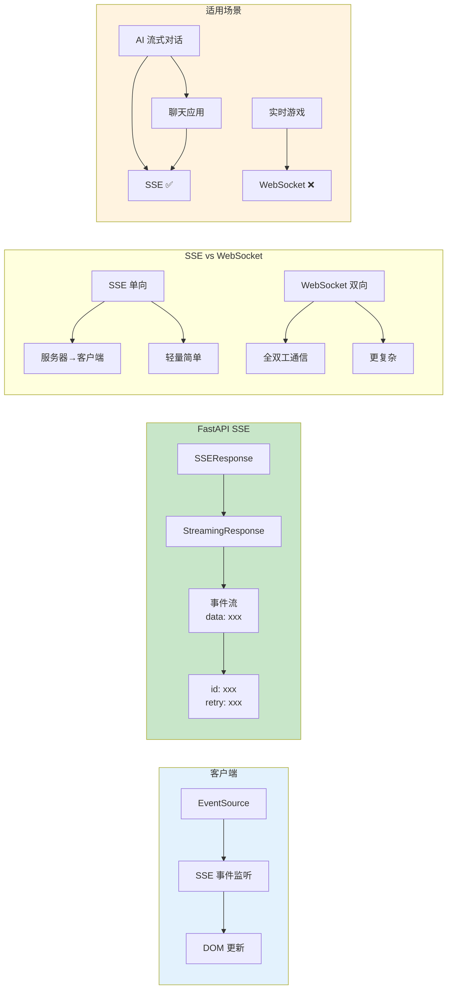

# L33: SSE 服务器推送事件

> **课程编号**: L33
> **所属阶段**: Stage 3 - Web 开发基础
> **预计时长**: 4-5 小时
> **难度**: ⭐⭐⭐⭐☆（高级）
> **前置课程**: L19, L26, L27
> **版本**: v1.0
> **最后更新**: 2026-07-23
> **核心版本**: Python 3.13


## 📚 前置知识

**学习本课程前，你应该掌握：**

- **L27**: FastAPI 可观测性与契约驱动（理解路由和响应）
- **L26**: HTTP 协议基础（理解长连接）
- **L19**: 异步编程（理解异步生成器）

**推荐掌握**：

- **L27**: OpenTelemetry（理解链路追踪）

**如果你还没有学习以上课程，建议先完成前置课程。**

---



---

实时通信是现代 Web 应用的核心需求。本课程聚焦 SSE（Server-Sent Events）协议，实现 AI Agent 流式对话。

## 第一章：SSE 协议基础

### 1.1 为什么需要 SSE？

**问题场景**：

```
用户正在使用 AI 助手：

❌ 传统方案（HTTP 轮询）：
- 客户端每 500ms 发一次请求："生成完了吗？"
- 服务器："还没"
- 客户端："现在呢？" → 服务器："还没"
- 浪费带宽、延迟高、服务器压力大

✅ SSE 方案（服务器推送）：
- 客户端发起一次连接
- 服务器持续推送 Token："根据"→"您的"→"问题"
- 客户端实时渲染
- 连接自动重连
```

---

### 1.2 SSE vs WebSocket

**技术对比**：

| 特性 | SSE | WebSocket |
|------|-----|-----------|
| **通信方向** | 单向（服务器→客户端） | 双向 |
| **协议** | HTTP/1.1 或 HTTP/2 | 独立协议（ws://） |
| **浏览器支持** | 所有现代浏览器 | 所有现代浏览器 |
| **自动重连** | ✅ 内置 | ❌ 需手动实现 |
| **事件 ID** | ✅ 支持断点续传 | ❌ 需自己实现 |
| **复杂度** | 简单 | 复杂 |
| **适用场景** | 服务器推送、通知、AI 流式 | 实时聊天、游戏、协作编辑 |

**选择 SSE 的时机**：

- ✅ 只需要服务器→客户端的单向推送
- ✅ 需要自动重连机制
- ✅ 基于 HTTP 协议（防火墙友好）
- ✅ AI Agent 流式对话
- ✅ 实时通知、进度更新

**选择 WebSocket 的时机**：

- ✅ 需要客户端频繁发送消息
- ✅ 双向实时通信
- ✅ 二进制数据传输
- ✅ 实时游戏、协作编辑

---

### 1.3 SSE 协议格式

**基本格式**：

```
event: message_type
data: {"key": "value"}
id: unique_event_id
retry: 3000

```

**字段说明**：

- `event`: 事件类型（可选，默认 "message"）
- `data`: 事件数据（必需，可以多行）
- `id`: 事件 ID（可选，用于断线重连）
- `retry`: 重连延迟（毫秒）

**完整示例**：

```
event: connection
data: {"status": "connected"}

event: token
data: {"content": "根据"}

event: token
data: {"content": "您的"}

event: token
data: {"content": "问题"}

event: completion
data: {"status": "success", "total_tokens": 3}

```

**关键规则**：

- 每个字段后面必须有 `\n`
- 事件之间用空行 `\n\n` 分隔
- `data` 字段可以重复多次（多行数据）
- 所有字段都是文本（JSON 需要序列化）

---

## 第二章：FastAPI SSE 实现

### 2.1 基础 SSE 端点

**最小可用实现**：

```python
from fastapi import FastAPI
from fastapi.responses import StreamingResponse
import asyncio
import json

app = FastAPI()

async def generate_sse_events():
    """生成 SSE 事件流"""
    # 1. 连接建立
    yield f"event: connection\n"
    yield f"data: {json.dumps({'status': 'connected'})}\n\n"

    # 2. 流式数据
    for i in range(10):
        await asyncio.sleep(0.5)
        yield f"event: token\n"
        yield f"data: {json.dumps({'index': i, 'content': f'Hello {i}'})}\n\n"

    # 3. 完成事件
    yield f"event: completion\n"
    yield f"data: {json.dumps({'status': 'completed'})}\n\n"

@app.get("/stream")
async def stream_events():
    return StreamingResponse(
        generate_sse_events(),
        media_type="text/event-stream",
        headers={
            "Cache-Control": "no-cache",
            "Connection": "keep-alive",
            "X-Accel-Buffering": "no",  # 禁用 Nginx 缓冲
        }
    )
```

**关键点**：

1. **`media_type="text/event-stream"`**：SSE 标准 MIME 类型
2. **`Cache-Control: no-cache`**：防止代理缓存
3. **`X-Accel-Buffering: no`**：禁用 Nginx 缓冲（生产环境）
4. **异步生成器**：使用 `async def` + `yield`

---

### 2.2 AI Agent 流式对话

**请求/响应模型**：

```python
from pydantic import BaseModel, Field
from typing import Literal

class ChatRequest(BaseModel):
    """对话请求"""
    message: str = Field(..., min_length=1, max_length=5000)
    conversation_id: str | None = None
    stream: bool = True

class SSEEvent(BaseModel):
    """SSE 事件（用于类型验证）"""
    event_type: Literal["connection", "token", "tool", "completion", "error"]
    data: dict
```

**流式生成器**：

```python
async def generate_agent_events(message: str, user_id: str):
    """生成 Agent 流式事件"""
    try:
        # 1. 连接建立
        yield format_sse_event("connection", {"status": "connected", "user_id": user_id})

        # 2. 模拟 Token 流式生成
        tokens = ["根据", "您的", "问题", "，", "我", "理解", "为", "..."]
        for token in tokens:
            await asyncio.sleep(0.1)
            yield format_sse_event("token", {
                "content": token,
                "timestamp": time.time()
            })

        # 3. 工具调用事件
        yield format_sse_event("tool", {
            "tool_name": "search_knowledge",
            "status": "started"
        })

        await asyncio.sleep(0.5)

        yield format_sse_event("tool", {
            "tool_name": "search_knowledge",
            "status": "completed",
            "result": "找到 3 条相关记录"
        })

        # 4. 完成事件
        yield format_sse_event("completion", {
            "status": "success",
            "total_tokens": len(tokens)
        })

    except Exception as e:
        yield format_sse_event("error", {
            "message": str(e),
            "type": type(e).__name__
        })

def format_sse_event(event_type: str, data: dict) -> str:
    """格式化 SSE 事件"""
    return f"event: {event_type}\ndata: {json.dumps(data, ensure_ascii=False)}\n\n"
```

**路由实现**：

```python
from fastapi import APIRouter, Request, HTTPException

router = APIRouter(prefix="/api/v1/agent")

@router.post("/chat")
async def chat_stream(request: Request, chat_request: ChatRequest):
    """Agent 流式对话接口"""
    if not chat_request.stream:
        raise HTTPException(status_code=400, detail="必须启用流式模式")

    # 这里应该从 JWT 获取 user_id（见第三章）
    user_id = "demo_user"

    return StreamingResponse(
        generate_agent_events(chat_request.message, user_id),
        media_type="text/event-stream",
        headers={
            "Cache-Control": "no-cache",
            "Connection": "keep-alive",
            "X-Accel-Buffering": "no",
        }
    )
```

---

## 第三章：安全与追踪

### 3.1 JWT 认证集成

**依赖注入**：

```python
from fastapi import Depends, Header, HTTPException
from typing import Annotated

async def get_current_user(authorization: str = Header(None)) -> dict:
    """验证 JWT Token"""
    if not authorization or not authorization.startswith("Bearer "):
        raise HTTPException(status_code=401, detail="缺少认证 Token")

    token = authorization.replace("Bearer ", "")

    # 这里应该调用真实的 JWT 验证逻辑
    # 参考 L35: 安全网关
    try:
        # user_data = await verify_jwt_token(token)
        # 模拟验证
        user_data = {"user_id": "demo_user", "username": "alice"}
        return user_data
    except Exception:
        raise HTTPException(status_code=401, detail="Token 无效")

@router.post("/chat")
async def chat_stream(
    request: Request,
    chat_request: ChatRequest,
    current_user: Annotated[dict, Depends(get_current_user)],
):
    """需要认证的流式接口"""
    user_id = current_user["user_id"]

    return StreamingResponse(
        generate_agent_events(chat_request.message, user_id),
        media_type="text/event-stream",
    )
```

---

### 3.2 OpenTelemetry 追踪

**提取 Trace Context**：

```python
from opentelemetry import trace
from opentelemetry.propagate import extract

def extract_trace_context(request: Request) -> dict:
    """从请求头提取 Trace Context"""
    carrier = dict(request.headers)
    context = extract(carrier)
    return context

@router.post("/chat")
async def chat_stream(request: Request, chat_request: ChatRequest):
    # 提取 Trace Context
    context = extract_trace_context(request)

    tracer = trace.get_tracer(__name__)
    with tracer.start_as_current_span("chat_stream_endpoint", context=context) as span:
        span.set_attribute("message_length", len(chat_request.message))

        return StreamingResponse(
            generate_agent_events(chat_request.message),
            media_type="text/event-stream",
        )
```

**流式生成器追踪**：

```python
async def generate_agent_events(message: str, user_id: str):
    """带追踪的事件生成"""
    tracer = trace.get_tracer(__name__)

    with tracer.start_as_current_span("agent_stream") as span:
        span.set_attribute("user_id", user_id)
        span.set_attribute("message_length", len(message))

        yield format_sse_event("connection", {
            "status": "connected",
            "trace_id": format(span.get_span_context().trace_id, '032x')
        })

        # 流式生成...
        async for token in generate_tokens(message):
            with tracer.start_as_current_span("generate_token"):
                yield format_sse_event("token", {"content": token})

        yield format_sse_event("completion", {"status": "success"})
```

---

## 第四章：客户端集成

### 4.1 JavaScript 客户端

**基础实现**：

```javascript
class AgentClient {
  constructor(baseUrl, token) {
    this.baseUrl = baseUrl;
    this.token = token;
  }

  async chat(message, onEvent) {
    const response = await fetch(`${this.baseUrl}/api/v1/agent/chat`, {
      method: "POST",
      headers: {
        "Content-Type": "application/json",
        Authorization: `Bearer ${this.token}`,
      },
      body: JSON.stringify({ message, stream: true }),
    });

    if (!response.ok) {
      throw new Error(`HTTP ${response.status}: ${response.statusText}`);
    }

    const reader = response.body.getReader();
    const decoder = new TextDecoder();
    let buffer = "";
    let currentEvent = null;

    while (true) {
      const { done, value } = await reader.read();
      if (done) break;

      buffer += decoder.decode(value, { stream: true });
      const lines = buffer.split("\n");
      buffer = lines.pop();

      for (const line of lines) {
        if (line.startsWith("event:")) {
          currentEvent = line.replace("event:", "").trim();
        } else if (line.startsWith("data:")) {
          const dataStr = line.replace("data:", "").trim();
          if (dataStr && currentEvent) {
            const data = JSON.parse(dataStr);
            onEvent(currentEvent, data);
          }
        }
      }
    }
  }
}

// 使用示例
const client = new AgentClient("http://localhost:8000", "your-jwt-token");

await client.chat("Python 异步编程", (eventType, data) => {
  switch (eventType) {
    case "connection":
      console.log("✅ 连接建立");
      break;
    case "token":
      process.stdout.write(data.content);
      break;
    case "tool":
      console.log(`\n🔧 工具: ${data.tool_name} - ${data.status}`);
      break;
    case "completion":
      console.log("\n✅ 完成");
      break;
    case "error":
      console.error("\n❌ 错误:", data.message);
      break;
  }
});
```

---

### 4.2 React Hook 实现

```typescript
import { useState, useCallback } from 'react';

interface Message {
  role: 'user' | 'assistant';
  content: string;
}

function useAgentChat(baseUrl: string, token: string) {
  const [messages, setMessages] = useState<Message[]>([]);
  const [isStreaming, setIsStreaming] = useState(false);
  const [error, setError] = useState<string | null>(null);

  const sendMessage = useCallback(async (content: string) => {
    setIsStreaming(true);
    setError(null);

    // 添加用户消息
    setMessages(prev => [...prev, { role: 'user', content }]);

    // 添加空的 assistant 消息
    setMessages(prev => [...prev, { role: 'assistant', content: '' }]);

    try {
      const response = await fetch(`${baseUrl}/api/v1/agent/chat`, {
        method: 'POST',
        headers: {
          'Content-Type': 'application/json',
          'Authorization': `Bearer ${token}`,
        },
        body: JSON.stringify({ message: content, stream: true }),
      });

      if (!response.ok) {
        throw new Error(`HTTP ${response.status}`);
      }

      const reader = response.body!.getReader();
      const decoder = new TextDecoder();
      let buffer = '';
      let currentEvent = null;

      while (true) {
        const { done, value } = await reader.read();
        if (done) break;

        buffer += decoder.decode(value, { stream: true });
        const lines = buffer.split('\n');
        buffer = lines.pop()!;

        for (const line of lines) {
          if (line.startsWith('event:')) {
            currentEvent = line.replace('event:', '').trim();
          } else if (line.startsWith('data:')) {
            const dataStr = line.replace('data:', '').trim();
            if (dataStr && currentEvent === 'token') {
              const data = JSON.parse(dataStr);

              setMessages(prev => {
                const updated = [...prev];
                const lastMsg = updated[updated.length - 1];
                updated[updated.length - 1] = {
                  ...lastMsg,
                  content: lastMsg.content + data.content,
                };
                return updated;
              });
            } else if (currentEvent === 'error') {
              const data = JSON.parse(dataStr);
              setError(data.message);
            }
          }
        }
      }
    } catch (err) {
      setError(err instanceof Error ? err.message : '未知错误');
    } finally {
      setIsStreaming(false);
    }
  }, [baseUrl, token]);

  return { messages, isStreaming, error, sendMessage };
}

// 组件中使用
function ChatComponent() {
  const { messages, isStreaming, error, sendMessage } = useAgentChat(
    'http://localhost:8000',
    'your-jwt-token'
  );

  return (
    <div>
      {messages.map((msg, i) => (
        <div key={i} className={msg.role}>
          {msg.content}
        </div>
      ))}
      {error && <div className="error">{error}</div>}
      {isStreaming && <div className="loading">生成中...</div>}
    </div>
  );
}
```

---


---

## 第五章：高级 SSE 特性与最佳实践

### 5.1 SSE 重连机制

SSE 原生支持自动重连，但需要服务端配合：

```python
from fastapi import APIRouter, Request
from fastapi.responses import StreamingResponse
import asyncio
import random

router = APIRouter()

# 带 Last-Event-ID 的重连支持
@router.get("/api/events/reconnect")
async def sse_with_reconnect(request: Request):
    """支持断点续传的 SSE 端点"""
    
    # 获取上次断开的位置
    last_event_id = request.headers.get("Last-Event-ID", "0")
    
    async def event_generator():
        start_index = int(last_event_id) if last_event_id.isdigit() else 0
        
        for i in range(start_index, start_index + 100):
            # 生成事件数据
            event_data = {
                "id": i,
                "timestamp": asyncio.get_event_loop().time(),
                "value": random.random(),
            }
            
            # SSE 格式：id + data + 空行
            yield f"id: {i}\n"
            yield f"data: {json.dumps(event_data)}\n"
            yield "\n"
            
            # 模拟延迟
            await asyncio.sleep(0.5)
    
    return StreamingResponse(
        event_generator(),
        media_type="text/event-stream",
        headers={
            "Cache-Control": "no-cache",
            "Connection": "keep-alive",
            "X-Accel-Buffering": "no",  # 禁用 Nginx 缓冲
        },
    )
```

```javascript
// 客户端重连实现
class SSEClient {
    constructor(url, options = {}) {
        this.url = url;
        this.options = options;
        this.eventSource = null;
        this.lastEventId = 0;
        this.reconnectDelay = 1000;
        this.maxReconnectDelay = 30000;
        this.listeners = new Map();
    }

    connect() {
        // 带 Last-Event-ID 的重连
        const url = new URL(this.url);
        if (this.lastEventId > 0) {
            url.searchParams.set("lastEventId", this.lastEventId);
        }

        this.eventSource = new EventSource(url.toString());

        this.eventSource.onopen = () => {
            console.log("SSE 连接已建立");
            this.reconnectDelay = 1000;  // 重置重连延迟
        };

        // 处理不同类型的事件
        this.eventSource.addEventListener("message", (e) => {
            this.lastEventId = e.lastEventId;
            this.emit("message", JSON.parse(e.data));
        });

        this.eventSource.addEventListener("error", (e) => {
            this.emit("error", e);
            
            if (this.eventSource.readyState === EventSource.CLOSED) {
                this.scheduleReconnect();
            }
        });

        // 自定义事件
        ["token", "tool", "completion", "progress"].forEach((eventType) => {
            this.eventSource.addEventListener(eventType, (e) => {
                this.lastEventId = e.lastEventId;
                this.emit(eventType, JSON.parse(e.data));
            });
        });
    }

    scheduleReconnect() {
        console.log(`${this.reconnectDelay}ms 后重连...`);
        
        setTimeout(() => {
            this.connect();
        }, this.reconnectDelay);

        // 指数退避
        this.reconnectDelay = Math.min(
            this.reconnectDelay * 2,
            this.maxReconnectDelay
        );
    }

    on(event, callback) {
        if (!this.listeners.has(event)) {
            this.listeners.set(event, []);
        }
        this.listeners.get(event).push(callback);
    }

    emit(event, data) {
        const callbacks = this.listeners.get(event) || [];
        callbacks.forEach((cb) => cb(data));
    }

    close() {
        if (this.eventSource) {
            this.eventSource.close();
            this.eventSource = null;
        }
    }
}

// 使用示例
const client = new SSEClient("http://localhost:8000/api/events/reconnect");

client.on("token", (data) => {
    process.stdout.write(data.content);
});

client.on("completion", (data) => {
    console.log("\n完成！耗时:", data.duration);
});

client.on("error", (err) => {
    console.error("SSE 错误:", err);
});

client.connect();
```

### 5.2 多路复用 SSE

在单个 SSE 连接上传输多种类型的流：

```python
from fastapi import APIRouter
from fastapi.responses import StreamingResponse
import asyncio
import json
import uuid

router = APIRouter()


@router.get("/api/v2/multiplex")
async def multiplexed_sse():
    """
    多路复用 SSE：在一个连接上同时传输多个数据流
    - stream_id: 区分不同数据流
    - channel: 数据类型（log, metric, notification）
    """
    
    async def event_generator():
        # 并行生成多个数据流
        async def log_stream():
            """日志流"""
            for i in range(50):
                yield f"event: log\n"
                yield f"data: {json.dumps({'stream_id': 'main', 'level': 'INFO', 'message': f'Log entry {i}'})}\n"
                yield "\n"
                await asyncio.sleep(0.2)
        
        async def metric_stream():
            """指标流"""
            value = 0
            for i in range(100):
                value += random.uniform(-5, 5)
                yield f"event: metric\n"
                yield f"data: {json.dumps({'stream_id': 'metrics', 'cpu': value, 'memory': random.uniform(20, 80)})}\n"
                yield "\n"
                await asyncio.sleep(0.1)
        
        async def notification_stream():
            """通知流"""
            messages = ["任务开始", "下载中...", "处理完成", "发送通知"]
            for msg in messages:
                yield f"event: notification\n"
                yield f"data: {json.dumps({'stream_id': 'notify', 'message': msg, 'timestamp': time.time()})}\n"
                yield "\n"
                await asyncio.sleep(1)
        
        # 使用 asyncio.gather 并行运行多个流
        # 注意：这里简化了实现，实际需要更复杂的轮询逻辑
        tasks = [log_stream(), metric_stream(), notification_stream()]
        
        # 轮询方式实现多路复用
        queues = [asyncio.Queue() for _ in tasks]
        
        async def fill_queue(task_idx, task_coro):
            """将任务输出放入队列"""
            async for item in task_coro:
                await queues[task_idx].put(item)
        
        # 启动生产者
        producers = [
            asyncio.create_task(fill_queue(i, task))
            for i, task in enumerate(tasks)
        ]
        
        # 消费者：从各队列轮询获取数据
        active = set(range(len(queues)))
        while active:
            for i in list(active):
                try:
                    item = await asyncio.wait_for(queues[i].get(), timeout=0.05)
                    yield item
                except asyncio.TimeoutError:
                    pass
                except asyncio.CancelledError:
                    active.discard(i)
        
        # 取消生产者
        for p in producers:
            p.cancel()
    
    return StreamingResponse(
        event_generator(),
        media_type="text/event-stream",
        headers={
            "X-Accel-Buffering": "no",
        },
    )
```

```javascript
// 多路复用客户端
class MultiplexedSSEClient {
    constructor(url) {
        this.url = url;
        this.streams = new Map();
        this.eventSource = null;
    }

    connect() {
        this.eventSource = new EventSource(this.url);

        // 每个 stream_id 维护独立状态
        this.eventSource.addEventListener("log", (e) => {
            const data = JSON.parse(e.data);
            this.emit("log", data);
            this.updateStreamState(data.stream_id);
        });

        this.eventSource.addEventListener("metric", (e) => {
            const data = JSON.parse(e.data);
            this.emit("metric", data);
            this.updateStreamState(data.stream_id);
        });

        this.eventSource.addEventListener("notification", (e) => {
            const data = JSON.parse(e.data);
            this.emit("notification", data);
            this.updateStreamState(data.stream_id);
        });

        this.eventSource.onerror = (err) => {
            console.error("SSE 错误:", err);
        };
    }

    updateStreamState(streamId) {
        if (!this.streams.has(streamId)) {
            this.streams.set(streamId, {
                lastUpdate: Date.now(),
                messageCount: 0,
            });
        }
        
        const state = this.streams.get(streamId);
        state.lastUpdate = Date.now();
        state.messageCount++;
    }

    on(event, callback) {
        // 实现与 SSEClient 相同
    }

    emit(event, data) {
        // 实现与 SSEClient 相同
    }

    close() {
        if (this.eventSource) {
            this.eventSource.close();
        }
    }
}

// 使用示例
const client = new MultiplexedSSEClient("http://localhost:8000/api/v2/multiplex");

client.on("log", (data) => {
    console.log(`[${data.stream_id}] ${data.level}: ${data.message}`);
});

client.on("metric", (data) => {
    // 更新监控图表
    updateChart("cpu", data.cpu);
    updateChart("memory", data.memory);
});

client.on("notification", (data) => {
    showNotification(data.message);
});

client.connect();
```

### 5.3 SSE 与 WebSocket 权衡

```python
"""
SSE vs WebSocket 选择指南

| 特性 | SSE | WebSocket |
|------|-----|-----------|
| 方向 | 单向（服务端→客户端） | 双向 |
| 协议 | HTTP/1.1 | ws:// / wss:// |
| 重连 | 自动（内置） | 需手动实现 |
| 二进制 | 需 Base64 编码 | 原生支持 |
| HTTP/2 | 多路复用 | 独立连接 |
| 兼容性 | 较好 | 需 polyfill |
| 简单度 | 简单 | 较复杂 |
| 性能 | 较低 | 较高 |

选择 SSE：
- 需要服务端推送
- 不需要双向通信
- 需要自动重连
- 部署在 HTTP/2 环境
- 需要简单实现

选择 WebSocket：
- 需要双向通信
- 需要低延迟
- 需要传输二进制数据
- 高频数据交换
"""
```

### 5.4 SSE 生产配置

```python
# Nginx 配置
upstream backend {
    server localhost:8000;
}

server {
    location /api/events {
        # 禁用缓冲
        proxy_buffering off;
        proxy_cache off;
        
        # 设置超时
        proxy_read_timeout 86400s;
        proxy_send_timeout 86400s;
        
        # 传递 Client-IP
        proxy_set_header Host $host;
        proxy_set_header X-Real-IP $remote_addr;
        proxy_set_header X-Forwarded-For $proxy_add_x_forwarded_for;
        
        # SSE 必需头
        proxy_hide_header X-Accel-Buffering;
        add_header X-Accel-Buffering no;
        
        proxy_pass http://backend;
    }
}
```

```yaml
# Docker 配置
services:
  app:
    image: your-app
    deploy:
      resources:
        limits:
          # SSE 连接需要更多文件描述符
          nofile:
            soft: 65536
            hard: 65536
    
    environment:
      # 超时配置
      - SSE_TIMEOUT=86400
      - SSE_MAX_CONNECTIONS=10000
```

### 5.5 SSE 性能监控

```python
# SSE 连接监控指标
from prometheus_client import Counter, Gauge, Histogram

SSE_CONNECTIONS = Gauge(
    "sse_connections_active",
    "Number of active SSE connections",
    ["endpoint"],
)

SSE_MESSAGES = Counter(
    "sse_messages_sent_total",
    "Total number of SSE messages sent",
    ["endpoint", "event_type"],
)

SSE_LATENCY = Histogram(
    "sse_message_latency_seconds",
    "SSE message generation latency",
    ["endpoint"],
    buckets=[0.001, 0.005, 0.01, 0.05, 0.1, 0.5],
)


@router.get("/api/events/monitored")
async def monitored_sse():
    """带监控的 SSE 端点"""
    endpoint = "/api/events/monitored"
    SSE_CONNECTIONS.labels(endpoint=endpoint).inc()
    
    try:
        async def event_generator():
            for i in range(100):
                start = time.time()
                
                # 生成数据
                data = generate_event_data(i)
                
                # 记录延迟
                latency = time.time() - start
                SSE_LATENCY.labels(endpoint=endpoint).observe(latency)
                
                # 发送消息
                yield f"data: {json.dumps(data)}\n\n"
                
                # 记录消息数
                SSE_MESSAGES.labels(endpoint=endpoint, event_type=data["type"]).inc()
                
                await asyncio.sleep(0.1)
    finally:
        SSE_CONNECTIONS.labels(endpoint=endpoint).dec()
    
    return StreamingResponse(event_generator(), media_type="text/event-stream")
```

### 5.6 常见问题与解决方案

```python
"""
Q1: SSE 在移动端断开后无法重连？

A: 移动端浏览器对 SSE 支持有限，建议：
1. 使用 WebSocket 作为移动端备选
2. 实现心跳机制检测连接状态
3. 监听 visibilitychange 事件
"""

# 客户端心跳检测
class SSEWithHeartbeat {
    constructor(url, options = {}) {
        this.url = url;
        this.heartbeatInterval = options.heartbeatInterval || 30000;
        this.heartbeatTimeout = options.heartbeatTimeout || 10000;
        this.lastHeartbeat = null;
        this.heartbeatTimer = null;
        this.heartbeatResponseTimer = null;
    }

    connect() {
        this.eventSource = new EventSource(this.url);
        
        // 心跳请求
        this.heartbeatTimer = setInterval(() => {
            fetch("/api/heartbeat", { keepalive: true })
                .then(() => {
                    this.lastHeartbeat = Date.now();
                })
                .catch(() => {
                    // 心跳失败，可能断线
                    this.reconnect();
                });
        }, this.heartbeatInterval);

        // 检测页面可见性
        document.addEventListener("visibilitychange", () => {
            if (document.visibilityState === "visible") {
                // 页面重新可见，检查连接状态
                if (!this.eventSource || this.eventSource.readyState === EventSource.CLOSED) {
                    this.reconnect();
                }
            }
        });
    }
}


/*
Q2: Nginx 返回 502 错误？

A: Nginx 默认会缓冲 SSE 响应，需要配置：
- proxy_buffering off;
- proxy_cache off;
*/


/*
Q3: 如何限制 SSE 连接数？

A: 使用 Semaphore 或 Redis 计数器：
*/

from fastapi import APIRouter, HTTPException
from contextlib import asynccontextmanager

router = APIRouter()

MAX_CONNECTIONS = 100
connection_semaphore = asyncio.Semaphore(MAX_CONNECTIONS)


@router.get("/api/events/limited")
async def limited_sse():
    # 获取信号量，超时则拒绝
    try:
        async with asyncio.timeout(5):
            await connection_semaphore.acquire()
    except asyncio.TimeoutError:
        raise HTTPException(status_code=503, detail="Server busy")
    
    try:
        async def event_generator():
            try:
                for i in range(100):
                    yield f"data: {json.dumps({'i': i})}\n\n"
                    await asyncio.sleep(1)
            finally:
                connection_semaphore.release()
        
        return StreamingResponse(event_generator(), media_type="text/event-stream")
    except asyncio.CancelledError:
        connection_semaphore.release()
        raise
```

---

## 第六章：面试题与实战演练

### 6.1 核心面试题

```python
"""
Q1: 什么是 SSE？与 WebSocket 有什么区别？

A: 
SSE (Server-Sent Events) 是一种基于 HTTP 的服务端推送技术。
- 单向通信：只能服务端向客户端推送
- 使用标准 HTTP 协议
- 内置自动重连机制
- 轻量级实现简单

与 WebSocket 的主要区别：
- 方向：SSE 单向，WebSocket 双向
- 协议：SSE 使用 HTTP，WebSocket 使用独立协议
- 重连：SSE 自动，WebSocket 需手动实现
"""

"""
Q2: SSE 的优缺点是什么？

A:
优点：
1. 简单易实现，基于 HTTP
2. 自动重连，无需手动处理
3. 兼容性好，现代浏览器都支持
4. 可通过 HTTP 代理
5. 支持 HTTP/2 多路复用

缺点：
1. 单向通信，不能发送数据到服务端
2. 二进制数据需要 Base64 编码
3. 有浏览器并发连接数限制（6个）
4. 实时性不如 WebSocket
"""

"""
Q3: 如何保证 SSE 消息的可靠性？

A:
1. 使用 event.id 和 Last-Event-ID 实现断点续传
2. 添加心跳机制检测连接状态
3. 实现消息确认机制
4. 使用幂等操作处理重复消息
"""

"""
Q4: SSE 在生产环境需要注意什么？

A:
1. 合理设置超时时间
2. 限制最大连接数
3. 实现连接监控和告警
4. 配置 Nginx 禁用缓冲
5. 考虑使用 Redis Pub/Sub 扩展到多实例
"""
```

### 6.2 完整项目：实时日志监控系统

```python
# 项目结构
"""
log_monitor/
├── main.py           # FastAPI 应用
├── routers/
│   └── sse.py        # SSE 路由
├── services/
│   └── log_processor.py  # 日志处理服务
├── models/
│   └── log.py        # 日志模型
└── tests/
    └── test_sse.py   # SSE 测试
"""

# models/log.py
from pydantic import BaseModel
from typing import Literal
from datetime import datetime


class LogEntry(BaseModel):
    id: int
    timestamp: datetime
    level: Literal["DEBUG", "INFO", "WARNING", "ERROR", "CRITICAL"]
    message: str
    source: str
    metadata: dict | None = None


# services/log_processor.py
import asyncio
import random
from datetime import datetime
from models.log import LogEntry


class LogProcessor:
    """日志处理器"""
    
    def __init__(self):
        self.log_levels = ["DEBUG", "INFO", "WARNING", "ERROR", "CRITICAL"]
        self.sources = ["api", "database", "cache", "worker", "scheduler"]
        self.counter = 0
    
    async def generate_logs(self):
        """模拟生成日志"""
        while True:
            self.counter += 1
            
            log = LogEntry(
                id=self.counter,
                timestamp=datetime.now(),
                level=random.choice(self.log_levels),
                message=f"Processing request #{self.counter}",
                source=random.choice(self.sources),
                metadata={"request_id": f"req_{self.counter}"},
            )
            
            yield log
            await asyncio.sleep(random.uniform(0.1, 1.0))
    
    def filter_logs(self, logs, level_filter=None):
        """过滤日志"""
        if not level_filter:
            return logs
        
        level_priority = {
            "DEBUG": 0,
            "INFO": 1,
            "WARNING": 2,
            "ERROR": 3,
            "CRITICAL": 4,
        }
        
        min_level = level_priority.get(level_filter, 0)
        return [
            log for log in logs
            if level_priority.get(log.level, 0) >= min_level
        ]


# routers/sse.py
from fastapi import APIRouter, Query
from fastapi.responses import StreamingResponse
from services.log_processor import LogProcessor
import json

router = APIRouter()
processor = LogProcessor()


@router.get("/api/logs/stream")
async def log_stream(
    level: str = Query(None, description="最低日志级别"),
    source: str = Query(None, description="日志来源过滤"),
):
    """实时日志流"""
    
    async def event_generator():
        async for log in processor.generate_logs():
            # 应用过滤器
            if level and level not in ["DEBUG", "INFO", "WARNING", "ERROR", "CRITICAL"]:
                continue
            if source and log.source != source:
                continue
            
            # SSE 格式发送
            yield f"id: {log.id}\n"
            yield f"event: log\n"
            yield f"data: {log.model_dump_json()}\n"
            yield "\n"
    
    return StreamingResponse(
        event_generator(),
        media_type="text/event-stream",
        headers={
            "Cache-Control": "no-cache",
            "Connection": "keep-alive",
            "X-Accel-Buffering": "no",
        },
    )
```

### 6.3 测试用例

```python
# tests/test_sse.py
import pytest
from httpx import AsyncClient, ASGITransport
from main import app


@pytest.mark.asyncio
async def test_sse_connection():
    """测试 SSE 连接"""
    async with AsyncClient(
        transport=ASGITransport(app=app),
        timeout=None,
    ) as client:
        async with client.stream("GET", "/api/logs/stream") as response:
            assert response.status_code == 200
            assert response.headers["content-type"] == "text/event-stream"
            
            # 读取前几条消息
            messages = []
            async for line in response.aiter_lines():
                if line.startswith("data:"):
                    messages.append(json.loads(line[5:]))
                    if len(messages) >= 5:
                        break
            
            assert len(messages) >= 5
            assert "id" in messages[0]
            assert "level" in messages[0]


@pytest.mark.asyncio
async def test_sse_with_filters():
    """测试带过滤器的 SSE"""
    async with AsyncClient(
        transport=ASGITransport(app=app),
        timeout=None,
    ) as client:
        async with client.stream(
            "GET", 
            "/api/logs/stream",
            params={"level": "ERROR"}
        ) as response:
            assert response.status_code == 200
            
            # 验证只收到 ERROR 级别日志
            async for line in response.aiter_lines():
                if line.startswith("data:"):
                    data = json.loads(line[5:])
                    assert data["level"] == "ERROR"
                    break
```


---

## 📝 本章总结

### 核心知识点

1. **SSE 协议**：`event`/`data`/`id`/`retry` 格式
2. **FastAPI StreamingResponse**：流式响应实现
3. **异步生成器**：`async def` + `yield`
4. **JWT 认证**：保护 SSE 端点
5. **OpenTelemetry**：分布式追踪
6. **客户端集成**：JavaScript/React 实现

### 关键要点

- ✅ SSE 适合单向推送场景
- ✅ `media_type="text/event-stream"` 必须设置
- ✅ 禁用缓存和 Nginx 缓冲
- ✅ 异常处理发送 error 事件
- ✅ 客户端需要手动解析 SSE 格式

### 常见陷阱

- ❌ 忘记设置 `X-Accel-Buffering: no`（Nginx 缓冲）
- ❌ 没有捕获 `asyncio.CancelledError`（客户端断开）
- ❌ JSON 序列化忘记 `ensure_ascii=False`（中文乱码）
- ❌ 事件之间没有空行分隔（客户端无法解析）
- ❌ 异步生成器中使用同步 I/O（阻塞其他请求）

### 实用技巧

- 💡 使用 `format_sse_event` 统一格式化
- 💡 客户端保存 `buffer` 处理不完整事件
- 💡 使用 `event_id` 实现断点续传
- 💡 测试时用 `curl -N` 查看原始 SSE 流
- 💡 生产环境配置 `Connection: keep-alive`

### 典型应用场景

- 🤖 AI Agent 流式对话
- 📊 实时数据推送（股票、监控）
- 📝 长任务进度更新
- 🔔 服务器通知推送
- 📈 日志流式展示

### 下一步

继续学习 [L34: WebSocket 实时通信](../L34-websocket/README.md)，对比 SSE 和 WebSocket 的使用场景。
