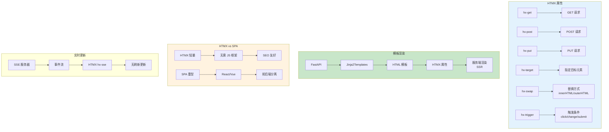

# L35: HTMX + FastAPI 全栈开发

> **课程编号**: L35
> **所属阶段**: Stage 3 - Web 开发基础
> **预计时长**: 4 小时
> **难度**: ⭐⭐⭐⭐☆
> **前置课程**: L27, L32
> **版本**: v1.0
> **最后更新**: 2026-07-23
> **核心版本**: Python 3.13

---

## 📌 学习目标

1. 理解 HTMX 渐进式增强核心理念
2. 掌握 FastAPI + HTMX 模板渲染模式
3. 学会使用 HTMX 高效实现 CRUD 交互
4. 理解 HTMX 与后端 API 的协同设计
5. 掌握 HTMX 表单验证与错误处理
6. 学会实现 SSE + HTMX 实时更新

---



---

## 📚 目录结构

```
L35-htmx/
├── README.md                    # 课程入口
├── lesson.md                    # 本文档
├── examples/                    # 示例代码
│   ├── 01_basic_htmx.py         # 基础 HTMX 示例
│   ├── 02_crud_operations.py    # CRUD 操作示例
│   ├── 03_sse_htmx.py           # SSE + HTMX 实时更新
│   └── 04_form_validation.py    # 表单验证示例
├── exercises/                  # 练习题
│   └── 01_exercise.py           # 任务管理器练习
├── solutions/                   # 参考解答
│   └── 01_solution.py
└── tests/                       # 测试套件
    └── test_htmx.py
```

---

## 1. HTMX 核心理念

### 1.1 渐进式增强 (Progressive Enhancement)

HTMX 的核心哲学是「渐进式增强」—— 先保证基础功能可用，再逐步添加交互能力：

```html
<!-- 基础 HTML：页面可正常访问 -->
<form action="/create-task" method="post">
    <input name="title" placeholder="新任务标题">
    <button type="submit">创建</button>
</form>

<!-- 添加 HTMX：获得异步交互能力 -->
<form hx-post="/create-task" hx-target="#task-list" hx-swap="beforeend">
    <input name="title" placeholder="新任务标题">
    <button type="submit">创建</button>
</form>
```

**核心优势**：
- 无需 JavaScript 框架即可实现 SPA 般的交互体验
- 后端渲染 + HTMX 异步更新 = 极简全栈
- 天然支持渐进增强，降级优雅

### 1.2 HTMX 请求模式

| 属性 | 作用 | 示例 |
|------|------|------|
| `hx-get` | GET 请求 | `hx-get="/tasks"` |
| `hx-post` | POST 请求 | `hx-post="/tasks"` |
| `hx-put` | PUT 请求 | `hx-put="/tasks/1"` |
| `hx-delete` | DELETE 请求 | `hx-delete="/tasks/1"` |
| `hx-patch` | PATCH 请求 | `hx-patch="/tasks/1"` |

### 1.3 目标与交换

| 属性 | 作用 | 示例 |
|------|------|------|
| `hx-target` | 指定更新目标 | `hx-target="#result"` |
| `hx-swap` | 交换策略 | `hx-swap="innerHTML"` |

**hx-swap 选项**：
- `innerHTML` — 替换内部内容（默认）
- `outerHTML` — 替换整个元素
- `beforebegin` — 插入到元素前
- `afterbegin` — 插入到元素内部开头
- `beforeend` — 插入到元素内部末尾
- `afterend` — 插入到元素后

---

## 2. FastAPI + Jinja2 模板配置

### 2.1 项目结构

```
project/
├── main.py                      # FastAPI 应用入口
├── templates/                   # Jinja2 模板目录
│   ├── base.html               # 基础模板
│   ├── index.html              # 首页
│   └── tasks/
│       ├── list.html           # 任务列表
│       └── form.html           # 任务表单
├── models/
│   └── task.py                 # Pydantic 模型
└── static/
    └── htmx.min.js            # HTMX 库
```

### 2.2 FastAPI 基础配置

```python
"""FastAPI + HTMX 全栈应用示例"""

from __future__ import annotations

from pathlib import Path
from typing import Annotated

from fastapi import FastAPI, Form, HTTPException, Request, Depends
from fastapi.responses import HTMLResponse
from fastapi.staticfiles import StaticFiles
from fastapi.templating import Jinja2Templates
from pydantic import BaseModel, Field
import uvicorn

# ============================================================
# 数据模型
# ============================================================

class Task(BaseModel):
    """任务数据模型"""
    id: int | None = None
    title: str = Field(..., min_length=1, max_length=200)
    completed: bool = False

    class Config:
        json_schema_extra = {
            "example": {
                "id": 1,
                "title": "学习 HTMX",
                "completed": False
            }
        }

class TaskRepository:
    """内存任务仓库"""

    def __init__(self) -> None:
        self.tasks: dict[int, Task] = {}
        self._next_id = 1

    def create(self, title: str) -> Task:
        task = Task(id=self._next_id, title=title)
        self.tasks[self._next_id] = task
        self._next_id += 1
        return task

    def get_all(self) -> list[Task]:
        return list(self.tasks.values())

    def get(self, task_id: int) -> Task | None:
        return self.tasks.get(task_id)

    def update(self, task_id: int, completed: bool) -> Task | None:
        if task_id not in self.tasks:
            return None
        self.tasks[task_id].completed = completed
        return self.tasks[task_id]

    def delete(self, task_id: int) -> bool:
        if task_id in self.tasks:
            del self.tasks[task_id]
            return True
        return False

# ============================================================
# FastAPI 应用
# ============================================================

app = FastAPI(title="HTMX Todo App", version="1.0.0")

# 静态文件和模板配置
BASE_DIR = Path(__file__).parent
app.mount("/static", StaticFiles(directory=BASE_DIR / "static"), name="static")
templates = Jinja2Templates(directory=BASE_DIR / "templates")

# 全局仓库
task_repo = TaskRepository()

# ============================================================
# 辅助函数
# ============================================================

def is_htmx_request(request: Request) -> bool:
    """检测是否为 HTMX 请求"""
    return "HX-Request" in request.headers

def hx_redirect(location: str) -> HTMLResponse:
    """HTMX 重定向响应"""
    response = HTMLResponse(content="", status_code=200)
    response.headers["HX-Redirect"] = location
    return response

def htmx_response(html: str, target: str | None = None) -> HTMLResponse:
    """创建 HTMX 响应"""
    response = HTMLResponse(content=html)
    if target:
        response.headers["HX-Reswap"] = f"innerHTML"
        response.headers["HX-Retarget"] = target
    return response

# ============================================================
# 路由
# ============================================================

@app.get("/", response_class=HTMLResponse)
async def index(request: Request):
    """首页 - 任务列表"""
    return templates.TemplateResponse(
        "tasks/list.html",
        {"request": request, "tasks": task_repo.get_all()}
    )

@app.get("/tasks", response_class=HTMLResponse)
async def list_tasks_partial(request: Request):
    """HTMX 片段：任务列表（用于局部更新）"""
    is_htmx = is_htmx_request(request)
    return templates.TemplateResponse(
        "tasks/list.html",
        {"request": request, "tasks": task_repo.get_all(), "partial": is_htmx}
    )

@app.post("/tasks", response_class=HTMLResponse)
async def create_task(request: Request, title: Annotated[str, Form()]):
    """创建任务"""
    if not title.strip():
        raise HTTPException(status_code=400, detail="标题不能为空")

    task = task_repo.create(title.strip())

    if is_htmx_request(request):
        # HTMX 请求：返回新任务行片段
        return templates.TemplateResponse(
            "tasks/task_item.html",
            {"request": request, "task": task}
        )

    # 普通请求：重定向到列表页
    return hx_redirect("/")

@app.post("/tasks/{task_id}/toggle", response_class=HTMLResponse)
async def toggle_task(request: Request, task_id: int):
    """切换任务完成状态"""
    task = task_repo.get(task_id)
    if not task:
        raise HTTPException(status_code=404, detail="任务不存在")

    task_repo.update(task_id, not task.completed)

    if is_htmx_request(request):
        # 返回更新后的任务行
        return templates.TemplateResponse(
            "tasks/task_item.html",
            {"request": request, "task": task_repo.get(task_id)}
        )

    return hx_redirect("/")

@app.delete("/tasks/{task_id}", response_class=HTMLResponse)
async def delete_task(request: Request, task_id: int):
    """删除任务"""
    if not task_repo.delete(task_id):
        raise HTTPException(status_code=404, detail="任务不存在")

    if is_htmx_request(request):
        # 返回空响应，HTMX 会移除目标元素
        response = HTMLResponse(content="")
        response.headers["HX-Reswap"] = "none"
        return response

    return hx_redirect("/")

# ============================================================
# 启动
# ============================================================

if __name__ == "__main__":
    uvicorn.run("main:app", host="0.0.0.0", port=8000, reload=True)
```

---

## 2.6 Jinja2 深度用法

> 💡 **提示**：本节介绍 Jinja2 的进阶特性，包括模板继承、宏、过滤器和自定义功能。这些技能在构建复杂 Web 应用时非常重要。

### 2.6.1 模板继承（extends, block, super）

**基础模板 (base.html)**：

```html
<!DOCTYPE html>
<html lang="zh-CN">
<head>
    <meta charset="UTF-8">
    <meta name="viewport" content="width=device-width, initial-scale=1.0">
    <title>默认标题</title>
    
    
</head>
<body>
    <nav><a href="/">首页</a></nav>
    <main><p>默认内容</p></main>
    <footer></footer>
    
</body>
</html>
```

**子模板继承**：

```html


首页


<div class="hero">
    <h1>欢迎</h1>
</div>

```

**super() 保留父内容**：

```html

{{ super() }}
<div class="sidebar">侧边栏内容</div>

```

### 2.6.2 宏定义（macro, call）

**定义宏 (macros.html)**：

```html

<div class="form-field">
    <label for="{{ name }}">{{ label }}</label>
    <input type="{{ type }}" id="{{ name }}" name="{{ name }}"
           required>
</div>



<button type="{{ type }}" class="btn {{ class }}">{{ text }}</button>

```

**使用宏**：

```html


<form>
    {{ macros.input_field('username', '用户名', required=True) }}
    {{ macros.button('提交') }}
</form>
```

**宏 with call**：

```html

<div class="card">
    <div class="card-header">{{ title }}</div>
    <div class="card-body">{{ caller() }}</div>
</div>



    <p>用户名: {{ user.name }}</p>

```

### 2.6.3 过滤器（map, select, reject）

**内置过滤器**：

```html
{{ name|upper }}           {# 大写 #}
{{ items|length }}         {# 长度 #}
{{ items|join(', ') }}     {# 连接 #}
{{ text|truncate(50) }}    {# 截断 #}
```

**map 过滤器**：

```html
{{ users|map(attribute='name')|list }}
{# 结果: ['Alice', 'Bob'] #}
```

**select/reject 过滤器**：

```html
{{ tasks|selectattr('completed')|list }}
{{ tasks|rejectattr('completed')|list }}
{{ users|selectattr('age', '>=', 18)|list }}
```

### 2.6.4 包含与导入

```html


{{ m.button('点击') }}
```

### 2.6.5 自定义过滤器

**Python 端**：

```python
from markupsafe import Markup
import markdown

def markdown_filter(text: str) -> Markup:
    return Markup(markdown.markdown(text))

templates.env.filters['markdown'] = markdown_filter
```

**模板中使用**：

```html
{{ post.content|markdown }}
```

### 2.6.6 namespace（跨循环持久状态）

```html


    
        
    

<p>可见项目: {{ ns.count }}</p>
```

### 2.6.7 性能优化建议

| 优化项 | 说明 | 效果 |
|--------|------|------|
| 缓存模板 | `auto_reload=False` | 生产环境提速 |
| 减少过滤器 | 复杂逻辑移到 Python 端 | 模板更清晰 |
| 使用 include | 复用而非复制 | 代码复用 |
| 预编译 | Jinja2 自动编译 | 加载更快 |
| 静态内容 | CSS/JS 独立文件 | 浏览器缓存 |

---

## 3. HTMX 模板设计

### 3.1 基础模板 (base.html)

```html
<!DOCTYPE html>
<html lang="zh-CN">
<head>
    <meta charset="UTF-8">
    <meta name="viewport" content="width=device-width, initial-scale=1.0">
    <title>HTMX Todo</title>

    <!-- HTMX -->
    <script src="/static/htmx.min.js"></script>

    <!-- 样式 -->
    <style>
        body {
            font-family: system-ui, -apple-system, sans-serif;
            max-width: 800px;
            margin: 2rem auto;
            padding: 0 1rem;
        }

        .task-item {
            display: flex;
            align-items: center;
            gap: 0.5rem;
            padding: 0.75rem;
            border-bottom: 1px solid #eee;
        }

        .task-item.completed {
            opacity: 0.6;
            text-decoration: line-through;
        }

        .task-item:hover {
            background: #f9f9f9;
        }

        .htmx-indicator {
            opacity: 0;
            transition: opacity 200ms;
        }

        .htmx-request .htmx-indicator,
        .htmx-request.htmx-indicator {
            opacity: 1;
        }

        button {
            cursor: pointer;
            padding: 0.5rem 1rem;
            border: none;
            border-radius: 4px;
            background: #007bff;
            color: white;
        }

        button:hover {
            background: #0056b3;
        }

        button.delete {
            background: #dc3545;
        }

        input[type="text"] {
            padding: 0.5rem;
            border: 1px solid #ddd;
            border-radius: 4px;
            flex: 1;
        }
    </style>

    
</head>
<body>
    

    <!-- HTMX 事件监听 -->
    <script>
        document.body.addEventListener('htmx:afterSwap', function(event) {
            // 交换后回调
            console.log('HTMX swap completed:', event.detail.target);
        });

        document.body.addEventListener('htmx:beforeRequest', function(event) {
            // 请求前回调
            console.log('HTMX request starting:', event.detail.elt);
        });
    </script>
</body>
</html>
```

### 3.2 任务列表模板 (tasks/list.html)

```html


HTMX Todo 应用


<h1>📋 HTMX Todo 应用</h1>

<!-- 任务表单 -->
<form
    hx-post="/tasks"
    hx-target="#task-list"
    hx-swap="beforeend"
    hx-on::after-request="this.reset()"
>
    <div style="display: flex; gap: 0.5rem; margin-bottom: 1rem;">
        <input
            type="text"
            name="title"
            placeholder="输入新任务..."
            required
            minlength="1"
        >
        <button type="submit">添加</button>
    </div>
</form>

<!-- 任务列表 -->
<div id="task-list">
    
        
    

    
        <p style="color: #888; text-align: center; padding: 2rem;">
            暂无任务，添加一个吧！
        </p>
    
</div>

<!-- 加载指示器 -->
<div class="htmx-indicator">加载中...</div>


```

### 3.3 单个任务项模板 (tasks/task_item.html)

```html
<div
    id="task-{{ task.id }}"
    class="task-item completed"
    hx-target="#task-{{ task.id }}"
    hx-swap="outerHTML"
>
    <!-- 切换完成状态 -->
    <input
        type="checkbox"
        checked
        hx-post="/tasks/{{ task.id }}/toggle"
    >

    <!-- 任务标题 -->
    <span style="flex: 1;">{{ task.title }}</span>

    <!-- 删除按钮 -->
    <button
        class="delete"
        hx-delete="/tasks/{{ task.id }}"
        hx-confirm="确定删除这个任务？"
    >
        删除
    </button>
</div>
```

---

## 4. HTMX 高级特性

### 4.1 查询参数与动态目标

```html
<!-- 搜索框：带防抖的实时搜索 -->
<input
    type="text"
    name="q"
    placeholder="搜索任务..."
    hx-get="/tasks/search"
    hx-trigger="keyup changed delay:300ms"
    hx-target="#search-results"
    hx-indicator="#search-spinner"
>

<!-- 加载指示器 -->
<span id="search-spinner" class="htmx-indicator">⏳</span>

<!-- 搜索结果区域 -->
<div id="search-results"></div>
```

**后端搜索处理**：

```python
@app.get("/tasks/search", response_class=HTMLResponse)
async def search_tasks(request: Request, q: str = ""):
    """搜索任务"""
    tasks = [t for t in task_repo.get_all() if q.lower() in t.title.lower()]
    return templates.TemplateResponse(
        "tasks/list.html",
        {"request": request, "tasks": tasks, "partial": True}
    )
```

### 4.2 HTMX 事件处理

```javascript
// 监听 HTMX 事件
document.body.addEventListener('htmx:afterSwap', function(event) {
    // 交换完成后
    if (event.detail.target.id === 'task-list') {
        updateCount();
    }
});

document.body.addEventListener('htmx:beforeRequest', function(event) {
    // 请求前
    event.detail.target.classList.add('htmx-loading');
});

document.body.addEventListener('htmx:afterRequest', function(event) {
    // 请求完成后
    event.detail.target.classList.remove('htmx-loading');
});

document.body.addEventEventListener('htmx:responseError', function(event) {
    // 响应错误
    alert('请求失败: ' + event.detail.xhr.status);
});
```

### 4.3 CSS 类动画

```css
/* 淡入动画 */
.htmx-added {
    opacity: 0;
}

.htmx-added.html-import {
    opacity: 1;
    transition: opacity 500ms ease-in;
}

/* 删除动画 */
.htmx-removing {
    opacity: 0;
    transition: opacity 500ms ease-out;
}
```

---

## 5. 表单验证与错误处理

### 5.1 后端验证响应

```python
from fastapi.responses import HTMLResponse

@app.post("/tasks", response_class=HTMLResponse)
async def create_task(request: Request, title: Annotated[str, Form()]):
    """创建任务 - 带验证"""

    # 验证
    if not title.strip():
        if is_htmx_request(request):
            return HTMLResponse(
                content='<div class="error">标题不能为空</div>',
                status_code=422
            )
        raise HTTPException(status_code=422, detail="标题不能为空")

    # 创建
    task = task_repo.create(title.strip())

    if is_htmx_request(request):
        return templates.TemplateResponse(
            "tasks/task_item.html",
            {"request": request, "task": task}
        )

    return hx_redirect("/")
```

### 5.2 前端错误展示

```html
<form
    hx-post="/tasks"
    hx-target="#task-list"
    hx-swap="beforeend"
    hx-on::after-request="if(event.detail.successful) this.reset()"
>
    <div style="display: flex; gap: 0.5rem;">
        <div style="flex: 1;">
            <input type="text" name="title" required>
            <!-- 错误展示区域 -->
            <div id="form-error" class="error" style="color: red; font-size: 0.875rem;"></div>
        </div>
        <button type="submit">添加</button>
    </div>
</form>

<script>
    // 处理 HTMX 错误响应
    document.body.addEventListener('htmx:afterResponse', function(event) {
        if (event.detail.xhr.status === 422) {
            document.getElementById('form-error').textContent =
                JSON.parse(event.detail.xhr.response).error;
        }
    });
</script>
```

---

## 6. SSE + HTMX 实时更新

### 6.1 SSE 后端实现

```python
import asyncio
from fastapi import APIRouter
from fastapi.responses import StreamingResponse

router = APIRouter()

@router.get("/tasks/stream")
async def task_stream():
    """SSE 流：推送任务更新"""

    async def event_generator():
        while True:
            # 模拟任务更新
            tasks = task_repo.get_all()
            completed = sum(1 for t in tasks if t.completed)

            # 发送 SSE 事件
            yield f"data: {completed}/{len(tasks)}\n\n"

            # 等待
            await asyncio.sleep(2)

    return StreamingResponse(
        event_generator(),
        media_type="text/event-stream",
        headers={
            "Cache-Control": "no-cache",
            "Connection": "keep-alive",
        }
    )
```

### 6.2 HTMX SSE 接收

```html
<!-- SSE 连接：自动更新任务统计 -->
<div
    hx-ext="sse"
    sse-connect="/tasks/stream"
    sse-event="update"
    hx-swap="innerHTML"
>
    任务进度: <span id="task-progress">0/0</span>
</div>
```

**手动 SSE 处理**：

```javascript
// 手动处理 SSE 事件
const evtSource = new EventSource("/tasks/stream");

evtSource.onmessage = function(event) {
    document.getElementById("task-progress").textContent = event.data;
};
```

---

## 7. HTMX 最佳实践

### 7.1 性能优化

```html
<!-- 使用 include 避免重复渲染 -->
<div hx-get="/tasks/page/2" hx-trigger="revealed">
    <!-- 当元素进入视口时加载 -->
</div>

<!-- 请求抑制：避免重复提交 -->
<button
    hx-post="/submit"
    hx-disabled-elt="this"
>
    提交
</button>

<!-- 请求取消：快速输入时不发送旧请求 -->
<input
    hx-get="/search"
    hx-trigger="keyup changed delay:500ms"
>
```

### 7.2 渐进增强模式

```html
<!-- 基础 HTML：支持无 JS -->
<form action="/subscribe" method="post">
    <input type="email" name="email" required>
    <button type="submit">订阅</button>
</form>

<!-- 渐进增强：添加 HTMX -->
<form
    action="/subscribe"
    method="post"
    hx-post="/subscribe"
    hx-swap="outerHTML"
>
    <input type="email" name="email" required>
    <button type="submit">订阅</button>
</form>
```

### 7.3 架构建议

```
┌─────────────────────────────────────────────────────────┐
│                      浏览器                            │
│  ┌─────────────────────────────────────────────────┐   │
│  │              HTML + HTMX                         │   │
│  │  - 语义化 HTML 文档结构                          │   │
│  │  - HTMX 处理异步交互                             │   │
│  │  - 无需 JavaScript 框架依赖                       │   │
│  └─────────────────────────────────────────────────┘   │
└─────────────────────────────────────────────────────────┘
                            │
                            ▼ HTTP/HTML
┌─────────────────────────────────────────────────────────┐
│                    FastAPI 后端                         │
│  ┌─────────────────────────────────────────────────┐   │
│  │           Jinja2 模板引擎                        │   │
│  │  - 服务端渲染 HTML                               │   │
│  │  - 组件化模板复用                                │   │
│  │  - 与 HTMX 无缝协作                              │   │
│  └─────────────────────────────────────────────────┘   │
└─────────────────────────────────────────────────────────┘
```

**适用场景**：
- ✅ 内部管理系统（Admin、Dashboard）
- ✅ 内容管理网站（CMS、博客）
- ✅ 简单 CRUD 应用（Todo、审批流）
- ✅ 快速原型开发

**不适用场景**：
- ❌ 复杂客户端交互（拖拽、画布）
- ❌ 高频实时更新（FPS 游戏）
- ❌ 离线优先应用（PWA）

---

## 8. 与传统 SPA 对比

| 维度 | HTMX + 服务端渲染 | React/Vue SPA |
|------|------------------|---------------|
| **复杂度** | 低 | 高 |
| **首屏加载** | 快 | 慢（需 JS 下载和执行） |
| **SEO** | 友好 | 需额外配置 |
| **状态管理** | 简单 | 复杂（Redux/Pinia） |
| **团队要求** | 全栈 | 前后端分离 |
| **交互复杂度** | 中等 | 复杂 |
| **学习曲线** | 平缓 | 陡峭 |

---

## 🧪 练习题

### 练习：构建 HTMX 评论系统

**目标**：使用 FastAPI + HTMX 构建一个支持嵌套回复的评论系统

**功能要求**：
1. 发表顶级评论
2. 回复已有评论（嵌套显示）
3. 评论实时更新（使用 SSE）
4. 表单验证与错误提示
5. 删除评论（带确认）

**参考实现**：

```python
# exercises/01_exercise.py

"""
HTMX 评论系统练习

请实现以下功能：
1. 评论列表展示
2. 发表顶级评论
3. 回复评论（嵌套显示）
4. 评论统计实时更新（SSE）
5. 删除评论

数据结构：
- Comment: id, content, parent_id, created_at, replies[]
"""

from __future__ import annotations

from dataclasses import dataclass, field
from datetime import datetime
from typing import Annotated
import uuid

from fastapi import FastAPI, Form, HTTPException, Request
from fastapi.responses import HTMLResponse
from fastapi.staticfiles import StaticFiles
from fastapi.templating import Jinja2Templates
import uvicorn

# TODO: 实现评论数据模型

# TODO: 实现评论仓库类

# TODO: 实现 FastAPI 应用

if __name__ == "__main__":
    uvicorn.run("exercise:app", host="0.0.0.0", port=8000, reload=True)
```

## 🔗 下一步

[P04: Web 基础综合项目](../P04-web-project/)
