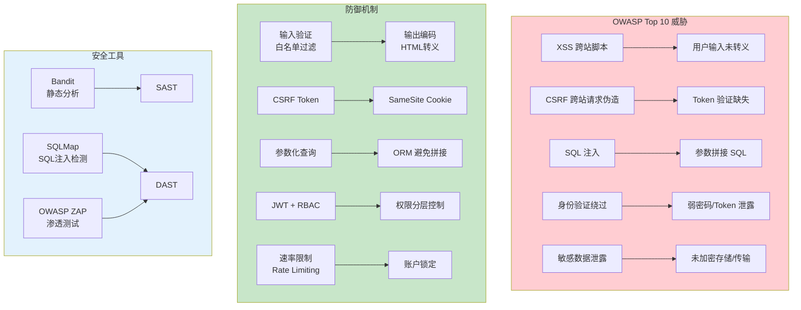

# L37: Web 安全完整实践 - 详细课程

> **所属阶段**: Stage 4 - Web 开发进阶
> **预计时长**: 4-6 小时
> **难度**: ⭐⭐⭐☆☆（中级）
> **前置课程**: L36
> **版本**: v1.0
> **最后更新**: 2026-07-23
> **核心版本**: Python 3.13

## 📚 前置知识

**学习本课程前，你应该掌握：**

- **L36**: 异步背压机制
- **L33**: SSE 服务器推送事件（SecurityGateway 集成示例）

**如果你还没有学习以上课程，建议先完成前置课程。**

---

> **课程定位**: Stage 4 Web 进阶安全专题 - 防御性安全网关
>
> **核心目标**: 用依赖注入 + RBAC + Rate Limiting 构建现代化安全架构
>
> **前置要求**:
>
> - 完成 L36 异步背压机制
> - 理解 JWT Token 原理
> - 熟悉 HTTP 认证流程
>
> **学习时长**: 8-10 小时（4 章）
>
> **作者**: Python 3.13 全栈课程

---



---

## 📋 目录

- [第一章：传统中间件的设计缺陷](#第一章传统中间件的设计缺陷)
- [第二章：依赖注入安全网关](#第二章依赖注入安全网关)
- [第三章：RBAC 与权限提升防御](#第三章rbac-与权限提升防御)
- [第四章：Rate Limiting 防暴力破解](#第四章rate-limiting-防暴力破解)

---

## 第一章：传统中间件的设计缺陷

### 1.1 旧模块的安全技术债

**归档模块问题**:

- ❌ 硬编码 SECRET_KEY（`settings/base.py:36`）
- ❌ 硬编码 LDAP 配置（`settings/base.py:277-314`）
- ❌ XSS 漏洞（`jobs/views.py:59-71`，代码注释明确标注）
- ❌ 无 Rate Limiting（暴力破解风险）
- ❌ 无 RBAC（权限控制缺失）

---

### 1.2 传统中间件模式的问题

**反模式示例**:

```python
# ❌ 旧方式：全局中间件
@app.middleware("http")
async def auth_middleware(request: Request, call_next):
    # 问题 1: 无法按路由定制规则
    if request.url.path.startswith("/admin"):
        token = request.headers.get("Authorization")
        # 验证逻辑...

    # 问题 2: 难以组合多个安全策略
    # 问题 3: 测试困难（全局生效）
    response = await call_next(request)
    return response
```

**核心缺陷**:

| 问题             | 说明               | 影响           |
| ---------------- | ------------------ | -------------- |
| **全局生效**     | 所有路由共享规则   | 无法定制化     |
| **难以组合**     | 多个中间件顺序敏感 | 维护困难       |
| **测试困难**     | 必须启动完整应用   | 单元测试不可行 |
| **错误处理复杂** | 中间件链式传播     | 难以定位问题   |

---

### 1.3 依赖注入的优势

**现代化方案**: **FastAPI Dependencies**

```python
# ✅ 新方式：依赖注入
@app.get("/admin/users")
async def list_users(
    current_user: User = Depends(get_current_user),
    _: User = Depends(RequireRole(UserRole.ADMIN))
):
    # 优势 1: 路由级别定制
    # 优势 2: 可组合多个依赖
    # 优势 3: 测试简单（Mock 依赖）
    ...
```

**对比表**:

| 特性         | 中间件           | 依赖注入        |
| ------------ | ---------------- | --------------- |
| **作用域**   | 全局             | 路由级别        |
| **组合性**   | 困难（顺序敏感） | 简单（声明式）  |
| **可测试性** | 低（需完整应用） | 高（Mock 依赖） |
| **类型安全** | 无               | ✅ 完整         |
| **IDE 支持** | 差               | ✅ 自动补全     |

---

## 第二章：依赖注入安全网关

### 2.1 JWT Token 认证流程

**完整流程**:

```
1. 用户登录
   ├─ POST /login {username, password}
   ├─ 验证密码（bcrypt）
   └─ 生成 JWT Token

2. Token 结构
   ├─ Header: {"alg": "HS256", "typ": "JWT"}
   ├─ Payload: {"sub": "alice", "user_id": 1, "role": "admin", "exp": 1234567890}
   └─ Signature: HMACSHA256(base64(header) + "." + base64(payload), secret)

3. 后续请求
   ├─ 请求头: Authorization: Bearer <token>
   ├─ 验证签名
   ├─ 检查过期时间
   └─ 提取用户信息
```

---

### 2.2 依赖注入：获取当前用户

> 💡 **核心实现**: `examples/01_security_dependencies.py` 第 135-195 行
>
> 展示完整的 JWT 验证与 OTel 审计追踪

**设计思路**:

```python
async def get_current_user(
    credentials: HTTPAuthorizationCredentials = Depends(security)
) -> User:
    """
    获取当前用户（依赖注入）

    **安全检查**:
    1. 验证 JWT Token 签名
    2. 检查 Token 是否过期
    3. 查询用户是否存在
    4. 检查用户是否被禁用
    5. 记录到 OpenTelemetry Span
    """
    with tracer.start_as_current_span("get_current_user") as span:
        token = credentials.credentials

        # 解码 Token
        try:
            payload = decode_access_token(token)
        except HTTPException as e:
            # ✅ 记录认证错误到 Span
            span.set_status(trace.Status(trace.StatusCode.ERROR))
            span.record_exception(e)
            span.set_attribute("auth.error", "invalid_token")
            raise e

        # 查询用户 + 状态检查...

        # ✅ 记录成功认证
        span.set_attribute("user.id", user.id)
        span.set_attribute("user.role", user.role.value)
        span.add_event("user_authenticated")

        return user
```

**关键设计点**:

1. **异常追踪**:

   ```python
   span.record_exception(e)  # 自动记录堆栈
   span.set_attribute("auth.error", "invalid_token")
   ```

2. **业务上下文**:

   ```python
   span.set_attribute("user.id", user_id)
   span.set_attribute("client.ip", client_ip)
   ```

3. **安全审计**:
   - 所有认证失败记录到 Jaeger
   - 可追踪攻击来源
   - 可统计失败模式

---

### 2.3 为什么所有 Auth 错误都要上报 OTel？

**价值 1: 安全审计**

传统方式:

```python
# ❌ 仅记录到应用日志
logger.error(f"Login failed: {username}")
```

OTel 方式:

```python
# ✅ 记录到分布式追踪
span.record_exception(exception)
span.set_attribute("auth.error", "invalid_password")
span.set_attribute("client.ip", request.client.host)
```

**分析能力**:

- 📊 Jaeger UI 查询：过去 1 小时所有认证失败
- 📊 按 IP 聚合：发现暴力破解来源
- 📊 按错误类型分组：识别攻击模式

---

**价值 2: 关联业务链路**

**场景**: 用户反馈"无法登录"

传统排查:

```
1. 查看应用日志（可能无记录）
2. 查看数据库日志（无用户上下文）
3. 手动关联（耗时数小时）
```

OTel 排查:

```
1. 用户提供时间戳
2. Jaeger 搜索 Trace ID
3. 自动展示：
   ├─ 请求参数
   ├─ 认证失败原因
   ├─ 数据库查询
   └─ 错误堆栈
耗时: 30 秒
```

---

**价值 3: 自动化告警**

**集成 Prometheus**:

```yaml
# 告警规则
- alert: HighAuthFailureRate
  expr: rate(auth_failures_total[5m]) > 10
  annotations:
    summary: "认证失败率异常"
    description: "过去 5 分钟认证失败率 > 10/s"
```

**触发场景**:

- 暴力破解攻击
- 凭据泄露
- 应用 Bug（所有用户登录失败）

---

## 第三章：RBAC 与权限提升防御

### 3.1 RBAC 设计原则

**RBAC（Role-Based Access Control）**:

- **角色**: 用户的身份（Admin、Manager、User）
- **权限**: 操作的能力（Read、Write、Delete）
- **映射**: 角色 → 权限集合

**设计表**:

| 角色    | READ | WRITE | DELETE | ADMIN |
| ------- | ---- | ----- | ------ | ----- |
| ADMIN   | ✅   | ✅    | ✅     | ✅    |
| MANAGER | ✅   | ✅    | ✅     | ❌    |
| USER    | ✅   | ✅    | ❌     | ❌    |
| GUEST   | ✅   | ❌    | ❌     | ❌    |

---

### 3.2 角色检查（依赖注入）

> 💡 **核心实现**: `examples/01_security_dependencies.py` 第 200-240 行
>
> 展示 RequireRole 依赖注入的完整实现

**设计思路**:

```python
class RequireRole:
    """RBAC 角色检查（依赖注入）"""

    def __init__(self, required_role: UserRole):
        self.required_role = required_role

    async def __call__(self, current_user: User = Depends(get_current_user)) -> User:
        """
        检查用户角色

        **权限层级**:
        ADMIN (4) > MANAGER (3) > USER (2) > GUEST (1)
        """
        with tracer.start_as_current_span("check_role") as span:
            span.set_attribute("required.role", self.required_role.value)
            span.set_attribute("user.role", current_user.role.value)

            # 层级检查
            if current_user.role_level < self.required_role.level:
                # ✅ 记录权限不足到 Span
                span.set_status(trace.Status(trace.StatusCode.ERROR))
                span.set_attribute("auth.error", "insufficient_permissions")

                raise HTTPException(
                    status_code=403,
                    detail=f"权限不足：需要 {self.required_role.value} 权限",
                )

            span.add_event("role_check_passed")
            return current_user
```

**使用方式**:

```python
@app.get("/admin/users")
async def list_users(
    current_user: User = Depends(RequireRole(UserRole.ADMIN))
):
    # 仅 ADMIN 可访问
    ...
```

---

### 3.3 细粒度权限检查

> 💡 **细粒度实现**: `examples/01_security_dependencies.py` 第 245-280 行
>
> 展示 RequirePermission 的权限检查

**设计思路**:

```python
class RequirePermission:
    """细粒度权限检查"""

    def __init__(self, required_permission: Permission):
        self.required_permission = required_permission

    async def __call__(self, current_user: User = Depends(get_current_user)) -> User:
        """检查用户是否拥有特定权限"""
        user_permissions = ROLE_PERMISSIONS[current_user.role]

        if self.required_permission not in user_permissions:
            raise HTTPException(
                status_code=403,
                detail=f"缺少权限：{self.required_permission.value}",
            )

        return current_user
```

**使用方式**:

```python
@app.delete("/products/{product_id}")
async def delete_product(
    current_user: User = Depends(RequirePermission(Permission.DELETE))
):
    # MANAGER 和 ADMIN 拥有 DELETE 权限
    ...
```

---

### 3.4 权限提升攻击防御

**攻击场景 1: 水平权限提升**

```python
# ❌ 不安全的实现
@app.get("/users/{user_id}/profile")
async def get_profile(user_id: int):
    # 问题：未检查 user_id 是否属于当前用户
    return db.get_user(user_id)

# ✅ 安全的实现
@app.get("/users/{user_id}/profile")
async def get_profile(
    user_id: int,
    current_user: User = Depends(get_current_user)
):
    # 检查：仅能访问自己的资料
    if user_id != current_user.id and current_user.role != UserRole.ADMIN:
        raise HTTPException(status_code=403, detail="无权访问他人资料")

    return db.get_user(user_id)
```

**攻击场景 2: 垂直权限提升**

```python
# ❌ 不安全的实现
@app.post("/users/{user_id}/promote")
async def promote_user(user_id: int, new_role: str):
    # 问题：未检查当前用户是否有权限提升他人
    db.update_user_role(user_id, new_role)

# ✅ 安全的实现
@app.post("/users/{user_id}/promote")
async def promote_user(
    user_id: int,
    new_role: UserRole,
    current_user: User = Depends(RequireRole(UserRole.ADMIN))
):
    # 检查：仅 ADMIN 可提升权限
    db.update_user_role(user_id, new_role)
```

---

## 第四章：Rate Limiting 防暴力破解

### 4.1 暴力破解攻击场景

**攻击示例**:

```
攻击者目标：破解用户密码
方法：尝试常见密码

POST /login {"username": "admin", "password": "123456"}   → 401
POST /login {"username": "admin", "password": "password"} → 401
POST /login {"username": "admin", "password": "admin"}    → 401
...
POST /login {"username": "admin", "password": "Admin123!"} → 200 ✅

统计：1000 次尝试，耗时 10 秒，成功破解
```

**防御需求**: **Rate Limiting（速率限制）**

---

### 4.2 滑动窗口算法

> 💡 **核心实现**: `examples/01_security_dependencies.py` 第 285-340 行
>
> 展示滑动窗口 + Redis 的 Rate Limiting 实现

**算法原理**:

```
时间窗口：60 秒
最大请求数：5 次

Redis Sorted Set:
Key: rate_limit:192.168.1.100
Members: [(时间戳1, 分数1), (时间戳2, 分数2), ...]

操作流程:
1. 清理过期记录（now - 60s 之前的）
2. 统计当前窗口内记录数
3. 超过限制 → 拒绝（429 错误）
4. 未超过 → 记录当前请求
```

**Redis 命令**:

```python
# 1. 清理过期
redis.zremrangebyscore(key, 0, now - window_seconds)

# 2. 统计
count = redis.zcount(key, now - window_seconds, now)

# 3. 记录
redis.zadd(key, {now: now})
redis.expire(key, window_seconds)
```

---

### 4.3 依赖注入实现

**设计思路**:

```python
class RateLimiter:
    """Rate Limiting（滑动窗口）"""

    def __init__(self, max_requests: int, window_seconds: int):
        self.max_requests = max_requests
        self.window_seconds = window_seconds

    async def __call__(self, request: Request) -> None:
        """检查 Rate Limit"""
        with tracer.start_as_current_span("rate_limit_check") as span:
            client_ip = request.client.host
            span.set_attribute("client.ip", client_ip)

            # Redis 查询
            key = f"rate_limit:{client_ip}"
            count = await redis.zcount(key, now - window, now)

            if count >= self.max_requests:
                # ✅ 记录到 OTel
                span.set_status(trace.Status(trace.StatusCode.ERROR))
                span.set_attribute("auth.error", "rate_limit_exceeded")

                raise HTTPException(
                    status_code=429,
                    detail=f"请求过于频繁，请 {self.window_seconds} 秒后重试",
                    headers={
                        "Retry-After": str(self.window_seconds),
                        "X-RateLimit-Limit": str(self.max_requests),
                        "X-RateLimit-Remaining": "0",
                    },
                )

            # 记录当前请求
            await redis.zadd(key, {now: now})
```

**使用方式**:

```python
@app.post("/login")
async def login(
    data: LoginRequest,
    _: None = Depends(RateLimiter(max_requests=5, window_seconds=60))
):
    # 每个 IP 每分钟最多 5 次登录尝试
    ...
```

---

### 4.4 生产环境配置

**分层限流策略**:

| 端点           | 限制   | 窗口    | 说明         |
| -------------- | ------ | ------- | ------------ |
| POST /login    | 5 次   | 60 秒   | 防暴力破解   |
| POST /register | 3 次   | 3600 秒 | 防批量注册   |
| GET /api/\*    | 100 次 | 60 秒   | API 通用限制 |
| POST /api/\*   | 50 次  | 60 秒   | 写操作更严格 |

**高级配置**:

```python
# 按用户限流（已认证）
@app.get("/products")
async def list_products(
    current_user: User = Depends(get_current_user),
    _: None = Depends(RateLimiter(max_requests=1000, window_seconds=3600))
):
    # 每个用户每小时 1000 次
    ...

# 按 IP + 用户双重限流
@app.post("/orders")
async def create_order(
    current_user: User = Depends(get_current_user),
    _ip: None = Depends(RateLimiter(max_requests=10, window_seconds=60)),
    _user: None = Depends(UserRateLimiter(max_requests=100, window_seconds=3600))
):
    # IP: 每分钟 10 次
    # 用户: 每小时 100 次
    ...
```

---

## 生产级实战总结

### 核心要点回顾

💡 **5 个必须掌握的知识点**:

1. **依赖注入 > 中间件**: 路由级定制、可组合、易测试
2. **JWT + OTel**: 所有认证错误记录到分布式追踪
3. **RBAC 强类型**: 枚举定义角色和权限，编译期检查
4. **Rate Limiting 必备**: 防暴力破解，生产环境标配
5. **审计追踪完整**: 认证/授权/限流全部上报 OTel

---

### 安全检查清单

**认证层**:

- [ ] JWT Secret 使用环境变量
- [ ] Token 设置合理过期时间（15-30 分钟）
- [ ] 密码使用 bcrypt 哈希（cost >= 12）
- [ ] 所有认证错误记录到 OTel

**授权层**:

- [ ] 实现 RBAC 角色检查
- [ ] 防止水平权限提升
- [ ] 防止垂直权限提升
- [ ] 细粒度权限检查

**防御层**:

- [ ] 登录接口 Rate Limiting（5 次/分钟）
- [ ] 注册接口 Rate Limiting（3 次/小时）
- [ ] API 接口通用限流（100 次/分钟）
- [ ] 按 IP + 用户双重限流

**审计层**:

- [ ] 认证失败记录到 Span
- [ ] 权限检查记录到 Span
- [ ] Rate Limit 触发记录到 Span
- [ ] 配置自动化告警

---

### 性能基准

**优化目标**:

| 指标            | 目标   | 说明           |
| --------------- | ------ | -------------- |
| Token 验证      | < 10ms | 超过则优化算法 |
| RBAC 检查       | < 5ms  | 内存查表       |
| Rate Limit 检查 | < 20ms | Redis 性能     |
| 总认证延迟      | < 50ms | 端到端         |

---

## 第五章：OAuth2 第三方登录（扩展）

JWT 适合第一方认证（你的应用自己的用户）。
但在真实项目中，用户期望用 GitHub、Google、微信等账号登录，这就是 OAuth2 的场景。

### 5.1 OAuth2 授权码流程

OAuth2 有四种授权模式，最常用的是**授权码模式（Authorization Code）**：

```
用户 ──→ 浏览器 ──→ 第三方登录页面 ──→ 授权码 ──→ 后端 ──→ Access Token
```

步骤拆解：

1. 用户点击"使用 GitHub 登录"
2. 浏览器重定向到 GitHub 授权页（含 `client_id` + `redirect_uri`）
3. 用户确认授权
4. GitHub 重定向回你的网站，携带 `?code=xxx`
5. 后端用 `code` 向 GitHub 换取 `access_token`
6. 后端用 `access_token` 获取用户信息
7. 创建/查找本地用户，签发 JWT

### 5.2 FastAPI 实现

```python
from fastapi import FastAPI, Request
from fastapi.responses import RedirectResponse
import httpx

app = FastAPI()
CLIENT_ID = "your_github_app_id"
CLIENT_SECRET = "your_github_app_secret"

@app.get("/auth/github/login")
async def github_login():
    return RedirectResponse(
        f"https://github.com/login/oauth/authorize?"
        f"client_id={CLIENT_ID}&redirect_uri={REDIRECT_URI}"
    )

@app.get("/auth/github/callback")
async def github_callback(code: str):
    # 交换 access_token
    async with httpx.AsyncClient() as client:
        resp = await client.post(
            "https://github.com/login/oauth/access_token",
            json={
                "client_id": CLIENT_ID,
                "client_secret": CLIENT_SECRET,
                "code": code,
            },
            headers={"Accept": "application/json"},
        )
        token_data = resp.json()
        access_token = token_data["access_token"]

        # 获取用户信息
        user_resp = await client.get(
            "https://api.github.com/user",
            headers={"Authorization": f"Bearer {access_token}"},
        )
        github_user = user_resp.json()

    # 签发 JWT（复用第二章的 create_jwt）
    jwt_token = create_jwt({"sub": github_user["login"]})
    return {"access_token": jwt_token, "token_type": "bearer"}
```

这个端点可以直接集成到 L33 的 `SecurityGateway` 中作为新的认证提供者。

### 5.3 OIDC — OpenID Connect

OAuth2 只管授权（"你能访问什么"），不管身份（"你是谁"）。
OIDC 在 OAuth2 之上添加了身份层，通过 ID Token（JWT 格式）传递用户信息。

```python
from jose import jwt

# Google OIDC ID Token 验证
@app.get("/auth/google/callback")
async def google_callback(id_token: str):
    # 验证 ID Token（Google 签发，用公钥验签）
    user_info = jwt.decode(
        id_token,
        key=google_public_key,
        audience=CLIENT_ID,
    )
    print(f"Google 用户: {user_info['name']} (email: {user_info['email']})")
```

### 5.4 集成到现有安全网关

L33 的 `SecurityGateway` 可以轻松扩展：

```python
class SecurityGateway:
    def __init__(self):
        self.auth_providers = {
            "jwt": self.authenticate_jwt,
            "oauth_github": self.authenticate_github_oauth,
            "oauth_google": self.authenticate_google_oauth,
        }

    async def authenticate_github_oauth(self, code: str) -> str:
        """用 GitHub OAuth code 换取用户身份"""
        # ... 5.2 节的实现
        return jwt_token
```

### 5.5 OAuth2 vs JWT 选择

| 场景         | 推荐         | 原因                 |
| ------------ | ------------ | -------------------- |
| 自有用户系统 | JWT          | 简单、自包含         |
| 第三方登录   | OAuth2       | 无需存密码，用户信任 |
| 企业内部 SSO | OIDC         | 身份层标准化         |
| 移动端 API   | JWT + OAuth2 | 兼容两种场景         |

**OAuth2 不是 JWT 的替代**，而是 JWT 的补充。JWT 做第一方认证，OAuth2 做第三方集成。

---

## 第六章：CORS 精细配置与安全响应头

### 6.1 CORS 核心参数详解

> 💡 **核心实现**: `examples/02_cors_security_headers.py`
>
> 展示完整的 CORS 配置与安全响应头中间件

**CORS（Cross-Origin Resource Sharing）** 是浏览器的同源策略补充机制，允许服务器声明哪些外域可以访问其资源。

```python
from fastapi import FastAPI
from fastapi.middleware.cors import CORSMiddleware

app = FastAPI()

app.add_middleware(
    CORSMiddleware,
    allow_origins=["https://example.com"],  # 允许的源（精确匹配）
    allow_origin_regex=r"https://.*\.example\.com",  # 正则匹配子域名
    allow_credentials=True,  # 允许携带凭证（Cookie/Authorization）
    allow_methods=["GET", "POST", "PUT", "DELETE"],  # 允许的 HTTP 方法
    allow_headers=["*"],  # 允许的请求头（* 不兼容 credentials=True）
    expose_headers=["X-Request-ID", "X-RateLimit-Remaining"],  # 暴露给客户端的自定义头
    max_age=600,  # 预检请求缓存时间（秒），减少 OPTIONS 请求
)
```

**CORS 流程图**：

```
浏览器请求（跨域）
    │
    ├─ 简单请求（GET/POST + 简单头）
    │   └─ 直接发送，服务器通过 Access-Control-* 响应头控制
    │
    └─ 预检请求（OPTIONS）
        ├─ 浏览器发送 OPTIONS 查询支持能力
        │   ├─ Access-Control-Request-Method
        │   └─ Access-Control-Request-Headers
        │
        └─ 服务器响应
            ├─ Access-Control-Allow-Origin
            ├─ Access-Control-Allow-Methods
            ├─ Access-Control-Allow-Headers
            └─ Access-Control-Max-Age
```

---

### 6.2 CORS 常见配置场景

**场景 1: 仅允许指定域名（生产环境推荐）**

```python
app.add_middleware(
    CORSMiddleware,
    allow_origins=["https://app.example.com", "https://admin.example.com"],
    allow_credentials=True,
    allow_methods=["GET", "POST"],
    allow_headers=["Authorization", "Content-Type"],
)
```

**场景 2: 开发环境（允许所有，禁用）**

```python
# ⚠️ 仅开发环境使用
app.add_middleware(
    CORSMiddleware,
    allow_origins=["*"],  # 允许所有源
    allow_credentials=False,  # 必须为 False
    allow_methods=["*"],
    allow_headers=["*"],
)
```

**场景 3: 动态来源检查（基于数据库配置）**

```python
from fastapi import Request

@app.middleware("http")
async def dynamic_cors(request: Request, call_next):
    origin = request.headers.get("origin", "")
    allowed_origins = await db.get_allowed_origins()

    if origin in allowed_origins:
        response = await call_next(request)
        response.headers["Access-Control-Allow-Origin"] = origin
        response.headers["Access-Control-Allow-Credentials"] = "true"
        return response

    return await call_next(request)
```

**安全注意**：
- ❌ `allow_origins=["*"]` + `allow_credentials=True` 会导致浏览器拒绝
- ❌ 避免在生产环境使用 `allow_origins=["*"]`
- ✅ 使用精确的域名白名单

---

### 6.3 安全响应头

> 💡 **核心实现**: `examples/02_cors_security_headers.py` 第 40-80 行
>
> 展示完整的 HSTS、CSP、X-Frame-Options 等安全头实现

**安全响应头** 是服务器返回给浏览器的指令，帮助浏览器防御 XSS、点击劫持等攻击。

```python
from fastapi import FastAPI, Request
from starlette.middleware.base import BaseHTTPMiddleware

class SecurityHeadersMiddleware(BaseHTTPMiddleware):
    """安全响应头中间件"""

    async def dispatch(self, request: Request, call_next):
        response = await call_next(request)

        # 1. HSTS — 强制 HTTPS（仅 HTTPS 站点启用）
        # 浏览器在 max-age 时间内强制使用 HTTPS 访问
        response.headers["Strict-Transport-Security"] = (
            "max-age=31536000; includeSubDomains; preload"
        )

        # 2. X-Frame-Options — 防止点击劫持
        # 禁止页面在 iframe 中显示
        response.headers["X-Frame-Options"] = "DENY"

        # 3. X-Content-Type-Options — 防止 MIME 类型嗅探
        # 浏览器不猜测内容类型，严格按声明类型处理
        response.headers["X-Content-Type-Options"] = "nosniff"

        # 4. X-XSS-Protection — XSS 过滤器（现代浏览器已内置，仅兼容性保留）
        response.headers["X-XSS-Protection"] = "1; mode=block"

        # 5. Referrer-Policy — 控制 Referer 头发送策略
        response.headers["Referrer-Policy"] = "strict-origin-when-cross-origin"

        # 6. Permissions-Policy — 禁用不必要的浏览器特性
        response.headers["Permissions-Policy"] = (
            "geolocation=(), microphone=(), camera=(), payment=()"
        )

        return response

app.add_middleware(SecurityHeadersMiddleware)
```

---

### 6.4 Content Security Policy（CSP）

**CSP** 是最强大的安全头，用于防止 XSS 攻击：

```python
# 基础 CSP：仅允许同源资源
response.headers["Content-Security-Policy"] = (
    "default-src 'self'"
)

# 详细 CSP：允许同源 + 特定外部资源
response.headers["Content-Security-Policy"] = (
    "default-src 'self';"
    "script-src 'self' https://cdn.example.com;"
    "style-src 'self' https://fonts.googleapis.com;"
    "img-src 'self' data: https:;"
    "font-src 'self' https://fonts.gstatic.com;"
    "connect-src 'self' https://api.example.com;"
    "frame-ancestors 'none';"
    "base-uri 'self';"
    "form-action 'self';"
)
```

**CSP 指令说明**：

| 指令 | 说明 | 示例值 |
|------|------|--------|
| `default-src` | 默认来源 | `'self'` / `https:` |
| `script-src` | JS 来源 | `'self'` / `https://cdn.jsdelivr.net` |
| `style-src` | CSS 来源 | `'self'` / `'unsafe-inline'` |
| `img-src` | 图片来源 | `'self'` / `data:` / `https:` |
| `frame-ancestors` | 嵌入来源 | `'none'`（禁止被 iframe 嵌入）|
| `base-uri` | base 标签限制 | `'self'` |
| `form-action` | 表单提交目标 | `'self'` |

**报告模式（不阻止，仅报告违规）**：

```python
response.headers["Content-Security-Policy-Report-Only"] = (
    "default-src 'self'; report-uri /csp-report"
)

@app.post("/csp-report")
async def csp_report(report: dict):
    """收集 CSP 违规报告"""
    logger.warning(f"CSP Violation: {report}")
    return {"received": True}
```

---

### 6.5 完整安全中间件示例

> 💡 **完整实现**: `examples/02_cors_security_headers.py` 第 100-160 行

```python
from fastapi import FastAPI, Request
from fastapi.middleware.cors import CORSMiddleware
from starlette.middleware.base import BaseHTTPMiddleware

app = FastAPI()

# 1. CORS 配置
app.add_middleware(
    CORSMiddleware,
    allow_origins=["https://app.example.com"],
    allow_credentials=True,
    allow_methods=["GET", "POST", "PUT", "DELETE"],
    allow_headers=["Authorization", "Content-Type", "X-Request-ID"],
    expose_headers=["X-Request-ID"],
    max_age=3600,
)

# 2. 安全响应头中间件
@app.middleware("http")
async def security_headers(request: Request, call_next):
    response = await call_next(request)

    # 仅对 HTTPS 响应添加 HSTS
    if request.url.scheme == "https":
        response.headers["Strict-Transport-Security"] = (
            "max-age=31536000; includeSubDomains; preload"
        )

    # 安全头（所有响应）
    security_headers = {
        "X-Frame-Options": "DENY",
        "X-Content-Type-Options": "nosniff",
        "X-XSS-Protection": "1; mode=block",
        "Referrer-Policy": "strict-origin-when-cross-origin",
        "Permissions-Policy": "geolocation=(), microphone=(), camera=()",
        "Content-Security-Policy": (
            "default-src 'self'; "
            "script-src 'self'; "
            "style-src 'self' 'unsafe-inline'; "
            "img-src 'self' data: https:; "
            "frame-ancestors 'none';"
        ),
    }

    for key, value in security_headers.items():
        response.headers[key] = value

    return response

# 3. 自定义请求 ID（用于追踪）
@app.middleware("http")
async def add_request_id(request: Request, call_next):
    request_id = request.headers.get("X-Request-ID", uuid4().hex)
    response = await call_next(request)
    response.headers["X-Request-ID"] = request_id
    return response
```

---

### 6.6 安全头检查清单

**必选项（生产环境必须启用）**：

- [ ] `Strict-Transport-Security` — 强制 HTTPS
- [ ] `X-Frame-Options: DENY` — 防止点击劫持
- [ ] `X-Content-Type-Options: nosniff` — 防止 MIME 嗅探
- [ ] `Content-Security-Policy` — 防止 XSS

**推荐项**：

- [ ] `Referrer-Policy: strict-origin-when-cross-origin` — 控制 Referer 泄露
- [ ] `Permissions-Policy` — 禁用不必要的浏览器 API
- [ ] `X-Request-ID` — 请求追踪

**可选项**：

- [ ] `X-XSS-Protection` — 旧浏览器兼容性
- [ ] CSP Report-Only — 渐进式 CSP 迁移

**测试工具**：

```bash
# 检查网站安全头
curl -I https://example.com

# 使用 Security Headers 检测
# https://securityheaders.com/?q=https://example.com
```

## 🔗 下一步


[L38: 认证与授权](../L38-auth-authorization/)
