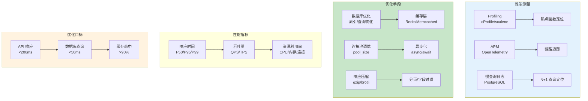

# L41: API 性能优化

> **课程编号**: L41
> **所属阶段**: Stage 4 - Web 开发进阶
> **预计时长**: 5-6 小时
> **难度**: ⭐⭐⭐⭐☆（高级）
> **前置课程**: L28, L38
> **版本**: v1.0
> **最后更新**: 2026-07-23
> **核心版本**: Python 3.13


---

## 🎯 学习目标

完成本课程后，你将能够：

1. ✅ **性能分析方法**：掌握 Profiling、APM、慢查询分析
2. ✅ **数据库优化**：识别并优化 N+1 查询、缺失索引
3. ✅ **缓存策略**：实现多级缓存减少数据库压力
4. ✅ **并发优化**：使用异步、连接池提升吞吐量
5. ✅ **API 优化**：响应压缩、分页、字段过滤
6. ✅ **性能基线**：建立性能基准和回归测试

---



---

## Part 1: 性能分析方法

### 1.1 为什么性能很重要

| 响应时间 | 用户感知 | 影响 |
|----------|----------|------|
| < 100ms | 即时响应 | 用户满意度高 |
| 100-300ms | 轻微延迟 | 可接受 |
| 300ms-1s | 明显等待 | 开始烦躁 |
| 1-3s | 长时间等待 | 用户流失风险 |
| > 10s | 用户离开 | 严重业务损失 |

### 1.2 性能优化原则

1. **测量先行**：用数据驱动优化方向
2. **瓶颈定位**：找到最慢的部分（80/20法则）
3. **性价比优先**：优化投入产出比最高的
4. **避免过早优化**：先跑通功能再优化

### 1.3 cProfile 性能分析

```python
import cProfile
import pstats
import io

def slow_function():
    """被分析的慢函数"""
    result = []
    for i in range(10000):
        result.append(sum(range(i)))
    return result

# 分析性能
profiler = cProfile.Profile()
profiler.enable()

result = slow_function()

profiler.disable()

# 输出统计
stream = io.StringIO()
stats = pstats.Stats(profiler, stream=stream)
stats.sort_stats("cumulative")  # 按累计时间排序
stats.print_stats(20)  # 前 20 行
print(stream.getvalue())

# 输出到文件
stats.dump_stats("profile.stats")

# 使用 snakeviz 可视化
# uv add snakeviz
# snakeviz profile.stats
```

### 1.4 py-spy 实时分析

```bash
# 安装
uv add py-spy

# 采样分析
py-spy top -- python app.py

# 导出火焰图
py-spy record -o profile.svg -- python app.py
```

### 1.5 时间测量装饰器

```python
import time
import functools
from typing import Callable, Any
import logging

logger = logging.getLogger(__name__)

def timed(metric_name: str = None, log_level: int = logging.INFO):
    """耗时测量装饰器"""
    def decorator(func: Callable) -> Callable:
        name = metric_name or func.__qualname__

        @functools.wraps(func)
        def sync_wrapper(*args, **kwargs) -> Any:
            start = time.perf_counter()
            try:
                result = func(*args, **kwargs)
                return result
            finally:
                elapsed = (time.perf_counter() - start) * 1000
                logger.log(
                    log_level,
                    f"[{name}] 执行时间: {elapsed:.2f}ms"
                )

        @functools.wraps(func)
        async def async_wrapper(*args, **kwargs) -> Any:
            start = time.perf_counter()
            try:
                result = await func(*args, **kwargs)
                return result
            finally:
                elapsed = (time.perf_counter() - start) * 1000
                logger.log(
                    log_level,
                    f"[{name}] 执行时间: {elapsed:.2f}ms"
                )

        if asyncio.iscoroutinefunction(func):
            return async_wrapper
        return sync_wrapper
    return decorator

# 使用
@timed("database_query")
async def query_users():
    ...

@timed("external_api_call", log_level=logging.DEBUG)
def call_api():
    ...
```

---

## Part 2: 数据库性能优化

### 2.1 N+1 查询检测

```python
import logging
from sqlalchemy import event
from sqlalchemy.engine import Engine

logger = logging.getLogger(__name__)

class QueryCounter:
    """SQL 查询计数器"""

    def __init__(self):
        self.count = 0
        self.queries: list[tuple[str, float]] = []

    def reset(self):
        self.count = 0
        self.queries = []

# 全局计数器
query_counter = QueryCounter()

@event.listens_for(Engine, "before_cursor_execute")
def before_cursor_execute(conn, cursor, statement, parameters, context, executemany):
    conn.info.setdefault("query_start_time", []).append(time.time())

@event.listens_for(Engine, "after_cursor_execute")
def after_cursor_execute(conn, cursor, statement, parameters, context, executemany):
    total = time.time() - conn.info["query_start_time"].pop()
    query_counter.count += 1
    query_counter.queries.append((statement, total * 1000))

# 使用
query_counter.reset()
# 执行查询
result = session.execute(select(User).options(selectinload(User.posts)))
# 输出统计
for query, duration in query_counter.queries:
    logger.info(f"[{duration:.2f}ms] {query[:100]}...")
```

### 2.2 常见 SQL 性能问题

```python
# ❌ N+1 查询问题
async def get_users_with_posts_bad():
    """每个用户都会触发一次额外的查询"""
    users = await session.execute(select(User))
    for user in users.scalars():
        # ❌ N+1: 每个用户触发一次查询
        posts = await session.execute(
            select(Post).where(Post.author_id == user.id)
        )
        print(posts.scalars().all())

# ✅ 解决方案：使用 JOIN 或 selectinload
async def get_users_with_posts_good():
    """一次查询获取所有数据"""
    result = await session.execute(
        select(User).options(selectinload(User.posts))
    )
    return result.scalars().all()

# ✅ 解决方案：使用 JOIN
async def get_users_with_posts_join():
    """使用 JOIN 获取数据"""
    result = await session.execute(
        select(User, Post)
        .join(Post, User.id == Post.author_id)
        .options(selectinload(User.posts))
    )
    return result.all()
```

### 2.3 索引优化

```sql
-- 创建索引
CREATE INDEX idx_posts_author ON posts(author_id);
CREATE INDEX idx_posts_created ON posts(created_at DESC);

-- 复合索引（顺序很重要！）
CREATE INDEX idx_posts_author_created ON posts(author_id, created_at DESC);

-- 部分索引
CREATE INDEX idx_posts_published ON posts(created_at)
WHERE published = TRUE;

-- 表达式索引
CREATE INDEX idx_posts_title_lower ON posts(LOWER(title));

-- 查看查询计划
EXPLAIN ANALYZE SELECT * FROM posts WHERE author_id = 1;
```

### 2.4 SQLAlchemy 查询优化

```python
from sqlalchemy import select
from sqlalchemy.orm import selectinload, joinedload, subqueryload

# 预加载关系（推荐）
result = await session.execute(
    select(User).options(selectinload(User.posts))
)

# JOIN 加载（适用于一对一或少量数据）
result = await session.execute(
    select(User).options(joinedload(User.profile))
)

# 子查询加载（适用于大量数据）
result = await session.execute(
    select(User).options(subqueryload(User.posts))
)

# 分页查询
async def get_users_paginated(page: int = 1, page_size: int = 20):
    offset = (page - 1) * page_size
    result = await session.execute(
        select(User)
        .order_by(User.created_at.desc())
        .offset(offset)
        .limit(page_size)
    )
    return result.scalars().all()

# 仅查询需要的字段
async def get_usernames():
    result = await session.execute(
        select(User.username)
    )
    return [r[0] for r in result.all()]
```

---

## Part 3: 缓存策略

### 3.1 多级缓存架构

```
┌─────────────────────────────────────────────────────────┐
│                   多级缓存架构                          │
├─────────────────────────────────────────────────────────┤
│                                                     │
│   请求 → [浏览器缓存] → [CDN] → [Redis] → [数据库]  │
│                    │           │           │          │
│                 毫秒级      毫秒级      毫秒级       │
│                                                     │
│   命中率：  高            中           低            │
│   成本：    最低          低           中            │
│                                                     │
└─────────────────────────────────────────────────────────┘
```

### 3.2 Redis 缓存实现

```python
import json
import hashlib
from typing import Optional, TypeVar, Callable
from functools import wraps
import redis.asyncio as redis

T = TypeVar('T')

class CacheManager:
    """缓存管理器"""

    def __init__(self, redis_url: str = "redis://localhost:6379"):
        self.redis_url = redis_url
        self._client: Optional[redis.Redis] = None

    async def get_client(self) -> redis.Redis:
        if self._client is None:
            self._client = redis.from_url(self.redis_url)
        return self._client

    async def get(self, key: str) -> Optional[dict]:
        """获取缓存"""
        client = await self.get_client()
        data = await client.get(key)
        if data:
            return json.loads(data)
        return None

    async def set(
        self,
        key: str,
        value: dict,
        ttl: int = 300
    ) -> None:
        """设置缓存"""
        client = await self.get_client()
        await client.setex(key, ttl, json.dumps(value))

    async def delete(self, key: str) -> None:
        """删除缓存"""
        client = await self.get_client()
        await client.delete(key)

    async def invalidate_pattern(self, pattern: str) -> None:
        """删除匹配模式的所有缓存"""
        client = await self.get_client()
        keys = await client.keys(pattern)
        if keys:
            await client.delete(*keys)

    @staticmethod
    def make_key(*args, **kwargs) -> str:
        """生成缓存键"""
        data = json.dumps({"args": args, "kwargs": kwargs}, sort_keys=True)
        hash_key = hashlib.md5(data.encode()).hexdigest()
        return f"cache:{hash_key}"

# 全局缓存实例
cache = CacheManager()

# 缓存装饰器
def cached(ttl: int = 300, key_prefix: str = ""):
    """缓存装饰器"""
    def decorator(func: Callable) -> Callable:
        @wraps(func)
        async def wrapper(*args, **kwargs):
            # 生成缓存键
            cache_key = f"{key_prefix}:{func.__name__}:{cache.make_key(*args, **kwargs)}"

            # 尝试获取缓存
            cached_data = await cache.get(cache_key)
            if cached_data is not None:
                return cached_data

            # 执行函数
            result = await func(*args, **kwargs)

            # 缓存结果
            if result is not None:
                await cache.set(cache_key, result, ttl)

            return result
        return wrapper
    return decorator
```

### 3.3 缓存使用示例

```python
from app.cache import cached

# 用户缓存
@cached(ttl=300, key_prefix="user")
async def get_user(user_id: int) -> Optional[dict]:
    user = await session.get(User, user_id)
    if user:
        return {
            "id": user.id,
            "username": user.username,
            "email": user.email,
        }
    return None

# 列表缓存
@cached(ttl=60, key_prefix="posts")
async def get_recent_posts(limit: int = 10) -> list[dict]:
    result = await session.execute(
        select(Post)
        .where(Post.published == True)
        .order_by(Post.created_at.desc())
        .limit(limit)
    )
    posts = result.scalars().all()
    return [{"id": p.id, "title": p.title} for p in posts]

# 列表分页缓存
@cached(ttl=300, key_prefix="posts_page")
async def get_posts_paginated(page: int, page_size: int) -> dict:
    offset = (page - 1) * page_size
    result = await session.execute(
        select(Post)
        .order_by(Post.created_at.desc())
        .offset(offset)
        .limit(page_size)
    )
    posts = result.scalars().all()
    return {
        "items": [{"id": p.id, "title": p.title} for p in posts],
        "page": page,
        "page_size": page_size,
    }

# 缓存失效
async def invalidate_user_cache(user_id: int):
    await cache.delete(f"user:get_user:{user_id}")
    await cache.invalidate_pattern("posts:*")
```

### 3.4 缓存策略选择

| 策略 | 说明 | 适用场景 |
|------|------|----------|
| **Cache-Aside** | 应用负责读写缓存 | 读多写少 |
| **Read-Through** | 缓存自动加载 | 简单读操作 |
| **Write-Through** | 写缓存同步写数据库 | 数据一致性要求高 |
| **Write-Behind** | 异步写数据库 | 写性能要求高 |
| **TTL** | 过期自动失效 | 简单缓存 |

---

## Part 4: API 响应优化

### 4.1 响应压缩

```python
from fastapi import FastAPI
from fastapi.middleware.gzip import GZipMiddleware

app = FastAPI()

# 启用 GZip 压缩
app.add_middleware(
    GZipMiddleware,
    minimum_size=1000  # 最小压缩大小（字节）
)

# 或手动配置
# uvicorn main:app --root-path / --limit-concurrency 100 --limit-max-requests 1000
```

### 4.2 字段过滤

```python
from pydantic import BaseModel
from typing import Optional

class UserBase(BaseModel):
    username: str
    email: str

class UserPublic(UserBase):
    """公开用户信息（敏感字段过滤）"""
    id: int
    is_active: bool

class UserPrivate(UserBase):
    """私有用户信息"""
    id: int
    email: str
    phone: Optional[str]
    address: Optional[str]

# API 端点
@app.get("/users/{user_id}", response_model=UserPublic)
async def get_user_public(user_id: int):
    """公开用户信息"""
    user = await get_user(user_id)
    return user

@app.get("/users/{user_id}/private", response_model=UserPrivate)
async def get_user_private(user_id: int, current_user: User = Depends(get_current_user)):
    """私有用户信息（需登录）"""
    if current_user.id != user_id and not current_user.is_admin:
        raise HTTPException(status_code=403)
    return await get_user(user_id)
```

### 4.3 条件请求

```python
from fastapi import Request, HTTPException
from fastapi.responses import Response

@app.get("/posts/{post_id}")
async def get_post(post_id: int, request: Request):
    """支持条件请求"""
    post = await get_post_from_db(post_id)
    if not post:
        raise HTTPException(status_code=404)

    # 生成 ETag
    etag = f'"{hash(str(post.updated_at) + str(post.content))}"'

    # 检查 If-None-Match
    if_none_match = request.headers.get("If-None-Match")
    if if_none_match and if_none_match == etag:
        return Response(status_code=304)

    # 返回带 ETag 的响应
    return Response(
        content=post.json(),
        media_type="application/json",
        headers={"ETag": etag}
    )
```

### 4.4 异步流式响应

```python
from fastapi import FastAPI
from fastapi.responses import StreamingResponse
import asyncio

@app.get("/export/csv")
async def export_csv():
    """流式导出 CSV"""
    async def generate():
        yield "id,name,email\n"  # 头部
        for user in await get_all_users():
            yield f"{user.id},{user.name},{user.email}\n"
            await asyncio.sleep(0)  # 让出控制权

    return StreamingResponse(
        generate(),
        media_type="text/csv",
        headers={
            "Content-Disposition": "attachment; filename=users.csv"
        }
    )

@app.get("/events")
async def stream_events():
    """SSE 流式响应"""
    async def event_stream():
        while True:
            data = await get_latest_event()
            yield f"data: {data}\n\n"
            await asyncio.sleep(1)

    return StreamingResponse(
        event_stream(),
        media_type="text/event-stream"
    )
```

---

## Part 5: 并发优化

### 5.1 连接池优化

```python
from sqlalchemy.ext.asyncio import create_async_engine, async_sessionmaker, AsyncSession

# 优化连接池配置
engine = create_async_engine(
    DATABASE_URL,
    pool_size=20,           # 连接池大小
    max_overflow=10,        # 最大溢出
    pool_timeout=30,         # 获取连接超时
    pool_recycle=3600,       # 连接回收时间
    pool_pre_ping=True,     # 连接前检查
)

# 异步会话工厂
async_session = async_sessionmaker(
    engine,
    class_=AsyncSession,
    expire_on_commit=False,
)
```

### 5.2 批量操作

```python
# ❌ 低效：逐条插入
for item in items:
    session.add(Item(**item))
    await session.commit()

# ✅ 高效：批量插入
session.add_all([Item(**item) for item in items])
await session.commit()

# ❌ 低效：逐条更新
for item_id, new_value in updates:
    await session.execute(
        update(Item).where(Item.id == item_id).values(value=new_value)
    )
    await session.commit()

# ✅ 高效：批量更新
await session.execute(
    update(Item),
    [{"id": id, "value": val} for id, val in updates]
)
await session.commit()
```

### 5.3 并行任务

```python
import asyncio
from concurrent.futures import ThreadPoolExecutor

# 异步并行
async def fetch_user_data(user_id: int) -> dict:
    user = await get_user(user_id)
    posts = await get_user_posts(user_id)
    return {"user": user, "posts": posts}

async def fetch_multiple_users(user_ids: list[int]) -> list[dict]:
    tasks = [fetch_user_data(uid) for uid in user_ids]
    results = await asyncio.gather(*tasks)
    return results

# CPU 密集型任务（使用线程池）
def cpu_intensive_task(data: list) -> dict:
    # 复杂计算
    return compute(data)

async def run_cpu_tasks(data_list: list):
    loop = asyncio.get_event_loop()
    with ThreadPoolExecutor() as executor:
        tasks = [
            loop.run_in_executor(executor, cpu_intensive_task, data)
            for data in data_list
        ]
        results = await asyncio.gather(*tasks)
    return results
```

---

## Part 6: 性能测试

### 6.1 Locust 负载测试

```python
# locustfile.py
from locust import HttpUser, task, between, events
import random

class WebsiteUser(HttpUser):
    wait_time = between(1, 3)
    token = None

    def on_start(self):
        """用户启动时登录"""
        response = self.client.post("/api/auth/login", params={
            "username": "testuser",
            "password": "password123"
        })
        if response.status_code == 200:
            self.token = response.json()["access_token"]

    @task(3)
    def get_posts(self):
        """获取文章列表（高频）"""
        self.client.get("/api/posts")

    @task(1)
    def create_post(self):
        """创建文章（低频）"""
        self.client.post("/api/posts", json={
            "title": f"Post {random.randint(1, 10000)}",
            "content": "Test content"
        }, headers={"Authorization": f"Bearer {self.token}"})

    @task(2)
    def get_user_profile(self):
        """获取用户资料"""
        self.client.get("/api/users/me")

# 运行
# locust -f locustfile.py --host=http://localhost:8000
```

### 6.2 性能基线

```python
import pytest
import httpx
from statistics import mean, median

@pytest.mark.performance
async def test_api_performance_baseline():
    """API 性能基线测试"""
    response_times = []

    async with httpx.AsyncClient(base_url=BASE_URL) as client:
        for _ in range(100):
            start = time.perf_counter()
            response = await client.get("/api/posts")
            elapsed = (time.perf_counter() - start) * 1000
            response_times.append(elapsed)
            assert response.status_code == 200

    # 性能断言
    assert median(response_times) < 100, f"中位数响应时间过高: {median(response_times):.2f}ms"
    assert mean(response_times) < 200, f"平均响应时间过高: {mean(response_times):.2f}ms"
    assert max(response_times) < 500, f"最大响应时间过高: {max(response_times):.2f}ms"
```

---

## Part 7: 监控与告警

### 7.1 OpenTelemetry 集成

```python
from opentelemetry import trace
from opentelemetry.sdk.trace import TracerProvider
from opentelemetry.sdk.trace.export import BatchSpanProcessor
from opentelemetry.exporter.otlp.proto.grpc.trace_exporter import OTLPSpanExporter

# 配置追踪
provider = TracerProvider()
provider.add_span_processor(
    BatchSpanProcessor(OTLPSpanExporter(endpoint="http://localhost:4317"))
)
trace.set_tracer_provider(provider)

tracer = trace.get_tracer(__name__)

# 使用追踪
@router.get("/users/{user_id}")
async def get_user(user_id: int):
    with tracer.start_as_current_span("get_user") as span:
        span.set_attribute("user.id", user_id)

        user = await db.get(User, user_id)
        if not user:
            span.set_attribute("user.found", False)
            raise HTTPException(404)

        span.set_attribute("user.found", True)
        return user
```

### 7.2 自定义指标

```python
from opentelemetry import metrics
from opentelemetry.sdk.metrics import MeterProvider
from opentelemetry.sdk.metrics.export import ConsoleMetricExporter

# 创建计量器
meter = metrics.get_meter(__name__)

# 自定义指标
request_counter = meter.create_counter(
    name="http_requests_total",
    description="Total HTTP requests",
    unit="1"
)

request_duration = meter.create_histogram(
    name="http_request_duration",
    description="HTTP request duration",
    unit="ms"
)

# 使用指标
@router.get("/posts")
async def get_posts(request: Request):
    start = time.perf_counter()

    posts = await fetch_posts()

    # 记录指标
    request_counter.add(1, {"method": "GET", "path": "/posts"})
    request_duration.record(
        (time.perf_counter() - start) * 1000,
        {"method": "GET", "path": "/posts"}
    )

    return posts
```

---

## 📝 课程总结

### 核心知识点

1. **性能分析**：cProfile、py-spy、时间测量
2. **数据库优化**：N+1 查询、索引、查询优化
3. **缓存策略**：Redis 缓存、多级缓存
4. **API 优化**：压缩、字段过滤、条件请求
5. **并发优化**：连接池、批量操作、并行任务
6. **性能测试**：Locust 负载测试、性能基线

### 关键要点

- ✅ 测量先行，用数据驱动优化
- ✅ 优化最慢的部分（80/20法则）
- ✅ 使用 selectinload 避免 N+1
- ✅ 合理使用缓存减少数据库压力
- ✅ 建立性能基线防止回归

---

## ✅ 完成标准

完成本课程后，你应该能够：

- [ ] 使用 cProfile/py-spy 分析性能瓶颈
- [ ] 识别并优化 N+1 查询问题
- [ ] 实现 Redis 多级缓存
- [ ] 使用 Locust 进行负载测试
- [ ] 建立性能基线和回归测试
- [ ] 优化 API 响应时间和吞吐量

---

**下一步**: 继续学习 [L42: 缓存策略深入](../L42-caching-strategy/lesson.md)
