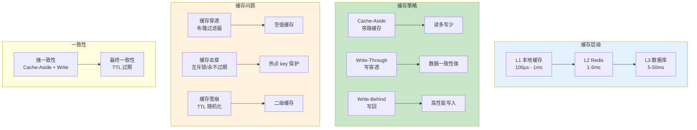

# L42: 缓存策略深入

> **课程编号**: L42
> **所属阶段**: Stage 4 - Web 开发进阶
> **预计时长**: 4-5 小时
> **难度**: ⭐⭐⭐⭐☆（高级）
> **前置课程**: L41
> **版本**: v1.0
> **最后更新**: 2026-07-23
> **核心版本**: Python 3.13

---

## 🎯 学习目标

完成本课程后，你将能够：

1. ✅ **缓存架构**：理解多级缓存架构
2. ✅ **缓存策略**：掌握 Cache-Aside、Write-Through 等模式
3. ✅ **Redis 缓存**：使用 Redis 实现高性能缓存
4. ✅ **缓存失效**：处理缓存穿透、击穿、雪崩
5. ✅ **分布式缓存**：实现跨服务缓存一致性
6. ✅ **缓存监控**：监控缓存命中率和性能

---



---

## Part 1: 多级缓存架构

### 1.1 缓存层级

```
┌─────────────────────────────────────────────────────────┐
│                   多级缓存架构                          │
├─────────────────────────────────────────────────────────┤
│                                                     │
│   请求 → [L1 本地缓存] → [L2 Redis] → [L3 数据库]    │
│           │                    │                     │
│         毫秒级                毫秒级                  │
│          10MB                 10GB+                  │
│                                                     │
│   命中率：   低              中                     │
│   维护成本： 低              中                     │
│                                                     │
└─────────────────────────────────────────────────────────┘
```

### 1.2 缓存对比

| 层级 | 技术 | 延迟 | 容量 | 适用场景 |
|------|------|------|------|----------|
| L1 | Caffeine/本地内存 | < 1ms | ~10MB | 请求级缓存 |
| L2 | Redis/Memcached | 1-5ms | ~10GB | 共享缓存 |
| L3 | 数据库 | 5-50ms | TB+ | 持久化存储 |

---

## Part 2: 缓存策略模式

### 2.1 Cache-Aside（旁路缓存）

```python
class CacheAside:
    """旁路缓存模式 - 最常用"""

    def __init__(self, cache: CacheManager, db: Session):
        self.cache = cache
        self.db = db

    async def get_user(self, user_id: int) -> Optional[User]:
        """读取数据"""
        # 1. 先查缓存
        cache_key = f"user:{user_id}"
        cached = await self.cache.get(cache_key)

        if cached:
            return User(**cached)

        # 2. 缓存未命中，查数据库
        user = await self.db.get(User, user_id)

        if user:
            # 3. 写入缓存
            await self.cache.set(
                cache_key,
                {
                    "id": user.id,
                    "username": user.username,
                    "email": user.email,
                },
                ttl=3600
            )

        return user

    async def update_user(self, user_id: int, data: dict):
        """更新数据"""
        # 1. 更新数据库
        user = await self.db.get(User, user_id)
        for key, value in data.items():
            setattr(user, key, value)
        await self.db.commit()

        # 2. 删除缓存（而不是更新）
        cache_key = f"user:{user_id}"
        await self.cache.delete(cache_key)

    async def delete_user(self, user_id: int):
        """删除数据"""
        # 1. 删除数据库
        user = await self.db.get(User, user_id)
        await self.db.delete(user)
        await self.db.commit()

        # 2. 删除缓存
        cache_key = f"user:{user_id}"
        await self.cache.delete(cache_key)
```

### 2.2 Read-Through（穿透读取）

```python
class ReadThrough:
    """穿透读取模式 - 缓存自动加载"""

    def __init__(self, cache: CacheManager, db: Session):
        self.cache = cache
        self.db = db

    async def get_user(self, user_id: int) -> Optional[User]:
        """读取数据，缓存自动处理"""
        return await self.cache.get_or_set(
            key=f"user:{user_id}",
            factory=lambda: self._load_user_from_db(user_id),
            ttl=3600
        )

    async def _load_user_from_db(self, user_id: int) -> Optional[dict]:
        """从数据库加载"""
        user = await self.db.get(User, user_id)
        if user:
            return {
                "id": user.id,
                "username": user.username,
                "email": user.email,
            }
        return None
```

### 2.3 Write-Through（穿透写入）

```python
class WriteThrough:
    """穿透写入模式 - 同步写缓存和数据库"""

    def __init__(self, cache: CacheManager, db: Session):
        self.cache = cache
        self.db = db

    async def update_user(self, user_id: int, data: dict):
        """更新数据，同时更新缓存和数据库"""
        cache_key = f"user:{user_id}"

        # 1. 获取当前数据
        user = await self.db.get(User, user_id)

        # 2. 更新数据库
        for key, value in data.items():
            setattr(user, key, value)
        await self.db.commit()

        # 3. 同步更新缓存
        await self.cache.set(
            cache_key,
            {
                "id": user.id,
                "username": user.username,
                "email": user.email,
            },
            ttl=3600
        )
```

### 2.4 Write-Behind（回写）

```python
class WriteBehind:
    """回写模式 - 异步写数据库"""

    def __init__(self, cache: CacheManager, task_queue):
        self.cache = cache
        self.task_queue = task_queue

    async def update_user(self, user_id: int, data: dict):
        """更新数据，写入缓存后异步更新数据库"""
        cache_key = f"user:{user_id}"

        # 1. 先更新缓存
        cached = await self.cache.get(cache_key)
        if cached:
            cached.update(data)
            await self.cache.set(cache_key, cached, ttl=3600)

        # 2. 异步写入数据库
        await self.task_queue.enqueue(
            "update_user_db",
            {"user_id": user_id, "data": data}
        )
```

---

## Part 3: Redis 缓存实现

### 3.1 缓存管理器

```python
import json
from typing import Optional, TypeVar, Callable, Any
from functools import wraps
import redis.asyncio as redis

T = TypeVar('T')

class RedisCache:
    """Redis 缓存管理器"""

    def __init__(
        self,
        redis_url: str = "redis://localhost:6379",
        default_ttl: int = 300
    ):
        self.redis_url = redis_url
        self.default_ttl = default_ttl
        self._client: Optional[redis.Redis] = None

    async def get_client(self) -> redis.Redis:
        if self._client is None:
            self._client = redis.from_url(
                self.redis_url,
                decode_responses=True
            )
        return self._client

    async def get(self, key: str) -> Optional[dict]:
        """获取缓存"""
        client = await self.get_client()
        data = await client.get(key)
        if data:
            return json.loads(data)
        return None

    async def set(
        self,
        key: str,
        value: dict,
        ttl: Optional[int] = None
    ) -> None:
        """设置缓存"""
        client = await self.get_client()
        ttl = ttl or self.default_ttl
        await client.setex(key, ttl, json.dumps(value))

    async def delete(self, key: str) -> None:
        """删除缓存"""
        client = await self.get_client()
        await client.delete(key)

    async def exists(self, key: str) -> bool:
        """检查键是否存在"""
        client = await self.get_client()
        return await client.exists(key) > 0

    async def get_or_set(
        self,
        key: str,
        factory: Callable,
        ttl: Optional[int] = None
    ) -> Any:
        """获取缓存，不存在则调用 factory 并缓存"""
        cached = await self.get(key)
        if cached is not None:
            return cached

        value = await factory()
        if value is not None:
            await self.set(key, value, ttl)

        return value

    async def delete_pattern(self, pattern: str) -> int:
        """删除匹配模式的所有键"""
        client = await self.get_client()
        keys = []
        async for key in client.scan_iter(match=pattern):
            keys.append(key)

        if keys:
            return await client.delete(*keys)
        return 0

    async def incr(self, key: str, amount: int = 1) -> int:
        """递增"""
        client = await self.get_client()
        return await client.incrby(key, amount)

    async def expire(self, key: str, ttl: int) -> bool:
        """设置过期时间"""
        client = await self.get_client()
        return await client.expire(key, ttl)

# 全局缓存实例
cache = RedisCache()
```

### 3.2 缓存装饰器

```python
def cached(
    ttl: int = 300,
    key_prefix: str = "",
    skip_cache: bool = False
):
    """缓存装饰器"""
    def decorator(func: Callable) -> Callable:
        @wraps(func)
        async def wrapper(*args, **kwargs):
            if skip_cache:
                return await func(*args, **kwargs)

            # 生成缓存键
            key_parts = [key_prefix, func.__name__]

            # 添加参数
            if args:
                key_parts.append(":".join(str(a) for a in args[1:]))
            if kwargs:
                key_parts.append(":".join(f"{k}={v}" for k, v in sorted(kwargs.items())))

            cache_key = ":".join(key_parts)

            # 尝试获取缓存
            cached_data = await cache.get(cache_key)
            if cached_data is not None:
                return cached_data

            # 执行函数
            result = await func(*args, **kwargs)

            # 缓存结果
            if result is not None:
                await cache.set(cache_key, result, ttl)

            return result
        return wrapper
    return decorator

# 使用示例
@cached(ttl=600, key_prefix="user")
async def get_user(user_id: int) -> Optional[dict]:
    user = await db.get(User, user_id)
    if user:
        return {"id": user.id, "username": user.username}
    return None

@cached(ttl=60, key_prefix="posts")
async def get_recent_posts(limit: int = 10) -> list[dict]:
    posts = await db.execute(
        select(Post).order_by(Post.created_at.desc()).limit(limit)
    )
    return [{"id": p.id, "title": p.title} for p in posts.scalars()]
```

---

## Part 4: 缓存问题处理

### 4.1 缓存穿透

```python
async def get_item(item_id: int) -> Optional[dict]:
    """处理缓存穿透 - 使用空值缓存"""
    cache_key = f"item:{item_id}"

    cached = await cache.get(cache_key)
    if cached is not None:
        if cached.get("_null"):
            return None
        return cached

    # 查询数据库
    item = await db.get(Item, item_id)

    if item:
        await cache.set(cache_key, {"id": item.id, "name": item.name})
    else:
        # 缓存空值，短 TTL
        await cache.set(cache_key, {"_null": True}, ttl=60)

    return item if item else None
```

### 4.2 缓存击穿

```python
import asyncio
from contextlib import asynccontextmanager

class CacheBreaker:
    """缓存击穿保护 - 使用互斥锁"""

    def __init__(self):
        self.locks: dict[str, asyncio.Lock] = {}
        self.cache = RedisCache()

    @asynccontextmanager
    async def lock(self, key: str):
        """获取锁"""
        if key not in self.locks:
            self.locks[key] = asyncio.Lock()

        async with self.locks[key]:
            yield

    async def get_or_load(
        self,
        key: str,
        loader: Callable,
        ttl: int = 300
    ) -> Any:
        """获取或加载数据，带击穿保护"""
        # 尝试从缓存获取
        cached = await self.cache.get(key)
        if cached:
            return cached

        # 获取锁
        async with self.lock(key):
            # 双重检查
            cached = await self.cache.get(key)
            if cached:
                return cached

            # 加载数据
            data = await loader()

            if data is not None:
                await self.cache.set(key, data, ttl)

            return data

# 使用
cache_breaker = CacheBreaker()

async def get_user(user_id: int) -> Optional[dict]:
    return await cache_breaker.get_or_load(
        key=f"user:{user_id}",
        loader=lambda: load_user_from_db(user_id),
        ttl=3600
    )
```

### 4.3 缓存雪崩

```python
# 解决方案 1: 随机 TTL
def generate_ttl(base_ttl: int, variance: float = 0.2) -> int:
    """生成带随机性的 TTL"""
    import random
    variance_seconds = base_ttl * variance
    return int(base_ttl + random.uniform(-variance_seconds, variance_seconds))

# 解决方案 2: 热点数据永不过期
async def get_hot_data(key: str) -> Any:
    """热点数据永不过期，使用主动更新"""
    cached = await cache.get(key)

    if cached:
        return cached

    # 加载数据
    data = await load_data(key)

    # 永久缓存
    await cache.set(key, data, ttl=0)  # TTL=0 表示永不过期

    return data

# 解决方案 3: 多级缓存
class MultiLevelCache:
    """多级缓存"""

    def __init__(self):
        self.l1_cache = LocalCache()  # 本地内存
        self.l2_cache = RedisCache()  # Redis

    async def get(self, key: str) -> Optional[dict]:
        # L1 查找
        cached = self.l1_cache.get(key)
        if cached:
            return cached

        # L2 查找
        cached = await self.l2_cache.get(key)
        if cached:
            # 回填 L1
            self.l1_cache.set(key, cached, ttl=60)
            return cached

        return None
```

---

## Part 5: 分布式缓存一致性

### 5.1 发布订阅

```python
class CacheInvalidator:
    """缓存失效广播"""

    def __init__(self, cache: RedisCache):
        self.cache = cache
        self._pubsub = None

    async def subscribe(self, channel: str, callback: Callable):
        """订阅缓存失效事件"""
        client = await self.cache.get_client()
        pubsub = client.pubsub()
        await pubsub.subscribe(channel)

        async for message in pubsub.listen():
            if message["type"] == "message":
                await callback(message["data"])

    async def publish_invalidate(self, pattern: str):
        """发布失效事件"""
        client = await self.cache.get_client()
        await client.publish("cache:invalidate", pattern)

    async def invalidate_pattern(self, pattern: str):
        """失效匹配的缓存"""
        # 本地失效
        await self.cache.delete_pattern(pattern)

        # 广播给其他服务
        await self.publish_invalidate(pattern)

# 使用
invalidator = CacheInvalidator(cache)

# 服务 A: 更新用户时广播失效
async def update_user(user_id: int, data: dict):
    await db.update_user(user_id, data)
    await invalidator.invalidate_pattern(f"user:{user_id}")

# 服务 B: 监听失效事件
async def listen_invalidate():
    async def on_invalidate(pattern: str):
        await cache.delete_pattern(pattern)

    await invalidator.subscribe("cache:invalidate", on_invalidate)
```

### 5.2 分布式锁

```python
class DistributedLock:
    """分布式锁"""

    def __init__(self, redis_url: str):
        self.redis = redis.from_url(redis_url)
        self.locks: dict[str, str] = {}

    async def acquire(self, key: str, ttl: int = 10) -> bool:
        """获取锁"""
        lock_key = f"lock:{key}"
        import uuid
        lock_value = str(uuid.uuid4())

        acquired = await self.redis.set(
            lock_key,
            lock_value,
            nx=True,
            ex=ttl
        )

        if acquired:
            self.locks[key] = lock_value
            return True
        return False

    async def release(self, key: str):
        """释放锁"""
        lock_key = f"lock:{key}"
        lock_value = self.locks.pop(key, None)

        if lock_value:
            # Lua 脚本确保原子性
            lua = """
            if redis.call("get", KEYS[1]) == ARGV[1] then
                return redis.call("del", KEYS[1])
            else
                return 0
            end
            """
            await self.redis.eval(lua, 1, lock_key, lock_value)

    async def __aenter__(self):
        return self

    async def __aexit__(self, *args):
        for key in list(self.locks.keys()):
            await self.release(key)
```

---

## Part 6: 缓存监控

### 6.1 命中率统计

```python
from prometheus_client import Counter, Histogram

# 缓存指标
cache_hits = Counter("cache_hits_total", "Total cache hits", ["cache_type"])
cache_misses = Counter("cache_misses_total", "Total cache misses", ["cache_type"])
cache_latency = Histogram("cache_latency_seconds", "Cache latency")

class MonitoredCache(RedisCache):
    """带监控的缓存"""

    async def get(self, key: str) -> Optional[dict]:
        with cache_latency.time():
            result = await super().get(key)

        if result is not None:
            cache_hits.labels(cache_type="redis").inc()
        else:
            cache_misses.labels(cache_type="redis").inc()

        return result
```

### 6.2 健康检查

```python
async def check_cache_health() -> dict:
    """检查缓存健康状态"""
    try:
        client = await cache.get_client()
        start = time.time()
        await client.ping()
        latency = (time.time() - start) * 1000

        info = await client.info("memory")
        used_memory = info.get("used_memory_human", "unknown")

        return {
            "status": "healthy",
            "latency_ms": round(latency, 2),
            "memory_used": used_memory
        }
    except Exception as e:
        return {
            "status": "unhealthy",
            "error": str(e)
        }
```

---

## Part 7: 实际应用场景

### 7.1 用户会话缓存

```python
@cached(ttl=3600, key_prefix="session")
async def get_user_session(user_id: int) -> Optional[dict]:
    """获取用户会话"""
    session = await db.execute(
        select(Session).where(Session.user_id == user_id)
    )
    session = session.scalar_one_or_none()

    if session:
        return {
            "user_id": user_id,
            "last_activity": session.last_activity.isoformat(),
            "permissions": session.permissions
        }
    return None

async def update_session_activity(user_id: int):
    """更新会话活跃时间"""
    session = await get_user_session(user_id)
    if session:
        await db.execute(
            update(Session)
            .where(Session.user_id == user_id)
            .values(last_activity=datetime.now())
        )
        await db.commit()
```

### 7.2 API 响应缓存

```python
from fastapi import APIRouter, Query
from app.cache import cached

router = APIRouter()

@router.get("/posts")
@cached(ttl=300, key_prefix="posts_list")
async def list_posts(
    page: int = Query(1, ge=1),
    page_size: int = Query(20, ge=1, le=100),
    category: str = Query(None)
) -> dict:
    """获取文章列表，带缓存"""
    query = select(Post).order_by(Post.created_at.desc())

    if category:
        query = query.where(Post.category == category)

    offset = (page - 1) * page_size
    query = query.offset(offset).limit(page_size)

    result = await db.execute(query)
    posts = result.scalars().all()

    return {
        "items": [{"id": p.id, "title": p.title} for p in posts],
        "page": page,
        "page_size": page_size
    }
```

### 7.3 排行榜缓存

```python
@cached(ttl=60, key_prefix="leaderboard")
async def get_leaderboard(limit: int = 100) -> list[dict]:
    """获取排行榜"""
    result = await db.execute(
        select(User)
        .order_by(User.score.desc())
        .limit(limit)
    )
    users = result.scalars().all()

    return [
        {"rank": i+1, "user_id": u.id, "username": u.username, "score": u.score}
        for i, u in enumerate(users)
    ]

async def update_user_score(user_id: int, delta: int):
    """更新用户分数"""
    await db.execute(
        update(User)
        .where(User.id == user_id)
        .values(score=User.score + delta)
    )
    await db.commit()

    # 清除排行榜缓存
    await cache.delete_pattern("leaderboard:*")
```

---

## 📝 课程总结

### 核心知识点

1. **缓存策略**：Cache-Aside、Read-Through、Write-Through、Write-Behind
2. **Redis 缓存**：缓存管理器、装饰器、多种数据结构
3. **缓存问题**：穿透、击穿、雪崩的解决方案
4. **一致性**：发布订阅、分布式锁
5. **监控**：命中率统计、健康检查

### 关键要点

- ✅ Cache-Aside 是最常用的缓存模式
- ✅ 使用空值缓存防止穿透
- ✅ 使用互斥锁防止击穿
- ✅ 使用随机 TTL 防止雪崩
- ✅ 分布式环境需要广播失效

---

## ✅ 完成标准

完成本课程后，你应该能够：

- [ ] 理解多级缓存架构
- [ ] 实现 Cache-Aside 等缓存模式
- [ ] 使用 Redis 实现高性能缓存
- [ ] 处理缓存穿透、击穿、雪崩
- [ ] 实现分布式缓存一致性
- [ ] 监控缓存性能

---

**下一步**: 继续学习 [L43: 异步任务处理](../L43-async-tasks/lesson.md)
