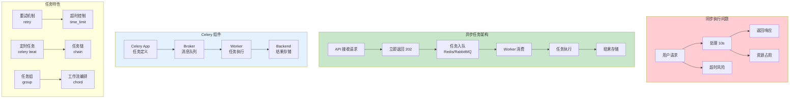

# L43: 异步任务处理

> **课程编号**: L43
> **所属阶段**: Stage 4 - Web 开发进阶
> **预计时长**: 5-6 小时
> **难度**: ⭐⭐⭐⭐☆（高级）
> **前置课程**: L40, L42
> **版本**: v1.0
> **最后更新**: 2026-07-23
> **核心版本**: Python 3.13


---

## 🎯 学习目标

完成本课程后，你将能够：

1. ✅ **任务队列基础**：理解为什么需要任务队列
2. ✅ **Celery 熟练使用**：掌握 Celery 任务定义、调度、监控
3. ✅ **消息队列**：使用 Redis/RabbitMQ 作为 Broker
4. ✅ **错误处理**：掌握重试、死信队列、任务超时
5. ✅ **任务编排**：实现复杂的工作流编排
6. ✅ **监控与调试**：使用 Flower 监控任务执行

---



---

## Part 1: 为什么需要任务队列

### 1.1 同步 vs 异步执行

**同步执行的问题**：
- 用户等待时间长
- 请求超时
- 系统资源占用
- 无法处理耗时任务

**异步执行的好处**：
- 快速响应用户
- 削峰填谷
- 重试和监控
- 可扩展性强

```
┌─────────────────────────────────────────────────────────┐
│                   同步 vs 异步                         │
├─────────────────────────────────────────────────────────┤
│                                                     │
│  同步：                                            │
│  用户 → 请求 → [处理 10 秒] → 响应                  │
│                                                     │
│  异步：                                            │
│  用户 → 请求 → 立即响应 → [后台处理 10 秒]          │
│                                                     │
└─────────────────────────────────────────────────────────┘
```

### 1.2 适用场景

| 场景 | 同步/异步 | 原因 |
|------|----------|------|
| 用户注册发送邮件 | 异步 | 不阻塞响应 |
| 图片上传转码 | 异步 | 耗时操作 |
| 订单支付 | 同步 | 需要即时结果 |
| 发送通知 | 异步 | 不影响主流程 |
| 批量数据导出 | 异步 | 耗时操作 |
| 报表生成 | 异步 | 耗时操作 |
| 缓存预热 | 异步 | 后台任务 |

---

## Part 2: Celery 基础

### 2.1 架构概述

```
┌─────────────────────────────────────────────────────────┐
│                   Celery 架构                          │
├─────────────────────────────────────────────────────────┤
│                                                     │
│  应用 ──→ [Celery Broker] ──→ [Celery Workers]      │
│          (Redis/RabbitMQ)     │                      │
│                               ↓                       │
│                        [结果存储]                     │
│                         (Redis)                      │
│                                                     │
└─────────────────────────────────────────────────────────┘
```

### 2.2 安装和配置

```bash
# 安装 Celery 和消息队列
uv add celery[redis] redis

# Redis 作为 Broker 和 Result Backend
uv add redis
```

### 2.3 快速入门

```python
# tasks.py
from celery import Celery

# 创建 Celery 实例
app = Celery(
    'tasks',
    broker='redis://localhost:6379/0',      # 消息队列
    backend='redis://localhost:6379/1'      # 结果存储
)

@app.task
def send_email(to: str, subject: str, body: str):
    """发送邮件任务"""
    # 实际发邮件逻辑
    import time
    time.sleep(2)  # 模拟耗时操作
    print(f"Email sent to {to}")
    return {"status": "sent", "to": to}

@app.task
def add(a: int, b: int) -> int:
    """简单加法任务"""
    return a + b
```

```bash
# 启动 Worker
celery -A tasks worker --loglevel=info --concurrency=4

# 启动 Flower 监控
celery -A tasks flower
```

### 2.4 调用任务

```python
# 调用方式 1：延迟调用（fire and forget）
result = send_email.delay("user@example.com", "Hello", "Body")
print(result.id)  # 获取任务 ID

# 调用方式 2：签名调用（更灵活）
from celery import signature
sig = send_email.s("user@example.com", "Hello", "Body")
sig.delay()

# 调用方式 3：apply_async（高级选项）
send_email.apply_async(
    kwargs={"to": "user@example.com", "subject": "Hello"},
    countdown=60,           # 60 秒后执行
    eta=datetime.datetime(2024, 1, 15, 12, 0),  # 指定时间执行
    retry=True,              # 失败重试
    retry_policy={
        "max_retries": 3,
        "interval_start": 0,
        "interval_step": 0.2,
        "interval_max": 0.2,
    }
)

# 同步调用（等待结果）
result = add.apply_async((2, 3))
print(result.get(timeout=10))  # 获取结果，最多等 10 秒

# 取消任务
result.revoke(terminate=True)
```

---

## Part 3: 任务调度

### 3.1 周期任务（Celery Beat）

```python
# celery_config.py
from celery import Celery
from celery.schedules import crontab

app = Celery('tasks', broker='redis://localhost:6379/0')

# 定时任务配置
app.conf.beat_schedule = {
    'send-daily-report': {
        'task': 'tasks.send_daily_report',
        'schedule': crontab(hour=8, minute=0),  # 每天 8:00
    },
    'cleanup-expired-sessions': {
        'task': 'tasks.cleanup_sessions',
        'schedule': 3600.0,  # 每小时
    },
    'sync-inventory': {
        'task': 'tasks.sync_inventory',
        'schedule': crontab(minute='*/15'),  # 每 15 分钟
    },
    'weekly-newsletter': {
        'task': 'tasks.send_newsletter',
        'schedule': crontab(hour=10, minute=0, day_of_week=1),  # 每周一 10:00
    },
}

@app.task
def send_daily_report():
    """发送每日报告"""
    # 生成报告逻辑
    return {"status": "sent"}

@app.task
def cleanup_sessions():
    """清理过期会话"""
    # 清理逻辑
    return {"cleaned": 100}
```

```bash
# 启动 Beat 调度器
celery -A tasks beat --loglevel=info
```

### 3.2 Crontab 表达式

```python
from celery.schedules import crontab

# 每分钟
schedule = crontab(minute='*')

# 每 15 分钟
schedule = crontab(minute='*/15')

# 每天 8:00
schedule = crontab(hour=8, minute=0)

# 每周一 10:00
schedule = crontab(hour=10, minute=0, day_of_week=1)

# 每月 1 日 0:00
schedule = crontab(0, 0, day_of_month=1)

# 每季度
schedule = crontab(0, 0, month_of_year='*/3')

# 多个时间
schedule = crontab(hour=[9, 12, 18], minute=0)  # 9:00, 12:00, 18:00
```

---

## Part 4: 错误处理与重试

### 4.1 自动重试

```python
from celery import Celery
from celery.exceptions import MaxRetriesExceededError
import time

app = Celery('tasks', broker='redis://localhost:6379/0')

@app.task(
    bind=True,
    autoretry_for=(Exception,),
    retry_backoff=True,
    retry_backoff_max=600,
    retry_jitter=True,
    max_retries=5
)
def send_notification(self, user_id: int, message: str):
    """发送通知，带自动重试"""
    try:
        # 调用第三方 API
        response = send_to_api(user_id, message)
        return {"status": "sent", "response": response}
    except ConnectionError as e:
        # 连接错误，重试
        raise self.retry(exc=e, countdown=60)

@app.task(bind=True)
def process_data(self, data: dict):
    """处理数据，限制重试次数"""
    try:
        result = process(data)
        return {"status": "success", "result": result}
    except ValidationError as e:
        # 验证错误不重试
        return {"status": "failed", "error": str(e)}
    except ProcessingError as e:
        # 处理错误，重试
        try:
            raise self.retry(exc=e, countdown=60)
        except MaxRetriesExceededError:
            # 重试次数用尽
            return {"status": "failed", "error": "Max retries exceeded"}
```

### 4.2 死信队列

```python
# celery_config.py
app.conf.update(
    task_acks_late=True,           # 任务完成后才确认
    task_reject_on_worker_lost=True,  # Worker 丢失时重新入队
    task_default_retry_delay=300,     # 默认重试延迟 5 分钟
    task_max_retries=5,              # 最大重试次数
)

@app.task(
    bind=True,
    max_retries=5,
    default_retry_delay=300,
    acks_late=True,
)
def process_order(self, order_id: int):
    """处理订单，处理失败进入死信队列"""
    try:
        order = get_order(order_id)
        process_payment(order)
        ship_order(order)
        return {"status": "success", "order_id": order_id}
    except Exception as e:
        if self.request.retries >= self.max_retries:
            # 超过重试次数，发送到死信队列
            send_to_dlq("order_processing", order_id, str(e))
            return {"status": "dead_letter"}
        raise self.retry(exc=e)
```

### 4.3 任务超时

```python
# 全局超时配置
app.conf.update(
    task_soft_time_limit=300,    # 软限制 5 分钟
    task_time_limit=360,          # 硬限制 6 分钟
)

@app.task(
    soft_time_limit=30,
    time_limit=60,
    throws=(TimeoutError,)
)
def long_running_task(self, data: list):
    """长时间运行任务"""
    for item in data:
        process(item)
        if self.is_aborted():
            raise StopTaskError("Task was aborted")
```

### 4.4 任务限流

```python
# 限流配置
@app.task(
    rate_limit='10/m',      # 每分钟 10 次
    time_limit=30,
)
def send_sms(phone: str, message: str):
    """发送短信，限流"""
    ...

# 动态限流
@app.task
def bulk_email(recipient_ids: list[str]):
    """批量邮件，根据收件人数量动态限流"""
    rate = f"{len(recipient_ids) // 10}/m"  # 每分钟 len/10 批
    send_bulk.apply_async(
        kwargs={"recipient_ids": recipient_ids},
        task_id="bulk_email",
        rate_limit=rate
    )
```

---

## Part 5: 任务编排

### 5.1 Group 并行执行

```python
from celery import group, chain, chord

# Group：并行执行多个任务
result = group(
    send_email.s(user.email, "Subject 1", "Body 1"),
    send_email.s(user.email, "Subject 2", "Body 2"),
    send_email.s(user.email, "Subject 3", "Body 3"),
)()

# 等待所有任务完成
results = result.get()
print(results)  # [{status: sent}, {status: sent}, {status: sent}]

# 使用 apply_async
group(
    process_item.s(item) for item in items
).apply_async()
```

### 5.2 Chain 顺序执行

```python
# Chain：顺序执行，输出作为输入
result = chain(
    fetch_data.s(url="https://api.example.com/data"),
    process_data.s(),
    store_results.s(),
)()

# 等价于
# 1. fetch_data() → result1
# 2. process_data(result1) → result2
# 3. store_results(result2) → final_result

# 获取最终结果
final = result.get()
print(final)
```

### 5.3 Chord 带回调

```python
# Chord：所有任务完成后执行回调
result = chord(
    [process_item.s(item) for item in items],
    generate_report.s()  # 回调
)()

# 等价于
# 1. 并行执行所有 process_item 任务
# 2. 所有完成后执行 generate_report

# 获取结果
report = result.get()
print(report)
```

### 5.4 复杂工作流

```python
from celery import chain, group, chord

# 复杂工作流：订单处理
workflow = chain(
    # Step 1: 验证订单
    validate_order.s(order_id),

    # Step 2: 支付处理（并行）
    group(
        process_payment.s(),
        reserve_inventory.s(),
        send_confirmation.s(),
    ),

    # Step 3: 通知（带回调）
    chord(
        [notify_customer.s(), notify_warehouse.s()],
        complete_order.s()
    ),
)()

# 或者使用签名
workflow = chain(
    validate_order.s(order_id),
    group(
        process_payment.s(),
        reserve_inventory.s(),
    ),
    send_notifications.s(),
)
```

---

## Part 6: 监控与调试

### 6.1 Flower 监控

```bash
# 安装 Flower
uv add flower

# 启动 Flower
celery -A tasks flower --port=5555

# 或带认证
celery -A tasks flower --port=5555 --basic_auth=user:password
```

### 6.2 任务事件

```python
from celery.signals import task_success, task_failure, task_retry

@task_success.connect
def task_success_handler(sender=None, result=None, **kwargs):
    """任务成功时调用"""
    print(f"Task {sender.name} succeeded with result: {result}")
    # 发送指标到监控系统
    metrics.increment("task.success", tags={"task": sender.name})

@task_failure.connect
def task_failure_handler(sender=None, exception=None, **kwargs):
    """任务失败时调用"""
    print(f"Task {sender.name} failed: {exception}")
    # 发送告警
    alerts.send(f"Task {sender.name} failed: {exception}")

@task_retry.connect
def task_retry_handler(sender=None, reason=None, **kwargs):
    """任务重试时调用"""
    print(f"Task {sender.name} retrying: {reason}")
```

### 6.3 手动监控

```python
from celery.result import AsyncResult

# 获取任务结果
result = AsyncResult("task-id-123")

# 检查状态
print(result.state)  # PENDING, STARTED, SUCCESS, FAILURE, RETRY

# 获取结果
if result.ready():
    if result.successful():
        print(result.result)
    else:
        print(result.info)  # 异常信息

# 等待结果
result = add.apply_async((4, 5))
print(result.get(timeout=10))

# 遍历多个结果
from celery.result import GroupResult
group_result = GroupResult("group-id-123", results)
for r in group_result:
    print(r.get())
```

### 6.4 日志配置

```python
# celery_config.py
import logging

app.conf.update(
    worker_log_format='[%(asctime)s: %(levelname)s/%(processName)s] %(message)s',
    worker_task_log_format='[%(asctime)s: %(levelname)s/%(processName)s] [%(task_name)s(%(task_id)s)] %(message)s',

    # 日志处理器
    worker_log_handlers=['console', 'file'],

    # 日志文件
    worker_log_file='/var/log/celery/worker.log',
)

# 在任务中记录日志
@app.task
def process_data(data):
    logger = logging.getLogger(__name__)
    logger.info(f"Processing data: {data}")
    logger.warning(f"Processing slow for data: {data}")
```

---

## Part 7: 最佳实践

### 7.1 任务设计原则

```python
# ❌ 不好：任务过于复杂
@app.task
def complex_workflow(data):
    # 太多逻辑，应该拆分
    validate(data)
    process_step1(data)
    process_step2(data)
    process_step3(data)
    notify()
    return result

# ✅ 好：拆分任务，使用编排
workflow = chain(
    validate.s(data),
    group(process_step1.s(), process_step2.s()),
    process_step3.s(),
    notify.s(),
)

# ❌ 不好：传递大对象
@app.task
def process_large_file(file_path):
    with open(file_path) as f:
        data = f.read()  # 内存问题
    return process(data)

# ✅ 好：传递引用
@app.task
def process_large_file(file_path):
    with open(file_path) as f:
        data = f.read()
    return process(data)

# 或者使用 Chunk
@app.task
def process_chunk(chunk: list):
    return [process(item) for item in chunk]

# 主任务拆分
def process_file(file_path, chunk_size=1000):
    items = load_items(file_path)
    chunks = [items[i:i+chunk_size] for i in range(0, len(items), chunk_size)]
    return group(process_chunk.s(chunk) for chunk in chunks)()
```

### 7.2 幂等性

```python
# 幂等性：同一任务多次执行结果相同
@app.task
def send_notification(user_id: int, notification_id: str):
    """幂等通知任务"""
    # 检查是否已发送
    if NotificationLog.objects.filter(
        notification_id=notification_id,
        status='sent'
    ).exists():
        return {"status": "already_sent", "notification_id": notification_id}

    # 发送通知
    send(notification_id)

    # 记录日志
    NotificationLog.objects.create(
        notification_id=notification_id,
        status='sent'
    )

    return {"status": "sent", "notification_id": notification_id}
```

### 7.3 任务优先级

```python
# 优先级队列
app.conf.task_routes = {
    'tasks.high_priority.*': {'queue': 'high'},
    'tasks.low_priority.*': {'queue': 'low'},
    'tasks.default.*': {'queue': 'default'},
}

@app.task(queue='high_priority')
def urgent_notification():
    """紧急通知，高优先级"""
    ...

# 启动不同优先级的 Worker
# celery -A tasks worker -Q high -n high_worker
# celery -A tasks worker -Q default -n default_worker
# celery -A tasks worker -Q low -n low_worker
```

---

## Part 8: 实际应用场景

### 8.1 邮件发送

```python
@app.task(
    bind=True,
    max_retries=3,
    autoretry_for=(SMTPError, ConnectionError),
    retry_backoff=True,
)
def send_welcome_email(self, user_id: int):
    """发送欢迎邮件"""
    user = get_user(user_id)

    # 构建邮件
    subject = "欢迎加入 TaskFlow"
    html_body = render_template("emails/welcome.html", user=user)

    try:
        send_email(
            to=user.email,
            subject=subject,
            html_body=html_body
        )
        # 记录发送日志
        EmailLog.objects.create(
            user_id=user_id,
            type='welcome',
            status='sent'
        )
        return {"status": "sent", "user_id": user_id}
    except Exception as e:
        self.retry(exc=e)
```

### 8.2 图片处理

```python
@app.task(
    bind=True,
    soft_time_limit=300,
    max_retries=3,
)
def process_uploaded_image(self, image_path: str, user_id: int):
    """处理上传的图片"""
    from PIL import Image
    import os

    # 生成不同尺寸
    sizes = {
        'thumbnail': (100, 100),
        'medium': (400, 400),
        'large': (1200, 1200),
    }

    image = Image.open(image_path)

    results = {}
    for size_name, (width, height) in sizes.items():
        resized = image.copy()
        resized.thumbnail((width, height), Image.Resampling.LANCZOS)

        # 保存
        output_path = f"/static/uploads/{user_id}/{size_name}_{os.path.basename(image_path)}"
        resized.save(output_path)
        results[size_name] = output_path

    # 生成缩略图
    return {
        "status": "processed",
        "user_id": user_id,
        "paths": results
    }
```

### 8.3 数据导入导出

```python
@app.task(bind=True)
def export_data(self, export_id: str, filters: dict):
    """导出数据"""
    from django.http import HttpResponse
    import csv
    import io

    # 更新状态
    export = ExportJob.objects.get(id=export_id)
    export.status = 'processing'
    export.save()

    # 查询数据
    queryset = User.objects.filter(**filters)

    # 生成 CSV
    output = io.StringIO()
    writer = csv.writer(output)

    # 写入表头
    writer.writerow(['ID', 'Username', 'Email', 'Created At'])

    # 逐批写入
    batch_size = 1000
    for i in range(0, queryset.count(), batch_size):
        batch = queryset[i:i+batch_size]
        for user in batch:
            writer.writerow([user.id, user.username, user.email, user.created_at])

        # 更新进度
        export.progress = int((i + batch_size) / queryset.count() * 100)
        export.save()

    # 保存文件
    file_path = f"/exports/{export_id}.csv"
    with open(file_path, 'w') as f:
        f.write(output.getvalue())

    # 更新状态
    export.status = 'completed'
    export.file_path = file_path
    export.save()

    return {"status": "completed", "file_path": file_path}
```

---

## 📝 课程总结

### 核心知识点

1. **Celery 基础**：任务定义、调用、结果获取
2. **任务调度**：Celery Beat、定时任务
3. **错误处理**：重试、死信队列、超时
4. **任务编排**：Group、Chain、Chord
5. **监控调试**：Flower、事件信号
6. **最佳实践**：幂等性、任务设计、限流

### 关键要点

- ✅ 使用延迟调用提高响应速度
- ✅ 配置重试策略提高可靠性
- ✅ 拆分复杂任务使用编排
- ✅ 实现幂等性防止重复执行
- ✅ 使用监控工具调试问题

---

## ✅ 完成标准

完成本课程后，你应该能够：

- [ ] 理解同步和异步任务的适用场景
- [ ] 使用 Celery 定义和调用任务
- [ ] 配置定时任务和调度
- [ ] 实现错误处理和重试机制
- [ ] 使用 Group/Chain/Chord 编排任务
- [ ] 使用 Flower 监控任务执行
- [ ] 编写可靠、幂等的任务代码

---

**下一步**: 继续学习 [L44: 微服务架构基础](../L44-microservices-basics/lesson.md)
