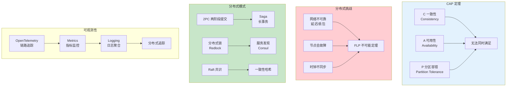

# L45: 分布式系统实战

> **课程编号**: L45
> **所属阶段**: Stage 4 - Web 开发进阶
> **预计时长**: 6-8 小时
> **难度**: ⭐⭐⭐⭐⭐（专家级）
> **前置课程**: L41, L42, L43, L44
> **版本**: v1.0
> **最后更新**: 2026-07-23
> **核心版本**: Python 3.13


---

## 🎯 学习目标

完成本课程后，你将能够：

1. ✅ **理解 CAP 定理**：掌握分布式系统的一致性、可用性、分区容错权衡
2. ✅ **理解共识算法**：掌握 Raft 算法原理和实现
3. ✅ **实现分布式事务**：掌握 2PC、Saga、TCC 三种模式
4. ✅ **实现分布式锁**：掌握 Redis 分布式锁和 Redlock 算法
5. ✅ **理解分布式追踪**：掌握 OpenTelemetry 链路追踪
6. ✅ **理解服务网格**：掌握 Istio 架构和核心概念

---



---

## 📚 课程导读

### 为什么要学习分布式系统？

当单体应用无法满足需求时，我们需要扩展到多台服务器：

```
单体应用 → 微服务 → 分布式系统
     ↓           ↓          ↓
   简单          复杂       非常复杂
```

**分布式系统面临的挑战**：
- 网络不可靠（延迟、丢包、断连）
- 节点会故障
- 无法精确知道时间
- 数据可能不一致

**本课程将帮助你理解并解决这些挑战。**

---

## Part 1: CAP 定理与分布式基础

### 1.1 CAP 定理简介

CAP 定理指出：分布式系统只能同时满足以下两个特性：

| 特性 | 说明 | 缩写 |
|------|------|------|
| **一致性（Consistency）** | 所有节点看到相同数据 | C |
| **可用性（Availability）** | 每个请求都有响应 | A |
| **分区容错（Partition Tolerance）** | 系统在网络分区时仍能运行 | P |

```
┌─────────────────────────────────────────────────────────┐
│                    CAP 定理                            │
├─────────────────────────────────────────────────────────┤
│                                                     │
│           C / A                                     │
│         ↙     ↘                                   │
│        ↙         ↘                                 │
│       P ←───────→ P                                │
│        ↘         ↙                                 │
│         ↘     ↙                                   │
│           C / A                                    │
│                                                     │
│  分布式系统只能同时满足两个特性                      │
│  （网络分区 P 是必然发生的）                        │
└─────────────────────────────────────────────────────────┘
```

### 1.2 CAP 三种组合

| 组合 | 系统类型 | 特点 | 典型系统 |
|------|----------|------|-----------|
| **CP** | 强一致性 | 放弃可用性，分区时不可用 | ZooKeeper, etcd, HBase |
| **AP** | 高可用性 | 放弃强一致性，分区时最终一致 | Cassandra, DynamoDB, Redis |
| **CA** | 不存在 | 网络分区不可避免，无法同时满足 | — |

### 1.3 实际选择

```python
# 选择 CP 还是 AP？

# CP 系统场景：金融、库存
# - 需要强一致性
# - 可以接受短暂不可用
# - 示例：银行转账、库存扣减

# AP 系统场景：社交、推荐
# - 需要高可用
# - 可以接受最终一致
# - 示例：用户点赞、推荐系统
```

### 1.4 一致性模型详解

| 一致性模型 | 说明 | 延迟 | 典型场景 |
|------------|------|------|----------|
| **强一致性** | 写入后立即可读 | 高 | 金融交易 |
| **最终一致性** | 写入后最终可读 | 低 | 社交媒体 |
| **因果一致性** | 有因果关系的操作顺序保证 | 中 | 评论系统 |
| **读己所写** | 自己写入后立即可读 | 中 | 用户发布 |

---

## Part 2: Raft 共识算法

### 2.1 Raft 算法概述

Raft 是一种用于管理复制日志的共识算法，通过选举领导者来简化分布式一致性。

```
┌─────────────────────────────────────────────────────────┐
│                    Raft 角色                          │
├─────────────────────────────────────────────────────────┤
│                                                     │
│  ┌─────────┐    ┌─────────┐    ┌─────────┐        │
│  │ Leader  │ ←  │Follower │ →  │Follower │        │
│  │ 领导者   │    │ 跟随者  │    │ 跟随者  │        │
│  │ 处理请求 │    │ 投票     │    │ 投票     │        │
│  │ 复制日志 │    │ 同步状态  │    │ 同步状态  │        │
│  └─────────┘    └─────────┘    └─────────┘        │
│       ↑              ↓              ↓                 │
│       └──────────────┴──────────────┘             │
│              心跳 / 日志复制                         │
└─────────────────────────────────────────────────────────┘
```

### 2.2 Leader 选举

```python
import asyncio
import random
from dataclasses import dataclass
from enum import Enum
from typing import Optional
import time

class NodeState(Enum):
    """节点状态"""
    FOLLOWER = "follower"
    CANDIDATE = "candidate"
    LEADER = "leader"

@dataclass
class Node:
    """Raft 节点"""
    node_id: str
    state: NodeState = NodeState.FOLLOWER
    current_term: int = 0
    voted_for: Optional[str] = None
    log: list = None
    commit_index: int = 0
    last_applied: int = 0

    # 选举超时配置
    election_timeout_min: float = 1.0
    election_timeout_max: float = 1.5

    def __post_init__(self):
        if self.log is None:
            self.log = []

    def reset_election_timer(self):
        """重置选举超时计时器"""
        self.election_timeout = random.uniform(
            self.election_timeout_min,
            self.election_timeout_max
        )
        self.last_reset_time = time.time()

    async def become_candidate(self):
        """成为候选人并开始选举"""
        self.state = NodeState.CANDIDATE
        self.current_term += 1
        self.voted_for = self.node_id
        # 请求其他节点投票
        votes = await self.request_votes()
        if votes > len(self.get_cluster_nodes()) // 2:
            await self.become_leader()

    async def become_leader(self):
        """成为领导者"""
        self.state = NodeState.LEADER
        # 向所有跟随者发送心跳
        await self.send_heartbeats()
```

### 2.3 日志复制

```python
class RaftLogReplication:
    """Raft 日志复制"""

    async def append_entries(self, term: int, leader_id: str,
                          prev_log_index: int, prev_log_term: int,
                          entries: list, leader_commit: int) -> bool:
        """
        追加日志条目

        Args:
            term: 领导者的任期
            leader_id: 领导者 ID
            prev_log_index: 前一个日志条目的索引
            prev_log_term: 前一个日志条目的任期
            entries: 要追加的日志条目
            leader_commit: 领导者已提交的日志索引

        Returns:
            是否成功
        """
        # 1. 检查任期
        if term < self.current_term:
            return False

        # 2. 如果是领导者，更新自己的任期
        if term > self.current_term:
            self.current_term = term
            self.state = NodeState.FOLLOWER

        # 3. 检查 prev_log_index 是否匹配
        if prev_log_index >= len(self.log):
            return False

        if prev_log_index >= 0 and self.log[prev_log_index].term != prev_log_term:
            # 日志不匹配，删除冲突条目
            self.log = self.log[:prev_log_index]
            return False

        # 4. 追加新条目
        self.log.extend(entries)

        # 5. 提交日志
        if leader_commit > self.commit_index:
            self.commit_index = min(leader_commit, len(self.log) - 1)

        return True
```

### 2.4 完整 Raft 实现示例

```python
class RaftNode:
    """完整 Raft 节点实现"""

    def __init__(self, node_id: str, cluster_nodes: list[str]):
        self.node_id = node_id
        self.cluster_nodes = cluster_nodes

        # 持久状态
        self.current_term = 0
        self.voted_for: Optional[str] = None
        self.log: list[dict] = []

        #  volatile 状态
        self.state = NodeState.FOLLOWER
        self.commit_index = 0
        self.last_applied = 0

        # 领导者 volatile 状态
        self.next_index: dict[str, int] = {}
        self.match_index: dict[str, int] = {}

        self.reset_election_timer()

    async def run(self):
        """运行 Raft 节点"""
        while True:
            if self.state == NodeState.LEADER:
                await self.leader_loop()
            else:
                await self.follower_loop()

            await asyncio.sleep(0.1)

    async def follower_loop(self):
        """跟随者循环"""
        while self.state == NodeState.FOLLOWER:
            elapsed = time.time() - self.last_reset_time

            # 选举超时，转为候选人
            if elapsed > self.election_timeout:
                await self.start_election()
                break

            # 处理来自领导者的请求
            await self.process_incoming_requests()

    async def leader_loop(self):
        """领导者循环"""
        while self.state == NodeState.LEADER:
            # 发送心跳
            await self.broadcast_append_entries()

            # 检查是否可以提交日志
            await self.check_commit()

            await asyncio.sleep(0.5)  # 心跳间隔

    async def start_election(self):
        """开始选举"""
        self.state = NodeState.CANDIDATE
        self.current_term += 1
        self.voted_for = self.node_id
        self.reset_election_timer()

        # 请求投票
        vote_count = 1  # 自己的一票
        for node_id in self.cluster_nodes:
            if node_id != self.node_id:
                granted = await self.request_vote(node_id)
                if granted:
                    vote_count += 1

        # 获得多数票，成为领导者
        if vote_count > len(self.cluster_nodes) // 2:
            self.state = NodeState.LEADER
            # 初始化 next_index
            for node_id in self.cluster_nodes:
                self.next_index[node_id] = len(self.log)
                self.match_index[node_id] = 0
```

---

## Part 3: 分布式事务

### 3.1 两阶段提交（2PC）

两阶段提交是最常用的分布式事务协议：

```
┌─────────────────────────────────────────────────────────┐
│              两阶段提交（2PC）流程                    │
├─────────────────────────────────────────────────────────┤
│                                                     │
│  阶段 1：准备阶段（Prepare）                        │
│  ┌─────────┐                                       │
│  │协调者   │ ── 准备请求 ──→ 参与者 A            │
│  │         │ ── 准备请求 ──→ 参与者 B            │
│  │         │ ── 准备请求 ──→ 参与者 C            │
│  └─────────┘                                       │
│        │                                            │
│        ▼                                            │
│   所有参与者                                     │
│   都回复"可以提交"                                 │
│        │                                            │
│  阶段 2：提交阶段（Commit）                        │
│  ┌─────────┐                                       │
│  │协调者   │ ── 提交请求 ──→ 参与者 A            │
│  │         │ ── 提交请求 ──→ 参与者 B            │
│  │         │ ── 提交请求 ──→ 参与者 C            │
│  └─────────┘                                       │
│                                                     │
└─────────────────────────────────────────────────────────┘
```

### 3.2 2PC 完整实现

```python
from enum import Enum
from dataclasses import dataclass
from typing import Optional
import asyncio

class TransactionState(Enum):
    PENDING = "pending"
    PREPARED = "prepared"
    COMMITTED = "committed"
    ABORTED = "aborted"

@dataclass
class TransactionParticipant:
    """事务参与者"""
    participant_id: str
    state: TransactionState = TransactionState.PENDING
    prepared: bool = False

class TwoPhaseCommit:
    """两阶段提交协调器"""

    def __init__(self, transaction_id: str):
        self.transaction_id = transaction_id
        self.participants: dict[str, TransactionParticipant] = {}
        self.state = TransactionState.PENDING

    def add_participant(self, participant_id: str):
        """添加参与者"""
        self.participants[participant_id] = TransactionParticipant(
            participant_id=participant_id
        )

    async def prepare(self) -> bool:
        """
        阶段 1：准备阶段
        向所有参与者发送准备请求
        """
        print(f"[{self.transaction_id}] 开始准备阶段...")

        # 并行向所有参与者发送准备请求
        tasks = [
            self._prepare_participant(p.participant_id)
            for p in self.participants.values()
        ]
        results = await asyncio.gather(*tasks, return_exceptions=True)

        # 检查所有参与者是否都准备好
        all_prepared = all(
            r is True for r in results if not isinstance(r, Exception)
        )

        if all_prepared:
            self.state = TransactionState.PREPARED
            print(f"[{self.transaction_id}] 所有参与者已准备好")
            return True
        else:
            print(f"[{self.transaction_id}] 准备失败，中止事务")
            await self.abort()
            return False

    async def _prepare_participant(self, participant_id: str) -> bool:
        """准备单个参与者"""
        # 模拟参与者的准备操作
        participant = self.participants[participant_id]

        try:
            # 1. 执行本地事务准备（锁定资源）
            # 2. 写入预提交日志
            # 3. 返回准备成功
            await asyncio.sleep(0.1)  # 模拟网络延迟

            participant.prepared = True
            participant.state = TransactionState.PREPARED

            print(f"[{participant.participant_id}] 准备成功")
            return True

        except Exception as e:
            print(f"[{participant.participant_id}] 准备失败: {e}")
            participant.prepared = False
            return False

    async def commit(self) -> bool:
        """
        阶段 2：提交阶段
        只有在所有参与者都准备好后才能调用
        """
        if self.state != TransactionState.PREPARED:
            raise RuntimeError("事务未准备好提交")

        print(f"[{self.transaction_id}] 开始提交阶段...")

        # 并行向所有参与者发送提交请求
        tasks = [
            self._commit_participant(p.participant_id)
            for p in self.participants.values()
        ]
        await asyncio.gather(*tasks, return_exceptions=True)

        self.state = TransactionState.COMMITTED
        print(f"[{self.transaction_id}] 事务已提交")
        return True

    async def _commit_participant(self, participant_id: str):
        """提交单个参与者"""
        participant = self.participants[participant_id]

        try:
            # 1. 提交本地事务
            # 2. 释放锁资源
            # 3. 写入提交日志
            await asyncio.sleep(0.1)

            participant.state = TransactionState.COMMITTED
            print(f"[{participant.participant_id}] 已提交")

        except Exception as e:
            # 提交失败需要人工干预
            print(f"[{participant.participant_id}] 提交失败: {e}")

    async def abort(self):
        """中止事务"""
        print(f"[{self.transaction_id}] 中止事务...")

        tasks = [
            self._abort_participant(p.participant_id)
            for p in self.participants.values()
        ]
        await asyncio.gather(*tasks, return_exceptions=True)

        self.state = TransactionState.ABORTED

    async def _abort_participant(self, participant_id: str):
        """中止单个参与者"""
        participant = self.participants[participant_id]

        try:
            # 1. 回滚本地事务
            # 2. 释放锁资源
            await asyncio.sleep(0.05)

            participant.state = TransactionState.ABORTED
            print(f"[{participant.participant_id}] 已回滚")
        except Exception as e:
            print(f"[{participant.participant_id}] 回滚失败: {e}")


# 使用示例
async def main():
    # 创建分布式事务
    txn = TwoPhaseCommit("txn-001")

    # 添加参与者
    txn.add_participant("user-service")
    txn.add_participant("order-service")
    txn.add_participant("payment-service")

    # 执行事务
    try:
        prepared = await txn.prepare()
        if prepared:
            await txn.commit()
            print("✅ 分布式事务成功")
        else:
            print("❌ 分布式事务失败")
    except Exception as e:
        print(f"❌ 错误: {e}")

asyncio.run(main())
```

### 3.3 Saga 模式

Saga 模式将长事务拆分为多个本地事务：

```
┌─────────────────────────────────────────────────────────┐
│                    Saga 模式                           │
├─────────────────────────────────────────────────────────┤
│                                                     │
│  用户下单 Saga：                                     │
│                                                     │
│  T1: 创建订单 ──→ 成功 ✓                            │
│    ↓                                                 │
│  T2: 扣减库存 ──→ 成功 ✓                            │
│    ↓                                                 │
│  T3: 支付 ──→ 失败 ✗                               │
│    ↓                                                 │
│  补偿：T2' 恢复库存 ◄──                             │
│    ↓                                                 │
│  补偿：T1' 取消订单 ◄──                             │
│                                                     │
└─────────────────────────────────────────────────────────┘
```

### 3.4 Saga 实现

```python
from dataclasses import dataclass, field
from typing import Callable, Optional
from enum import Enum

class SagaState(Enum):
    RUNNING = "running"
    COMPLETED = "completed"
    COMPENSATING = "compensating"
    FAILED = "failed"

@dataclass
class SagaStep:
    """Saga 步骤"""
    step_name: str
    forward: Callable  # 正向操作
    backward: Callable  # 补偿操作

class Saga:
    """Saga 事务管理器"""

    def __init__(self, saga_id: str):
        self.saga_id = saga_id
        self.steps: list[SagaStep] = []
        self.completed_steps: list[str] = []
        self.state = SagaState.RUNNING

    def add_step(self, step_name: str, forward: Callable, backward: Callable):
        """添加 Saga 步骤"""
        self.steps.append(SagaStep(step_name, forward, backward))

    async def execute(self) -> bool:
        """执行 Saga"""
        try:
            for step in self.steps:
                print(f"[{self.saga_id}] 执行步骤: {step.step_name}")

                # 执行正向操作
                result = await step.forward()

                # 记录完成的步骤
                self.completed_steps.append(step.step_name)

                # 检查是否需要停止
                if result is False:
                    raise Exception(f"步骤 {step.step_name} 失败")

            self.state = SagaState.COMPLETED
            print(f"[{self.saga_id}] Saga 完成")
            return True

        except Exception as e:
            print(f"[{self.saga_id}] 执行失败，开始补偿: {e}")
            return await self.compensate()

    async def compensate(self) -> bool:
        """执行补偿"""
        self.state = SagaState.COMPENSATING

        # 反向执行已完成的步骤
        for step_name in reversed(self.completed_steps):
            step = next(s for s in self.steps if s.step_name == step_name)

            try:
                print(f"[{self.saga_id}] 补偿步骤: {step.step_name}")
                await step.backward()
            except Exception as e:
                print(f"[{self.saga_id}] 补偿失败: {e}")
                # 记录补偿失败，需要人工干预

        self.state = SagaState.FAILED
        return False


# 使用示例：订单创建 Saga
async def create_order(order_id: str):
    saga = Saga(f"saga-{order_id}")

    # 添加步骤
    saga.add_step(
        "create_order",
        forward=lambda: create_order_in_db(order_id),
        backward=lambda: cancel_order_in_db(order_id)
    )

    saga.add_step(
        "reserve_inventory",
        forward=lambda: reserve_inventory(order_id),
        backward=lambda: release_inventory(order_id)
    )

    saga.add_step(
        "process_payment",
        forward=lambda: process_payment(order_id),
        backward=lambda: refund_payment(order_id)
    )

    # 执行
    return await saga.execute()
```

---

## Part 4: 分布式锁

### 4.1 Redis 分布式锁

```python
import asyncio
import redis.asyncio as redis
from contextlib import asynccontextmanager
from typing import Optional
import uuid
import time

class RedisLock:
    """Redis 分布式锁"""

    def __init__(self, redis_url: str, lock_key: str,
                 timeout: int = 10, blocking_timeout: float = 0.1):
        self.redis_url = redis_url
        self.lock_key = f"lock:{lock_key}"
        self.timeout = timeout
        self.blocking_timeout = blocking_timeout
        self.lock_value: Optional[str] = None

    @asynccontextmanager
    async def acquire(self, blocking: bool = True):
        """
        获取锁

        Args:
            blocking: 是否阻塞等待

        Raises:
            TimeoutError: 获取锁失败
        """
        # 唯一标识，用于释放锁
        self.lock_value = str(uuid.uuid4())

        start_time = time.time()

        async with redis.from_url(self.redis_url) as redis_client:
            while True:
                # SET key value NX EX timeout - 原子操作
                acquired = await redis_client.set(
                    self.lock_key,
                    self.lock_value,
                    nx=True,  # 只有不存在时设置
                    ex=self.timeout  # 过期时间
                )

                if acquired:
                    print(f"获取锁成功: {self.lock_key}")
                    try:
                        yield
                    finally:
                        await self.release(redis_client)
                    return

                if not blocking:
                    raise TimeoutError(f"获取锁失败: {self.lock_key}")

                # 检查是否超时
                elapsed = time.time() - start_time
                if elapsed >= self.blocking_timeout:
                    raise TimeoutError(f"获取锁超时: {self.lock_key}")

                # 等待后重试
                await asyncio.sleep(0.05)

    async def release(self, redis_client):
        """释放锁（Lua 脚本确保原子性）"""
        # Lua 脚本：只有持有锁的进程才能释放
        lua_script = """
        if redis.call("get", KEYS[1]) == ARGV[1] then
            return redis.call("del", KEYS[1])
        else
            return 0
        end
        """

        result = await redis_client.eval(
            lua_script,
            1,
            self.lock_key,
            self.lock_value
        )

        if result:
            print(f"释放锁成功: {self.lock_key}")
        else:
            print(f"释放锁失败或锁已过期: {self.lock_key}")


# 使用示例
async def main():
    lock = RedisLock(
        redis_url="redis://localhost:6379",
        lock_key="inventory:product-123",
        timeout=30,
        blocking_timeout=5.0
    )

    try:
        async with lock.acquire():
            # 临界区操作
            print("开始处理库存...")
            await asyncio.sleep(2)
            print("库存处理完成")
    except TimeoutError as e:
        print(f"获取锁失败: {e}")


asyncio.run(main())
```

### 4.2 Redlock 算法

Redlock 在多个 Redis 实例上获取锁，提高可用性：

```python
import asyncio
import redis.asyncio as redis
import uuid
from typing import List
import time

class Redlock:
    """Redlock 算法实现"""

    def __init__(self, redis_urls: List[str]):
        self.redis_urls = redis_urls

    async def acquire(self, resource: str, ttl: int = 30000) -> bool:
        """
        获取 Redlock

        Args:
            resource: 锁资源名
            ttl: 锁过期时间（毫秒）

        Returns:
            是否成功获取锁
        """
        lock_value = str(uuid.uuid4())
        lock_keys = [f"redlock:{resource}" for _ in self.redis_urls]

        acquired_count = 0
        acquired_instances = []

        # 并行在所有 Redis 实例上获取锁
        async def try_acquire(url: str, lock_key: str):
            try:
                async with redis.from_url(url) as r:
                    result = await r.set(lock_key, lock_value, nx=True, px=ttl)
                    return result is not None
            except Exception:
                return False

        results = await asyncio.gather(*[
            try_acquire(url, key)
            for url, key in zip(self.redis_urls, lock_keys)
        ])

        # 统计成功数量
        acquired_count = sum(results)
        acquired_instances = [
            (url, key) for url, key, result
            in zip(self.redis_urls, lock_keys, results)
            if result
        ]

        # 超过半数实例成功才算获取成功
        quorum = len(self.redis_urls) // 2 + 1
        if acquired_count >= quorum:
            print(f"Redlock 获取成功: {acquired_count}/{len(self.redis_urls)}")
            return True

        # 获取失败，释放已获取的锁
        await self.release(resource, lock_value, acquired_instances)
        return False

    async def release(self, resource: str, lock_value: str,
                     instances: List):
        """释放 Redlock"""
        lock_keys = [f"redlock:{resource}" for _ in instances]

        async def release_one(url: str, lock_key: str):
            try:
                async with redis.from_url(url) as r:
                    # Lua 脚本确保原子性
                    lua = """
                    if redis.call("get", KEYS[1]) == ARGV[1] then
                        return redis.call("del", KEYS[1])
                    else
                        return 0
                    end
                    """
                    await r.eval(lua, 1, lock_key, lock_value)
            except Exception:
                pass

        await asyncio.gather(*[
            release_one(url, key) for url, key in instances
        ])
```

---

## Part 5: 分布式追踪

### 5.1 OpenTelemetry 基础

```python
from opentelemetry import trace
from opentelemetry.sdk.trace import TracerProvider
from opentelemetry.sdk.trace.export import BatchSpanProcessor
from opentelemetry.exporter.jaeger.proto.grpc import JaegerExporter
from opentelemetry.sdk.resources import Resource, SERVICE_NAME
import time

# 1. 创建资源（服务信息）
resource = Resource(attributes={
    SERVICE_NAME: "order-service",
    "service.version": "1.0.0",
})

# 2. 创建追踪提供者
provider = TracerProvider(resource=resource)

# 3. 配置 Jaeger 导出器
jaeger_exporter = JaegerExporter(
    agent_host_name="localhost",
    agent_port=14250,
)

# 4. 添加批处理器
provider.add_span_processor(
    BatchSpanProcessor(jaeger_exporter)
)

# 5. 设置全局追踪提供者
trace.set_tracer_provider(provider)

# 6. 获取追踪器
tracer = trace.get_tracer(__name__)

# 使用追踪器
def process_order(order_id: str):
    with tracer.start_as_current_span("process_order") as span:
        span.set_attribute("order.id", order_id)
        span.add_event("订单开始处理")

        # 子操作
        with tracer.start_as_current_span("verify_payment") as verify_span:
            verify_span.set_attribute("payment.status", "verified")
            time.sleep(0.1)  # 模拟操作

        with tracer.start_as_current_span("reserve_inventory") as reserve_span:
            reserve_span.set_attribute("inventory.reserved", True)
            time.sleep(0.1)  # 模拟操作

        with tracer.start_as_current_span("create_shipment") as ship_span:
            ship_span.set_attribute("shipment.id", f"SHIP-{order_id}")
            time.sleep(0.1)  # 模拟操作

        span.add_event("订单处理完成")
```

---

## Part 6: 服务网格

### 6.1 Istio 架构

```
┌─────────────────────────────────────────────────────────┐
│                    Istio 服务网格                       │
├─────────────────────────────────────────────────────────┤
│                                                     │
│  ┌─────────────────────────────────────────────┐    │
│  │           控制平面（Control Plane）           │    │
│  │  ┌─────────┐  ┌─────────┐  ┌─────────┐ │    │
│  │  │  Pilot  │  │ Citadel │  │ Galley  │ │    │
│  │  │ 流量管理│  │  安全   │  │ 配置   │ │    │
│  │  └─────────┘  └─────────┘  └─────────┘ │    │
│  └─────────────────────────────────────────────┘    │
│                       ↓                              │
│  ┌─────────────────────────────────────────────┐    │
│  │           数据平面（Data Plane）            │    │
│  │  ┌─────────┐  ┌─────────┐  ┌─────────┐ │    │
│  │  │ Service │  │ Service │  │ Service │ │    │
│  │  │   A    │  │   B    │  │   C    │ │    │
│  │  │(Envoy) │  │(Envoy) │  │(Envoy) │ │    │
│  │  └─────────┘  └─────────┘  └─────────┘ │    │
│  └─────────────────────────────────────────────┘    │
│                                                     │
└─────────────────────────────────────────────────────────┘
```

### 6.2 服务网格能力

| 能力 | 说明 | Istio 组件 |
|------|------|------------|
| **流量管理** | 路由、负载均衡、熔断 | Pilot |
| **安全** | mTLS 认证、授权 | Citadel |
| **可观测性** | 指标、日志、追踪 | Mixer/Telemetry |
| **策略执行** | 限流、配额 | Mixer/Policy |

---

## Part 7: 最佳实践总结

### 7.1 分布式系统设计原则

| 原则 | 说明 | 实践 |
|------|------|------|
| **幂等性** | 所有操作应幂等 | 使用唯一 ID + 去重 |
| **超时与重试** | 设置合理的超时和重试 | 指数退避 + 最大重试 |
| **熔断降级** | 快速失败，保护系统 | 断路器模式 |
| **限流** | 防止系统过载 | 令牌桶/漏桶 |
| **可观测性** | 完善的监控和追踪 | OpenTelemetry |

### 7.2 常见问题与解决方案

| 问题 | 原因 | 解决方案 |
|------|------|----------|
| 数据不一致 | 网络分区 | 最终一致性 + 补偿 |
| 分布式死锁 | 循环依赖 | 避免跨服务事务 |
| 雪崩效应 | 故障传播 | 熔断 + 降级 |
| 消息丢失 | 消费者故障 | 消息持久化 + ACK |

---

## 📝 课程总结

### 核心知识点

1. **CAP 定理**
   - C/A/P 只能同时满足两个
   - CP vs AP 选择

2. **Raft 共识算法**
   - Leader 选举
   - 日志复制
   - 安全性保证

3. **分布式事务**
   - 2PC：两阶段提交
   - Saga：补偿事务
   - TCC：预留/确认/取消

4. **分布式锁**
   - Redis SET NX EX
   - Redlock 算法
   - Lua 脚本确保原子性

5. **分布式追踪**
   - OpenTelemetry
   - Span 和 Trace

6. **服务网格**
   - Istio 架构
   - 数据平面 vs 控制平面

---

## ✅ 完成标准

完成本课程后，你应该能够：

- [ ] 理解 CAP 定理及其实际应用
- [ ] 理解 Raft 共识算法原理
- [ ] 实现基本的 Raft 选举和日志复制
- [ ] 实现 2PC 分布式事务
- [ ] 实现 Saga 补偿事务
- [ ] 实现 Redis 分布式锁
- [ ] 理解 Redlock 算法
- [ ] 使用 OpenTelemetry 进行分布式追踪
- [ ] 理解服务网格概念

---

## 📚 扩展阅读

- [Designing Data-Intensive Applications](https://dataintensive.net/) - Martin Kleppmann
- [Raft 算法论文](https://raft.github.io/raft.pdf)
- [Istio 官方文档](https://istio.io/latest/docs/)
- [OpenTelemetry 官方文档](https://opentelemetry.io/docs/)

---

**下一步**: 继续学习 [L46: WebSocket 高级应用](../L46-websocket-advanced/lesson.md)
