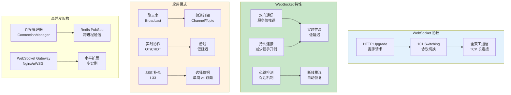

# L46: WebSocket 高级应用

> **课程编号**: L46
> **所属阶段**: Stage 4 - Web 开发进阶
> **预计时长**: 5 小时
> **难度**: ⭐⭐⭐⭐☆（高级）
> **前置课程**: L33, L37
> **版本**: v1.0
> **最后更新**: 2026-07-23
> **核心版本**: Python 3.13


---



---

## 1. WebSocket 进阶概念

### 1.1 连接管理

WebSocket 是全双工通信协议，适合实时应用：

```python
from fastapi import WebSocket, WebSocketDisconnect
from typing import Protocol

class ConnectionManager:
    """WebSocket 连接管理器"""

    def __init__(self):
        # active_connections: user_id -> WebSocket
        self.active_connections: dict[str, WebSocket] = {}

    async def connect(self, user_id: str, websocket: WebSocket):
        """接受并注册连接"""
        await websocket.accept()
        self.active_connections[user_id] = websocket

    def disconnect(self, user_id: str):
        """移除连接"""
        self.active_connections.pop(user_id, None)

    async def send_message(self, user_id: str, message: dict):
        """向指定用户发送消息"""
        if user_id in self.active_connections:
            await self.active_connections[user_id].send_json(message)

    async def broadcast(self, message: dict):
        """广播消息给所有连接"""
        disconnected = []
        for user_id, connection in self.active_connections.items():
            try:
                await connection.send_json(message)
            except Exception:
                disconnected.append(user_id)
        # 清理断开的连接
        for user_id in disconnected:
            self.disconnect(user_id)

manager = ConnectionManager()
```

### 1.2 心跳检测

保持连接活跃，检测断开的客户端：

```python
import asyncio
from datetime import datetime

class HeartbeatManager:
    """心跳管理器"""

    def __init__(self, manager: ConnectionManager, interval=30):
        self.manager = manager
        self.interval = interval
        self.last_pong: dict[str, datetime] = {}

    async def start_heartbeat(self, user_id: str, websocket: WebSocket):
        """为用户启动心跳检测"""
        while True:
            try:
                # 发送 ping
                await websocket.send_json({"type": "ping", "timestamp": datetime.utcnow().isoformat()})

                # 等待 pong
                message = await asyncio.wait_for(
                    websocket.receive_json(),
                    timeout=self.interval
                )

                if message.get("type") == "pong":
                    self.last_pong[user_id] = datetime.utcnow()

            except asyncio.TimeoutError:
                # 心跳超时，关闭连接
                self.manager.disconnect(user_id)
                break
            except WebSocketDisconnect:
                self.manager.disconnect(user_id)
                break
```

---

## 2. 消息协议设计

### 2.1 JSON 消息格式

```python
from pydantic import BaseModel, Field
from enum import Enum

class MessageType(str, Enum):
    CHAT = "chat"
    JOIN = "join"
    LEAVE = "leave"
    TYPING = "typing"
    ERROR = "error"

class WebSocketMessage(BaseModel):
    """WebSocket 消息格式"""
    type: MessageType
    payload: dict = Field(default_factory=dict)
    timestamp: str = Field(default_factory=lambda: datetime.utcnow().isoformat())
    message_id: str = Field(default_factory=lambda: uuid.uuid4().hex)

class ChatMessage(BaseModel):
    """聊天消息"""
    room_id: str
    sender_id: str
    content: str
    mentions: list[str] = Field(default_factory=list)
```

### 2.2 消息路由

```python
class MessageRouter:
    """消息路由器"""

    def __init__(self):
        self.handlers: dict[MessageType, callable] = {}

    def register(self, message_type: MessageType):
        """注册处理器"""
        def decorator(func):
            self.handlers[message_type] = func
            return func
        return decorator

    async def route(self, user_id: str, message: WebSocketMessage, manager: ConnectionManager):
        """路由消息到处理器"""
        handler = self.handlers.get(message.type)
        if handler:
            await handler(user_id, message.payload, manager)
        else:
            await manager.send_message(user_id, {
                "type": "error",
                "payload": {"message": f"Unknown message type: {message.type}"}
            })

router = MessageRouter()

@router.register(MessageType.CHAT)
async def handle_chat(user_id: str, payload: dict, manager: ConnectionManager):
    """处理聊天消息"""
    chat = ChatMessage(**payload)
    await manager.broadcast({
        "type": "chat",
        "payload": {
            "room_id": chat.room_id,
            "sender_id": chat.sender_id,
            "content": chat.content,
            "timestamp": datetime.utcnow().isoformat()
        }
    })
```

---

## 3. 频道与路由

### 3.1 房间/频道管理

```python
class RoomManager:
    """聊天室管理器"""

    def __init__(self):
        # room_id -> set(user_ids)
        self.rooms: dict[str, set[str]] = {}
        # user_id -> room_id
        self.user_rooms: dict[str, str] = {}

    async def join_room(self, user_id: str, room_id: str, manager: ConnectionManager):
        """加入房间"""
        # 离开当前房间
        if user_id in self.user_rooms:
            await self.leave_room(user_id, manager)

        # 加入新房间
        if room_id not in self.rooms:
            self.rooms[room_id] = set()
        self.rooms[room_id].add(user_id)
        self.user_rooms[user_id] = room_id

        # 通知房间内其他人
        await manager.broadcast({
            "type": "system",
            "payload": {
                "message": f"User {user_id} joined {room_id}",
                "users": list(self.rooms[room_id])
            }
        }, exclude=[user_id])

    async def leave_room(self, user_id: str, manager: ConnectionManager):
        """离开房间"""
        if user_id not in self.user_rooms:
            return

        room_id = self.user_rooms.pop(user_id)
        if room_id in self.rooms:
            self.rooms[room_id].discard(user_id)
            if not self.rooms[room_id]:
                del self.rooms[room_id]

        await manager.broadcast({
            "type": "system",
            "payload": {"message": f"User {user_id} left {room_id}"}
        }, exclude=[user_id])
```

### 3.2 Topic 订阅

```python
class TopicSubscriber:
    """主题订阅系统"""

    def __init__(self):
        # topic -> set(user_ids)
        self.subscribers: dict[str, set[str]] = {}

    def subscribe(self, user_id: str, topic: str):
        """订阅主题"""
        if topic not in self.subscribers:
            self.subscribers[topic] = set()
        self.subscribers[topic].add(user_id)

    def unsubscribe(self, user_id: str, topic: str):
        """取消订阅"""
        if topic in self.subscribers:
            self.subscribers[topic].discard(user_id)

    def get_subscribers(self, topic: str) -> set[str]:
        """获取主题订阅者"""
        return self.subscribers.get(topic, set())

    async def publish(self, topic: str, message: dict, manager: ConnectionManager):
        """发布消息到主题"""
        for user_id in self.get_subscribers(topic):
            await manager.send_message(user_id, {
                "type": "topic_message",
                "payload": {
                    "topic": topic,
                    **message
                }
            })
```

---

## 4. Redis PubSub 集成

### 4.1 分布式消息广播

```python
import redis.asyncio as aioredis
import json

class RedisPubSub:
    """Redis 发布订阅"""

    def __init__(self, redis_url="redis://localhost:6379"):
        self.redis = aioredis.from_url(redis_url, decode_responses=True)
        self.pubsub = None

    async def publish(self, channel: str, message: dict):
        """发布消息"""
        await self.redis.publish(channel, json.dumps(message))

    async def subscribe(self, channel: str):
        """订阅频道"""
        self.pubsub = self.redis.pubsub()
        await self.pubsub.subscribe(channel)

    async def listen(self, callback: callable):
        """监听消息"""
        async for message in self.pubsub.listen():
            if message["type"] == "message":
                data = json.loads(message["data"])
                await callback(data)

class WebSocketManager:
    """支持 Redis 的 WebSocket 管理器"""

    def __init__(self):
        self.local_connections: dict[str, WebSocket] = {}
        self.pubsub = RedisPubSub()

    async def broadcast_via_redis(self, channel: str, message: dict):
        """通过 Redis 广播（支持分布式）"""
        await self.pubsub.publish(channel, message)

    async def setup_redis_listener(self):
        """设置 Redis 监听器"""
        async def on_message(message: dict):
            # 收到其他实例广播的消息，转发给本地连接
            for ws in self.local_connections.values():
                try:
                    await ws.send_json(message)
                except Exception:
                    pass

        await self.pubsub.subscribe("broadcast")
        asyncio.create_task(self.pubsub.listen(on_message))
```

### 4.2 Redis Streams（事件流）

```python
class MessageStream:
    """Redis Streams 消息流"""

    def __init__(self, redis_client):
        self.redis = redis_client
        self.stream_key = "messages:stream"
        self.consumer_group = "ws-workers"

    async def append_message(self, room_id: str, message: dict):
        """追加消息到流"""
        await self.redis.xadd(
            self.stream_key,
            {
                "room_id": room_id,
                "message": json.dumps(message)
            },
            maxlen=10000  # 保留最近 10000 条
        )

    async def read_messages(self, last_id="0"):
        """读取新消息"""
        return await self.redis.xread(
            {self.stream_key: last_id},
            count=100
        )

    async def create_consumer_group(self):
        """创建消费者组（用于负载均衡）"""
        try:
            await self.redis.xgroup_create(
                self.stream_key,
                self.consumer_group,
                id="0"
            )
        except redis.ResponseError:
            pass  # 组已存在
```

---

## 5. 生产部署

### 5.1 Nginx WebSocket 代理

```nginx
server {
    location /ws {
        proxy_pass http://backend;
        proxy_http_version 1.1;
        proxy_set_header Upgrade $http_upgrade;
        proxy_set_header Connection "upgrade";
        proxy_set_header Host $host;
        proxy_set_header X-Real-IP $remote_addr;

        # 超时设置
        proxy_read_timeout 86400;
        proxy_send_timeout 86400;

        # 缓冲设置
        proxy_buffering off;
    }
}
```

### 5.2 健康检查

```python
from fastapi import FastAPI

app = FastAPI()

@app.get("/health/ws")
async def ws_health():
    """WebSocket 服务健康检查"""
    return {
        "status": "healthy",
        "connections": len(manager.active_connections),
        "rooms": len(manager.rooms),
        "timestamp": datetime.utcnow().isoformat()
    }
```

### 5.3 限流

```python
from collections import defaultdict
import time

class RateLimiter:
    """WebSocket 消息限流"""

    def __init__(self, max_messages=60, window=60):
        self.max_messages = max_messages
        self.window = window
        self.message_counts: dict[str, list[float]] = defaultdict(list)

    def is_allowed(self, user_id: str) -> bool:
        """检查是否允许发送消息"""
        now = time.time()
        # 清理过期记录
        self.message_counts[user_id] = [
            t for t in self.message_counts[user_id]
            if now - t < self.window
        ]

        if len(self.message_counts[user_id]) >= self.max_messages:
            return False

        self.message_counts[user_id].append(now)
        return True
```

---


---

## 6. 高并发 WebSocket 架构

### 6.1 连接池与资源管理

```python
"""
高并发 WebSocket 连接池设计

关键点：
1. 连接数限制（避免资源耗尽）
2. 连接超时（释放空闲连接）
3. 心跳机制（检测存活状态）
4. 分层架构（连接层 + 业务层）
"""

from fastapi import WebSocket, WebSocketDisconnect
from contextlib import asynccontextmanager
import asyncio
import time
from dataclasses import dataclass, field
from typing import Dict, Set, Optional
from collections import defaultdict


@dataclass
class ConnectionState:
    """连接状态"""
    websocket: WebSocket
    user_id: Optional[str] = None
    room_ids: Set[str] = field(default_factory=set)
    connected_at: float = field(default_factory=time.time)
    last_heartbeat: float = field(default_factory=time.time)
    message_count: int = 0


class ConnectionPool:
    """
    WebSocket 连接池
    
    特性：
    - 最大连接数限制
    - 心跳检测
    - 自动清理
    - 用户追踪
    """
    
    def __init__(
        self,
        max_connections: int = 10000,
        heartbeat_interval: int = 30,
        heartbeat_timeout: int = 90,
        cleanup_interval: int = 60,
    ):
        self.max_connections = max_connections
        self.heartbeat_interval = heartbeat_interval
        self.heartbeat_timeout = heartbeat_timeout
        self.cleanup_interval = cleanup_interval
        
        # 连接存储
        self.connections: Dict[str, ConnectionState] = {}
        self.user_connections: Dict[str, Set[str]] = defaultdict(set)
        self.room_connections: Dict[str, Set[str]] = defaultdict(set)
        
        # 信号量控制连接数
        self.semaphore = asyncio.Semaphore(max_connections)
        
        # 后台任务
        self._heartbeat_task: Optional[asyncio.Task] = None
        self._cleanup_task: Optional[asyncio.Task] = None
        self._running = False
    
    async def start(self):
        """启动连接池"""
        self._running = True
        self._heartbeat_task = asyncio.create_task(self._heartbeat_loop())
        self._cleanup_task = asyncio.create_task(self._cleanup_loop())
    
    async def stop(self):
        """停止连接池"""
        self._running = False
        
        if self._heartbeat_task:
            self._heartbeat_task.cancel()
        if self._cleanup_task:
            self._cleanup_task.cancel()
        
        # 关闭所有连接
        for conn_id, state in list(self.connections.items()):
            try:
                await state.websocket.close()
            except Exception:
                pass
        
        self.connections.clear()
    
    @asynccontextmanager
    async def acquire(self, websocket: WebSocket, connection_id: str):
        """获取连接"""
        # 检查是否满
        if len(self.connections) >= self.max_connections:
            await websocket.close(code=1013, reason="Server at capacity")
            raise ConnectionRefusedError("Max connections reached")
        
        await websocket.accept()
        
        state = ConnectionState(websocket=websocket)
        self.connections[connection_id] = state
        
        try:
            yield state
        finally:
            await self.remove(connection_id)
    
    async def remove(self, connection_id: str):
        """移除连接"""
        if connection_id not in self.connections:
            return
        
        state = self.connections[connection_id]
        
        # 从房间移除
        for room_id in state.room_ids:
            self.room_connections[room_id].discard(connection_id)
        
        # 从用户连接移除
        if state.user_id:
            self.user_connections[state.user_id].discard(connection_id)
        
        # 关闭 WebSocket
        try:
            await state.websocket.close()
        except Exception:
            pass
        
        # 移除连接
        del self.connections[connection_id]
    
    async def send_to_user(self, user_id: str, message: dict):
        """向用户的所有连接发送消息"""
        for conn_id in self.user_connections.get(user_id, set()):
            if conn_id in self.connections:
                try:
                    await self.connections[conn_id].websocket.send_json(message)
                except Exception:
                    pass
    
    async def broadcast_to_room(self, room_id: str, message: dict, exclude: str = None):
        """向房间广播消息"""
        for conn_id in list(self.room_connections.get(room_id, set())):
            if conn_id == exclude:
                continue
            if conn_id in self.connections:
                try:
                    await self.connections[conn_id].websocket.send_json(message)
                except Exception:
                    pass
    
    async def join_room(self, connection_id: str, room_id: str):
        """加入房间"""
        if connection_id not in self.connections:
            return
        
        state = self.connections[connection_id]
        
        # 如果已在其他房间，先离开
        for old_room in list(state.room_ids):
            if old_room != room_id:
                await self.leave_room(connection_id, old_room)
        
        # 加入新房间
        state.room_ids.add(room_id)
        self.room_connections[room_id].add(connection_id)
        
        # 通知加入
        await self.broadcast_to_room(
            room_id,
            {
                "type": "system",
                "action": "join",
                "connection_id": connection_id,
                "room_id": room_id,
            },
            exclude=connection_id,
        )
    
    async def leave_room(self, connection_id: str, room_id: str):
        """离开房间"""
        if connection_id not in self.connections:
            return
        
        state = self.connections[connection_id]
        state.room_ids.discard(room_id)
        self.room_connections[room_id].discard(connection_id)
        
        # 通知离开
        await self.broadcast_to_room(
            room_id,
            {
                "type": "system",
                "action": "leave",
                "connection_id": connection_id,
                "room_id": room_id,
            },
        )
    
    async def _heartbeat_loop(self):
        """心跳检测循环"""
        while self._running:
            try:
                await asyncio.sleep(self.heartbeat_interval)
                await self._check_heartbeats()
            except asyncio.CancelledError:
                break
            except Exception:
                pass
    
    async def _check_heartbeats(self):
        """检查心跳"""
        now = time.time()
        timeout = now - self.heartbeat_timeout
        
        for conn_id, state in list(self.connections.items()):
            if state.last_heartbeat < timeout:
                try:
                    await state.websocket.send_json({
                        "type": "heartbeat",
                        "timestamp": now,
                    })
                except Exception:
                    await self.remove(conn_id)
    
    async def _cleanup_loop(self):
        """清理循环"""
        while self._running:
            try:
                await asyncio.sleep(self.cleanup_interval)
                await self._cleanup_idle_connections()
            except asyncio.CancelledError:
                break
            except Exception:
                pass
    
    async def _cleanup_idle_connections(self):
        """清理空闲连接"""
        now = time.time()
        idle_timeout = 3600  # 1小时
        
        for conn_id, state in list(self.connections.items()):
            if state.last_heartbeat < now - idle_timeout:
                await self.remove(conn_id)
    
    @property
    def stats(self) -> dict:
        """连接统计"""
        return {
            "total_connections": len(self.connections),
            "max_connections": self.max_connections,
            "total_rooms": len(self.room_connections),
            "total_users": len(self.user_connections),
            "connections_by_room": {
                room_id: len(conns)
                for room_id, conns in self.room_connections.items()
            },
        }
```

### 6.2 消息队列集成

```python
"""
WebSocket + 消息队列架构

使用消息队列实现：
1. 水平扩展（多 Worker 实例）
2. 消息持久化
3. 背压控制
4. 可靠传输
"""

import asyncio
from typing import Optional
import redis.asyncio as redis
import json


class RedisMessageBroker:
    """
    Redis 消息代理
    
    架构：
    - 客户端 → WebSocket → Redis Pub/Sub → 其他 Worker
    - 消息通过 Redis 广播到所有实例
    """
    
    def __init__(self, redis_url: str = "redis://localhost:6379"):
        self.redis_url = redis_url
        self.redis: Optional[redis.Redis] = None
        self.pubsub: Optional[redis.client.PubSub] = None
    
    async def connect(self):
        """连接 Redis"""
        self.redis = redis.from_url(
            self.redis_url,
            encoding="utf-8",
            decode_responses=True,
        )
        self.pubsub = self.redis.pubsub()
    
    async def disconnect(self):
        """断开连接"""
        if self.pubsub:
            await self.pubsub.close()
        if self.redis:
            await self.redis.close()
    
    async def publish(self, channel: str, message: dict):
        """发布消息"""
        await self.redis.publish(channel, json.dumps(message))
    
    async def subscribe(self, channel: str):
        """订阅频道"""
        await self.pubsub.subscribe(channel)
    
    async def listen(self, callback):
        """监听消息"""
        async for message in self.pubsub.listen():
            if message["type"] == "message":
                data = json.loads(message["data"])
                await callback(data)


# 使用示例
class WebSocketWithQueue:
    def __init__(self, broker: RedisMessageBroker, pool: ConnectionPool):
        self.broker = broker
        self.pool = pool
    
    async def handle_message(self, connection_id: str, message: dict):
        """处理消息并发布到队列"""
        state = self.pool.connections.get(connection_id)
        if not state:
            return
        
        # 更新心跳
        state.last_heartbeat = time.time()
        state.message_count += 1
        
        # 路由消息
        msg_type = message.get("type")
        
        if msg_type == "room.join":
            await self.pool.join_room(connection_id, message["room_id"])
        
        elif msg_type == "room.leave":
            await self.pool.leave_room(connection_id, message["room_id"])
        
        elif msg_type == "room.message":
            # 广播到房间
            room_id = message["room_id"]
            await self.pool.broadcast_to_room(
                room_id,
                {
                    "type": "room.message",
                    "from": connection_id,
                    "content": message["content"],
                    "timestamp": time.time(),
                },
            )
            
            # 发布到 Redis（供其他 Worker 实例处理）
            await self.broker.publish(
                f"room:{room_id}",
                {
                    "type": "room.message",
                    "from": connection_id,
                    "from_user": state.user_id,
                    "content": message["content"],
                    "timestamp": time.time(),
                },
            )
    
    async def broadcast_from_queue(self, connection_pool: ConnectionPool):
        """从队列接收消息并广播"""
        async def handle_redis_message(data: dict):
            if data["type"] == "room.message":
                await connection_pool.broadcast_to_room(
                    data.get("room_id"),
                    data,
                )
        
        await self.broker.subscribe("room:*")
        await self.broker.listen(handle_redis_message)
```

### 6.3 分片与水平扩展

```python
"""
WebSocket 分片架构

水平扩展策略：
1. IP 哈希分片：同 IP 请求到同一 Worker
2. 用户哈希分片：同用户请求到同一 Worker
3. Redis 协调：无状态分片，通过 Redis 协调
"""

import hashlib
from fastapi import WebSocket


class ConsistentHashRouter:
    """
    一致性哈希路由器
    
    优点：
    - 负载均衡
    - 节点增减时影响最小
    - 支持权重
    """
    
    def __init(self, nodes: list[str]):
        self.nodes = nodes
        self.ring = {}
        self.sorted_keys = []
        self._build_ring()
    
    def _hash(self, key: str) -> int:
        """哈希函数"""
        return int(hashlib.md5(key.encode()).hexdigest(), 16)
    
    def _build_ring(self):
        """构建哈希环"""
        for node in self.nodes:
            for i in range(100):  # 每节点 100 个虚拟节点
                key = self._hash(f"{node}:{i}")
                self.ring[key] = node
        self.sorted_keys = sorted(self.ring.keys())
    
    def get_node(self, key: str) -> str:
        """获取节点"""
        if not self.sorted_keys:
            return self.nodes[0] if self.nodes else None
        
        hash_key = self._hash(key)
        
        for k in self.sorted_keys:
            if k > hash_key:
                return self.ring[k]
        
        return self.ring[self.sorted_keys[0]]
    
    def add_node(self, node: str):
        """添加节点"""
        self.nodes.append(node)
        self._build_ring()
    
    def remove_node(self, node: str):
        """移除节点"""
        self.nodes.remove(node)
        self._build_ring()


# Nginx WebSocket 负载均衡配置
"""
upstream websocket_backend {
    # 使用 IP 哈希实现会话保持
    ip_hash;
    
    server 127.0.0.1:8001;
    server 127.0.0.1:8002;
    server 127.0.0.1:8003;
}

server {
    location /ws {
        proxy_pass http://websocket_backend;
        
        # WebSocket 必需配置
        proxy_http_version 1.1;
        proxy_set_header Upgrade $http_upgrade;
        proxy_set_header Connection "upgrade";
        
        # 超时配置
        proxy_read_timeout 86400s;
        proxy_send_timeout 86400s;
        
        # 禁用缓冲
        proxy_buffering off;
        proxy_cache off;
    }
}
"""
```

### 6.4 性能监控与告警

```python
"""
WebSocket 性能监控

关键指标：
1. 连接数（当前、最大、历史）
2. 消息吞吐量（发送/接收）
3. 延迟分布（P50/P95/P99）
4. 错误率
5. 资源使用（内存、CPU）
"""

from prometheus_client import Counter, Gauge, Histogram
import time

# 指标定义
WS_CONNECTIONS = Gauge(
    "websocket_connections_active",
    "Active WebSocket connections",
    ["instance"],
)

WS_MESSAGES = Counter(
    "websocket_messages_total",
    "Total WebSocket messages",
    ["instance", "direction", "type"],
)

WS_LATENCY = Histogram(
    "websocket_message_latency_seconds",
    "WebSocket message processing latency",
    ["instance", "type"],
    buckets=[0.001, 0.005, 0.01, 0.05, 0.1, 0.5],
)

WS_ERRORS = Counter(
    "websocket_errors_total",
    "Total WebSocket errors",
    ["instance", "error_type"],
)


class WebSocketMetrics:
    """WebSocket 指标收集"""
    
    def __init__(self, instance_id: str):
        self.instance_id = instance_id
    
    def record_connection(self, action: str):
        """记录连接变化"""
        if action == "connect":
            WS_CONNECTIONS.labels(instance=self.instance_id).inc()
        elif action == "disconnect":
            WS_CONNECTIONS.labels(instance=self.instance_id).dec()
    
    def record_message(self, direction: str, msg_type: str):
        """记录消息"""
        WS_MESSAGES.labels(
            instance=self.instance_id,
            direction=direction,
            type=msg_type,
        ).inc()
    
    def record_latency(self, msg_type: str, latency: float):
        """记录延迟"""
        WS_LATENCY.labels(
            instance=self.instance_id,
            type=msg_type,
        ).observe(latency)
    
    def record_error(self, error_type: str):
        """记录错误"""
        WS_ERRORS.labels(
            instance=self.instance_id,
            error_type=error_type,
        ).inc()


# 告警规则示例
"""
# Prometheus 告警规则
groups:
  - name: websocket_alerts
    rules:
      - alert: WebSocketHighConnectionCount
        expr: websocket_connections_active > 8000
        for: 5m
        labels:
          severity: warning
        annotations:
          summary: "WebSocket 连接数过高"
          description: "实例 {{ $labels.instance }} 连接数 {{ $value }} 超过 8000"
      
      - alert: WebSocketHighErrorRate
        expr: rate(websocket_errors_total[5m]) / rate(websocket_messages_total[5m]) > 0.05
        for: 5m
        labels:
          severity: critical
        annotations:
          summary: "WebSocket 错误率过高"
          description: "实例 {{ $labels.instance }} 错误率 {{ $value | humanizePercentage }}"
      
      - alert: WebSocketHighLatency
        expr: histogram_quantile(0.99, rate(websocket_message_latency_seconds_bucket[5m])) > 0.5
        for: 5m
        labels:
          severity: warning
        annotations:
          summary: "WebSocket 延迟过高"
          description: "实例 {{ $labels.instance }} P99 延迟 {{ $value }}s"
"""
```

### 6.5 面试题精选

```python
"""
Q1: WebSocket 连接如何实现断线重连？

A:
1. 监听 onclose 和 onerror 事件
2. 使用指数退避算法延迟重连
3. 维护重连计数器，避免无限重连
4. 重连成功后重新订阅频道/加入房间
5. 可选：使用 Last-Event-ID 恢复未读消息
"""

"""
Q2: 如何保证 WebSocket 消息的可靠性？

A:
1. 消息确认机制：客户端收到消息后发送 ACK
2. 消息序列号：检测丢失和重复
3. 心跳检测：及时发现断线
4. 消息持久化：服务器端存储未确认消息
5. 重试机制：客户端未收到确认时重发
"""

"""
Q3: WebSocket 如何实现用户认证？

A:
1. 握手阶段：URL 参数或 Cookie 携带 Token
2. 握手后立即验证：检查 Token 有效性
3. 连接中验证：定期刷新 Token
4. 关闭无效连接：Token 过期时断开
"""

"""
Q4: WebSocket 与 SSE 如何选择？

A:
选择 WebSocket：
- 需要双向通信
- 高频数据交换
- 低延迟要求

选择 SSE：
- 仅服务端推送
- 需要自动重连
- 部署在受限网络
- 移动端兼容性好
"""

"""
Q5: 如何限制 WebSocket 连接数？

A:
1. 应用层：使用 Semaphore 限制
2. 协议层：Nginx limit_conn
3. 系统层：ulimit 文件描述符
4. 用户维度：记录每用户连接数
"""
```

### 6.6 完整项目：实时协作白板

```python
"""
实时协作白板项目

功能：
1. 多人同时编辑
2. 操作实时同步
3. 离线操作合并
4. 撤销/重做

架构：
- WebSocket 处理实时通信
- Redis Pub/Sub 广播操作
- 操作变换 (OT) 算法处理冲突
"""

from enum import Enum
from typing import List, Optional
from pydantic import BaseModel
import uuid
import json


class OperationType(str, Enum):
    """操作类型"""
    INSERT = "insert"
    DELETE = "delete"
    MOVE = "move"
    STYLE = "style"


class Operation(BaseModel):
    """操作"""
    id: str
    type: OperationType
    user_id: str
    element_id: str
    data: dict
    timestamp: float
    version: int


class WhiteboardState:
    """白板状态"""
    
    def __init__(self):
        self.elements: dict[str, dict] = {}
        self.operations: List[Operation] = []
        self.version = 0
    
    def apply(self, op: Operation) -> bool:
        """应用操作"""
        if op.version != self.version:
            return False  # 版本冲突
        
        if op.type == OperationType.INSERT:
            self.elements[op.element_id] = op.data
        elif op.type == OperationType.DELETE:
            self.elements.pop(op.element_id, None)
        elif op.type == OperationType.MOVE:
            if op.element_id in self.elements:
                self.elements[op.element_id].update(op.data)
        elif op.type == OperationType.STYLE:
            if op.element_id in self.elements:
                self.elements[op.element_id]["style"] = op.data
        
        self.operations.append(op)
        self.version += 1
        return True


class WhiteboardWebSocket:
    """白板 WebSocket 处理"""
    
    def __init__(self, pool: ConnectionPool, broker: RedisMessageBroker):
        self.pool = pool
        self.broker = broker
        self.boards: dict[str, WhiteboardState] = {}
    
    async def handle_join(self, connection_id: str, board_id: str):
        """加入白板"""
        # 初始化白板状态
        if board_id not in self.boards:
            self.boards[board_id] = WhiteboardState()
        
        board = self.boards[board_id]
        
        # 加入房间
        await self.pool.join_room(connection_id, f"board:{board_id}")
        
        # 发送当前状态
        state = self.pool.connections[connection_id]
        await state.websocket.send_json({
            "type": "sync",
            "elements": board.elements,
            "version": board.version,
        })
        
        # 广播用户加入
        await self.pool.broadcast_to_room(
            f"board:{board_id}",
            {
                "type": "user.join",
                "user_id": state.user_id,
            },
            exclude=connection_id,
        )
    
    async def handle_operation(self, connection_id: str, data: dict):
        """处理操作"""
        state = self.pool.connections[connection_id]
        
        # 从消息中提取房间 ID
        board_id = data.get("board_id")
        if not board_id:
            return
        
        # 解析操作
        op = Operation(
            id=str(uuid.uuid4()),
            type=OperationType(data["operation_type"]),
            user_id=state.user_id or connection_id,
            element_id=data["element_id"],
            data=data["data"],
            timestamp=data.get("timestamp", time.time()),
            version=data.get("version", 0),
        )
        
        # 应用操作
        board = self.boards.get(board_id)
        if not board:
            return
        
        success = board.apply(op)
        
        if success:
            # 广播操作
            await self.pool.broadcast_to_room(
                f"board:{board_id}",
                {
                    "type": "operation",
                    "operation": op.model_dump(),
                },
                exclude=connection_id,
            )
            
            # 发布到 Redis
            await self.broker.publish(
                f"board:{board_id}:ops",
                op.model_dump(),
            )
        else:
            # 发送冲突警告
            await state.websocket.send_json({
                "type": "conflict",
                "operation": op.model_dump(),
                "current_version": board.version,
            })
    
    async def handle_undo(self, connection_id: str, board_id: str):
        """处理撤销"""
        board = self.boards.get(board_id)
        if not board or not board.operations:
            return
        
        # 找到最后一个该用户的操作
        state = self.pool.connections[connection_id]
        user_id = state.user_id or connection_id
        
        for op in reversed(board.operations):
            if op.user_id == user_id:
                # 创建反向操作
                reverse_op = Operation(
                    id=str(uuid.uuid4()),
                    type=OperationType.DELETE if op.type == OperationType.INSERT else OperationType.INSERT,
                    user_id=user_id,
                    element_id=op.element_id,
                    data=op.data if op.type == OperationType.DELETE else {},
                    timestamp=time.time(),
                    version=board.version,
                )
                
                board.apply(reverse_op)
                
                # 广播
                await self.pool.broadcast_to_room(
                    f"board:{board_id}",
                    {"type": "operation", "operation": reverse_op.model_dump()},
                )
                break
```


---

## 🔗 下一步


[Stage 5: 数据工程](../../../stage5-data-engineering/)
