# P05: 实时协作 SaaS 平台 - 详细课程

> **课程编号**: P05
> **所属阶段**: Stage 4 - Web 开发进阶
> **预计时长**: 8-12 小时
> **难度**: ⭐⭐⭐⭐⭐（专家级）
> **前置课程**: L36-L46（全部 Stage 4 课程）
> **版本**: v1.0
> **核心版本**: Python 3.13

---

## 📚 项目概述

### TaskCollab - 实时任务协作平台

本项目整合 Stage 4 所有知识点，构建一个完整的实时协作 SaaS 平台：

```mermaid
flowchart TB
    subgraph Frontend["前端层"]
        A[HTMX/Jinja2] --> B[WebSocket 客户端]
        B --> C[实时更新]
    end

    subgraph API["API 层"]
        D[FastAPI] --> E[JWT 认证]
        E --> F[RBAC 权限]
        F --> G[Pydantic 验证]
    end

    subgraph RealTime["实时层"]
        H[WebSocket Server] --> I[Redis PubSub]
        I --> J[多实例广播]
    end

    subgraph Task["任务处理"]
        K[Celery Worker] --> L[异步任务]
        L --> M[邮件通知]
        L --> N[WebSocket 推送]
    end

    subgraph Data["数据层"]
        O[PostgreSQL] --> P[Redis 缓存]
        O --> Q[SQLAlchemy 2.0]
    end

    subgraph Security["安全层"]
        R[Rate Limiting] --> S[安全头]
        S --> T[CSP/XSS 防护]
    end

    style Frontend fill:#e3f2fd
    style API fill:#c8e6c9
    style RealTime fill:#fff3e0
    style Task fill:#f3e5f5
```



---

## 📋 目录

- [第一章：项目架构](#第一章项目架构)
- [第二章：认证与授权](#第二章认证与授权)
- [第三章：WebSocket 实时通信](#第三章websocket-实时通信)
- [第四章：Redis 缓存与性能](#第四章redis-缓存与性能)
- [第五章：Celery 异步任务](#第五章celery-异步任务)
- [第六章：微服务架构](#第六章微服务架构)
- [第七章：测试与部署](#第七章测试与部署)

---

## 第一章：项目架构

### 1.1 整体架构设计

**技术栈**：

| 组件 | 技术 | 课程来源 |
|------|------|----------|
| Web 框架 | FastAPI | L27 |
| 数据库 | PostgreSQL + SQLAlchemy 2.0 | L29-L30 |
| 实时通信 | WebSocket + Redis PubSub | L40, L46 |
| 缓存 | Redis | L42 |
| 任务队列 | Celery + Redis | L43 |
| 认证 | JWT + RBAC | L38 |
| 安全 | OWASP Top 10 | L37 |
| 测试 | Pytest + Playwright | L19, L39 |
| 部署 | Docker + Docker Compose | L31 |

### 1.2 项目结构

```
P05-realtime-collaboration/
├── app/
│   ├── __init__.py
│   ├── main.py              # FastAPI 应用入口
│   ├── config.py            # 配置管理
│   ├── dependencies.py      # 依赖注入
│   ├── models/              # SQLAlchemy 模型
│   │   ├── user.py
│   │   ├── task.py
│   │   └── team.py
│   ├── schemas/             # Pydantic schemas
│   │   ├── auth.py
│   │   ├── task.py
│   │   └── websocket.py
│   ├── api/                 # API 路由
│   │   ├── auth.py
│   │   ├── tasks.py
│   │   └── websocket.py
│   ├── services/            # 业务逻辑
│   │   ├── auth.py
│   │   ├── task.py
│   │   └── notification.py
│   ├── core/                # 核心模块
│   │   ├── security.py      # 安全工具
│   │   ├── websocket.py     # WebSocket 管理
│   │   └── redis.py         # Redis 客户端
│   └── celery_app/          # Celery 配置
│       ├── __init__.py
│       └── tasks.py
├── tests/
│   ├── conftest.py
│   ├── test_auth.py
│   ├── test_tasks.py
│   └── test_websocket.py
├── docker-compose.yml
├── Dockerfile
└── pyproject.toml
```

### 1.3 核心模块整合

| 模块 | 整合的知识点 |
|------|--------------|
| 认证 (auth.py) | JWT、bcrypt、RBAC |
| 任务 (tasks.py) | CRUD、Redis 缓存、权限检查 |
| WebSocket | 连接管理、心跳、Redis PubSub |
| Celery 任务 | 异步处理、邮件通知 |
| 安全中间件 | Rate Limiting、安全头 |

---

## 第二章：认证与授权

### 2.1 JWT 认证实现

参考 L38 的 JWT 实现：

```python
# app/core/security.py
from datetime import datetime, timedelta
from jose import JWTError, jwt
from passlib.context import CryptContext

pwd_context = CryptContext(schemes=["bcrypt"], deprecated="auto")

ALGORITHM = "HS256"
ACCESS_TOKEN_EXPIRE_MINUTES = 30

def create_access_token(data: dict) -> str:
    to_encode = data.copy()
    expire = datetime.utcnow() + timedelta(minutes=ACCESS_TOKEN_EXPIRE_MINUTES)
    to_encode.update({"exp": expire})
    return jwt.encode(to_encode, SECRET_KEY, algorithm=ALGORITHM)

def verify_password(plain_password: str, hashed_password: str) -> bool:
    return pwd_context.verify(plain_password, hashed_password)

def get_password_hash(password: str) -> str:
    return pwd_context.hash(password)
```

### 2.2 RBAC 权限模型

```python
# app/schemas/auth.py
from enum import Enum
from pydantic import BaseModel

class UserRole(str, Enum):
    ADMIN = "admin"
    MANAGER = "manager"
    MEMBER = "member"
    VIEWER = "viewer"

class UserBase(BaseModel):
    email: str
    username: str

class User(UserBase):
    id: int
    role: UserRole
    team_id: int | None = None

    class Config:
        from_attributes = True

class TokenPayload(BaseModel):
    sub: int  # user_id
    role: UserRole
    exp: datetime
```

### 2.3 依赖注入认证

```python
# app/dependencies.py
from fastapi import Depends, HTTPException, status
from fastapi.security import HTTPBearer, HTTPAuthorizationCredentials
from sqlalchemy.ext.asyncio import AsyncSession

security = HTTPBearer()

async def get_current_user(
    credentials: HTTPAuthorizationCredentials = Depends(security),
    db: AsyncSession = Depends(get_db),
) -> User:
    try:
        payload = jwt.decode(
            credentials.credentials,
            SECRET_KEY,
            algorithms=[ALGORITHM]
        )
        user_id: int = payload.get("sub")
        if user_id is None:
            raise HTTPException(status_code=401)
    except JWTError:
        raise HTTPException(status_code=401)

    user = await db.get(User, user_id)
    if user is None:
        raise HTTPException(status_code=401)
    return user

def require_role(required_role: UserRole):
    async def role_checker(current_user: User = Depends(get_current_user)):
        if current_user.role != required_role and current_user.role != UserRole.ADMIN:
            raise HTTPException(status_code=403)
        return current_user
    return role_checker
```

---

## 第三章：WebSocket 实时通信

### 3.1 WebSocket 连接管理

参考 L46 的 ConnectionManager：

```python
# app/core/websocket.py
from fastapi import WebSocket
from typing import Dict, Set
import asyncio
import json

class ConnectionManager:
    def __init__(self):
        # user_id -> WebSocket
        self.active_connections: Dict[int, WebSocket] = {}
        # task_id -> set(user_ids)
        self.task_subscriptions: Dict[int, Set[int]] = {}

    async def connect(self, user_id: int, websocket: WebSocket):
        await websocket.accept()
        self.active_connections[user_id] = websocket

    def disconnect(self, user_id: int):
        self.active_connections.pop(user_id, None)
        # 取消所有订阅
        for task_id in list(self.task_subscriptions):
            self.task_subscriptions[task_id].discard(user_id)

    async def send_to_user(self, user_id: int, message: dict):
        if user_id in self.active_connections:
            await self.active_connections[user_id].send_json(message)

    async def broadcast_to_task(self, task_id: int, message: dict):
        if task_id in self.task_subscriptions:
            disconnected = []
            for user_id in self.task_subscriptions[task_id]:
                try:
                    await self.send_to_user(user_id, message)
                except Exception:
                    disconnected.append(user_id)
            # 清理断开的连接
            for user_id in disconnected:
                self.task_subscriptions[task_id].discard(user_id)

manager = ConnectionManager()
```

### 3.2 Redis PubSub 跨实例通信

```python
# app/core/redis.py
import redis.asyncio as redis
from typing import Callable

class RedisPubSub:
    def __init__(self):
        self.redis = redis.from_url(REDIS_URL)
        self.pubsub = self.redis.pubsub()

    async def publish(self, channel: str, message: dict):
        await self.redis.publish(channel, json.dumps(message))

    async def subscribe(self, channel: str, handler: Callable):
        await self.pubsub.subscribe(channel)
        async for message in self.pubsub.listen():
            if message["type"] == "message":
                data = json.loads(message["data"])
                await handler(data)

# WebSocket 消息广播
async def broadcast_task_update(task_id: int, event: dict):
    channel = f"task:{task_id}"
    await redis_pubsub.publish(channel, {
        "type": "task_update",
        "task_id": task_id,
        "event": event
    })
```

### 3.3 心跳检测

```python
# app/api/websocket.py
from fastapi import APIRouter, WebSocket, WebSocketDisconnect
import asyncio

router = APIRouter()

@router.websocket("/ws/{user_id}")
async def websocket_endpoint(websocket: WebSocket, user_id: int):
    await manager.connect(user_id, websocket)

    # 启动心跳任务
    async def heartbeat():
        while True:
            try:
                await asyncio.sleep(30)
                await websocket.send_json({"type": "ping"})
            except Exception:
                break

    heartbeat_task = asyncio.create_task(heartbeat())

    try:
        while True:
            data = await websocket.receive_json()
            if data.get("type") == "pong":
                continue  # 心跳响应
            # 处理其他消息
            await handle_websocket_message(user_id, data)
    except WebSocketDisconnect:
        manager.disconnect(user_id)
    finally:
        heartbeat_task.cancel()
```

---

## 第四章：Redis 缓存与性能

### 4.1 多级缓存策略

```python
# app/services/cache.py
from functools import lru_cache
import redis.asyncio as redis

redis_client = redis.from_url(REDIS_URL)

# L1: 本地缓存 (LRU)
@lru_cache(maxsize=1000)
def get_user_permissions_cached(user_id: int) -> list[str]:
    return []  # 从数据库加载

# L2: Redis 缓存
async def get_task_cached(task_id: int) -> Task | None:
    cache_key = f"task:{task_id}"

    # 先查 Redis
    cached = await redis_client.get(cache_key)
    if cached:
        return Task.model_validate_json(cached)

    # 缓存未命中，查数据库
    task = await db.get(Task, task_id)
    if task:
        # 写入 Redis，TTL=5分钟
        await redis_client.setex(
            cache_key,
            300,
            task.model_dump_json()
        )
    return task

# 缓存失效
async def invalidate_task_cache(task_id: int):
    await redis_client.delete(f"task:{task_id}")
```

### 4.2 Rate Limiting

```python
# app/core/security.py
from fastapi import Request, HTTPException
import time

class RateLimiter:
    def __init__(self, max_requests: int, window_seconds: int):
        self.max_requests = max_requests
        self.window = window_seconds
        self.requests: dict[str, list[float]] = {}

    async def check(self, request: Request, identifier: str = None) -> bool:
        key = identifier or request.client.host
        now = time.time()

        if key not in self.requests:
            self.requests[key] = []

        # 清理过期的请求记录
        self.requests[key] = [
            t for t in self.requests[key]
            if now - t < self.window
        ]

        if len(self.requests[key]) >= self.max_requests:
            return False

        self.requests[key].append(now)
        return True

rate_limiter = RateLimiter(max_requests=100, window_seconds=60)

async def rate_limit_dependency(request: Request):
    if not await rate_limiter.check(request):
        raise HTTPException(status_code=429, detail="Too Many Requests")
```

---

## 第五章：Celery 异步任务

### 5.1 Celery 配置

```python
# app/celery_app/__init__.py
from celery import Celery

celery_app = Celery(
    "taskcollab",
    broker=REDIS_URL,
    backend=REDIS_URL,
    include=["app.celery_app.tasks"]
)

celery_app.conf.update(
    task_serializer="json",
    accept_content=["json"],
    result_serializer="json",
    timezone="UTC",
    enable_utc=True,
    task_track_started=True,
    task_time_limit=300,  # 5 分钟超时
    worker_prefetch_multiplier=4,
)
```

### 5.2 任务定义

```python
# app/celery_app/tasks.py
from app.celery_app import celery_app
from app.core.websocket import manager

@celery_app.task
def send_task_notification(task_id: int, user_ids: list[int], message: str):
    """发送任务通知"""
    for user_id in user_ids:
        # 通过 Redis PubSub 广播
        import asyncio
        asyncio.run(manager.send_to_user(user_id, {
            "type": "notification",
            "task_id": task_id,
            "message": message
        }))

@celery_app.task
def send_email_task(email: str, subject: str, body: str):
    """发送邮件通知"""
    # 实际实现中使用 aiosmtplib
    print(f"Sending email to {email}: {subject}")
    return {"status": "sent", "to": email}

@celery_app.task(bind=True, max_retries=3)
def process_task_assignment(self, task_id: int, user_id: int):
    """处理任务分配"""
    try:
        # 1. 更新数据库
        update_task_assignment(task_id, user_id)
        # 2. 发送通知
        send_task_notification.delay(task_id, [user_id], "新任务已分配给你")
        return {"status": "success", "task_id": task_id}
    except Exception as exc:
        # 指数退避重试
        raise self.retry(exc=exc, countdown=2 ** self.request.retries)
```

---

## 第六章：微服务架构

### 6.1 服务拆分模式

```
┌─────────────────────────────────────────────────────────┐
│                    TaskCollab 架构                       │
├─────────────────────────────────────────────────────────┤
│                                                         │
│  ┌──────────┐  ┌──────────┐  ┌──────────┐           │
│  │ Auth     │  │ Task     │  │ Notify   │           │
│  │ Service  │  │ Service  │  │ Service  │           │
│  └────┬─────┘  └────┬─────┘  └────┬─────┘           │
│       │              │              │                   │
│       └──────────────┴──────────────┘                   │
│                      │                                  │
│              ┌────────▼────────┐                        │
│              │   API Gateway  │                        │
│              │  (统一入口)     │                        │
│              └────────────────┘                        │
│                                                         │
└─────────────────────────────────────────────────────────┘
```

### 6.2 服务发现与配置

```python
# app/config.py
from pydantic_settings import BaseSettings

class Settings(BaseSettings):
    # 数据库
    DATABASE_URL: str

    # Redis
    REDIS_URL: str

    # JWT
    SECRET_KEY: str
    ALGORITHM: str = "HS256"

    # Rate Limiting
    RATE_LIMIT_REQUESTS: int = 100
    RATE_LIMIT_WINDOW: int = 60

    # Celery
    CELERY_BROKER_URL: str
    CELERY_RESULT_BACKEND: str

    class Config:
        env_file = ".env"
        case_sensitive = True

settings = Settings()
```

---

## 第七章：测试与部署

### 7.1 单元测试

```python
# tests/test_auth.py
import pytest
from httpx import AsyncClient
from app.main import app

@pytest.mark.asyncio
async def test_login_success():
    async with AsyncClient(app=app, base_url="http://test") as client:
        response = await client.post(
            "/api/auth/login",
            json={"email": "test@example.com", "password": "testpass"}
        )
        assert response.status_code == 200
        assert "access_token" in response.json()

@pytest.mark.asyncio
async def test_login_invalid_credentials():
    async with AsyncClient(app=app, base_url="http://test") as client:
        response = await client.post(
            "/api/auth/login",
            json={"email": "test@example.com", "password": "wrong"}
        )
        assert response.status_code == 401
```

### 7.2 WebSocket 测试

```python
# tests/test_websocket.py
import pytest
from fastapi.testclient import TestClient
from app.main import app

def test_websocket_connect():
    client = TestClient(app)
    with client.websocket_connect("/ws/1") as websocket:
        data = websocket.receive_json()
        assert data["type"] == "connected"

def test_websocket_task_subscription():
    client = TestClient(app)
    with client.websocket_connect("/ws/1") as websocket:
        # 订阅任务
        websocket.send_json({
            "type": "subscribe",
            "task_id": 123
        })
        response = websocket.receive_json()
        assert response["type"] == "subscribed"
```

### 7.3 Docker Compose 部署

```yaml
# docker-compose.yml
version: '3.8'

services:
  api:
    build: .
    ports:
      - "8000:8000"
    environment:
      - DATABASE_URL=postgresql+asyncpg://user:pass@db:5432/taskcollab
      - REDIS_URL=redis://redis:6379
    depends_on:
      - db
      - redis
    volumes:
      - ./app:/app

  celery_worker:
    build: .
    command: celery -A app.celery_app worker --loglevel=info
    environment:
      - DATABASE_URL=postgresql+asyncpg://user:pass@db:5432/taskcollab
      - REDIS_URL=redis://redis:6379
    depends_on:
      - db
      - redis

  db:
    image: postgres:15
    environment:
      POSTGRES_USER: user
      POSTGRES_PASSWORD: pass
      POSTGRES_DB: taskcollab

  redis:
    image: redis:7-alpine
```

---

## 📝 本章总结

### 整合知识点回顾

| 课程 | 知识点 | 本项目应用 |
|------|--------|------------|
| L36 | 异步背压 | Rate Limiting 限流 |
| L37 | Web 安全 | 安全头、CSP 防护 |
| L38 | 认证授权 | JWT + RBAC |
| L39 | E2E 测试 | Playwright 测试 |
| L40 | 消息队列 | Redis PubSub |
| L41 | API 性能 | Profiling、缓存 |
| L42 | 缓存策略 | Redis 多级缓存 |
| L43 | 异步任务 | Celery 后台任务 |
| L44 | 微服务 | 服务拆分模式 |
| L45 | 分布式 | 一致性方案 |
| L46 | WebSocket | 实时通信 |

### 关键要点

1. **认证授权是基础** — JWT + RBAC 保护所有 API
2. **WebSocket 实时通信** — ConnectionManager + Redis PubSub
3. **缓存提升性能** — L1 本地缓存 + L2 Redis 缓存
4. **Celery 处理异步任务** — 邮件通知、后台处理
5. **微服务架构雏形** — 服务拆分、独立部署

### 学习收获

完成本项目后，你已经：
- ✅ 整合 Stage 4 所有知识点
- ✅ 构建完整的实时协作平台
- ✅ 实现生产级 Web 应用架构
- ✅ 为 Stage 5-6 打下坚实基础

---

## 🔗 下一步

恭喜完成 Stage 4！继续学习：

- [Stage 5: 数据工程](../L47-pandas-numpy/) - Pandas、NumPy、数据处理
- [Stage 6: AI Agent 开发](../L54-ai-agent/) - LangChain、MCP、Agent 开发
