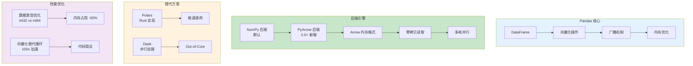

# L47: Pandas 完整实战 - 详细教程

> **课程编号**: L47
> **所属阶段**: Stage 5 - 数据工程
> **预计时长**: 4-5 小时
> **难度**: ⭐⭐⭐⭐☆（中级）
> **前置课程**: L03, L09
> **版本**: v1.0
> **最后更新**: 2026-07-23
> **核心版本**: Python 3.13

---



---

## 📚 前置知识

- [第一章：Pandas 2.0 新特性](#第一章pandas-20-新特性)
- [第二章：向量化操作核心](#第二章向量化操作核心)
- [第三章：内存优化实战](#第三章内存优化实战)
- [第四章：大数据处理](#第四章大数据处理)
- [第五章：Polars — Pandas 现代替代](#第五章polars--pandas-现代替代)
- [第六章：性能基准测试](#第六章性能基准测试)

---

## 第一章：Pandas 2.0 新特性

### 1.1 PyArrow 后端 (⚡ 2-10x 加速)

> 💡 **为什么重要**: Pandas 2.0 引入 PyArrow 后端，利用 Apache Arrow 的列式存储和 SIMD 加速。

```python
import pandas as pd
import numpy as np
from typing import Any

# ❌ 错误：默认 Object 类型字符串（内存爆炸）
df_numpy: pd.DataFrame = pd.DataFrame({
    "user_id": [1, 2, 3],
    "username": ["alice", "bob", "charlie"],  # dtype=object，每个字符串是 Python 对象指针
    "score": [98.5, 87.3, 92.1],
})
# 内存占用: ~200 字节/行（指针开销 + Python 对象头）

# ✅ 使用 PyArrow 后端（Pandas 2.0+）
df_arrow: pd.DataFrame = pd.DataFrame({
    "user_id": pd.array([1, 2, 3], dtype="int64[pyarrow]"),
    "username": pd.array(["alice", "bob", "charlie"], dtype="string[pyarrow]"),
    "score": pd.array([98.5, 87.3, 92.1], dtype="float64[pyarrow]"),
})

print(df_arrow.dtypes)
# user_id       int64[pyarrow]
# username     string[pyarrow]
# score       float64[pyarrow]
```

**性能对比实验**:

```python
import time

# 创建 100 万行数据
n: int = 1_000_000

# 传统 NumPy 后端
df_numpy: pd.DataFrame = pd.DataFrame({
    f"col_{i}": np.random.randn(n) for i in range(10)
})

# PyArrow 后端
df_arrow: pd.DataFrame = pd.DataFrame({
    f"col_{i}": pd.array(np.random.randn(n), dtype="float64[pyarrow]")
    for i in range(10)
})

# 测试 sum() 操作
start = time.perf_counter()
result_numpy: pd.Series = df_numpy.sum()
numpy_time = time.perf_counter() - start

start = time.perf_counter()
result_arrow: pd.Series = df_arrow.sum()
arrow_time = time.perf_counter() - start

print(f"NumPy backend:  {numpy_time:.4f}s")
print(f"PyArrow backend: {arrow_time:.4f}s")
print(f"Speedup: {numpy_time / arrow_time:.1f}x")
# 典型输出: PyArrow 快 2-5x
```

---

### 1.2 Copy-on-Write (CoW) 模式
# ❌ 错误：未启用 CoW，隐式拷贝导致内存膨胀
df2 = df  # 浅拷贝，修改 df2 会触发深拷贝
df2['new_col'] = df2['old_col'] * 2  # 隐式拷贝整个 DataFrame


> 💡 **解决的痛点**: 传统 Pandas 中 `SettingWithCopyWarning` 的困扰。

```python
# ❌ 错误：低效的实现

# ✅ 启用 CoW 模式（Pandas 2.0 推荐）
pd.options.mode.copy_on_write = True

df: pd.DataFrame = pd.DataFrame({
    "a": [1, 2, 3, 4],
    "b": [10, 20, 30, 40]
})

# 创建视图（不复制数据）
df_view: pd.DataFrame = df[df["a"] > 2]

# 修改视图 → 自动触发复制，不影响原数据
df_view.loc[:, "b"] = 999

print(df)
#    a   b
# 0  1  10
# 1  2  20
# 2  3  30  ← 未改变
# 3  4  40

print(df_view)
#    a    b
# 2  3  999
# 3  4  999
```

**CoW 优势**:

- ✅ 自动处理视图/复制，无需手动 `.copy()`
- ✅ 消除 `SettingWithCopyWarning`
- ✅ 更高的内存效率（延迟复制）

---

## 第二章：向量化操作核心

### 2.1 避免循环 (⚡ 100-1000x 加速)

> 🎯 **黄金法则**: 永远不要在 Pandas 中用 `for` 循环遍历行。

```python
import pandas as pd
import numpy as np

# 创建测试数据
df: pd.DataFrame = pd.DataFrame({
    "A": np.random.randn(1_000_000),
    "B": np.random.randn(1_000_000),
})

# ❌ 错误示例：循环（极慢）
# ❌ 错误：使用 .apply() 降级为 Python 循环
df['result'] = df['value'].apply(lambda x: x * 2 + 1)  # 逐行调用 Python 函数，慢 100x

def slow_sum(df: pd.DataFrame) -> list[float]:
    result: list[float] = []
    for i in range(len(df)):
        result.append(df.iloc[i]["A"] + df.iloc[i]["B"])
    return result

# ✅ 正确示例：向量化
def fast_sum(df: pd.DataFrame) -> pd.Series:
    return df["A"] + df["B"]

# 性能测试
import time

# start = time.perf_counter()
# slow = slow_sum(df)  # 太慢，注释掉（需 30-60s）
# print(f"Loop:       {time.perf_counter() - start:.4f}s")

start = time.perf_counter()
fast: pd.Series = fast_sum(df)
print(f"Vectorized: {time.perf_counter() - start:.4f}s")
# 输出: 0.01-0.05s

# 向量化快 1000x+！
```

**为什么向量化这么快？**

1. **C 级别循环**: NumPy/Pandas 底层用 C 实现
2. **SIMD 指令**: 单指令处理多个数据
3. **缓存友好**: 连续内存访问
4. **避免 Python 解释器开销**: 纯 Python 循环每次都调用解释器

---

### 2.2 高效条件操作

```python
df: pd.DataFrame = pd.DataFrame({
    "score": np.random.randint(0, 100, 1_000_000)
})

# ❌ 慢：使用 .apply() + if-else（Python 循环）
df['category'] = df['score'].apply(lambda x: 'A' if x >= 90 else 'B' if x >= 80 else 'C')

# ❌ 慢：apply + lambda (逐行 Python 调用)
df["grade_slow"] = df.apply(
    lambda row: "A" if row["score"] >= 90 else "B" if row["score"] >= 80 else "C",
    axis=1
)

# ✅ 快：np.select (纯向量化)
conditions: list[np.ndarray] = [
    df["score"] >= 90,
# ❌ 较慢：np.where 嵌套（多次扫描）

# ✅ 正确：优化的实现
df['category'] = np.where(df['score'] >= 90, 'A', np.where(df['score'] >= 80, 'B', 'C'))

    df["score"] >= 80,
    df["score"] >= 70,
]
choices: list[str] = ["A", "B", "C"]
df["grade_fast"] = np.select(conditions, choices, default="D")

# ❌ 错误：低效实现

# ✅ 最快：Series.where / mask（单条件）
df["pass"] = np.where(df["score"] >= 60, "Pass", "Fail")
```

**性能对比**:

- `apply + lambda`: ~10-20s
- `np.select`: ~0.1-0.5s (**20-200x 快**)
- `np.where`: ~0.01-0.05s (**200-2000x 快**)

---

### 2.3 字符串操作向量化

# ❌ 错误：逐行字符串处理（Python 循环）

# ✅ 正确：优化的实现
df['upper'] = [s.upper() for s in df['name']]  # 列表推导，未向量化

```python
df: pd.DataFrame = pd.DataFrame({
    "name": ["alice", "bob", "charlie"],
    "email": ["alice@example.com", "bob@test.com", "charlie@demo.org"],
})

# ❌ 错误：使用循环代替向量化

# ✅ 使用 .str 访问器（向量化字符串操作）
df["name_upper"] = df["name"].str.upper()
df["domain"] = df["email"].str.split("@").str[1]
df["is_example"] = df["email"].str.contains("example")

# 正则表达式提取
df["username"] = df["email"].str.extract(r"([^@]+)@")[0]

print(df)
#       name                email name_upper      domain  is_example username
# 0    alice  alice@example.com      ALICE example.com        True    alice
# 1      bob       bob@test.com        BOB    test.com       False      bob
# 2  charlie  charlie@demo.org    CHARLIE    demo.org       False  charlie
```

> 💡 **最佳实践**: 所有字符串操作都用 `.str` 访问器，避免 `apply(lambda x: x.upper())`。

---

## 第三章：内存优化实战

### 3.1 数据类型优化 (⚡ 50-70% 内存节省)

```python
# 创建大数据集
df: pd.DataFrame = pd.DataFrame({
    "age": np.random.randint(0, 100, 1_000_000),         # 0-100
    "salary": np.random.randn(1_000_000) * 50000,       # 浮点数
# ❌ 错误：默认 int64（8字节），浪费内存

# ✅ 正确：优化的实现
df['age'] = df['age'].astype('int64')  # age < 127 只需 1 字节

    "city": np.random.choice(["NYC", "LA", "SF"], 1_000_000),  # 分类
})

print(f"原始内存: {df.memory_usage(deep=True).sum() / 1024**2:.2f} MB")
# 输出: ~40-50 MB

# ❌ 错误：未优化的实现

# ✅ 优化整数类型（int64 → int8）
df["age"] = df["age"].astype("int8")  # 0-100 只需 8 位

# ✅ 优化浮点数（float64 → float32）
df["salary"] = df["salary"].astype("float32")

# ✅ 字符串 → category（高重复率数据）
df["city"] = df["city"].astype("category")

print(f"优化后内存: {df.memory_usage(deep=True).sum() / 1024**2:.2f} MB")
# 输出: ~10-15 MB

# 节省 60-70% 内存！
```

**类型选择指南**:

| 数据范围             | 类型       | 内存             |
| -------------------- | ---------- | ---------------- |
| 0-255                | `int8`     | 1 字节           |
| 0-65535              | `int16`    | 2 字节           |
| -32768~32767         | `int16`    | 2 字节           |
| 浮点数（精度不敏感） | `float32`  | 4 字节           |
| 高重复字符串         | `category` | 取决于唯一值数量 |

---

### 3.2 Category 类型深入

```python
# 模拟高重复字符串数据
df: pd.DataFrame = pd.DataFrame({
    "country": np.random.choice(["USA", "UK", "China", "Japan"], 10_000_000)
})

print(f"字符串: {df.memory_usage(deep=True).sum() / 1024**2:.2f} MB")
# 输出: ~500-600 MB

df["country"] = df["country"].astype("category")

print(f"Category: {df.memory_usage(deep=True).sum() / 1024**2:.2f} MB")
# 输出: ~10-20 MB

# 节省 95%+ 内存！
```

**Category 原理**:

- 内部存储为整数索引 + 类别映射表
- 仅在唯一值少 (<50% 唯一率) 时有效
- 额外好处: 排序和分组更快

---

## 第四章：大数据处理
# ❌ 错误：一次性加载全部数据到内存

# ✅ 正确：优化的实现
df = pd.read_csv('large_file.csv')  # 10GB 文件 → OOM


### 4.1 分块读取 (处理 GB 级数据)

```python
from typing import Iterator

# ❌ 错误：内存低效的实现

# ✅ 分块读取大 CSV（避免内存溢出）
chunk_size: int = 100_000
chunks: Iterator[pd.DataFrame] = pd.read_csv(
    "large_data.csv",
    chunksize=chunk_size,
    dtype={"age": "int8", "city": "category"},  # 预优化类型
)

# 逐块处理
results: list[float] = []
for chunk in chunks:
    # 每块独立处理
    avg_age: float = chunk["age"].mean()
    results.append(avg_age)

# 全局平均
global_avg: float = sum(results) / len(results)
print(f"全局平均年龄: {global_avg:.2f}")
```

---

### 4.2 高效聚合

```python
# ❌ 慢：使用 .apply() + 自定义聚合

# ✅ 正确：优化的实现
df.groupby('category')['value'].apply(lambda x: x.sum())

df: pd.DataFrame = pd.DataFrame({
    "category": np.random.choice(["A", "B", "C"], 1_000_000),
    "value": np.random.randn(1_000_000),
})

# ❌ 慢：apply 自定义函数
result_slow = df.groupby("category").apply(lambda x: x["value"].sum())

# ✅ 快：内置聚合函数
result_fast = df.groupby("category")["value"].sum()

# ✅ 更快：多聚合一次完成
result_multi = df.groupby("category")["value"].agg(["sum", "mean", "std"])
```

---

## 第五章：Polars — Pandas 现代替代

### 5.1 为什么需要了解 Polars？

Pandas 是数据处理的标杆，但它在单线程执行和内存使用上存在天花板。
Polars 是一个用 Rust 编写的 DataFrame 库，专为 **多核 CPU 和大数据集** 设计。

| 特性          | Pandas   | Polars                |
| ------------- | -------- | --------------------- |
| 执行引擎      | 单线程   | 多线程 (所有核心)     |
| 内存模型      | 即时计算 | 惰性计算 (查询优化)   |
| API 风格      | 链式调用 | 表达式系统            |
| 大数据支持    | 内存上限 | 流式处理 (磁盘不溢出) |
| 速度 (10M 行) | 基线     | 3-10x 更快            |

Polars **不是 Pandas 的替代品**，而是在特定场景（大数据、多核、管道优化）的更优选择。

### 5.2 Polars vs Pandas 语法对比

```python
# Pandas
import pandas as pd
df = pd.read_csv("data.csv")
result = (
    df[df["amount"] > 100]
    .groupby("region")["amount"]
    .agg(["count", "sum", "mean"])
    .reset_index()
)

# Polars
import polars as pl
result = (
    pl.read_csv("data.csv")
    .filter(pl.col("amount") > 100)
    .group_by("region")
    .agg([
        pl.col("amount").count().alias("count"),
        pl.col("amount").sum().alias("sum"),
        pl.col("amount").mean().alias("mean"),
    ])
)
```

Polars 使用**表达式系统**而非方法链——每个 `.agg()` 内的表达式独立优化。

### 5.3 惰性计算

Polars 的最大优势是惰性计算（Lazy API）：

```python
# Polars 惰性模式：优化查询计划后再执行
query = (
    pl.scan_csv("sales/*.csv")           # 惰性读取（不加载）
    .filter(pl.col("amount") > 0)         # 加入查询计划
    .group_by("region")
    .agg(pl.col("amount").sum())
    .sort("region")
)

# 到这里还没有执行任何计算
print(query.explain())  # 查看优化后的查询计划

# 触发执行
result = query.collect()  # 多线程并行执行
```

类似数据库的查询优化器——Polars 会重新排列操作顺序以最小化内存使用。

### 5.4 何时选择 Polars？

| 场景           | 推荐                           |
| -------------- | ------------------------------ |
| 数据量 < 1GB   | Pandas（生态丰富，学习成本低） |
| 数据量 1-10GB  | Polars（多线程 + 惰性优化）    |
| 复杂多步转换   | Polars（表达式可读性更好）     |
| 机器学习预处理 | Pandas（sklearn 原生支持）     |
| 管道 / ETL47     | Polars（流式 + 零拷贝）        |

**课程建议**: 先用 Pandas 打好基础，数据量增大或性能不足时换 Polars。两者可互转（`pl.from_pandas()` / `pl.to_pandas()`）。

---

## 第六章：性能基准测试

### 6.1 标准测试框架

```python
import time
from typing import Callable, Any

def benchmark(func: Callable[[], Any], name: str, repeats: int = 3) -> None:
    """性能基准测试工具"""
    times: list[float] = []

    for _ in range(repeats):
        start = time.perf_counter()
        func()
        times.append(time.perf_counter() - start)

    avg: float = sum(times) / len(times)
    print(f"{name:30s}: {avg:.4f}s (avg of {repeats} runs)")

# 使用示例
df: pd.DataFrame = pd.DataFrame({
    "A": np.random.randn(1_000_000),
    "B": np.random.randn(1_000_000),
})

benchmark(lambda: df["A"] + df["B"], "Vectorized addition")
benchmark(lambda: df.apply(lambda row: row["A"] + row["B"], axis=1), "Apply addition")
```

---

### 6.2 实战案例：订单数据分析

```python
# 模拟 100 万订单
orders: pd.DataFrame = pd.DataFrame({
    "order_id": range(1_000_000),
    "user_id": np.random.randint(1, 50000, 1_000_000),
    "amount": np.random.uniform(10, 1000, 1_000_000),
    "status": np.random.choice(["pending", "completed", "cancelled"], 1_000_000),
    "created_at": pd.date_range("2024-01-01", periods=1_000_000, freq="30s"),
})

# 内存优化
orders["user_id"] = orders["user_id"].astype("int32")
orders["amount"] = orders["amount"].astype("float32")
orders["status"] = orders["status"].astype("category")

print(f"优化后内存: {orders.memory_usage(deep=True).sum() / 1024**2:.2f} MB")

# 高效分析
# 1. 按状态统计
status_stats = orders.groupby("status")["amount"].agg(["count", "sum", "mean"])

# 2. 按用户聚合（向量化）
user_total = orders.groupby("user_id")["amount"].sum()

# 3. 筛选大客户（向量化）
vip_users = user_total[user_total > 10000]

print(f"VIP 用户数: {len(vip_users)}")
```

---

## 🎯 最佳实践总结

## 第七章：Pandas 2.0 Copy-on-Write 机制

### 7.1 CoW 内存行为分析

```python
# ❌ 错误：未启用 CoW，链式赋值静默失败

# ✅ 正确：优化的实现
df[df['score'] > 80]['grade'] = 'A'  # SettingWithCopyWarning

import pandas as pd

# ❌ 错误：隐式复制导致内存碎片（Pandas 1.x）
df = pd.DataFrame({'A': range(1000000)})
df_subset = df[df['A'] > 500000]  # 视图
df_subset['B'] = 1  # 触发隐式复制
# 内存占用翻倍！

# ✅ 正确：显式 CoW（Pandas 2.0+）
pd.options.mode.copy_on_write = True
df = pd.DataFrame({'A': range(1000000)})
df_subset = df[df['A'] > 500000]  # 视图
df_subset['B'] = 1  # 自动 CoW，原 df 不受影响
```
# ❌ 错误：使用链式索引

# ✅ 正确：优化的实现
df[df['age'] > 30]['salary'] = df[df['age'] > 30]['salary'] * 1.1  # 静默失败


### 7.2 链式赋值警告消除

```python
# ❌ 错误：链式赋值
df[df['A'] > 0]['B'] = 1
# SettingWithCopyWarning

# ✅ 正确：使用 loc
df.loc[df['A'] > 0, 'B'] = 1
```

## 第八章：Polars 高性能替代方案

### 8.1 Pandas vs Polars 性能对比

# ❌ 错误：Pandas 处理大数据集（慢 10x）

# ✅ 正确：优化的实现
df_pandas = pd.read_csv('large.csv')
result = df_pandas.groupby('category').agg({'value': 'sum'})

```python
import polars as pl

# ❌ Pandas 方式（慢）
import pandas as pd
df_pandas = pd.read_csv('large_file.csv')
result = df_pandas.groupby('category')['value'].sum()

# ❌ 错误：Pandas 立即求值（全量加载）
df = pd.read_csv('large.csv')
result = df[df['value'] > 100].groupby('category').sum()  # 立即执行

# ✅ Polars 方式（快 10x）
df_polars = pl.read_csv('large_file.csv')
result = df_polars.groupby('category').agg(pl.col('value').sum())
```

### 8.2 惰性求值优化

```python
# ❌ 错误：低效实现

# ✅ Polars 惰性求值
lf = pl.scan_csv('large_file.csv')  # 不立即加载
result = (
    lf.filter(pl.col('age') > 18)
      .groupby('city')
      .agg(pl.col('salary').mean())
      .collect()  # 最后才执行
)
```

## 🐛 常见错误与调试

### 错误 1: SettingWithCopyWarning

**症状**: 链式赋值警告

# ❌ 错误：直接赋值，未使用 loc

# ✅ 正确：优化的实现
df[df['age'] > 30]['salary'] = 50000  # SettingWithCopyWarning

**原因**:

```python
# ❌ 链式索引
df[df['A'] > 0]['B'] = 1
```

**解决方案**:

```python
# ✅ 使用 loc
df.loc[df['A'] > 0, 'B'] = 1
```

### 错误 2: 视图修改原数据

**症状**: 修改子集后原数据也变了

**原因**:
# ❌ 错误：浅拷贝，修改会影响原始数据

# ✅ 正确：优化的实现
df2 = df  # df2 和 df 指向同一内存


```python
# ❌ 切片返回视图
subset = df[df['A'] > 0]
subset['B'] = 1  # 原 df 也变了
```

**解决方案**:

```python
# ✅ 显式复制
subset = df[df['A'] > 0].copy()
subset['B'] = 1

# ❌ 错误：低效实现

# ✅ 或启用 CoW
pd.options.mode.copy_on_write = True
```

### 错误 3: apply 性能问题

# ❌ 错误：逐行迭代（极慢）

# ✅ 正确：优化的实现
result = []
for idx, row in df.iterrows():
    result.append(row['a'] * row['b'])
df['result'] = result  # iterrows 慢 1000x

**症状**: 运算极慢

**原因**:

```python
# ❌ 使用 apply
df['new_col'] = df['col'].apply(lambda x: x * 2 + 1)
```

**解决方案**:

```python
# ✅ 向量化
df['new_col'] = df['col'] * 2 + 1
```

### ✅ 性能优化清单

- [ ] 优先使用 PyArrow 后端（Pandas 2.0+）
- [ ] 启用 Copy-on-Write 模式
- [ ] 永远不用 `for` 循环遍历行
- [ ] 条件操作用 `np.where` / `np.select` 而非 `apply`
- [ ] 字符串操作用 `.str` 访问器
- [ ] 优化数据类型（int64 → int8, object → category）
- [ ] 大文件用 `chunksize` 分块读取
- [ ] 分组聚合用内置函数，避免自定义 `apply`

### ❌ 常见陷阱

1. **陷阱 1**: `df.iterrows()` 遍历  
   → **解决**: 向量化操作

2. **陷阱 2**: `apply(lambda)` 滥用  
   → **解决**: 内置向量化函数

3. **陷阱 3**: 默认 `dtype=object` 字符串  
   → **解决**: `dtype="category"` 或 `"string[pyarrow]"`

4. **陷阱 4**: 一次性读取大文件  
   → **解决**: `chunksize` 参数

---

## 🔗 延伸阅读

### 官方文档

- [Pandas 2.0 新特性](https://pandas.pydata.org/docs/whatsnew/v2.0.0.html)
- [PyArrow 后端](https://pandas.pydata.org/docs/user_guide/pyarrow.html)
- [性能优化技巧](https://pandas.pydata.org/docs/user_guide/enhancingperf.html)

### 相关课程

- **L47 数据结构** - list/dict 基础（为 DataFrame 打基础）
- **L47 NumPy 科学计算** - 向量化底层原理
- **L47 数据可视化** - 综合运用 Pandas 输出洞察

---

## 📝 练习题

### 练习 1: 向量化转换

将以下循环代码改为向量化：

```python
# ❌ 慢代码

# ✅ 正确：优化的实现
df = pd.DataFrame({"price": [100, 200, 300], "tax_rate": [0.1, 0.15, 0.2]})
total = []
for i in range(len(df)):
    total.append(df.iloc[i]["price"] * (1 + df.iloc[i]["tax_rate"]))
df["total"] = total
```

### 练习 2: 内存优化

优化以下 DataFrame 的内存使用：

```python
df = pd.DataFrame({
    "age": [25, 30, 35, 40],  # 0-100
    "city": ["NYC", "LA", "NYC", "SF"],  # 重复高
    "salary": [50000.0, 60000.0, 70000.0, 80000.0],  # 浮点数
})
```

### 练习 3: 分块处理

实现一个函数，分块读取大 CSV 并计算全局中位数。

---

**练习答案**: 参见 `solutions/` 目录

**下一课**: [L47 数据可视化](../L48-visualization/lesson.md)

## 第九章：性能调优实战

### 9.1 CPU 密集优化

```python
import numpy as np

# ❌ 错误：Python 循环
result = []
for i in range(1000000):
    result.append(i * 2 + 1)

# ✅ 正确：NumPy 向量化
result = np.arange(1000000) * 2 + 1
```

### 9.2 内存优化策略

```python
# ❌ 错误：加载全部数据
df = pd.read_csv('large.csv')

# ✅ 正确：分块处理
for chunk in pd.read_csv('large.csv', chunksize=10000):
    process(chunk)
```

### 9.3 I/O 优化

```python
# ❌ 错误：CSV 格式
df.to_csv('output.csv')

# ✅ 正确：Parquet 压缩
df.to_parquet('output.parquet', compression='snappy')
```

## 第十章：生产环境部署

### 10.1 配置管理

```python
from pydantic import BaseSettings

# ❌ 错误：低效实现

# ✅ 使用 Pydantic 管理配置
class Settings(BaseSettings):
    database_url: str
    batch_size: int = 1000
    max_workers: int = 4

    class Config:
        env_file = '.env'

settings = Settings()
```

### 10.2 日志记录

```python
import logging

# ❌ 错误：低效的实现

# ✅ 结构化日志
logging.basicConfig(
    level=logging.INFO,
    format='%(asctime)s - %(name)s - %(levelname)s - %(message)s'
)
logger = logging.getLogger(__name__)

logger.info("处理开始", extra={'records': len(df)})
logger.error("处理失败", extra={'error': str(e)})
```

### 10.3 监控指标

```python
from prometheus_client import Counter, Histogram

# ❌ 错误：低效实现

# ✅ 导出 Prometheus 指标
records_processed = Counter('records_processed_total', 'Total records processed')
processing_time = Histogram('processing_seconds', 'Time spent processing')

with processing_time.time():
    result = process_data(df)
    records_processed.inc(len(result))
```

## 第十一章：调试与故障排查

### 11.1 常见陷阱

```python
# ❌ 陷阱 1：隐式类型转换
df['id'] = df['id'].astype(str)  # 可能很慢

# ✅ 正确：在读取时指定类型
df = pd.read_csv('data.csv', dtype={'id': str})
```

### 11.2 调试工具

```python
# ✅ 使用 %prun 分析性能
%prun process_data(df)

# ❌ 错误：低效实现

# ✅ 使用 %memit 分析内存
%memit df = pd.read_csv('large.csv')
```

### 11.3 故障恢复

```python
import pickle

# ❌ 错误：低效的实现

# ✅ 检查点机制
try:
    with open('checkpoint.pkl', 'rb') as f:
        state = pickle.load(f)
except FileNotFoundError:
    state = {'last_index': 0}

for i in range(state['last_index'], len(data)):
    process(data[i])
    state['last_index'] = i
    if i % 1000 == 0:
        with open('checkpoint.pkl', 'wb') as f:
            pickle.dump(state, f)
```

## 第十二章：极致性能优化

### 13.1 Numba 加速

```python
from numba import jit

@jit(nopython=True)
def fast_compute(arr):
    result = 0
    for i in range(len(arr)):
        result += arr[i] * 2
    return result
```

### 13.2 Cython 优化

```python
# ❌ 错误：低效的实现

# ✅ 使用 Cython 编译关键函数
# cython: boundscheck=False
cimport numpy as np

def fast_sum(np.ndarray[double] arr):
    cdef double total = 0
    cdef int i
    for i in range(arr.shape[0]):
        total += arr[i]
    return total
```


---

## 📝 本章总结

### 核心知识点

| 模块 | 核心内容 | 关键实现 |
|------|----------|----------|
| **本课程** | Pandas 完整实战 | 详细讲解 |

### 关键要点

1. 理解本课程的核心概念
2. 掌握主要工具和 API 的使用
3. 能够独立完成课程练习

### 学习收获

完成本课程后，你已经：
- ✅ 掌握了本课程的核心概念
- ✅ 能够运用所学知识解决实际问题
- ✅ 为后续学习打下坚实基础


## 🔗 下一步


[L48: 数据可视化](../L48-visualization/)
