```mermaid
flowchart TB
    subgraph ETL["ETL 管道"]
        A[Extract 提取] --> B[Transform 转换]
        B --> C[Load 加载]
        C --> D[目标存储]
    end

    subgraph Async["异步处理"]
        E[asyncio.gather] --> F[并发抓取]
        F --> G[批量处理]
        G --> H[流式写入]
    end

    subgraph Sources["数据源"]
        I[API 端点] --> J[异步 HTTP 客户端]
        J --> K[httpx AsyncClient]
        L[数据库] --> M[AsyncSession]
        M --> N[SQLAlchemy 2.0]
    end

    subgraph Backpressure["背压控制"]
        O[Semaphore] --> P[限流]
        P --> Q[Batching<br/>批量控制]
        Q --> R[队列缓冲]
    end

    subgraph Monitoring["可观测性"]
        S[OpenTelemetry] --> T[链路追踪]
        T --> U[性能指标]
        U --> V[日志聚合]
    end

    style ETL fill:#e3f2fd
    style Async fill:#c8e6c9
    style Sources fill:#fff3e0
    style Backpressure fill:#f3e5f5
```

# L51: 异步数据管道

> **课程编号**: L51
> **所属阶段**: Stage 5 - 数据工程
> **预计时长**: 4-5 小时
> **难度**: ⭐⭐⭐⭐☆（高级）
> **前置课程**: L21, L47
> **版本**: v1.0
> **最后更新**: 2026-07-23
> **核心版本**: Python 3.13

---



---

## 📚 前置知识

### 模块 1: 异步管道基础 (2h)

#### 管道架构（ETL）

```
数据源 → 提取(Extract) → 转换(Transform) → 加载(Load) → 目标存储
  │           │               │                │             │
 API      异步抓取         数据清洗          批量写入      数据库
```

**异步管道优势**:

- ✅ 高并发处理多个数据项
- ✅ I/O 密集型任务性能优化
- ✅ 资源利用率高
- ✅ 可扩展性强

---

#### 基础管道实现

```python
import asyncio
from typing import AsyncGenerator

async def data_source() -> AsyncGenerator[dict, None]:
    """数据源 - 模拟生成数据"""
    for i in range(100):
        yield {"id": i, "value": f"data_{i}"}
        await asyncio.sleep(0.01)  # 模拟 I/O

async def extract(item: dict) -> dict:
    """提取阶段 - 从数据源获取"""
    await asyncio.sleep(0.01)  # 模拟 API 调用
    return item

async def transform(item: dict) -> dict:
    """转换阶段 - 数据清洗和转换"""
    item["processed"] = True
    item["value"] = item["value"].upper()
    return item

async def load(item: dict) -> None:
    """加载阶段 - 写入目标存储"""
    await asyncio.sleep(0.01)  # 模拟数据库写入
    print(f"✅ Loaded: {item['id']}")

async def simple_pipeline():
    """简单管道 - 顺序处理"""
    async for item in data_source():
        item = await extract(item)
        item = await transform(item)
        await load(item)

# 运行
asyncio.run(simple_pipeline())
```

**问题**: 顺序处理，吞吐量低（100 项 ≈ 3 秒）

---

### 模块 2: 生产者-消费者模式 (2h)

#### 使用 asyncio.Queue

```python
import asyncio
from asyncio import Queue, TaskGroup
from typing import Any

NUM_WORKERS = 3

async def producer(queue: Queue, count: int) -> None:
    """生产者 - 生成数据"""
    for i in range(count):
        item = {"id": i, "value": f"data_{i}"}
        await queue.put(item)
        print(f"📤 Produced: {i}")
        await asyncio.sleep(0.01)

    # ⚠️ 关键：每个消费者都需要一个 sentinel 才会退出
    for _ in range(NUM_WORKERS):
        await queue.put(None)

async def consumer(queue: Queue, worker_id: int) -> None:
    """消费者 - 处理数据"""
    while True:
        item = await queue.get()

        if item is None:
            # 收到结束信号，退出循环
            queue.task_done()
            break

        # 处理数据
        await asyncio.sleep(0.05)  # 模拟处理
        print(f"✅ Worker {worker_id} processed: {item['id']}")

        queue.task_done()

async def producer_consumer_pipeline() -> None:
    """生产者-消费者管道。"""
    queue: Queue = Queue(maxsize=10)  # 限制队列大小（背压控制）

    async with TaskGroup() as tg:
        # 1 个生产者
        tg.create_task(producer(queue, 100))

        # NUM_WORKERS 个消费者并行处理
        for i in range(NUM_WORKERS):
            tg.create_task(consumer(queue, i))

    # TaskGroup 退出时所有 worker 已通过 sentinel 自然退出
    await queue.join()

# 运行
asyncio.run(producer_consumer_pipeline())
```

**优势**: 3 个消费者并行，吞吐量提升 3 倍

---

#### 多阶段管道

> ⚠️ **关键陷阱**：每个阶段的消费者需要各自收到一个 sentinel 才会退出。
> 上游必须按下游 worker 数量发送 sentinel，否则会死锁。

```python
NUM_TRANSFORMERS = 2
NUM_LOADERS = 3

async def multi_stage_pipeline() -> None:
    """多阶段管道 - Extract → Transform → Load。"""
    extract_queue: Queue = Queue(maxsize=10)
    transform_queue: Queue = Queue(maxsize=10)

    async with TaskGroup() as tg:
        # Stage 1: Extract
        tg.create_task(extractor(extract_queue, count=100))

        # Stage 2: Transform (NUM_TRANSFORMERS workers)
        transformers: list = []
        for i in range(NUM_TRANSFORMERS):
            transformers.append(
                tg.create_task(transformer(extract_queue, transform_queue, worker_id=i))
            )

        # Stage 3: Load (NUM_LOADERS workers)
        for i in range(NUM_LOADERS):
            tg.create_task(loader(transform_queue, worker_id=i))

        # 协调者：等所有 transformer 退出后，向 loader 们统一发送 sentinel
        async def _close_loaders() -> None:
            for t in transformers:
                await t  # 等每个 transformer 收到 sentinel 后退出
            for _ in range(NUM_LOADERS):
                await transform_queue.put(None)

        tg.create_task(_close_loaders())

async def extractor(out_queue: Queue, count: int) -> None:
    """提取阶段。"""
    for i in range(count):
        await asyncio.sleep(0.01)  # 模拟 API 调用
        await out_queue.put({"id": i, "raw": f"data_{i}"})

    # ⚠️ 每个 transformer worker 各发一个 sentinel
    for _ in range(NUM_TRANSFORMERS):
        await out_queue.put(None)

async def transformer(in_queue: Queue, out_queue: Queue, worker_id: int) -> None:
    """转换阶段。"""
    while True:
        item = await in_queue.get()

        if item is None:
            in_queue.task_done()
            # ⚠️ 这一个 transformer 退出，**不要**直接给下游所有 loader 都发 sentinel；
            # 等所有 transformer 全部退出后再由"协调者"统一向下游发送 sentinel（见下方 main 协调）
            break

        # 转换数据
        transformed = {
            "id": item["id"],
            "value": item["raw"].upper(),
            "processed": True,
        }
        await out_queue.put(transformed)
        in_queue.task_done()

async def loader(in_queue: Queue, worker_id: int) -> None:
    """加载阶段。"""
    while True:
        item = await in_queue.get()

        if item is None:
            in_queue.task_done()
            break

        # 写入数据库
        await asyncio.sleep(0.02)  # 模拟写入
        print(f"✅ Worker {worker_id} loaded: {item['id']}")
        in_queue.task_done()
```

---

### 模块 3: 背压控制与流量管理 (2h)

#### 背压（Backpressure）问题

**问题场景**: 生产速度 > 消费速度 → 队列爆满 → 内存溢出

**解决方案**:

```python
# 1. 限制队列大小
queue = Queue(maxsize=100)  # 队列满时，生产者阻塞

# 2. 动态调节
class AdaptiveQueue:
    def __init__(self, initial_size: int = 10):
        self.queue = Queue(maxsize=initial_size)
        self.max_size = initial_size

    async def adjust_size(self):
        """根据队列使用率动态调整"""
        usage = self.queue.qsize() / self.max_size

        if usage > 0.8:
            # 队列快满了，减少生产速度
            print("⚠️ 背压: 队列使用率 > 80%")
        elif usage < 0.2:
            # 队列很空，可以加速生产
            print("✅ 空闲: 队列使用率 < 20%")
```

---

#### 限流（Rate Limiting）

```python
import time
from collections import deque

class RateLimiter:
    """滑动窗口限流器"""
    def __init__(self, max_calls: int, period: float):
        self.max_calls = max_calls
        self.period = period
        self.calls = deque()

    async def acquire(self):
        """获取令牌"""
        now = time.time()

        # 移除过期记录
        while self.calls and self.calls[0] < now - self.period:
            self.calls.popleft()

        if len(self.calls) >= self.max_calls:
            # 达到限制，等待
            sleep_time = self.period - (now - self.calls[0])
            await asyncio.sleep(sleep_time)

        self.calls.append(time.time())

# 使用示例
limiter = RateLimiter(max_calls=100, period=1.0)  # 100 req/s

async def rate_limited_producer(queue: Queue):
    for i in range(1000):
        await limiter.acquire()  # 限流
        await queue.put({"id": i})
```

---

### 模块 4: 错误处理与监控 (2h)

#### 错误处理策略

```python
from enum import Enum
from dataclasses import dataclass

class ErrorStrategy(Enum):
    RETRY = "retry"
    SKIP = "skip"
    FAIL_FAST = "fail_fast"
    DEAD_LETTER = "dead_letter"

@dataclass
class PipelineConfig:
    max_retries: int = 3
    retry_delay: float = 1.0
    error_strategy: ErrorStrategy = ErrorStrategy.RETRY

async def resilient_processor(
    item: dict,
    config: PipelineConfig
) -> dict | None:
    """具有容错能力的处理器"""
    retries = 0

    while retries < config.max_retries:
        try:
            # 处理数据
            result = await process_item(item)
            return result

        except Exception as e:
            retries += 1
            print(f"❌ Error processing {item['id']}: {e}")

            if retries >= config.max_retries:
                if config.error_strategy == ErrorStrategy.SKIP:
                    print(f"⏭️ Skipping {item['id']}")
                    return None
                elif config.error_strategy == ErrorStrategy.FAIL_FAST:
                    raise
                elif config.error_strategy == ErrorStrategy.DEAD_LETTER:
                    await send_to_dead_letter(item, error=str(e))
                    return None

            # 重试前等待
            await asyncio.sleep(config.retry_delay * retries)

    return None

async def send_to_dead_letter(item: dict, error: str):
    """发送到死信队列"""
    dead_letter = {
        "item": item,
        "error": error,
        "timestamp": time.time()
    }
    # 写入死信存储
    print(f"💀 Dead letter: {item['id']} - {error}")
```

---

#### 管道监控

```python
from dataclasses import dataclass, field
from datetime import datetime

@dataclass
class PipelineMetrics:
    """管道指标"""
    processed: int = 0
    failed: int = 0
    start_time: float = field(default_factory=time.time)

    def throughput(self) -> float:
        """吞吐量（items/s）"""
        elapsed = time.time() - self.start_time
        return self.processed / elapsed if elapsed > 0 else 0

    def success_rate(self) -> float:
        """成功率"""
        total = self.processed + self.failed
        return self.processed / total if total > 0 else 0

class MonitoredPipeline:
    def __init__(self):
        self.metrics = PipelineMetrics()

    async def process_with_metrics(self, item: dict):
        """带监控的处理"""
        try:
            result = await process_item(item)
            self.metrics.processed += 1
            return result
        except Exception as e:
            self.metrics.failed += 1
            raise

    async def print_metrics(self):
        """定期打印指标"""
        while True:
            await asyncio.sleep(5)  # 每 5 秒
            print(f"""
            📊 Pipeline Metrics:
            - Processed: {self.metrics.processed}
            - Failed: {self.metrics.failed}
            - Throughput: {self.metrics.throughput():.2f} items/s
            - Success Rate: {self.metrics.success_rate():.2%}
            """)
```

---

---

## 模块 5: 数据源抽象与微批处理 (1h)

生产级数据管道的第一步不是“写一个 for 循环”，而是把数据源抽象成稳定接口。常见来源包括 HTTP API、消息队列、对象存储、数据库游标和本地文件。统一接口后，后续的校验、转换、落库、重试和监控才能复用。

#### 数据项标准化

```python
from dataclasses import dataclass
from typing import Any

@dataclass(slots=True)
class PipelineItem:
    offset: int
    key: str
    payload: dict[str, Any]
```

- `offset`：表示数据源位置，用于 checkpoint 和断点续跑。
- `key`：表示业务唯一键，用于幂等写入。
- `payload`：表示原始或转换后的业务数据。

#### 微批处理策略

微批（micro-batch）是在吞吐量和延迟之间折中的常见策略：

| 策略 | 优点 | 风险 | 适用场景 |
| --- | --- | --- | --- |
| 单条处理 | 延迟低、错误定位简单 | 吞吐低、写入开销高 | 用户触发、低频事件 |
| 固定 batch size | 吞吐高、写入成本低 | 低流量时等待过久 | 日志、指标、明细数据 |
| size + timeout | 吞吐和延迟平衡 | 实现复杂度略高 | 通用 ETL51 / ELT |
| 动态 batch | 可随负载调节 | 需要指标反馈 | 高吞吐生产系统 |

```python
import asyncio
from collections.abc import AsyncIterator

async def micro_batches(source: AsyncIterator[dict], batch_size: int, timeout: float):
    batch: list[dict] = []
    deadline = asyncio.get_running_loop().time() + timeout

    async for item in source:
        batch.append(item)
        now = asyncio.get_running_loop().time()
        if len(batch) >= batch_size or now >= deadline:
            yield batch
            batch = []
            deadline = now + timeout

    if batch:
        yield batch
```

> 教学提示：微批不是越大越好。batch size 增大会降低写入成本，但会提高单批失败影响面，也会增加重试代价。

---

## 模块 6: Checkpoint、Offset 与断点续跑 (1h)

没有 checkpoint 的异步管道只能“从头再来”；有 checkpoint 的管道才能在进程重启、网络抖动、机器迁移后继续处理。

#### Checkpoint 的最小语义

```python
import json
from pathlib import Path

class JsonCheckpointStore:
    def __init__(self, path: str | Path):
        self.path = Path(path)

    def load(self) -> int:
        if not self.path.exists():
            return -1
        return int(json.loads(self.path.read_text()).get("last_committed_offset", -1))

    def save(self, offset: int) -> None:
        self.path.parent.mkdir(parents=True, exist_ok=True)
        self.path.write_text(json.dumps({"last_committed_offset": offset}))
```

#### 提交时机

| 提交时机 | 语义 | 风险 |
| --- | --- | --- |
| 处理前提交 | at-most-once | 失败时可能丢数据 |
| 处理后提交 | at-least-once | 重启时可能重复处理 |
| 事务内提交数据和 offset | exactly-once 近似 | 依赖存储事务或唯一键 |

在大多数 Python 数据工程项目中，推荐采用：

1. **处理后提交 checkpoint**；
2. **sink 使用幂等写入**；
3. **失败数据进入 DLQ**；
4. **通过监控发现 checkpoint 长时间不前进的问题**。

```python
async def process_with_checkpoint(item, transform, sink, checkpoint):
    transformed = await transform(item)
    await sink.write(transformed)      # 先写入
    checkpoint.save(item.offset)       # 成功后再提交 offset
```

---

## 模块 7: 重试、死信队列与幂等 Sink (1.5h)

异步管道中的错误可以分为三类：

| 错误类型 | 示例 | 推荐处理 |
| --- | --- | --- |
| 临时错误 | 网络超时、HTTP 503、数据库连接断开 | 指数退避重试 |
| 数据错误 | 缺字段、类型漂移、非法枚举值 | 写入 DLQ，不重试 |
| 程序错误 | 代码 bug、配置缺失 | 快速失败并告警 |

#### 指数退避重试

```python
import asyncio

async def retry_with_backoff(func, item, retries: int = 3, base_delay: float = 0.1):
    for attempt in range(retries + 1):
        try:
            return await func(item)
        except TimeoutError:
            if attempt == retries:
                raise
            await asyncio.sleep(base_delay * (2 ** attempt))
```

#### Dead Letter Queue

```python
from dataclasses import dataclass, field
import time

@dataclass(slots=True)
class DeadLetterRecord:
    offset: int
    key: str
    error_type: str
    message: str
    payload: dict
    timestamp: float = field(default_factory=time.time)
```

DLQ 的价值不是“吞掉错误”，而是保留足够上下文，使数据团队能回放、修复或人工审核。

#### 幂等 Sink

```python
class IdempotentSink:
    def __init__(self):
        self.seen_keys: set[str] = set()
        self.rows: list[dict] = []

    async def write(self, key: str, row: dict) -> bool:
        if key in self.seen_keys:
            return False
        self.seen_keys.add(key)
        self.rows.append(row)
        return True
```

生产环境映射：

- PostgreSQL：`INSERT ... ON CONFLICT DO NOTHING/UPDATE`
- DuckDB：临时表 + 去重合并
- 对象存储：按分区和内容 hash 写入，避免同一批次重复提交
- 消息系统：使用 message key、offset 或业务唯一键做去重

---

## 模块 8: 数据质量校验与 Schema Drift (1h)

异步管道越快，错误数据扩散也越快。因此质量校验必须靠近入口。

#### Schema drift 示例

```python
class SchemaValidator:
    def __init__(self, required_fields: dict[str, type]):
        self.required_fields = required_fields

    def validate(self, payload: dict) -> None:
        for field_name, expected_type in self.required_fields.items():
            if field_name not in payload:
                raise ValueError(f"missing field: {field_name}")
            if not isinstance(payload[field_name], expected_type):
                raise TypeError(f"field {field_name} expected {expected_type.__name__}")
```

#### 质量门禁分层

| 层级 | 检查内容 | 失败动作 |
| --- | --- | --- |
| Schema | 必填字段、类型、字段版本 | DLQ / 告警 |
| 业务规则 | 金额非负、状态枚举、时间范围 | DLQ / 修复队列 |
| 分布规则 | 缺失率、唯一率、异常值比例 | 监控告警 |
| 下游契约 | 分区字段、主键、排序字段 | 阻断发布 |

与 L48/L51 衔接时，可以用 Pandas/NumPy 做批量质量检查：

```python
import numpy as np
import pandas as pd

def batch_quality_report(rows: list[dict]) -> dict[str, float]:
    frame = pd.DataFrame(rows)
    values = frame["value"].to_numpy(dtype=float)
    return {
        "missing_rate": float(frame.isna().mean().mean()),
        "value_mean": float(np.mean(values)),
        "value_p95": float(np.percentile(values, 95)),
    }
```

---

## 模块 9: 可观测性、性能基准与优雅关闭 (1h)

生产级管道至少需要三类信号：日志、指标、追踪。课程中先实现指标快照，再逐步接入日志和追踪系统。

#### 指标快照

```python
from dataclasses import dataclass, field
import time

@dataclass(slots=True)
class PipelineMetrics:
    processed: int = 0
    failed: int = 0
    retried: int = 0
    duplicate_skipped: int = 0
    started_at: float = field(default_factory=time.perf_counter)

    @property
    def success_rate(self) -> float:
        attempts = self.processed + self.failed
        return self.processed / attempts if attempts else 1.0

    @property
    def throughput(self) -> float:
        elapsed = max(time.perf_counter() - self.started_at, 1e-9)
        return self.processed / elapsed
```

#### 关键监控项

| 指标 | 含义 | 异常信号 |
| --- | --- | --- |
| queue size | 队列积压 | 持续增长表示消费不足或下游慢 |
| throughput | 每秒成功处理量 | 突降表示依赖异常或限流过紧 |
| success rate | 成功率 | 下降表示数据质量或依赖问题 |
| retry count | 重试次数 | 上升表示临时错误增多 |
| DLQ size | 死信数量 | 上升表示 schema drift 或业务规则变化 |
| checkpoint lag | 最新 offset - committed offset | 增大表示恢复风险升高 |

#### 优雅关闭

```python
async def shutdown(tasks: list[asyncio.Task], queue: asyncio.Queue) -> None:
    await queue.join()          # 先等待已接收任务处理完
    for task in tasks:
        task.cancel()           # 再取消后台 worker
    await asyncio.gather(*tasks, return_exceptions=True)
```

优雅关闭的目标是：不接新任务、处理完已接任务、提交 checkpoint、释放连接、输出最后一份指标。

---

## 模块 10: Stage 5 综合项目：异步采集 → DuckDB → Pandas/NumPy 分析 (1.5h)

综合项目建议：构建一个“事件采集与质量分析”小系统。

#### 项目流水线

```text
异步数据源
  → Schema 校验
  → 微批转换
  → 幂等写入 JSONL51 / DuckDB
  → checkpoint 提交
  → Pandas/NumPy 质量分析
  → 可视化或报告输出
```

#### DuckDB 落库思路

```python
# 伪代码：真实项目需安装 duckdb
import duckdb

con = duckdb.connect("events.duckdb")
con.execute("CREATE TABLE IF NOT EXISTS events AS SELECT * FROM read_json_auto('events.jsonl')")
summary = con.execute("SELECT count(*) AS total, avg(value) AS avg_value FROM events").fetchdf()
```

#### 验收清单

- [ ] 支持从 offset 继续处理，重复运行不重复写入。
- [ ] schema drift 数据进入 DLQ，并记录 payload 与错误类型。
- [ ] 每个阶段都有最小指标：输入、成功、失败、耗时。
- [ ] 微批大小和 worker 数量可以通过配置调整。
- [ ] 单元测试覆盖成功路径、失败路径、重复写入和断点续跑。
- [ ] 能用 Pandas/DuckDB 对结果做至少 3 个分析查询。

---

## 模块 11: Dask / Polars / Spark 工具对比 (1.5h)

当数据规模从 MB 级增长到 GB/TB 级，单机 Pandas 已无法满足需求。本模块对比四大数据处理工具的定位、API 风格和适用场景。

#### 工具全景对比

| 特性 | Pandas | Polars | Dask | Spark |
|------|--------|--------|------|-------|
| **定位** | 单机数据分析 | 单机高性能分析 | 单机/集群扩展 | 分布式集群计算 |
| **API 风格** | Pandas 原生 | 类似 Pandas | 类似 Pandas | RDD / DataFrame |
| **执行模型** | 即时计算（eager） | 延迟计算（lazy） | 延迟计算（lazy） | 延迟计算（lazy） |
| **并行方式** | 单线程 | 多线程 + SIMD | 多进程 + 溢出磁盘 | 分布式（ JVM 集群） |
| **内存管理** | 全量加载内存 | Apache Arrow（列式） | 溢出到磁盘 | JVM 堆内存 |
| **适用数据规模** | < 10GB | < 100GB | 10GB - 1TB | 1TB - PB 级 |
| **学习曲线** | 低 | 低 | 中（Pandas 用户友好） | 高 |
| **生态集成** | 丰富 | 快速崛起 | 与 Pandas 生态兼容 | 最成熟企业生态 |
| **Python 原生** | 是 | 是（Rust 实现） | 是 | 部分（PySpark） |

#### 选型决策树

```
数据规模 < 10GB？
  ├─ 是 → Pandas（快速原型、研究探索）
  └─ 否 → 数据规模 < 100GB？
            ├─ 是 → Polars（性能优先，分析查询）
            └─ 否 → 需要分布式集群？
                      ├─ 是 → Spark（超大规模，企业级）
                      └─ 否 → Dask（Pandas 代码迁移，TB 级）

关键指标优先（延迟 < 1s）？
  └─ 是 → Polars（Rust SIMD 向量化）

已有大量 Pandas 代码需要扩展？
  └─ 是 → Dask（最小改动迁移）
```

#### 与 asyncio 结合

Dask 的延迟计算图可以在 `asyncio.to_thread` 中执行，Polars 可以通过 `run_in_executor` 集成：

```python
import asyncio
from concurrent.futures import ThreadPoolExecutor

async def dask_pipeline():
    """使用 Dask 延迟计算 + asyncio 调度"""
    # 导入放在函数内避免顶层阻塞
    import dask.dataframe as dd

    # Dask 延迟计算（实际在后台多进程执行）
    ddf = dd.read_parquet("s3://bucket/data/*.parquet")
    result = ddf.groupby("category").agg({"value": "mean"}).compute()

    # asyncio.to_thread 包装（Python 3.9+）
    result = await asyncio.to_thread(dask.compute, result)
    return result

async def polars_async_pipeline():
    """Polars 在线程池中执行，避免阻塞 Event Loop"""
    import polars as pl

    loop = asyncio.get_running_loop()
    executor = ThreadPoolExecutor(max_workers=4)

    def sync_query():
        return (
            pl.scan_parquet("data/*.parquet")
            .filter(pl.col("category") == "A")
            .collect()
        )

    # run_in_executor 将 CPU 密集型操作卸载到线程池
    result = await loop.run_in_executor(executor, sync_query)
    return result
```

#### 性能特征对比（示意）

| 操作 | Pandas | Polars | Dask | Spark |
|------|--------|--------|------|-------|
| CSV 读取（1GB） | ~5s | ~1.5s | ~2s（多核） | ~10s（集群启动） |
| GROUP BY + 聚合 | ~2s | ~0.3s | ~0.5s（多核） | ~1s（分布式） |
| 内存占用 | 全量 | 列式高效 | 溢出磁盘 | JVM 堆 |
| 启动开销 | < 0.1s | < 0.1s | ~0.5s | ~5-30s（集群） |

> **教学提示**：选择工具时，数据规模和团队技术栈比绝对性能更重要。Polars 在 10-100GB 区间性价比最高；Dask 是 Pandas 用户的最小阻力路径。

---

## 生产级扩展阅读路线

当前课程不直接新增 Stage 5 课程编号，但建议在后续项目或企业阶段继续扩展：

1. **工作流编排**：Airflow、Prefect、Dagster 的 DAG、调度、重跑和 SLA。
2. **流式系统**：Kafka、Redpanda、Flink 的分区、offset、窗口和 exactly-once 思想。
3. **数据仓库/湖仓**：dbt、Parquet、Iceberg/Delta、分层建模和数据血缘。
4. **数据质量平台**：Great Expectations、Pandera、契约测试和质量看板。
5. **MLOps/Feature Store**：训练/推理特征一致性、离线/在线特征同步。

这些主题体量较大，更适合进入后续综合项目或 Stage K/Stage M 专精阶段，而不是继续挤压 Stage 5 的 L48-L51 主线。

## 📝 练习题

### 练习 1: 实现批量处理管道

**文件**: `exercises/01_async_stream.py`

```python
async def batch_processor(in_queue: Queue, out_queue: Queue, batch_size: int = 10):
    """TODO: 实现批量处理

    要求:
    1. 从 in_queue 收集 batch_size 个项目
    2. 批量处理（如批量插入数据库）
    3. 将结果放入 out_queue
    4. 超时控制（5 秒未满也要处理）
    """
    # 你的代码
    pass
```

---

### 练习 2: 实现动态工作池

**文件**: `exercises/02_pipeline_orchestration.py`

```python
class DynamicWorkerPool:
    """TODO: 实现动态工作池

    要求:
    1. 根据队列长度动态增减 worker 数量
    2. 最小 workers: 2, 最大 workers: 10
    3. 队列长度 > 50 时增加 worker
    4. 队列长度 < 10 时减少 worker
    """
    # 你的代码
    pass
```

---

### 练习 3: 实现管道编排引擎

**文件**: `exercises/03_error_recovery.py`

```python
class PipelineEngine:
    """TODO: 实现可配置的管道引擎

    要求:
    1. 支持动态添加 stage
    2. 每个 stage 可配置 worker 数量
    3. 支持监控和指标收集
    4. 支持暂停/恢复/停止
    """
    # 你的代码
    pass
```

---

## 🎯 总结

### 核心知识点

1. ✅ **异步管道**: ETL51 架构与异步实现
2. ✅ **生产者-消费者**: asyncio.Queue 任务调度
3. ✅ **背压控制**: 队列大小限制与流量管理
4. ✅ **错误处理**: 重试、跳过、死信队列
5. ✅ **监控指标**: 吞吐量、成功率、延迟
6. ✅ **性能优化**: 批量处理、动态工作池

### 学习成果

完成本课程后，你应该能够：

- ✅ 设计高性能异步数据管道
- ✅ 实现生产者-消费者模式
- ✅ 处理背压和流量控制
- ✅ 实现完善的错误处理机制
- ✅ 监控和优化管道性能

#

---

## 📝 本章总结

### 核心知识点

| 模块 | 核心内容 | 关键实现 |
|------|----------|----------|
| **本课程** | 异步数据管道 | 详细讲解 |

### 关键要点

1. 理解本课程的核心概念
2. 掌握主要工具和 API 的使用
3. 能够独立完成课程练习

### 学习收获

完成本课程后，你已经：
- ✅ 掌握了本课程的核心概念
- ✅ 能够运用所学知识解决实际问题
- ✅ 为后续学习打下坚实基础

## 下一步

- [ ] 完成所有练习题（3 个）
- [ ] 运行测试套件：`pytest tests/ -v`
- [ ] 阅读 README.md 了解项目集成

---

## 📚 参考资料

- [asyncio Queues](https://docs.python.org/3/library/asyncio-queue.html)
- [Python async/await](https://docs.python.org/3/library/asyncio-task.html)
- [Backpressure Patterns](https://mechanical-sympathy.blogspot.com/2012/05/apply-back-pressure-when-overloaded.html)

---

**作者**: Python 3.13 全栈课程团队
