```mermaid
flowchart TB
    subgraph Traditional["传统搜索"]
        A[关键词匹配] --> B[精确匹配]
        B --> C[无法理解语义]
    end

    subgraph Vector["向量检索"]
        D[文本 Embedding] --> E[高维向量]
        E --> F[余弦相似度]
        F --> G[语义理解]
    end

    subgraph RAG["RAG 流程"]
        H[用户查询] --> I[Embedding]
        I --> J[向量检索]
        J --> K[相关文档]
        K --> L[LLM 生成]
        L --> M[最终答案]
    end

    subgraph Implementation["NumPy 实现"]
        N[docsim.array<br/>批量向量] --> O[cosine_similarity<br/>相似度计算]
        O --> P[Top-K 检索]
    end

    style Traditional fill:#ffcdd2
    style Vector fill:#c8e6c9
    style RAG fill:#e3f2fd
    style Implementation fill:#fff3e0
```

# L52: NumPy RAG PoC - 向量检索概念验证

> **课程编号**: L52
> **所属阶段**: Stage 5 - 数据工程
> **预计时长**: 2-3 小时
> **难度**: ⭐⭐⭐☆☆（中等）
> **前置课程**: L50
> **版本**: v1.0
> **最后更新**: 2026-07-23
> **核心版本**: Python 3.13


## 📚 前置知识

**学习本课程前，你应该掌握：**

- **L50**: NumPy 科学计算（数组操作、矩阵运算）
- **L03**: 数据结构（列表、字典）

**推荐掌握**：

- **向量基础**：理解 Embedding 概念
- **距离度量**：欧氏距离、余弦相似度

---



---

## 第一章：向量检索概述

### 1.1 为什么需要向量检索？

**问题场景**：

```
传统关键词搜索：
- ❌ 无法理解语义 ("苹果" 可能指水果或公司)
- ❌ 无法处理同义词 (["电脑", "计算机", "PC"])
- ❌ 无法处理拼写错误

向量检索（语义搜索）：
- ✅ 理解语义含义
- ✅ 自动处理同义词
- ✅ 容错性强
```

### 1.2 核心概念

```python
# 什么是向量？
# 文本 → Embedding 模型 → 高维向量

# 示例向量（简化版，实际是 768-1536 维）
query_embedding = [0.12, -0.34, 0.56, ...]  # 512维
doc_embedding = [0.15, -0.30, 0.50, ...]      # 512维

# 相似度计算
similarity = cosine_similarity(query_embedding, doc_embedding)
print(similarity)  # 0.95 (高度相似)
```

---

## 第二章：纯 NumPy 向量检索实现

### 2.1 数据准备

```python
import numpy as np

# 模拟文档库
documents = [
    "Python 是一种高级编程语言",
    "JavaScript 用于 Web 前端开发",
    "机器学习是人工智能的子领域",
    "深度学习使用神经网络",
    "FastAPI 是现代 Python Web 框架",
]

# 模拟 Embedding（实际使用 OpenAI/Cohere 等生成）
def mock_embedding(text: str) -> np.ndarray:
    """简化模拟：基于词频生成伪向量"""
    words = set(text.lower().split())
    vec = np.zeros(10)
    for i, keyword in enumerate(["python", "java", "web", "ai", "ml",
                                  "deep", "learning", "fast", "api", "data"]):
        if keyword in words:
            vec[i] = 1.0
    return vec

# 生成文档向量
doc_embeddings = np.array([mock_embedding(doc) for doc in documents])
print(f"文档向量形状: {doc_embeddings.shape}")  # (5, 10)
```

### 2.2 余弦相似度计算

```python
def cosine_similarity(a: np.ndarray, b: np.ndarray) -> float:
    """计算两个向量的余弦相似度"""
    dot_product = np.dot(a, b)
    norm_a = np.linalg.norm(a)
    norm_b = np.linalg.norm(b)
    return dot_product / (norm_a * norm_b)


def search(query: str, top_k: int = 3) -> list[tuple[int, float]]:
    """向量检索"""
    query_vec = mock_embedding(query)

    # 计算与所有文档的相似度
    similarities = np.array([
        cosine_similarity(query_vec, doc_vec)
        for doc_vec in doc_embeddings
    ])

    # 返回 Top-K
    top_indices = np.argsort(similarities)[::-1][:top_k]
    return [(idx, similarities[idx]) for idx in top_indices]


# 测试检索
results = search("Python 编程语言")
for idx, score in results:
    print(f"[{score:.3f}] {documents[idx]}")
```

---

## 第三章：HNSW 算法原理

### 3.1 近似最近邻 (ANN)

```python
# 暴力搜索 vs ANN
# 暴力搜索: O(n * d) - n=文档数, d=维度
# ANN 搜索: O(log n * d) - 近似但更快

# NumPy 实现简化版 NSW (Navigable Small World)
class SimpleNSW:
    """简化版 NSW 图索引"""

    def __init__(self, dim: int, max_neighbors: int = 5):
        self.dim = dim
        self.max_neighbors = max_neighbors
        self.nodes: list[np.ndarray] = []
        self.graph: list[list[int]] = []

    def add(self, vector: np.ndarray) -> None:
        """添加节点"""
        idx = len(self.nodes)
        self.nodes.append(vector)
        self.graph.append([])

        # 简单策略：连接到最近的已有节点
        if idx > 0:
            distances = [
                (i, cosine_similarity(vector, node))
                for i, node in enumerate(self.nodes[:-1])
            ]
            neighbors = sorted(distances, key=lambda x: x[1],
                              reverse=True)[:self.max_neighbors]
            self.graph[idx] = [i for i, _ in neighbors]

    def search(self, query: np.ndarray, k: int = 5) -> list[int]:
        """搜索"""
        if not self.nodes:
            return []

        # 贪婪遍历
        visited = set()
        current = 0  # 从第一个节点开始

        for _ in range(100):  # 最多访问 100 个节点
            visited.add(current)
            neighbors = self.graph[current]

            # 找最近未访问的邻居
            best = current
            best_dist = cosine_similarity(query, self.nodes[current])

            for neighbor in neighbors:
                if neighbor not in visited:
                    dist = cosine_similarity(query, self.nodes[neighbor])
                    if dist > best_dist:
                        best = neighbor
                        best_dist = dist

            if best == current:
                break
            current = best

        # 返回最近的 k 个
        all_dists = [
            (i, cosine_similarity(query, self.nodes[i]))
            for i in visited
        ]
        return [i for i, _ in sorted(all_dists, key=lambda x: x[1],
                                      reverse=True)[:k]]
```

---

## 第四章：性能优化

### 4.1 批量处理

```python
def batch_cosine_similarity(query: np.ndarray,
                            docs: np.ndarray) -> np.ndarray:
    """批量计算余弦相似度（向量化）"""
    # 避免循环，使用矩阵运算
    query_norm = query / np.linalg.norm(query)
    doc_norms = docs / np.linalg.norm(docs, axis=1, keepdims=True)
    return np.dot(doc_norms, query_norm)


# 测试
query = doc_embeddings[0]
similarities = batch_cosine_similarity(query, doc_embeddings)
top_k = np.argsort(similarities)[::-1][:3]
print(top_k)  # [0, 4, ...]
```

### 4.2 索引构建优化

```python
# 使用 Faiss/Qdrant 的场景
# 本课程演示纯 NumPy 实现

# 生产环境推荐
"""
向量数据库选型：
- Faiss: Facebook 出品，CPU 高效
- Qdrant: Rust 实现，支持过滤
- Milvus: 分布式，支持混合搜索
- Chroma: 轻量级，适合原型

本课程重点：理解原理，生产使用专业数据库
"""
```

---

## 常见问题

### Q: 为什么不用纯 Python 实现大规模向量检索？

**A**: 纯 NumPy 适合学习和 PoC。生产环境需要：
- **索引加速**：Faiss 的 IVF-PQ、HNSW 等算法
- **分布式存储**：处理百万级向量
- **增量更新**：支持动态添加文档

### Q: 如何选择向量维度？

**A**: 平衡精度和性能：
- **低维度 (128-256)**: 速度快，适合粗排
- **中维度 (384-768)**: 平衡，推荐大多数场景
- **高维度 (1024-1536)**: 精度高，速度慢

---

## 练习

1. **基础练习**: 实现欧氏距离版本的向量检索
2. **进阶练习**: 实现简单的 IVF (倒排文件索引)
3. **挑战练习**: 实现完整的 NSW 图索引

---

---

## 附录 A：Elasticsearch 全文搜索扩展（选修）

### A.1 向量搜索 vs 全文搜索

| 维度 | 向量搜索 | 全文搜索 |
|------|----------|----------|
| 原理 | Embedding 相似度 | 倒排索引 |
| 查询类型 | 语义相似 | 关键词匹配 |
| 典型场景 | RAG 问答 | 日志分析 |
| 代表工具 | FAISS, Qdrant | Elasticsearch |

### A.2 Elasticsearch 基础

```python
# examples/05_elasticsearch_search.py
from elasticsearch import AsyncElasticsearch
from typing import Optional


class ElasticsearchClient:
    """Elasticsearch 异步客户端封装"""

    def __init__(self, hosts: list[str] = ["http://localhost:9200"]):
        self.client = AsyncElasticsearch(hosts=hosts)
        self.index_name = "documents"

    async def close(self):
        """关闭连接"""
        await self.client.close()

    async def create_index(self) -> None:
        """创建文档索引"""
        await self.client.indices.create(
            index=self.index_name,
            body={
                "settings": {
                    "number_of_shards": 1,
                    "number_of_replicas": 0,
                },
                "mappings": {
                    "properties": {
                        "title": {"type": "text"},
                        "content": {"type": "text"},
                        "author": {"type": "keyword"},
                        "created_at": {"type": "date"},
                    }
                },
            },
        )

    async def index_document(
        self, doc_id: str, title: str, content: str, author: str
    ) -> None:
        """索引文档"""
        await self.client.index(
            index=self.index_name,
            id=doc_id,
            document={
                "title": title,
                "content": content,
                "author": author,
                "created_at": "2024-01-01T00:00:00Z",
            },
        )
```

### A.3 全文搜索查询

```python
# examples/05_elasticsearch_search.py (续)


async def search_documents(
    es: ElasticsearchClient, query: str, size: int = 10
) -> list[dict]:
    """全文搜索文档"""
    result = await es.client.search(
        index=es.index_name,
        body={
            "query": {
                "multi_match": {
                    "query": query,
                    "fields": ["title^2", "content"],  # title 权重更高
                    "type": "best_fields",
                    "fuzziness": "AUTO",  # 模糊匹配
                }
            },
            "highlight": {
                "fields": {
                    "content": {
                        "fragment_size": 150,
                        "number_of_fragments": 3,
                    }
                }
            },
        },
        size=size,
    )

    return [
        {
            "id": hit["_id"],
            "score": hit["_score"],
            "title": hit["_source"]["title"],
            "highlights": hit.get("highlight", {}).get("content", []),
        }
        for hit in result["hits"]["hits"]
    ]
```

### A.4 混合搜索（关键词 + 向量）

```python
# examples/05_elasticsearch_search.py (续)


async def hybrid_search(
    es: ElasticsearchClient,
    query: str,
    query_vector: list[float],
    size: int = 10,
) -> list[dict]:
    """混合搜索：关键词 + 向量语义"""
    result = await es.client.search(
        index=es.index_name,
        body={
            "query": {
                "script_score": {
                    "query": {
                        "match": {"content": query}
                    },
                    "script": {
                        "source": """
                            cosineSimilarity(params.query_vector, 'embedding') + 1.0
                        """,
                        "params": {"query_vector": query_vector},
                    },
                }
            },
            "size": size,
        },
    )

    return [
        {
            "id": hit["_id"],
            "score": hit["_score"],
            "title": hit["_source"]["title"],
        }
        for hit in result["hits"]["hits"]
    ]
```

### A.5 与向量数据库对比

| 特性 | Qdrant/Milvus | Elasticsearch |
|------|----------------|---------------|
| 索引类型 | HNSW/IVF | 倒排索引 |
| 搜索类型 | 语义相似 | 关键词/混合 |
| 部署复杂度 | 低 | 高 |
| 适用场景 | RAG | 搜索/日志 |

### A.6 何时使用 Elasticsearch？

**适合使用 Elasticsearch 的场景**:

- ✅ 全文本搜索（电商搜索、内容平台）
- ✅ 日志分析（ELK Stack）
- ✅ 安全分析（SIEM）
- ✅ 应用性能监控

**继续使用向量数据库的场景**:

- ✅ RAG 问答（语义相似度）
- ✅ 推荐系统（物品相似度）
- ✅ 图像搜索（视觉相似度）

### A.7 练习

1. 使用 Elasticsearch 实现文档全文搜索
2. 实现分页查询 `from` / `size`
3. 实现聚合统计 `aggs`

---


---

## 附录 B：生产级向量数据库选型指南（选修）

### B.1 主流向量数据库对比

| 特性 | Milvus | Qdrant | Weaviate | Chroma | Pinecone |
|------|--------|--------|----------|--------|----------|
| **部署方式** | 云/自托管 | 云/自托管 | 云/自托管 | 本地 | 仅云 |
| **支持维度** | 32768 | 4096 | 65536 | 4096 | 3072 |
| **索引类型** | IVF/HNSW/DiskANN | HNSW | HNSW | HNSW | HNSW |
| **分布式** | ✅ | ✅ | ✅ | ❌ | ✅ |
| **实时插入** | ✅ | ✅ | ✅ | ✅ | ✅ |
| **元数据过滤** | ✅ | ✅ | ✅ | ✅ | ✅ |
| **开源** | ✅ | ✅ | ✅ | ✅ | ❌ |

### B.2 Milvus 快速入门

```python
# Milvus 向量数据库示例
from pymilvus import MilvusClient, DataType

# 1. 连接数据库
client = MilvusClient(uri="./milvus_demo.db")

# 2. 创建 Collection
schema = MilvusClient.create_schema(
    auto_id=True,
    enable_dynamic_field=True,
    description="RAG 知识库示例",
)

schema.add_field(field_name="id", datatype=DataType.INT64, is_primary=True)
schema.add_field(field_name="embedding", datatype=DataType.FLOAT_VECTOR, dim=384)
schema.add_field(field_name="content", datatype=DataType.VARCHAR, max_length=65535)
schema.add_field(field_name="source", datatype=DataType.VARCHAR, max_length=256)

index_params = client.prepare_index_params()
index_params.add_index(
    field_name="embedding",
    index_type="HNSW",
    metric_type="COSINE",
    params={"M": 16, "efConstruction": 256},
)

# 3. 创建 Collection
client.create_collection(
    collection_name="rag_knowledge_base",
    schema=schema,
    index_params=index_params,
)

# 4. 插入数据
documents = [
    {"content": "Python 是一门高级编程语言", "source": "技术文档"},
    {"content": "FastAPI 是现代 Python Web 框架", "source": "技术文档"},
    {"content": "向量数据库用于存储 Embedding", "source": "数据库文档"},
]

# 生成 Embedding（示例）
import numpy as np
embeddings = np.random.rand(3, 384).astype(np.float32)

data = [
    {"embedding": embeddings[i].tolist(), "content": doc["content"], "source": doc["source"]}
    for i, doc in enumerate(documents)
]

client.insert(collection_name="rag_knowledge_base", data=data)

# 5. 搜索
query_embedding = np.random.rand(384).astype(np.float32).tolist()
results = client.search(
    collection_name="rag_knowledge_base",
    data=[query_embedding],
    limit=3,
    output_fields=["content", "source"],
)

for result in results[0]:
    print(f"ID: {result['id']}, Distance: {result['distance']}")
    print(f"Content: {result['entity']['content']}")
    print(f"Source: {result['entity']['source']}")
    print("---")

# 6. 删除
client.drop_collection(collection_name="rag_knowledge_base")
```

### B.3 Qdrant 快速入门

```python
# Qdrant 向量数据库示例
from qdrant_client import QdrantClient
from qdrant_client.models import Distance, VectorParams, PointStruct, Filter

# 1. 连接
client = QdrantClient("localhost", port=6333)

# 2. 创建 Collection
client.recreate_collection(
    collection_name="documents",
    vectors_config=VectorParams(size=384, distance=Distance.COSINE),
)

# 3. 插入向量
import numpy as np

points = [
    PointStruct(
        id=i,
        vector=np.random.rand(384).astype(np.float32).tolist(),
        payload={"content": f"文档 {i}", "category": f"类别 {i % 3}"},
    )
    for i in range(10)
]

client.upsert(collection_name="documents", points=points)

# 4. 搜索
query_vector = np.random.rand(384).astype(np.float32).tolist()

results = client.search(
    collection_name="documents",
    query_vector=query_vector,
    limit=5,
    query_filter=Filter(
        must=[
            {"key": "category", "match": {"value": "类别 0"}}
        ]
    ),
)

for result in results:
    print(f"ID: {result.id}, Score: {result.score}")
    print(f"Content: {result.payload['content']}")
    print("---")

# 5. 范围搜索
results = client.search(
    collection_name="documents",
    query_vector=query_vector,
    limit=10,
    score_threshold=0.7,  # 只返回相似度 > 0.7 的结果
)

# 6. 删除
client.delete_collection(collection_name="documents")
```

### B.4 向量数据库性能调优

```python
"""
向量数据库性能调优指南

1. 索引参数优化
   - HNSW: M (连接数), efConstruction (构建时搜索深度)
   - IVF: nlist (聚类数), nprobe (搜索聚类数)

2. 内存优化
   - 使用 SSD 存储
   - 合理设置缓存大小
   - 批量插入代替单条插入

3. 查询优化
   - 使用合理的 limit
   - 添加元数据过滤
   - 使用近似搜索代替精确搜索
"""

# HNSW 参数对比
"""
| M    | efConstruction | 内存占用 | 构建时间 | 召回率 |
|------|----------------|----------|----------|--------|
| 8    | 64             | 低       | 快       | ~0.85  |
| 16   | 128            | 中       | 中       | ~0.92  |
| 32   | 256            | 高       | 慢       | ~0.97  |
| 64   | 512            | 很高     | 很慢     | ~0.99  |

推荐配置：
- 开发环境：M=8, ef=64
- 生产环境：M=16, ef=128
- 高精度场景：M=32, ef=256
"""

# 批量插入优化
def batch_insert(client, collection_name, documents, batch_size=1000):
    """批量插入向量"""
    total = len(documents)
    for i in range(0, total, batch_size):
        batch = documents[i:i+batch_size]
        client.insert(collection_name=collection_name, data=batch)
        print(f"Inserted {min(i+batch_size, total)}/{total}")
```

---

## 附录 C：Embedding 模型选择指南（选修）

### C.1 常用 Embedding 模型

| 模型 | 维度 | 适用场景 | 开源 | 提供商 |
|------|------|----------|------|--------|
| **text-embedding-3-small** | 1536 | 通用 | ❌ | OpenAI |
| **text-embedding-3-large** | 3072 | 高精度 | ❌ | OpenAI |
| **text-embedding-ada-002** | 1536 | 兼容 | ❌ | OpenAI |
| **bge-large-zh-v1.5** | 1024 | 中文 | ✅ | BAAI |
| **m3e-large** | 1024 | 中文 | ✅ | MondoAI |
| ** Instructor-large** | 768 | 指令 | ✅ | HKUNLP |
| **all-MiniLM-L6-v2** | 384 | 英文 | ✅ | SentenceTransformers |

### C.2 本地 Embedding 模型使用

```python
# 使用 SentenceTransformers
from sentence_transformers import SentenceTransformer
import numpy as np

# 加载模型
model = SentenceTransformer("all-MiniLM-L6-v2")

# 生成 Embedding
texts = [
    "Python is a high-level programming language",
    "FastAPI is a modern Python web framework",
    "Vector databases store embeddings for similarity search",
]

embeddings = model.encode(texts)
print(f"Shape: {embeddings.shape}")  # (3, 384)

# 中文模型
model_zh = SentenceTransformer("paraphrase-multilingual-MiniLM-L12-v2")
texts_zh = ["Python 是一门高级编程语言", "向量数据库用于存储 Embedding"]
embeddings_zh = model_zh.encode(texts_zh)

# 归一化（用于余弦相似度）
def normalize_embeddings(embeddings):
    """L2 归一化"""
    norms = np.linalg.norm(embeddings, axis=1, keepdims=True)
    return embeddings / (norms + 1e-8)

embeddings_norm = normalize_embeddings(embeddings)

# 计算余弦相似度
similarity = np.dot(embeddings_norm[0], embeddings_norm[1])
print(f"Cosine similarity: {similarity:.4f}")
```

### C.3 Embedding 质量评估

```python
"""
Embedding 质量评估指标

1. 检索指标
   - Recall@K: Top-K 结果中包含相关文档的比例
   - MRR: 平均倒数排名
   - NDCG: 归一化折扣累积增益

2. 聚类指标
   - Silhouette Score: 聚类质量
   - Davies-Bouldin Index: 聚类分离度

3. 任务指标
   - 分类准确率
   - 回归相关系数
"""

from sklearn.metrics.pairwise import cosine_similarity
import numpy as np


def evaluate_retrieval(
    queries: list[str],
    relevant_docs: list[list[int]],
    retrieved_docs: list[list[int]],
):
    """评估检索质量"""
    
    # Recall@K
    def recall_at_k(k):
        recalls = []
        for query_idx, (relevant, retrieved) in enumerate(zip(relevant_docs, retrieved_docs)):
            relevant_set = set(relevant[:k])
            retrieved_set = set(retrieved[:k])
            recall = len(relevant_set & retrieved_set) / len(relevant_set) if relevant_set else 0
            recalls.append(recall)
        return sum(recalls) / len(recalls)
    
    # MRR
    def mean_reciprocal_rank():
        mrrs = []
        for relevant, retrieved in zip(relevant_docs, retrieved_docs):
            for rank, doc_id in enumerate(retrieved, 1):
                if doc_id in relevant:
                    mrrs.append(1 / rank)
                    break
            else:
                mrrs.append(0)
        return sum(mrrs) / len(mrrs)
    
    return {
        "Recall@5": recall_at_k(5),
        "Recall@10": recall_at_k(10),
        "MRR": mean_reciprocal_rank(),
    }
```

---

## 附录 D：RAG 架构最佳实践（选修）

### D.1 分块策略

```python
"""
RAG 分块策略选择

1. 固定大小分块
   - 优点：简单、均匀
   - 缺点：可能切断语义单元

2. 句子级分块
   - 优点：保持句子完整性
   - 缺点：块太小，丢失上下文

3. 段落级分块
   - 优点：保持语义完整
   - 缺点：块大小不均匀

4. 递归字符分块
   - 优点：平衡大小和语义
   - 缺点：实现较复杂
"""

def chunk_by_sentences(text: str, overlap: int = 2) -> list[str]:
    """按句子分块"""
    import re
    
    # 分割句子
    sentences = re.split(r'[.!?]+', text)
    sentences = [s.strip() for s in sentences if s.strip()]
    
    chunks = []
    for i in range(0, len(sentences), overlap):
        chunk = '. '.join(sentences[i:i+overlap])
        if chunk:
            chunks.append(chunk)
    
    return chunks


def chunk_by_sliding_window(
    text: str, 
    chunk_size: int = 500,
    overlap: int = 50
) -> list[str]:
    """滑动窗口分块"""
    chunks = []
    
    for i in range(0, len(text), chunk_size - overlap):
        chunk = text[i:i + chunk_size]
        chunks.append(chunk)
        
        if i + chunk_size >= len(text):
            break
    
    return chunks


def chunk_by_markdown(text: str) -> list[dict]:
    """按 Markdown 结构分块"""
    import re
    
    # 提取标题和内容
    pattern = r'^(#{1,6})\s+(.+)$\n(.*?)(?=\n#{1,6}\s|\Z)'
    matches = re.findall(pattern, text, re.MULTILINE | re.DOTALL)
    
    chunks = []
    for heading, title, content in matches:
        level = len(heading)
        chunks.append({
            "title": title.strip(),
            "level": level,
            "content": content.strip(),
            "chunk": f"## {title}\n\n{content}",
        })
    
    return chunks
```

### D.2 混合检索

```python
"""
混合检索：向量检索 + 关键词检索

1. 稀疏检索（BM25）
   - 优点：精确匹配关键词
   - 缺点：不理解语义

2. 密集检索（Embedding）
   - 优点：理解语义
   - 缺点：对专有名词不敏感

3. 混合检索
   - 结合两者优点
   - 使用 RRF (Reciprocal Rank Fusion) 融合结果
"""

def reciprocal_rank_fusion(results_list: list[list], k: int = 60) -> list:
    """
    RRF 融合多个检索结果
    
    RRF score = Σ 1 / (k + rank)
    """
    doc_scores = {}
    
    for results in results_list:
        for rank, doc_id in enumerate(results, 1):
            if doc_id not in doc_scores:
                doc_scores[doc_id] = 0
            doc_scores[doc_id] += 1 / (k + rank)
    
    # 按分数排序
    sorted_docs = sorted(doc_scores.items(), key=lambda x: x[1], reverse=True)
    return [doc_id for doc_id, score in sorted_docs]


# 示例
vector_results = [1, 2, 3, 4, 5]  # 向量检索结果
bm25_results = [3, 6, 7, 2, 8]    # BM25 结果

fused = reciprocal_rank_fusion([vector_results, bm25_results])
print(f"Fused results: {fused}")  # [3, 2, 4, 5, 6, 7, 8]
```

### D.3 RAG 评估框架

```python
"""
RAG 评估指标

1. 上下文相关性
   - Context Precision: 上下文块的相关性
   - Context Recall: 上下文覆盖答案的程度

2. 答案质量
   - Answer Correctness: 答案正确性
   - Answer Similarity: 答案与参考答案的相似度
   - Faithfulness: 答案与上下文的忠实度

3. 端到端
   - RAGAS: 综合评估框架
   - TruLens: 可解释性评估
"""

# 简化的 RAGAS 评估
def ragas_evaluate(
    questions: list[str],
    contexts: list[list[str]],
    answers: list[str],
    ground_truths: list[str],
):
    """
    RAGAS 评估指标
    """
    from sklearn.metrics.pairwise import cosine_similarity
    
    results = []
    
    for q, ctx, ans, gt in zip(questions, contexts, answers, ground_truths):
        # Faithfulness (答案与上下文的忠实度)
        # 简化版：检查答案中的实体是否出现在上下文中
        ans_entities = set(ans.lower().split())
        ctx_entities = set(' '.join(ctx).lower().split())
        faithfulness = len(ans_entities & ctx_entities) / len(ans_entities) if ans_entities else 0
        
        # Answer Relevancy (答案相关性)
        # 简化版：答案长度与问题长度比
        relevancy = min(len(ans) / (len(q) * 3), 1.0)
        
        # Context Recall (上下文召回)
        # 简化版：真实答案在上下文中的覆盖率
        recall = len(set(gt.lower().split()) & ctx_entities) / len(set(gt.lower().split()))
        
        results.append({
            "faithfulness": faithfulness,
            "answer_relevancy": relevancy,
            "context_recall": recall,
        })
    
    # 计算平均值
    avg_scores = {
        "faithfulness": sum(r["faithfulness"] for r in results) / len(results),
        "answer_relevancy": sum(r["answer_relevancy"] for r in results) / len(results),
        "context_recall": sum(r["context_recall"] for r in results) / len(results),
    }
    
    return avg_scores
```


---


---

## 📝 本章总结

### 核心知识点

| 模块 | 核心内容 | 关键实现 |
|------|----------|----------|
| **本课程** | NumPy RAG 向量检索 | 详细讲解 |

### 关键要点

1. 理解本课程的核心概念
2. 掌握主要工具和 API 的使用
3. 能够独立完成课程练习

### 学习收获

完成本课程后，你已经：
- ✅ 掌握了本课程的核心概念
- ✅ 能够运用所学知识解决实际问题
- ✅ 为后续学习打下坚实基础


## 下一步

- **Stage 5 完成！** 恭喜掌握数据工程核心技能
- **Stage 6** — 进入 AI Agent 开发：LangGraph、LangChain、RAG
