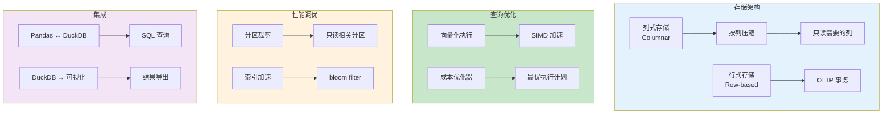

# L53: DuckDB OLAP 实战与性能调优

> **课程编号**: L53
> **所属阶段**: Stage 5 - 数据工程
> **预计时长**: 3 小时
> **难度**: ⭐⭐⭐⭐☆
> **前置课程**: L49
> **版本**: v1.0
> **最后更新**: 2026-07-23
> **核心版本**: Python 3.13


---



---

## 📌 学习目标

完成本课程后，你将能够：

1. **掌握 DuckDB OLAP 架构**：理解列式存储与向量化执行引擎
2. **精通 SQL 扩展语法**：熟悉 DuckDB 特有的 SQL 扩展
3. **实现高效数据分析**：利用 DuckDB 进行大规模数据分析
4. **优化查询性能**：掌握索引、分区、缓存等优化技巧
5. **集成 Pandas 工作流**：将 DuckDB 无缝接入数据分析管道

---

## 📚 课程内容

### 第一部分：DuckDB OLAP 架构

#### 1.1 列式存储 vs 行式存储

```python
import duckdb

# DuckDB 使用列式存储，适合 OLAP 场景
con = duckdb.connect(":memory:")

# 创建示例数据
con.execute("""
    CREATE TABLE sales AS
    SELECT
        i AS order_id,
        CAST(RANDOM() * 1000 AS INTEGER) AS product_id,
        CAST(RANDOM() * 100 AS INTEGER) AS customer_id,
        CAST(RANDOM() * 10000 / 100.0 AS DECIMAL(10,2)) AS amount,
        DATE '2024-01-01' + INTERVAL (RANDOM() * 365) DAY AS sale_date
    FROM generate_series(1, 1000000) t(i)
""")

# 分析表
print(con.execute("DESCRIBE sales").fetchdf())
```

#### 1.2 向量化执行引擎

```python
# DuckDB 的向量化执行一次处理一列数据块（Vector）
# 这比行式执行（一次处理一行）快 10-100x

# 查看 DuckDB 配置
print(con.execute("SHOW ALL").fetchdf())
```

---

### 第二部分：SQL 扩展语法

#### 2.1 SAMPLE 子句（数据采样）

```python
# 随机采样 1%
result = con.execute("""
    SELECT * FROM sales SAMPLE (1)
""").fetchdf()

# 采样 1000 行
result = con.execute("""
    SELECT * FROM sales USING SAMPLE 1000 ROWS
""").fetchdf()

# 分层采样
result = con.execute("""
    SELECT * FROM sales SAMPLE (10 PERCENT) BY (customer_id)
""").fetchdf()
```

#### 2.2 QUALIFY 子句（窗口函数过滤）

```python
# QUALIFY 等价于 WHERE + 窗口函数组合
result = con.execute("""
    SELECT
        customer_id,
        SUM(amount) AS total_sales,
        RANK() OVER (ORDER BY SUM(amount) DESC) AS sales_rank
    FROM sales
    GROUP BY customer_id
    QUALIFY RANK() OVER (ORDER BY SUM(amount) DESC) <= 10
""").fetchdf()
```

#### 2.3 PIVOT 语句

```python
# 创建透视表
result = con.execute("""
    PIVOT sales
    ON strftime(sale_date, '%Y-%m')
    USING SUM(amount)
    GROUP BY customer_id
    LIMIT 10
""").fetchdf()
```

#### 2.4 LATERAL JOIN

```python
# LATERAL 子查询
result = con.execute("""
    SELECT
        p.product_id,
        p.total_sales,
        s.top_customer
    FROM (
        SELECT product_id, SUM(amount) AS total_sales
        FROM sales
        GROUP BY product_id
        ORDER BY total_sales DESC
        LIMIT 5
    ) p,
    LATERAL (
        SELECT customer_id AS top_customer
        FROM sales s2
        WHERE s2.product_id = p.product_id
        GROUP BY customer_id
        ORDER BY SUM(s2.amount) DESC
        LIMIT 1
    ) s
""").fetchdf()
```

---

### 第三部分：性能优化

#### 3.1 索引策略

```python
# 创建排序键（类似索引）
con.execute("""
    CREATE TABLE sales_sorted
    AS SELECT * FROM sales
    ORDER BY customer_id, sale_date
""")

# 使用 Bloom Filter 索引
con.execute("""
    CREATE INDEX bloom_customer
    ON sales USING BLOOMFILTER(customer_id)
""")
```

#### 3.2 分区表

```python
# 按时间分区
con.execute("""
    CREATE TABLE sales_partitioned (
        order_id BIGINT,
        product_id INTEGER,
        customer_id INTEGER,
        amount DECIMAL(10,2),
        sale_date DATE
    )
    PARTITION BY RANGE (sale_date) (
        PARTITION Jan START 2024-01-01 END 2024-02-01,
        PARTITION Feb START 2024-02-01 END 2024-03-01,
        PARTITION Mar START 2024-03-01 END 2024-04-01
    )
""")

# 插入数据
con.execute("""
    INSERT INTO sales_partitioned SELECT * FROM sales
""")
```

#### 3.3 物化视图

```python
# 创建物化视图
con.execute("""
    CREATE MATERIALIZED VIEW monthly_sales AS
    SELECT
        strftime(sale_date, '%Y-%m') AS month,
        customer_id,
        SUM(amount) AS total_sales,
        COUNT(*) AS order_count
    FROM sales
    GROUP BY 1, 2
""")

# 查询物化视图
result = con.execute("SELECT * FROM monthly_sales LIMIT 10").fetchdf()
```

#### 3.4 查询优化提示

```python
# 强制使用特定 join 顺序
result = con.execute("""
    SELECT /*+ REORDER_JOINS(customer, product) */
        c.customer_id,
        p.product_id,
        SUM(s.amount) AS total
    FROM sales s
    JOIN (SELECT * FROM customers) c ON s.customer_id = c.id
    JOIN (SELECT * FROM products) p ON s.product_id = p.id
    GROUP BY 1, 2
""").fetchdf()

# 并行执行
con.execute("SET threads=8")
```

---

### 第四部分：Pandas 集成

#### 4.1 DataFrame 读写

```python
import pandas as pd

# 从 Pandas 读取（零拷贝）
pandas_df = pd.DataFrame({"a": range(100)})
con.execute("CREATE TABLE t AS SELECT * FROM pandas_df")

# 导出为 Pandas（零拷贝）
result = con.execute("SELECT * FROM t").df()

# Arrow 格式（高效传输）
arrow_table = con.execute("SELECT * FROM sales LIMIT 1000").arrow()
```

#### 4.2 数据库文件操作

```python
# 创建持久化数据库
con = duckdb.connect("analytics.db")

# 附加 Parquet 文件（无需导入）
result = con.execute("""
    SELECT
        customer_id,
        SUM(amount) AS total
    FROM 'data/sales/*.parquet'
    GROUP BY customer_id
""").fetchdf()

# 附加 CSV 文件
result = con.execute("""
    SELECT * FROM read_csv_auto('data/sales.csv')
""").fetchdf()
```

#### 4.3 迁移工作流

```python
# Pandas → DuckDB 加速分析
def pandas_to_duckdb_analytics(df: pd.DataFrame) -> pd.DataFrame:
    """将 Pandas 数据迁移到 DuckDB 进行分析"""
    con = duckdb.connect(":memory:")

    # 注册 DataFrame（零拷贝）
    con.execute("CREATE VIEW source_data AS SELECT * FROM df")

    # 执行复杂分析（比 Pandas 快 10-100x）
    result = con.execute("""
        WITH ranked AS (
            SELECT
                customer_id,
                product_id,
                amount,
                RANK() OVER (PARTITION BY customer_id ORDER BY amount DESC) AS rank
            FROM source_data
        )
        SELECT * FROM ranked WHERE rank <= 3
    """).df()

    return result
```

---

### 第五部分：实战案例

#### 5.1 用户留存分析

```python
# 计算用户留存率
result = con.execute("""
    WITH first_purchase AS (
        SELECT
            customer_id,
            MIN(sale_date) AS first_date
        FROM sales
        GROUP BY customer_id
    ),
    cohort AS (
        SELECT
            s.customer_id,
            fp.first_date,
            DATE_TRUNC('month', fp.first_date) AS cohort_month,
            DATE_TRUNC('month', s.sale_date) AS activity_month,
            EXTRACT(MONTH FROM AGE(s.sale_date, fp.first_date)) AS month_num
        FROM sales s
        JOIN first_purchase fp ON s.customer_id = fp.customer_id
    )
    SELECT
        cohort_month,
        COUNT(DISTINCT customer_id) AS cohort_size,
        SUM(CASE WHEN month_num = 0 THEN 1 ELSE 0 END) AS m0,
        SUM(CASE WHEN month_num = 1 THEN 1 ELSE 0 END) AS m1,
        SUM(CASE WHEN month_num = 2 THEN 1 ELSE 0 END) AS m2,
        SUM(CASE WHEN month_num = 3 THEN 1 ELSE 0 END) AS m3
    FROM cohort
    GROUP BY cohort_month
    ORDER BY cohort_month
""").fetchdf()

print(result)
```

#### 5.2 漏斗分析

```python
# 用户行为漏斗分析
result = con.execute("""
    WITH events AS (
        SELECT
            user_id,
            event_type,
            event_time,
            ROW_NUMBER() OVER (PARTITION BY user_id ORDER BY event_time) AS step
        FROM user_events
    ),
    funnel AS (
        SELECT
            'view' AS stage,
            COUNT(DISTINCT user_id) AS users
        FROM events WHERE event_type = 'page_view'
        UNION ALL
        SELECT
            'click' AS stage,
            COUNT(DISTINCT user_id) AS users
        FROM events WHERE event_type = 'button_click'
        UNION ALL
        SELECT
            'purchase' AS stage,
            COUNT(DISTINCT user_id) AS users
        FROM events WHERE event_type = 'purchase'
    )
    SELECT
        stage,
        users,
        ROUND(100.0 * users / LAG(users) OVER (ORDER BY stage), 2) AS conversion_rate
    FROM funnel
""").fetchdf()

print(result)
```

---


### 第六部分：DuckDB 高级特性

#### 4.1 窗口函数扩展

```python
# DuckDB 扩展窗口函数

# 1. EXCLUDE CURRENT ROW（排除当前行）
result = con.execute("""
    SELECT
        customer_id,
        sale_date,
        amount,
        SUM(amount) OVER (
            PARTITION BY customer_id
            ORDER BY sale_date
            EXCLUDE CURRENT ROW
        ) AS sum_excluding_current
    FROM sales
    WHERE customer_id <= 5
    ORDER BY customer_id, sale_date
""").fetchdf()

# 2. GROUPS 和 RANGE 模式
result = con.execute("""
    SELECT
        sale_date,
        amount,
        SUM(amount) OVER (
            ORDER BY sale_date
            GROUPS BETWEEN 1 PRECEDING AND 1 FOLLOWING
        ) AS sum_groups_window
    FROM sales
    WHERE customer_id <= 1
    ORDER BY sale_date
""").fetchdf()

# 3. 过滤聚合
result = con.execute("""
    SELECT
        customer_id,
        SUM(amount) AS total,
        SUM(amount) FILTER (WHERE amount > 100) AS large_orders,
        AVG(amount) FILTER (WHERE amount > 100) AS avg_large
    FROM sales
    WHERE customer_id <= 5
    GROUP BY customer_id
""").fetchdf()
```

#### 4.2 时间序列分析

```python
# DuckDB 时间序列扩展

# 1. 时间范围生成
result = con.execute("""
    SELECT * FROM range(
        DATE '2024-01-01',
        DATE '2024-01-10',
        INTERVAL '1 day'
    ) AS t(date_range)
""").fetchdf()

# 2. 时间序列补全（处理缺失日期）
result = con.execute("""
    WITH daily_sales AS (
        SELECT
            sale_date,
            SUM(amount) AS daily_total
        FROM sales
        WHERE customer_id <= 1
        GROUP BY sale_date
    )
    SELECT
        d.date_range AS sale_date,
        COALESCE(ds.daily_total, 0) AS daily_total
    FROM (
        SELECT * FROM range(
            (SELECT MIN(sale_date) FROM sales WHERE customer_id <= 1),
            (SELECT MAX(sale_date) + INTERVAL '1 day' FROM sales WHERE customer_id <= 1),
            INTERVAL '1 day'
        ) AS t(date_range)
    ) d
    LEFT JOIN daily_sales ds ON d.date_range = ds.sale_date
    ORDER BY d.date_range
""").fetchdf()

# 3. 移动统计
result = con.execute("""
    SELECT
        sale_date,
        daily_total,
        AVG(daily_total) OVER (
            ORDER BY sale_date
            ROWS BETWEEN 6 PRECEDING AND CURRENT ROW
        ) AS rolling_7d_avg,
        daily_total - AVG(daily_total) OVER (
            ORDER BY sale_date
            ROWS BETWEEN 6 PRECEDING AND CURRENT ROW
        ) AS vs_7d_avg
    FROM (
        SELECT
            sale_date,
            SUM(amount) AS daily_total
        FROM sales
        WHERE customer_id <= 1
        GROUP BY sale_date
    ) daily
    ORDER BY sale_date
""").fetchdf()
```

#### 4.3 分区表与范围分区

```python
# DuckDB 分区表

# 1. 创建分区表
con.execute("""
    CREATE TABLE sales_partitioned (
        order_id BIGINT,
        product_id INTEGER,
        customer_id INTEGER,
        amount DECIMAL(10,2),
        sale_date DATE
    )
    PARTITION BY RANGE (sale_date) (
        PARTITION p2024_q1 VALUES < '2024-04-01',
        PARTITION p2024_q2 VALUES < '2024-07-01',
        PARTITION p2024_q3 VALUES < '2024-10-01',
        PARTITION p2024_q4 VALUES <= '2024-12-31'
    )
""")

# 2. 插入数据
con.execute("""
    INSERT INTO sales_partitioned
    SELECT * FROM sales
""")

# 3. 查询特定分区（自动裁剪）
result = con.execute("""
    SELECT *
    FROM sales_partitioned
    WHERE sale_date >= '2024-06-01' AND sale_date < '2024-07-01'
""").fetchdf()

# 4. 查看分区信息
print(con.execute("""
    SELECT 
        partition_name,
        record_count,
        file_size
    FROM duckdb_tables()
    WHERE table_name = 'sales_partitioned'
""").fetchdf())
```

#### 4.4 物化视图与缓存

```python
# 物化视图（虽然 DuckDB 不直接支持，但可以用表模拟）

# 创建物化视图：月度汇总
con.execute("""
    CREATE TABLE mv_monthly_sales AS
    SELECT
        strftime(sale_date, '%Y-%m') AS month,
        COUNT(*) AS order_count,
        SUM(amount) AS total_amount,
        AVG(amount) AS avg_amount,
        COUNT(DISTINCT customer_id) AS unique_customers
    FROM sales
    GROUP BY strftime(sale_date, '%Y-%m')
    ORDER BY month
""")

# 使用物化视图查询
result = con.execute("""
    SELECT * FROM mv_monthly_sales
    ORDER BY month DESC
    LIMIT 10
""").fetchdf()

# 刷新物化视图
con.execute("""
    INSERT INTO mv_monthly_sales
    SELECT
        strftime(sale_date, '%Y-%m') AS month,
        COUNT(*) AS order_count,
        SUM(amount) AS total_amount,
        AVG(amount) AS avg_amount,
        COUNT(DISTINCT customer_id) AS unique_customers
    FROM sales
    WHERE strftime(sale_date, '%Y-%m') NOT IN (
        SELECT month FROM mv_monthly_sales
    )
    GROUP BY strftime(sale_date, '%Y-%m')
""")
```

### 第七部分：与 Python 生态集成

#### 5.1 Pandas 集成

```python
import pandas as pd

# DuckDB 与 Pandas 互转

# 1. Pandas → DuckDB
df = pd.DataFrame({
    "a": range(1000000),
    "b": range(1000000, 2000000),
})

# 方法1：直接创建
con.execute("CREATE TABLE df_table AS SELECT * FROM df")

# 方法2：使用 append
con.execute("CREATE TABLE df_table2 (a BIGINT, b BIGINT)")
con.execute("INSERT INTO df_table2 SELECT * FROM df")

# 2. DuckDB → Pandas
result_df = con.execute("SELECT * FROM sales LIMIT 1000").df()
print(type(result_df))  # <class 'pandas.core.frame.DataFrame'>

# 3. 高效读取大 CSV
# DuckDB 比 Pandas read_csv 快 10x+
df = con.execute("""
    SELECT * FROM read_csv_auto('large_file.csv')
""").df()
```

#### 5.2 Polars 集成

```python
import polars as pl

# DuckDB → Polars
result_pl = con.execute("SELECT * FROM sales LIMIT 1000").pl()

# Polars → DuckDB
pl_df = pl.DataFrame({"a": range(100), "b": range(100, 200)})
con.execute("CREATE TABLE pl_table AS SELECT * FROM pl_df")

# 利用 DuckDB 的向量化执行 + Polars 的 API
result = con.execute("""
    SELECT 
        customer_id,
        AVG(amount) AS avg_amount
    FROM sales
    GROUP BY customer_id
    ORDER BY avg_amount DESC
    LIMIT 10
""").pl()
```

#### 5.3 Arrow 集成

```python
import pyarrow as pa

# DuckDB → Arrow
table = con.execute("SELECT * FROM sales LIMIT 1000").arrow()

# Arrow → DuckDB
con.execute("CREATE TABLE arrow_table AS SELECT * FROM table")

# 使用 Arrow 进行零拷贝数据交换
print(f"Arrow table size: {table.nbytes / 1024 / 1024:.2f} MB")
```

#### 5.4 数据可视化集成

```python
# 使用 DuckDB + Plotly 进行分析可视化

import plotly.express as px
import plotly.graph_objects as go

# 获取月度趋势数据
monthly = con.execute("""
    SELECT
        strftime(sale_date, '%Y-%m') AS month,
        SUM(amount) AS total_sales,
        COUNT(*) AS order_count
    FROM sales
    GROUP BY strftime(sale_date, '%Y-%m')
    ORDER BY month
""").df()

# 趋势图
fig = px.line(
    monthly, 
    x='month', 
    y='total_sales',
    title='月度销售额趋势'
)
fig.show()

# 分布图
fig = px.histogram(
    con.execute("""
        SELECT amount FROM sales WHERE customer_id <= 100
    """).df(),
    x='amount',
    nbins=50,
    title='订单金额分布'
)
fig.show()
```

### 第八部分：生产环境部署

#### 6.1 嵌入式部署

```python
# DuckDB 可以嵌入到应用程序中，无需独立服务

# 1. 本地文件数据库
con = duckdb.connect("/path/to/database.duckdb")

# 2. 内存数据库（适合 ETL）
con = duckdb.connect(":memory:")

# 3. 启动参数优化
con = duckdb.connect(
    database=":memory:",
    config={
        "threads": "8",           # 使用 8 个线程
        "max_memory": "8GB",       # 最大内存 8GB
        "enable_progress_bar": "true",
    }
)

# 4. 持久化配置
con.execute("SET enable_progress_bar=true")
con.execute("SET threads=8")
con.execute("SET max_memory='8GB'")
```

#### 6.2 并行查询优化

```python
# 充分利用多核

# 1. 检查可用线程
print(con.execute("SELECT current_setting('threads')").fetchone())

# 2. 并行读取 Parquet
result = con.execute("""
    SELECT * FROM read_parquet('/path/to/*.parquet')
""").fetchdf()

# 3. 并行聚合
result = con.execute("""
    SELECT 
        customer_id,
        SUM(amount) AS total
    FROM sales
    GROUP BY customer_id
""").fetchdf()

# 4. 检查执行计划（确认并行执行）
print(con.execute("EXPLAIN ANALYZE " + """
    SELECT 
        customer_id,
        SUM(amount) AS total
    FROM sales
    GROUP BY customer_id
""").fetchdf())
```

#### 6.3 内存管理

```python
# DuckDB 内存管理

# 1. 设置内存限制
con.execute("SET memory_limit='4GB'")

# 2. 垃圾回收
con.execute("CALL garbage_collect()")

# 3. 监控内存使用
memory_usage = con.execute("""
    SELECT 
        peak_memory_usage / 1024 / 1024 AS peak_mb,
        memory_usage / 1024 / 1024 AS current_mb
    FROM duckdb_memory_usage()
""").fetchdf()

print(memory_usage)

# 4. 大数据查询分批处理
chunk_size = 1000000
offset = 0

while True:
    result = con.execute(f"""
        SELECT * FROM sales
        LIMIT {chunk_size} OFFSET {offset}
    """).fetchdf()
    
    if len(result) == 0:
        break
    
    # 处理每个 chunk
    process_chunk(result)
    
    offset += chunk_size
    print(f"Processed {offset} rows...")
```

#### 6.4 数据备份与恢复

```python
# DuckDB 数据备份

# 1. 导出为 Parquet
con.execute("""
    COPY sales TO '/path/to/sales.parquet'
    (FORMAT PARQUET, COMPRESSION SNAPPY)
""")

# 2. 导出为 CSV
con.execute("""
    COPY (
        SELECT * FROM sales LIMIT 1000
    ) TO '/path/to/sales_sample.csv'
    (FORMAT CSV, HEADER TRUE)
""")

# 3. 导出为 JSON
con.execute("""
    COPY (
        SELECT * FROM sales LIMIT 100
    ) TO '/path/to/sales.json'
    (FORMAT JSON)
""")

# 4. 数据库备份（复制文件）
import shutil
import os

source_db = "/path/to/database.duckdb"
backup_db = "/path/to/database_backup.duckdb"

# 关闭连接后复制
con.close()
shutil.copy2(source_db, backup_db)

# 5. 恢复
con = duckdb.connect(backup_db)
```

### 第九部分：常见问题与面试题

#### 7.1 DuckDB vs 其他数据库

```python
"""
Q: DuckDB 和 PostgreSQL/MySQL 有什么区别？

A: 
- DuckDB: 列式存储，向量化执行，OLAP 优化，无需独立服务
- PostgreSQL: 行式存储，行式执行，OLTP 为主，需要独立服务
- ClickHouse: 列式存储，OLAP 优化，需要独立服务

DuckDB 优势：
1. 嵌入式，无需运维
2. 分析查询快 10-100x
3. 内存高效
4. 与 Python/Pandas 无缝集成

DuckDB 劣势：
1. 不支持高并发写入
2. 不支持复杂事务
3. 不适合 OLTP 场景
"""

"""
Q: DuckDB 和 ClickHouse 有什么区别？

A:
- DuckDB: 单机嵌入式，分析查询
- ClickHouse: 分布式，实时写入，支持高并发

选择 DuckDB：
- 数据量 < 1TB
- 主要是分析查询
- 需要嵌入应用程序
- 不想运维独立数据库

选择 ClickHouse：
- 数据量 > 10TB
- 需要实时写入
- 需要高并发查询
- 需要分布式集群
"""
```

#### 7.2 性能优化技巧

```python
"""
Q: 如何优化 DuckDB 查询性能？

A:
1. 使用合适的数据类型（INTEGER 比 BIGINT 快）
2. 为过滤列创建索引
3. 使用 Parquet 格式存储
4. 利用分区表裁剪
5. 避免 SELECT *
6. 使用向量化函数
7. 批量插入代替单条插入
"""

# 性能对比示例
import time

# 准备数据
con.execute("""
    CREATE TABLE test_data AS
    SELECT
        i AS id,
        RANDOM() * 1000 AS value,
        DATE '2024-01-01' + INTERVAL (i % 365) DAY AS date_col
    FROM generate_series(1, 10000000) t(i)
""")

# 优化前：SELECT *
start = time.time()
result = con.execute("SELECT * FROM test_data").fetchdf()
print(f"SELECT *: {time.time() - start:.2f}s")

# 优化后：只选需要的列
start = time.time()
result = con.execute("SELECT id, value FROM test_data").fetchdf()
print(f"SELECT id, value: {time.time() - start:.2f}s")

# 优化前：无过滤
start = time.time()
result = con.execute("SELECT COUNT(*) FROM test_data").fetchdf()
print(f"无过滤 COUNT: {time.time() - start:.2f}s")

# 优化后：添加过滤
start = time.time()
result = con.execute("""
    SELECT COUNT(*) FROM test_data 
    WHERE date_col >= '2024-06-01'
""").fetchdf()
print(f"有过滤 COUNT: {time.time() - start:.2f}s")
```

#### 7.3 实际应用场景

```python
"""
Q: DuckDB 适合哪些应用场景？

A:
1. 数据分析/BI
   - 快速探索性分析
   - 临时查询
   - 数据验证

2. ETL/数据管道
   - 数据转换
   - 数据聚合
   - 数据导出

3. 嵌入式分析
   - 桌面应用
   - 边缘设备
   - 单机工具

4. 数据湖查询
   - 直接查询 Parquet/CSV
   - 跨数据源查询
"""

# 实际案例：日志分析
con.execute("""
    CREATE TABLE access_logs AS
    SELECT
        i AS id,
        '2024-01-01' + INTERVAL (i % 365) DAY AS timestamp,
        CONCAT('192.168.1.', i % 256) AS ip,
        CASE (i % 5)
            WHEN 0 THEN '/api/users'
            WHEN 1 THEN '/api/products'
            WHEN 2 THEN '/api/orders'
            WHEN 3 THEN '/api/health'
            ELSE '/'
        END AS path,
        (RANDOM() * 500 + 50)::INT AS latency_ms,
        CASE WHEN RANDOM() > 0.95 THEN 500 ELSE 200 END AS status
    FROM generate_series(1, 1000000) t(i)
""")

# 分析请求量趋势
print(con.execute("""
    SELECT
        strftime(timestamp, '%Y-%m-%d') AS date,
        COUNT(*) AS request_count,
        AVG(latency_ms) AS avg_latency,
        SUM(CASE WHEN status >= 400 THEN 1 ELSE 0 END) * 100.0 / COUNT(*) AS error_rate
    FROM access_logs
    GROUP BY strftime(timestamp, '%Y-%m-%d')
    ORDER BY date
""").fetchdf())

# 分析慢请求
print(con.execute("""
    SELECT
        path,
        COUNT(*) AS request_count,
        AVG(latency_ms) AS avg_latency,
        PERCENTILE_CONT(0.95) WITHIN GROUP (latency_ms) AS p95_latency,
        MAX(latency_ms) AS max_latency
    FROM access_logs
    GROUP BY path
    HAVING AVG(latency_ms) > 200
    ORDER BY avg_latency DESC
""").fetchdf())
```


---

## 📂 课程资源

### 示例代码

- `examples/01_duckdb_basics.py` - DuckDB 基础操作
- `examples/02_sql_extensions.py` - SQL 扩展语法

### 练习项目

- `exercises/exercise_01_ecommerce_analytics.py` - 电商数据分析

---

## 🧪 测试

运行测试：

```bash
cd stage5-data-engineering/lessons/L53-duckdb-olap
pytest tests/ -v
```

---

## 📖 参考资料

- [DuckDB 官方文档](https://duckdb.org/docs/)
- [DuckDB SQL 语法](https://duckdb.org/docs/sql/)
- [DuckDB Pandas 集成](https://duckdb.org/docs/api/python/overview)

---

## ✅ 完成标准

- [ ] 完成所有示例代码运行
- [ ] 完成练习项目
- [ ] 通过全部测试

---

## 🔗 下一步

- [Stage 6: AI Agent 开发](../../../stage6-ai-agent/)

---

**最后更新**: 2026-07-17
