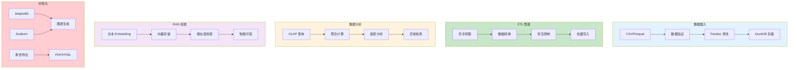

# P06: 数据分析与 RAG 智能报告平台 - 详细课程

> **课程编号**: P06
> **所属阶段**: Stage 5 - 数据工程
> **预计时长**: 6-10 小时
> **难度**: ⭐⭐⭐⭐⭐（专家级）
> **前置课程**: L47-L53（全部 Stage 5 课程）
> **版本**: v1.0
> **核心版本**: Python 3.13

---

## 📚 项目概述

### DataRag - 数据分析与 RAG 智能报告平台

本项目整合 Stage 5 所有知识点，构建一个完整的数据分析与 RAG 智能报告平台：



---

## 📋 目录

- [第一章：项目架构](#第一章项目架构)
- [第二章：数据加载与清洗](#第二章数据加载与清洗)
- [第三章：异步 ETL 管道](#第三章异步-etl-管道)
- [第四章：数据分析与 OLAP](#第四章数据分析与-olap)
- [第五章：RAG 向量检索](#第五章rag-向量检索)
- [第六章：数据可视化](#第六章数据可视化)

---

## 第一章：项目架构

### 1.1 技术栈

| 组件 | 技术 | 课程来源 |
|------|------|----------|
| 数据处理 | Pandas + PyArrow | L47 |
| 可视化 | Matplotlib + Seaborn | L48 |
| OLAP 数据库 | DuckDB | L49, L53 |
| 数据管道 | asyncio + aiohttp | L51 |
| 向量检索 | NumPy + RAG | L52 |

### 1.2 项目结构

```
P06-data-rag/
├── app/
│   ├── __init__.py
│   ├── main.py              # 应用入口
│   ├── config.py            # 配置管理
│   ├── data/
│   │   ├── loader.py       # 数据加载
│   │   ├── cleaner.py       # 数据清洗
│   │   └── validator.py     # 数据验证
│   ├── pipeline/
│   │   ├── etl.py          # ETL 管道
│   │   └── async_fetcher.py # 异步抓取
│   ├── analytics/
│   │   ├── olap.py         # OLAP 查询
│   │   └── aggregator.py    # 聚合计算
│   ├── rag/
│   │   ├── embedder.py      # Embedding
│   │   ├── vector_store.py  # 向量存储
│   │   └── retriever.py     # 检索器
│   └── visualization/
│       ├── charts.py         # 图表生成
│       └── reporter.py       # 报告导出
├── tests/
└── pyproject.toml
```

---

## 第二章：数据加载与清洗

### 2.1 数据加载 (参考 L47)

```python
import pandas as pd
from pathlib import Path

def load_data(file_path: str) -> pd.DataFrame:
    """加载数据文件，支持多种格式"""
    path = Path(file_path)
    suffix = path.suffix.lower()

    if suffix == ".csv":
        return pd.read_csv(file_path)
    elif suffix == ".parquet":
        return pd.read_parquet(file_path)
    elif suffix in [".xlsx", ".xls"]:
        return pd.read_excel(file_path)
    else:
        raise ValueError(f"Unsupported format: {suffix}")
```

### 2.2 PyArrow 加速 (参考 L47)

```python
def load_data_optimized(file_path: str) -> pd.DataFrame:
    """使用 PyArrow 后端加速"""
    return pd.read_parquet(
        file_path,
        dtype_backend="pyarrow"  # Pandas 2.0+ 特性
    )
```

### 2.3 数据清洗 (参考 L47, L50)

```python
def clean_data(df: pd.DataFrame) -> pd.DataFrame:
    """数据清洗流水线"""
    df = df.copy()

    # 1. 类型优化
    for col in df.select_dtypes(include=["int"]).columns:
        df[col] = df[col].astype("int32")  # 节省内存

    # 2. 缺失值处理
    numeric_cols = df.select_dtypes(include=["number"]).columns
    df[numeric_cols] = df[numeric_cols].fillna(df[numeric_cols].median())

    # 3. 重复行删除
    df = df.drop_duplicates()

    # 4. 异常值处理
    for col in numeric_cols:
        q1, q3 = df[col].quantile([0.25, 0.75])
        iqr = q3 - q1
        lower, upper = q1 - 1.5 * iqr, q3 + 1.5 * iqr
        df = df[(df[col] >= lower) & (df[col] <= upper)]

    return df
```

---

## 第三章：异步 ETL 管道

### 3.1 异步数据抓取 (参考 L51)

```python
import asyncio
import aiohttp
from typing import AsyncGenerator

async def fetch_data(url: str) -> dict:
    """异步 HTTP 请求"""
    async with aiohttp.ClientSession() as session:
        async with session.get(url) as response:
            return await response.json()

async def batch_fetch(urls: list[str]) -> list[dict]:
    """批量异步请求"""
    tasks = [fetch_data(url) for url in urls]
    return await asyncio.gather(*tasks)
```

### 3.2 生产者-消费者模式 (参考 L51)

```python
async def etl_pipeline(
    urls: list[str],
    batch_size: int = 100,
    max_workers: int = 10
) -> AsyncGenerator[pd.DataFrame, None]:
    """ETL 管道：抓取 -> 转换 -> 批量产出"""

    queue: asyncio.Queue = asyncio.Queue(maxsize=batch_size)
    semaphore = asyncio.Semaphore(max_workers)  # 背压控制

    async def producer():
        """生产者：抓取数据"""
        for url in urls:
            async with semaphore:
                data = await fetch_data(url)
                await queue.put(data)
        # 发送结束信号
        for _ in range(max_workers):
            await queue.put(None)

    async def consumer():
        """消费者：批量处理"""
        batch = []
        while True:
            item = await queue.get()
            if item is None:
                if batch:
                    yield pd.DataFrame(batch)
                break
            batch.append(item)
            if len(batch) >= batch_size:
                yield pd.DataFrame(batch)
                batch = []
            queue.task_done()

    # 并行执行
    await asyncio.gather(producer(), consumer())
```

---

## 第四章：数据分析与 OLAP

### 4.1 DuckDB 查询 (参考 L49, L53)

```python
import duckdb

def analyze_with_duckdb(df: pd.DataFrame) -> dict:
    """使用 DuckDB 进行 OLAP 分析"""
    con = duckdb.connect(":memory:")
    con.register("sales_data", df)

    # 1. 销售汇总
    summary = con.execute("""
        SELECT
            category,
            COUNT(*) as count,
            SUM(amount) as total_amount,
            AVG(amount) as avg_amount
        FROM sales_data
        GROUP BY category
        ORDER BY total_amount DESC
    """).fetchdf()

    # 2. 月度趋势
    monthly = con.execute("""
        SELECT
            strftime(date, '%Y-%m') as month,
            SUM(amount) as total
        FROM sales_data
        GROUP BY month
        ORDER BY month
    """).fetchdf()

    # 3. Top 客户
    top_customers = con.execute("""
        SELECT
            customer_id,
            SUM(amount) as total
        FROM sales_data
        GROUP BY customer_id
        ORDER BY total DESC
        LIMIT 10
    """).fetchdf()

    return {
        "summary": summary,
        "monthly": monthly,
        "top_customers": top_customers
    }
```

### 4.2 查询优化 (参考 L53)

```python
def optimized_aggregation(df: pd.DataFrame) -> pd.DataFrame:
    """优化的聚合查询"""
    # 先过滤再聚合，减少数据量
    con = duckdb.connect(":memory:")
    con.register("data", df)

    return con.execute("""
        WITH filtered AS (
            SELECT *
            FROM data
            WHERE date >= '2024-01-01'
              AND amount > 0
        )
        SELECT
            category,
            date_trunc('month', date) as month,
            SUM(amount) as total,
            COUNT(*) as cnt,
            AVG(amount) as avg
        FROM filtered
        GROUP BY category, date_trunc('month', date)
        ORDER BY total DESC
    """).fetchdf()
```

---

## 第五章：RAG 向量检索

### 5.1 Embedding 生成 (参考 L52)

```python
import numpy as np
from typing import list

def simple_embedding(text: str, dim: int = 128) -> np.ndarray:
    """简化版 Embedding（实际使用 OpenAI/Cohere）"""
    # 基于词频的伪向量
    words = set(text.lower().split())
    vec = np.zeros(dim)
    keywords = ["sales", "revenue", "customer", "product", "order",
                "date", "amount", "category", "trend", "growth"]

    for i, kw in enumerate(keywords[:dim]):
        if kw in words:
            vec[i] = 1.0
    return vec / (np.linalg.norm(vec) + 1e-8)

def batch_embed(texts: list[str], dim: int = 128) -> np.ndarray:
    """批量 Embedding"""
    return np.array([simple_embedding(t, dim) for t in texts])
```

### 5.2 余弦相似度检索 (参考 L52)

```python
def cosine_similarity(a: np.ndarray, b: np.ndarray) -> float:
    """计算余弦相似度"""
    return np.dot(a, b) / (np.linalg.norm(a) * np.linalg.norm(b) + 1e-8)

def batch_similarity(query: np.ndarray, docs: np.ndarray) -> np.ndarray:
    """批量计算相似度"""
    # 向量化计算
    query_norm = query / np.linalg.norm(query)
    doc_norms = docs / np.linalg.norm(docs, axis=1, keepdims=True)
    return np.dot(doc_norms, query_norm)

def retrieve_top_k(
    query: str,
    documents: list[str],
    embeddings: np.ndarray,
    k: int = 5
) -> list[tuple[int, float]]:
    """Top-K 检索"""
    query_vec = simple_embedding(query)

    # 批量计算相似度
    similarities = batch_similarity(query_vec, embeddings)

    # 返回 Top-K
    top_indices = np.argsort(similarities)[::-1][:k]
    return [(idx, similarities[idx]) for idx in top_indices]
```

### 5.3 RAG 问答 (参考 L52)

```python
def rag_query(
    question: str,
    documents: list[str],
    embeddings: np.ndarray
) -> dict:
    """RAG 查询"""
    # 1. 检索相关文档
    results = retrieve_top_k(question, documents, embeddings, k=3)

    # 2. 构建上下文
    context = "\n\n".join([
        f"[文档 {idx}] {documents[idx]}"
        for idx, score in results
    ])

    # 3. 生成答案（简化版，实际使用 LLM）
    answer = f"基于检索结果，答案如下：\n{context}"

    return {
        "question": question,
        "answer": answer,
        "sources": [
            {"doc_id": idx, "score": float(score), "content": documents[idx]}
            for idx, score in results
        ]
    }
```

---

## 第六章：数据可视化

### 6.1 Matplotlib 图表 (参考 L48)

```python
import matplotlib.pyplot as plt
import seaborn as sns

def plot_sales_trend(df: pd.DataFrame, x: str, y: str) -> plt.Figure:
    """销售趋势图"""
    fig, ax = plt.subplots(figsize=(12, 6))

    ax.plot(df[x], df[y], marker='o', linewidth=2)
    ax.fill_between(df[x], df[y], alpha=0.3)

    ax.set_xlabel(x)
    ax.set_ylabel(y)
    ax.set_title(f"{y} 趋势分析")
    ax.grid(True, alpha=0.3)

    return fig

def plot_category_distribution(df: pd.DataFrame) -> plt.Figure:
    """类别分布饼图"""
    fig, ax = plt.subplots()

    df.groupby('category')['amount'].sum().plot.pie(
        ax=ax,
        autopct='%1.1f%%',
        startangle=90
    )
    ax.set_ylabel('')
    ax.set_title('销售额类别分布')

    return fig
```

### 6.2 Seaborn 高级图表 (参考 L48)

```python
def plot_correlation_heatmap(df: pd.DataFrame) -> plt.Figure:
    """相关性热力图"""
    fig, ax = plt.subplots(figsize=(10, 8))

    numeric_cols = df.select_dtypes(include=['number']).columns
    corr = df[numeric_cols].corr()

    sns.heatmap(
        corr,
        annot=True,
        fmt='.2f',
        cmap='coolwarm',
        center=0,
        ax=ax
    )
    ax.set_title('特征相关性热力图')

    return fig

def plot_time_series_analysis(df: pd.DataFrame) -> plt.Figure:
    """时间序列分析"""
    fig, axes = plt.subplots(2, 2, figsize=(14, 10))

    # 趋势
    df.groupby('month')['amount'].sum().plot(ax=axes[0, 0])
    axes[0, 0].set_title('月度趋势')

    # 箱线图
    df.boxplot(column='amount', by='category', ax=axes[0, 1])
    axes[0, 1].set_title('类别箱线图')

    # 散点图
    df.plot.scatter(x='quantity', y='amount', ax=axes[1, 0])
    axes[1, 0].set_title('数量 vs 金额')

    # 分布
    df['amount'].hist(bins=50, ax=axes[1, 1])
    axes[1, 1].set_title('金额分布')

    return fig
```

---

## 📝 本章总结

### 整合知识点回顾

| 课程 | 知识点 | 本项目应用 |
|------|--------|------------|
| L47 | Pandas 向量化 | 数据加载与清洗 |
| L48 | 数据可视化 | Matplotlib/Seaborn 图表 |
| L49 | DuckDB | OLAP 查询分析 |
| L50 | Pandas 进阶 | 复杂数据处理 |
| L51 | 异步数据管道 | ETL 流程 |
| L52 | NumPy RAG | 向量检索与问答 |
| L53 | DuckDB OLAP | 查询优化 |

### 关键要点

1. **Pandas + PyArrow** — 数据加载 2-10x 加速
2. **DuckDB** — 嵌入式 OLAP，无需单独服务器
3. **asyncio** — 高并发数据抓取
4. **NumPy 向量检索** — RAG 基础实现
5. **Matplotlib + Seaborn** — 专业级可视化

### 学习收获

完成本项目后，你已经：
- ✅ 整合 Stage 5 所有知识点
- ✅ 构建完整的数据分析平台
- ✅ 实现 RAG 向量检索系统
- ✅ 为 Stage 6 AI Agent 开发打下坚实基础

---

## 🔗 下一步

恭喜完成 Stage 5！继续学习：

- [Stage 6: AI Agent 开发](../L54-ai-agent/) - LangChain、MCP、Agent 开发
