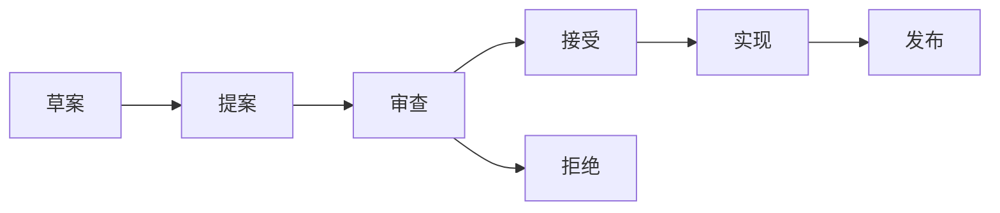

# R05: Python 路线图与未来展望

> **课程编号**: R05
> **所属阶段**: Stage R - 前沿探索实验室
> **预计时长**: 2-3 小时
> **难度**: ⭐⭐⭐
> **前置课程**: R01-R04
> **版本**: v5.0
> **最后更新**: 2026-07-22

---

## 📌 学习目标

完成本课程后，你将能够：

1. **理解 Python 发布周期**：版本发布节奏和 LTS 策略
2. **跟踪活跃 PEP**：了解哪些提案即将进入语言
3. **评估技术趋势**：AI 辅助、编译器优化、WebAssembly
4. **规划学习路径**：为未来版本做好准备

---

## 📖 课程导读

### Python 发布周期

| 阶段 | 时间 | 活动 |
|------|------|------|
| 功能冻结 | 每年 5 月 | 新功能不再添加 |
| 预发布 | 每年 7-10 月 | alpha, beta, rc |
| 正式发布 | 每年 10 月 | 新版本发布 |

### 版本支持周期

- **常规版本**：18 个月安全支持
- **LTS 版本**：5 年安全支持（由发行版决定）

---

## Part 1: PEP 流程与治理

### 1.1 PEP 生命周期



### 1.2 活跃 PEP 清单

| PEP | 状态 | 预期版本 | 描述 |
|-----|------|----------|------|
| PEP 649 | 实现中 | 3.14 | 延迟注解 |
| PEP 750 | 实现中 | 3.14 | t-string |
| PEP 770 | 草案 | 3.15+ | 宏系统 |
| PEP 782 | 草案 | TBD | Pattern Matching 改进 |

### 1.3 参与 Python 治理

```python
# 如何参与 PEP 审查

"""
1. 订阅 python-dev 邮件列表
2. 在 GitHub 上评论 PEP 仓库
3. 参与 CPython 开发者讨论
4. 编写参考实现
"""
```

---

## Part 2: 技术趋势分析

### 2.1 性能优化方向

| 方向 | 现状 | 预期 |
|------|------|------|
| JIT 编译器 | PEP 744 (3.13) | 持续优化 |
| Free-threading | PEP 703 (3.13) | 3.14 完善 |
| 内存管理 | 实验性 | 3.15+ |

### 2.2 AI 集成趋势

```python
# Python 与 AI 的融合方向

"""
1. 内置 AI 友好的语法改进
2. 标准库中的 LLM 集成
3. AI 辅助开发工具
4. 运行时优化（对 AI 推理友好）
"""

# 示例：可能的未来语法
# type Agent = LLM[SystemPrompt, Conversation]  # 概念演示
```

### 2.3 WebAssembly 支持

```python
# Pyodide 和 Python WASM 的演进

"""
Python → Wasm 的使用场景：
- 浏览器中运行 Python
- 边缘计算
- 沙箱执行
- 跨平台分发
"""
```

---

## Part 3: 学习路径规划

### 3.1 近中期（2024-2025）

| 技能 | 优先级 | 资源 |
|------|--------|------|
| 类型系统 | ⭐⭐⭐ | L10, R03 |
| 并发编程 | ⭐⭐⭐ | L14, L19, R01 |
| 异步生态 | ⭐⭐⭐ | L19, L22 |
| AI/ML | ⭐⭐⭐ | L54-L65 |

### 3.2 长期（2025-2026）

| 技能 | 优先级 | 资源 |
|------|--------|------|
| Free-threading | ⭐⭐ | R01, R02 |
| JIT 优化 | ⭐⭐ | R01 |
| WebAssembly | ⭐ | R06, R07 |
| 新语法 | ⭐ | R03, R04 |

### 3.3 技术雷达

```
[采用]  ───────────────────────────────────────> [探索]
   │                                                │
   ├── 类型系统 (typing)                           ├── t-string
   ├── asyncio 生态                              ├── Pattern Matching
   ├── FastAPI + Pydantic                        ├── PEP 770 宏
   └── 成熟库 (numpy, pandas)                   │
                                                  │
                                              JIT 编译
[成熟]  ───────────────────────────────────────> [实验]
```

---

## Part 4: 社区参与

### 4.1 贡献 Python

```python
# 贡献方式

"""
1. 文档贡献
   - 改进官方文档
   - 翻译 Python 文档

2. 代码贡献
   - CPython 核心
   - 标准库模块
   - Bpo 修复

3. PEP 贡献
   - 编写新 PEP
   - 提供反馈
   - 实现参考

4. 社区支持
   - 回答问题
   - 组织活动
   - 教学分享
"""
```

### 4.2 跟踪 Python 发展

```python
# 跟踪资源

RESOURCES = {
    "PEP 索引": "https://peps.python.org/",
    "Python 博客": "https://blog.python.org/",
    "讨论组": "https://mail.python.org/",
    "GitHub": "https://github.com/python/cpython",
    "开发者博客": "https://developers.google.com/condition",
}

# 订阅新闻
import atomics
FEEDS = {
    "PEP 更新": "https://peps.python.org/peps.rss",
    "博客": "https://blog.python.org/feeds/posts/default",
}
```

---

## 💡 关键要点

### 1. 版本策略

- Python 每年发布一个新版本
- 关注 PEP 索引了解即将变化
- 使用 `pyenv` 或 `uv` 管理多版本

### 2. 学习优先级

- 核心技能（类型、异步、并发）是常青的
- 新语法（t-string, 延迟注解）有明确迁移路径
- AI 集成是最重要的趋势方向

### 3. 社区参与

- 从文档和小修复开始贡献
- 关注你使用的库的开发和讨论
- 参与 PEP 讨论影响 Python 未来

---

## 📚 延伸阅读

- [PEP 索引](https://peps.python.org/)
- [Python 开发博客](https://blog.python.org/)
- [CPython GitHub](https://github.com/python/cpython)
- [Python 3.14 What's New](https://docs.python.org/3.14/whatsnew/)

---

## ✅ 自检清单

- [ ] 理解 Python 发布周期
- [ ] 跟踪 3-5 个活跃 PEP
- [ ] 规划未来 6 个月学习路径
- [ ] 选择一种贡献方式开始参与

---

## 🔗 下一步

- [R06: WASI 边缘部署](../R06-wasi-edge-deploy/lesson.md)
- [R07: Wasm 性能基准](../R07-wasm-benchmark/lesson.md)

---

**课程制作**: Python 3.13 全栈课程组
**最后更新**: 2026-07-22
**版本**: v5.0
